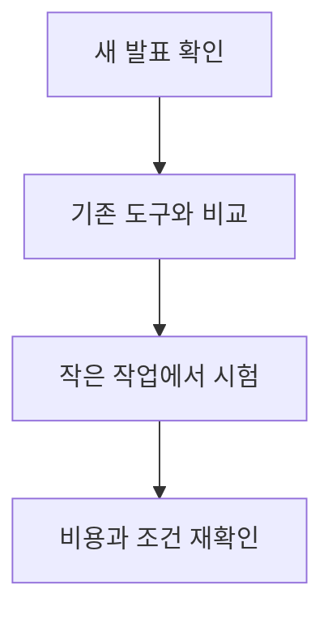
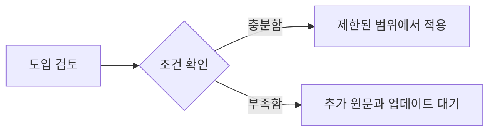

OpenAI Zero Data Retention and Private Safety Processing 관련 새 소식을 오늘 확인 가능한 직접 원문 범위에서 정리했습니다. 자동 검증 기준을 모두 충족하지 못한 날에도 발행을 건너뛰지 않기 위한 간결한 브리핑이며, 확인되지 않은 내용은 단정하지 않습니다.

## 무슨 일이 벌어진 걸까?

**한 줄 요약**: OpenAI 가 프런티어 API 모델에 데이터 무보존 옵션을 도입하고, 비공개 안전 처리 기능을 미리 공개했습니다

원문 헤드라인: OpenAI Introduces Zero Data Retention for Frontier API Models and Previews Private Safety Processing

발행일은 2026-08-19이며, 아래 내용은 <a href="#source-1" aria-label="OpenAI 출처">[1]</a>에서 확인할 수 있는 범위만 담았습니다.

- 2026년 8월 19일 OpenAI 가 조건을 충족하는 프런티어 모델 API 배포에 데이터 무보존(Zero Data Retention, ZDR) 옵션을 발표했습니다. <a href="#source-1" aria-label="OpenAI 출처">[1]</a> 원문: On August 19, 2026, OpenAI announced Zero Data Retention (ZDR) options for eligible API deployments on frontier models.

- ZDR 을 켜면 OpenAI 는 처리 후 고객의 프롬프트나 모델 출력을 보관하지 않으며, 고객이 따로 동의하지 않는 한 기업 데이터를 모델 학습에 쓰지 않습니다. <a href="#source-1" aria-label="OpenAI 출처">[1]</a> 원문: Under Zero Data Retention, OpenAI does not retain customer prompts or model outputs after processing, nor does it use enterprise data for model training unless customers opt in.

- 함께 미리 공개된 Private Safety Processing 은 프롬프트와 응답 내용을 OpenAI 직원에게 보여주지 않은 채, 서로 연관된 사용 기록에서 오남용 패턴을 찾아내는 기능입니다. <a href="#source-1" aria-label="OpenAI 출처">[1]</a> 원문: OpenAI previewed Private Safety Processing to identify misuse patterns across related interactions without revealing prompt or response content to OpenAI staff.

- 이 기능을 쓰면 데이터를 고객이 통제하는 인프라에 두거나, OpenAI 인프라에 두더라도 고객이 관리하는 암호화 키로 보호할 수 있습니다. <a href="#source-1" aria-label="OpenAI 출처">[1]</a> 원문: Private Safety Processing enables data to remain on customer-controlled infrastructure or on OpenAI infrastructure using customer-managed encryption keys.

- OpenAI 는 기술 백서를 공개하고 2026년 9월부터 Private Safety Processing 을 순차 적용할 계획입니다. <a href="#source-1" aria-label="OpenAI 출처">[1]</a> 원문: OpenAI plans to publish a technical white paper and begin rolling out Private Safety Processing in September 2026.

<figure class="news-source-image">
  
  <figcaption>OpenAI가 원문과 함께 공개한 이미지입니다. <a href="https://openai.com/index/offering-zero-data-retention-for-frontier-models" target="_blank" rel="noopener noreferrer">출처: OpenAI</a></figcaption>
</figure>

## 왜 지금 다들 이 이야기를 할까?

이 소식의 핵심은 새 기능이나 발표의 이름보다 실제 사용자와 개발자의 선택이 달라지는지에 있습니다. 지금 단계에서는 원문이 밝힌 내용과 아직 공개하지 않은 내용을 분리해서 보는 것이 안전합니다.

<figure class="news-source-image">
  
  <figcaption>OpenAI가 원문과 함께 공개한 이미지입니다. <a href="https://openai.com/index/offering-zero-data-retention-for-frontier-models" target="_blank" rel="noopener noreferrer">출처: OpenAI</a></figcaption>
</figure>

## 그래서 우리에게 뭐가 달라질까?

도입을 검토한다면 현재 쓰는 도구와 바로 교체하기보다 작은 작업에서 먼저 비교해 보는 편이 좋습니다. 제공 지역, 요금, 데이터 처리 방식처럼 의사결정에 영향을 주는 조건은 실제 사용 전에 원문에서 다시 확인해야 합니다.

<figure class="news-source-image">
  
  <figcaption>Help Net Security가 원문과 함께 공개한 이미지입니다. <a href="https://www.helpnetsecurity.com/2026/08/20/openai-private-safety-processing-zdr" target="_blank" rel="noopener noreferrer">출처: Help Net Security</a></figcaption>
</figure>

## 직접 써보거나 지켜볼 포인트

첫째, 공식 제공 범위와 사용 조건을 확인합니다. 둘째, 기존 작업 흐름에서 시간을 줄여주는지 작은 예제로 비교합니다. 셋째, 발표 내용과 실제 일반 제공 상태가 같은지 구분합니다.

## 아직은 선을 그어야 할 부분

- 초기 프리뷰 이후 Private Safety Processing 이 언제 정식 제공되는지는 아직 공개되지 않았습니다. 원문: The exact general availability schedule for Private Safety Processing following the initial preview period.

추가 원문이 공개되거나 제공 조건이 바뀌면 판단도 달라질 수 있습니다. 따라서 이 글은 오늘 시점의 출발점으로 활용하고, 실제 도입 전에는 연결된 원문을 다시 확인하는 것이 좋습니다.

## 자주 묻는 질문

### OpenAI의 제로 데이터 보존(ZDR)을 적용하면 내 데이터가 AI 모델 학습에 사용되나요?

전혀 사용되지 않습니다. ZDR 환경에서는 처리 후 프롬프트와 출력을 전혀 보존하지 않으며, 고객이 직접 동의(Opt-in)하지 않는 한 해당 데이터를 모델 학습에 활용하지 않습니다 [OpenAI 공식 발표](https://openai.com/index/offering-zero-data-retention-for-frontier-models).

### Private Safety Processing 기술은 데이터를 어떻게 보호하나요?

프롬프트나 응답 본문을 OpenAI 직원에게 공개하지 않으면서 오남용 패턴을 감시합니다. 데이터는 고객 제어 인프라에 남아있거나 고객 관리 암호화 키를 사용해 처리됩니다 [Help Net Security](https://www.helpnetsecurity.com/2026/08/20/openai-private-safety-processing-zdr).

### Private Safety Processing의 정식 출시일은 언제인가요?

OpenAI는 2026년 9월 기술 백서 공개와 함께 순차적 적용(Rollout)을 시작한다고 밝혔습니다. 다만 초기 프리뷰 기간 이후의 전체 일반 제공(GA) 정확한 일정은 아직 발표되지 않았습니다 [Help Net Security](https://www.helpnetsecurity.com/2026/08/20/openai-private-safety-processing-zdr).

## 직접 확인한 원문

<ol class="checked-source-list">
  <li id="source-1"><a href="https://openai.com/index/offering-zero-data-retention-for-frontier-models" target="_blank" rel="noopener noreferrer">OpenAI — Offering Zero Data Retention for frontier models</a> (2026-08-19)</li>
  <li id="source-2"><a href="https://www.axios.com/2026/08/19/openai-previews-zero-retention-safety-system-as-anthropic-requires-data-logs" target="_blank" rel="noopener noreferrer">Axios — OpenAI previews zero-retention safety system as Anthropic requires data logs</a> (2026-08-19)</li>
  <li id="source-3"><a href="https://www.helpnetsecurity.com/2026/08/20/openai-private-safety-processing-zdr" target="_blank" rel="noopener noreferrer">Help Net Security — OpenAI previews privacy-focused system for detecting AI misuse</a> (2026-08-20)</li>
  <li id="source-4"><a href="https://betanews.com/article/openai-private-safety-processing" target="_blank" rel="noopener noreferrer">BetaNews — OpenAI unveils privacy tool to counter Anthropic&#x27;s ZDR gap</a> (2026-08-20)</li>
</ol>

> 이 글은 위 원문을 직접 확인해 작성했습니다. 가격, 기능 범위, 지역별 제공 여부는 게시 후 바뀔 수 있으니 실제 도입 전 공식 문서를 다시 확인하세요.
