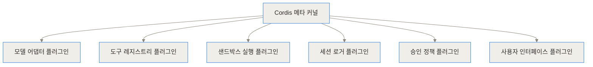
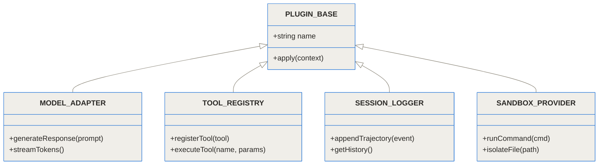
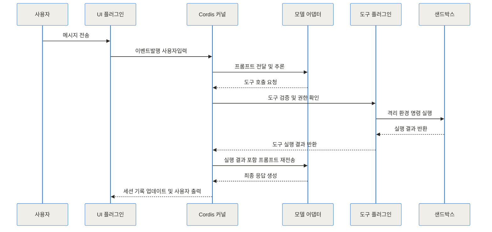
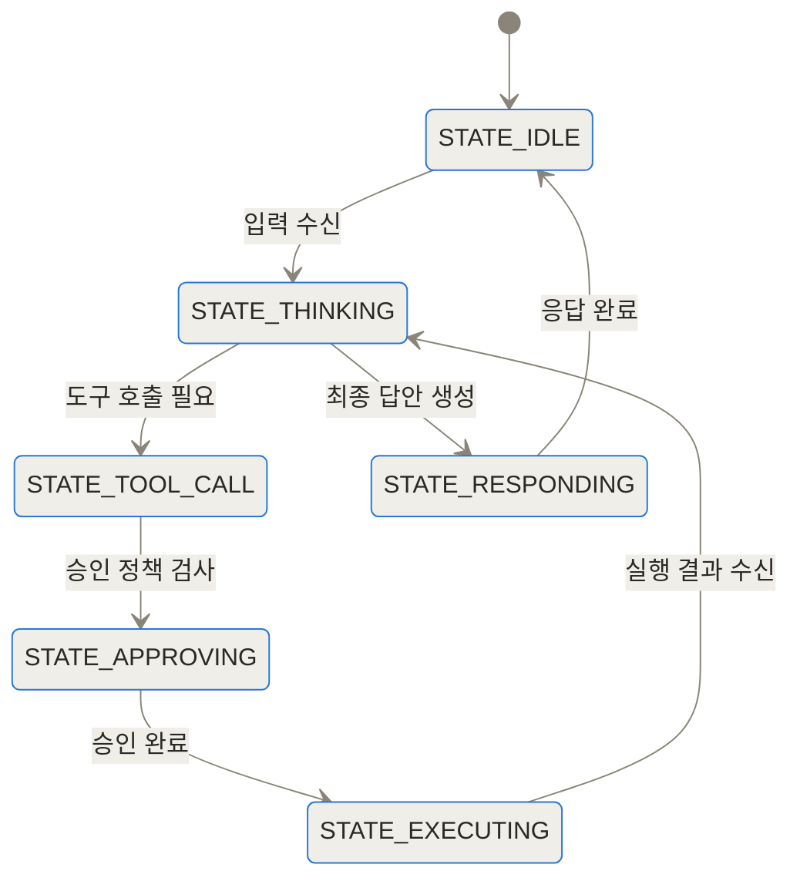
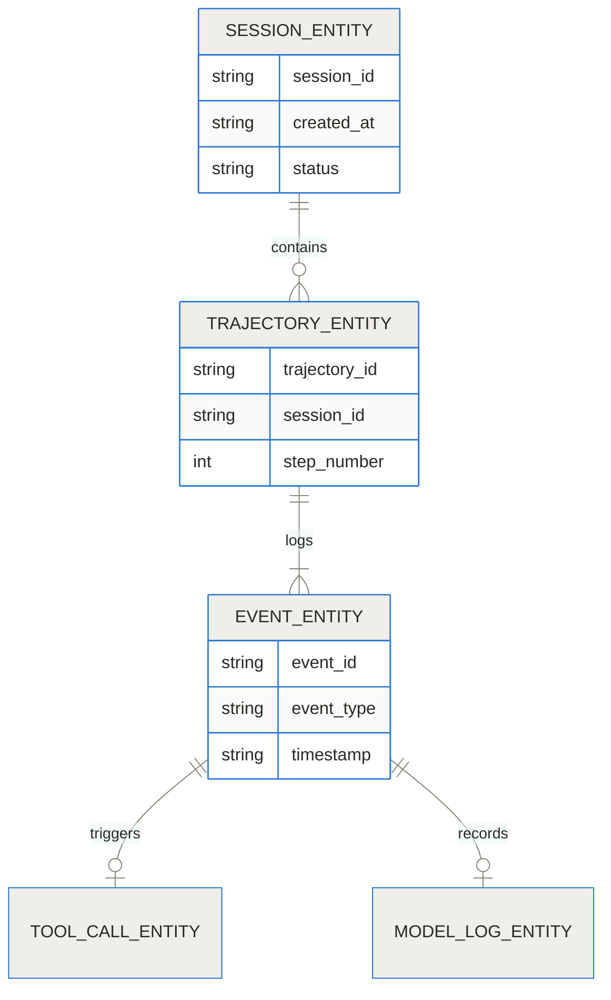
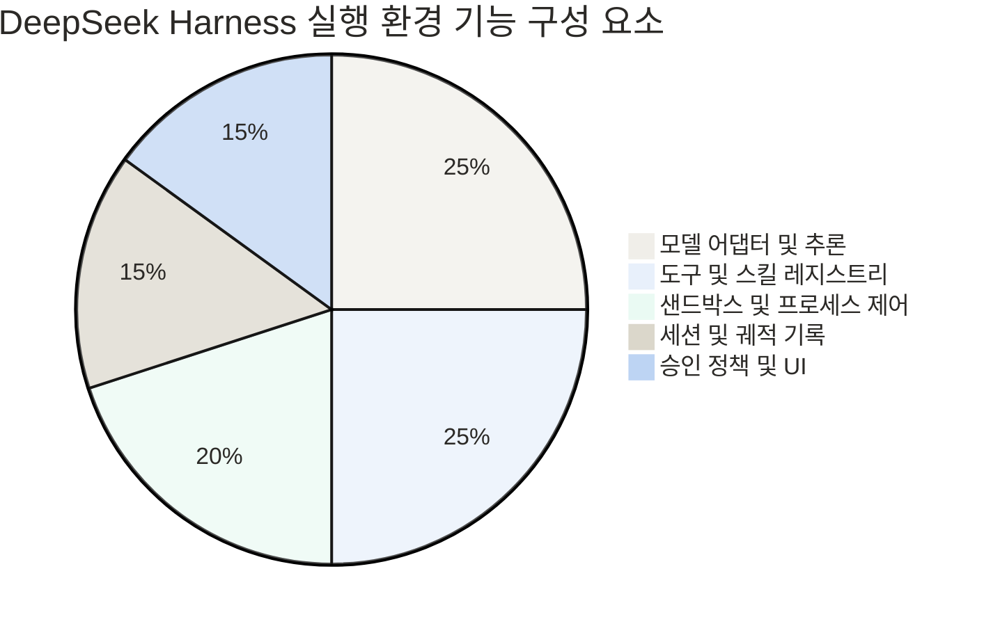
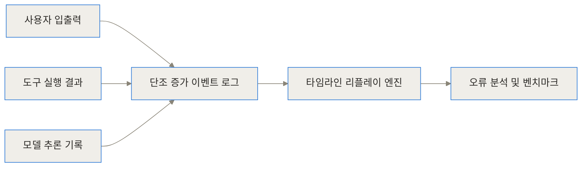

- [DeepSeek Harness GitHub 저장소](https://github.com/deepseek-ai/deepseek-harness)
- [DeepSeek Harness 개발자 가이드](https://github.com/deepseek-ai/deepseek-harness/tree/master/docs)
- [Cordis 메타 프레임워크 아키텍처 논문 및 문서](https://github.com/deepseek-ai/deepseek-harness/blob/master/docs/cordis-tutorial/index.md)

> **먼저 알아둘 용어**
>
> - **에이전트**: 사람이 단계마다 지시하지 않아도 스스로 여러 작업을 이어서 처리하는 AI입니다.
> - **프롬프트**: AI에게 건네는 지시문입니다. 같은 모델도 지시문에 따라 결과가 크게 달라집니다.
> - **오픈소스**: 소스 코드를 공개해 누구나 보고 고쳐 쓸 수 있게 한 것입니다. 조건은 라이선스마다 다릅니다.
> - **LLM**: 엄청난 양의 글을 학습해 문장을 만들어 내는 대형 AI 모델입니다. ChatGPT 가 대표적입니다.
> - **API**: 다른 프로그램에서 이 기능을 불러다 쓸 수 있게 열어 둔 창구입니다.
{: .prompt-info }

## 도입 및 TL;DR

최근 복잡한 소프트웨어 개발, 문서 작성, 데이터 분석 작업을 스스로 수행하는 자율형 AI 에이전트(Autonomous AI Agent) 시스템이 급격히 주목받고 있습니다. 하지만 대다수의 초기 에이전트 프로젝트는 단일 파일 내부에 모델 프롬프트 호출, JSON 결과 파싱, 터미널 명령어 실행, 에러 처리 로직이 단단하게 결합되어 있어 유지보수와 확장에 상당한 어려움을 겪고더라고요. 특정 샌드박스 실행 환경을 도입하거나 로컬 LLM을 원격 API로 교체하려고 할 때 기존 코드 전반을 다시 작성해야 하는 구조적 통증이 존재했던 것이죠.

DeepSeek Harness(dsh)는 이러한 문제점을 극복하기 위해 등장한 오픈소스 에이전트 런타임 플랫폼입니다. 거대한 단일 엔진 방식을 탈피하여 **모든 기능이 플러그인(Everything is a plugin)** 이라는 극단적인 모듈화 철학을 제시합니다. 모델, 도구, 샌드박스, 세션 관리, 사용자 인터페이스(UI), 권한 검증 등 모든 요소를 부품처럼 탈부착할 수 있도록 설계되어, 현업 개발자들이 에이전트 시스템을 훨씬 안전하고 유연하게 구축할 수 있도록 돕습니다.

> **TL;DR (3줄 요약)**
> 1. DeepSeek Harness는 LLM에게 현실 세계의 시스템을 안전하게 제어할 수 있는 몸체와 작업 공간을 제공하는 오픈소스 에이전트 실행 런타임입니다.
> 2. Cordis 메타 프레임워크 기반의 마이크로커널 아키텍처를 채택하여, 모델 어댑터부터 샌드박스, 도구, 세션 기록까지 시스템의 모든 요소를 독립된 플러그인으로 결합할 수 있습니다.
> 3. 단조 증가형(Append-only) 이벤트 트래젝터리를 제공하여 실행 내역을 완벽히 보존하고, 특정 지점에서의 타임라인 재생 및 정밀 디버깅을 지원합니다.


## 에이전트 하네스란 무엇이며 왜 필요한가

에이전트 시스템을 개발할 때 흔히 접하는 공식이 있습니다. 바로 **에이전트 = 모델 + 하네스(Agent = Model + Harness)** 라는 정의입니다. 여기서 거대언어모델(LLM)이 해답을 고안하고 사고를 진행하는 '영리한 뇌'에 해당한다면, 하네스(Harness)는 그 뇌가 실제 시스템 및 외부 환경과 통신할 수 있도록 다리를 놓아주는 '몸통과 손발, 격리된 작업대' 역할을 맡게 됩니다.

야생의 말을 마구(Harness)로 통제하여 수레를 끌게 만들듯, 아무리 우수한 지능을 가진 모델이라 할지라도 이를 안전하게 담아낼 실행 런타임(Harness)이 없다면 파일 시스템을 건드리거나 서버 명령어를 실행할 수 없습니다. 기존 에이전트 구현체들은 단순한 루프 기반 스크립트에 의존했기에 다음과 같은 한계에 직면했습니다.

- **강한 모놀리식 결합**: LLM API 호출 코드와 시스템 터미널 제어 로직이 엉켜 있어, 특정 기능을 변경할 때 전체 코드를 수정해야 함.
- **샌드박싱 결여**: 에이전트가 생성한 명령어가 호스트 OS에 직접 전달되어 의도치 않은 파일 삭제나 보안 사고 위험 노출.
- **재현 불가능한 추론 과정**: 에이전트가 작업을 수행하다가 중간에 실패했을 때, 어떤 도구 호출과 상태 전달에서 오작동이 일어났는지 추적하기 어려움.

DeepSeek Harness는 에이전트 운영에 필요한 제어 궤적, 스킬 레지스트리, 프로세스 실행, 승인 정책을 완전히 독립된 모듈로 나눔으로써 이러한 통증을 깔끔하게 해결해요.


## DeepSeek Harness의 핵심 철학: Everything is a Plugin

DeepSeek Harness의 가장 정체성이 명확한 슬로건은 **모든 것이 플러그인이다(Everything is a Plugin)** 입니다. 기존 프레임워크들은 시스템의 중심에 변경 불가능한 코어 엔진을 두고 그 외곽에 단순한 커스텀 도구(Tool)를 붙이는 방식을 취했어요. 하지만 DeepSeek Harness는 코어 엔진조차 매우 슬림한 마이크로커널로 구성하고, 핵심 기능 전체를 동등한 위치의 플러그인으로 취급합니다.

이 철학은 Cordis라는 메타 프레임워크 위에서 구현됩니다. Cordis는 시공간적 합성 가능성(Spatiotemporal Composability)을 핵심으로 하여, 플러그인이 실행 환경(Context)에 등록되는 순간 자신이 제공할 서비스(Service)와 이벤트를 선언하고 다른 플러그인의 서비스를 자유롭게 주입받아 사용할 수 있게 해줍니다.



이러한 구조 덕분에 개발자는 하네스 자체를 수정할 필요가 전혀 없습니다. 새로운 모델 어댑터를 붙이거나 Docker 기반의 강한 샌드박스로 실행 환경을 바꿀 때, 그저 상응하는 플러그인을 옆에 마운트(Mount)하기만 하면 됩니다.




## 작동 원리 심층 (Under the Hood)

DeepSeek Harness의 내부 작동 방식은 크게 세 가지 축으로 나눌 수 있습니다: 서비스 주입 기반 메인 루프, 단조 증가형 이벤트 궤적 기록, 그리고 다단계 승인 제어 시스템입니다.

### 1. 이벤트 디스패치 및 메시지 세션 처리

사용자가 에이전트에게 명령을 전달하면 UI 플러그인이 이를 수신하여 커널의 이벤트 버스로 전달합니다. 커널은 등록된 모델 어댑터 플러그인으로 현재 맥락과 프로그래밍 가능한 스킬 목록을 넘깁니다. 모델이 도구 호출(Tool Call)을 판단하면, 도구 레지스트리 플러그인이 이를 받아 샌드박스 및 승인 정책 플러그인으로 검증을 요청합니다.



### 2. 세션 생명주기와 상태 관리

에이전트의 구동 세션은 정교한 상태 머신으로 관리됩니다. 각 상태 변화는 불변(Immutable) 상태로 전이되며 결코 이전 기록을 덮어쓰지 않습니다.



### 3. 단조 증가형 이벤트 트래젝터리(Trajectory) 데이터 스키마

DeepSeek Harness는 모든 실행 과정을 기록하는 트래젝터리(Trajectory) 데이터베이스 모델을 가지고 있습니다. 세션 아래 단계별 궤적이 생성되고, 그 궤적마다 세부 이벤트가 매핑되는 구조입니다.



### 4. 베이스라인 실행 모드 분리

DeepSeek Harness는 사용 목적에 맞춰 최적화된 4가지 실행 기본 모드를 선언적으로 제공합니다.


| 실행 모드 | 주요 역할 및 특징 | 실행 도구 및 접근 권한 제한 |
| :--- | :--- | :--- |
| Standard 모드 | 일반적인 풀스택 에이전트 구동 환경 | 쉘 명령 실행, 웹 브라우징, 파일 CRUD 전체 접근 허용 |
| Code 모드 | 프로그래밍 기반 작업 처리를 위한 SDK 형태 | 여러 단계의 도구 연쇄를 코드 배치로 한꺼번에 실행 |
| Minimal 모드 | 경량화된 터미널 전용 제어 환경 | 지속형 쉘(Persistent Shell) 세션 중심의 최소 자원 구동 |
| Custom 모드 | 사용자 정의 플러그인 조합 모드 | 선언적 YAML/JSON 설정으로 동적 마운트 구성 |


DeepSeek Harness 내부에서 각 기능 모듈이 차지하는 역할 구성비는 아래 다이어그램과 같이 도구, 모델, 프로세스 제어가 균형 있게 정립되어 있습니다.



이러한 분리 구조 덕분에 문제가 발생했을 때 전체 파이프라인을 재구성할 필요 없이, 문제가 되는 특정 로그 및 재생 엔진에 접근하여 분석할 수 있습니다.




## 어떻게 설치하고 구성하나

DeepSeek Harness는 최신 Node.js 환경에서 간편히 구동할 수 있으며, CLI 방식 및 프로젝트 임베딩 방식을 모두 지원합니다.

### 1. 빠른 시작 (Quick Start)

NPX 패키지 실행기를 이용하면 별도의 소스코드 설치 없이 즉시 웹 UI 인터페이스를 띄워볼 수 있습니다.

```bash
# NPX 명령어를 통한 웹 인터페이스 런타임 즉시 실행
$ npx @deepseek-ai/dsh web

# 저장소 직접 클론 및 소스코드 빌드 방식
$ git clone https://github.com/deepseek-ai/deepseek-harness.git
$ cd deepseek-harness
$ npm install
$ npm run build
```

### 2. 선언적 환경 설정 파일 (dsh.config.yaml)

YAML 또는 JSON 파일을 통해 코드를 한 줄도 건드리지 않고 사용할 플러그인을 지정할 수 있습니다.

```yaml
# dsh.config.yaml
plugins:
  - name: "@deepseek-ai/plugin-model-deepseek"
    config:
      model: "deepseek-coder"
      api_key: "${DEEPSEEK_API_KEY}"
  - name: "@deepseek-ai/plugin-tool-shell"
    config:
      timeout: 30000
  - name: "@deepseek-ai/plugin-sandbox-docker"
    config:
      image: "node:20-alpine"
  - name: "@deepseek-ai/plugin-approval-policy"
    config:
      require_confirmation: ["rm", "sudo", "curl"]
```

### 3. 사용자 정의 플러그인 작성 (TypeScript 예시)

개발자는 Cordis 문법에 따라 새로운 커스텀 도구나 서비스를 쉽게 확장할 수 있어요.

```typescript
import { Context, Plugin } from 'cordis'

export interface WeatherPluginConfig {
  apiKey: string
}

export const CustomWeatherPlugin: Plugin<Context, WeatherPluginConfig> = {
  name: 'custom-weather-service',
  apply(ctx, config) {
    // 이벤트 레지스트리에 새로운 커스텀 도구를 등록
    ctx.on('ready', () => {
      ctx.dsh?.tools.register({
        name: 'get_current_weather',
        description: '특정 도시의 현재 기상 상태 정보를 조회합니다.',
        parameters: {
          type: 'object',
          properties: {
            location: { type: 'string' }
          },
          required: ['location']
        },
        async execute({ location }) {
          // 외부 기상 API 통신 수행
          return { location, temp: '21C', condition: 'Clear' }
        }
      })
    })
  }
}
```


## 실전 트러블슈팅 및 활용 시나리오

실제 개발 현장에서 DeepSeek Harness가 어떻게 문제를 해결해 주는지 3가지 시나리오로 살펴보겠습니다.

### 시나리오 1: 안전하지 않은 터미널 명령어 실행 차단 및 승인 정책
- **현업 문제**: 에이전트가 자동화 빌드를 수행하다가 잘못된 디렉토리에서 파괴적인 `rm -rf` 명령을 수행하여 서버 데이터가 손실될 위험 존재.
- **해결 방식**: Approval Policy 플러그인을 장착합니다. 위험도가 높은 명령어 패턴을 감지하면 자동으로 세션을 대기 상태(`STATE_APPROVING`)로 전환하고, 웹 UI를 통해 휴먼 인 더 루프(Human-in-the-loop) 승인을 요구합니다. 승인이 떨어지기 전까지 샌드박스 내부로 명령어가 전달되지 않습니다.

### 시나리오 2: 멀티 스텝 작업 실패 원인 추적 및 타임라인 복원
- **현업 문제**: 에이전트가 15단계에 걸쳐 리팩토링을 수행했으나 14번째 단계에서 빌드 에러를 발생시킴. 어느 단계에서 잘못된 변수 명칭을 추론했는지 파악하기 어려움.
- **해결 방식**: Append-only Trajectory 기록을 확인합니다. 각 스텝별로 모델의 입력 프롬프트, 사고(Chain of Thought), 생성된 코드, 도구 반환값이 그대로 보관되어 있으므로, 13번째 스텝 상태로 타임라인을 되돌려(Replay) 모델 프롬프트만 약간 수정한 뒤 재실행할 수 있습니다.

### 시나리오 3: 로컬 보안 모델과 원격 상용 API의 실시간 분기
- **현업 문제**: 고객 개인정보나 기업 내부 소스코드는 외부 API로 전송되면 안 되지만, 일반적인 문서 정리 작업은 고성능 상용 API를 사용하고 싶음.
- **해결 방식**: 모델 어댑터 플러그인 단에서 데이터 분류 기준에 따라 요청을 동적으로 라우팅합니다. 민감 파일 제어 요청은 로컬 Ollama(DeepSeek-R1-Distill) 어댑터로, 일반 검색 요청은 원격 DeepSeek API 어댑터로 분기 처리하여 보안과 성능을 모두 챙깁니다.


## 벤치마크 및 성능 비교

DeepSeek Harness가 제공하는 아키텍처적 이점을 직관적인 그래프 수치와 비교 표로 정리했습니다.

```chartjs
{"type":"bar","data":{"labels":["단일 모놀리식 구조","DeepSeek Harness (dsh)"],"datasets":[{"label":"기능 추가 시 기존 코드 수정 라인 수","data":[380,15]},{"label":"새 도구 작성에 필요한 표준 코드량(LOC)","data":[120,25]}]}}
```

DeepSeek Harness는 출시 초기부터 폭발적인 개발자 커뮤니티 반응을 이끌어냈으며, 빠른 채택 속도를 증명했습니다.

```chartjs
{"type":"line","data":{"labels":["0시간","12시간","24시간","36시간","48시간","60시간"],"datasets":[{"label":"GitHub Star 누적 수","data":[0,22000,51000,78000,102000,112000]}]}}
```


| 비교 항목 | 기존 모놀리식 에이전트 스크립트 | 일반 MCP (Model Context Protocol) 기반 통합 | DeepSeek Harness (dsh) |
| :--- | :--- | :--- | :--- |
| 시스템 아키텍처 | 단일 코드베이스 (Monolithic) | 클라이언트-서버 프로토콜 통신 | 마이크로커널 플러그인 아키텍처 |
| 모듈 교체 용이성 | 매우 낮음 (코어 코드 직접 개조) | 보통 (MCP 전용 서버 구축 필요) | 매우 높음 (플러그인 동적 마운트) |
| 실행 이력 관리 | 개별 개발자가 DB 연동 직접 구현 | 에디터/클라이언트 구현에 의존 | 불변 트래젝터리 기반 표준 지원 |
| 격리 및 샌드박싱 | OS 자원 직접 사용으로 위험 | 클라이언트 환경에 의존 | 샌드박스 플러그인 전격 지원 |
| 모델 독립성 | 특정 API SDK 및 프롬프트 결합 | 프로토콜 수준 격리 | 모델 어댑터 전환 지원 |


## 솔직한 평가: 한계와 트레이드오프

단백하고 정직하게 짚어보자면, DeepSeek Harness가 모든 상황에 정답인 마법의 도구는 아닙니다.

- **Cordis 학습 곡선**: 프레임워크 기초가 되는 Cordis의 스코프 중심 컨텍스트 디자인과 서비스 주입 방식을 사전에 이해해야 커스텀 플러그인을 원활하게 제작할 수 있습니다.
- **초기 생태계 단계**: 오픈소스 커뮤니티가 신속히 확장되고 있지만, 기존에 오래된 프레임워크에 비해 서드파티 플러그인 라이브러리 개수는 쌓아가는 단계입니다.
- **과도한 엔지니어링 리스크(Overengineering)**: 단순하게 LLM API를 호출하여 텍스트 요약만 받는 단발성 애플리케이션에 DeepSeek Harness를 도입하는 것은 오히려 복잡성을 높일 수 있습니다.

따라서 자율적으로 터미널 명령을 다루거나 complex 멀티스텝 도구 연쇄를 안정적으로 운영해야 하는 에이전트 서비스 개발에 도입하는 것이 가장 적합해요.


## 마무리 및 전망

DeepSeek Harness의 공개는 AI 경쟁의 축이 단순한 '모델 추론 성능'에서 '에이전트를 안정적으로 구동하는 인프라 환경'으로 이동하고 있음을 보여줍니다. 모든 Capability를 플러그인화한 이 아키텍처는 개발자가 핵심 비즈니스 도구 작성에만 집중할 수 있는 훌륭한 고속도로를 깔아줍니다.

안전한 샌드박스 위에서 AI 에이전트를 작동시키고 싶다면, 지금 바로 `npx @deepseek-ai/dsh web` 명령어로 새로운 에이전트 하네스 생태계를 직접 체험해 보시길 권합니다.

## 자주 묻는 질문 (FAQ)

### DeepSeek Harness는 독자적인 LLM 모델인가요, 아니면 실행 프레임워크인가요?

DeepSeek Harness(dsh)는 거대언어모델(LLM) 자체가 아니라, AI 에이전트가 실제 환경과 안전하게 상호작용할 수 있도록 돕는 오픈소스 실행 런타임(Harness) 프레임워크입니다. 모델이 구상한 지시를 받아 샌드박스 내에서 명령을 실행하고 도구 호출 및 세션을 관리하는 손발과 작업 공간 역할을 담당합니다.

### Cordis 기반의 플러그인 아키텍처가 기존 에이전트 구조와 어떻게 다른가요?

기존 에이전트 구조는 메인 엔진 코드가 고정되어 있어 특정 기능을 수정하려면 하드코딩된 소스코드를 직접 개조해야 했습니다. 반면 DeepSeek Harness는 Cordis 메타 프레임워크 기반의 마이크로커널을 사용하여 모델, 도구, 샌드박스, 세션, UI 등 모든 구성 요소를 동등한 독립 플러그인으로 조립 및 교체할 수 있습니다.

### 실행 내역 트래젝터리(Trajectory) 로깅 기능은 어떤 이점이 있나요?

에이전트가 수행한 모든 입출력, 도구 실행, 추론 상태, 토큰 사용량이 단조 증가형(Append-only) 이벤트 로그로 세션에 기록됩니다. 개발자는 이 궤적 데이터를 기반으로 멀티스텝 작업 중 에러가 발생한 시점을 정확히 포착하고, 타임라인을 이전 상태로 복원(Replay)하여 정밀 디버깅과 성능 벤치마크를 진행할 수 있습니다.

### DeepSeek API 외에 OpenAI 나 로컬 LLM도 연결해서 쓸 수 있나요?

네, 완벽하게 가능합니다. DeepSeek Harness는 특정 API 공급자에 종속되지 않으며, 모델 통신 로직이 독립된 모델 어댑터(Model Adapter) 플러그인으로 분리되어 있습니다. 따라서 OpenAI, Anthropic 같은 원격 API는 물론 Ollama, vLLM 기반의 로컬 모델도 어댑터만 지정하면 바로 교체하여 운용할 수 있습니다.

### MCP(Model Context Protocol)와 DeepSeek Harness는 무엇이 다른가요?

MCP가 클라이언트와 외부 도구 서버 간의 표준화된 프로토콜 규격이라면, DeepSeek Harness는 도구뿐만 아니라 모델, 세션, 샌드박스, 승인 정책, UI 전체를 통합 제어하는 실행 런타임입니다. DeepSeek Harness 내부에 MCP 연동 플러그인을 마운트하면 MCP 기반 도구들을 Harness 오케스트레이션 환경 안에서 함께 활용할 수 있습니다.


## References
- [https://github.com/deepseek-ai/deepseek-harness](https://github.com/deepseek-ai/deepseek-harness)
- [https://github.com/deepseek-ai/deepseek-harness/blob/master/README.md](https://github.com/deepseek-ai/deepseek-harness/blob/master/README.md)
- [https://github.com/deepseek-ai/deepseek-harness/blob/master/docs/architecture.md](https://github.com/deepseek-ai/deepseek-harness/blob/master/docs/architecture.md)
