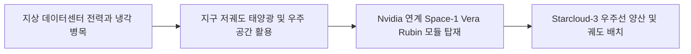
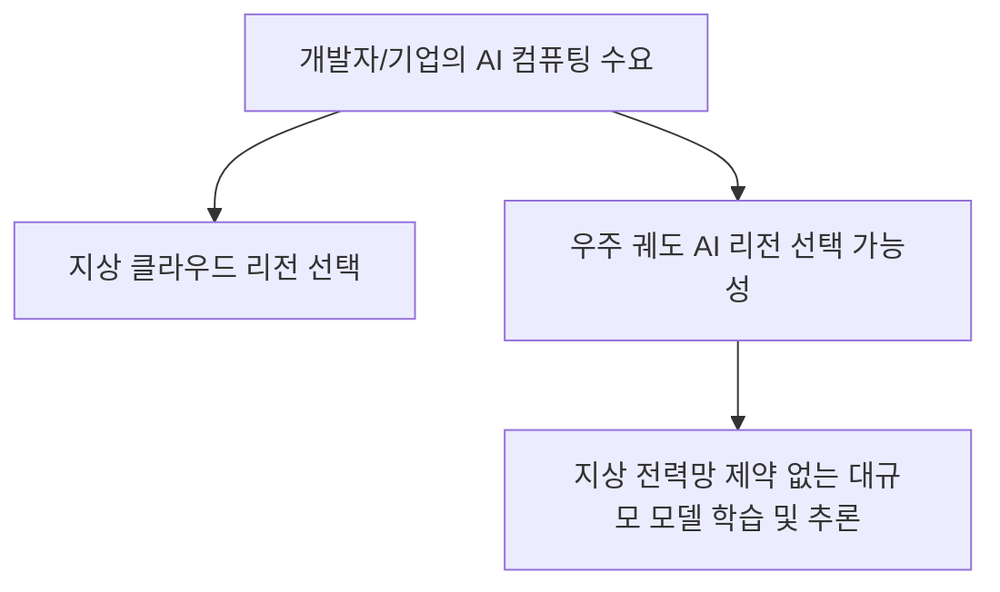
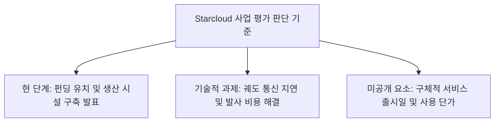

Starcloud가 23억 달러 기업가치로 2억 5천만 달러를 조달한 것은 우주 AI 데이터센터 구상을 생산 단계로 옮길 자금을 확보했다는 소식입니다 <a href="#source-1" aria-label="Business Wire 출처">[1]</a>. 다만 투자 유치와 궤도에서 H100 한 대를 작동시킨 실증이 곧 상용 데이터센터 군집의 완성을 뜻하지는 않습니다. 이 사업은 발사·통신·방사선·냉각·수리 가능성까지 포함한 전체 비용과 안정성이 지상 인프라보다 나은지로 평가해야 합니다.

> **먼저 알아둘 용어**
>
> - **추론**: 학습이 끝난 모델이 실제로 답을 만들어 내는 과정입니다. 이때 드는 계산 비용이 곧 사용료입니다.
> - **지연 시간**: 요청을 보내고 첫 답이 돌아오기까지 걸리는 시간입니다.
> - **GPU**: AI 계산을 한꺼번에 빠르게 처리하는 전용 반도체입니다. AI 비용의 대부분이 여기서 나옵니다.
{: .prompt-info }

## 무슨 일이 벌어진 걸까?

우주 컴퓨팅 스타트업 Starcloud가 23억 달러의 포스트머니 기업가치를 인정받으며 2억 5천만 달러 규모의 시리즈 A 확장 투자 라운드를 마감했습니다 <a href="#source-1" aria-label="Business Wire 출처">[1]</a>. 이번 투자는 맨해튼 웨스트(Manhattan West)가 주도했으며, 칩 거두인 Nvidia와 시스템 공룡 Cisco Investments, 그리고 Cedar Capital, Goanna Capital, Standard Capital이 신규 투자자로 참여했습니다 <a href="#source-2" aria-label="SiliconANGLE 출처">[2]</a>. 기존 투자자인 Benchmark, EQT, Soma, NFX, 776 역시 참여하여 힘을 실었습니다 <a href="#source-3" aria-label="GeekWire 출처">[3]</a>.

이번 라운드를 포함해 Starcloud가 2024년 창업 이래 지금까지 유치한 누적 투자금은 총 4억 5천만 달러에 달합니다 <a href="#source-1" aria-label="Business Wire 출처">[1]</a>. 실체 없는 구상에 그치지 않고, 확보한 자금을 바탕으로 미국 워싱턴주 우딘빌(Woodinville)에 위치한 10만 제곱피트 규모의 생산 시설에 Starcloud-3 우주선 양산 라인을 구축하고 있습니다 <a href="#source-3" aria-label="GeekWire 출처">[3]</a>.

위 차트는 이번에 발표된 Starcloud의 투자 유치 성과와 평가받은 기업가치를 나타냅니다 <a href="#source-1" aria-label="Business Wire 출처">[1]</a>. 단 한 번의 시리즈 A 확장 라운드로 2억 5천만 달러를 추가하며 누적 4억 5천만 달러를 기록한 점이 눈에 띕니다.

<figure class="news-source-image">
  
  <figcaption>SiliconANGLE가 원문과 함께 공개한 이미지입니다. <a href="https://siliconangle.com/2026/08/21/starcloud-raises-250m-to-build-ai-data-centers-in-orbit" target="_blank" rel="noopener noreferrer">출처: SiliconANGLE</a></figcaption>
</figure>

## 왜 지금 다들 이 이야기를 할까?

Starcloud의 우주 데이터센터 구상이 주목받는 이유는 지상 AI 데이터센터가 직면한 전력망 병목 현상과 냉각 한계를 극복하려는 시도이기 때문입니다 <a href="#source-2" aria-label="SiliconANGLE 출처">[2]</a>. 거대한 AI 모델을 학습시키고 실시간으로 운영하려면 수백 메가와트급의 전력과 엄청난 냉각 시설이 필요한데, 지상에서는 환경적과 물리적 제약이 점차 심해지고 있습니다.

반면 지구 저궤도에서는 태양광을 통해 끊임없이 전력을 확보할 수 있는 가능성이 열려 있습니다 <a href="#source-2" aria-label="SiliconANGLE 출처">[2]</a>. 더욱이 Nvidia와의 공식 협력이 결정적이었습니다. Starcloud는 Nvidia와 협력해 우주의 극심한 환경과 방사 냉각(radiative cooling) 기술을 견디도록 설계된 AI 하드웨어 시스템인 'Space-1 Vera Rubin Module'을 개발하고 있습니다 <a href="#source-3" aria-label="GeekWire 출처">[3]</a>.

위 다이어그램은 Starcloud가 지상 인프라의 한계를 우주 AI 인프라로 연결하는 핵심 작동 구조를 나타냅니다.

Starcloud는 이미 실험 단계에서 확실한 실증을 마친 바 있습니다. 2025년 11월, Starcloud-1 위성에 Nvidia H100 GPU를 탑재해 지구 궤도로 성공적으로 쏘아 올린 경험이 있습니다 <a href="#source-1" aria-label="Business Wire 출처">[1]</a>. 단순히 이론적 아이디어가 아니라 단일 GPU를 궤도에서 실제 작동시킨 테스트를 거친 후 이번 대규모 양산 단계로 넘어가는 것입니다 <a href="#source-2" aria-label="SiliconANGLE 출처">[2]</a>.

## 상용 우주 데이터센터가 되려면 무엇이 증명돼야 할까?

Starcloud의 궤도 AI 데이터센터가 상용화되면 미래 AI 서비스의 비용 구조와 인프라 접근 방식에 직접적인 영향을 줄 수 있습니다. 현재 기업들이 대형 언어 모델을 구축하고 가동할 때 가장 큰 걸림돌은 지상 전력망 고갈로 인한 컴퓨팅 단가 상승입니다. 우주 데이터센터가 궤도에서 전력을 자급자족하며 거대한 클러스터를 형성하면, AI 연산의 지상 전력 소비 부담을 줄여줄 수 있습니다 <a href="#source-2" aria-label="SiliconANGLE 출처">[2]</a>.

또한 Cisco Investments가 투자에 참여함에 따라 지구와 우주 위성 간의 데이터 통신 네트워크 구축도 탄력을 받을 것으로 보입니다 <a href="#source-1" aria-label="Business Wire 출처">[1]</a>. 개발자나 기업 고객 입장에서는 향후 우주 궤도 클라우드 서비스를 새로운 클라우드 리전 중 하나로 선택해 대규모 AI 학습 및 추론을 돌리는 신선한 옵션이 생길 수 있습니다.

위 흐름도는 향후 기업들이 컴퓨팅 자원을 선택할 때 우주 AI 리전이 새로운 선택지로 추가될 수 있음을 보여줍니다.

그러나 가능성과 구매 가능한 서비스 사이에는 여러 검증 단계가 남아 있습니다. 우주에서 얻는 전력만 볼 것이 아니라 위성을 제작하고 발사하는 비용, 지상국과 데이터를 주고받는 비용, 고장 난 장비를 교체하기 어려운 조건까지 합쳐야 합니다. 같은 연산량을 처리할 때 이 전 과정의 비용과 에너지가 지상 데이터센터보다 낮아야 경제적 장점이 성립합니다.

성능도 GPU 자체의 연산 속도만으로 판단하기 어렵습니다. 학습 데이터와 결과를 궤도로 올리고 내리는 통신 시간이 길면 빠른 칩의 이점이 줄어듭니다. 대규모 모델 학습은 여러 가속기가 지속적으로 통신해야 하므로, Starcloud-3 여러 기가 실제로 안정적인 클러스터처럼 동작하는지와 장애가 났을 때 작업을 복구할 수 있는지가 핵심입니다. 한 대의 H100 실증은 출발점이지만 이러한 규모 확장을 입증한 결과는 아닙니다.

## 투자 발표 이후 어떤 지표를 지켜봐야 할까?

Starcloud의 우주 데이터센터 진전을 평가하려면 워싱턴주 우딘빌 공장의 위성 양산 속도와 Nvidia Vera Rubin 모듈의 적용 결과를 관찰해야 합니다 <a href="#source-3" aria-label="GeekWire 출처">[3]</a>. 차세대 인프라 변화를 지켜볼 주요 지점은 다음과 같습니다.

첫째, 10만 제곱피트 규모의 우딘빌 공장에서 Starcloud-3 우주선이 실제 계획된 일정대로 양산되어 발사대까지 이동하는지 확인하는 것입니다 <a href="#source-2" aria-label="SiliconANGLE 출처">[2]</a>.
둘째, 우주 방사선과 극심한 온도 변화 속에서 Space-1 Vera Rubin 모듈이 지상의 AI 데이터센터 수준의 연산 안정성과 수명을 유지하는지 관찰해야 합니다 <a href="#source-1" aria-label="Business Wire 출처">[1]</a>.

여기에 발사된 장비 수와 실제 가동률, 지상국을 포함한 왕복 지연시간, 통신 중단 뒤 작업 복구율을 함께 봐야 합니다. 발표 자료에 탑재 칩 수만 늘고 이 운영 지표가 없다면 상용 서비스의 품질과 가격을 판단하기 어렵습니다. 출시 일정과 고객 가격표, 서비스 수준 약정이 공개되기 전에는 “새 클라우드 리전”이 현재 구매 가능한 선택지인 것처럼 예산에 반영하지 않는 편이 타당합니다.

## 아직은 선을 그어야 할 부분

Starcloud가 2억 5천만 달러라는 거금을 모았지만 당장 오늘이나 내일에 우리가 이용하는 AI 서비스가 바뀌는 것은 아닙니다 <a href="#source-1" aria-label="Business Wire 출처">[1]</a>. 우주 데이터센터 구축은 대규모 위성 발사 비용과 궤도 통신 지연시간(Latency)이라는 넘어야 할 기술적 과제가 분명히 존재합니다.

또한, Nvidia H100 GPU 1대를 2025년 11월 Starcloud-1에 실어 올린 성공 사례와 별개로 <a href="#source-2" aria-label="SiliconANGLE 출처">[2]</a>, 수백 수천 대의 AI 칩이 상호 연결된 상용 수준의 우주 데이터센터 군집이 언제 본격 가동될지는 구체적인 날짜나 서비스 가격표가 공개되지 않았습니다. 현재는 생산 시설을 짓고 탑재 모듈을 공동 개발하는 발표 단계임을 구분해서 바라보아야 합니다 <a href="#source-3" aria-label="GeekWire 출처">[3]</a>.

위 다이어그램은 독자가 이번 뉴스를 접할 때 구분해야 할 현황과 한계점을 요약해 줍니다.

<!-- primary-sources:start -->
## 원문과 버전 확인

- [발표 원문](https://www.businesswire.com/news/home/20260821005001/en/Starcloud-Raises-250-Million-at-2.3-Billion-Valuation-to-Scale-AI-with-Orbital-Data-Centers)
- [SiliconANGLE](https://siliconangle.com/2026/08/21/starcloud-raises-250m-to-build-ai-data-centers-in-orbit)
- [GeekWire](https://www.geekwire.com/2026/starcloud-raises-250m-nvidia)
<!-- primary-sources:end -->

<!-- internal-links:start -->
## 함께 읽으면 이해가 이어지는 글

- [Nvidia, Poolside와 70억 달러 계약 체결하여 Nemotron AI 경쟁력 강화]() — Nvidia가 AI 스타트업 Poolside의 Model Factory 소프트웨어 라이선스 대금으로 60억 달러를 지급하고 10억 달러의 지분 투자를 단행했습니다. 이번 거래를 통해 Poolside의 핵심 엔지니어 109명이…
- [AI Berkshire: 일반 인공지능이 주식 투자를 못 하는 이유와 다중 에이전트 프레임워크의 해결책]() — 일반적인 언어 모델이 투자 분석에서 보여주는 양비론적 한계와 데이터 환각을 극복하기 위해, 4대 가치투자 대가의 방법론을 다중 에이전트로 구현한 AI Berkshire 프레임워크의 구조와 작동 원리를 깊이 있게 분석합니다.
- [SpaceXAI, NVIDIA Vera CPU 도입과 Starmind AI 위성 궤도 배치 계획 발표]() — 2026년 8월 24일 NVIDIA 발표에 따르면 SpaceXAI는 Grok AI 모델의 오케스트레이션과 코드 처리를 가속하기 위해 NVIDIA Vera CPU를 도입합니다. 아울러 SpaceXAI는 NVIDIA Vera Rubin…
<!-- internal-links:end -->

## 자주 묻는 질문

### Starcloud가 이번 투자 라운드에서 인정받은 기업가치와 유치 금액은 얼마인가요?

Starcloud는 23억 달러의 기업가치로 2억 5천만 달러 규모의 시리즈 A 확장 투자를 유치했습니다. 이번 투자는 Manhattan West가 주도했으며 Nvidia와 Cisco Investments 등이 신규 투자자로 참여했습니다.

### Starcloud의 우주 데이터센터에는 어떤 AI 하드웨어가 탑재되나요?

Starcloud는 Nvidia와 협력하여 우주의 극한 환경과 방사 냉각에 맞춰 설계된 Space-1 Vera Rubin 모듈을 개발하여 Starcloud-3 우주선에 탑재합니다.

### Starcloud는 실제로 궤도에 GPU를 쏘아 올려 테스트한 적이 있나요?

네, Starcloud는 2025년 11월 Starcloud-1 위성에 Nvidia H100 GPU 1대를 탑재하여 지구 궤도로 발사해 실제 실증 테스트를 마친 바 있습니다.

## 직접 확인한 원문

<ol class="checked-source-list">
  <li id="source-1"><a href="https://www.businesswire.com/news/home/20260821005001/en/Starcloud-Raises-250-Million-at-2.3-Billion-Valuation-to-Scale-AI-with-Orbital-Data-Centers" target="_blank" rel="noopener noreferrer">Business Wire — Starcloud Raises $250 Million at $2.3 Billion Valuation to Scale AI with Orbital Data Centers</a> (2026-08-21)</li>
  <li id="source-2"><a href="https://siliconangle.com/2026/08/21/starcloud-raises-250m-to-build-ai-data-centers-in-orbit" target="_blank" rel="noopener noreferrer">SiliconANGLE — Starcloud raises $250M to build AI data centers in orbit</a> (2026-08-21)</li>
  <li id="source-3"><a href="https://www.geekwire.com/2026/starcloud-raises-250m-nvidia" target="_blank" rel="noopener noreferrer">GeekWire — Starcloud raises $250M to support the creation of data center satellite network in league with Nvidia</a> (2026-08-21)</li>
</ol>

> 이 글은 위 원문을 직접 확인해 작성했습니다. 가격, 기능 범위, 지역별 제공 여부는 게시 후 바뀔 수 있으니 실제 도입 전 공식 문서를 다시 확인하세요.
