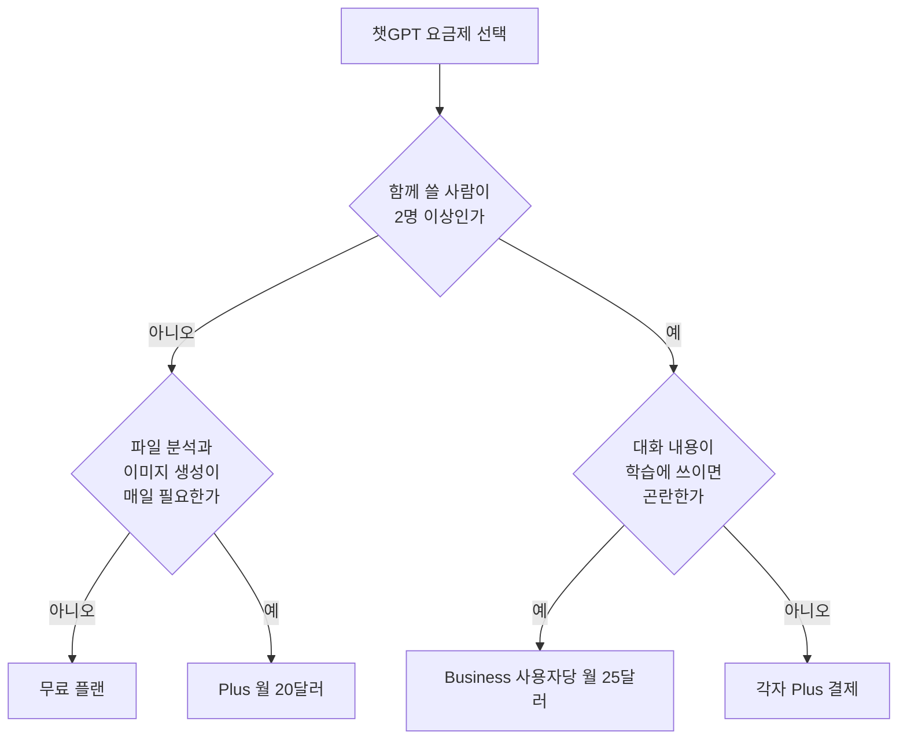

가끔 대화하고 기본 기능만 쓴다면 무료 플랜부터 시작하고, 파일 분석, 이미지 생성과 더 높은 사용 한도가 업무에 반복해서 필요할 때 Plus를 검토하면 됩니다. 두 명 이상이 중앙 관리와 기본적인 학습 미사용 조건을 함께 필요로 한다면 Business가 비교 대상입니다. 가격과 제공 기능은 바뀔 수 있으므로 결제 직전에는 공식 요금제 페이지와 결제 화면을 다시 확인해야 합니다.

> **먼저 알아둘 용어**
>
> - **API**: 다른 프로그램에서 이 기능을 불러다 쓸 수 있게 열어 둔 창구입니다.
> - **토큰**: AI가 글을 잘게 쪼개 세는 단위입니다. 한국어는 보통 한두 글자가 토큰 하나입니다.
{: .prompt-info }

## 챗GPT 요금제 종류와 핵심 차이 한눈에 보기
개인은 무료나 월 $20 Plus, 팀은 사용자당 월 $25.00 Business 요금제를 선택하면 됩니다.

2026년 8월 23일 기준, OpenAI가 제공하는 챗GPT 요금제 종류는 무료 플랜을 포함하여 Plus, Business, Enterprise 등으로 다양하게 나뉩니다. 사용자는 본인에게 필요한 기능과 보안 수준, 결제 수단에 맞춰 선택해야 하지만, 플랜별 차이점과 결제 유의사항을 명확히 알지 못해 고민하는 경우가 많습니다. 이 글에서는 챗GPT 요금제 추천 기준을 제시하고 플랜별 차이, 결제 관리, 해지 방법까지 정직하게 정리합니다.

| 요금제 종류 | 이용 요금(USD) | 주요 제공 기능 및 한도 | 모델 학습 활용 여부 |
| --- | --- | --- | --- |
| 무료 플랜 | Free ($0) | 기본 모델 이용 한도 | 대화 내용 학습에 활용될 수 있음 |
| Plus | 월 $20 | 높은 모델 이용 한도, 우선 접근, 빠른 응답 속도, 음성 대화, 이미지 생성, 파일 업로드 및 분석 | 설정에 따라 제어 가능 |
| Business | 월간 결제 시 사용자당 월 $25.00 (최소 2명 이상) | 워크스페이스 관리, 팀 협업 기능, 높은 서비스 한도 | 기본적으로 데이터 및 대화내용 학습 미활용 |
| Enterprise | 맞춤형 가격 (Custom pricing) | 대규모 조직용 엔터프라이즈급 보안 및 전용 관리 기능 | 기본적으로 데이터 및 대화내용 학습 미활용 |



```chartjs
{
  "type": "bar",
  "data": {
    "labels": ["무료 플랜", "Plus", "Business (1인당)"],
    "datasets": [{
      "label": "월 요금 (달러)",
      "data": [0, 20, 25],
      "backgroundColor": ["#9aa5a1", "#2f9e8f", "#1d6f63"]
    }]
  },
  "options": {
    "responsive": true,
    "scales": { "y": { "beginAtZero": true, "title": { "display": true, "text": "달러" } } }
  }
}
```

Enterprise는 맞춤형 가격이라 위 비교에 넣지 않았습니다.

## 챗GPT 요금제 차이 및 세부 특징

### 개인 사용자를 위한 무료 플랜과 Plus 요금제 비교
무료 플랜은 기본 기능을 무료로 체험하려는 개인 사용자에게 적합합니다. 반면, ChatGPT Plus 요금제는 월 $20(USD)의 구독료가 부과됩니다. Plus 플랜 구독자는 무료 플랜보다 더 높은 모델 이용 한도를 부여받으며, 사용자가 몰리는 네트워크 혼잡 시간대에도 우선적으로 서비스에 접근할 수 있습니다. 또한 더 빠른 응답 속도를 경험할 수 있으며, 음성 대화, 이미지 생성, 파일 업로드 및 데이터 분석 도구 등 업무 효율을 크게 높여주는 확장 기능을 이용할 수 있습니다. 개인적인 일상 대화나 가벼운 검색이 목적이라면 무료 플랜으로 충분하지만, 파일 분석이나 이미지 작업, 빠른 업무 처리가 지속적으로 필요하다면 챗GPT 요금제 추천 대상은 Plus 플랜입니다.

### 팀과 기업을 위한 Business 및 Enterprise 플랜
ChatGPT Business 요금제는 최소 2명(2+ users) 이상의 사용자가 함께 이용할 수 있는 팀 전용 플랜입니다. 월간 결제 방식을 선택할 경우 사용자당 월 $25.00(USD)의 요금이 청구됩니다. Business 플랜의 가장 큰 장점은 보안입니다. Business 요금제의 워크스페이스 내에서 발생하는 데이터와 대화 내용은 기본적으로 AI 모델 학습에 활용되지 않으므로, 사내 정보 유출 우려를 낮출 수 있습니다.

ChatGPT Enterprise 플랜은 대규모 조직과 기업을 위한 플랜으로, 엔터프라이즈급 보안 규정과 맞춤형 관리 기능을 제공합니다. Enterprise 플랜의 공식 단가는 외부로 공개되어 있지 않은 맞춤형 가격(Custom pricing) 체계이며, 도입을 위해서는 OpenAI 영업팀에 직접 문의하는 절차를 거쳐야 합니다.

### API 이용료와 구독 요금제의 분리
개발자나 서비스 연동을 위해 사용되는 ChatGPT API 요금은 ChatGPT Plus 또는 Pro 플랜 구독료에 포함되지 않습니다. API 이용료는 구독 플랜과 별개로 [platform.openai.com](https://platform.openai.com)에서 사용한 토큰 양에 따라 별도로 청구되는 종량제 결제 방식입니다.

## 챗GPT 요금제 할인과 디시 등 커뮤니티 계정 공유의 진실

### 챗GPT 요금제 할인 혜택 유무
현재 국내 특정 카드사나 통신사와 연계된 챗GPT 공식 할인 혜택이 존재하는지 여부는 공식적으로 확인되지 않았습니다. OpenAI 공식 사이트에서 제공하는 가액이 표준 가격이며, 외부에서 비공식적으로 판매하는 통신사 결합 할인 등은 유의할 필요가 있습니다.

### 챗GPT 요금제 공유 및 디시 등 커뮤니티 거래 주의점
디시인사이드 등 온라인 커뮤니티에서 챗GPT 요금제 공유라는 이름으로 계정을 여러 명이 나누어 쓰는 행위가 공유되고 있습니다. 그러나 비공식 계정 공유 행위가 적발되었을 때 적용되는 계정 정지의 세부 제재 기준에 대해서는 OpenAI 공식 문서에 명확히 명시된 바가 없습니다. 보안상 문제나 계정 차단 위험이 존재하므로, 안전한 이용을 위해서는 정식 요금제를 개별 구독하거나 팀 단위의 Business 플랜을 이용하는 것이 권장됩니다.

## 챗GPT 요금제 확인 및 챗GPT 요금제 변경 방법

### 현재 이용 중인 챗GPT 요금제 확인 방법
자신이 현재 어떤 요금제를 사용 중인지 확인하려면 [chatgpt.com](https://chatgpt.com) 웹사이트에 로그인한 후 계정 프로필 메뉴로 이동합니다. 프로필 아이콘을 클릭하고 설정(Settings) 메뉴에 들어가면 계정 및 결제 탭에서 현재 적용된 플랜 상태를 즉시 확인할 수 있습니다.

### 챗GPT 요금제 변경 방법
무료 플랜에서 Plus로 업그레이드하거나 Business 플랜으로 요금제를 변경하고자 할 때도 설정 메뉴 내에서 진행할 수 있습니다. 프로필 클릭 후 설정(Settings)의 계정/결제 메뉴로 이동하여 원하는 상위 플랜의 업그레이드 버튼을 누르고 결제 수단을 입력하면 즉시 변경 적용됩니다.

## 챗GPT 요금제 해지 및 환불 절차

### 웹사이트 및 모바일 앱에서의 해지 절차
chatgpt.com 웹사이트에서 가입한 구독을 해지하려면 로그인 후 프로필 아이콘을 클릭하고 설정(Settings) 메뉴로 이동합니다. 설정 내 계정/결제 메뉴에서 '플랜 취소'를 선택하면 구독 해지 절차가 진행됩니다.

스마트폰 모바일 앱 이용 시 반드시 알아두어야 할 점이 있습니다. 모바일 앱을 스마트폰에서 삭제(언인스톨)하더라도 구독은 자동으로 취소되지 않습니다. 앱을 삭제했더라도 구글 플레이스토어 또는 애플 앱스토어의 구독 관리 메뉴에 직접 접속하여 취소 신청을 마쳐야 정상적으로 해지됩니다.

### 결제 주기 및 환불 관련 규정
다음 결제 주기의 요금이 청구되지 않도록 하려면 반드시 결제일로부터 최소 24시간 전에 구독을 취소해야 합니다. 구독을 취소하더라도 이미 결제 완료된 현재 청구 주기가 종료될 때까지는 유료 플랜의 모든 기능을 계속 이용할 수 있습니다.

환불 규정의 경우, chatgpt.com 웹 결제 건에 한하여 우발적 구매(Accidental purchases) 상황이 발생했다면 결제 발생일로부터 14일 이내에 고객지원으로 문의 시 환불 검토 대상이 될 수 있습니다.

## 그래서 내 업무에는 뭐가 달라지나

- 파일 분석, 이미지 생성, 높은 사용 한도가 매일 필요한 개인 사용자라면, 설정 메뉴에서 월 $20의 Plus 플랜으로 전환하여 즉시 응답 속도와 최신 도구를 활용하세요.
- 2명 이상의 팀 단위로 작업하며 데이터가 AI 학습에 활용되는 것을 방지해야 한다면, 사용자당 월 $25.00의 Business 플랜으로 워크스페이스를 개설하세요.
- 현재 유료 플랜을 이용 중이지만 사용 빈도가 낮아 비용을 절감하고자 한다면, 다음 결제일 최소 24시간 전에 설정의 계정 메뉴에서 플랜 취소를 클릭하세요.

<!-- internal-links:start -->
## 함께 읽으면 이해가 이어지는 글

- [GPT-4o 이미지 생성, 실무에 바로 써도 될까? 한글, 작은 글자, 부분 편집 한계]() — GPT-4o 네이티브 이미지 생성의 텍스트 표현, 다중 객체, 대화형 수정 장점과 잘림, 비라틴 문자, 작은 글자, 의도하지 않은 변경 문제를 실무 검수 순서로 정리합니다.
- [클로드(Claude) 사용법: 프로젝트, PDF, Artifacts, Skills 실전 가이드]() — 무료 계정으로 프로젝트와 PDF 분석을 시험하고 Artifacts, Skills, 메모리, 공유 기능을 안전하게 활용하는 순서와 Pro 전환 기준을 정리합니다.
- [유휴 노트북을 GPU 클러스터처럼 쓸 수 있을까? HyperspaceAI의 현실]() — libp2p 가십과 연산 검증으로 이기종 노드를 묶는 HyperspaceAI의 구상, 잘 맞는 비동기 작업과 대역폭, 결정론, 신뢰 비용을 구분합니다.
<!-- internal-links:end -->

## 자주 묻는 질문

### 모바일 앱을 삭제하면 챗GPT 구독도 자동으로 해지되나요?

아닙니다. 모바일 앱을 스마트폰에서 삭제하더라도 구독은 자동으로 취소되지 않습니다. 반드시 구글 플레이스토어 또는 애플 앱스토어의 구독 관리 메뉴에서 직접 취소하셔야 합니다.

### 구독을 해지하면 남아있는 기간 동안 유료 기능을 못 쓰나요?

아닙니다. 구독을 취소하더라도 이미 결제가 완료된 현재 청구 주기가 종료될 때까지는 유료 플랜 기능을 계속 사용할 수 있습니다.

### Plus 요금제를 결제하면 API 이용료도 포함되나요?

포함되지 않습니다. ChatGPT API 사용 요금은 Plus나 Pro 플랜 구독료와 별개로 platform.openai.com에서 사용량(토큰)에 따라 별도로 결제해야 합니다.

### 실수로 잘못 결제된 경우 환불을 받을 수 있나요?

chatgpt.com 웹 결제의 경우 우발적 구매 건에 대하여 결제 발생일로부터 14일 이내에 고객지원으로 문의하면 환불 검토 대상이 될 수 있습니다.

## 직접 확인한 원문

- [OpenAI Help Center](https://help.openai.com/ko/articles/6950777-chatgpt-plus%EA%B0%80-%EB%AC%B4%EC%97%87%EC%9D%B8%EA%B0%80%EC%9A%94) (2026-08-23 확인)
- [OpenAI](https://openai.com/chatgpt/pricing/) (2026-08-23 확인)
- [OpenAI Help Center](https://help.openai.com/ko/articles/7008402-chatgpt-%EA%B5%AC%EB%8F%85%EC%9D%84-%EC%B0%A8%EC%86%8C%ED%95%98%EB%A0%A4%EB%A9%B4-%EC%96%B4%EB%96%BB%EA%B2%8C-%ED%95%B4%EC%95%BC-%ED%95%98%EB%82%98%EC%9A%94) (2026-08-23 확인)
- [OpenAI Help Center](https://help.openai.com/en/articles/8617816-how-to-cancel-a-subscription-in-the-chatgpt-android-app) (2026-08-23 확인)
- [OpenAI Help Center](https://help.openai.com/en/articles/9552102-canceling-your-chatgpt-subscription) (2026-08-23 확인)
- [OpenAI Help Center](https://help.openai.com/en/articles/7232897-how-do-i-request-a-refund-for-my-chatgpt-subscription) (2026-08-23 확인)

위 수치는 확인 시점 기준이며 예고 없이 바뀔 수 있습니다. 결정 전에 공식 페이지를 한 번 더 확인하시기 바랍니다.
