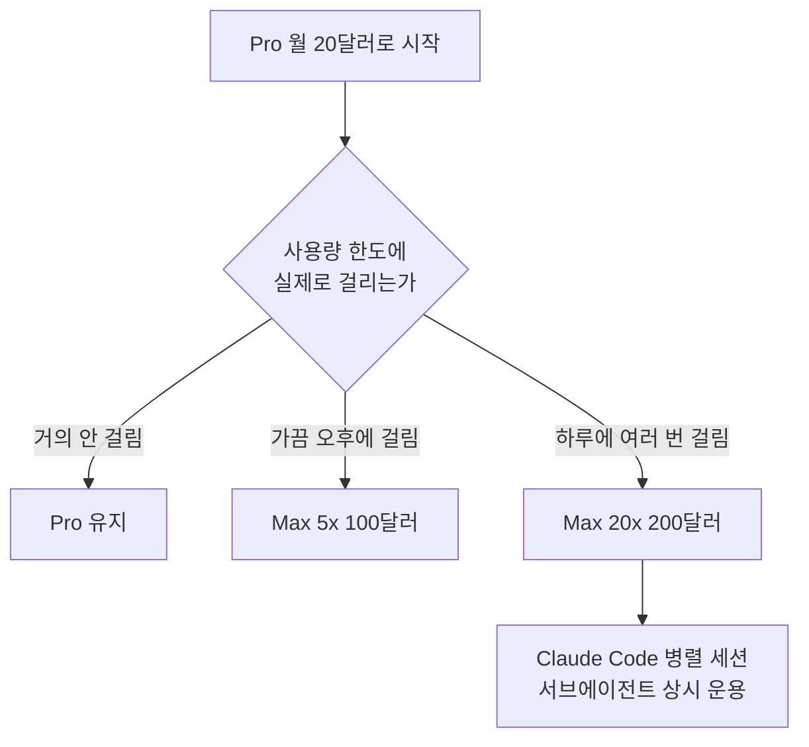

**클로드 유료 구독은 Pro 월 20달러부터 시작합니다.** Claude Code를 지속적으로 쓰려는 개인은 Pro에서 시작해 실제 한도 중단 빈도를 기록한 뒤 Max를 판단하는 편이 합리적입니다. Max는 더 좋은 모델을 여는 등급이 아니라 사용량을 늘리는 등급이고, 팀은 중앙 청구와 관리 기능이 필요할 때 비교해야 합니다. 아래 가격은 2026년 8월 23일 확인값이므로 결제 직전 공식 페이지를 다시 확인하세요.

> 요금은 자주 바뀝니다. 결제 직전에는 [공식 요금제 페이지](https://claude.com/pricing)에서 한 번 더 확인하시는 편이 안전합니다.
{: .prompt-warning }

> **먼저 알아둘 용어**
>
> - **API**: 다른 프로그램에서 이 기능을 불러다 쓸 수 있게 열어 둔 창구입니다.
> - **에이전트**: 사람이 단계마다 지시하지 않아도 스스로 여러 작업을 이어서 처리하는 AI입니다.
> - **토큰**: AI가 글을 잘게 쪼개 세는 단위입니다. 한국어는 보통 한두 글자가 토큰 하나입니다.
{: .prompt-info }

## 요금제 한눈에 보기

| 요금제 | 월 요금(연간 결제) | 월 요금(월 결제) | 사용량 | Claude Code |
| --- | --- | --- | --- | --- |
| Free | 0달러 | 0달러 | 주간 한도의 50% | 사용 불가 |
| **Pro** | **17달러** | **20달러** | 기준선 | 포함 |
| Max 5x | 100달러부터 | 100달러부터 | Pro의 5배 | 포함 |
| Max 20x | 200달러 | 200달러 | Pro의 20배 | 포함 |
| Team (Standard) | 20달러/인 | 25달러/인 | 팀 단위 | 포함 |
| Team (Premium) | 100달러/인 | 125달러/인 | 팀 단위 | 포함 |
| Enterprise | 별도 문의 | 별도 문의 | 좌석 요금 + API 사용량 | 포함 |

```chartjs
{
  "type": "bar",
  "data": {
    "labels": ["Free", "Pro", "Max 5x", "Max 20x"],
    "datasets": [{
      "label": "월 요금 (달러, 연간 결제 기준)",
      "data": [0, 17, 100, 200],
      "backgroundColor": ["#9aa5a1", "#2f9e8f", "#1d6f63", "#134f47"]
    }]
  },
  "options": {
    "responsive": true,
    "plugins": { "legend": { "display": true } },
    "scales": { "y": { "beginAtZero": true, "title": { "display": true, "text": "달러" } } }
  }
}
```

같은 값을 사용량 기준으로 다시 보면 선택이 더 분명해집니다. 요금은 Pro의 약 6배와 12배인데
사용량은 5배와 20배입니다. **20x 구간에서만 요금 대비 사용량이 유리해집니다.**

```chartjs
{
  "type": "bar",
  "data": {
    "labels": ["Pro", "Max 5x", "Max 20x"],
    "datasets": [
      {"label": "요금 배수 (Pro 대비)", "data": [1, 5.9, 11.8], "backgroundColor": "#c0857f"},
      {"label": "사용량 배수 (Pro 대비)", "data": [1, 5, 20], "backgroundColor": "#2f9e8f"}
    ]
  },
  "options": { "responsive": true, "scales": { "y": { "beginAtZero": true } } }
}
```

여기서 가장 중요한 사실 하나를 먼저 짚겠습니다. **Pro와 Max의 차이는 기능이 아니라 사용량입니다.** Max를 결제한다고 더 좋은 모델이 열리거나 없던 기능이 생기지 않습니다. 같은 것을 더 많이 쓸 수 있을 뿐입니다.

## 무료로 어디까지 되나

Free 등급은 주간 한도의 50%를 제공합니다. 웹과 모바일 앱에서 대화하는 용도로는 충분히 써볼 수 있지만, **Claude Code는 포함되지 않습니다.**

그래서 "클로드 코드를 무료로 써보고 싶다"는 요청에 대한 정확한 답은 이렇습니다. 구독 없이 쓰려면 Anthropic Console에서 API 키를 발급받아 사용량만큼 지불하는 방법뿐이고, 이건 무료가 아니라 종량제입니다. 가볍게 몇 번 돌려보는 정도라면 종량제가 구독보다 쌀 수 있습니다.

## Pro, 대부분의 사람에게 맞는 답

월 20달러, 연간 결제 시 월 17달러입니다. 1년으로 치면 240달러 대 204달러로 36달러 차이가 납니다.

Pro를 권하는 이유는 단순합니다. **Max가 필요한지 아닌지는 Pro를 써봐야 알 수 있기 때문입니다.** 사용량 한도에 실제로 걸려서 작업이 끊기는 경험을 하기 전까지는, 5배가 필요한지 20배가 필요한지 판단할 근거가 없습니다. 100달러와 200달러는 그 판단 없이 지르기에 적은 돈이 아닙니다.

Claude Code가 Pro에 포함되므로, 코딩 보조로 써보려는 목적이라면 여기서 시작하면 됩니다.

## Max 5x와 20x, 언제 필요한가

Max 5x가 월 100달러, Max 20x가 월 200달러입니다.



Anthropic의 사용량 한도는 약 5시간 단위 롤링 윈도우로 초기화됩니다. 하루 한 번 리셋이 아니라서, 오전에 한도를 다 써도 오후에 다시 작업할 수 있습니다. 이 구조 덕분에 **가벼운 사용자는 Pro에서 한도를 체감하기 어렵습니다.**

Max가 의미 있는 경우는 분명합니다. Claude Code를 하루 종일 켜두고 일하거나, 여러 세션과 서브에이전트를 동시에 돌리는 경우입니다. 그게 아니라면 200달러는 대부분 쓰지 못하고 버려집니다.

## 사용량 배수는 어떻게 판단해야 할까?

표의 5x와 20x를 “항상 정확히 다섯 배 또는 스무 배의 메시지를 보낸다”는 보장처럼 읽으면 안 됩니다. 실제 소모량은 선택한 모델, 대화가 길어지며 함께 전달되는 문맥, 첨부 파일, Claude Code 작업 크기와 병렬 세션 수에 따라 달라집니다. 짧은 질문 수만 세면 긴 코드베이스 분석에서 한도가 얼마나 빨리 줄어드는지 예측하기 어렵습니다.

판단에는 한도 자체보다 **한도로 잃은 작업 시간**을 기록하는 편이 유용합니다. Pro를 한 달 쓰면서 한도에 걸린 날짜, 기다린 시간, 중단된 작업의 중요도를 적어보세요. 한 달에 한두 번이고 기다린 뒤 이어갈 수 있다면 Pro가 여전히 경제적입니다. 반복적으로 중요한 작업이 멈추고 그 손실이 Max와 Pro의 가격 차이보다 크다면 그때 5x를 비교합니다. 5x에서도 매일 여러 세션이 막힐 때에만 20x가 근거 있는 선택이 됩니다.

실패 조건도 분명합니다. 단순히 “언젠가 많이 쓸 것 같다”는 예상만으로 Max를 먼저 결제하면 사용량을 남긴 채 비용만 늘 수 있습니다. 반대로 API를 별도로 호출하면서 구독 한도가 늘 거라고 생각하면 두 결제 체계가 분리돼 있어 기대한 효과가 없습니다. 구독 화면과 Console 비용을 각각 확인하고, 어느 경로에서 작업했는지를 함께 기록해야 합니다.

## Team과 Enterprise

Team은 좌석당 과금이고 두 종류가 있습니다. Standard는 연간 결제 기준 좌석당 월 20달러, Premium은 월 100달러입니다. 다섯 배 차이인데, 공식 페이지에 등급별 사용량 한도가 수치로 공개돼 있지 않아 무엇이 얼마나 늘어나는지는 확인되지 않습니다.

Enterprise는 좌석 요금에 API 사용량을 더하는 구조라 정찰가가 없습니다. 규모와 요구사항에 따라 협의합니다.

**주의할 점 하나.** 팀이 작다면 Team 플랜보다 개인 Pro를 인원수만큼 쓰는 게 쌀 수 있습니다. Team의 장점은 가격이 아니라 관리 기능과 중앙 청구입니다. 인원이 서너 명이고 관리가 필요 없다면 굳이 Team으로 갈 이유가 없습니다.

## 헷갈리기 쉬운 것, 구독과 API는 다른 지갑입니다

여기서 돈이 두 번 나가는 실수가 자주 납니다.

| 구분 | 결제 방식 | 무엇에 쓰이나 |
| --- | --- | --- |
| 구독(Pro, Max, Team) | 월 정액 | Claude 웹과 앱, Claude Code |
| API(Anthropic Console) | 사용한 토큰만큼 | 직접 만든 프로그램, 외부 도구 연동 |

**Pro를 결제했다고 API 키가 공짜로 생기지 않습니다.** 반대로 API 크레딧을 충전했다고 Claude 웹 앱의 한도가 늘어나지도 않습니다. 완전히 분리된 두 개의 계정 체계라고 생각하면 됩니다.

Claude Code는 두 방식 모두로 쓸 수 있습니다. 구독으로 쓰면 추가 과금 없이 한도 안에서 쓰는 것이고, API 키로 쓰면 토큰 사용량만큼 청구됩니다. 매일 쓴다면 구독이, 어쩌다 쓴다면 API가 유리합니다.

## 변경, 해지, 할인

- **변경**: 구독 설정에서 언제든 등급을 올리거나 내릴 수 있습니다. 상향은 즉시 반영되고 차액이 정산됩니다.
- **해지**: 해지해도 이미 결제한 기간이 끝날 때까지는 유료 기능을 계속 쓸 수 있습니다. 남은 기간이 즉시 사라지지 않습니다.
- **할인**: 상시 할인은 없습니다. 유일하게 확실한 절약은 연간 결제이고, Pro 기준 약 15%입니다.
- **Max 무료 체험**: 없습니다. 5x든 20x든 체험판 없이 바로 결제해야 합니다. 그래서 더더욱 Pro로 먼저 한도를 겪어보는 편이 낫습니다.

## 그래서 내 업무에는 뭐가 달라지나

요금제 선택을 세 문장으로 줄이면 이렇습니다.

1. **처음이라면 Pro 연간 결제.** 월 17달러로 Claude Code까지 포함이고, 한도가 부족한지 아닌지는 이걸 써봐야 압니다.
2. **한도에 자주 걸리기 시작하면 그때 Max 5x.** 걸리는 빈도를 한 달쯤 관찰한 뒤 결정해도 늦지 않습니다.
3. **팀으로 쓴다면 인원수를 먼저 세어보세요.** 서너 명이고 관리 기능이 필요 없다면 개인 Pro를 각자 쓰는 편이 쌉니다.

여기에 하나 덧붙이면, 회사 비용으로 처리할 계획이라면 **Team Standard 좌석이 개인 Pro보다 월 3달러(연간 결제 기준) 비싼 대신 중앙 청구가 된다**는 점이 실무에서는 꽤 큰 차이입니다. 개인 카드로 결제하고 매달 영수증 처리하는 수고가 사라집니다.

<!-- internal-links:start -->
## 함께 읽으면 이해가 이어지는 글

- [Claude Code로 영상을 대화하듯 편집하는 Video Use의 원리와 실전 활용법]() — Video Use는 Claude Code, Codex 등 AI 코딩 에이전트와 자연어로 대화하며 타임라인 편집 없이 영상을 완성하는 오픈소스 파이프라인입니다. 영상 프레임을 직접 LLM에 전달하는 대신 단어 단위 음성 스크립트를…
- [Claude Code는 어떻게 코딩 작업을 수행할까: 설치·권한·검증 가이드]() — Anthropic이 공개한 혁신적인 CLI 도구 'Claude Code'의 모든 것을 파헤칩니다. 단순한 챗봇을 넘어, 터미널에서 직접 코드를 수정하고 명령어를 실행하는 진정한 AI 에이전트의 설치부터 고급 활용법까지 상세히…
- [Claude 3.7 Sonnet 확장 사고는 언제 켤까: Claude Code와 비용 판단]() — 빠른 표준 응답과 확장 사고를 나누는 기준, Claude Code 작업 검수법, 발표 당시 가격과 캐싱 오해를 정리한다
<!-- internal-links:end -->

## 자주 묻는 질문

### 클로드 무료 요금제로 Claude Code를 쓸 수 있나요?

쓸 수 없습니다. Claude Code는 Pro 이상 유료 구독 또는 Anthropic Console의 API 키가 있어야 사용할 수 있습니다.

### Pro와 Max의 차이는 무엇인가요?

기능이 아니라 사용량 한도 차이입니다. Max 5x는 Pro의 5배, Max 20x는 20배를 제공하고, 쓸 수 있는 모델과 기능은 동일합니다.

### 구독료를 냈는데 API 요금이 또 나오나요?

구독과 API는 별개 결제입니다. Claude 앱과 Claude Code를 구독으로 쓰면 추가 과금이 없지만, Console에서 API 키를 발급해 직접 호출하면 그 사용량은 따로 청구됩니다.

### 연간 결제하면 얼마나 싼가요?

Pro 기준 월 20달러가 월 17달러가 되어 약 15% 저렴합니다. 1년에 36달러 차이입니다.

## 직접 확인한 원문

- [Claude 공식 요금제 페이지](https://claude.com/pricing) (2026년 8월 23일 확인)
- [Claude Code 공식 문서 개요](https://code.claude.com/docs/en/overview) (2026년 8월 23일 확인)

가격은 예고 없이 바뀝니다. 이 글의 수치는 위 날짜 기준이며, 결제 전에 공식 페이지를 한 번 더 확인하시기 바랍니다.
