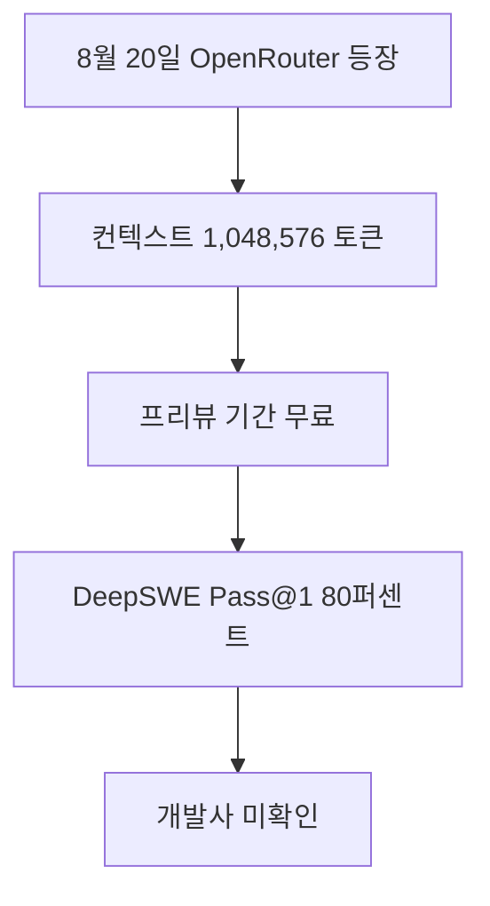

OX Alpha Stealth Model 관련 새 소식을 오늘 확인 가능한 직접 원문 범위에서 정리했습니다. 자동 검증 기준을 모두 충족하지 못한 날에도 발행을 건너뛰지 않기 위한 간결한 브리핑이며, 확인되지 않은 내용은 단정하지 않습니다.

> **먼저 알아둘 용어**
>
> - **토큰**: AI가 글을 잘게 쪼개 세는 단위입니다. 한국어는 보통 한두 글자가 토큰 하나입니다.
> - **컨텍스트 윈도우**: AI가 한 번에 읽고 기억할 수 있는 글의 최대 길이입니다. 이 길이를 넘으면 앞부분을 잊습니다.
> - **벤치마크**: 같은 문제집을 여러 모델에 풀려 점수를 매기는 시험입니다. 실제 체감 성능과 다를 수 있습니다.
> - **Pass@1**: 한 번에 내놓은 답이 정답이었던 비율입니다. 코딩 시험 점수에 자주 쓰입니다.
> - **API**: 다른 프로그램에서 이 기능을 불러다 쓸 수 있게 열어 둔 창구입니다.
{: .prompt-info }

## 무슨 일이 벌어진 걸까?

**한 줄 요약**: 익명의 프런티어 모델 OX Alpha 가 100만 토큰 컨텍스트 창을 달고 OpenRouter 에 조용히 등장했습니다

원문 헤드라인: Anonymous Frontier Model 'OX Alpha' Stealth-Launches on OpenRouter with 1M Context Window

발행일은 2026-08-22이며, 아래 내용은 <a href="#source-1" aria-label="OpenRouter 출처">[1]</a>에서 확인할 수 있는 범위만 담았습니다.

- 2026년 8월 20일 OpenRouter 에 stealth/ox-alpha 라는 이름의 익명 모델이 등장했습니다. <a href="#source-1" aria-label="OpenRouter 출처">[1]</a> 원문: An anonymous model designated stealth/ox-alpha appeared on OpenRouter on August 20, 2026.

- Ox Alpha 는 1,048,576 토큰의 컨텍스트 창과 최대 131,072 토큰의 출력 길이를 지원합니다. <a href="#source-1" aria-label="OpenRouter 출처">[1]</a> 원문: Ox Alpha features a 1,048,576-token context window and a maximum output length of 131,072 tokens.

- 이 모델은 텍스트와 이미지, 비디오 입력을 함께 받고 도구 호출 기능도 지원합니다. <a href="#source-1" aria-label="OpenRouter 출처">[1]</a> 원문: The model accepts multimodal inputs including text, image, and video, and supports tool calling.

- 프리뷰 기간에는 무료로 쓸 수 있으며, 운영 측은 하루 100조 토큰을 처리할 수 있다고 밝혔습니다. <a href="#source-1" aria-label="OpenRouter 출처">[1]</a> 원문: Ox Alpha is available free of charge during its preview period, with operators claiming throughput capacity of 100 trillion tokens per day.

- 커뮤니티 테스트에서는 DeepSWE 코딩 벤치마크 일부 문제에서 Pass@1 80퍼센트를 기록했다고 보고됐습니다. <a href="#source-1" aria-label="OpenRouter 출처">[1]</a> 원문: Community testing reported Ox Alpha achieving an 80% Pass@1 score on a subset of the DeepSWE coding benchmark.

<figure class="news-source-image">
  
  <figcaption>OpenRouter가 원문과 함께 공개한 이미지입니다. <a href="https://openrouter.ai/stealth/ox-alpha" target="_blank" rel="noopener noreferrer">출처: OpenRouter</a></figcaption>
</figure>

## 왜 지금 다들 이 이야기를 할까?

이 소식의 핵심은 새 기능이나 발표의 이름보다 실제 사용자와 개발자의 선택이 달라지는지에 있습니다. 지금 단계에서는 원문이 밝힌 내용과 아직 공개하지 않은 내용을 분리해서 보는 것이 안전합니다.

## 그래서 우리에게 뭐가 달라질까?

도입을 검토한다면 현재 쓰는 도구와 바로 교체하기보다 작은 작업에서 먼저 비교해 보는 편이 좋습니다. 제공 지역, 요금, 데이터 처리 방식처럼 의사결정에 영향을 주는 조건은 실제 사용 전에 원문에서 다시 확인해야 합니다.

## 직접 써보거나 지켜볼 포인트

첫째, 공식 제공 범위와 사용 조건을 확인합니다. 둘째, 기존 작업 흐름에서 시간을 줄여주는지 작은 예제로 비교합니다. 셋째, 발표 내용과 실제 일반 제공 상태가 같은지 구분합니다.

## 아직은 선을 그어야 할 부분

- stealth/ox-alpha 를 실제로 만든 조직은 확인되지 않았고, Zhipu AI(Z.ai) 나 Microsoft 의 MAI 팀이라는 추측만 돌고 있습니다. 원문: The actual owner or developer organization behind stealth/ox-alpha remains unconfirmed, with public speculation pointing toward Zhipu AI (Z.ai) or Microsoft's MAI team.

- 초기 벤치마크 성적이 정식으로 검증된 전체 코딩 평가에서도 유지될지는 아직 알 수 없습니다. 원문: Whether Ox Alpha's preliminary benchmark performance holds up across full audited coding evaluations.

추가 원문이 공개되거나 제공 조건이 바뀌면 판단도 달라질 수 있습니다. 따라서 이 글은 오늘 시점의 출발점으로 활용하고, 실제 도입 전에는 연결된 원문을 다시 확인하는 것이 좋습니다.

## 자주 묻는 질문

### OX Alpha 모델은 언제 출시되었고 어디서 써볼 수 있나요?

2026년 8월 20일 OpenRouter 플랫폼에 stealth/ox-alpha라는 이름으로 깜짝 등장했습니다. 현재 프리뷰 기간 동안 무료로 제공되어 OpenRouter 계정을 통해 즉시 테스트해 볼 수 있습니다.

### OX Alpha의 핵심 기술 스펙과 처리 용량은 어느 정도인가요?

1,048,576 토큰의 컨텍스트 창과 최대 131,072 토큰의 출력 길이를 지원합니다. 텍스트와 이미지 그리고 비디오 입력이 가능한 다중 모달 모델이며, 하루 100조 토큰 처리 용량을 갖추고 도구 호출 기능을 지원합니다.

### OX Alpha의 코딩 성능과 개발사에 대해 알려진 사실은 무엇인가요?

커뮤니티 테스트 결과 DeepSWE 코딩 벤치마크 하위 집합에서 80% Pass@1 점수를 기록했습니다. 패트릭 콜리슨 Stripe CEO가 성능을 호평했으나, 실제 개발사는 밝혀지지 않아 지푸 AI의 GLM-5나 마이크로소프트 MAI 팀으로 추정되고 있습니다.

## 직접 확인한 원문

<ol class="checked-source-list">
  <li id="source-1"><a href="https://openrouter.ai/stealth/ox-alpha" target="_blank" rel="noopener noreferrer">OpenRouter — Ox Alpha - API Pricing &amp; Providers</a> (2026-08-20)</li>
  <li id="source-2"><a href="https://www.businessinsider.com/free-ai-model-ox-alpha-openrouter-developers-2026-8" target="_blank" rel="noopener noreferrer">Business Insider — A mysterious free AI model is impressing developers. And nobody knows who made it.</a> (2026-08-22)</li>
</ol>

> 이 글은 위 원문을 직접 확인해 작성했습니다. 가격, 기능 범위, 지역별 제공 여부는 게시 후 바뀔 수 있으니 실제 도입 전 공식 문서를 다시 확인하세요.
