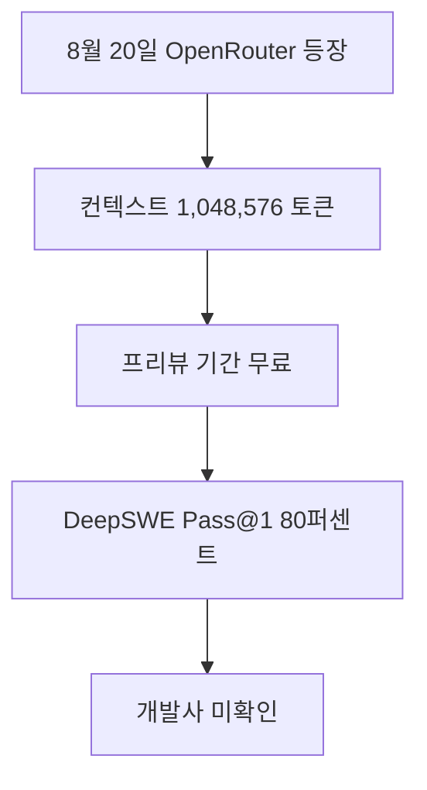

OX Alpha는 OpenRouter에서 무료 프리뷰로 시험할 수 있는 익명 모델이며, 100만 토큰 컨텍스트와 멀티모달 입력을 지원한다고 공개됐습니다. 다만 개발사가 확인되지 않았고 80% 코딩 점수도 DeepSWE 전체가 아닌 일부 문제에 대한 커뮤니티 결과입니다. 긴 문서·코드 작업에 후보로 시험할 수는 있지만, 신원·데이터 처리·정식 가격과 전체 평가가 확인되기 전에는 민감한 운영 업무의 기본 모델로 정하기 이릅니다.

> **먼저 알아둘 용어**
>
> - **토큰**: AI가 글을 잘게 쪼개 세는 단위입니다. 한국어는 보통 한두 글자가 토큰 하나입니다.
> - **컨텍스트 윈도우**: AI가 한 번에 읽고 기억할 수 있는 글의 최대 길이입니다. 이 길이를 넘으면 앞부분을 잊습니다.
> - **벤치마크**: 같은 문제집을 여러 모델에 풀려 점수를 매기는 시험입니다. 실제 체감 성능과 다를 수 있습니다.
> - **Pass@1**: 한 번에 내놓은 답이 정답이었던 비율입니다. 코딩 시험 점수에 자주 쓰입니다.
> - **API**: 다른 프로그램에서 이 기능을 불러다 쓸 수 있게 열어 둔 창구입니다.
{: .prompt-info }

## 무슨 일이 벌어진 걸까?

**한 줄 요약**: 익명의 프런티어 모델 OX Alpha 가 100만 토큰 컨텍스트 창을 달고 OpenRouter 에 조용히 등장했습니다

원문 헤드라인: Anonymous Frontier Model 'OX Alpha' Stealth-Launches on OpenRouter with 1M Context Window

발행일은 2026-08-22이며, 아래 내용은 <a href="#source-1" aria-label="OpenRouter 출처">[1]</a>에서 확인할 수 있는 범위만 담았습니다.

- 2026년 8월 20일 OpenRouter 에 stealth/ox-alpha 라는 이름의 익명 모델이 등장했습니다. <a href="#source-1" aria-label="OpenRouter 출처">[1]</a> 원문: An anonymous model designated stealth/ox-alpha appeared on OpenRouter on August 20, 2026.

- Ox Alpha 는 1,048,576 토큰의 컨텍스트 창과 최대 131,072 토큰의 출력 길이를 지원합니다. <a href="#source-1" aria-label="OpenRouter 출처">[1]</a> 원문: Ox Alpha features a 1,048,576-token context window and a maximum output length of 131,072 tokens.

- 이 모델은 텍스트와 이미지, 비디오 입력을 함께 받고 도구 호출 기능도 지원합니다. <a href="#source-1" aria-label="OpenRouter 출처">[1]</a> 원문: The model accepts multimodal inputs including text, image, and video, and supports tool calling.

- 프리뷰 기간에는 무료로 쓸 수 있으며, 운영 측은 하루 100조 토큰을 처리할 수 있다고 밝혔습니다. <a href="#source-1" aria-label="OpenRouter 출처">[1]</a> 원문: Ox Alpha is available free of charge during its preview period, with operators claiming throughput capacity of 100 trillion tokens per day.

- 커뮤니티 테스트에서는 DeepSWE 코딩 벤치마크 일부 문제에서 Pass@1 80퍼센트를 기록했다고 보고됐습니다. <a href="#source-1" aria-label="OpenRouter 출처">[1]</a> 원문: Community testing reported Ox Alpha achieving an 80% Pass@1 score on a subset of the DeepSWE coding benchmark.

<figure class="news-source-image">
  
  <figcaption>OpenRouter가 원문과 함께 공개한 이미지입니다. <a href="https://openrouter.ai/stealth/ox-alpha" target="_blank" rel="noopener noreferrer">출처: OpenRouter</a></figcaption>
</figure>

## 100만 토큰을 실제 업무에서 어떻게 검증할까?

1,048,576 토큰은 한 번에 받을 수 있다고 표시된 최대 컨텍스트 크기입니다. 이 숫자만으로 앞부분의 세부 사항을 끝까지 정확히 회상하거나, 긴 입력에서도 빠른 응답을 유지한다는 뜻은 아닙니다. 같은 문서를 짧은 구간과 긴 구간으로 나눠 넣고, 앞·중간·뒤에서 동일한 종류의 근거를 찾아 인용하게 하면 길이에 따른 누락을 비교할 수 있습니다.

코드 저장소 평가라면 단순 요약보다 실제 의존 관계를 묻는 편이 낫습니다. 여러 파일에 흩어진 함수 호출을 추적하게 하고, 답에 파일명과 근거 위치를 함께 요구한 뒤 사람이 확인합니다. 입력을 늘릴수록 정답률이 떨어지거나 관련 없는 파일을 근거로 들면, 표시된 최대 길이보다 작은 실사용 한도를 정해야 합니다. 첫 토큰까지 걸리는 시간과 전체 완료 시간도 함께 기록해야 긴 컨텍스트가 검색 후 필요한 부분만 넣는 방식보다 나은지 판단할 수 있습니다.

## DeepSWE 80%를 다른 모델과 바로 비교해도 될까?

현재 공개된 80% Pass@1은 커뮤니티가 DeepSWE의 **하위 집합**에서 보고한 값입니다. 전체 문제, 실행 환경, 채점 설정이 같은 공식 비교가 아니면 다른 모델의 전체 벤치마크 점수와 한 줄로 순위를 매길 수 없습니다. Pass@1은 첫 제출의 통과율을 보여주지만 수정 횟수, 실행 시간, 도구 호출 실패, 사람이 검토한 시간까지 설명하지도 않습니다.

도입 판단에는 팀이 실제로 해결했던 버그와 기능 요청을 별도 평가 세트로 만드는 편이 유용합니다. 모델 이름을 가리고 동일한 프롬프트와 도구 권한을 주고, 테스트 통과 여부와 잘못 바꾼 파일 수를 기록합니다. 작은 공개 하위 집합에서는 강해도 팀의 언어·프레임워크에서 회귀를 자주 만들면 기본 코딩 모델로 바꿀 이유가 없습니다.

## 무료 프리뷰에서 무엇을 확인해야 할까?

무료라는 조건은 프리뷰 기간에 한정되어 있으므로 정식 가격과 종료일을 가정해 장기 예산을 짜면 안 됩니다. 모델 식별자와 응답 형식, 도구 호출 성공률, 속도 제한을 기록해 두면 모델이 교체되거나 조건이 바뀌었을 때 차이를 찾기 쉽습니다. 처리 용량으로 발표된 하루 100조 토큰도 개별 계정이 그만큼 쓸 수 있다는 한도가 아니므로, 실제 계정의 제한은 OpenRouter 설정에서 별도로 확인해야 합니다.

개발 주체가 공개되지 않은 점은 성능과 별개의 운영 위험입니다. 민감하지 않은 공개 코드와 합성 문서로 먼저 시험하고, 어떤 제공자가 요청을 처리하는지와 로그 보존 조건이 확인된 뒤 데이터 범위를 넓혀야 합니다. 프리뷰 종료 후에도 같은 모델과 가격이 유지된다는 보장이 없으므로 교체 가능한 API 계층과 회귀 테스트를 준비해 두는 편이 안전합니다.

## 아직은 선을 그어야 할 부분

- stealth/ox-alpha 를 실제로 만든 조직은 확인되지 않았고, Zhipu AI(Z.ai) 나 Microsoft 의 MAI 팀이라는 추측만 돌고 있습니다. 원문: The actual owner or developer organization behind stealth/ox-alpha remains unconfirmed, with public speculation pointing toward Zhipu AI (Z.ai) or Microsoft's MAI team.

- 초기 벤치마크 성적이 정식으로 검증된 전체 코딩 평가에서도 유지될지는 아직 알 수 없습니다. 원문: Whether Ox Alpha's preliminary benchmark performance holds up across full audited coding evaluations.

추가 원문이 공개되거나 제공 조건이 바뀌면 판단도 달라질 수 있습니다. 따라서 이 글은 오늘 시점의 출발점으로 활용하고, 실제 도입 전에는 연결된 원문을 다시 확인하는 것이 좋습니다.

<!-- primary-sources:start -->
## 원문과 버전 확인

- [발표 원문](https://openrouter.ai/stealth/ox-alpha)
- [Business Insider](https://www.businessinsider.com/free-ai-model-ox-alpha-openrouter-developers-2026-8)
<!-- primary-sources:end -->

<!-- internal-links:start -->
## 함께 읽으면 이해가 이어지는 글

- [Google Gemini 3.7 Flash 출시: 코딩 성능 향상과 50% 수준의 API 가격 할인]() — Google AI가 2026년 8월 13일 소프트웨어 엔지니어링과 에이전트 추론 성능을 끌어올린 Gemini 3.7 Flash 모델을 정식 출시했습니다. 100만 토큰 문맥 창과 최대 64K 출력 토큰을 지원하며…
- [Athena-Public은 모델을 바꿔도 기억할까: 10K 부팅·278개 프로토콜 검증]() — Athena-Public이 로컬 마크다운으로 상태를 보존하는 방식과 10K 부팅·278개 프로토콜 주장을 살펴보고, 검색·충돌·클라우드 전송 한계를 정리합니다.
- [jcode의 14ms 부팅은 무엇을 바꿀까: Rust Harness·Semantic Memory·Swarm 검증 기준]() — jcode가 제시하는 14ms 부팅·27.8MB idle RAM, vector semantic memory와 daemon 기반 swarm 구조를 살펴보고, 수치 재현·검색 오류·동시 편집·API 비용의 도입 조건을 정리합니다.
<!-- internal-links:end -->

## 자주 묻는 질문

### OX Alpha 모델은 언제 출시되었고 어디서 써볼 수 있나요?

2026년 8월 20일 OpenRouter 플랫폼에 stealth/ox-alpha라는 이름으로 깜짝 등장했습니다. 현재 프리뷰 기간 동안 무료로 제공되어 OpenRouter 계정을 통해 즉시 테스트해 볼 수 있습니다.

### OX Alpha의 핵심 기술 스펙과 처리 용량은 어느 정도인가요?

1,048,576 토큰의 컨텍스트 창과 최대 131,072 토큰의 출력 길이를 지원합니다. 텍스트와 이미지 그리고 비디오 입력이 가능한 다중 모달 모델이며, 하루 100조 토큰 처리 용량을 갖추고 도구 호출 기능을 지원합니다.

### OX Alpha의 코딩 성능과 개발사에 대해 알려진 사실은 무엇인가요?

커뮤니티 테스트 결과 DeepSWE 코딩 벤치마크 하위 집합에서 80% Pass@1 점수를 기록했습니다. 패트릭 콜리슨 Stripe CEO가 성능을 호평했으나, 실제 개발사는 밝혀지지 않아 지푸 AI의 GLM-5나 마이크로소프트 MAI 팀으로 추정되고 있습니다.

## 직접 확인한 원문

<ol class="checked-source-list">
  <li id="source-1"><a href="https://openrouter.ai/stealth/ox-alpha" target="_blank" rel="noopener noreferrer">OpenRouter — Ox Alpha - API Pricing &amp; Providers</a> (2026-08-20)</li>
  <li id="source-2"><a href="https://www.businessinsider.com/free-ai-model-ox-alpha-openrouter-developers-2026-8" target="_blank" rel="noopener noreferrer">Business Insider — A mysterious free AI model is impressing developers. And nobody knows who made it.</a> (2026-08-22)</li>
</ol>

> 이 글은 위 원문을 직접 확인해 작성했습니다. 가격, 기능 범위, 지역별 제공 여부는 게시 후 바뀔 수 있으니 실제 도입 전 공식 문서를 다시 확인하세요.
