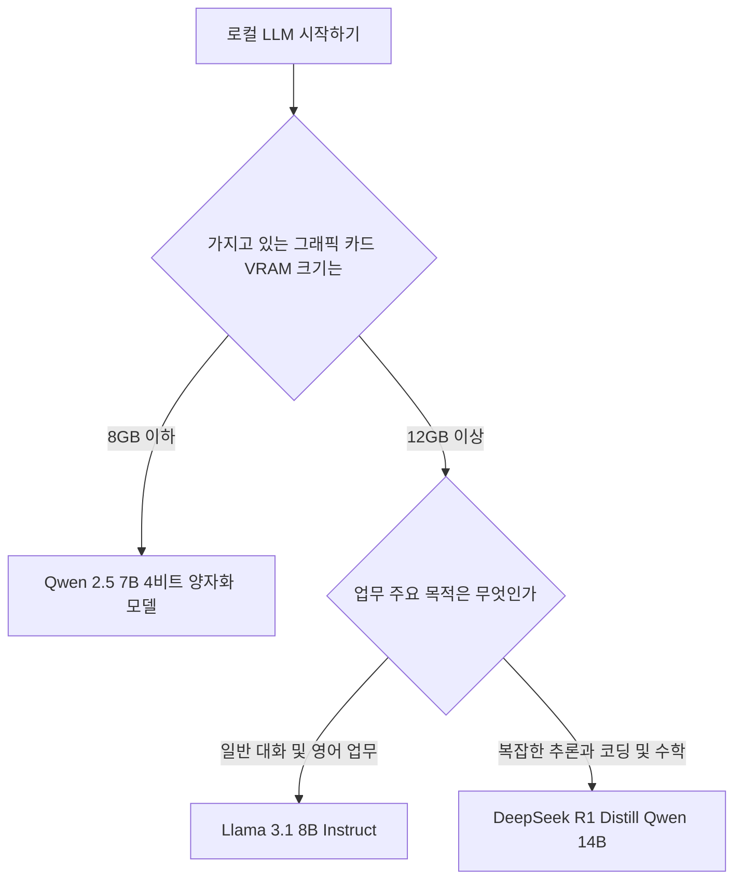

> **먼저 알아둘 용어**
>
> - **LLM**: 엄청난 양의 글을 학습해 문장을 만들어 내는 대형 AI 모델입니다. ChatGPT 가 대표적입니다.
> - **오픈소스**: 소스 코드를 공개해 누구나 보고 고쳐 쓸 수 있게 한 것입니다. 조건은 라이선스마다 다릅니다.
> - **추론**: 학습이 끝난 모델이 실제로 답을 만들어 내는 과정입니다. 이때 드는 계산 비용이 곧 사용료입니다.
> - **토큰**: AI가 글을 잘게 쪼개 세는 단위입니다. 한국어는 보통 한두 글자가 토큰 하나입니다.
> - **API**: 다른 프로그램에서 이 기능을 불러다 쓸 수 있게 열어 둔 창구입니다.
{: .prompt-info }

## 로컬 LLM 추천 모델과 장비 선택 답안
내 그래픽 카드의 비디오 메모리 크기에 맞춰 Llama 3.1 8B, Qwen 2.5 7B, DeepSeek-R1-Distill-Qwen-14B 중 하나를 선택하면 됩니다.

인터넷 연결 없이 개인 컴퓨터나 내부 서버에서 거대언어모델(AI가 대량의 글자를 학습해 문장을 생성하는 인공지능)을 직접 구동하려는 분들이 늘고 있습니다. 클라우드 서비스 비용 부담을 줄이거나 내부 데이터를 보호하기 위해서입니다. 하지만 인터넷 커뮤니티나 디시인사이드 같은 곳에서 정보를 찾다 보면 어떤 모델을 고르고 컴퓨터 장비를 어떻게 맞춰야 하는지 복잡하게 느껴집니다. 이 글은 로컬 LLM 비교부터 필수 장비 사양까지 한 번에 정리해 드립니다.



## 주요 로컬 LLM 모델 성능 비교
로컬 LLM 성능 비교를 위해 대표적인 오픈소스 모델 3종을 선정해 분석했습니다. Meta의 Llama 3.1 8B Instruct, 알리바바의 Qwen 2.5 7B Instruct, 그리고 추론 특화 모델인 DeepSeek-R1-Distill-Qwen-14B입니다.

Meta의 Llama 3.1 8B Instruct 모델은 80억 개의 파라미터(AI가 정보를 처리하는 매개변수)를 보유한 언어 모델입니다. 대화와 지시 이행 과제에 최적화되어 있으며 128K(약 12만 8천 토큰) 컨텍스트 길이를 지원합니다. 알리바바의 Qwen 2.5 7B Instruct 모델은 76억 개의 파라미터를 가진 오픈소스 모델입니다. 코딩과 수학 능력이 대폭 향상되었으며 기본적으로 128K 토큰 컨텍스트를 지원합니다. DeepSeek-R1-Distill-Qwen-14B는 DeepSeek-R1의 추론 데이터를 Qwen 2.5 14B 모델에 증류(큰 모델의 지식을 작은 모델에 옮겨 학습하는 기술)하여 만든 추론 특화 모델입니다.

| 모델명 | 파라미터 수 | 기본 컨텍스트 길이 | 주요 특징 및 장점 |
| --- | --- | --- | --- |
| Llama 3.1 8B Instruct | 80억 개 | 128K 토큰 | 범용 대화 및 지시 이행에 안정적임 |
| Qwen 2.5 7B Instruct | 76억 개 | 128K 토큰 (1M 전용 모델 존재) | 코딩, 수학 능력 우수, 8GB VRAM 대응 |
| DeepSeek-R1-Distill-Qwen-14B | 140억 개 | 128K 토큰 | 심도 있는 추론과 문제 해결 능력 우수 |

정확한 컨텍스트 처리가 필요한 경우 Qwen 2.5 시리즈 중 Qwen2.5-7B-Instruct-1M 모델을 선택할 수 있습니다. 해당 모델은 최대로 100만(1M) 토큰 길이의 입력 처리를 지원합니다. 이는 책 두 세 권 분량의 긴 문서나 방대한 코드 베이스를 한 번에 입력받아 읽을 수 있는 크기입니다.

## 로컬 LLM 사양 추천과 그래픽 카드 선택 기준
로컬 LLM 그래픽 카드 추천의 핵심은 그래픽 카드 내부 전용 메모리인 VRAM(비디오 램) 크기입니다. 로컬 LLM 장비 추천 시 프로세서 성능보다 VRAM 용량이 최우선 기준이 됩니다.

기본 정밀도인 FP16(16비트 부동소수점) 상태에서는 1B(10억 개 파라미터)당 약 2GB의 VRAM이 필요합니다. 80억 개 파라미터 모델을 원래 크기로 띄우려면 약 16GB VRAM이 소요됩니다. 하지만 INT4(4비트) 양자화(모델 정밀도를 줄여 메모리 용량을 축소하는 기술)를 적용하면 1B당 메모리 소요량이 약 0.5GB 수준으로 감소합니다.

Qwen 2.5 7B Instruct의 GGUF Q4_K_M 양자화 모델은 파일 크기가 약 4.7GB 내외로 축소됩니다. 따라서 RTX 3060이나 RTX 4060 같은 8GB VRAM 그래픽 카드에서도 단독으로 실행할 수 있습니다. 반면 DeepSeek-R1-Distill-Qwen-14B의 GGUF Q4_K_M 양자화 파일 크기는 약 8.99GB입니다. 이를 구동하려면 최소 12GB 이상 VRAM을 탑재한 그래픽 카드가 필요합니다.

```chartjs
{
  "type": "bar",
  "data": {
    "labels": ["Qwen 2.5 7B (Q4)", "DeepSeek-R1 14B (Q4)", "1B당 FP16 소요량", "1B당 INT4 소요량"],
    "datasets": [{
      "label": "용량 및 VRAM 소요 (GB)",
      "data": [4.7, 8.99, 2.0, 0.5],
      "backgroundColor": ["#2f9e8f", "#1d6f63", "#e76f51", "#f4a261"]
    }]
  },
  "options": {"responsive": true}
}
```

## 로컬 LLM 가격과 라이선스 정직한 분석
로컬 LLM 가격은 소프트웨어 라이선스 자체는 대부분 무료입니다. 오픈소스 프레임워크인 Ollama를 사용하면 최신 로컬 LLM 추천 모델을 명령줄이나 API 형태로 비용 없이 구축할 수 있습니다. Ollama는 Llama 3, Qwen 2.5, DeepSeek 모델을 컴퓨터 명령창에서 단 한 줄의 명령어로 구동하게 해줍니다.

하지만 상용 라이선스 제약 조건과 초기 하드웨어 구매 비용을 고려해야 합니다. Meta의 Llama 3.1 커뮤니티 라이선스는 월간 활성 사용자(MAU)가 7억 명을 넘는 대규모 상용 서비스에 대해 별도의 승인 절차를 요구합니다. 일반적인 기업 내부 도입이나 소규모 서비스에서는 비용 없이 사용할 수 있지만, 거대 플랫폼에 적용할 경우 승인이 필수적입니다.

또한 로컬 LLM 추천 디시 등 사용자 커뮤니티에서 자주 간과하는 점은 사용 중 발생하는 전기 요금과 고사양 GPU 구입 비용입니다. 초기 장비 구매 비용이 부담된다면 기존 구형 하드웨어에서 4비트 양자화 모델부터 무료로 테스트해 보는 것을 권장합니다.

## 그래서 내 업무에는 뭐가 달라지나
로컬 LLM 모델 추천 목록 중 내 업무 환경에 맞춰 오늘 바로 시작할 행동 절차입니다.

1. 가지고 있는 그래픽 카드가 8GB VRAM(RTX 3060 또는 RTX 4060)이라면:
Ollama를 설치하고 Qwen 2.5 7B Q4 양자화 모델을 다운로드하여 코딩과 데이터 정리 업무에 바로 투입합니다.

2. 그래픽 카드가 12GB VRAM 이상(RTX 3060 12GB, RTX 4070, RTX 4080 등)이라면:
DeepSeek-R1-Distill-Qwen-14B 모델을 설치하여 복잡한 보고서 작성 및 논리적 추론 업무에 활용합니다.

3. 상용 서비스를 준비 중인 기업 담당자라면:
월간 활성 사용자 수를 검토하고, 라이선스 승인 절차가 없는 Qwen 2.5 시리즈를 우선 검토하거나 Llama 3.1 사용 조건을 체크합니다.

## 자주 묻는 질문

### 로컬 LLM 구동 시 그래픽 카드가 없어도 CPU만으로 실행이 가능한가요?

실행은 가능하지만 처리 속도가 매우 느려 실용성이 떨어집니다. 4비트 양자화 모델 기준으로 최소 8GB 이상의 VRAM을 갖춘 그래픽 카드를 사용하는 것을 권장합니다.

### Ollama는 무료 프로그램인가요?

네, Ollama는 무료 오픈소스 프레임워크입니다. Llama 3.1, Qwen 2.5, DeepSeek 등 다양한 모델을 별도 결제 없이 무료로 로컬 환경에 설치하여 사용할 수 있습니다.

### 100만 토큰 컨텍스트를 사용하려면 추가 장비가 필요한가요?

Qwen 2.5 7B 1M 모델처럼 긴 컨텍스트를 처리할 때는 메모리 사용량이 급증합니다. 전체 맥락을 가득 채워 사용하려면 기본 VRAM 외에 시스템 RAM 용량도 32GB 이상으로 여유 있게 확보해야 합니다.

## 직접 확인한 원문

- [Hugging Face](https://huggingface.co/meta-llama/Llama-3.1-8B-Instruct) (2026-08-24 확인)
- [Hugging Face](https://huggingface.co/Qwen/Qwen2.5-7B-Instruct) (2026-08-24 확인)
- [Hugging Face](https://huggingface.co/Qwen/Qwen2.5-7B-Instruct-GGUF) (2026-08-24 확인)
- [Hugging Face](https://huggingface.co/deepseek-ai/DeepSeek-R1-Distill-Qwen-14B) (2026-08-24 확인)
- [Hugging Face](https://huggingface.co/unsloth/DeepSeek-R1-Distill-Qwen-14B-GGUF) (2026-08-24 확인)
- [GitHub](https://github.com/ollama/ollama) (2026-08-24 확인)
- [Hugging Face](https://huggingface.co/Qwen/Qwen2.5-7B-Instruct-1M) (2026-08-24 확인)
- [Hugging Face](https://huggingface.co/RedHatAI/Llama-3.1-8B-Instruct) (2026-08-24 확인)
- [Spheron Network](https://spheron.network/blog/llm-vram-requirements-guide/) (2026-08-24 확인)

위 수치는 확인 시점 기준이며 예고 없이 바뀔 수 있습니다. 결정 전에 공식 페이지를 한 번 더 확인하시기 바랍니다.
