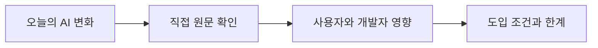
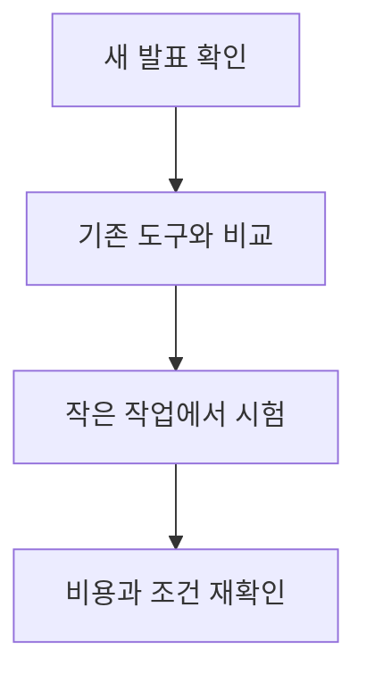
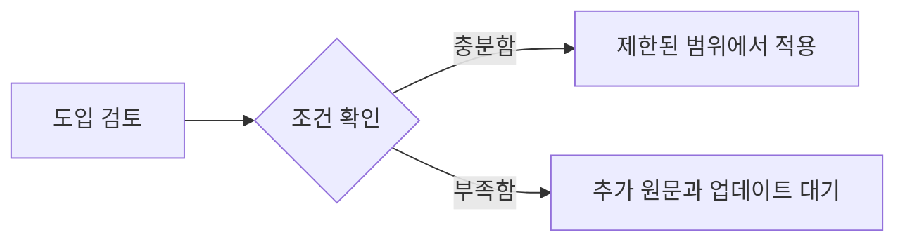

AI Business & Infrastructure 관련 새 소식을 오늘 확인 가능한 직접 원문 범위에서 정리했습니다. 자동 검증 기준을 모두 충족하지 못한 날에도 발행을 건너뛰지 않기 위한 간결한 브리핑이며, 확인되지 않은 내용은 단정하지 않습니다. 원문이 영어인 문장은 한국어로 옮기고, 대조할 수 있도록 원문도 함께 남겼습니다.

## 무슨 일이 벌어진 걸까?

**한 줄 요약**: Nvidia, Poolside와 70억 달러 규모 계약 체결하여 Model Factory 라이선스 확보 및 Nemotron용 핵심 인재 영입

원문 헤드라인: Nvidia Agrees to $7 Billion Deal with Poolside to License Model Factory and Hire Key Talent for Nemotron

발행일은 2026-08-21이며, 아래 내용은 <a href="#source-1" aria-label="PYMNTS 출처">[1]</a>에서 확인할 수 있는 범위만 담았습니다.

- Nvidia는 Poolside의 AI 모델 개발 소프트웨어인 Model Factory에 대한 비독점 라이선스 대가로 60억 달러를 지급하기로 합의했습니다. <a href="#source-1" aria-label="PYMNTS 출처">[1]</a> 원문: Nvidia agreed to pay $6 billion for a non-exclusive license to Poolside's AI model-development software, known as Model Factory.

- Nvidia는 Poolside에 120억 달러의 투자 전 기업가치로 10억 달러를 추가 투자하여 총 거래 규모가 70억 달러에 달합니다. <a href="#source-1" aria-label="PYMNTS 출처">[1]</a> 원문: Nvidia is investing an additional $1 billion in Poolside at a $12 billion pre-money valuation, bringing the total deal value to $7 billion.

- Nvidia는 Poolside의 Laguna 모델 패밀리 및 Model Factory 개발에 참여한 109명의 Poolside 직원 및 엔지니어에게 채용 제안을 전달하고 있습니다. <a href="#source-1" aria-label="PYMNTS 출처">[1]</a> 원문: Nvidia is extending employment offers to 109 Poolside staff members and engineers who were involved in developing Poolside's Laguna model family and Model Factory.

- Poolside의 공동 창업자 3명은 스타트업에 계속 남게 되며, 회사는 독립 기업으로 계속 운영됩니다. <a href="#source-1" aria-label="PYMNTS 출처">[1]</a> 원문: Poolside's three co-founders will remain with the startup, which will continue to operate as an independent company.

- Poolside 경영진은 투자자 서한에서 이번 거래가 기업 인수나 아쿠아하이어(인재 영입 목적 인수)가 아님을 명확히 밝혔습니다. <a href="#source-1" aria-label="PYMNTS 출처">[1]</a> 원문: In a letter to investors, Poolside's leadership explicitly stated that the transaction is not a corporate acquisition or an acquihire.

<figure class="news-source-image">
  
  <figcaption>TipRanks가 원문과 함께 공개한 이미지입니다. <a href="https://www.tipranks.com/news/nvidia-nvda-makes-7-billion-poolside-ai-bet-ahead-of-earnings" target="_blank" rel="noopener noreferrer">출처: TipRanks</a></figcaption>
</figure>

## 왜 지금 다들 이 이야기를 할까?

이 소식의 핵심은 새 기능이나 발표의 이름보다 실제 사용자와 개발자의 선택이 달라지는지에 있습니다. 지금 단계에서는 원문이 밝힌 내용과 아직 공개하지 않은 내용을 분리해서 보는 것이 안전합니다.

<figure class="news-source-image">
  
  <figcaption>Newcomer가 원문과 함께 공개한 이미지입니다. <a href="https://www.newcomer.co/p/sources-poolside-strikes-6-billion" target="_blank" rel="noopener noreferrer">출처: Newcomer</a></figcaption>
</figure>

## 그래서 우리에게 뭐가 달라질까?

도입을 검토한다면 현재 쓰는 도구와 바로 교체하기보다 작은 작업에서 먼저 비교해 보는 편이 좋습니다. 제공 지역, 요금, 데이터 처리 방식처럼 의사결정에 영향을 주는 조건은 실제 사용 전에 원문에서 다시 확인해야 합니다.

## 직접 써보거나 지켜볼 포인트

첫째, 공식 제공 범위와 사용 조건을 확인합니다. 둘째, 기존 작업 흐름에서 시간을 줄여주는지 작은 예제로 비교합니다. 셋째, 발표 내용과 실제 일반 제공 상태가 같은지 구분합니다.

## 아직은 선을 그어야 할 부분

- 반독점 규제 당국이 Nvidia와 Poolside 간의 라이선스 및 인재 영입 거래 구조를 공식 조사하거나 이의를 제기할지 여부. 원문: Whether antitrust regulators will formally review or challenge Nvidia's licensing and hiring arrangement with Poolside.

- Poolside에 남은 팀이 독립적으로 추진할 구체적인 기술 로드맵 및 상업적 프로젝트 내용. 원문: The specific technical roadmap and commercial projects that Poolside's remaining team will pursue independently.

추가 원문이 공개되거나 제공 조건이 바뀌면 판단도 달라질 수 있습니다. 따라서 이 글은 오늘 시점의 출발점으로 활용하고, 실제 도입 전에는 연결된 원문을 다시 확인하는 것이 좋습니다.

## 자주 묻는 질문

### Nvidia가 Poolside를 70억 달러에 완전히 인수했나요?

아니오, Nvidia는 Poolside를 완전히 인수한 것이 아니라 Model Factory에 대한 60억 달러 라이선스 계약과 10억 달러 지분 투자를 진행했습니다. Poolside의 공동 창업자 3명과 남은 팀은 독립 기업으로 유지되며 기업 인수나 아쿠아하이어가 아님을 밝혔습니다.

### Poolside 엔지니어들은 Nvidia로 모두 이동하나요?

Laguna 모델 및 Model Factory 개발에 참여했던 엔지니어와 직원 109명이 Nvidia로부터 채용 제안을 받았습니다. 영입된 인력은 Nvidia의 오픈웨이트 AI 모델인 Nemotron 개발팀 강화에 투입됩니다.

### 이번 거래로 일반 사용자가 당장 이용할 수 있는 AI 서비스가 있나요?

아니오, 지금 단계에서 일반 사용자가 직접 쓸 수 있는 출시 서비스는 없습니다. Nvidia 내부의 오픈웨이트 모델 Nemotron 강화 목적이므로 향후 공개될 모델 업데이트를 기다려야 합니다.

## 직접 확인한 원문

<ol class="checked-source-list">
  <li id="source-1"><a href="https://www.pymnts.com/ai-technology/2026/nvidia-pays-6-billion-license-poolside-ai-model-development-software" target="_blank" rel="noopener noreferrer">PYMNTS — Nvidia Pays $6 Billion to License Poolside AI Model-Development Software</a> (2026-08-21)</li>
  <li id="source-2"><a href="https://www.tipranks.com/news/nvidia-nvda-makes-7-billion-poolside-ai-bet-ahead-of-earnings" target="_blank" rel="noopener noreferrer">TipRanks — Nvidia (NVDA) Makes $7 Billion Poolside AI Bet Ahead of Earnings</a> (2026-08-23)</li>
  <li id="source-3"><a href="https://www.newcomer.co/p/sources-poolside-strikes-6-billion" target="_blank" rel="noopener noreferrer">Newcomer — SOURCES: Poolside Strikes $6 Billion Licensing Deal with Nvidia &amp; Raises $1 Billion for Remaining Company at $12 Billion Valuation</a> (2026-08-20)</li>
</ol>

> 이 글은 하루 1건 발행 원칙에 따라 당일 확인 가능한 직접 원문 범위에서 작성했습니다. 독립 출처나 일부 세부 조건이 부족할 수 있으므로 실제 도입 전에는 연결된 원문을 다시 확인하세요.
