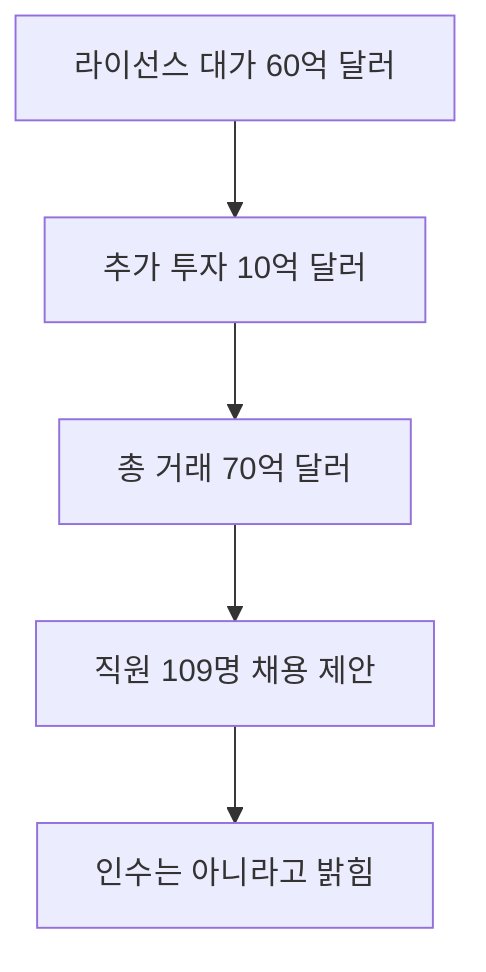

이번 거래는 Nvidia가 Poolside를 70억 달러에 통째로 인수한 건이 아닙니다. Model Factory의 비독점 라이선스에 60억 달러, Poolside 지분 투자에 10억 달러를 배정하고 관련 직원 109명에게 채용을 제안한 구조입니다. 일반 사용자가 당장 쓸 새 제품은 발표되지 않았으므로, Nemotron의 실제 모델 업데이트와 공개 조건이 나오는지를 후속 판단 기준으로 봐야 합니다.

> **먼저 알아둘 용어**
>
> - **오픈 웨이트**: 학습을 끝낸 모델 파일을 공개해 누구나 내려받아 자기 컴퓨터에서 돌릴 수 있게 한 것입니다.
{: .prompt-info }

## 무슨 일이 벌어진 걸까?

**한 줄 요약**: Nvidia, Poolside와 70억 달러 규모 계약 체결하여 Model Factory 라이선스 확보 및 Nemotron용 핵심 인재 영입

원문 헤드라인: Nvidia Agrees to $7 Billion Deal with Poolside to License Model Factory and Hire Key Talent for Nemotron

발행일은 2026-08-21이며, 아래 내용은 <a href="#source-1" aria-label="PYMNTS 출처">[1]</a>에서 확인할 수 있는 범위만 담았습니다.

- Nvidia는 Poolside의 AI 모델 개발 소프트웨어인 Model Factory에 대한 비독점 라이선스 대가로 60억 달러를 지급하기로 합의했습니다. <a href="#source-1" aria-label="PYMNTS 출처">[1]</a> 원문: Nvidia agreed to pay $6 billion for a non-exclusive license to Poolside's AI model-development software, known as Model Factory.

- Nvidia는 Poolside에 120억 달러의 투자 전 기업가치로 10억 달러를 추가 투자하여 총 거래 규모가 70억 달러에 달합니다. <a href="#source-1" aria-label="PYMNTS 출처">[1]</a> 원문: Nvidia is investing an additional $1 billion in Poolside at a $12 billion pre-money valuation, bringing the total deal value to $7 billion.

- Nvidia는 Poolside의 Laguna 모델 패밀리 및 Model Factory 개발에 참여한 109명의 Poolside 직원 및 엔지니어에게 채용 제안을 전달하고 있습니다. <a href="#source-1" aria-label="PYMNTS 출처">[1]</a> 원문: Nvidia is extending employment offers to 109 Poolside staff members and engineers who were involved in developing Poolside's Laguna model family and Model Factory.

- Poolside의 공동 창업자 3명은 스타트업에 계속 남게 되며, 회사는 독립 기업으로 계속 운영됩니다. <a href="#source-1" aria-label="PYMNTS 출처">[1]</a> 원문: Poolside's three co-founders will remain with the startup, which will continue to operate as an independent company.

- Poolside 경영진은 투자자 서한에서 이번 거래가 기업 인수나 아쿠아하이어(인재 영입 목적 인수)가 아님을 명확히 밝혔습니다. <a href="#source-1" aria-label="PYMNTS 출처">[1]</a> 원문: In a letter to investors, Poolside's leadership explicitly stated that the transaction is not a corporate acquisition or an acquihire.

<figure class="news-source-image">
  
  <figcaption>TipRanks가 원문과 함께 공개한 이미지입니다. <a href="https://www.tipranks.com/news/nvidia-nvda-makes-7-billion-poolside-ai-bet-ahead-of-earnings" target="_blank" rel="noopener noreferrer">출처: TipRanks</a></figcaption>
</figure>

## 왜 인수가 아니라 라이선스와 채용을 나눴을까?

확인된 거래는 세 갈래입니다. Nvidia는 Model Factory를 소유하는 대신 **비독점 라이선스**를 받고, 별도로 Poolside에 투자하며, Laguna와 Model Factory에 관여한 인력에게 채용을 제안합니다. Poolside의 공동 창업자 세 명과 남은 팀은 회사에 남고 독립 운영을 이어간다고 밝혔습니다. 따라서 70억 달러 전체를 기업 인수 가격이나 인재 109명의 채용 비용으로 계산하면 거래 구조를 잘못 읽게 됩니다.

비독점이라는 조건도 중요합니다. Nvidia가 소프트웨어를 활용할 권리는 얻지만, 발표 내용만으로 Poolside의 기술을 독점하거나 남은 회사의 제품 로드맵을 통제한다고 단정할 수 없습니다. 반대로 핵심 개발 인력이 실제로 대거 이동하면 문서상의 독립성과 별개로 양쪽 조직의 개발 속도와 우선순위가 달라질 수 있습니다. 향후에는 채용 제안이 실제 합류로 이어진 인원과 Poolside가 유지하는 제품 지원을 따로 확인해야 합니다.

<figure class="news-source-image">
  
  <figcaption>Newcomer가 원문과 함께 공개한 이미지입니다. <a href="https://www.newcomer.co/p/sources-poolside-strikes-6-billion" target="_blank" rel="noopener noreferrer">출처: Newcomer</a></figcaption>
</figure>

## Nemotron 사용자에게 지금 달라지는 것은 무엇일까?

현재 확인된 직접 변화는 Nvidia가 모델 개발 소프트웨어와 관련 인력을 확보하려 한다는 점입니다. 이것이 Nemotron의 코딩 능력, 학습 속도, 라이선스, 공개 일정 중 무엇을 바꿀지는 발표되지 않았습니다. 따라서 기존 Nemotron 배포를 즉시 교체하거나 성능 향상을 예산에 반영할 단계는 아닙니다.

후속 모델이 공개되면 기존 버전과 동일한 업무 평가 세트로 비교해야 합니다. 모델 품질뿐 아니라 오픈 웨이트의 실제 공개 범위, 상업 이용 조건, 필요한 GPU 메모리, 추론 비용을 함께 기록합니다. Model Factory를 라이선스했다는 사실만으로 결과 모델이 더 개방적이거나 더 저렴해진다고 추론해서는 안 됩니다.

## 거래의 성과를 어떤 증거로 판단할까?

첫째, Nvidia가 Model Factory를 적용한 Nemotron 버전과 적용 범위를 공식적으로 밝혔는지 확인합니다. 둘째, 채용 제안을 받은 인원과 실제 합류 인원을 구분합니다. 셋째, Poolside에 남은 팀이 Laguna와 기존 고객 지원을 어떤 일정으로 이어가는지 봐야 합니다. 이 정보가 나오기 전에는 큰 거래 금액이 곧바로 더 좋은 모델 성능을 보장한다고 말할 수 없습니다.

규제 검토 여부와 남은 Poolside의 구체적 로드맵 역시 공개되지 않았습니다. 발표 당시의 계약 구조와 이후 승인·실행 상태가 다를 수 있으므로, 거래 완료와 제품 반영을 같은 사건으로 취급하지 않는 것이 핵심입니다.

## 아직은 선을 그어야 할 부분

- 반독점 규제 당국이 Nvidia와 Poolside 간의 라이선스 및 인재 영입 거래 구조를 공식 조사하거나 이의를 제기할지 여부. 원문: Whether antitrust regulators will formally review or challenge Nvidia's licensing and hiring arrangement with Poolside.

- Poolside에 남은 팀이 독립적으로 추진할 구체적인 기술 로드맵 및 상업적 프로젝트 내용. 원문: The specific technical roadmap and commercial projects that Poolside's remaining team will pursue independently.

추가 원문이 공개되거나 제공 조건이 바뀌면 판단도 달라질 수 있습니다. 따라서 이 글은 오늘 시점의 출발점으로 활용하고, 실제 도입 전에는 연결된 원문을 다시 확인하는 것이 좋습니다.

<!-- primary-sources:start -->
## 원문과 버전 확인

- [발표 원문](https://www.pymnts.com/ai-technology/2026/nvidia-pays-6-billion-license-poolside-ai-model-development-software)
- [TipRanks](https://www.tipranks.com/news/nvidia-nvda-makes-7-billion-poolside-ai-bet-ahead-of-earnings)
- [Newcomer](https://www.newcomer.co/p/sources-poolside-strikes-6-billion)
<!-- primary-sources:end -->

<!-- internal-links:start -->
## 함께 읽으면 이해가 이어지는 글

- [Starcloud, Nvidia 투자 유치하며 2억 5천만 달러 규모 우주 AI 데이터센터 구축 추진]() — 우주 컴퓨팅 스타트업 Starcloud가 23억 달러의 기업가치로 2억 5천만 달러 규모의 시리즈 A 확장 투자를 마무리했습니다. Nvidia와 Cisco Investments 등이 신규 투자자로 참여했으며, 워싱턴주 우딘빌 공장에서…
- [AI Berkshire: 일반 인공지능이 주식 투자를 못 하는 이유와 다중 에이전트 프레임워크의 해결책]() — 일반적인 언어 모델이 투자 분석에서 보여주는 양비론적 한계와 데이터 환각을 극복하기 위해, 4대 가치투자 대가의 방법론을 다중 에이전트로 구현한 AI Berkshire 프레임워크의 구조와 작동 원리를 깊이 있게 분석합니다.
- [Moonshot AI Kimi K3 출시와 Anthropic Fable 5 증류 논란의 핵심]() — Moonshot AI가 강력한 성능의 Kimi K3를 오픈 가중치 형태로 전격 출시했습니다. 이에 미국 백악관은 Anthropic의 Fable 5를 무단 증류했다고 거세게 비난하며 글로벌 AI 기술 패권 경쟁이 격화되고 있습니다…
<!-- internal-links:end -->

## 자주 묻는 질문

### Nvidia가 Poolside를 70억 달러에 완전히 인수했나요?

아니오, Nvidia는 Poolside를 완전히 인수한 것이 아니라 Model Factory에 대한 60억 달러 라이선스 계약과 10억 달러 지분 투자를 진행했습니다. Poolside의 공동 창업자 3명과 남은 팀은 독립 기업으로 유지되며 기업 인수나 아쿠아하이어가 아님을 밝혔습니다.

### Poolside 엔지니어들은 Nvidia로 모두 이동하나요?

Laguna 모델 및 Model Factory 개발에 참여했던 엔지니어와 직원 109명이 Nvidia로부터 채용 제안을 받았습니다. 영입된 인력은 Nvidia의 오픈웨이트 AI 모델인 Nemotron 개발팀 강화에 투입됩니다.

### 이번 거래로 일반 사용자가 당장 이용할 수 있는 AI 서비스가 있나요?

아니오, 지금 단계에서 일반 사용자가 직접 쓸 수 있는 출시 서비스는 없습니다. Nvidia 내부의 오픈웨이트 모델 Nemotron 강화 목적이므로 향후 공개될 모델 업데이트를 기다려야 합니다.

## 직접 확인한 원문

<ol class="checked-source-list">
  <li id="source-1"><a href="https://www.pymnts.com/ai-technology/2026/nvidia-pays-6-billion-license-poolside-ai-model-development-software" target="_blank" rel="noopener noreferrer">PYMNTS — Nvidia Pays $6 Billion to License Poolside AI Model-Development Software</a> (2026-08-21)</li>
  <li id="source-2"><a href="https://www.tipranks.com/news/nvidia-nvda-makes-7-billion-poolside-ai-bet-ahead-of-earnings" target="_blank" rel="noopener noreferrer">TipRanks — Nvidia (NVDA) Makes $7 Billion Poolside AI Bet Ahead of Earnings</a> (2026-08-23)</li>
  <li id="source-3"><a href="https://www.newcomer.co/p/sources-poolside-strikes-6-billion" target="_blank" rel="noopener noreferrer">Newcomer — SOURCES: Poolside Strikes $6 Billion Licensing Deal with Nvidia &amp; Raises $1 Billion for Remaining Company at $12 Billion Valuation</a> (2026-08-20)</li>
</ol>

> 이 글은 하루 1건 발행 원칙에 따라 당일 확인 가능한 직접 원문 범위에서 작성했습니다. 독립 출처나 일부 세부 조건이 부족할 수 있으므로 실제 도입 전에는 연결된 원문을 다시 확인하세요.
