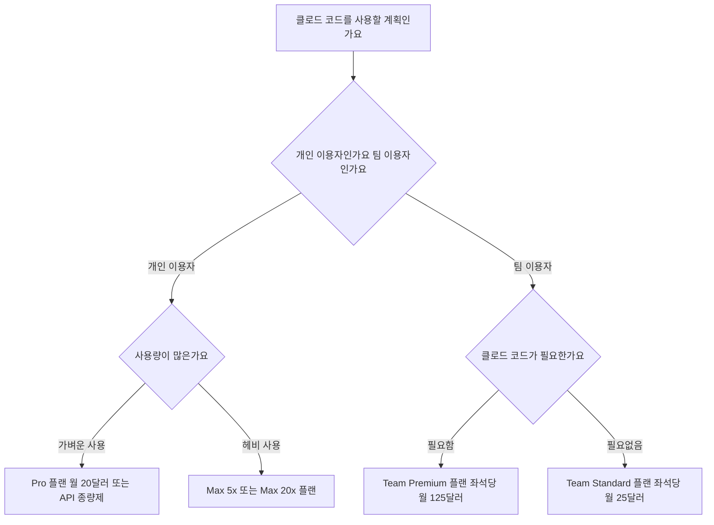

클로드 코드는 무료 플랜에서 쓸 수 없으므로 개인은 월정액 Pro와 API 종량제 중 사용 패턴에 맞는 방식을 비교해야 합니다. 매일 Claude 웹과 코딩 도구를 함께 쓰면 Pro가 단순하고, 사용이 드물다면 API 사용량을 먼저 측정하는 편이 낫습니다. 팀은 Standard와 Premium의 지원 범위가 다르므로 좌석 가격만 보지 말고 Claude Code 포함 여부와 최소 좌석 조건을 함께 확인해야 합니다.


> **먼저 알아둘 용어**
>
> - **토큰**: AI가 글을 잘게 쪼개 세는 단위입니다. 한국어는 보통 한두 글자가 토큰 하나입니다.
> - **API**: 다른 프로그램에서 이 기능을 불러다 쓸 수 있게 열어 둔 창구입니다.
> - **프롬프트**: AI에게 건네는 지시문입니다. 같은 모델도 지시문에 따라 결과가 크게 달라집니다.
{: .prompt-info }

## 클로드 코드 가격과 요금제 결론부터 정리합니다
클로드 코드는 무료 플랜으로 사용할 수 없으며 최소 월 20달러의 유료 구독이나 토큰 결제가 필요합니다.

개발 업무에 인공지능 도구를 도입하려 할 때 가장 헷갈리는 부분은 요금 체계입니다. 웹사이트에서 사용하는 무료 서비스와 개발용 터미널 도구의 사용 권한이 서로 다르기 때문입니다. 2026년 8월 25일 기준 확인된 사실을 바탕으로 클로드 코드 가격과 나에게 맞는 요금제 선택 기준을 명쾌하게 정리해 드립니다.



```chartjs
{
  "type": "bar",
  "data": {
    "labels": ["Pro 월간", "Pro 연간월환산", "Max 5x", "Max 20x", "Team Premium 월간", "Team Premium 연간월환산"],
    "datasets": [{
      "label": "월 비용 달러 기준",
      "data": [20, 17, 100, 200, 125, 100],
      "backgroundColor": ["#2f9e8f", "#9aa5a1", "#1d6f63", "#0f3a34", "#e67e22", "#d35400"]
    }]
  },
  "options": {
    "responsive": true
  }
}
```

## 클로드 코드 요금제 비교 및 가격 구조
클로드 코드 가격 비교 시 가장 중요한 핵심은 구독 플랜과 종량제 방식의 차이를 이해하는 것입니다.

개인 사용자를 위한 플랜은 크게 세 가지로 나뉩니다. Pro 플랜은 월 20달러이며 연간 결제 시 월 17달러로 할인됩니다. 사용량이 많은 개발자를 위한 Max 5x 플랜은 월 100달러입니다. 그보다 더 높은 한도가 필요한 경우에는 월 200달러인 Max 20x 플랜을 선택할 수 있습니다.

팀 단위 이용 시에는 클로드 코드 요금제 차이를 정확히 알아야 합니다. Team Standard 요금제는 좌석당 월 25달러(연간 결제 시 월 20달러)이지만 클로드 코드가 포함되지 않습니다. 팀 환경에서 클로드 코드를 사용하려면 최소 5좌석 이상 구독이 필요한 Team Premium 요금제를 써야 합니다. Team Premium 가격은 좌석당 월 125달러이며 연간 결제 시 좌석당 월 100달러입니다.

| 요금제 이름 | 월 결제 가격 | 연간 결제 시 월 환산 가격 | 클로드 코드 포함 여부 | 주요 대상 |
| --- | --- | --- | --- | --- |
| 무료 요금제 (Free) | 0달러 | 0달러 | 미지원 | 웹 채팅 전용 |
| Pro | 20달러 | 17달러 | 지원 | 개인 개발자 |
| Max 5x | 100달러 | 미지원 | 지원 | 헤비 개인 개발자 |
| Max 20x | 200달러 | 미지원 | 지원 | 최고 사용량 개발자 |
| Team Standard | 25달러 | 20달러 | 미지원 | 일반 팀 웹 사용 |
| Team Premium | 125달러 | 100달러 | 지원 (최소 5좌석) | 개발 팀 단위 |
| API 종량제 (Pay-per-token) | 사용량 연동 | 사용량 연동 | 지원 | 불규칙 사용 개인 및 기업 |

구독 플랜을 결제하면 클로드 코드 사용량은 웹 서비스 세션 한도와 공유됩니다. 5시간 롤링 창(5시간 동안 쓸 수 있는 사용량 제한)과 주간 사용 한도를 웹 채팅과 클로드 코드가 나누어 쓰게 됩니다.

구독 방식 대신 API 키를 등록하여 쓰는 종량제(Pay-per-token, 토큰당 과금 방식)도 있습니다. 종량제는 사용하는 인공지능 모델의 표준 토큰 요금에 따라 실제 쓴 만큼만 결제됩니다. 토큰(AI가 글을 세는 단위로 한국어는 한두 글자가 1토큰) 사용량이 적다면 월 구독보다 종량제가 더 저렴할 수 있습니다. 한국 원화 결제 시 최종 환율 및 부가세 포함 금액은 결제 시점의 환율에 따라 달라집니다.

## 클로드 코드 무료 사용법 및 무료 요금제 존재 여부
클로드 코드 무료 요금제는 존재하지 않으며 무료 계정으로는 접근할 수 없습니다.

많은 분들이 클로드 코드 무료 사용법을 검색하지만 공식 문서상 무료 플랜 사용자를 위한 클로드 코드 제공은 없습니다. 웹사이트에서 인공지능과 대화하는 무료 계정을 가지고 있더라도 터미널이나 개발 환경에서 클로드 코드를 실행하면 유료 권한을 요구합니다.

구독 전에 클로드 코드를 시험하려면 API 키를 발급받아 종량제로 작은 작업을 실행하는 방법이 있습니다. 비용은 선택한 모델, 읽힌 코드 양, 반복 횟수에 따라 달라지므로 특정 금액 안에서 충분하다고 단정하기 어렵습니다. 결제 한도와 사용량 알림을 먼저 설정하고 실제 프로젝트의 작은 작업 한두 개로 토큰 소비와 결과 품질을 함께 확인하세요.

## 클로드 코드 사용법과 환경 선택 (VS Code 및 IDE 추천)
클로드 코드는 개발자가 작업하는 터미널과 편집기 환경에 바로 연결되어 작동합니다.

클로드 코드는 터미널 CLI(명령줄 인터페이스)뿐만 아니라 데스크톱 앱, 웹 인터페이스, 다양한 개발 도구를 지원합니다. 개발 생산성을 높이기 위한 클로드 코드 ide 추천 환경으로는 VS Code(비주얼 스튜디오 코드)와 JetBrains(젯브레인스) 계열 개발 도구가 대표적입니다.

특히 클로드 코드 사용법 vscode 환경을 구축하려면 VS Code 1.94.0 이상 버전이 필요합니다. 설정 절차는 다음과 같습니다.

1. VS Code 버전을 1.94.0 이상으로 업데이트합니다.
2. 클로드 코드 확장 프로그램을 설치합니다.
3. 별도의 API 키를 입력할 필요 없이 Pro, Max, Team, Enterprise 등 이미 보유한 유료 구독 계정으로 로그인합니다.

로그인이 완료되면 터미널 창을 이탈하지 않고 작업 중인 코드베이스 전체를 인공지능이 분석하도록 클로드 코드 사용법을 적용할 수 있습니다.

## 클로드 코드 추천 설정과 토큰 절약 방법
클로드 코드 추천 설정의 핵심은 불필요한 토큰 낭비를 막고 자동화 효율을 높이는 것입니다.

클로드 코드의 동작 방식과 시작 모델, 자동 실행 권한, 제외할 파일 경로 등은 설정 파일을 통해 제어할 수 있습니다. 환경 설정은 JSON(제이슨, 데이터를 저장하는 문자열 형식) 포맷으로 작성된 settings.json 파일을 수정하여 관리합니다. 파일 위치는 개인 설정 폴더 안의 `~/.claude/settings.json` 경로입니다.

토큰 소비량을 관리하기 위해서는 아래 세 가지 핵심 실천 수칙을 적용하는 것이 좋습니다.

첫째, 프롬프트 캐싱(Prompt Caching, 자주 반복되는 질문 맥락을 재사용하여 토큰을 아끼는 기술)을 활성화합니다. 반복되는 소스코드 분석 시 토큰 사용량을 대폭 절감해 줍니다.
둘째, 클로드 코드가 변경한 코드를 스스로 검증할 수 있도록 빌드 및 테스트 명령어를 미리 제공합니다. 인공지능이 스스로 오작동을 확인하여 수정하므로 잘못된 응답을 되풀이하며 토큰을 낭비하는 현상을 줄입니다.
셋째, 작업 도중 터미널 세션에 `/usage` 명령어를 입력합니다. `/usage` 명령을 입력하면 현재 작업 세션에서 사용한 토큰 양과 모델별 사용 내역, 추정 발생 비용을 즉시 확인할 수 있습니다.

또한 개발 효율을 극대화하기 위한 클로드 코드 skills 추천 기능으로 나만의 명령어나 검증 스크립트를 커스텀 설정 파일에 등록해 두면 인공지능이 복잡한 작업 과정을 한 번에 수행하도록 제어할 수 있습니다.

## 그래서 내 업무에는 뭐가 달라지나
개발자와 팀이 오늘 당장 취해야 할 행동 가이드를 조건별로 제시합니다.

**상황 1: 혼자 개발하며 월 사용량이 적거나 체험만 해보고 싶은 개인 개발자**
오늘 당장 Pro 요금제를 결제하지 마세요. API 키를 발급받아 종량제로 클로드 코드를 실행해 보세요. 몇백 원 수준의 비용으로 내 프로젝트에서 잘 작동하는지 미리 테스트할 수 있습니다.

**상황 2: 매일 코딩하며 클로드 웹 서비스와 터미널 도구를 동시에 쓰는 개발자**
월 20달러(연간 결제 시 월 17달러)의 Pro 요금제를 구독하세요. VS Code 1.94.0 이상 버전을 설치한 뒤 Pro 계정으로 로그인하면 별도 API 결제 없이 통합된 사용 환경을 누릴 수 있습니다. 로그인 후 바로 `~/.claude/settings.json` 파일에서 제외 경로를 설정하여 토큰 소비를 아끼세요.

**상황 3: 5인 이상 규모의 개발 팀에서 도구를 도입하려는 팀장**
Team Standard 요금제를 결제하면 클로드 코드를 쓸 수 없다는 점을 반드시 확인하세요. 팀원들에게 클로드 코드를 제공하려면 좌석당 월 125달러(연간 결제 시 월 100달러)인 Team Premium 요금제로 시작해야 합니다.

<!-- internal-links:start -->
## 함께 읽으면 이해가 이어지는 글

- [클로드 요금제 총정리, Free부터 Max 20x까지 뭘 골라야 하나 (2026년 8월 기준)]() — 클로드 유료 구독은 Pro 월 20달러부터 시작하고 Max는 5x 100달러, 20x 200달러입니다. Claude Code는 Pro 이상 모든 유료 등급에 추가 요금 없이 포함됩니다. 대부분의 사람에게는 Pro가 정답이고, Max는…
- [ai-job-search: 클로드 코드로 나만의 맞춤형 구직 에이전트 구축하기]() — 클로드 코드(Claude Code)를 기반으로 공고 수집, 적합도 평가, 맞춤형 이력서 작성 등 구직 전 과정을 자동화하는 ai-job-search 프레임워크의 작동 원리와 실전 활용법을 깊이 있게 분석합니다.
- [Claude 3.7 Sonnet 확장 사고는 언제 켤까: Claude Code와 비용 판단]() — 빠른 표준 응답과 확장 사고를 나누는 기준, Claude Code 작업 검수법, 발표 당시 가격과 캐싱 오해를 정리한다
<!-- internal-links:end -->

## 자주 묻는 질문

### 클로드 코드를 무료 요금제 계정으로 쓸 수 있나요?

아니요. 무료 요금제(Free plan) 계정으로는 클로드 코드를 이용할 수 없습니다. Pro, Max, Team Premium 등 유료 구독 플랜에 가입하거나 API 토큰 결제를 이용해야 합니다.

### Team Standard 요금제에서도 클로드 코드가 지원되나요?

아니요. 좌석당 월 25달러인 Team Standard 요금제에는 클로드 코드가 포함되지 않습니다. 팀 단위 이용 시 클로드 코드를 쓰려면 좌석당 월 125달러인 Team Premium 요금제를 구독해야 합니다.

### VS Code에서 클로드 코드를 쓰려면 API 키가 별도로 필요한가요?

VS Code 1.94.0 이상 버전을 사용할 경우 API 키 입력 없이 Pro, Max, Team Premium 등 유료 구독 계정으로 로그인하여 바로 사용할 수 있습니다.

### 클로드 코드 세션에서 토큰 사용량을 어떻게 확인하나요?

클로드 코드 실행 중 터미널에 /usage 명령어를 입력하면 현재 세션의 토큰 소비량과 모델별 내역, 추정 비용을 확인할 수 있습니다.

## 직접 확인한 원문

- [Claude Plans & Pricing](https://claude.com/pricing) (2026-08-25 확인)
- [Claude Code Docs - Overview](https://code.claude.com/docs/en/overview) (2026-08-25 확인)
- [Claude Code Docs - Use Claude Code in VS Code](https://code.claude.com/docs/en/ide-integrations) (2026-08-25 확인)
- [Claude Code Docs - Settings](https://code.claude.com/docs/en/settings) (2026-08-25 확인)
- [Claude Code Docs - Best practices](https://code.claude.com/docs/en/best-practices) (2026-08-25 확인)

위 수치는 확인 시점 기준이며 예고 없이 바뀔 수 있습니다. 결정 전에 공식 페이지를 한 번 더 확인하시기 바랍니다.
