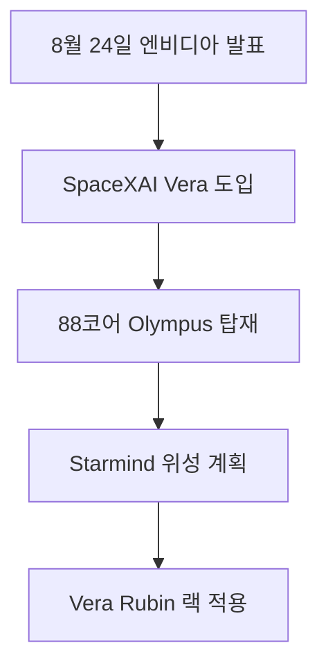

이번 발표에는 서로 다른 두 계획이 들어 있습니다. SpaceXAI는 Grok 주변의 오케스트레이션, 도구 실행, 코드 처리, 시뮬레이션을 위해 지상 인프라에 Vera CPU를 도입하고, 별도로 Vera Rubin NVL72 기반 1세대 AI 위성 Starmind를 계획하고 있습니다. 지상 CPU 도입과 발사 일정이 공개되지 않은 위성 계획을 하나의 완성된 시스템처럼 읽어서는 안 됩니다.

> **먼저 알아둘 용어**
>
> - **추론**: 학습이 끝난 모델이 실제로 답을 만들어 내는 과정입니다. 이때 드는 계산 비용이 곧 사용료입니다.
{: .prompt-info }

## 무슨 일이 벌어진 걸까?

**한 줄 요약**: SpaceXAI, Grok 인프라용 NVIDIA Vera CPU 도입 및 Starmind AI 위성 궤도 배치 계획 발표

원문 헤드라인: SpaceXAI Deploys NVIDIA Vera CPUs for Grok Infrastructure and Plans Starmind AI Satellite in Orbit

발행일은 2026-08-24이며, 아래 내용은 <a href="#source-1" aria-label="NVIDIA Newsroom 출처">[1]</a>에서 확인할 수 있는 범위만 담았습니다.

- NVIDIA는 SpaceXAI가 Grok의 차세대 에이전틱 AI 애플리케이션 가속을 위해 NVIDIA Vera CPU를 도입할 것이라고 발표했습니다. <a href="#source-1" aria-label="NVIDIA Newsroom 출처">[1]</a> 원문: NVIDIA announced that SpaceXAI will deploy NVIDIA Vera CPUs to accelerate its next generation of agentic AI applications for Grok.

- SpaceXAI는 모델 추론 과정에서 발생하는 오케스트레이션, 도구 실행, 코드 처리 및 시뮬레이션 작업을 관리하는 데 Vera CPU를 사용할 예정입니다. <a href="#source-1" aria-label="NVIDIA Newsroom 출처">[1]</a> 원문: SpaceXAI will use Vera CPUs to manage orchestration, tool execution, code processing, and simulation tasks surrounding model inference.

- NVIDIA Vera CPU는 88개의 커스텀 Olympus 코어, Spatial Multithreading 및 최대 1.2TB/s의 메모리 대역폭을 제공하는 LPDDR5X 메모리를 탑재하고 있습니다. <a href="#source-1" aria-label="NVIDIA Newsroom 출처">[1]</a> 원문: The NVIDIA Vera CPU features 88 custom Olympus cores, Spatial Multithreading, and LPDDR5X memory delivering up to 1.2TB/s of memory bandwidth.

- SpaceXAI는 1세대 AI 인공위성인 Starmind를 출시하여 연산 인프라를 궤도 공간으로 확장할 계획입니다. <a href="#source-1" aria-label="NVIDIA Newsroom 출처">[1]</a> 원문: SpaceXAI plans to launch Starmind, its first-generation AI satellite, expanding its compute infrastructure into orbital space.

- Starmind AI 인공위성은 최적화된 NVIDIA Vera Rubin NVL72 랙 스케일 시스템을 기반으로 제작될 예정입니다. <a href="#source-1" aria-label="NVIDIA Newsroom 출처">[1]</a> 원문: The Starmind AI satellite will be built using an optimized NVIDIA Vera Rubin NVL72 rack-scale system.

<figure class="news-source-image">
  
  <figcaption>NVIDIA Newsroom가 원문과 함께 공개한 이미지입니다. <a href="https://nvidianews.nvidia.com/news/spacexai-adopts-nvidia-vera-cpu-to-accelerate-agentic-ai-at-massive-scale" target="_blank" rel="noopener noreferrer">출처: NVIDIA Newsroom</a></figcaption>
</figure>

## Vera CPU는 Grok 모델의 어느 부분을 맡을까?

발표가 지목한 작업은 모델 가중치의 핵심 연산 자체보다 그 주변의 오케스트레이션, 도구 실행, 코드 처리와 시뮬레이션입니다. 에이전트가 여러 도구를 호출하면 GPU가 답을 생성하는 시간뿐 아니라 호출 순서를 정하고 결과를 정리하는 CPU 작업도 전체 지연시간에 영향을 줍니다. 88개 Olympus 코어와 LPDDR5X 메모리 대역폭은 이 주변 작업을 대규모로 처리하려는 사양으로 제시됐습니다.

다만 사양만으로 Grok 응답이 얼마나 빨라지는지는 계산할 수 없습니다. 실제 개선 폭은 GPU와 CPU 사이의 데이터 이동, 동시에 실행하는 에이전트 수, 도구 응답 시간, 소프트웨어 최적화에 따라 달라집니다. 도입 효과를 평가하려면 같은 에이전트 작업에서 전체 완료 시간, CPU 대기, 실패한 도구 호출 수를 기존 시스템과 비교해야 합니다.

<figure class="news-source-image">
  
  <figcaption>NVIDIA Newsroom가 원문과 함께 공개한 이미지입니다. <a href="https://nvidianews.nvidia.com/news/spacexai-adopts-nvidia-vera-cpu-to-accelerate-agentic-ai-at-massive-scale" target="_blank" rel="noopener noreferrer">출처: NVIDIA Newsroom</a></figcaption>
</figure>

## Starmind는 현재 쓸 수 있는 우주 클라우드일까?

아닙니다. 확인된 내용은 SpaceXAI가 1세대 AI 위성을 출시할 계획이고, 최적화된 Vera Rubin NVL72 시스템을 기반으로 만들 예정이라는 것입니다. 구체적 발사일, 구축 비용, 고객용 서비스와 가격은 공개되지 않았습니다. 따라서 현재의 Grok 사용자가 궤도 연산을 선택하거나 성능 변화를 체감할 수 있다는 발표가 아닙니다.

랙 스케일 시스템을 우주에 보내는 일은 칩을 선정하는 것만으로 끝나지 않습니다. 발사 과정의 진동, 방사선, 열 방출, 지상과의 통신, 고장 후 교체가 어려운 조건에서 시스템이 얼마나 오래 안정적으로 작동하는지 입증해야 합니다. 발표 단계에서는 탑재 계획과 실제 궤도 가동을 분리하고, 발사 성공 뒤에도 지속 가동률과 유효 연산량을 확인해야 상용성을 판단할 수 있습니다.

<figure class="news-source-image">
  
  <figcaption>StorageReview가 원문과 함께 공개한 이미지입니다. <a href="https://www.storagereview.com/news/spacexai-adopts-nvidia-vera-cpus-for-grok-with-a-vera-rubin-nvl72-bound-for-orbit-in-starmind" target="_blank" rel="noopener noreferrer">출처: StorageReview</a></figcaption>
</figure>

## 후속 발표에서 무엇을 확인해야 할까?

지상 인프라는 Vera CPU의 실제 배치 규모와 Grok 에이전트 작업의 전후 성능을 확인해야 합니다. Starmind는 발사 일정, 탑재 구성이 발표 때 계획대로 유지되는지, 궤도에서 수행한 연산과 지상 통신 결과가 공개되는지를 봐야 합니다. 총비용과 서비스 제공 방식이 나오지 않는다면 기술 실증과 사업 모델 사이의 간격은 여전히 남아 있습니다.

둘을 함께 평가할 때도 지상 개선이 위성 덕분이라고 혼동하지 않아야 합니다. 각 인프라의 시작 시점과 측정 지표를 따로 기록해야 어느 변화가 실제 성능에 기여했는지 판단할 수 있습니다.

## 아직은 선을 그어야 할 부분

- Starmind AI 인공위성의 구체적인 발사 일정과 이번 도입의 총 금융 비용은 공개되지 않았습니다. 원문: The precise launch schedule for the Starmind AI satellite and the total financial cost of the deployment have not been disclosed.

추가 원문이 공개되거나 제공 조건이 바뀌면 판단도 달라질 수 있습니다. 따라서 이 글은 오늘 시점의 출발점으로 활용하고, 실제 도입 전에는 연결된 원문을 다시 확인하는 것이 좋습니다.

<!-- primary-sources:start -->
## 원문과 버전 확인

- [발표 원문](https://nvidianews.nvidia.com/news/spacexai-adopts-nvidia-vera-cpu-to-accelerate-agentic-ai-at-massive-scale)
- [StorageReview](https://www.storagereview.com/news/spacexai-adopts-nvidia-vera-cpus-for-grok-with-a-vera-rubin-nvl72-bound-for-orbit-in-starmind)
- [Wccftech](https://wccftech.com/spacexai-will-use-nvidia-vera-cpus-to-power-its-next-gen-agentic-ai-workloads-also-bringing-vera-rubin-acceleration-to-grok-starmind-ai-satellite)
<!-- primary-sources:end -->

<!-- internal-links:start -->
## 함께 읽으면 이해가 이어지는 글

- [Starcloud, Nvidia 투자 유치하며 2억 5천만 달러 규모 우주 AI 데이터센터 구축 추진]() — 우주 컴퓨팅 스타트업 Starcloud가 23억 달러의 기업가치로 2억 5천만 달러 규모의 시리즈 A 확장 투자를 마무리했습니다. Nvidia와 Cisco Investments 등이 신규 투자자로 참여했으며, 워싱턴주 우딘빌 공장에서…
- [Cilium은 iptables보다 얼마나 빠를까: 재현 가능한 네트워크 성능 검증법]() — iptables, IPVS, Cilium eBPF를 같은 클러스터 조건에서 비교하기 위해 서비스 수, endpoint churn, 연결 유형과 정책을 고정하고 지연, CPU, drop을 측정하는 법입니다.
- [병렬처리는 왜 코어를 늘려도 계속 빨라지지 않을까: CPU, GPU, FPGA 선택 기준]() — 클록을 높이는 방식이 전력과 발열의 벽에 부딪힌 이유부터 멀티코어, 파이프라이닝, GPU, FPGA 가속기, Amdahl의 법칙까지 한 흐름으로 정리하고 오래된 Thor 작업 명령을 안전하게 읽는 법을 설명합니다.
<!-- internal-links:end -->

## 자주 묻는 질문

### SpaceXAI가 도입한 NVIDIA Vera CPU의 핵심 성능 스펙은 무엇인가요?

NVIDIA Vera CPU는 88개의 커스텀 Olympus 코어, 스페이셜 멀티스레딩, 그리고 최대 1.2TB/s의 대역폭을 제공하는 LPDDR5X 메모리를 탑재했습니다. 이를 통해 Grok 모델의 에이전틱 AI 오케스트레이션 및 코드 처리 연산을 대규모로 가속합니다.

### Starmind AI 위성은 기존 인공위성과 어떻게 다른가요?

Starmind는 SpaceXAI의 1세대 AI 위성으로 최적화된 NVIDIA Vera Rubin NVL72 랙 스케일 시스템을 탑재해 우주 궤도에서 직접 연산 인프라를 구동하도록 기획되었습니다.

### Starmind AI 위성의 발사 일정은 공개되었나요?

아니요, 2026년 8월 24일 발표 시점 기준으로 Starmind AI 위성의 구체적인 발사 일정 및 총 구축 비용은 공개되지 않았습니다.

## 직접 확인한 원문

<ol class="checked-source-list">
  <li id="source-1"><a href="https://nvidianews.nvidia.com/news/spacexai-adopts-nvidia-vera-cpu-to-accelerate-agentic-ai-at-massive-scale" target="_blank" rel="noopener noreferrer">NVIDIA Newsroom — SpaceXAI Adopts NVIDIA Vera CPU to Accelerate Agentic AI at Massive Scale</a> (2026-08-24)</li>
  <li id="source-2"><a href="https://www.storagereview.com/news/spacexai-adopts-nvidia-vera-cpus-for-grok-with-a-vera-rubin-nvl72-bound-for-orbit-in-starmind" target="_blank" rel="noopener noreferrer">StorageReview — SpaceXAI Adopts NVIDIA Vera CPUs for Grok, With a Vera Rubin NVL72 Bound for Orbit in Starmind</a> (2026-08-24)</li>
  <li id="source-3"><a href="https://wccftech.com/spacexai-will-use-nvidia-vera-cpus-to-power-its-next-gen-agentic-ai-workloads-also-bringing-vera-rubin-acceleration-to-grok-starmind-ai-satellite" target="_blank" rel="noopener noreferrer">Wccftech — SpaceXAI Will Use NVIDIA Vera CPUs To Power Its Next-Gen Agentic AI Workloads, Also Bringing Vera Rubin Acceleration To Grok &amp; Starmind AI Satellite</a> (2026-08-24)</li>
</ol>

> 이 글은 위 원문을 직접 확인해 작성했습니다. 가격, 기능 범위, 지역별 제공 여부는 게시 후 바뀔 수 있으니 실제 도입 전 공식 문서를 다시 확인하세요.
