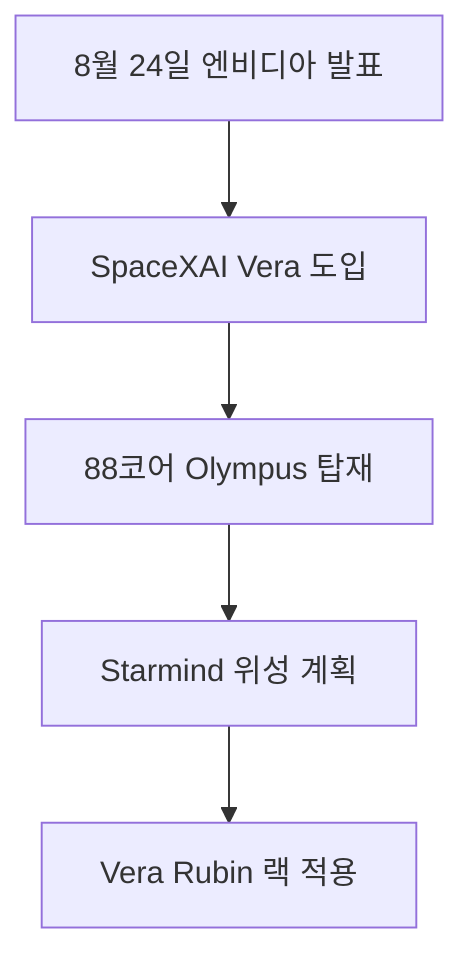

SpaceXAI Infrastructure & Satellite AI 관련 새 소식을 오늘 확인 가능한 직접 원문 범위에서 정리했습니다. 자동 검증 기준을 모두 충족하지 못한 날에도 발행을 건너뛰지 않기 위한 간결한 브리핑이며, 확인되지 않은 내용은 단정하지 않습니다. 원문이 영어인 문장은 한국어로 옮기고, 대조할 수 있도록 원문도 함께 남겼습니다.

> **먼저 알아둘 용어**
>
> - **추론**: 학습이 끝난 모델이 실제로 답을 만들어 내는 과정입니다. 이때 드는 계산 비용이 곧 사용료입니다.
{: .prompt-info }

## 무슨 일이 벌어진 걸까?

**한 줄 요약**: SpaceXAI, Grok 인프라용 NVIDIA Vera CPU 도입 및 Starmind AI 위성 궤도 배치 계획 발표

원문 헤드라인: SpaceXAI Deploys NVIDIA Vera CPUs for Grok Infrastructure and Plans Starmind AI Satellite in Orbit

발행일은 2026-08-24이며, 아래 내용은 <a href="#source-1" aria-label="NVIDIA Newsroom 출처">[1]</a>에서 확인할 수 있는 범위만 담았습니다.

- NVIDIA는 SpaceXAI가 Grok의 차세대 에이전틱 AI 애플리케이션 가속을 위해 NVIDIA Vera CPU를 도입할 것이라고 발표했습니다. <a href="#source-1" aria-label="NVIDIA Newsroom 출처">[1]</a> 원문: NVIDIA announced that SpaceXAI will deploy NVIDIA Vera CPUs to accelerate its next generation of agentic AI applications for Grok.

- SpaceXAI는 모델 추론 과정에서 발생하는 오케스트레이션, 도구 실행, 코드 처리 및 시뮬레이션 작업을 관리하는 데 Vera CPU를 사용할 예정입니다. <a href="#source-1" aria-label="NVIDIA Newsroom 출처">[1]</a> 원문: SpaceXAI will use Vera CPUs to manage orchestration, tool execution, code processing, and simulation tasks surrounding model inference.

- NVIDIA Vera CPU는 88개의 커스텀 Olympus 코어, Spatial Multithreading 및 최대 1.2TB/s의 메모리 대역폭을 제공하는 LPDDR5X 메모리를 탑재하고 있습니다. <a href="#source-1" aria-label="NVIDIA Newsroom 출처">[1]</a> 원문: The NVIDIA Vera CPU features 88 custom Olympus cores, Spatial Multithreading, and LPDDR5X memory delivering up to 1.2TB/s of memory bandwidth.

- SpaceXAI는 1세대 AI 인공위성인 Starmind를 출시하여 연산 인프라를 궤도 공간으로 확장할 계획입니다. <a href="#source-1" aria-label="NVIDIA Newsroom 출처">[1]</a> 원문: SpaceXAI plans to launch Starmind, its first-generation AI satellite, expanding its compute infrastructure into orbital space.

- Starmind AI 인공위성은 최적화된 NVIDIA Vera Rubin NVL72 랙 스케일 시스템을 기반으로 제작될 예정입니다. <a href="#source-1" aria-label="NVIDIA Newsroom 출처">[1]</a> 원문: The Starmind AI satellite will be built using an optimized NVIDIA Vera Rubin NVL72 rack-scale system.

<figure class="news-source-image">
  
  <figcaption>NVIDIA Newsroom가 원문과 함께 공개한 이미지입니다. <a href="https://nvidianews.nvidia.com/news/spacexai-adopts-nvidia-vera-cpu-to-accelerate-agentic-ai-at-massive-scale" target="_blank" rel="noopener noreferrer">출처: NVIDIA Newsroom</a></figcaption>
</figure>

## 왜 지금 다들 이 이야기를 할까?

이 소식의 핵심은 새 기능이나 발표의 이름보다 실제 사용자와 개발자의 선택이 달라지는지에 있습니다. 지금 단계에서는 원문이 밝힌 내용과 아직 공개하지 않은 내용을 분리해서 보는 것이 안전합니다.

<figure class="news-source-image">
  
  <figcaption>NVIDIA Newsroom가 원문과 함께 공개한 이미지입니다. <a href="https://nvidianews.nvidia.com/news/spacexai-adopts-nvidia-vera-cpu-to-accelerate-agentic-ai-at-massive-scale" target="_blank" rel="noopener noreferrer">출처: NVIDIA Newsroom</a></figcaption>
</figure>

## 그래서 우리에게 뭐가 달라질까?

도입을 검토한다면 현재 쓰는 도구와 바로 교체하기보다 작은 작업에서 먼저 비교해 보는 편이 좋습니다. 제공 지역, 요금, 데이터 처리 방식처럼 의사결정에 영향을 주는 조건은 실제 사용 전에 원문에서 다시 확인해야 합니다.

<figure class="news-source-image">
  
  <figcaption>StorageReview가 원문과 함께 공개한 이미지입니다. <a href="https://www.storagereview.com/news/spacexai-adopts-nvidia-vera-cpus-for-grok-with-a-vera-rubin-nvl72-bound-for-orbit-in-starmind" target="_blank" rel="noopener noreferrer">출처: StorageReview</a></figcaption>
</figure>

## 직접 써보거나 지켜볼 포인트

첫째, 공식 제공 범위와 사용 조건을 확인합니다. 둘째, 기존 작업 흐름에서 시간을 줄여주는지 작은 예제로 비교합니다. 셋째, 발표 내용과 실제 일반 제공 상태가 같은지 구분합니다.

## 아직은 선을 그어야 할 부분

- Starmind AI 인공위성의 구체적인 발사 일정과 이번 도입의 총 금융 비용은 공개되지 않았습니다. 원문: The precise launch schedule for the Starmind AI satellite and the total financial cost of the deployment have not been disclosed.

추가 원문이 공개되거나 제공 조건이 바뀌면 판단도 달라질 수 있습니다. 따라서 이 글은 오늘 시점의 출발점으로 활용하고, 실제 도입 전에는 연결된 원문을 다시 확인하는 것이 좋습니다.

## 자주 묻는 질문

### SpaceXAI가 도입한 NVIDIA Vera CPU의 핵심 성능 스펙은 무엇인가요?

NVIDIA Vera CPU는 88개의 커스텀 Olympus 코어, 스페이셜 멀티스레딩, 그리고 최대 1.2TB/s의 대역폭을 제공하는 LPDDR5X 메모리를 탑재했습니다. 이를 통해 Grok 모델의 에이전틱 AI 오케스트레이션 및 코드 처리 연산을 대규모로 가속합니다.

### Starmind AI 위성은 기존 인공위성과 어떻게 다른가요?

Starmind는 SpaceXAI의 1세대 AI 위성으로 최적화된 NVIDIA Vera Rubin NVL72 랙 스케일 시스템을搭載해 우주 궤도에서 직접 연산 인프라를 구동하도록 기획되었습니다.

### Starmind AI 위성의 발사 일정은 공개되었나요?

아니요, 2026년 8월 24일 발표 시점 기준으로 Starmind AI 위성의 구체적인 발사 일정 및 총 구축 비용은 공개되지 않았습니다.

## 직접 확인한 원문

<ol class="checked-source-list">
  <li id="source-1"><a href="https://nvidianews.nvidia.com/news/spacexai-adopts-nvidia-vera-cpu-to-accelerate-agentic-ai-at-massive-scale" target="_blank" rel="noopener noreferrer">NVIDIA Newsroom — SpaceXAI Adopts NVIDIA Vera CPU to Accelerate Agentic AI at Massive Scale</a> (2026-08-24)</li>
  <li id="source-2"><a href="https://www.storagereview.com/news/spacexai-adopts-nvidia-vera-cpus-for-grok-with-a-vera-rubin-nvl72-bound-for-orbit-in-starmind" target="_blank" rel="noopener noreferrer">StorageReview — SpaceXAI Adopts NVIDIA Vera CPUs for Grok, With a Vera Rubin NVL72 Bound for Orbit in Starmind</a> (2026-08-24)</li>
  <li id="source-3"><a href="https://wccftech.com/spacexai-will-use-nvidia-vera-cpus-to-power-its-next-gen-agentic-ai-workloads-also-bringing-vera-rubin-acceleration-to-grok-starmind-ai-satellite" target="_blank" rel="noopener noreferrer">Wccftech — SpaceXAI Will Use NVIDIA Vera CPUs To Power Its Next-Gen Agentic AI Workloads, Also Bringing Vera Rubin Acceleration To Grok &amp; Starmind AI Satellite</a> (2026-08-24)</li>
</ol>

> 이 글은 위 원문을 직접 확인해 작성했습니다. 가격, 기능 범위, 지역별 제공 여부는 게시 후 바뀔 수 있으니 실제 도입 전 공식 문서를 다시 확인하세요.
