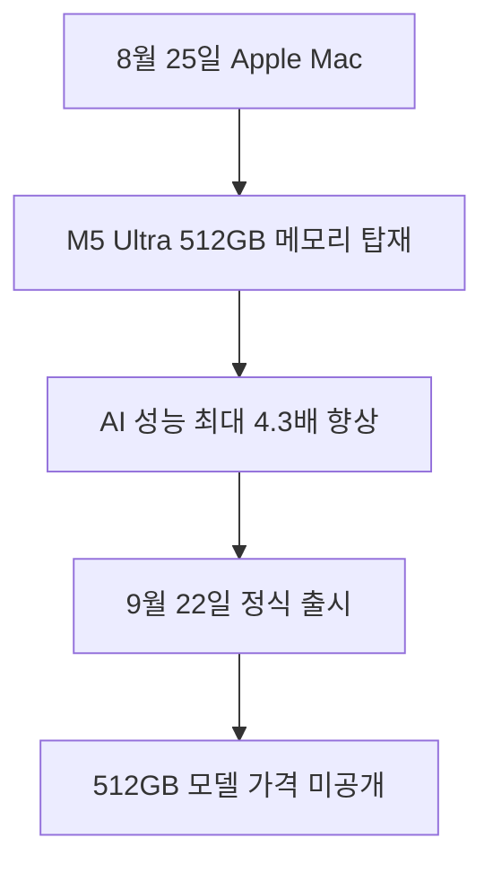

M5 Ultra Mac Studio의 핵심은 최대 512GB 통합 메모리로 기존 데스크톱에서 담기 어려웠던 대형 모델을 로컬 실행 범위에 넣었다는 점입니다. 하지만 모델이 메모리에 들어가는 것과 실무에 충분히 빠르게 동작하는 것은 다른 문제입니다. 512GB 옵션의 가격과 독립적인 LLM 속도 측정이 공개되지 않았으므로, 구매 판단은 모델 크기, 처리 속도, 총비용을 함께 확인한 뒤 내려야 합니다.

> **먼저 알아둘 용어**
>
> - **LLM**: 엄청난 양의 글을 학습해 문장을 만들어 내는 대형 AI 모델입니다. ChatGPT 가 대표적입니다.
> - **GPU**: AI 계산을 한꺼번에 빠르게 처리하는 전용 반도체입니다. AI 비용의 대부분이 여기서 나옵니다.
> - **파라미터**: 모델이 학습하면서 갖게 된 숫자 값입니다. 많을수록 대체로 덩치가 크고 비싼 모델입니다.
> - **추론**: 학습이 끝난 모델이 실제로 답을 만들어 내는 과정입니다. 이때 드는 계산 비용이 곧 사용료입니다.
> - **벤치마크**: 같은 문제집을 여러 모델에 풀려 점수를 매기는 시험입니다. 실제 체감 성능과 다를 수 있습니다.
{: .prompt-info }

## 무슨 일이 벌어진 걸까?

**한 줄 요약**: Apple, 온디바이스 LLM 구동 위한 512GB 메모리 탑재 M5 Max 및 M5 Ultra 기반 Mac Studio 공개

원문 헤드라인: Apple Unveils Mac Studio with M5 Max and M5 Ultra Chips Offering 512GB Memory for Local LLMs

발행일은 2026-08-25이며, 아래 내용은 <a href="#source-1" aria-label="Apple 출처">[1]</a>에서 확인할 수 있는 범위만 담았습니다.

- Apple은 2026년 8월 25일 M5 Max 및 M5 Ultra 칩을 탑재한 신형 Mac Studio 데스크톱을 발표했습니다. <a href="#source-1" aria-label="Apple 출처">[1]</a> 원문: Apple announced the new Mac Studio desktop powered by M5 Max and M5 Ultra chips on August 25, 2026.

- M5 Ultra 탑재 Mac Studio는 최대 36코어 CPU, 최대 80코어 GPU, 그리고 최대 512GB 통합 메모리를 지원합니다. <a href="#source-1" aria-label="Apple 출처">[1]</a> 원문: The M5 Ultra configuration of the Mac Studio scales up to a 36-core CPU, up to an 80-core GPU, and up to 512GB of unified memory.

- M5 Ultra 칩은 M3 Ultra 대비 50퍼센트 향상된 1.2TB/s의 통합 메모리 대역폭을 제공합니다. <a href="#source-1" aria-label="Apple 출처">[1]</a> 원문: The M5 Ultra chip delivers up to 1.2TB/s of unified memory bandwidth, representing a 50 percent increase compared to M3 Ultra.

- 신형 Mac Studio는 GPU 코어에 내장된 Neural Accelerator를 활용해 M3 Ultra 대비 최대 4.3배 빠른 피크 AI 컴퓨팅 성능을 제공합니다. <a href="#source-1" aria-label="Apple 출처">[1]</a> 원문: The new Mac Studio delivers up to 4.3x faster peak AI compute performance compared to M3 Ultra through Neural Accelerators integrated into GPU cores.

- 해당 하드웨어는 클라우드 연결 없이 수천억 개 파라미터를 가진 대형 언어 모델을 기기 내에서 로컬로 구동할 수 있도록 설계되었습니다. <a href="#source-1" aria-label="Apple 출처">[1]</a> 원문: The hardware is designed to allow running large language models with hundreds of billions of parameters entirely on device without cloud connectivity.

<figure class="news-source-image">
  
  <figcaption>Apple가 원문과 함께 공개한 이미지입니다. <a href="https://www.apple.com/newsroom/2026/08/apple-introduces-new-mac-studio-with-m5-max-and-m5-ultra" target="_blank" rel="noopener noreferrer">출처: Apple</a></figcaption>
</figure>

## 512GB면 어떤 로컬 AI 병목이 풀릴까?

통합 메모리는 CPU와 GPU가 같은 메모리 공간을 활용하는 구조이므로, 큰 모델 가중치를 여러 장치 사이에 나눠 담는 복잡성을 줄일 수 있습니다. 최대 512GB라는 용량은 Apple이 수천억 파라미터 모델을 기기에서 실행할 수 있다고 설명하는 근거입니다. 외부 서버로 원문이나 코드를 보내지 않고 로컬에서 처리해야 하는 조직에는 모델을 메모리에 올릴 수 있는 선택지가 늘어납니다.

다만 사용 가능한 메모리를 전부 모델 파일에 쓸 수는 없습니다. 운영체제, 실행 프로그램, 입력 문맥과 출력 생성을 위한 메모리 여유가 필요하고, 모델 정밀도와 양자화 방식에 따라 같은 파라미터 수라도 요구량이 달라집니다. 구매 전에는 실제 사용할 모델 파일 크기에 문맥 처리 여유를 더하고, 목표 입력 길이에서 메모리 부족이 나지 않는지 확인해야 합니다.

<figure class="news-source-image">
  
  <figcaption>Apple가 원문과 함께 공개한 이미지입니다. <a href="https://www.apple.com/newsroom/2026/08/apple-introduces-new-mac-studio-with-m5-max-and-m5-ultra" target="_blank" rel="noopener noreferrer">출처: Apple</a></figcaption>
</figure>

## 최대 4.3배 성능을 업무 속도로 봐도 될까?

발표 수치는 Neural Accelerator를 활용한 **피크 AI 컴퓨팅 성능**이 M3 Ultra보다 최대 4.3배 빠르다는 비교입니다. 특정 로컬 LLM의 초당 토큰이나 첫 응답 시간, 긴 문서 처리 완료 시간이 모두 같은 배수로 줄어든다는 뜻은 아닙니다. 실제 결과는 모델 형식, 양자화, 실행 엔진의 최적화와 메모리 대역폭 활용에 따라 달라집니다.

1.2TB/s 대역폭도 중요한 사양이지만 단독으로 체감 속도를 보장하지 않습니다. 후보 모델로 짧은 질의와 긴 문서 요약을 각각 실행해 첫 토큰 지연, 초당 생성량, 최대 메모리 사용량을 측정해야 합니다. 같은 작업을 기존 Mac이나 클라우드 API와 비교하면 보안상 로컬 처리의 가치와 기다리는 시간, 장비 비용 사이의 균형을 볼 수 있습니다.

## 지금 주문할지 기다릴지는 무엇으로 결정할까?

일반 구성의 배송 일정과 512GB 최고 사양의 출시 시점이 다르므로, 대형 모델이 목적이라면 메모리 옵션을 확인하지 않고 먼저 주문하면 안 됩니다. 512GB 구성 가격이 공개되지 않은 상태에서는 클라우드 GPU 비용과의 손익분기점도 계산할 수 없습니다. 독립 벤치마크와 실제 판매가가 나온 뒤 하루 사용 시간, 전력, 유지 기간을 넣어 총비용을 비교하는 편이 타당합니다.

실패 조건은 큰 모델이 들어가지만 필요한 속도가 나오지 않거나, 사용하는 실행 엔진이 새 가속기를 충분히 활용하지 못하는 경우입니다. 반대로 데이터 반출 금지가 핵심이라면 클라우드보다 느려도 로컬 실행 자체가 구매 이유가 될 수 있습니다. 성능 순위보다 자신의 필수 조건을 먼저 정해야 512GB라는 최대 사양에만 끌려 과투자하는 일을 피할 수 있습니다.

## 아직은 선을 그어야 할 부분

- M5 Ultra Mac Studio의 512GB 통합 메모리 구성에 대한 공식 가격은 공개되지 않았습니다. 원문: Official pricing for the 512GB unified memory configuration of the M5 Ultra Mac Studio has not been announced.

- 정식 배송 전 M5 Ultra 하드웨어에서 수천억 파라미터 LLM을 로컬 추론할 때의 독립적인 제3자 벤치마크 결과는 아직 공개되지 않았습니다. 원문: Independent third-party benchmarks for multi-hundred-billion parameter LLM local inference on the M5 Ultra hardware are not yet available before public shipping.

추가 원문이 공개되거나 제공 조건이 바뀌면 판단도 달라질 수 있습니다. 따라서 이 글은 오늘 시점의 출발점으로 활용하고, 실제 도입 전에는 연결된 원문을 다시 확인하는 것이 좋습니다.

<!-- primary-sources:start -->
## 원문과 버전 확인

- [발표 원문](https://www.apple.com/newsroom/2026/08/apple-introduces-new-mac-studio-with-m5-max-and-m5-ultra)
- [MacRumors](https://www.macrumors.com/2026/08/25/apple-unveils-mac-studio-m5-max-m5-ultra)
<!-- primary-sources:end -->

<!-- internal-links:start -->
## 함께 읽으면 이해가 이어지는 글

- [oMLX: 애플 실리콘에서 AI 코딩 에이전트 속도를 극대화하는 MLX 추론 서버]() — oMLX는 애플 실리콘 Mac 환경에서 MLX 프레임워크를 기반으로 작동하는 고성능 LLM 추론 서버입니다. 페이징 처리된 SSD KV 캐싱과 연속 배칭을 통해 AI 코딩 에이전트의 첫 토큰 생성 시간(TTFT)을 획기적으로…
- [2026년 로컬 LLM 모델 비교 및 그래픽 카드 사양 추천 가이드]() — 컴퓨터에 직접 거대언어모델을 띄워 쓰려는 분들을 위해 Llama 3.1, Qwen 2.5, DeepSeek-R1-Distill 모델의 성능, 필요한 그래픽 카드 사양과 메모리 크기, 선택 기준을 명확하게 비교해 정리했습니다.
- [Meta Muse Glimmer 30B 로컬 에이전트: 4비트 메모리 조건과 도입 판단]() — Meta가 2026년 8월 10일 소비자용 GPU 환경에 최적화된 300억 파라미터 오픈소스 모델 Muse Glimmer를 Apache 2.0 라이선스로 출시했습니다. 4비트 양자화를 적용해 메모리 점유율을 20GB RAM 이하로…
<!-- internal-links:end -->

## 자주 묻는 질문

### M5 Ultra 탑재 Mac Studio에서 클라우드 없이 수천억 파라미터 LLM 구동이 정말 가능한가요?

Apple은 최대 512GB 통합 메모리와 1.2TB/s 대역폭으로 수천억 개 파라미터 모델을 기기에서 구동할 수 있도록 설계했다고 밝혔습니다. 다만 512GB 옵션은 2026년 10월 하순 출시 예정이며 실제 속도를 보여주는 독립 벤치마크는 아직 공개되지 않았습니다.

### M5 Ultra Mac Studio의 정식 출시일과 사전 주문 일정은 어떻게 되나요?

사전 주문은 2026년 8월 25일부터 시작되었으며 정식 출시 및 배송은 2026년 9월 22일입니다. 다만 512GB 통합 메모리 최고 사양 옵션은 2026년 10월 하순 출시될 예정입니다.

### M5 Ultra 탑재 Mac Studio 512GB 모델의 가격은 얼마인가요?

Apple은 2026년 8월 25일 발표에서 512GB 통합 메모리 구성의 공식 가격을 공개하지 않았습니다. 추후 정식 판매 시점에 맞춰 가격이 공개될 예정입니다.

### 이전 M3 Ultra 대비 인공지능 성능은 얼마나 향상되었나요?

GPU 코어에 내장된 Neural Accelerator를 활용해 M3 Ultra 대비 최대 4.3배 빠른 피크 AI 컴퓨팅 성능을 제공합니다. 통합 메모리 대역폭 또한 1.2TB/s로 50퍼센트 증가했습니다.

## 직접 확인한 원문

<ol class="checked-source-list">
  <li id="source-1"><a href="https://www.apple.com/newsroom/2026/08/apple-introduces-new-mac-studio-with-m5-max-and-m5-ultra" target="_blank" rel="noopener noreferrer">Apple — Apple introduces new Mac Studio with M5 Max and M5 Ultra</a> (2026-08-25)</li>
  <li id="source-2"><a href="https://www.macrumors.com/2026/08/25/apple-unveils-mac-studio-m5-max-m5-ultra" target="_blank" rel="noopener noreferrer">MacRumors — Apple Unveils New Mac Studio With M5 Max and M5 Ultra Chips</a> (2026-08-25)</li>
</ol>

> 이 글은 위 원문을 직접 확인해 작성했습니다. 가격, 기능 범위, 지역별 제공 여부는 게시 후 바뀔 수 있으니 실제 도입 전 공식 문서를 다시 확인하세요.
