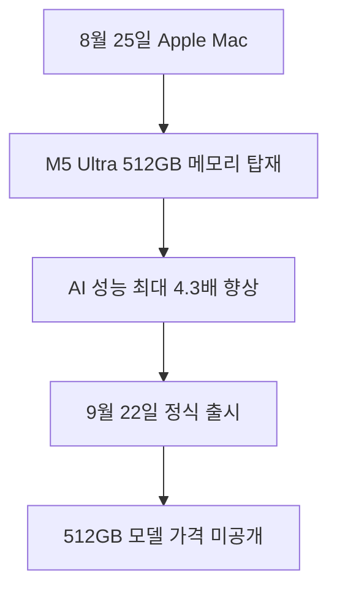

Hardware & On-Device AI 관련 새 소식을 오늘 확인 가능한 직접 원문 범위에서 정리했습니다. 자동 검증 기준을 모두 충족하지 못한 날에도 발행을 건너뛰지 않기 위한 간결한 브리핑이며, 확인되지 않은 내용은 단정하지 않습니다. 원문이 영어인 문장은 한국어로 옮기고, 대조할 수 있도록 원문도 함께 남겼습니다.

> **먼저 알아둘 용어**
>
> - **LLM**: 엄청난 양의 글을 학습해 문장을 만들어 내는 대형 AI 모델입니다. ChatGPT 가 대표적입니다.
> - **GPU**: AI 계산을 한꺼번에 빠르게 처리하는 전용 반도체입니다. AI 비용의 대부분이 여기서 나옵니다.
> - **파라미터**: 모델이 학습하면서 갖게 된 숫자 값입니다. 많을수록 대체로 덩치가 크고 비싼 모델입니다.
> - **추론**: 학습이 끝난 모델이 실제로 답을 만들어 내는 과정입니다. 이때 드는 계산 비용이 곧 사용료입니다.
> - **벤치마크**: 같은 문제집을 여러 모델에 풀려 점수를 매기는 시험입니다. 실제 체감 성능과 다를 수 있습니다.
{: .prompt-info }

## 무슨 일이 벌어진 걸까?

**한 줄 요약**: Apple, 온디바이스 LLM 구동 위한 512GB 메모리 탑재 M5 Max 및 M5 Ultra 기반 Mac Studio 공개

원문 헤드라인: Apple Unveils Mac Studio with M5 Max and M5 Ultra Chips Offering 512GB Memory for Local LLMs

발행일은 2026-08-25이며, 아래 내용은 <a href="#source-1" aria-label="Apple 출처">[1]</a>에서 확인할 수 있는 범위만 담았습니다.

- Apple은 2026년 8월 25일 M5 Max 및 M5 Ultra 칩을 탑재한 신형 Mac Studio 데스크톱을 발표했습니다. <a href="#source-1" aria-label="Apple 출처">[1]</a> 원문: Apple announced the new Mac Studio desktop powered by M5 Max and M5 Ultra chips on August 25, 2026.

- M5 Ultra 탑재 Mac Studio는 최대 36코어 CPU, 최대 80코어 GPU, 그리고 최대 512GB 통합 메모리를 지원합니다. <a href="#source-1" aria-label="Apple 출처">[1]</a> 원문: The M5 Ultra configuration of the Mac Studio scales up to a 36-core CPU, up to an 80-core GPU, and up to 512GB of unified memory.

- M5 Ultra 칩은 M3 Ultra 대비 50퍼센트 향상된 1.2TB/s의 통합 메모리 대역폭을 제공합니다. <a href="#source-1" aria-label="Apple 출처">[1]</a> 원문: The M5 Ultra chip delivers up to 1.2TB/s of unified memory bandwidth, representing a 50 percent increase compared to M3 Ultra.

- 신형 Mac Studio는 GPU 코어에 내장된 Neural Accelerator를 활용해 M3 Ultra 대비 최대 4.3배 빠른 피크 AI 컴퓨팅 성능을 제공합니다. <a href="#source-1" aria-label="Apple 출처">[1]</a> 원문: The new Mac Studio delivers up to 4.3x faster peak AI compute performance compared to M3 Ultra through Neural Accelerators integrated into GPU cores.

- 해당 하드웨어는 클라우드 연결 없이 수천억 개 파라미터를 가진 대형 언어 모델을 기기 내에서 로컬로 구동할 수 있도록 설계되었습니다. <a href="#source-1" aria-label="Apple 출처">[1]</a> 원문: The hardware is designed to allow running large language models with hundreds of billions of parameters entirely on device without cloud connectivity.

<figure class="news-source-image">
  
  <figcaption>Apple가 원문과 함께 공개한 이미지입니다. <a href="https://www.apple.com/newsroom/2026/08/apple-introduces-new-mac-studio-with-m5-max-and-m5-ultra" target="_blank" rel="noopener noreferrer">출처: Apple</a></figcaption>
</figure>

## 왜 지금 다들 이 이야기를 할까?

이 소식의 핵심은 새 기능이나 발표의 이름보다 실제 사용자와 개발자의 선택이 달라지는지에 있습니다. 지금 단계에서는 원문이 밝힌 내용과 아직 공개하지 않은 내용을 분리해서 보는 것이 안전합니다.

<figure class="news-source-image">
  
  <figcaption>Apple가 원문과 함께 공개한 이미지입니다. <a href="https://www.apple.com/newsroom/2026/08/apple-introduces-new-mac-studio-with-m5-max-and-m5-ultra" target="_blank" rel="noopener noreferrer">출처: Apple</a></figcaption>
</figure>

## 그래서 우리에게 뭐가 달라질까?

도입을 검토한다면 현재 쓰는 도구와 바로 교체하기보다 작은 작업에서 먼저 비교해 보는 편이 좋습니다. 제공 지역, 요금, 데이터 처리 방식처럼 의사결정에 영향을 주는 조건은 실제 사용 전에 원문에서 다시 확인해야 합니다.

## 직접 써보거나 지켜볼 포인트

첫째, 공식 제공 범위와 사용 조건을 확인합니다. 둘째, 기존 작업 흐름에서 시간을 줄여주는지 작은 예제로 비교합니다. 셋째, 발표 내용과 실제 일반 제공 상태가 같은지 구분합니다.

## 아직은 선을 그어야 할 부분

- M5 Ultra Mac Studio의 512GB 통합 메모리 구성에 대한 공식 가격은 공개되지 않았습니다. 원문: Official pricing for the 512GB unified memory configuration of the M5 Ultra Mac Studio has not been announced.

- 정식 배송 전 M5 Ultra 하드웨어에서 수천억 파라미터 LLM을 로컬 추론할 때의 독립적인 제3자 벤치마크 결과는 아직 공개되지 않았습니다. 원문: Independent third-party benchmarks for multi-hundred-billion parameter LLM local inference on the M5 Ultra hardware are not yet available before public shipping.

추가 원문이 공개되거나 제공 조건이 바뀌면 판단도 달라질 수 있습니다. 따라서 이 글은 오늘 시점의 출발점으로 활용하고, 실제 도입 전에는 연결된 원문을 다시 확인하는 것이 좋습니다.

## 자주 묻는 질문

### M5 Ultra 탑재 Mac Studio에서 클라우드 없이 수천억 파라미터 LLM 구동이 정말 가능한가요?

네, 최대 512GB 통합 메모리와 1.2TB/s 대역폭을 지원하여 외부 인터넷 연결 없이 기기 내부에서 수천억 개 파라미터 모델을 직접 구동할 수 있습니다. 다만 512GB 메모리 모델은 2026년 10월 하순에 출시됩니다.

### M5 Ultra Mac Studio의 정식 출시일과 사전 주문 일정은 어떻게 되나요?

사전 주문은 2026년 8월 25일부터 시작되었으며 정식 출시 및 배송은 2026년 9월 22일입니다. 다만 512GB 통합 메모리 최고 사양 옵션은 2026년 10월 하순 출시될 예정입니다.

### M5 Ultra 탑재 Mac Studio 512GB 모델의 가격은 얼마인가요?

Apple은 2026년 8월 25일 발표에서 512GB 통합 메모리 구성의 공식 가격을 공개하지 않았습니다. 추후 정식 판매 시점에 맞춰 가격이 공개될 예정입니다.

### 이전 M3 Ultra 대비 인공지능 성능은 얼마나 향상되었나요?

GPU 코어에 내장된 Neural Accelerator를 활용해 M3 Ultra 대비 최대 4.3배 빠른 피크 AI 컴퓨팅 성능을 제공합니다. 통합 메모리 대역폭 또한 1.2TB/s로 50퍼센트 증가했습니다.

## 직접 확인한 원문

<ol class="checked-source-list">
  <li id="source-1"><a href="https://www.apple.com/newsroom/2026/08/apple-introduces-new-mac-studio-with-m5-max-and-m5-ultra" target="_blank" rel="noopener noreferrer">Apple — Apple introduces new Mac Studio with M5 Max and M5 Ultra</a> (2026-08-25)</li>
  <li id="source-2"><a href="https://www.macrumors.com/2026/08/25/apple-unveils-mac-studio-m5-max-m5-ultra" target="_blank" rel="noopener noreferrer">MacRumors — Apple Unveils New Mac Studio With M5 Max and M5 Ultra Chips</a> (2026-08-25)</li>
</ol>

> 이 글은 위 원문을 직접 확인해 작성했습니다. 가격, 기능 범위, 지역별 제공 여부는 게시 후 바뀔 수 있으니 실제 도입 전 공식 문서를 다시 확인하세요.
