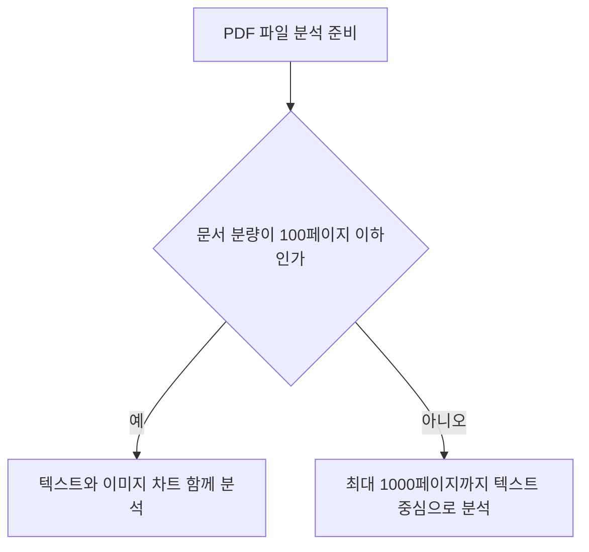

클로드 사용법은 무료 플랜의 작업 한도를 파악하고 업무에 맞는 유료 요금제 전환 여부를 결정하는 것에서 출발합니다.

온라인 커뮤니티나 검색창에는 인공지능 도구 활용에 대한 정보가 많이 넘쳐납니다. 하지만 요금별 제한과 구체적인 활용 기준을 모르면 불필요한 비용을 지불하거나 작업 중간에 흐름이 끊기게 됩니다. 이 글은 2026년 8월 26일 기준 확인된 공식 사실만을 바탕으로 복잡한 클로드 사용법 정리 내용을 한눈에 알기 쉽게 설명합니다.

> **먼저 알아둘 용어**
>
> - **RAG**: AI가 답하기 전에 정해진 문서를 찾아 읽고, 그 내용을 근거로 답하게 하는 방식입니다.
> - **API**: 다른 프로그램에서 이 기능을 불러다 쓸 수 있게 열어 둔 창구입니다.
{: .prompt-info }

## 클로드 무료 플랜과 유료 플랜 비교
클로드 무료 플랜은 비용 없이 기본 기능을 제공하며 유료 플랜은 과거 대화 참조와 높은 한도를 지원합니다.

```chartjs
{
  "type": "bar",
  "data": {
    "labels": ["Free 플랜", "Pro 월간 플랜", "Pro 연간 플랜"],
    "datasets": [
      {
        "label": "비용 달러 USD",
        "data": [0, 20, 200],
        "backgroundColor": ["#9aa5a1", "#2f9e8f", "#1d6f63"]
      }
    ]
  },
  "options": {
    "responsive": true
  }
}
```

무료 계정(Free)의 이용 요금은 0달러입니다. 개인용 프로(Pro) 플랜은 월 20달러 또는 연간 200달러(USD)입니다. 무료 플랜 사용자도 최대 5개의 프로젝트(Projects: 자료를 모아두는 작업 공간)를 생성하여 문서와 대화를 관리할 수 있습니다.

| 구분 | Free 플랜 | Pro 플랜 |
| --- | --- | --- |
| 월 이용 요금 | $0 | $20 (연간 결제 시 $200) |
| 프로젝트 생성 수 | 최대 5개 | 이용 가능 |
| 이전 대화 검색 | 미지원 | 지원 |
| 메모리 기능 | 미지원 | 지원 |
| 대화 파일 첨부 | 최대 20개 | 최대 20개 |

유료 플랜 이용자는 이전 대화 검색 기능과 메모리(Memory: 이전 대화 맥락을 저장하는 기능) 기능을 이용할 수 있습니다. 무료 사용 중 대화 내역이 쌓여 이전 기록을 찾아야 한다면 유료 플랜 전환을 검토해야 합니다.

## 클로드 사용법 pdf 업로드 및 파일 분석 한도
클로드에 문서를 분석할 때는 파일당 500MB와 대화당 20개 첨부 제한을 확인해야 합니다.

많은 분이 클로드 사용법 pdf 첨부 시 용량 제한으로 어려움을 겪습니다. 클로드 대화창의 파일 업로드 한도는 파일당 최대 500MB입니다. 대화 1회당 최대 20개까지 파일을 첨부할 수 있습니다.

PDF 문서는 최대 1000페이지까지 업로드를 지원합니다. 특히 100페이지 이하의 PDF 문서인 경우에는 텍스트와 함께 내부 시각 요소인 이미지와 차트까지 함께 분석합니다. 100페이지가 넘는 대용량 문서라면 핵심 구역만 나누어 올리는 것이 좋습니다.



온라인 커뮤니티 글을 보면 클로드 사용법 디시 연관 검색어로 문서 용량 초과 질문이 자주 올라옵니다. 100페이지 이하 파일은 이미지 정보까지 함께 다루므로 보고서 분석 시 매우 유용합니다.

## 아티팩트와 스킬 기능 활용 가이드
아티팩트는 긴 결과물을 별도 창에서 관리하고 스킬은 특정 업무 순서를 제어합니다.

아티팩트(Artifacts: 메인 대화창과 분리되어 별도 출력되는 전용 작업 창) 기능은 15줄 이상의 독립적이고 재활용성이 높은 내용을 만들 때 자동으로 작동합니다. 코딩 결과물이나 긴 보고서 초안이 본문 대화와 섞이지 않아 작업 효율이 올라갑니다.


스킬(Skills: 특정 업무 절차 가이드 및 제어 기능) 기능은 코드 실행 기능이 켜진 환경이라면 모든 플랜에서 쓸 수 있습니다. 무료(Free), 프로(Pro), 맥스(Max), 팀(Team), 엔터프라이즈(Enterprise) 요금제 사용자 모두가 해당 기능을 이용할 수 있습니다.

별도의 클로드 사용법 책 매뉴얼을 찾아보지 않아도 화면 우측에 열리는 아티팩트 창을 통해 간편하게 코드를 수정하고 결과를 확인할 수 있습니다.

## 프로젝트 기능과 RAG 자동 확장
프로젝트에 문서를 저장해 두면 데이터 양이 늘어날 때 검색 증강 모드가 자동 작동합니다.

무료 사용자도 5개까지 만들 수 있는 프로젝트 기능은 관련 자료를 한곳에 모아두는 작업 공간입니다. 대화가 길어지거나 파일이 많아져 컨텍스트 윈도(Context Window: AI가 한 번에 읽고 기억하는 글자 수 단위) 한계에 다다르면 RAG 모드가 켜집니다.

RAG(Retrieval-Augmented Generation: 검색 증강 생성, 질문에 맞는 문서를 찾아 답을 만드는 기술) 모드가 자동 작동하면 지식 용량이 최대 10배까지 늘어납니다. 별도의 복잡한 설정 없이도 대용량 자료를 다룰 수 있게 됩니다.

개발자나 기업 이용자를 위한 Claude 3.5 Sonnet 모델은 200K 토큰(Token: AI가 글자를 세는 단위로 약 책 한 권 분량) 컨텍스트 윈도를 제공합니다. API 기준 사용 요금은 입력 백만 토큰당 3달러, 출력 백만 토큰당 15달러입니다.

## 대화 공유 시 데이터 보안 및 비공개 처리
대화 공유 링크를 만들어도 파일 원본과 내부 프로토콜 데이터는 비공개 처리됩니다.

작업 결과를 외부와 공유할 때는 보안이 중요합니다. 클로드의 대화 공유 기능을 사용할 때 첨부했던 파일 원본은 공유 스냅샷에 포함되지 않습니다.

또한 MCP(Model Context Protocol: 모델 컨텍스트 프로토콜, AI와 외부 도구를 연결하는 규격) 툴 호출 로우 데이터 역시 비공개로 유지됩니다. 개인 정보나 내부 원본 파일이 공유 링크를 통해 유출될 염려가 없습니다.

시중에 판매되는 클로드 사용법 책 정보나 온라인 문서 설명 중 일부는 보안 정책 설명이 누락된 경우가 있습니다. 파일 원본은 절대 외부에 노출되지 않으니 안심하고 공유 기능을 활용할 수 있습니다.

## 그래서 내 업무에는 뭐가 달라지나
오늘 바로 적용할 수 있는 구체적인 실행 지침 두 가지를 제시합니다.

첫째, 시각 자료가 포함된 100페이지 이하의 PDF 보고서를 분석해야 한다면 대화창에 직접 첨부하여 이미지와 차트 분석을 실행하십시오. 500MB 이하, 20개 파일까지는 별도 결제 없이 무료 플랜에서도 바로 처리할 수 있습니다.

둘째, 지난 대화 기록을 자주 검색해야 하거나 과거 대화 맥락을 기억하는 메모리 기능이 필요하다면 월 20달러의 Pro 플랜으로 전환하십시오. 이전 대화 검색 기능이 제공되어 과거 작업 내용을 즉시 찾아낼 수 있습니다.

## 자주 묻는 질문

### Claude 무료 플랜으로 프로젝트를 몇 개까지 만들 수 있나요?

무료 계정 사용자는 최대 5개의 프로젝트를 생성할 수 있습니다.

### PDF 파일 업로드 시 제한 용량과 페이지 수는 어떻게 되나요?

파일당 최대 500MB까지 업로드 가능하며, PDF는 최대 1000페이지까지 지원합니다. 100페이지 이하 PDF는 이미지와 차트 등 시각 요소도 함께 분석합니다.

### 대화 공유 기능을 쓸 때 첨부 파일 원본이 외부에 노출되나요?

아닙니다. 대화 공유 시 첨부 파일 원본과 MCP 툴 호출 로우 데이터는 공유 스냅샷에 포함되지 않고 비공개 처리됩니다.

## 직접 확인한 원문

- [Anthropic Help Center](https://vertexaisearch.cloud.google.com/grounding-api-redirect/AUZIYQERZ6oO2G90sgJzu8CTw3P_RqGgFtw-JpbuAFxr-BdswZDjp64nNqUjbx_22E7LJelX5VaQcdSTgDO9qFmfsf69RlhjlMTC3QgRSyuPKy4L-mv7UNpwvmCRQi71MKm6p70KlKwXscijWdcDysvY-t5NxhmxMi2wAfCi38TkMemGO9WM) (2026-08-26 확인)
- [Anthropic Help Center](https://vertexaisearch.cloud.google.com/grounding-api-redirect/AUZIYQETqt0DTaCuqicoe47b_WqQ1StCz4Ciu_-FR7FZx7xc-HR5gR1CCZszMK5mMThjeFFFF2U4aFuOdVsyfLVFe86_GVQAhEpaicmYIvv46oP4TwMFo8eU2hNK44WPYxJ9vc8_MrEFNKKWQYegmcQciJdEynfwlei0IdtBeB8kqt4QzrPv_nJTn7AejCkTyzPPNAI3WJaXp_SsOQ==) (2026-08-26 확인)
- [Anthropic Help Center](https://vertexaisearch.cloud.google.com/grounding-api-redirect/AUZIYQE9JDmfqyqjeFrzbNGpdNgCPQfyK0-r3Z_bNieXZdx3j0mj3IqgKLKEKmtUO4q3JPAez3WXsgD8hYCFasJ-XMKUsFambKXfhRYW33zEtPiGcqVx4VYZcNdWKV445jaM2coh2zOaIPgrfCStALrt3S1E7O3nMdzNrIfwDt0FvtjmpX24VlC3COaQXU2krQkzYao=) (2026-08-26 확인)
- [Anthropic Help Center](https://vertexaisearch.cloud.google.com/grounding-api-redirect/AUZIYQEQ2mZfGsEwcPrO-OYiO6ZvxCfXvKGA-7usOKJ-k9qisIscpxjmd4cw-3WpEJyIc1vhttwws-cEsVM-3JrgNXtRsVGmz6z6NEa8o17-ptcwtMMgVMoT-AU1EUS3AB5dYeNldmvUHUaKtFy7W547WDDCnSiugnPTt2hp28TG4-qt0KaF40WlohW8d8Vp1kjLIT62MTMWPtHWMjs=) (2026-08-26 확인)
- [Anthropic Help Center](https://vertexaisearch.cloud.google.com/grounding-api-redirect/AUZIYQEu7ftVuwwmMNRFQViI03Lb-12-2SpJUst_MAPQHTOmkkIuW1oMTE_b20gsh5ukzEKmI0XhNZUdLK5jlccuog15IfT1xgtXLrvarYTdQiaw1D0nu5FLJUWciaeBdNjUHWCQnHFctT0E0fJpcAqEUKIlQ2uHbpv9f8z3T0wDDUez4cfdvSMzxFVMNzgD8RP2h_dlremSMzQGQg==) (2026-08-26 확인)
- [Anthropic Help Center](https://vertexaisearch.cloud.google.com/grounding-api-redirect/AUZIYQHnOnlyD_gV5GlJBUYobkJNHYekt4ccC5VG9NyWCY0NWxsarZwTufQ1oh_8WnsORf_8RMajpeOH6LezEYblJuNyYfxoc9SmY1-y0_41Gs9kbjT6c2SAXXk97YP5mV0vrVQzV27jsRUA8ne34ojQwndaLv7kclQb2CzRAyxSxiOZAwtu) (2026-08-26 확인)
- [Anthropic Help Center](https://vertexaisearch.cloud.google.com/grounding-api-redirect/AUZIYQHXDIWb309CWWLM7RqrduFR_RO71fg6QWbz2AdhT_BF9D7CQS_Tf0GVDxrJpcO0-qGRFAPuYU0Yuv9i0xeIRQXdtj386KXYgkKCAwqOYS0vApEJ7DSf_n-_APCovh8AFHlwPKJsnWiOfm81ZS81LmLyLcIpsxC5XMZGKiGN1crct2E4IhY=) (2026-08-26 확인)
- [Anthropic](https://vertexaisearch.cloud.google.com/grounding-api-redirect/AUZIYQHIBWQMKEHmubFqfBobBnf2pbj8Yx6OJmEgg3gQPc4W8UfG30AT7bXZaScyaH27NZKSzKJwpm8fuUdQz162XiG0WwT2XG6RukvT6_xM_UcdhSRPlmJfBX4cU-LeKV06gxjCVZSngtg=) (2026-08-26 확인)
- [Anthropic Help Center](https://vertexaisearch.cloud.google.com/grounding-api-redirect/AUZIYQHw4M3VNWntElnaPp6RKXHsOp_5jYr1k4blUMZdteeWCDAAlAhuRN8yZtN91Q4E_uL9QS_qS9MmQFm0YVP8tdKDZa-4-42Gym6pXrUlnn3rjyzWv62TWQ-5cFDk1PeJxLTrm-IsMq1eECbYqlkmuaMX8fL82Kv5O3s=) (2026-08-26 확인)

위 수치는 확인 시점 기준이며 예고 없이 바뀔 수 있습니다. 결정 전에 공식 페이지를 한 번 더 확인하시기 바랍니다.
