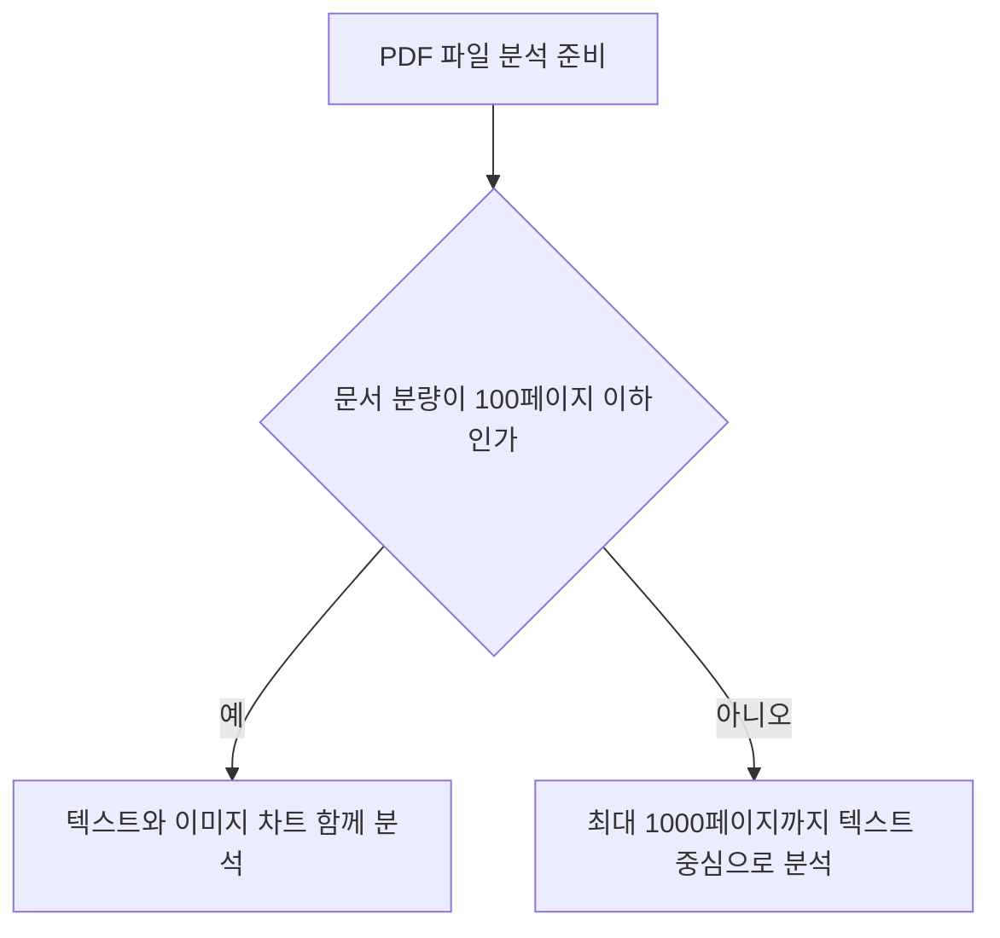

클로드 사용법은 무료 플랜의 작업 한도를 파악하고 업무에 맞는 유료 요금제 전환 여부를 결정하는 것에서 출발합니다.

무료로 먼저 시작해도 프로젝트, PDF 분석, Artifacts, Skills를 시험할 수 있습니다. Pro가 필요한 시점은 단순히 기능 이름이 많을 때가 아니라 사용량이 자주 끊기거나 과거 대화 검색이 실제 작업 흐름에 필요할 때입니다. 프로젝트 RAG의 무료 지원 여부는 Anthropic 공식 문서 두 곳의 안내가 서로 달라 아래에서 갱신일과 함께 구분합니다. 이 글은 2026년 8월 26일 기준 Claude 공식 도움말을 바탕으로 채팅과 프로젝트의 서로 다른 제한까지 정리합니다.

> **먼저 알아둘 용어**
>
> - **RAG**: AI가 답하기 전에 정해진 문서를 찾아 읽고, 그 내용을 근거로 답하게 하는 방식입니다.
> - **API**: 다른 프로그램에서 이 기능을 불러다 쓸 수 있게 열어 둔 창구입니다.
{: .prompt-info }

## 클로드 무료 플랜과 유료 플랜 비교
클로드 무료 플랜은 비용 없이 기본 기능을 제공하며 유료 플랜은 과거 대화 참조와 높은 한도를 지원합니다.

```chartjs
{
  "type": "bar",
  "data": {
    "labels": ["Free 플랜", "Pro 월간 플랜", "Pro 연간 플랜"],
    "datasets": [
      {
        "label": "월 기준 비용 달러 USD",
        "data": [0, 20, 16.67],
        "backgroundColor": ["#9aa5a1", "#2f9e8f", "#1d6f63"]
      }
    ]
  },
  "options": {
    "responsive": true
  }
}
```

무료 계정(Free)의 이용 요금은 0달러입니다. 개인용 Pro 플랜은 월 20달러 또는 연간 200달러이며, 연간 결제액을 12개월로 나누면 월 약 16.67달러입니다. 지역과 세금에 따라 결제 화면의 금액은 달라질 수 있습니다. 무료 사용자도 최대 5개의 프로젝트를 만들어 문서와 대화를 주제별로 나눌 수 있습니다.

| 구분 | Free 플랜 | Pro 플랜 |
| --- | --- | --- |
| 월 이용 요금 | $0 | $20 (연간 결제 시 $200) |
| 프로젝트 생성 수 | 최대 5개 | 이용 가능 |
| 이전 대화 검색 | 미지원 | 지원 |
| 새 메모리 기능 | 지원, 기본 켜짐 | 지원, 기본 켜짐 |
| 대화 파일 첨부 | 최대 20개 | 최대 20개 |

과거 대화를 직접 검색해 현재 답변에 참조시키는 기능은 유료 플랜에서 제공됩니다. 반면 [Claude의 현재 메모리 안내](https://support.claude.com/en/articles/11817273-use-claude-s-chat-search-and-memory-to-build-on-previous-context)에 따르면 새 메모리는 Free, Pro, Max에서 기본으로 켜집니다. Team, Enterprise는 조직 소유자가 먼저 허용해야 하므로 개인 설정만으로 사용할 수 없는 경우가 있습니다. 저장 내용을 쓰고 싶지 않다면 `Settings > Memory`에서 항목과 활성 상태를 확인하세요. 또한 [Claude 구독과 API는 별도 상품](https://support.claude.com/en/articles/9876003-i-have-a-paid-claude-subscription-pro-max-team-or-enterprise-plans-why-do-i-have-to-pay-separately-to-use-the-claude-api-and-console)이므로 Pro 구독에 API 사용료는 포함되지 않습니다.

## Claude PDF 업로드, 분석 한도
Claude에 문서를 분석할 때는 일반 채팅과 프로젝트 지식 저장소의 제한을 따로 확인해야 합니다.

[공식 파일 업로드 안내](https://support.claude.com/en/articles/8241126-upload-files-to-claude)에 따르면 일반 대화창의 업로드 상한은 파일당 500MB이고, 한 대화에 최대 20개를 첨부할 수 있습니다. PDF는 최대 1000페이지까지 받습니다. 그러나 프로젝트의 Files 영역에 영구 참고 자료로 넣을 때는 파일당 30MB 제한이 적용됩니다. “Claude는 500MB 파일을 받는다”는 한 문장만 기억하면 프로젝트 업로드에서 막히는 이유입니다.

PDF 문서는 최대 1000페이지까지 업로드를 지원합니다. 특히 100페이지 이하의 PDF 문서인 경우에는 텍스트와 함께 내부 시각 요소인 이미지와 차트까지 함께 분석합니다. 100페이지가 넘는 대용량 문서라면 핵심 구역만 나누어 올리는 것이 좋습니다.

| 올리는 위치 | 파일당 제한 | 개수, 페이지 | 처리 방식 |
| --- | ---: | --- | --- |
| 일반 채팅 | 500MB | 대화당 20개, PDF 1000페이지 | 100페이지 이하 PDF는 텍스트와 시각 요소 분석 |
| 프로젝트 Files | 30MB | 파일 수는 별도 고정 상한보다 전체 지식 용량의 영향을 받음 | 100페이지 이하 멀티모달 PDF는 시각 정보 지원, 그보다 긴 PDF는 텍스트 중심 |

이 표의 수치는 업로드 상한이지 해당 크기의 모든 파일을 끝까지 분석한다는 보장은 아닙니다. 추출된 콘텐츠가 길면 추가 토큰 제한이 적용될 수 있고, 무료 계정의 남은 사용량에 따라서도 한 번에 처리할 수 있는 범위가 달라집니다. 큰 문서는 결론에 필요한 구간부터 나눠 올리고, 빠진 페이지가 없는지 답변의 인용 위치로 확인해야 합니다.

스캔 PDF라면 업로드 성공과 분석 성공을 구분해야 합니다. 먼저 “3쪽 표의 열 이름과 합계를 그대로 적어 달라”고 요청해 OCR과 표 구조가 맞는지 확인한 뒤 전체 요약을 맡깁니다. 101페이지 이상이면 이미지와 차트는 분석하지 않고 텍스트 중심으로 처리하므로, 도표가 결론의 근거라면 해당 페이지만 별도 PDF로 나누는 편이 안전합니다. 페이지를 지칭할 때는 문서에 인쇄된 쪽수보다 PDF 뷰어에 표시되는 페이지 번호를 사용해야 서로 다른 위치를 읽는 실수를 줄일 수 있습니다.



업로드가 실패하면 파일을 무작정 압축하기 전에 위치를 확인합니다. 채팅에는 들어가지만 프로젝트에는 들어가지 않는 40MB 파일이라면 오류가 아니라 서로 다른 한도의 결과입니다. 민감한 문서는 조직 정책과 데이터 처리 조건을 먼저 확인하고, 주민등록번호, 계약 비밀처럼 답변에 필요 없는 값은 가린 사본을 사용하는 것이 좋습니다.

## 아티팩트와 스킬 기능 활용 가이드
아티팩트는 긴 결과물을 별도 창에서 관리하고 스킬은 특정 업무 순서를 제어합니다.

[Artifacts 공식 안내](https://support.claude.com/en/articles/9487310-what-are-artifacts-and-how-do-i-use-them)에 따르면 아티팩트(메인 대화창과 분리되어 별도 출력되는 전용 작업 창)는 독립적이고 재활용성이 높은 긴 결과물을 만들 때 열릴 수 있습니다. 보통 15줄을 넘는 콘텐츠가 대표적인 예이지만, 줄 수만으로 항상 자동 생성되는 고정 규칙은 아닙니다. 먼저 `Settings > Capabilities`에서 **Code execution and file creation**을 켜야 하며, 조직 계정은 관리자가 이 기능을 허용해야 합니다.


스킬(Skills: 특정 업무 절차 가이드 및 제어 기능)은 코드 실행 기능이 켜진 환경이라면 모든 플랜에서 쓸 수 있습니다. 무료(Free), 프로(Pro), 맥스(Max), 팀(Team), 엔터프라이즈(Enterprise) 요금제 사용자 모두가 해당 기능을 이용할 수 있습니다. 다만 [Skills 보안 안내](https://support.claude.com/en/articles/12512180-use-skills-in-claude)는 프롬프트 인젝션과 데이터 유출 위험을 명시합니다. 외부 Skill은 출처를 확인하고 ZIP 안의 스크립트, 의존성, 외부 네트워크 연결 지시를 읽은 뒤 켜야 합니다.

아티팩트 창이 열리면 화면 오른쪽에서 코드나 문서를 수정하고 버전을 비교할 수 있습니다. 처음 시험할 때는 Claude가 제공하는 기본 기능이나 신뢰할 수 있는 내장 Skill부터 사용하고, 민감한 파일을 올린 상태에서는 검증하지 않은 외부 Skill을 실행하지 않는 편이 안전합니다.

## 프로젝트 RAG 지원 범위와 공식 문서 차이
프로젝트에 문서를 저장하면 대화마다 같은 배경을 다시 설명하지 않아도 됩니다. 다만 자동 RAG 확장의 무료 지원 여부는 현재 Anthropic 공식 도움말끼리 설명이 일치하지 않습니다.

무료 사용자도 5개까지 만들 수 있는 프로젝트는 관련 자료, 프로젝트 지침, 대화를 한곳에 모으는 작업 공간입니다. 프로젝트마다 목적을 하나로 좁히고 설명적인 파일명을 쓰면 검색에 도움이 됩니다. 날짜와 버전 표시는 Claude의 검색 우선순위를 보장하는 장치가 아니라, 사람이 최신 자료와 이전 자료를 구분하기 위한 관리 규칙으로 사용하는 것이 정확합니다.

[2026년 7월 23일 갱신된 Projects 안내](https://support.claude.com/en/articles/9517075-what-are-projects)는 향상된 프로젝트 RAG가 Pro, Max, Team, Enterprise에만 제공된다고 적습니다. 반면 [2026년 3월 16일자 RAG 전용 안내](https://support.claude.com/en/articles/11473015-retrieval-augmented-generation-rag-for-projects)는 Free를 포함한 모든 플랜에서 지원한다고 설명합니다. 두 문서가 충돌하므로 이 글은 더 최근에 갱신된 Projects 안내를 구매 판단의 보수적인 기준으로 삼되, 무료 계정에서 대용량 지식 업로드가 실제로 허용되는지는 계정 화면에서 다시 확인합니다.

RAG가 켜지면 모든 자료를 한꺼번에 읽는 대신 질문과 관련된 부분을 검색하며, 공식 도움말은 지식 용량이 최대 10배까지 늘어날 수 있다고 설명합니다. 그래도 답이 자동으로 정확해지는 것은 아닙니다. 질문에 “사용한 파일 이름과 근거 문장을 함께 표시하라”고 적고, 중요한 수치는 원문 표와 다시 대조해야 합니다. 사내 서비스에서 API를 호출하려는 경우 Claude.ai Pro 가격이 아니라 현재 API 가격표와 사용량을 따로 계산해야 합니다.

## 대화 공유 시 데이터 보안 및 비공개 처리
대화 공유 링크를 만들어도 파일 원본과 내부 프로토콜 데이터는 비공개 처리됩니다.

작업 결과를 외부와 공유할 때는 보안이 중요합니다. 클로드의 대화 공유 기능을 사용할 때 첨부했던 파일 원본은 공유 스냅샷에 포함되지 않습니다.

또한 MCP(Model Context Protocol: 모델 컨텍스트 프로토콜, AI와 외부 도구를 연결하는 규격) 툴 호출의 원시 데이터도 공유 스냅샷에는 나타나지 않습니다. 다만 Claude의 최종 답변에 파일 내용이나 도구에서 가져온 값이 이미 인용됐다면 그 대화 문장은 공유됩니다. “원본 파일이 포함되지 않는다”와 “원본에서 나온 정보가 전혀 보이지 않는다”는 같은 뜻이 아닙니다.

공유 전에는 새 브라우저의 로그아웃 상태에서 링크를 열어 보이는 범위를 확인합니다. 잘못 공유했다면 `Settings > Privacy`의 공유 대화 목록에서 해당 스냅샷을 비공개로 되돌릴 수 있습니다. Team과 Enterprise는 조직 안에서만 공유되는 등 정책이 다를 수 있으므로 개인 계정의 공개 링크 동작을 그대로 가정하면 안 됩니다.

## 무료 계정으로 30분 안에 적합성을 시험하는 순서

첫 10분에는 새 프로젝트 하나를 만들고 목적을 “보고서 비교”처럼 한 문장으로 적습니다. 프로젝트 지침에는 답변 형식, 모르는 내용을 추측하지 말 것, 근거 파일 이름을 표시할 것을 넣습니다. 같은 주제의 문서 두 개만 올려 첫 답변의 근거가 실제 문서와 일치하는지 확인합니다.

다음 10분에는 100페이지 이하 PDF 한 개로 표, 차트 질문을 시험합니다. 요약부터 시키지 말고 특정 페이지의 제목, 표의 열, 그래프 범례를 먼저 물어 시각 요소를 제대로 읽었는지 확인합니다. 이어서 “서로 모순되는 수치와 페이지를 표로 정리하라”고 요청하면 단순 요약보다 검증 능력을 보기 쉽습니다.

마지막 10분에는 같은 결과를 Artifact로 분리해 수정하고, 반복 업무가 있다면 신뢰할 수 있는 내장 Skill 하나를 켜 봅니다. 외부 Skill을 써야 한다면 파일과 네트워크 연결 지시부터 검토합니다. 사용량 제한에 자주 걸리는지, 과거 대화 검색이 없어서 실제로 불편한지, 프로젝트 파일 30MB 제한이 업무 자료와 맞는지를 기록합니다. 이 문제가 반복될 때 Pro 전환을 검토하면 기능 목록만 보고 결제하는 일을 줄일 수 있습니다.

## 그래서 내 업무에는 뭐가 달라지나
오늘 바로 적용할 수 있는 구체적인 실행 지침 두 가지를 제시합니다.

첫째, 시각 자료가 포함된 100페이지 이하의 PDF 보고서를 분석해야 한다면 대화창에 직접 첨부하여 이미지와 차트 분석을 시험하십시오. 500MB와 20개는 업로드 상한일 뿐이며, 실제 분석 범위는 추출 토큰과 남은 사용량의 영향을 받으므로 핵심 구간부터 검증해야 합니다.

둘째, 지난 대화를 직접 검색해 현재 작업에 불러오는 기능이 꼭 필요하고 무료 사용량 제한에도 자주 걸린다면 Pro 전환을 검토하십시오. 메모리 자체는 Free, Pro, Max에서 기본으로 켜지므로, 유료 전환의 이유를 메모리와 과거 대화 검색 중 어느 기능인지 구분한 뒤 월 20달러의 가치를 판단하는 편이 합리적입니다.

<!-- primary-sources:start -->
## 원문과 버전 확인

- [Claude 요금제 공식 비교](https://support.claude.com/en/articles/11049762-choose-a-claude-plan)
- [Claude 프로젝트 공식 안내](https://support.claude.com/en/articles/9517075-what-are-projects)
- [프로젝트 RAG 공식 안내](https://support.claude.com/en/articles/11473015-retrieval-augmented-generation-rag-for-projects)
- [Claude 파일 업로드 공식 안내](https://support.claude.com/en/articles/8241126-upload-files-to-claude)
- [Claude 메모리와 대화 검색 공식 안내](https://support.claude.com/en/articles/11817273-use-claude-s-chat-search-and-memory-to-build-on-previous-context)
- [Artifacts 공식 안내](https://support.claude.com/en/articles/9487310-what-are-artifacts-and-how-do-i-use-them)
- [Claude Skills 공식 안내](https://support.claude.com/en/articles/12512180-use-skills-in-claude)
- [Claude 대화 공유 공식 안내](https://support.claude.com/en/articles/10593882-share-and-unshare-chats)
- [Claude 구독과 API 별도 과금 공식 안내](https://support.claude.com/en/articles/9876003-i-have-a-paid-claude-subscription-pro-max-team-or-enterprise-plans-why-do-i-have-to-pay-separately-to-use-the-claude-api-and-console)
<!-- primary-sources:end -->

<!-- internal-links:start -->
## 함께 읽으면 이해가 이어지는 글

- [WeKnora가 표, 수식 PDF RAG에 맞을까: 파싱, Hybrid Retrieval 검증]() — WeKnora의 layout, 표, 수식 parsing과 BM25, dense, graph 검색, agent, MCP 구조를 살펴보고 한국어 문서 정확도, 인용, 자원, 운영 조건을 검증합니다.
- [Firecrawl: 웹사이트를 LLM 전용 마크다운 데이터로 변환하는 오픈소스 웹 스크래퍼]() — Firecrawl은 복잡한 동적 웹사이트, PDF, 문서를 AI 모델이 바로 소비할 수 있는 깨끗한 마크다운과 구조화된 JSON 데이터로 변환해주는 오픈소스 웹 데이터 API입니다. JavaScript 렌더링, 프록시 순환, 노이즈…
- [codebase-memory-mcp: AI 코딩 에이전트가 코드를 진짜로 기억하는 법]() — AI 코딩 에이전트의 토큰 낭비를 최대 99퍼센트까지 줄여주는 혁신적인 구조적 지식 그래프 MCP 서버, codebase-memory-mcp의 작동 원리와 실전 활용법을 심층 분석합니다.
<!-- internal-links:end -->

## 자주 묻는 질문

### Claude 무료 플랜으로 프로젝트를 몇 개까지 만들 수 있나요?

무료 계정 사용자는 최대 5개의 프로젝트를 생성할 수 있습니다.

### PDF 파일 업로드 시 제한 용량과 페이지 수는 어떻게 되나요?

일반 채팅의 업로드 상한은 파일당 500MB, 대화당 20개, PDF 1000페이지이고 프로젝트 파일은 파일당 30MB입니다. PDF 시각 요소 분석은 100페이지 이하에서 지원되며, 실제 처리 가능한 분량은 추출된 콘텐츠의 토큰 수와 계정 사용량 제한의 영향을 받습니다.

### 대화 공유 기능을 쓸 때 첨부 파일 원본이 외부에 노출되나요?

첨부 파일 원본과 MCP 도구의 원시 데이터는 공유 스냅샷에 포함되지 않습니다. 다만 Claude의 답변에 파일 내용이 인용되거나 요약됐다면 그 답변 내용은 공유될 수 있으므로 링크를 공개하기 전에 반드시 확인해야 합니다.

## 정보가 바뀔 수 있는 항목


프로젝트 개수, 사용량 제한, 요금, 파일 크기와 페이지 수는 Anthropic 정책 변경에 따라 달라질 수 있습니다. 실제 결제나 대량 문서 이전 전에는 이 글의 공식 출처 목록에 표시된 최신 갱신일과 계정 화면을 함께 확인하세요. 특히 프로젝트 RAG처럼 공식 문서끼리 설명이 다를 때는 더 최근 문서와 실제 계정 동작을 우선 확인해야 합니다. 이 글은 무료 계정에서 먼저 작은 샘플을 시험하고, 반복적으로 막히는 기능이 확인될 때만 유료 플랜을 선택하는 판단 기준으로 사용하면 됩니다.
