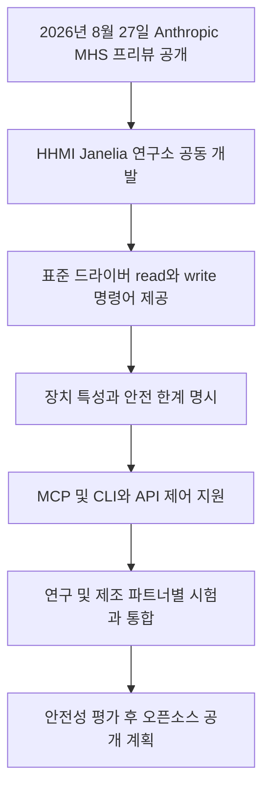

위 흐름도는 Anthropic이 발표한 Model Hardware Standard(MHS)의 핵심 작동 구조와 공개 계획을 보여줍니다.

2026년 8월 27일 Anthropic은 Claude가 로봇과 실험 장비를 제어하도록 돕는 Model Hardware Standard를 발표했습니다 <a href="#source-1" aria-label="Anthropic 공식 발표 출처">[1]</a>.

Anthropic은 MHS를 AI 에이전트가 물리 장비를 안전하게 운용하도록 돕는 공유 사양으로 소개했습니다. 이번 리서치 프리뷰에서는 현미경, 액체 처리 장비와 로봇 팔 등 여러 연구 및 제조 장비를 제어하는 사례가 공개됐습니다 <a href="#source-1" aria-label="Anthropic 공식 발표 출처">[1]</a>.

> **먼저 알아둘 용어**
>
> - **에이전트**: 사람이 단계마다 지시하지 않아도 스스로 여러 작업을 이어서 처리하는 AI입니다.
{: .prompt-info }

## 무슨 일이 벌어진 걸까?

2026년 8월 27일 Anthropic이 발표한 Model Hardware Standard는 AI가 실험 장비와 로봇 팔 같은 물리적 하드웨어를 탐색하고 직접 조작할 수 있게 해주는 공유 소프트웨어 사양입니다 <a href="#source-1" aria-label="Anthropic 공식 발표 출처">[1]</a>.

Model Hardware Standard는 줄여서 MHS라고 부르며, Anthropic과 하워드 휴즈 의학연구소(HHMI)의 자넬리아 연구 캠퍼스(Janelia Research Campus)가 협력하여 개발했습니다 <a href="#source-2" aria-label="Pharmaphorum 보도 출처">[2]</a>. MHS의 핵심 기술 원리는 아주 직관적입니다. 하드웨어 장비와 AI 사이에 기본 드라이버라는 연결 다리를 놓아주는 방식입니다. 이때 하드웨어를 제어하는 기본 명령어로 read(상태 읽기)와 write(제어 쓰기)라는 원시 명령어를 사용합니다 <a href="#source-2" aria-label="Pharmaphorum 보도 출처">[2]</a>.

MHS 드라이버에는 장치 특성을 자연어(사람이 일상에서 쓰는 언어) 태그로 기록할 수 있습니다. 이 태그를 바탕으로 장치가 무엇을 측정하고 조절할 수 있는지, 어떤 안전 한계를 적용할지를 담은 참조 파일이 만들어집니다 <a href="#source-1" aria-label="Anthropic 공식 발표 출처">[1]</a>. Anthropic은 로봇 팔의 무게처럼 코드만으로 알기 어려운 특성도 이 방식으로 에이전트에 전달할 수 있다고 설명합니다.

프로그래밍 가능한 인터페이스와 MHS 드라이버가 마련된 장비는 다양한 방식으로 제어할 수 있습니다. Anthropic이 만든 연동 규격인 MCP(Model Context Protocol, 모델이 외부 도구나 데이터베이스와 대화하기 위한 표준 규약)는 물론이고, 컴퓨터 명령어로 직접 지시하는 CLI(Command Line Interface, 명령줄 인터페이스)나 개발자가 프로그램 코드로 호출하는 코드 API(Application Programming Interface, 프로그램 간 상호작용 방식)를 지원합니다 <a href="#source-2" aria-label="Pharmaphorum 보도 출처">[2]</a>.

현재 이 기술은 연구실과 하드웨어 제조사를 대상으로 한 제한된 리서치 프리뷰 상태로 제공되고 있습니다. Anthropic은 추가 안전 평가와 운영 지침을 준비한 뒤 MHS 표준을 오픈소스(소스코드를 누구나 확인하고 활용할 수 있도록 공개하는 방식)로 공개할 계획입니다 <a href="#source-1" aria-label="Anthropic 공식 발표 출처">[1]</a>.

여러 기업과 연구기관이 서로 다른 단계에서 MHS를 시험하고 있습니다. Genentech, Carnegie Mellon University와 QuEra Computing은 초기 실험 사례를 공개했고, Doosan Robotics는 로봇 팔에서 MHS를 시험 중입니다. Universal Robots, AWS, Hugging Face와 Raspberry Pi는 각자 플랫폼이나 제품에서 지원 또는 통합을 추진하고 있습니다 <a href="#source-1" aria-label="Anthropic 공식 발표 출처">[1]</a>.

<figure class="news-source-image">
  
  <figcaption>pharmaphorum가 원문과 함께 공개한 이미지입니다. <a href="https://pharmaphorum.com/news/anthropic-ai-tool-conducts-physical-scientific-experiments" target="_blank" rel="noopener noreferrer">출처: pharmaphorum</a></figcaption>
</figure>

## 왜 지금 다들 이 이야기를 할까?

Anthropic이 문제로 지목한 것은 로봇과 연구 장비가 서로 다른 방식으로 통신하고, 장치 정보도 여러 문서와 작업자의 지식에 흩어져 있다는 점입니다.

지금까지 로봇이나 연구용 하드웨어를 AI 에이전트와 연결하려면 장비마다 별도의 번역 프로그램을 마련해야 했습니다. 제조업체마다 통신 방식이 다르고, 장비 특성에 관한 정보도 종이 매뉴얼, 사용자 컴퓨터 또는 작업자의 암묵지(말로 쉽게 설명하기 힘든 노하우나 감각)에 흩어져 있어 에이전트가 이를 일관된 형식으로 이해하기 어려웠습니다 <a href="#source-1" aria-label="Anthropic 공식 발표 출처">[1]</a>.

MHS는 이러한 통신 파편화와 안전 문제를 함께 다루려는 시도입니다. 장치마다 따로 흩어져 있던 특성, 조절 가능 항목과 안전 한계를 표준 참조 파일로 만들고, 에이전트가 장비를 제어하기 전에 이를 읽게 합니다. 다만 이 구조는 안전장치를 보강하는 수단이지 전문가 감독을 대체한다는 뜻은 아닙니다.

MHS는 장비마다 별도의 번역 프로그램을 만드는 통합 부담을 줄이려는 표준입니다. 다만 각 장비에는 프로그래밍 가능한 인터페이스와 MHS 드라이버가 필요합니다. 드라이버의 read 및 write 명령, 자연어 태그와 참조 정보가 마련되면 에이전트가 장비를 표준 형식으로 탐색하고 여러 작업을 조율할 수 있습니다. 이는 실물 AI(Physical AI, 물리적 환경에서 로봇이나 기계를 조작하는 인공지능)의 장비 연동 방식을 공통화하려는 초기 시도입니다.

## 그래서 우리에게 뭐가 달라질까?

실물 기계와 인공지능의 표준화된 연결은 실험 장비 통합 시간을 줄이고 산업용 로봇 활용 범위를 넓힐 가능성을 보여줍니다.

초기 사례에서 Genentech는 액체 처리 장비, 로봇 팔과 플레이트 리더를 연결한 단백질 분석 자동화 개념검증을 진행했고, Carnegie Mellon University는 여러 장비를 조율하는 연속 희석 실험을 시험했습니다. 다만 이는 초기 실험 사례이며, Anthropic은 Claude의 물리적 추론 한계 때문에 전문가 감독이 여전히 필요하다고 밝혔습니다 <a href="#source-1" aria-label="Anthropic 공식 발표 출처">[1]</a>.

산업 현장에서는 여러 로봇과 장비를 공통 인터페이스로 연결하는 시험이 진행되고 있습니다. Doosan Robotics는 로봇 팔의 자동 품질 보증과 다중 로봇 작업 조정을 시험 중이며, Universal Robots는 자사 로봇 플랫폼에 MHS 지원을 추가할 계획입니다 <a href="#source-1" aria-label="Anthropic 공식 발표 출처">[1]</a>.

Raspberry Pi는 Camera MHS Driver 시험을 마친 뒤 여러 제품에 MHS 통합을 추진하고 있습니다. 이는 소형 장치에서도 MHS를 적용할 가능성을 보여주지만, DIY 기기 전반에 대한 지원이 확인된 것은 아닙니다 <a href="#source-1" aria-label="Anthropic 공식 발표 출처">[1]</a>.

| 구분을 위한 항목 | 기존 방식 | MHS(Model Hardware Standard) 도입 방식 |
| --- | --- | --- |
| 장비 연동 방식 | 장비별 번역 프로그램과 드라이버 연결 | 표준화된 read 및 write 기본 드라이버로 탐색 |
| 안전 제어 방식 | 사람이 매뉴얼 확인 및 수동 가이던스 작성 | 장치 특성과 적용할 안전 한계를 자연어 태그로 기록 |
| 주요 제어 주체 | 사람의 직접 조작 또는 고정된 하드코딩 스크립트 | MCP, CLI, 코드 API 기반의 AI 에이전트 제어와 조율(전문가 감독 필요) |
| 제공 상태 및 대상 | 개별 장비 규격 및 맞춤형 연동 | 리서치 프리뷰 제공 후 오픈소스 공개 예정 |

## 그래서 내 업무에는 뭐가 달라지나

지금 단계에서 일반 직장인이나 크리에이터 독자가 당장 취할 행동은 없습니다.

Model Hardware Standard는 현재 과학 연구소, 로봇 제조업체, 하드웨어 개발사 대상의 제한된 리서치 프리뷰로 제공되고 있기 때문입니다 <a href="#source-1" aria-label="Anthropic 공식 발표 출처">[1]</a>. 일반 사무직이나 콘텐츠 제작 도구가 직접 적용 대상은 아니므로, 하드웨어 장비를 프로그래밍하지 않는 사용자가 지금 별도로 설정할 것은 없습니다.

다만 하드웨어 개발자, 연구원, 로봇 공학 실무자라면 다음과 같은 3가지 행동을 준비할 수 있습니다.

첫째, 기존 하드웨어 통신 방식을 read와 write 원시 명령어 구조로 정리하는 작업을 시작하세요. MHS는 장비의 상태를 조회하고 명령을 내리는 최소 단위 통신을 기반으로 하므로, 보유 장비의 API가 이러한 기본 읽기/쓰기 구조와 어떻게 연결될 수 있는지 점검하는 것이 유리합니다.

둘째, 장비가 측정하거나 조절할 수 있는 항목과 반드시 적용해야 할 안전 한계를 문서로 정리해 두세요. MHS는 이런 정보를 자연어 태그와 장치 참조 파일에 담는 구조이므로, 기존 매뉴얼에 흩어진 장치 특성을 먼저 구조화하면 향후 연동 범위를 판단하기 쉬워집니다.

셋째, 기존에 Anthropic이 공개한 MCP(Model Context Protocol) 연동 방식을 살펴보세요. MHS는 MCP를 통한 제어를 지원하므로, 소프트웨어 도구 연동 규격인 MCP의 기본 동작 원리를 이해하면 MHS의 하드웨어 연동 구조를 파악하는 데 도움이 됩니다.

## 아직은 선을 그어야 할 부분

MHS는 아직 제한된 리서치 프리뷰이며, 검증과 공개 과정에서 확인해야 할 한계가 남아 있습니다.

가장 먼저 고려해야 할 점은 MHS의 오픈소스 공개 시점이 아직 정해지지 않았다는 사실입니다. Anthropic은 추가적인 안전성 평가와 운영 지침을 준비한 뒤 이 표준을 오픈소스로 공개하겠다고만 밝혔을 뿐, 정확한 출시 날짜나 구체적인 일정표는 발표하지 않았습니다 <a href="#source-1" aria-label="Anthropic 공식 발표 출처">[1]</a>. 따라서 일반 개발자나 기업이 지금 당장 자유롭게 다운로드받아 전면적으로 적용할 수는 없습니다.

MHS는 아직 프로그래밍 인터페이스가 없는 하드웨어를 직접 지원하지 않습니다. Anthropic은 이런 장비를 위한 드라이버를 제조사와 함께 개발하고 있다고 밝혔으므로, 기존 장비가 API나 다른 제어 인터페이스를 제공하는지 먼저 확인해야 합니다 <a href="#source-1" aria-label="Anthropic 공식 발표 출처">[1]</a>.

마지막으로, MHS의 안전 한계 설정만으로 모든 물리적 사고를 막을 수 있다고 단정해서는 안 됩니다. Anthropic도 Claude의 공간 및 물리 추론에는 전문가 감독이 필요한 한계가 있다고 설명합니다 <a href="#source-1" aria-label="Anthropic 공식 발표 출처">[1]</a>. 이를 바탕으로 이 글에서는 실제 현장 검증 시 기존의 물리적 안전장치와 승인 절차를 유지하고 MHS를 추가 제어 계층으로 시험할 것을 권합니다.

<!-- primary-sources:start -->
## 원문과 버전 확인

- [발표 원문](https://www.anthropic.com/news/model-hardware-standard-research-preview)
- [pharmaphorum](https://pharmaphorum.com/news/anthropic-ai-tool-conducts-physical-scientific-experiments)
<!-- primary-sources:end -->

<!-- internal-links:start -->
## 함께 읽으면 이해가 이어지는 글

- [Claude for Legal이 법률 환각을 끝낼까: 출처, 권한, 승인 설계]() — Claude for Legal의 도구 연결 구조를 법률 검색, 문서 수정, 외부 전송으로 나눠 보고 환각, 권한, 감사 위험을 통제하는 기준을 정리합니다.
- [Firecrawl: 웹사이트를 LLM 전용 마크다운 데이터로 변환하는 오픈소스 웹 스크래퍼]() — Firecrawl은 복잡한 동적 웹사이트, PDF, 문서를 AI 모델이 바로 소비할 수 있는 깨끗한 마크다운과 구조화된 JSON 데이터로 변환해주는 오픈소스 웹 데이터 API입니다. JavaScript 렌더링, 프록시 순환, 노이즈…
- [클로드(Claude) 사용법: 프로젝트, PDF, Artifacts, Skills 실전 가이드]() — 무료 계정으로 프로젝트와 PDF 분석을 시험하고 Artifacts, Skills, 메모리, 공유 기능을 안전하게 활용하는 순서와 Pro 전환 기준을 정리합니다.
<!-- internal-links:end -->

## 자주 묻는 질문

### Anthropic의 Model Hardware Standard는 누구나 지금 바로 다운로드해서 쓸 수 있나요?

아니요, 2026년 8월 27일 발표된 MHS는 현재 일부 과학 연구실과 하드웨어 제조업체를 대상으로 한 제한된 리서치 프리뷰로만 제공되고 있습니다. Anthropic은 추가 안전 평가를 거친 뒤 MHS 표준을 오픈소스로 공개할 예정이지만, 정확한 공개 일정은 아직 발표되지 않았습니다.

### MHS는 로봇을 조작할 때 안전 한계를 어떻게 전달하나요?

MHS 드라이버는 장치 특성과 적용할 안전 한계를 자연어 태그로 기록하고, AI 에이전트가 이를 참고해 장비를 조작하게 합니다. 다만 Anthropic은 현재 Claude의 공간 및 물리 추론에 한계가 있어 전문가 감독이 계속 필요하다고 밝히고 있습니다.

### MHS를 활용해 물리 장비를 제어하려면 어떤 방식을 사용해야 하나요?

프로그래밍 가능한 인터페이스와 MHS 드라이버가 마련된 장비는 Model Context Protocol(MCP), 명령줄 인터페이스(CLI) 또는 코드 파일(API)을 통해 제어할 수 있습니다.

### Doosan Robotics나 Raspberry Pi 같은 외부 기업도 MHS를 지원하나요?

조직마다 단계가 다릅니다. Doosan Robotics는 로봇 팔에서 MHS를 시험 중이고 Universal Robots는 자사 플랫폼 지원을 계획하고 있습니다. AWS는 Strands Robots를 통한 지원을 준비하며, Hugging Face와 Raspberry Pi도 각각 LeRobot과 일부 제품에 통합을 추진 중입니다. Genentech, Carnegie Mellon University와 QuEra는 초기 실험 사례를 공개했습니다.

## 직접 확인한 원문

<ol class="checked-source-list">
  <li id="source-1"><a href="https://www.anthropic.com/news/model-hardware-standard-research-preview" target="_blank" rel="noopener noreferrer">Anthropic — Previewing the Model Hardware Standard</a> (2026-08-27)</li>
  <li id="source-2"><a href="https://pharmaphorum.com/news/anthropic-ai-tool-conducts-physical-scientific-experiments" target="_blank" rel="noopener noreferrer">pharmaphorum — Anthropic AI tool conducts physical scientific experiments</a> (2026-08-28)</li>
</ol>

> 이 글은 위 원문을 직접 확인해 작성했습니다. 가격, 기능 범위, 지역별 제공 여부는 게시 후 바뀔 수 있으니 실제 도입 전 공식 문서를 다시 확인하세요.
