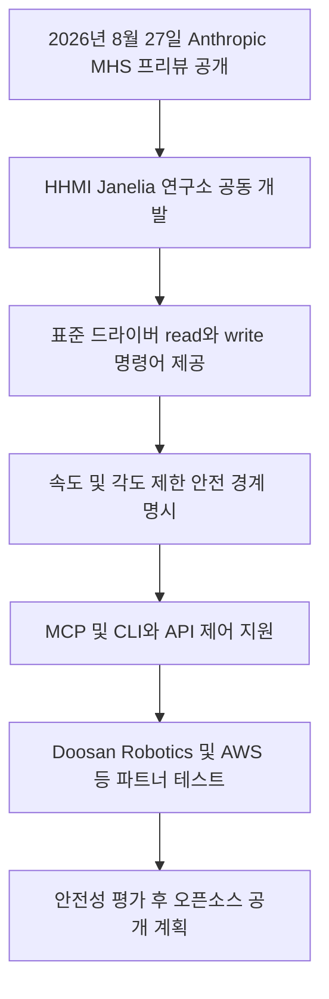

위 흐름도는 Anthropic이 발표한 Model Hardware Standard(MHS)의 핵심 연동 구조와 개발 절차를 보여줍니다.

2026년 8월 27일 Anthropic은 Claude가 로봇과 실험 장비를 직접 제어할 수 있는 Model Hardware Standard를 발표했습니다 <a href="#source-1" aria-label="Anthropic 공식 발표 출처">[1]</a>.

이 표준 규격은 인공지능이 실제 물리 세상의 기계들을 조작할 때 발생할 수 있는 사고를 막고 안전하게 작동하도록 돕기 위해 제작되었습니다. 지금까지는 AI가 소프트웨어 화면 안에서 글을 쓰거나 코드를 짜는 데 주로 머물렀다면, 이제는 직접 로봇 팔을 움직이거나 연구실 시험관을 다루는 영역으로 발을 넓히게 된 것입니다.

> **먼저 알아둘 용어**
>
> - **에이전트**: 사람이 단계마다 지시하지 않아도 스스로 여러 작업을 이어서 처리하는 AI입니다.
{: .prompt-info }

## 무슨 일이 벌어진 걸까?

2026년 8월 27일 Anthropic이 발표한 Model Hardware Standard는 AI가 실험 장비와 로봇 팔 같은 물리적 하드웨어를 탐색하고 직접 조작할 수 있게 해주는 표준 개방형 소프트웨어 사양입니다 <a href="#source-1" aria-label="Anthropic 공식 발표 출처">[1]</a>.

Model Hardware Standard는 줄여서 MHS라고 부르며, Anthropic과 하워드 휴즈 의학연구소(HHMI)의 자넬리아 연구 캠퍼스(Janelia Research Campus)가 협력하여 개발했습니다 <a href="#source-2" aria-label="Pharmaphorum 보도 출처">[2]</a>. MHS의 핵심 기술 원리는 아주 직관적입니다. 하드웨어 장비와 AI 사이에 기본 드라이버라는 연결 다리를 놓아주는 방식입니다. 이때 하드웨어를 제어하는 기본 명령어로 read(상태 읽기)와 write(제어 쓰기)라는 원시 명령어를 사용합니다 <a href="#source-2" aria-label="Pharmaphorum 보도 출처">[2]</a>.

이 사양이 도입되면 장비 제조사는 AI가 지켜야 할 안전 경계를 자연어(사람이 일상에서 쓰는 언어) 문서 형태로 작성해 장비에 등록할 수 있습니다 <a href="#source-1" aria-label="Anthropic 공식 발표 출처">[1]</a>. 예를 들어 로봇 팔의 최대 이동 속도나 관절이 회전할 수 있는 최대 각도 제한을 명확한 조건으로 적어둘 수 있습니다. AI는 장비를 작동하기 전에 이 문서를 읽고 허용된 범위 안에서만 명령을 수행합니다.

또한 MHS는 다양한 제어 방식을 지원합니다. 기존에 Anthropic이 만든 연동 규격인 MCP(Model Context Protocol, 모델이 외부 도구나 데이터베이스와 대화하기 위한 표준 규약)는 물론이고, 컴퓨터 명령어로 직접 지시하는 CLI(Command Line Interface, 명령줄 인터페이스)나 개발자가 프로그램 코드로 호출하는 코드 API(Application Programming Interface, 프로그램 간 상호작용 방식)를 통해서도 로봇을 움직일 수 있습니다 <a href="#source-2" aria-label="Pharmaphorum 보도 출처">[2]</a>.

현재 이 기술은 연구실과 하드웨어 제조사를 대상으로 한 제한된 리서치 프리뷰 상태로 제공되고 있으며, Anthropic은 안전성 검증 조사를 추가로 진행한 뒤 프레임워크 전체를 오픈소스(소스코드를 누구나 자유롭게 수정하고 쓸 수 있도록 공개하는 방식)로 완전히 전환할 계획입니다 <a href="#source-1" aria-label="Anthropic 공식 발표 출처">[1]</a>.

초기 테스트와 연동 개발에는 세계적인 기업과 연구기관들이 대거 합류했습니다. 제약 바이오 기업인 Genentech, 명문 연구 대학인 Carnegie Mellon University, 양자 컴퓨터 기업인 QuEra Computing을 비롯해 로봇 전문 기업인 Doosan Robotics와 Universal Robots가 참여하고 있습니다. 여기에 클라우드 기업인 AWS, AI 커뮤니티 플랫폼인 Hugging Face, 그리고 교육용 단판 컴퓨터 제조사인 Raspberry Pi까지 파트너 명단에 이름을 올렸습니다 <a href="#source-1" aria-label="Anthropic 공식 발표 출처">[1]</a>.

<figure class="news-source-image">
  
  <figcaption>pharmaphorum가 원문과 함께 공개한 이미지입니다. <a href="https://pharmaphorum.com/news/anthropic-ai-tool-conducts-physical-scientific-experiments" target="_blank" rel="noopener noreferrer">출처: pharmaphorum</a></figcaption>
</figure>

## 왜 지금 다들 이 이야기를 할까?

인공지능이 소프트웨어 모니터를 넘어 물리적 세계로 진출하기 위해서는 로봇과 기계를 통제할 일관되고 안전한 표준 통신 규칙이 필수적이기 때문입니다.

지금까지 로봇이나 연구용 하드웨어를 인공지능과 연결하려면 개발자가 장비마다 개별 프로그램을 새로 짜야 했습니다. 제조업체마다 통신 방식이 다르고 매뉴얼이 제각각이었기 때문입니다. 특히 과학 연구실이나 공장 지대에서는 작업자가 오랫동안 경험으로 쌓은 암묵지(말로 쉽게 설명하기 힘든 노하우나 감각)에 의존하는 경우가 많아서, AI가 장비를 잘못 조작할 경우 기계가 파손되거나 위험한 화학 물질이 유출되는 고장이 발생할 위험이 컸습니다.

MHS는 이러한 통신 파편화와 안전 문제를 한 번에 해결하려는 시도입니다. 인간이 매번 옆에서 매뉴얼을 설명하거나 감시하지 않아도, 기계 자체가 내 로봇 팔은 초당 30센티미터 이상 움직이면 안 되고 90도 이상 꺾이면 부러진다는 규칙을 AI에게 전달합니다. AI는 이 제약 조건 안에서만 행동하므로 비상 상황이나 원치 않는 돌발 행동을 막을 수 있습니다.

또한 개발자 입장에서도 개별 하드웨어용 전용 커스텀 코드를 일일이 작성할 필요가 사라집니다. 표준화된 read와 write 통신 표준만 맞추면 Claude 같은 AI 모델이 알아서 기계의 상태를 탐색하고 작업을 수행하기 때문입니다. 이러한 표준화 움직임은 실물 AI(Physical AI, 물리적 환경에서 로봇이나 기계를 조작하는 인공지능) 시대를 앞당기는 결정적인 계기가 될 수 있습니다.

## 그래서 우리에게 뭐가 달라질까?

실물 기계와 인공지능의 표준화된 연결은 신약 개발 속도를 높이고 산업용 로봇의 안전하고 손쉬운 도입을 가능하게 만듭니다.

과학 연구 분야에서는 바이오 및 화학 실험의 자동화 수준이 획기적으로 향상될 수 있습니다. 연구원이 밤새 실험실에 남아 반복적인 액체 투입이나 샘플 이동 작업을 하지 않아도, Claude 기반 에이전트가 MHS 규격을 통해 연구 장비를 정확하게 제어하며 실험을 수행할 수 있습니다. 이미 바이오 기업 Genentech이나 Carnegie Mellon University가 초기 파트너로 참여해 실제 연구실 물리 실험 자동화를 테스트하고 있습니다 <a href="#source-2" aria-label="Pharmaphorum 보도 출처">[2]</a>.

산업 현장과 제조 공장에서는 로봇 운용의 안전성과 편의성이 동시에 높아집니다. 한국의 Doosan Robotics나 글로벌 협동로봇 기업인 Universal Robots는 MHS 규격을 활용해 로봇 팔이 작업 공간에서 사람이나 다른 장비와 충돌하지 않도록 물리적 안전 경계를 사전에 자연어로 설정하고 제어할 수 있습니다 <a href="#source-1" aria-label="Anthropic 공식 발표 출처">[1]</a>.

소형 디바이스 개발 환경도 크게 넓어집니다. 싱글 보드 컴퓨터(단일 기판에 핵심 부품을 모두 탑재한 소형 컴퓨터)의 대명사인 Raspberry Pi가 파트너로 포함되어 있어, 거대한 산업용 로봇뿐만 아니라 작은 DIY 기기나 소형 자동화 장치에도 AI 제어 표준이 적용될 수 있습니다 <a href="#source-1" aria-label="Anthropic 공식 발표 출처">[1]</a>.

| 구분을 위한 항목 | 기존 방식 | MHS(Model Hardware Standard) 도입 방식 |
| --- | --- | --- |
| 장비 연동 방식 | 제조업체별 커스텀 드라이버 및 개별 프로그래밍 필수 | 표준화된 read 및 write 기본 드라이버로 탐색 |
| 안전 제어 방식 | 사람이 매뉴얼 확인 및 수동 가이던스 작성 | 장치 문서에 자연어로 속도 및 각도 경계 명시 |
| 주요 제어 주체 | 사람의 직접 조작 또는 고정된 하드코딩 스크립트 | MCP, CLI, 코드 API 기반의 AI 에이전트 자율 제어 |
| 제공 상태 및 대상 | 개별 사동 규격 및 맞춤형 연동 | 리서치 프리뷰 제공 후 오픈소스 공개 예정 |

## 그래서 내 업무에는 뭐가 달라지나

지금 단계에서 일반 직장인이나 크리에이터 독자가 당장 취할 행동은 없습니다.

Model Hardware Standard는 현재 과학 연구소, 로봇 제조업체, 하드웨어 개발사 대상의 제한된 리서치 프리뷰로 제공되고 있기 때문입니다 <a href="#source-1" aria-label="Anthropic 공식 발표 출처">[1]</a>. 일반 사무직 업무나 콘텐츠 제작 작업에는 직접적인 영향이 없으며, 하드웨어 장비를 직접 프로그래밍하지 않는 사용자는 별도의 조치를 취하지 않아도 됩니다.

다만 하드웨어 개발자, 연구원, 로봇 공학 실무자라면 다음과 같은 3가지 행동을 준비할 수 있습니다.

첫째, 기존 하드웨어 통신 방식을 read와 write 원시 명령어 구조로 정리하는 작업을 시작하세요. MHS는 장비의 상태를 조회하고 명령을 내리는 최소 단위 통신을 기반으로 하므로, 보유 장비의 API가 이러한 기본 읽기/쓰기 구조와 어떻게 연결될 수 있는지 점검하는 것이 유리합니다.

둘째, 장비의 안전 운영 규칙을 자연어 문서(Device Manifest) 형태의 조건문으로 정리해 두세요. 로봇의 이동 속도 한계, 관절 각도 제한, 최대 가열 온도 등 기계가 파손되지 않아야 하는 절대적 물리 한계를 문서화해 두면 향후 MHS 규격 적용 시 바로 활용할 수 있습니다.

셋째, 기존에 Anthropic이 공개한 MCP(Model Context Protocol) 연동 방식을 사전 학습해 두세요. MHS는 MCP 환경에서도 원활하게 동작하도록 설계되어 있으므로, 소프트웨어 도구 연동 규격인 MCP의 기본 동작 원리를 이해하고 있다면 하드웨어 제어 표준 도입 시 훨씬 빠르게 적응할 수 있습니다.

## 아직은 선을 그어야 할 부분

MHS가 로봇과 AI 결합의 중요한 이정표이지만, 아직 검증과 공개 과정에서 넘어야 할 현실적인 한계들이 명확히 존재합니다.

가장 먼저 고려해야 할 점은 MHS의 오픈소스 전환 시점이 아직 정해지지 않았다는 사실입니다. Anthropic은 추가적인 안전성 평가와 검증을 거친 뒤 이 프레임워크를 오픈소스로 공개하겠다고만 밝혔을 뿐, 정확한 출시 날짜나 구체적인 일정표는 발표하지 않았습니다 <a href="#source-1" aria-label="Anthropic 공식 발표 출처">[1]</a>. 따라서 일반 개발자나 기업이 지금 당장 자유롭게 다운로드받아 전면적으로 적용할 수는 없습니다.

또한 리서치 프리뷰 이후 MHS가 정식 상용화될 때 어떤 유료 가격 정책이나 상용 라이선스 조건이 적용될지에 대한 정보도 공개되지 않았습니다. 프레임워크 자체가 오픈소스로 풀리더라도 상용 서비스 연동이나 특정 엔터프라이즈 환경에서의 비용 구조는 별도로 발표될 가능성이 있습니다.

마지막으로, 물리 안전 경계 설정이 100퍼센트 실시간 사고 방지를 보장하는 것은 아닙니다. 자연어 기반의 장치 문서에 속도나 각도 제한을 명시하더라도, 물리적 기계의 마모나 돌발적인 전기적 고장까지 AI 소프트웨어가 완벽히 통제할 수는 없습니다. 따라서 실제 현장 도입 시에는 하드웨어 차원의 물리적 비상 정지 버튼이나 이중 안전장치를 함께 갖추는 지혜가 여전히 필요합니다.

<!-- primary-sources:start -->
## 원문과 버전 확인

- [발표 원문](https://www.anthropic.com/news/previewing-the-model-hardware-standard)
- [pharmaphorum](https://pharmaphorum.com/news/anthropic-ai-tool-conducts-physical-scientific-experiments)
<!-- primary-sources:end -->

<!-- internal-links:start -->
## 함께 읽으면 이해가 이어지는 글

- [Claude for Legal이 법률 환각을 끝낼까: 출처, 권한, 승인 설계]() — Claude for Legal의 도구 연결 구조를 법률 검색, 문서 수정, 외부 전송으로 나눠 보고 환각, 권한, 감사 위험을 통제하는 기준을 정리합니다.
- [Firecrawl: 웹사이트를 LLM 전용 마크다운 데이터로 변환하는 오픈소스 웹 스크래퍼]() — Firecrawl은 복잡한 동적 웹사이트, PDF, 문서를 AI 모델이 바로 소비할 수 있는 깨끗한 마크다운과 구조화된 JSON 데이터로 변환해주는 오픈소스 웹 데이터 API입니다. JavaScript 렌더링, 프록시 순환, 노이즈…
- [클로드(Claude) 사용법: 프로젝트, PDF, Artifacts, Skills 실전 가이드]() — 무료 계정으로 프로젝트와 PDF 분석을 시험하고 Artifacts, Skills, 메모리, 공유 기능을 안전하게 활용하는 순서와 Pro 전환 기준을 정리합니다.
<!-- internal-links:end -->

## 자주 묻는 질문

### Anthropic의 Model Hardware Standard는 누구나 지금 바로 다운로드해서 쓸 수 있나요?

아니요, 2026년 8월 27일 발표된 MHS는 현재 일부 과학 연구실과 하드웨어 제조업체를 대상으로 한 제한된 리서치 프리뷰로만 제공되고 있습니다. Anthropic은 추가 안전 평가를 거친 뒤 전체 프레임워크를 오픈소스로 공개할 예정이지만, 정확한 공개 일정은 아직 발표되지 않았습니다.

### MHS는 로봇을 조작할 때 파손이나 사고를 어떻게 방지하나요?

MHS는 장비 제조업체가 로봇의 이동 속도나 관절 각도 한계 같은 물리적 안전 경계를 자연어 문서로 명시하도록 지원합니다. AI 에이전트는 장비를 제어하기 전 이 문서를 읽고 허용된 안전 범위 안에서만 read 및 write 명령을 수행하여 돌발 사고를 예방합니다.

### MHS를 활용해 물리 장비를 제어하려면 어떤 방식을 사용해야 하나요?

Model Hardware Standard는 Anthropic의 Model Context Protocol(MCP)을 포함해 명령줄 인터페이스(CLI)와 코드 API 등 다양한 제어 방식을 지원합니다. 개발자는 표준화된 기본 드라이버를 통해 기존 개발 환경에 맞게 로봇이나 연구 장비를 제어할 수 있습니다.

### Doosan Robotics나 Raspberry Pi 같은 외부 기업도 MHS를 지원하나요?

네, Doosan Robotics와 Universal Robots, Raspberry Pi는 물론 AWS, Hugging Face, Genentech, Carnegie Mellon University, QuEra Computing 등이 MHS의 초기 테스트 및 통합 파트너로 참여하고 있습니다.

## 직접 확인한 원문

<ol class="checked-source-list">
  <li id="source-1"><a href="https://www.anthropic.com/news/previewing-the-model-hardware-standard" target="_blank" rel="noopener noreferrer">Anthropic — Previewing the Model Hardware Standard</a> (2026-08-27)</li>
  <li id="source-2"><a href="https://pharmaphorum.com/news/anthropic-ai-tool-conducts-physical-scientific-experiments" target="_blank" rel="noopener noreferrer">pharmaphorum — Anthropic AI tool conducts physical scientific experiments</a> (2026-08-28)</li>
</ol>

> 이 글은 위 원문을 직접 확인해 작성했습니다. 가격, 기능 범위, 지역별 제공 여부는 게시 후 바뀔 수 있으니 실제 도입 전 공식 문서를 다시 확인하세요.
