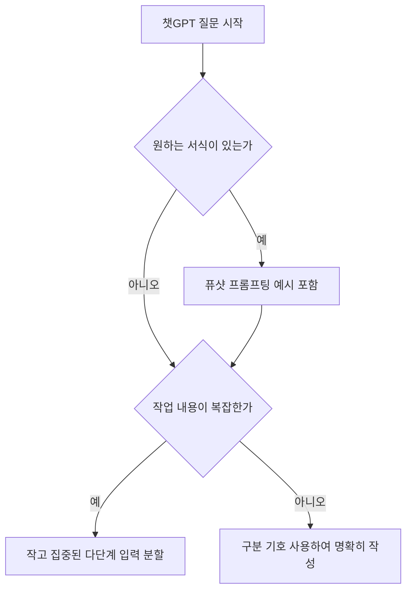

챗GPT에서 원하는 답변을 얻으려면 지시사항과 맥락 그리고 원하는 답변 형식을 명확하게 입력하면 됩니다.

인공지능을 사용할 때 원하는 결과를 얻지 못하는 주된 이유는 질문 방식이 모호하기 때문입니다. 막연한 명령어를 입력하면 인공지능이 맥락을 제대로 이해하지 못해 엉뚱한 답변을 출력하고 사용자의 시간을 허비하게 됩니다. 이 글은 검증된 모범 사례를 바탕으로 챗gpt 프롬프트 만들기 작성 원칙과 구체적 기법을 정리해 드립니다. 아울러 무료 사용법과 유료 요금제 사양을 비교하여 최적의 판단을 돕습니다.

> **먼저 알아둘 용어**
>
> - **프롬프트**: AI에게 건네는 지시문입니다. 같은 모델도 지시문에 따라 결과가 크게 달라집니다.
> - **LLM**: 엄청난 양의 글을 학습해 문장을 만들어 내는 대형 AI 모델입니다. ChatGPT 가 대표적입니다.
> - **API**: 다른 프로그램에서 이 기능을 불러다 쓸 수 있게 열어 둔 창구입니다.
{: .prompt-info }

## 챗gpt 프롬프트 만들기 기본 원칙과 세 가지 요소
OpenAI 도움말 센터에 따르면 프롬프트(Prompt)는 대형 언어 모델(LLM, 컴퓨터가 인간의 언어를 이해하고 자연스러운 문장으로 응답하도록 학습된 인공지능 시스템)에 대화를 시작하거나 모델의 응답을 유도하기 위해 입력하는 텍스트, 이미지, 오디오 형태의 입력값입니다. 인공지능과 효율적으로 대화하려면 프롬프트의 기본 개념과 구조적 원칙을 명확하게 파악하고 있어야 합니다. OpenAI 도움말에 따르면 챗GPT는 수십 개의 언어를 지원하며, 한국어를 포함한 다양한 언어로 질문 입력 및 답변 생성이 가능합니다. 한국어로 대화할 때도 이러한 입력 규칙을 동일하게 준수해야 원하는 결과를 정확하게 얻을 수 있습니다.

OpenAI가 권장하는 프롬프트 엔지니어링의 첫 번째 핵심 모범 사례는 모델이 목적을 빠르게 이해할 수 있도록 명확하고 구체적(clear and specific)으로 지시사항과 맥락, 톤, 스타일을 설정하는 것입니다. 단순하고 두뭉술한 지시 대신 작업의 배경이 되는 맥락 데이터를 함께 제공해야 합니다. 여기서 톤은 응답 문장의 어조나 분위기를 의미하고, 스타일은 글의 형식과 문체 및 서술 방식을 뜻합니다. 이 세 가지 요소가 구체적으로 제시될수록 모델이 사용자의 요구 사항을 오차 없이 정확하게 파악할 수 있습니다.

두 번째 모범 사례는 지시사항의 배치 위치와 구분 기호의 적극적인 활용입니다. OpenAI API 프롬프트 모범 사례에서는 지시사항을 프롬프트 시작 부분에 배치할 것을 권장합니다. 지시문이 텍스트 중간이나 끝에 위치하면 모델이 무엇을 처리해야 하는지 혼동할 수 있습니다. 또한 구분 기호인 ### 또는 """를 사용하여 지시사항과 텍스트 맥락(context)을 분명하게 분리할 것을 안내합니다. 프롬프트 맨 첫 줄에 구체적인 지시문을 두고, 그 바로 아래에 구분 기호를 입력한 후 참고할 데이터를 배치하면 인공지능이 지시사항과 본문 맥락을 완벽하게 구분하여 처리합니다.

세 번째 핵심 원칙은 원하는 응답 양식을 인공지능에게 직접 시각적으로 보여주는 것입니다. 모델이 원하는 출력 형식을 명확히 준수하게 하려면 퓨샷 프롬프팅(Few-shot prompting, 모델이 원하는 출력 형식을 따르도록 프롬프트 안에 실제 답변 형태의 예시를 직접 포함하여 보여주는 기법) 기법처럼 원하는 형태의 예시를 프롬프트에 직접 포함하여 보여주는 방법이 효과적입니다. 예시가 포함되면 모델은 제시된 패턴을 그대로 학습하여 사용자가 의도한 결과물 양식에 맞춰 완벽하게 응답을 생성합니다.



## 챗gpt 프롬프트 사용법과 템플릿 추천 활용법
실무 환경에서 길고 복잡한 작업을 수행할 때는 단 한 번의 프롬프트 작성으로 완벽한 대답을 얻기 어렵습니다. 복잡한 작업인 경우 프롬프트를 한 번에 크게 작성하기보다 작고 집중된 다단계 입력으로 나누어 처리해야 합니다. 그리고 이전 대화 결과를 바탕으로 수정하는 반복적 개선(iterative refinement, 이전 대화 결과를 바탕으로 답변을 조금씩 수정하고 보완하는 방식) 방식을 사용하는 것이 유리하다고 OpenAI 도움말 센터는 밝히고 있습니다. 인공지능과의 대화를 단발성 질문으로 끝내지 않고, 이전 응답을 검토하며 조금씩 답변을 보완해 나가는 과정이 필수적입니다.

업무 현장에서 바로 적용할 수 있는 챗gpt 프롬프트 추천 작성 템플릿 구조는 네 가지 단계로 구분할 수 있습니다. 첫 번째 단계는 인공지능의 역할을 설정하는 것입니다. 두 번째 단계는 프롬프트 시작 부분에 명확하고 구체적인 지시사항을 배치하는 것입니다. 세 번째 단계는 ### 또는 """ 기호를 활용하여 지시사항과 분석 대상 텍스트 데이터를 분리하는 것입니다. 네 번째 단계는 퓨샷 프롬프팅 방식을 적용하여 원하는 출력 양식 예시를 제공하는 것입니다. 이 순서대로 작성하면 인공지능이 맥락을 정확하게 파악합니다.

실제 챗gpt 프롬프트 사용법 예시로 보고서 요약 작업을 들 수 있습니다. 프롬프트 시작 부분에 "당신은 경영 컨설턴트입니다. 아래 제공된 텍스트를 바탕으로 주요 이슈 세 가지를 정리하세요."라는 지시사항을 입력합니다. 그 다음 구분 기호인 ### 문자를 넣고 분석할 원본 맥락 텍스트를 배치합니다. 마지막으로 원하는 출력 형태 예시를 작성해 주면 인공지능은 지시문과 맥락을 혼동하지 않고 정확한 보고서를 생성해 냅니다. 이 템플릿을 활용하면 문서 작성 시간이 크게 줄어듭니다.

다만 작성 시 반드시 주의해야 할 검수 과정이 존재합니다. 교육용 프롬프트 작성이나 실무용 자료 생성 시 OpenAI 가이드라인에 따르면 ChatGPT는 생성된 정보가 항상 정확하지 않을 수 있습니다. 인공지능은 그럴듯하지만 사실과 다른 내용을 출력할 가능성이 존재하므로, 사용자의 검수와 목적에 맞춘 수정 과정이 반드시 요구됩니다. 모델이 출력한 결과를 아무런 확인 없이 보고서나 외부 자료로 활용해서는 안 되며, 사용자가 직접 사실관계를 점검하고 보완하는 최종 검토 체계를 구축해야 합니다.

## 챗gpt 프롬프트 무료 이용과 유료 요금제 비교
올바른 작성법을 이해했다면 본인의 사용량과 조직 규모에 맞는 요금제를 선택해야 합니다. 현재 챗GPT는 챗gpt 프롬프트 무료 플랜부터 시작하여 보급형 유료 요금제, 상위 유료 플랜, 팀 단위 플랜까지 다양하게 제공되고 있습니다. 각 요금제마다 비용과 서비스 조건이 다르므로 사실에 기반하여 꼼꼼히 비교할 필요가 있습니다.

먼저 무료 플랜의 경우 챗gpt 프롬프트 무료 이용을 통해 기초적인 프롬프트 작성 연습과 간단한 질의응답을 진행할 수 있습니다. 하지만 무료 플랜 이용자의 분당 및 시간당 프롬프트 메시지 생성 제한 고정 수치는 공식적으로 공개되어 있지 않습니다. 따라서 제한 숫자에 대한 정보는 모르는 영역으로 남겨 두어야 합니다. 제한 수치를 임의로 판단하기보다는 무료 플랜을 먼저 이용하며 본인의 작업량을 확인하고, 메시지 생성 부족을 겪을 때 유료 전환을 고려하는 것이 안전합니다.

개인 사용자를 위한 유료 요금제는 두 가지로 나뉩니다. 개인 유료 플랜인 ChatGPT Plus의 가격은 월 $20입니다. 높지 않은 가격으로 정기적인 업무나 개인 학습에 활용하기에 적합합니다. 이에 더해 보급형 개인 유료 플랜인 Go 플랜은 월 ~$8 수준으로 제공됩니다. 비용 부담을 줄이면서 유료 플랜의 혜택을 이용하고 싶은 사용자에게 적합한 옵션입니다.

조직이나 회사에서 팀 단위로 이용하는 경우에는 ChatGPT Business 요금제(구 Team 플랜)를 선택할 수 있습니다. ChatGPT Business 요금제의 가격은 결제 방식에 따라 달라집니다. 연간 결제 시 사용자당 월 $20이며, 월간 결제 시 사용자당 월 $25의 비용이 발생합니다. 또한 가입 시 최소 2인(2 seats) 조건이 적용됩니다. 최소 2인 이상이 함께 가입해야 하므로 1인 개인 사용자는 가입 대상에서 제외된다는 점을 명확히 알아 두어야 합니다.

```chartjs
{
  "type": "bar",
  "data": {
    "labels": ["Go 플랜", "ChatGPT Plus", "Business 연간결제", "Business 월간결제"],
    "datasets": [{
      "label": "월 요금 달러",
      "data": [8, 20, 20, 25],
      "backgroundColor": ["#9aa5a1", "#2f9e8f", "#1d6f63", "#0d473f"]
    }]
  },
  "options": {
    "responsive": true
  }
}
```

아래 표는 확인된 요금 정보와 최소 가입 조건을 요약한 내용입니다.

| 요금제 명칭 | 월 결제 가격 | 최소 가입 조건 | 특이사항 |
| --- | --- | --- | --- |
| 무료 플랜 | $0 | 1인 | 메시지 생성 제한 수치 미공개 |
| Go 플랜 | 월 ~$8 | 1인 | 보급형 개인 유료 플랜 |
| ChatGPT Plus | 월 $20 | 1인 | 개인 유료 플랜 |
| ChatGPT Business | 연간 결제 시 사용자당 월 $20 / 월간 결제 시 사용자당 월 $25 | 최소 2인 이상 | 구 Team 플랜 |

## 그래서 내 업무에는 뭐가 달라지나
챗GPT 프롬프트를 실제 작성하고 요금제를 결정하려는 독자가 오늘 당장 수행해야 할 세 가지 구체적인 행동 가이드를 제시합니다.

첫째, 개인 사용자는 지금 바로 챗gpt 프롬프트 무료 플랜에 접속하여 지시사항 분리 작성법을 연습하세요. 프롬프트 최상단에 명확하고 구체적인 지시문을 작성하고, 구분 기호인 ### 또는 """를 사용하여 텍스트 맥락 데이터를 분리하는 입력을 실행하세요. 한 번에 대량의 지시를 내리지 말고, 작고 집중된 다단계 입력으로 나눈 뒤 이전 결과를 보완하는 반복적 개선 방식을 적용하세요.

둘째, 2인 이상의 소규모 팀이나 기업 조직이라면 조직 규모와 결제 방식을 고려하여 요금제를 선택하세요. 최소 2인 조건이 적용되는 ChatGPT Business 요금제는 연간 결제 시 사용자당 월 $20, 월간 결제 시 사용자당 월 $25로 운영됩니다. 팀 사용자가 아닌 1인 개인이라면 월 $20 수준의 ChatGPT Plus나 월 ~$8 수준인 Go 플랜 중 예산에 맞는 유료 옵션을 선택하는 것이 합리적입니다.

셋째, 업무에 활용할 인공지능 생성물에 대해 인간 작성자의 교정 및 검수 프로세스를 의무화하세요. OpenAI 가이드라인에 명시된 대로 챗GPT가 생성한 정보는 항상 정확하지 않을 수 있습니다. 답변이 생성되면 데이터의 정확성을 직접 확인하고 목적에 맞게 내용을 수정한 뒤 최종 업무 자료에 반영하세요.

<!-- internal-links:start -->
## 함께 읽으면 이해가 이어지는 글

- [챗GPT 요금제 추천 및 비교: 나에게 맞는 플랜 선택 가이드]() — 개인 작업은 무료 플랜이나 Plus를, 팀 협업과 보안이 필요하다면 Business 플랜이 적합합니다. 각 요금제별 정확한 가격 조건과 변경, 해지 절차를 안내합니다.
- [Reasoning LLM은 정말 인간처럼 생각할까: System 1, 2와 추론 성능을 구분하는 법]() — Reasoning LLM 설문 논문이 정리한 구조적 탐색, 보상 모델, 자기 개선, macro action, 강화 미세 조정을 살펴보고 ‘긴 답변’과 실제 추론을 구분하는 평가 기준을 정리합니다.
- [클로드 코드 가격과 요금제 비교 가이드 (2026년 기준)]() — 클로드 코드는 무료 플랜을 지원하지 않으며 월 20달러 Pro 구독 또는 API 종량제로 사용할 수 있습니다. 팀 단위 사용 시 Team Premium 요금제가 필요합니다.
<!-- internal-links:end -->

## 자주 묻는 질문

### 챗GPT 프롬프트 작성 시 구분 기호인 ### 또는 """는 왜 사용하나요?

지시사항과 참고할 텍스트 맥락을 명확하게 분리하기 위해 사용합니다. 지시문을 프롬프트 시작 부분에 두고 구분 기호로 분리하면 모델이 지시문과 본문을 혼동하지 않고 정확한 대답을 생성합니다.

### 챗GPT 생성 정보를 업무나 교육 자료로 사용할 때 주의할 점은 무엇인가요?

OpenAI 가이드라인에 따르면 챗GPT가 생성한 정보는 항상 정확하지 않을 수 있습니다. 따라서 모델이 답변을 생성한 후에는 사람이 직접 내용의 사실관계를 검수하고 목적에 맞게 수정하는 과정이 필수적입니다.

### 챗GPT 요금제 중 팀 단위 플랜의 가격과 가입 조건은 어떻게 되나요?

ChatGPT Business 요금제(구 Team 플랜)는 연간 결제 시 사용자당 월 $20, 월간 결제 시 사용자당 월 $25의 비용이 발생하며 가입 시 최소 2인(2 seats) 조건이 적용됩니다.

### 챗GPT 프롬프트 무료 플랜의 메시지 생성 제한 수치는 얼마인가요?

무료 플랜 이용자의 분당 및 시간당 프롬프트 메시지 생성 제한 고정 수치는 공식적으로 공개되어 있지 않아 알 수 없습니다.

## 직접 확인한 원문

- [OpenAI Help Center](https://help.openai.com/en/articles/10032626-prompt-engineering-best-practices-for-chatgpt) (2026-08-31 확인)
- [OpenAI Help Center](https://help.openai.com/en/articles/4936848-how-do-i-create-a-good-prompt-for-an-ai-model) (2026-08-31 확인)
- [OpenAI Help Center](https://help.openai.com/en/articles/6654000-best-practices-for-prompt-engineering-with-openai-api) (2026-08-31 확인)
- [OpenAI Help Center](https://help.openai.com/en/articles/8792828-what-is-chatgpt-business) (2026-08-31 확인)
- [OpenAI Help Center](https://help.openai.com/en/articles/8313929-how-can-educators-get-started-with-chatgpt) (2026-08-31 확인)
- [Beam Cloud](https://www.beam.cloud/blog/chatgpt-enterprise-pricing) (2026-08-31 확인)
- [AI and API Blog](https://aiandapi.com/blog/top-10-openai-and-chatgpt-faq) (2026-08-31 확인)

위 수치는 확인 시점 기준이며 예고 없이 바뀔 수 있습니다. 결정 전에 공식 페이지를 한 번 더 확인하시기 바랍니다.
