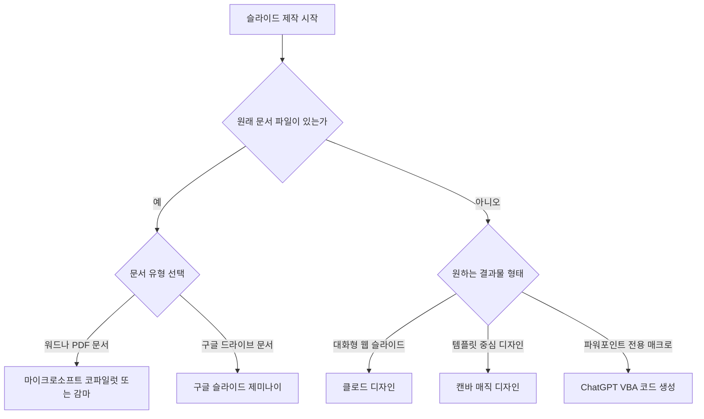

AI로 PPT를 만드는 가장 직관적인 방법은 보유한 원본 문서와 업무 환경에 따라 전용 도구를 선택하는 것입니다. 생성 목적에 맞는 사이트와 앱을 골라 적절한 작성 지시문(AI에게 원하는 결과를 얻기 위해 입력하는 명령어)을 입력하면 슬라이드 초안 작성을 몇 분 만에 마칠 수 있습니다.

많은 사용자가 디시인사이드 같은 커뮤니티나 검색창에서 ai ppt 만들기 추천 정보를 찾지만 어떤 플랫폼이 본인의 작업에 맞는지 혼란스러워합니다. 이 글에서는 감마, 제미나이, 클로드, 코파일럿, 캔바의 기능과 한계를 사실에 기반해 비교하고 상황별 최선의 선택을 정리해 드립니다.



> **먼저 알아둘 용어**
>
> - **프롬프트**: AI에게 건네는 지시문입니다. 같은 모델도 지시문에 따라 결과가 크게 달라집니다.
{: .prompt-info }

## 주요 AI PPT 만들기 사이트 및 앱 비교 분석

프레젠테이션 자동 생성 도구는 동작 방식과 편집 자유도에서 명확한 차이를 보입니다. 각 플랫폼의 핵심 기능을 정리하면 아래 표와 같습니다.

| 도구 명칭 | 주요 특징 및 기능 | 지원 파일 및 내보내기 | 요금 및 조건 |
| :--- | :--- | :--- | :--- |
| 마이크로소프트 코파일럿 (PowerPoint) | 텍스트 명령어 기반 슬라이드 생성, 최대 약 40,000자(words) 발표자료 요약 | Word(.docx), PDF (기업용 라이선스) 참조 | MS 365 및 코파일럿 라이선스 필요 |
| 캔바 (Magic Design) | 프롬프트 기반 슬라이드 디자인 초안 및 텍스트 자동 생성 | 웹 편집 후 PPTX, PDF 다운로드 가능 | Canva Pro 월 $15 (연 결제 시 $120/year), 월 500 크레딧 |
| 구글 슬라이드 제미나이 | 구글 드라이브 문서 참조(@ 지정), 기존 프레젠테이션 스타일 복제 | 구글 슬라이드 기본 레이아웃 빌드 | 다중 슬라이드 생성 프로모션 2026년 8월 1일 종료 |
| 감마 (Gamma) | 기존 문서 업로드 후 슬라이드 재구성 | PPTX, PDF, PNG 파일 내보내기 지원 | 최대 20MB 문서(PDF, DOCX, PPTX) 업로드 지원 |
| 클로드 디자인 (Claude Design) | 대화식 입력으로 인터랙티브 HTML 슬라이드 아티팩트 생성 | 웹 캔버스 상에서 실시간 수정 | Anthropic 서비스 요금제 기준 |
| VBA 코드 방식 (ChatGPT 활용) | 파워포인트용 VBA 코드를 작성하여 매크로 에디터로 자동 빌드 | PPTX 파워포인트 원본 파일 직접 생성 | 외부 AI 서비스 유료 결제 없이 파워포인트 내 실행 |

위 표에서 보듯이 각 ai ppt 만들기 사이트 및 ai ppt 만들기 앱 서비스는 사용자에게 제공하는 핵심 기능이 뚜렷하게 다릅니다. 파워포인트 프로그램을 직접 사용하는 환경이라면 마이크로소프트 코파일럿이나 VBA(Visual Basic for Applications, 파워포인트 내부 자동화 프로그래밍 언어) 코드 매크로 방식이 적합합니다. 웹 브라우저 기반 작업 환경을 선호한다면 감마나 캔바 또는 구글 슬라이드를 활용하는 편이 효율적입니다.

디자인 초안 생성을 원할 때 Canva의 Magic Design for Presentations 기능을 활용하면 입력한 텍스트 프롬프트를 기반으로 완성된 프레젠테이션 디자인 초안 템플릿과 텍스트 내용을 한 번에 자동 생성합니다. 캔바는 디자인 템플릿을 빠르게 구성해야 할 때 유용합니다.

반면 대화식으로 프롬프트를 조정하며 실시간 수정을 진행하고 싶다면 Anthropic의 Claude Design 기능이 뛰어납니다. 클로드 디자인 기능은 대화식 프롬프트 입력을 통해 인터랙티브 HTML 형태의 슬라이드 아티팩트(Artifacts, 생성된 결과물 창)를 생성하고 캔버스 상에서 실시간으로 디자인 및 텍스트를 수정할 수 있습니다.

작업의 목적에 따라 슬라이드 형태를 직접 제어해야 하는지 아니면 디자인 템플릿을 빠르게 받아볼 것인지 결정해야 합니다. 자신이 자주 사용하는 소프트웨어 생태계 안에서 선택하는 것이 가장 실용적인 접근법입니다.

## 기존 문서 활용과 프롬프트 작성 실전 방법

기존에 작성된 텍스트 문서가 있거나 새로운 ai ppt 자료 만들기 작업을 진행할 때는 도구별 문서 참조 방식과 프롬프트를 이해해야 합니다. 정확한 ai ppt 만들기 프롬프트 입력을 위해 구체적인 요구사항을 전달해야 원하는 슬라이드가 나옵니다.

기존 보고서나 자료가 이미 파일 형태로 준비되어 있다면 Gamma가 매우 강력한 성능을 발휘합니다. Gamma는 최대 20MB 용량의 PDF, DOCX, PPTX 등의 기존 문서를 업로드하여 슬라이드로 재구성할 수 있습니다. 슬라이드 재구성이 끝난 후 ai ppt 만들기 감마 서비스는 생성된 콘텐츠를 파워포인트(PPTX), PDF, PNG 이미지 파일 형식으로 내보내는 기능을 제공하므로 타 프로그램과의 호환성이 높습니다.

마이크로소프트 파워포인트 환경을 이용하는 분들은 Copilot in PowerPoint 기능을 통해 프롬프트 명령으로 새 슬라이드를 생성하거나 단일 Word(.docx) 또는 PDF 파일(기업용 라이선스 기준)을 참조하여 프레젠테이션을 자동 생성할 수 있습니다. 또한 Microsoft Copilot in PowerPoint는 긴 프레젠테이션의 주요 내용을 개조식(단어나 짧은 문장으로 항목을 정리하는 방식)으로 요약해주는 기능이 있으며, 최대 약 40,000자(words) 분량의 발표자료까지 요약 처리할 수 있습니다.

구글 생태계를 사용하는 경우 Google Slides의 Gemini를 적극 활용할 수 있습니다. Google Slides의 Gemini는 단일 프롬프트로 다중 슬라이드 프레젠테이션을 생성할 수 있으며, Google Drive 내 문서 참조(@ 지정) 및 기존 프레젠테이션의 스타일 복제가 가능하고 수정 가능한 기본 레이아웃으로 슬라이드를 빌드합니다. ai ppt 만들기 제미나이 방식을 사용하면 구글 드라이브 안의 텍스트를 손쉽게 슬라이드 구조로 가져옵니다.

대화형 아티팩트 방식을 원할 경우 ai ppt 만들기 클로드 기능을 접목할 수 있습니다. 웹 브라우저 상에서 실시간으로 디자인 요소를 수정하고 HTML 슬라이드를 즉시 구성하여 완성도를 높일 수 있습니다.

마지막으로 외부 웹 플랫폼 서비스를 이용하지 않고 파워포인트 전용 파일 생성을 원한다면 VBA 코드 방식을 사용합니다. ChatGPT나 LLM(대형 언어 모델, 인간의 언어를 이해하고 생성하는 인공지능)에 프레젠테이션 구조를 요청하여 파워포인트용 VBA 코드를 작성하게 한 후, 파워포인트의 매크로 에디터에서 코드를 실행하면 외부 AI 플랫폼 없이 슬라이드 형태를 자동 완성할 수 있습니다. 이 방법을 적용하면 깔끔한 ai ppt 파일 만들기 프로세스가 완성됩니다.

## 그래서 내 업무에는 뭐가 달라지나

AI 프레젠테이션 제작 기술을 업무에 적용하면 슬라이드 초안을 잡는 데 들어가는 시간을 대폭 줄일 수 있습니다. 독자는 자신이 처한 상황을 확인하고 오늘 바로 다음 세 가지 행동 중 하나를 선택해 실행하십시오.

1. **워드 문서나 PDF 파일 보고서를 프레젠테이션으로 전환할 때**:
Gamma 웹사이트 접속 후 최대 20MB 이하의 기존 문서를 업로드하여 자동으로 슬라이드를 재구성하거나, 마이크로소프트 기업용 라이선스를 사용 중이라면 PowerPoint 내 Copilot을 열고 단일 Word(.docx) 또는 PDF 파일을 참조 지정하여 새 슬라이드를 즉시 생성하십시오.

2. **구글 드라이브 문서를 기반으로 빠르게 슬라이드 초안을 제작할 때**:
Google Slides를 실행하고 Gemini 창을 연 다음 `@` 기호를 입력하여 Google Drive 내 문서를 직접 지정하십시오. 기존 프레젠테이션 스타일 복제 옵션을 선택하여 수정 가능한 기본 레이아웃 슬라이드를 생성하십시오.

3. **외부 AI 서비스 구독 결제 없이 파워포인트 원본 파일만 제작할 때**:
ChatGPT에 발표 주제와 슬라이드별 목차 구성을 입력하고 이를 파워포인트 매크로용 VBA 코드로 변환해 달라고 요청하십시오. 파워포인트 프로그램 내 매크로 에디터(Alt + F11)를 열어 해당 코드를 붙여넣고 실행하여 완성된 슬라이드 구조를 직접 빌드하십시오.


## 도구별 요금제 조건과 효율적인 무료 활용 전략

각 생성 도구마다 적용되는 비용 체계와 무료 조건이 서로 다릅니다. 지출 비용을 최소화하면서 ai ppt 만들기 무료 환경을 구축하려면 각 서비스의 조건과 제한 사항을 명확히 알아 두어야 합니다.

```chartjs
{
  "type": "bar",
  "data": {
    "labels": ["Canva Pro 월간 결제", "Canva Pro 연간 결제(월 환산)"],
    "datasets": [
      {
        "label": "월 비용 달러",
        "data": [15, 10],
        "backgroundColor": ["#2f9e8f", "#1d6f63"]
      }
    ]
  },
  "options": {
    "responsive": true
  }
}
```

디자인 템플릿과 AI 생성 기능을 결합한 Canva Pro 요금제는 $15/month 또는 연간 결제 시 $120/year 수준입니다. Canva Pro에 가입하면 Magic Write 및 Magic Media 등 AI 도구에 사용할 수 있는 크레딧을 월 500개 제공합니다. 디자인 퀄리티가 중요한 발표 자료를 자주 만든다면 월 크레딧 한도 내에서 유용하게 쓸 수 있습니다.

구글 워크스페이스 이용자라면 Gemini의 프로모션 기간을 주의해서 확인해야 합니다. Google Workspace 고객에게 제공되는 Google Slides 내 Gemini의 다중 슬라이드 자동 생성 한도 완화 프로모션은 2026년 8월 1일까지 유지되었습니다. 2026년 9월 1일 현재 시점에서는 표준 라이선스 기준 및 한도 정책에 맞춰 서비스가 제공되므로 사용량 관리가 필요합니다.

비용 지출 없이 순수 무료로 프레젠테이션 슬라이드를 빌드하는 가장 정석적인 방법은 LLM과 파워포인트 매크로를 조합하는 방법입니다. ChatGPT나 타 LLM 서비스를 이용해 파워포인트 전용 VBA 코드를 무료로 작성받은 뒤, 파워포인트 매크로 에디터에서 코드를 실행하면 유료 프레젠테이션 플랫폼 결제 없이 완벽한 슬라이드 구성을 자동 완성할 수 있습니다.

또한 Gamma를 사용할 경우 생성된 프레젠테이션 결과를 파워포인트(PPTX), PDF, PNG 이미지 파일 형식으로 언제든지 내보낼 수 있어 무료 체험 범위 내에서 타 유료 도구 못지않은 뛰어난 활용성을 확보할 수 있습니다.

<!-- internal-links:start -->
## 함께 읽으면 이해가 이어지는 글

- [클로드(Claude) 사용법: 프로젝트, PDF, Artifacts, Skills 실전 가이드]() — 무료 계정으로 프로젝트와 PDF 분석을 시험하고 Artifacts, Skills, 메모리, 공유 기능을 안전하게 활용하는 순서와 Pro 전환 기준을 정리합니다.
- [langchain-ai/openwiki: AI 코딩 에이전트 전용 저장소 위키가 필요한 이유와 작동 원리]() — LangChain이 공개한 OpenWiki는 AI 코딩 에이전트가 코드베이스를 정확히 이해하도록 돕는 마크다운 위키 자동 생성 도구입니다. 이 글에서는 프롬프트 비대화와 RAG의 한계를 극복하는 'LLM 위키' 패턴의 핵심 원리와…
- [ai-job-search: 클로드 코드로 나만의 맞춤형 구직 에이전트 구축하기]() — 클로드 코드(Claude Code)를 기반으로 공고 수집, 적합도 평가, 맞춤형 이력서 작성 등 구직 전 과정을 자동화하는 ai-job-search 프레임워크의 작동 원리와 실전 활용법을 깊이 있게 분석합니다.
<!-- internal-links:end -->

## 자주 묻는 질문

### AI로 PPT를 만들 때 기존 워드나 PDF 문서를 그대로 활용할 수 있나요?

마이크로소프트 코파일럿은 단일 Word나 PDF 문서를 참조하여 프레젠테이션을 생성하며, 감마는 최대 20MB 용량의 PDF, DOCX, PPTX 문서를 업로드하여 슬라이드로 재구성해 줍니다.

### 별도의 유료 AI 프레젠테이션 플랫폼 결제 없이 무료로 PPT 파일을 생성하는 방법은 무엇인가요?

ChatGPT 같은 LLM에 프레젠테이션 구조를 요청하여 파워포인트용 VBA 코드를 작성하게 한 후, 파워포인트 프로그램의 매크로 에디터에서 실행하면 외부 AI 결제 없이 원본 슬라이드를 완성할 수 있습니다.

### 구글 슬라이드의 제미나이 기능으로 기존 슬라이드 스타일을 그대로 복제할 수 있나요?

구글 슬라이드의 제미나이는 기존 프레젠테이션의 스타일 복제가 가능하며, 구글 드라이브 내 문서를 참조하여 수정 가능한 기본 레이아웃으로 다중 슬라이드를 생성합니다.

### 감마에서 만든 슬라이드는 어떤 파일 형식을 지원하나요?

감마에서 생성된 콘텐츠는 파워포인트(PPTX), PDF, PNG 이미지 파일 형식으로 내보내는 기능을 제공합니다.

## 직접 확인한 원문

- [Microsoft Support](https://support.microsoft.com/en-us/powerpoint/frequently-asked-questions-about-copilot-in-powerpoint) (2026-09-01 확인)
- [Microsoft Support](https://support.microsoft.com/en-us/powerpoint/copilot/summarize-your-presentation-with-copilot-in-powerpoint) (2026-09-01 확인)
- [Canva Help Center](https://www.canva.com/create/ai-presentations) (2026-09-01 확인)
- [Google Workspace Updates Blog](https://workspaceupdates.googleblog.com/2026/06/create-fully-native-and-editable-presentations-with-Gemini-in-Google-Slides.html) (2026-09-01 확인)
- [Anthropic Claude Academy](https://academy.claude.com/tutorials/using-claude-design-for-presentations-and-slide-decks) (2026-09-01 확인)
- [gamma ai review and pricing](https://gamma.design/es/blogs/info/gamma-ai-review-and-pricing) (2026-09-01 확인)
- [Orb](https://www.withorb.com/blog/canva-pricing) (2026-09-01 확인)
- [Machine Learning Mastery](https://machinelearningmastery.com/creating-a-powerpoint-presentation-using-chatgpt) (2026-09-01 확인)

위 수치는 확인 시점 기준이며 예고 없이 바뀔 수 있습니다. 결정 전에 공식 페이지를 한 번 더 확인하시기 바랍니다.
