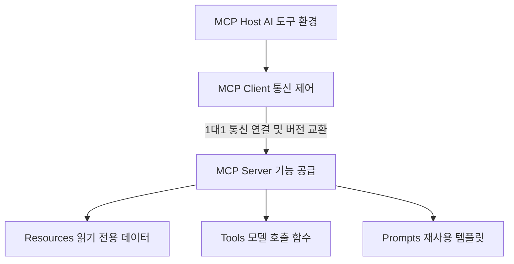
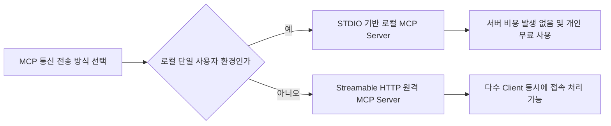

MCP 서버 만들기는 독자분의 데이터와 내부 기능을 AI 도구에 표준 규격으로 연결해 주는 서버 프로그램 개발 과정입니다. AI 모델과 외부 프로그램 사이에서 데이터를 주고받는 통신 방식을 직접 설계하려면 많은 시간이 들고 방향을 잡기 어렵습니다. 본 글에서는 MCP 아키텍처의 기본 개념부터 언어별 구축 전략과 무상 운영 조건까지 핵심 판단 기준을 정직하게 안내합니다.

> **먼저 알아둘 용어**
>
> - **프롬프트**: AI에게 건네는 지시문입니다. 같은 모델도 지시문에 따라 결과가 크게 달라집니다.
> - **오픈소스**: 소스 코드를 공개해 누구나 보고 고쳐 쓸 수 있게 한 것입니다. 조건은 라이선스마다 다릅니다.
{: .prompt-info }

## MCP 서버와 클라이언트 차이 및 핵심 아키텍처
MCP(Model Context Protocol, 모델 컨텍스트 프로토콜) 아키텍처는 전체 시스템을 3가지 주체로 깔끔하게 구분합니다. 3개의 주체는 MCP Host(호스트, 예: Claude Desktop이나 VS Code 같은 AI 실행 환경), MCP Client(클라이언트), 그리고 MCP Server(서버)입니다. 많은 독자분들께서 mcp 서버 와 클라이언트 차이 항목을 가장 헷갈려하십니다.

MCP Client는 AI 실행 환경인 Host가 직접 생성하여 가동합니다. Client는 특정 MCP Server와 1대1 통신 연결을 항상 유지하는 연결 관리자 역할을 맡습니다. Client는 전달받은 메시지를 분석하고 사용 중인 프로토콜 버전을 서로 맞추며 Server가 제공하는 기능을 찾아내어 실행 결과를 Host에 다시 전달하는 구체적인 통신 절차를 모두 책임집니다.

반대로 MCP Server는 외부 데이터와 실행 가능한 구체적 기능을 Client를 거쳐 Host에 공급하는 공급자 역할을 맡습니다. MCP Server가 Client에 제공할 수 있는 기본 기능 단위는 크게 3가지 형태가 있습니다.

첫째는 Resources(리소스, 데이터 원천)입니다. 읽기 전용으로 설정된 데이터나 파일 정보를 의미합니다. 둘째는 Tools(툴즈, 실행 함수)입니다. AI 모델이 직접 호출하여 실행 명령을 내릴 수 있는 구체적 함수입니다. 셋째는 Prompts(프롬프츠, 템플릿)입니다. 자주 반복해서 사용하는 대화형 프롬프트 양식을 재사용할 수 있게 템플릿 형태로 제공하는 기능입니다.

Model Context Protocol 오픈소스 프로젝트는 Anthropic(앤스로픽)에서 처음 아이디어를 내어 시작되었습니다. 2026년 9월 02일 기준 현재 해당 프로젝트는 리눅스 재단(The Linux Foundation) 산하의 Agentic AI Foundation(에이전틱 AI 재단) 프로젝트로 오픈소스 커뮤니티에서 통용되는 표준 규격으로 관리되고 있습니다. 이러한 역할 분리를 통해 개발자는 복잡한 통신 통로 구축 작업에 신경 쓰지 않고 Server 고유 기능 개발에 집중할 수 있습니다.

- MCP Host: Claude Desktop 및 VS Code처럼 AI가 동작하는 바탕 프로그램입니다.
- MCP Client: Host가 직접 생성하여 MCP Server와 1대1 통신을 연결하고 제어하는 통신 담당자입니다.
- MCP Server: 외부 데이터와 실행 함수 및 프롬프트 템플릿을 Client에 공급하는 실제 기능 구현체입니다.

## mcp 서버 만들기 python 및 자바 구현 가이드
mcp 서버 만들기 python 작업은 공식 개발 키트인 SDK(Software Development Kit, 소프트웨어 개발 키트)를 활용하면 빠르게 완성할 수 있습니다. Python 환경에서 공식 MCP Server를 구축할 때는 두 가지 필수 조건을 맞춰야 합니다. 실행 컴퓨터에 Python 3.10 이상 버전이 미리 설치되어 있어야 하며, official Python MCP SDK 2.0.0 이상 버전을 사용해야 합니다.

개발과 테스트 작업을 쉽게 진행할 수 있는 CLI(Command Line Interface, 명령 줄 인터페이스) 도구도 제공됩니다. 명령 창에서 pip install "mcp[cli]" 또는 uv add "mcp[cli]" 명령을 실행하여 설치할 수 있습니다. 설치가 완료된 후에는 mcp dev 및 mcp run 같은 표준 명령어를 활용하여 서버 동작을 실시간으로 확인하고 테스트할 수 있습니다.

Python 환경에서 표준 입출력 기반 MCP Server를 제작할 때 반드시 지켜야 하는 주의사항이 있습니다. 코드 내부에서 print() 함수를 호출하여 표준 출력(stdout)으로 문자열을 내보내면 통신용 JSON-RPC(제이슨 알피씨, 데이터 교환 형식) 데이터 규격이 깨지고 오염됩니다. 따라서 실행 기록이나 에러 로그를 남길 때는 반드시 표준 에러(stderr)로 출력되도록 설정된 logging 모듈을 사용하셔야 합니다.

한편 mcp 서버 만들기 자바 기술 환경도 생태계 지원을 통해 구현이 완료될 수 있습니다. MCP 공식 SDK는 커뮤니티 개발 완성도와 지속적인 유지보수 수준에 따라 단계별로 분류됩니다. TypeScript, Python, C#, Go, Rust SDK는 최우선 관리 등급인 Tier 1로 지정되어 최신 기능이 빠르게 업데이트됩니다. 반면 Java 및 Ruby SDK는 그 다음 관리 등급인 Tier 2로 분류되어 지속적인 확장 작업을 거치고 있습니다.

Java 환경에서 개발을 진행하는 분들은 공식 Java MCP SDK를 직접 호출하여 제작할 수도 있고, Spring AI Framework(스프링 AI 프레임워크)의 Boot Starter와 MCP 어노테이션 기법을 병행하여 구축할 수도 있습니다. 기존 구축된 자바 백엔드 시스템에 MCP Server 기능을 손쉽게 결합하려면 Spring AI Framework를 활용하는 것이 훨씬 효율적입니다.

| 구별 항목 | Python 개발 환경 | Java 개발 환경 |
| --- | --- | --- |
| 최소 사양 조건 | Python 3.10 이상 권장 | Java 17 이상 권장 |
| 공식 SDK 사양 | Official Python MCP SDK 2.0.0 이상 | Official Java MCP SDK 지원 |
| SDK 지원 티어 | Tier 1 (최상위 지원 등급) | Tier 2 (확장 개발 진행 등급) |
| 추천 개발 도구 | MCP CLI 패키지 (mcp dev, mcp run) | Spring AI Framework Boot Starter |
| 로그 출력 주의 | print() 금지 (stderr logging 사용) | SLF4J / Logback 에러 출력 설정 |

- Python 개발 환경: Python 3.10 이상 및 SDK 2.0.0 이상 조합 필수이며 print 대신 logging 모듈을 써야 통신 오류가 생기지 않습니다.
- Java 개발 환경: Tier 2 공식 SDK나 Spring AI Framework Boot Starter와 어노테이션을 활용해 기존 자바 시스템에 즉시 통합할 수 있습니다.

## mcp 서버 추천 전송 방식과 mcp 서버 무료 구성법
나에게 가장 어울리는 mcp 서버 추천 환경을 고르려면 서버 전송 유형과 실제 발생 비용을 객관적으로 비교해 보아야 합니다. 인터넷 커뮤니티에서 mcp 서버 추천 디시 관련 검색을 통해 타인의 의견을 알아보는 독자분들이 많이 계십니다. 그러나 특정 인터넷 커뮤니티 게시판의 실시간 추천 글이나 단순 선호 순위는 객관적으로 증명된 정보가 아닙니다. 커뮤니티의 검증되지 않은 소문에 의존하기보다는 제공되는 통신 규격 사양을 기준으로 선택하는 것이 가장 정직한 판단법입니다.

mcp 서버 무료 환경을 구성하고 싶다면 오픈소스 SDK 패키지와 로컬 단일 실행 구조를 조합하는 방향이 정답입니다. 이처럼 내 컴퓨터 안에서 단독 실행하면 별도의 네트워크 장비나 원격 클라우드 서버 이용료 없이 0원으로 구축이 가능합니다. MCP 통신 전송 방식은 크게 두 가지 유형으로 나눠집니다.

첫째는 STDIO(Standard Input Output, 표준 입출력) 전송 방식입니다. STDIO 방식을 취하는 로컬 MCP Server는 기본적으로 단일 MCP Client와 1대1로 직접 연결되어 작동합니다. 내 컴퓨터 내부에서만 동작하므로 외부 서버 호스팅 비용이 전혀 발생하지 않아서 개인 개발자나 단일 사용자가 무료로 쓰기에 가장 이상적입니다.

둘째는 Streamable HTTP(스트리밍 지원 웹 통신 규격) 전송 방식입니다. Streamable HTTP 방식을 사용하는 원격(Remote) MCP Server는 하나의 서버에 수많은 MCP Client가 동시에 연결되어 통신할 수 있는 다중 접속 구조를 지원합니다. 팀 단위 협업 환경이나 다수 사용자 대상의 원격 네트워크 서비스를 만들고자 한다면 원격 HTTP 방식을 선택해야 합니다.

- STDIO 로컬 전송: 단일 Client와 1대1로 엮이며 추가 비용이 없어 개인 무료 환경 구축에 가장 적합합니다.
- Streamable HTTP 원격 전송: 네트워크를 통해 다수 Client 접속을 한 번에 처리하므로 기업형 서비스 호스팅에 적합합니다.

## 그래서 내 업무에는 뭐가 달라지나
실제 개발 현장에 mcp 서버 사용법 기술을 도입하면 내부 데이터를 AI 모델에 안전하게 연결할 수 있어 업무 흐름이 단순해집니다. 아래 안내해 드리는 3가지 구체적 실행 지침 중 본인 상황에 맞는 항목을 선택하여 오늘 바로 작업을 시작해 보세요.

첫째, 개인 개발자로서 단일 PC 환경에서 빠르게 결과물을 확인하고 싶다면 Python 3.10 이상 환경을 가동하고 official Python MCP SDK 2.0.0 이상 버전을 설치하세요. command line 창에서 pip install "mcp[cli]" 명령어로 CLI 도구를 설치한 뒤 mcp dev 명령으로 로컬 테스트 환경을 엽니다. 이 때 반드시 print() 호출을 피하고 stderr 로깅 모듈을 적용해야 통신 장애가 발생하지 않습니다. 이 방식은 완전한 무료 구조입니다.

둘째, 기존 자바 서버 기반의 운영 환경을 유지한 채 AI 기능을 접목하고 싶다면 Spring AI Framework의 Boot Starter 패키지와 MCP 어노테이션 기법을 적용하세요. 현재 Java SDK는 Tier 2 등급으로 지속 업데이트 중이므로, Spring 프레임워크 생태계가 제공하는 통합 도구를 활용하면 백엔드 코드 연동에 드는 시간을 줄일 수 있습니다.

셋째, 사내 팀원 다수가 동시 접속해야 하는 공동 작업 도구를 제작하는 상황이라면 로컬 STDIO 통신 대신 Streamable HTTP 전송 유형으로 원격 MCP Server를 개설하세요. 로컬 STDIO는 단일 Client 전용이므로 다중 접속 시 한계가 명확하지만, Streamable HTTP 원격 서버 구조를 취하면 여러 통신 관리 요청을 효율적으로 처리해 줍니다.

<!-- internal-links:start -->
## 함께 읽으면 이해가 이어지는 글

- [OpenOSINT: AI와 결합된 차세대 오픈소스 정보 수집 에이전트의 작동 원리와 실전 활용법]() — 복잡한 명령어와 수동 데이터 연결의 피로도를 덜어주는 오픈소스 프로젝트 OpenOSINT의 내부 구조와 연동 기법을 깊이 있게 다룹니다.
- [OpenCut 아키텍처 가이드: AI가 영상을 편집하고 코드가 타임라인을 제어하는 방법]() — 비공개 상용 소프트웨어가 지배하던 영상 편집 시장에 등장한 완전히 새로운 대안, OpenCut 프로젝트를 조명합니다. 프라이버시를 보장하는 로컬 기반 아키텍처부터 시작해, Rust 코어 기반의 크로스플랫폼 통합, 플러그인 생태계…
- [Model Context Protocol: AI 에이전트가 외부 데이터와 소통하는 범용 인터페이스 작동 원리]() — Anthropic과 GitHub이 주도하는 오픈소스 프로젝트인 Model Context Protocol(MCP)의 탄생 배경, 클라이언트-서버 간 핵심 통신 아키텍처, 그리고 공식 저장소에서 제공되는 서버 구현체들의 작동 원리를 깊이…
<!-- internal-links:end -->

## 자주 묻는 질문

### MCP Client와 MCP Server의 가장 핵심적인 차이는 무엇인가요?

MCP Client는 Host가 생성하여 특정 MCP Server와 1대1 통신을 유지하고 메시지 파싱 및 버전 교환을 담당하는 관리자입니다. 반면 MCP Server는 Resources(읽기 데이터), Tools(실행 함수), Prompts(템플릿)라는 3가지 기능을 Client에 제공하는 주체입니다.

### Python으로 STDIO 기반 MCP Server를 만들 때 print() 함수를 쓰면 안 되는 이유는 무엇인가요?

STDIO 전송 방식은 표준 출력(stdout) 통로로 JSON-RPC 메시지를 전달합니다. print()를 사용해 일반 메시지를 stdout으로 내보내면 표준 데이터 형식 규격이 오염되므로, 표준 에러(stderr)로 내보내는 logging 모듈을 써야 합니다.

### Java 개발 환경에서도 MCP Server를 손쉽게 구축할 수 있나요?

네, 가능합니다. 공식 Java MCP SDK 외에도 Spring AI Framework의 Boot Starter 및 MCP 어노테이션 기법을 활용하면 기존 자바 서비스 코드와 손쉽게 결합하여 MCP Server를 구축할 수 있습니다.

### MCP Server를 비용 발생 없이 완전 무료로 운용하려면 어떤 방식을 써야 하나요?

오픈소스 SDK를 설치한 뒤 STDIO 전송 방식의 로컬 MCP Server로 실행하면 됩니다. 로컬 환경에서 단일 Client와 1대1로 연결되므로 클라우드 호스팅이나 별도 서버 유지 비용 없이 무료로 활용할 수 있습니다.

## 직접 확인한 원문

- [Model Context Protocol Architecture Overview](https://modelcontextprotocol.io/docs/2026-07-28/learn/architecture) (2026-09-02 확인)
- [Model Context Protocol Documentation](https://mcpblog.org/mcp-client-vs-server-vs-host) (2026-09-02 확인)
- [Model Context Protocol Build an MCP Server](https://modelcontextprotocol.io/docs/2026-07-28/develop/build-server) (2026-09-02 확인)
- [Model Context Protocol SDKs Overview](https://modelcontextprotocol.io/docs/2026-07-28/sdk) (2026-09-02 확인)
- [Spring AI Reference Documentation](https://docs.spring.io/spring-ai/reference/api/mcp/mcp-overview.html) (2026-09-02 확인)
- [modelcontextprotocol/python-sdk GitHub Repository](https://github.com/modelcontextprotocol/python-sdk) (2026-09-02 확인)
- [Implementing an MCP Server in Java - Medium](https://medium.com/@boni.gg/implementing-an-mcp-server-in-java-4a08c509ee7f) (2026-09-02 확인)

위 수치는 확인 시점 기준이며 예고 없이 바뀔 수 있습니다. 결정 전에 공식 페이지를 한 번 더 확인하시기 바랍니다.
