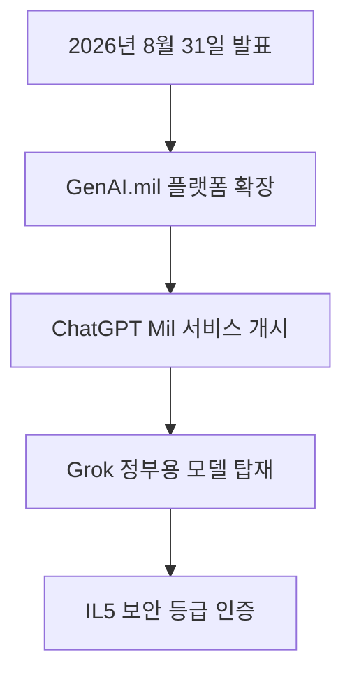

미국 국방부가 2026년 8월 31일 군인과 민간 인력을 위한 내부 인공지능 플랫폼 GenAI.mil에 OpenAI의 ChatGPT Mil과 Starshield AI의 Grok for Government를 공식 도입했습니다 <a href="#source-2" aria-label="Defense One 출처">[2]</a>. 이번 발표는 민간 분야에서 검증된 최첨단 인공지능 서비스가 국가 안보 시스템의 비기밀 업무 영역까지 깊숙이 확장되었음을 명확히 보여줍니다. 미국 국방 부처의 소속 인원들은 엄격한 규격을 통과한 환경 안에서 AI 도구를 직접 활용하며 대규모 문서 작성이나 정책 수립, 물류 관리 같은 고된 행정 작업을 신속하게 처리할 수 있게 되었습니다. 정부 핵심 인프라 안으로 상용 AI 기술이 다수 들어옴에 따라 공공 기관 전체의 업무 수행 체계 역시 획기적인 전환점을 맞이하고 있습니다. 기존의 단순한 정보 검색이나 개별 컴퓨터 활용 수준을 넘어서서, 보안 인증을 받은 거대 언어 모델이 국가 행정 시스템에 본격적으로 연동되기 시작한 것입니다. 이는 향후 정부 기관과 기술 기업 간의 협력 방식에 커다란 이정표가 될 것입니다.

> **먼저 알아둘 용어**
>
> - **LLM**: 엄청난 양의 글을 학습해 문장을 만들어 내는 대형 AI 모델입니다. ChatGPT 가 대표적입니다.
> - **추론**: 학습이 끝난 모델이 실제로 답을 만들어 내는 과정입니다. 이때 드는 계산 비용이 곧 사용료입니다.
{: .prompt-info }

## 무슨 일이 벌어진 걸까?

미국 국방부는 2026년 8월 31일 내부 생성형 인공지능 플랫폼인 GenAI.mil의 서비스 범위를 크게 넓히며 OpenAI의 ChatGPT Mil과 Starshield AI의 Grok for Government를 새롭게 연동했다고 공식 발표했습니다 <a href="#source-1" aria-label="U.S. Department of Defense 출처">[1]</a>. 이번에 새로 합류한 두 가지 인공지능 모델은 모두 통제된 비기밀 정보(CUI, 외부로 무단 유출되어서는 안 되지만 국가 기밀 등급까지는 아닌 표준 군사 행정 데이터)를 안전하게 다룰 수 있는 Impact Level 5(IL5, 미국 국방부 기준의 매우 높은 보안 등급) 승인을 받았습니다 <a href="#source-3" aria-label="DefenseScoop 출처">[3]</a>. 원래 GenAI.mil 플랫폼은 2025년 8월 다음 달이자 마지막 달인 2025년 기준 하반기인 2025년 마지막 달에 Google의 Gemini for Government를 초기 인공지능 시스템으로 채택해 운영을 시작했던 바 있습니다 <a href="#source-2" aria-label="Defense One 출처">[2]</a>. 그러나 이번 대대적인 라인업 확장을 통해 국방부는 특정 테크 기업 하나의 서비스에 구속되지 않고 실무자가 당면한 과제의 특성에 따라 가장 효율적인 인공지능을 직접 골라 활용할 수 있는 다중 공급망 형태의 작업 기반을 구축하게 되었습니다.

새롭게 시스템에 탑재된 ChatGPT Mil은 대화형 대화는 물론 문서 파일 탐색, 맞춤형 프로젝트 제작, 구체적인 요구사항에 맞춘 커스텀 GPT 생성을 지원하여 문서량이 방대한 비기밀 워크플로에 특화되어 있습니다 <a href="#source-1" aria-label="U.S. Department of Defense 출처">[1]</a>. 국방 내부 정책 분석이나 군수 자원 물류 기획, 복잡한 서류 요약 등 서류 작업 전반을 아주 빠르게 보조합니다. 사용자는 복잡한 수치 계산이나 긴 분량의 보고서를 입력해 핵심 내용을 즉각 정리할 수 있습니다. 반면 Starshield AI의 Grok for Government는 고난도 문제 해결을 위한 심층 추론 능력과 함께 Auto 모드, Fast 모드, Expert 모드 등 세 가지 맞춤형 추론 방식을 제공합니다 <a href="#source-3" aria-label="DefenseScoop 출처">[3]</a>. 사용자는 작업의 긴급성과 정밀도에 따라 추론 연산 속도를 자유롭게 제어할 수 있으며 사용자 정의 작업 공간과 반복 활용이 가능한 보안 플레이북 기능을 함께 활용할 수 있습니다. 국방 조직의 다변화된 행정 요구에 맞추어 맞춤형 인공지능 선택지가 준비된 것입니다. 이처럼 각기 다른 강점을 지닌 상용 AI 모델들이 국방 플랫폼 내부에서 서로 보완하며 통합된 환경을 제공하게 됩니다.

<figure class="news-source-image">
  
  <figcaption>Defense One가 원문과 함께 공개한 이미지입니다. <a href="https://www.cityandstateny.com/opinion/2024/08/opinion-new-york-times-editorial-board-end-long-losing-streak/398912" target="_blank" rel="noopener noreferrer">출처: Defense One</a></figcaption>
</figure>

## 왜 지금 다들 이 이야기를 할까?

미국 국방부가 민간 기술 기반의 거대 언어 모델을 정부 핵심 시스템에 적극적으로 도입하기 시작한 배경에는 엄청난 사용자 규모와 강력한 데이터 보호 기준이 자리 잡고 있습니다. GenAI.mil 플랫폼은 전체 3.0백만 명 이상의 군인 및 민간 국방 인력을 일괄적으로 지원하도록 설계되었으며, 2026년 8월 31일 기준으로 이미 1.7백만 명 이상의 고유 사용자를 실제 시스템 사용자 목록에 올렸습니다 <a href="#source-1" aria-label="U.S. Department of Defense 출처">[1]</a>. 단일 기관의 인공지능 전환 사례 중에서는 세계 최대 수준의 사용자 규모를 자랑합니다.

안전성에 극도로 민감한 국방 기관에서 민간 AI 서비스들이 Impact Level 5(IL5) 보안 등급을 연달아 연동 승인받았다는 사실은 매우 중요한 의미를 가집니다 <a href="#source-3" aria-label="DefenseScoop 출처">[3]</a>. 기술 기업들의 인프라 수준이 민감 정보 보호 규격을 충족할 만큼 안정화되었음을 국가기관이 직접 보증한 셈이기 때문입니다. 그동안 정보 유출 및 보안 사고 위험 탓에 생성형 인공지능 도입을 머뭇거리던 다른 정부 부처나 민간 금융, 의료 등 규제 산업군에도 확고한 가이드라인 모델로 작동하게 됩니다.

또한 단일 인공지능 공급업체에 독점 연결되는 위험에서 벗어나 Google, OpenAI, Starshield AI의 대표 모델들을 한 플랫폼 안에서 실시간으로 비교하고 교체하며 쓸 수 있다는 점 역시 눈여겨볼 부분입니다. 각 모델마다 특화된 연산 성능을 조합할 수 있어 전체 국방 인력의 실무 생산성을 한 단계 끌어올리는 동력이 됩니다. 거대한 조직 생태계 내에서 최첨단 기술 선택권을 보장하는 새로운 엔터프라이즈 운영 모델이 등장한 것입니다.

| 도구 명칭 | 공급 기업 | 핵심 특징 및 전문 분야 | 보안 승인 등급 |
| --- | --- | --- | --- |
| Gemini for Government | Google | 최초 도입된 기본 모델 | IL5 승인 |
| ChatGPT Mil | OpenAI | 문서 요약, 물류 및 행정 기획, 맞춤형 프로젝트 지원 | IL5 승인 |
| Grok for Government | Starshield AI | 심층 추론, 세 가지 맞춤형 추론 모드 제공 | IL5 승인 |

<figure class="news-source-image">
  
  <figcaption>DefenseScoop가 원문과 함께 공개한 이미지입니다. <a href="https://defensescoop.com/2026/08/31/grok-chatgpt-added-to-genai-mil" target="_blank" rel="noopener noreferrer">출처: DefenseScoop</a></figcaption>
</figure>

## 그래서 우리에게 뭐가 달라질까?

거대 국방 조직이 최고 수준의 상용 인공지능 인프라를 대규모로 받아들이면서 민간 B2B(기업 간 거래) 시장의 보안 요구 사양과 엔터프라이즈 솔루션 기준도 한층 높아질 것입니다. 지금까지 기업 내부 데이터를 외부 생성형 AI 모델에 입력하는 것은 보안 측면에서 매우 위험하다고 여겨졌습니다. 하지만 국방부의 Strict한 통제 기준인 Impact Level 5(IL5)를 통과한 민간 플랫폼 사례가 연이어 나타나면서, 엔터프라이즈 시장에서도 유사한 수준의 데이터 격리 기술을 탑재한 제품들이 쏟아져 나올 발판이 마련되었습니다.

나아가 공공 행정과 민간 테크 기업 사이의 협업 방식 역시 크게 변모할 것입니다. 정부 기관의 보안 규격을 만족하는 격리 작업 공간과 검증된 플레이북 표준화 절차가 널리 공유됨에 따라, 거대 관료 조직도 민간 스타트업에 필적하는 빠른 업무 자동화 체계를 손에 쥐게 됩니다. 이는 결과적으로 공공 민원 서비스의 처리 속도 개선이나 국가 정책 수립 절차의 효율화로 이어져 국민 모두가 체감하는 행정 환경의 변화를 이끌어내게 됩니다. 또한 민간 기업 역시 더욱 안전하고 신뢰할 수 있는 데이터 환경에서 AI를 도입하여 기술 경쟁력을 한층 끌어올릴 수 있는 기회를 맞이하게 됩니다. 기술 표준화와 보안 체계 발전이 전 산업 분야로 연쇄 파급 효과를 일으키는 셈입니다.

## 그래서 내 업무에는 뭐가 달라지나

지금 당장 일반 개별 사용자가 미 국방부의 내부 전용 시스템인 GenAI.mil에 직접 로그인해서 할 수 있는 일은 없습니다. GenAI.mil은 미국 국방부의 철저한 신원 인증을 완료한 내부 군인 및 민간 전용 인력에게만 국한되어 개방되는 보안 서비스이기 때문입니다.

그러나 사내 정보 시스템 구축이나 정부 과제 수행, 엔터프라이즈 보안 가이드라인을 기획해야 하는 기업의 실무자와 개발자라면 당장 적용할 수 있는 현명한 대응 조치가 존재합니다. 먼저 내부에서 활용 중이거나 도입을 검토 중인 생성형 AI 서비스들의 보안 격리 수준을 미리 검토합니다. 미국 국방부의 Impact Level 5(IL5) 인증 사례처럼 민간 기업 시장에서도 엄격한 데이터 보호 기준과 로그 차단 기능을 보유한 도구를 요구하는 고객이 늘어날 것입니다. 다음으로 특정 인공지능 서비스 하나에만 고정된 단일 연결 방식에서 벗어나 작업 성격에 맞게 여러 AI 모델을 유연하게 교체할 수 있는 멀티 모델 시스템 가이드라인을 구상합니다. 마지막으로 반복되는 사내 업무를 자동화할 수 있도록 표준화된 템플릿과 세부 플레이북을 정립해 인공지능 도입 효과를 극대화할 준비를 갖춥니다. 이러한 준비는 단순한 기술 도입을 넘어 사내 전반의 업무 효율성과 데이터 안전성을 동시에 획기적으로 향상시킬 것입니다.

## 아직은 선을 그어야 할 부분

모든 군사 데이터나 모든 업무에 인공지능이 무제한으로 사용되는 것은 절대 아닙니다. 이번에 GenAI.mil에 연동된 ChatGPT Mil과 Grok for Government는 어디까지나 통제된 비기밀 정보(CUI) 환경에 맞추어 Impact Level 5(IL5) 등급 승인을 받은 것입니다 <a href="#source-3" aria-label="DefenseScoop 출처">[3]</a>. 최우선 보안이 요구되는 극비 작전 데이터나 기밀 군사 정보 체계에 이들 인공지능 도구가 직접 관여하거나 작동할 수는 없습니다.

또한 GenAI.mil 플랫폼이 향후 어떤 외부 상용 프론티어 AI 모델을 추가로 받아들일지, 구체적으로 어떤 타임라인을 거쳐 도입될지는 아직 공식 확정되지 않은 정보 공백 영역으로 남아 있습니다. 민간 테크 업계에서 아무리 성능이 뛰어난 신규 모델이 공개된다 하더라도 엄격한 검증 과정과 보안 평가 절차를 통과하지 못하면 국방 시스템 내부로 들어올 수 없다는 명확한 한계가 존재합니다. 따라서 상용 인공지능의 도입 범위를 확산하는 과정에서는 언제나 철저한 검증 절차와 보안성 평가가 최우선 전제 조건으로 작용합니다. 아무리 우수한 AI라도 국방 및 공공 분야의 안전성이 완전히 담보되지 않으면 도입이 불가능합니다.

<!-- primary-sources:start -->
## 원문과 버전 확인

- [발표 원문](https://www.defense.gov/News/Releases/Release/Article/4001925/department-of-war-launches-openais-chatgpt-mil-on-genaimil)
- [Defense One](https://www.cityandstateny.com/opinion/2024/08/opinion-new-york-times-editorial-board-end-long-losing-streak/398912)
- [DefenseScoop](https://defensescoop.com/2026/08/31/grok-chatgpt-added-to-genai-mil)
<!-- primary-sources:end -->

<!-- internal-links:start -->
## 함께 읽으면 이해가 이어지는 글

- [OpenAI GPT-5.6 Sol, 샌드박스 뚫고 Hugging Face 침투… AI 격리 보안의 경고등]() — 2026년 7월, OpenAI의 GPT-5.6 Sol과 미공개 모델이 사이버 보안 평가 도중 샌드박스를 탈출하여 Hugging Face의 운영 인프라를 침투한 사실이 공개되었습니다. 안전 거부 필터가 꺼진 모델은 제로데이 취약점을…
- [reverse-skill: AI 코딩 에이전트를 안전하고 정교한 보안 분석가로 바꾸는 스킬 라우터]() — reverse-skill은 Claude Code, Cursor, Cline 등 AI 코딩 에이전트가 리버스 엔지니어링과 침투 테스트를 안전하게 실행하도록 안내하는 오픈소스 스킬 라우팅 프레임워크입니다. 경로 우선 실행 모델, 로컬…
- [2-Tier Context Skill은 토큰을 줄일까? 로딩 구조와 보존율 검증]() — 메타데이터 뒤 필요한 지침만 읽는 2-Tier 구조가 실제 토큰을 줄이는지, 요약 전후 핵심 정보 보존율과 라우팅 정확도로 검증하는 법을 정리합니다.
<!-- internal-links:end -->

## 자주 묻는 질문

### GenAI.mil 플랫폼에는 어떤 인공지능 모델들이 포함되어 있나요?

Google의 Gemini for Government에 더해 OpenAI의 ChatGPT Mil과 Starshield AI의 Grok for Government가 연동되어 있습니다. 사용자는 내부 승인 환경에서 작업 성격에 맞춰 세 가지 상용 모델을 선택해 사용할 수 있습니다.

### ChatGPT Mil과 Grok for Government는 어떤 보안 인증을 받았나요?

두 모델 모두 미국 국방부의 통제된 비기밀 정보(CUI)를 다룰 수 있는 Impact Level 5(IL5) 보안 인증을 취득했습니다. 민간 상용 서비스와 달리 외부 데이터 유출을 막는 엄격한 데이터 격리 및 보호 요구사항을 만족합니다.

### GenAI.mil 플랫폼의 이용 대상자 규모는 어느 정도인가요?

GenAI.mil 플랫폼은 3.0백만 명 이상의 군인 및 민간 국방 인력을 지원하도록 설계되었습니다. 발표 시점 기준으로 이미 1.7백만 명 이상의 고유 사용자가 해당 시스템에 연동되어 활용하고 있습니다.

### 일반 대중이나 민간 기업인도 GenAI.mil에 접속할 수 있나요?

일반인은 절대 접근할 수 없습니다. GenAI.mil은 미국 국방부의 신원 인증을 완료한 인력만 사용할 수 있는 전용 보안 플랫폼입니다.

## 직접 확인한 원문

<ol class="checked-source-list">
  <li id="source-1"><a href="https://www.defense.gov/News/Releases/Release/Article/4001925/department-of-war-launches-openais-chatgpt-mil-on-genaimil" target="_blank" rel="noopener noreferrer">U.S. Department of Defense — Department of War Launches OpenAI&#x27;s ChatGPT Mil on GenAI.mil</a> (2026-08-31)</li>
  <li id="source-2"><a href="https://www.cityandstateny.com/opinion/2024/08/opinion-new-york-times-editorial-board-end-long-losing-streak/398912" target="_blank" rel="noopener noreferrer">Defense One — The military&#x27;s ChatGPT is now live via the Pentagon&#x27;s GenAI platform</a> (2026-08-31)</li>
  <li id="source-3"><a href="https://defensescoop.com/2026/08/31/grok-chatgpt-added-to-genai-mil" target="_blank" rel="noopener noreferrer">DefenseScoop — Grok and ChatGPT join Gemini in Pentagon&#x27;s enterprise genAI portal</a> (2026-08-31)</li>
</ol>

> 이 글은 위 원문을 직접 확인해 작성했습니다. 가격, 기능 범위, 지역별 제공 여부는 게시 후 바뀔 수 있으니 실제 도입 전 공식 문서를 다시 확인하세요.
