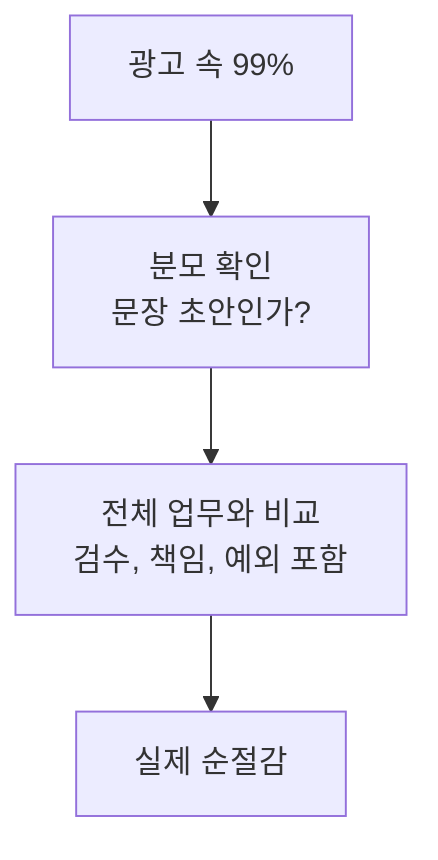
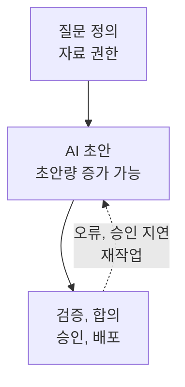
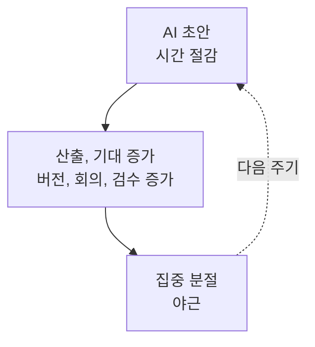

먼저 결론부터 말하겠습니다. **AI가 범위가 좁은 작업을 매우 빠르게 끝내는 것**과 **내 일 전체가 99% 줄어드는 것**은 전혀 다른 주장입니다. 현재 확인할 수 있는 권위 있는 연구 가운데 모든 직업의 업무량이 99% 감소했다고 입증한 자료는 없습니다.

오히려 한국의 실제 수치는 훨씬 복합적입니다. 생성형 AI를 쓴 근로자는 같은 일을 하는 시간을 평균 3.8%, 주 40시간 기준 약 1.5시간 줄였지만, 그 절감과 실제 업무처리량 증가는 상관계수 0이었습니다. [한국은행의 2026년 후속 분석](https://www.bok.or.kr/portal/bbs/P0002353/view.do?menuNo=200433&nttId=10098322)은 이 간격을 **AI 생산성 단절**이라고 부릅니다.

이 책은 AI를 깎아내리려는 글이 아닙니다. 잘되는 작업에서는 큰 효과가 분명히 측정됐습니다. 다만 그 속도를 퇴근 시간과 여유로 바꾸려면, 도구보다 먼저 **업무 흐름과 기대치**를 바꿔야 합니다.

## 99%는 ‘직업’이 아니라 ‘한 단계’의 숫자다

“99% 자동화”를 봤다면 먼저 분모를 물어야 합니다. 이메일 초안 한 통인가, 보고서 완성인가, 고객에게 결과가 전달되고 책임자가 승인하는 전체 과정인가? 같은 숫자도 분모가 달라지면 뜻이 완전히 바뀝니다.

예를 들어 보고서 작성이 하루의 20%이고 AI가 그 단계의 시간을 99% 줄인다고 해봅시다. 검수 비용이 전혀 없다는 비현실적인 조건에서도 하루 전체의 최대 절감은 약 19.8%입니다. 자료 요청, 판단, 승인, 수정, 전달이 그대로라면 나머지 80%는 사라지지 않습니다.



실무에서 볼 숫자는 하나입니다.

> **순절감 = 기존 완료시간 − (AI 사용시간 + 검수 + 재작업 + 조정시간)**

모델의 생성 속도나 데모 영상 길이가 아니라, 쓸 수 있는 결과가 승인될 때까지의 시간을 재야 합니다. 99%는 관심을 끄는 훅으로 남겨두고, 의사결정에는 순절감을 쓰는 이유입니다.

## 한국의 답: 1.5시간은 줄었지만 생산은 늘지 않았다

[한국은행의 대표 가계조사](https://www.bok.or.kr/portal/bbs/P0002353/view.do?menuNo=200433&nttId=10093071)에 따르면 2025년 국내 근로자의 51.8%가 생성형 AI를 업무에 사용했습니다. 사용자는 주당 평균 5~7시간 AI를 활용했고, 같은 산출을 만드는 시간은 평균 3.8% 줄었습니다. 주 40시간 근무로 환산하면 약 1.5시간입니다.

```chartjs
{
  "type": "bar",
  "data": {
    "labels": ["AI 없이 같은 산출", "AI로 같은 산출"],
    "datasets": [
      {
        "label": "실제 작업시간",
        "data": [40, 38.5],
        "backgroundColor": ["#111318", "#2457ff"]
      },
      {
        "label": "절감된 시간",
        "data": [0, 1.5],
        "backgroundColor": ["#d9ddd8", "#20ad91"]
      }
    ]
  },
  "options": {
    "responsive": true,
    "scales": {
      "x": { "stacked": true },
      "y": {
        "stacked": true,
        "beginAtZero": true,
        "title": { "display": true, "text": "주당 시간 / 40시간 근무 환산" }
      }
    },
    "plugins": {
      "title": { "display": true, "text": "한국 근로자의 생성형 AI 시간 절감 추정" },
      "subtitle": { "display": true, "text": "자료: 한국은행 BOK 이슈노트 2025-22, 2026-12" }
    }
  }
}
```

하지만 절약된 시간이 전부 추가 생산으로 바뀐다고 가정한 **잠재 생산성 효과는 1.0%**였습니다. 한국은행은 이것도 상한치로 해석해야 한다고 명시합니다. 실제로는 시간 절감과 처리량 증가의 상관계수가 0이었고, 시간을 20% 이상 크게 줄인 작업은 4.4%에 불과했습니다.

즉 “AI를 썼다 → 빨라졌다 → 생산성이 올랐다 → 덜 일한다”는 네 개의 화살표는 자동으로 이어지지 않습니다.

## 빨라지는 일은 분명히 있다

좁고 평가 기준이 선명한 과업에서는 효과가 큽니다. 다만 연구마다 사람, 모델, 과업, 성공 기준이 달라 숫자를 한 줄로 서열화하면 안 됩니다.

| 연구 | 관찰된 효과 | 어디까지 말할 수 있나 |
| --- | --- | --- |
| [Noy와 Zhang, Science](https://www.science.org/doi/10.1126/science.adh2586) | 대졸 전문직 444명의 제한된 글쓰기에서 완료시간 40% 감소, 품질 18% 증가 | 회사 고유 맥락과 엄격한 사실 검증이 없는 단기 과제 |
| [Brynjolfsson, Li, Raymond](https://www.nber.org/papers/w31161) | 상담원 5,179명의 시간당 해결 건수 평균 14% 증가, 초보와 저숙련자는 34% 증가 | 한 기업의 고객지원 시스템이며 숙련자 효과는 작음 |
| [Dell’Acqua 외, Organization Science](https://www.hbs.edu/ris/Publication%20Files/dell-acqua-et-al-2026-navigating-the-jagged-technological-frontier_5c589c8c-fbb5-458f-b285-c944746cd717.pdf) | 컨설턴트 758명이 AI에 맞는 18개 과업에서 25% 이상 빨라지고 성과 30% 이상 향상 | AI 경계 밖의 한 과업에서는 정답률이 19%포인트 하락 |
| [Dillon 외 현장실험](https://www.nber.org/papers/w33795) | 66개 기업 7,137명 중 실제 사용자는 주당 이메일 시간을 약 2시간 줄임 | 일부 저자가 도구 제조사에 재직했고, 업무 수와 구성 변화는 검출되지 않음 |

공통점은 “AI가 모든 일을 대신했다”가 아닙니다. 초안, 상담 문구, 이메일처럼 **입력이 디지털이고 결과 기준을 빠르게 확인할 수 있는 구간**에서 사람이 더 빨라졌습니다. 반대로 암묵지, 복잡한 맥락, 높은 오류 비용이 들어오면 검수와 판단이 다시 중심이 됩니다.

## 숙련 개발자는 빨라졌다고 믿고도 19% 느려졌다

비영리 연구기관 METR은 2025년 초, 자신이 오래 기여한 대형 오픈소스 저장소에서 숙련 개발자 16명이 실제 이슈 246개를 해결하는 무작위 실험을 했습니다. 개발자들은 AI를 쓰면 24% 빨라질 것으로 예상했고, 실험 뒤에도 20% 빨라졌다고 느꼈습니다. 측정 결과는 반대였습니다. AI 허용 과업의 완료시간이 19% 늘었습니다. [연구 설계와 원자료 설명](https://metr.org/blog/2025-07-10-early-2025-ai-experienced-os-dev-study/)도 공개돼 있습니다.

```chartjs
{
  "type": "bar",
  "data": {
    "labels": ["사용 전 예상", "사용 후 체감", "실제 측정"],
    "datasets": [
      {
        "label": "완료시간 변화율 / 음수는 단축",
        "data": [-24, -20, 19],
        "backgroundColor": ["#20ad91", "#20ad91", "#2457ff"]
      }
    ]
  },
  "options": {
    "indexAxis": "y",
    "responsive": true,
    "scales": {
      "x": {
        "min": -30,
        "max": 25,
        "title": { "display": true, "text": "완료시간 변화율 (%)" }
      }
    },
    "plugins": {
      "title": { "display": true, "text": "AI 코딩: 예상, 체감과 실제 측정의 간극" },
      "subtitle": { "display": true, "text": "자료: METR, 2025년 초 숙련 오픈소스 개발자 RCT" }
    }
  }
}
```

이 결과를 “AI 코딩은 항상 느리다”로 일반화해서도 안 됩니다. 대상은 익숙한 성숙 저장소, 당시 모델, 평균 약 2시간짜리 과업이었습니다. METR도 [2026년 후속 공지](https://metr.org/blog/2026-02-24-uplift-update/)에서 최신 도구는 더 빨라졌을 가능성이 있지만, AI 없이 일하기 싫은 참가자와 과업이 실험에서 빠지는 선택 편향 때문에 새 효과 크기는 신뢰하기 어렵다고 밝혔습니다.

핵심은 사람의 체감이 나쁘다는 것이 아니라, **체감 속도만으로 순절감을 판정할 수 없다는 것**입니다.

## AI는 직업보다 작은 ‘작업’을 바꾼다

[ILO의 2025년 글로벌 지수](https://www.ilo.org/publications/generative-ai-and-jobs-refined-global-index-occupational-exposure)는 전 세계 노동자 네 명 중 한 명이 생성형 AI에 어느 정도 노출된 직업에 있다고 봤습니다. 그러나 가장 높은 노출 구간은 세계 고용의 3.3%였고, 대부분은 직업 소멸보다 **과업 구성의 변화**가 더 가능성 높은 결과라고 결론 내렸습니다.

보고서 하나만 해도 질문 정의, 자료 접근 권한, 분석, 초안, 사실 확인, 합의, 승인, 배포가 이어집니다. AI가 초안을 10배 빠르게 만들어도 승인이 하루 걸리면 전체 완료시간은 거의 그대로입니다. 더 빠른 초안이 더 많은 버전과 더 잦은 요청을 부르면 총 검수량은 오히려 늘 수 있습니다.



그러므로 자동화율 대신 **끝에서 끝까지 걸린 시간**, **수정 횟수**, **오류 비용**을 재야 합니다. AI가 지나가는 한 칸만 재면, 가장 빨라진 부분이 가장 큰 착시를 만듭니다.

## 절약된 시간은 왜 곧바로 다시 채워질까

한국은행은 생산성 단절을 설명할 가능성으로 네 가지를 제시합니다. AI가 일부 작업에만 머물고, 기존 업무 절차가 경직돼 있으며, 승인 같은 병목이 남아 있고, 추가 성과의 보상과 유인이 어긋날 수 있다는 것입니다. 이 설명을 개인의 하루로 옮기면 다음 순환이 보입니다.



이 순환은 모든 조직에서 입증된 단일 인과법칙이 아니라, 한국은행의 병목 설명과 여러 현장 자료를 연결한 **운영 가설**입니다. 내 조직에서 맞는지는 직접 측정해야 합니다.

중요한 구분은 효율성과 생산성, 그리고 여유입니다. 같은 결과를 더 빨리 만들면 **효율성**이 오릅니다. 같은 시간에 가치 있는 결과를 더 많이 만들면 **생산성**이 오릅니다. 줄어든 시간을 내가 되찾아야 비로소 **여유**가 생깁니다. 회사가 기대 산출량을 즉시 높이면 앞의 두 수치는 오르면서도 세 번째는 0일 수 있습니다.

## ‘더 긴 하루’라는 신호도 이미 보인다

[NBER의 AI와 연장된 근무일 연구](https://www.nber.org/papers/w33536)는 2004~2023년 미국 시간사용일지와 직업별 AI 노출도를 결합했습니다. AI 노출이 높은 직업일수록 근로시간이 길고 여가는 줄어드는 관계가 나타났으며, 연구진은 AI가 사람을 대체하기보다 생산성을 보완하고 측정과 감시를 강화하는 경로를 제시했습니다. 다만 이는 직업 노출도를 이용한 관찰 연구이므로 “내가 챗봇을 켜서 야근이 늘었다”는 개인 인과를 확정하지는 못합니다.

[Microsoft 365의 2025년 익명 집계 신호](https://www.microsoft.com/en-us/worklab/work-trend-index/breaking-down-infinite-workday)에서는 업무 외 시간 채팅이 전년보다 15%, 오후 8시 이후 회의가 16% 늘었습니다. 알림량 상위 20% 사용자는 핵심 시간대 평균 2분마다, 24시간 기준 하루 275회 알림을 받았습니다. 제품 사용자의 행동 자료이며 AI 도입의 원인 효과를 측정한 실험도 아닙니다.

반대 방향의 증거도 있습니다. 앞서 본 66개 기업 무작위 실험에서는 실제 AI 사용자가 이메일 시간을 주 2시간 줄이고 정규 시간 밖 업무도 줄였습니다. 덴마크 2만5천 명과 7천 개 사업장을 분석한 [NBER 연구](https://www.nber.org/papers/w33777)는 AI 챗봇 도입 뒤 기록된 근로시간과 소득에서 2%를 넘는 효과를 배제했습니다. 지금의 정직한 결론은 하나입니다. **AI가 여유를 빼앗거나 돌려주는 방향은 도구만으로 결정되지 않는다**는 것입니다.

## 도구를 넣지 말고 업무 흐름을 다시 그려라

AI를 기존 절차 위에 한 단계 더 얹으면 프롬프트 작성과 검수가 추가됩니다. 효과를 내려면 AI가 만든 새 단계를 넣는 동시에, 예전 단계를 실제로 하나 없애야 합니다.

| 업무 유형 | AI의 자리 | 사람이 끝까지 쥘 것 | 반드시 없앨 것 |
| --- | --- | --- | --- |
| 표준화 업무: 요약, 분류, 형식 변환 | 첫 실행자 | 샘플 검수와 예외 승인 | 동일한 수작업 초안 |
| 열린 업무: 전략, 연구, 기획 | 대안 탐색자 | 질문, 근거, 최종 판단 | 목적 없는 버전 늘리기 |
| 고위험 업무: 법률, 의료, 재무, 보안 | 제한된 보조자 | 책임자 검토와 추적 가능한 근거 | 출처 없는 자동 승인 |
| 협업 업무: 회의, 보고, 결재 | 기록과 정리 | 의사결정과 담당자 지정 | 요약을 위한 추가 회의 |

운영 원칙은 간단합니다.

1. **AI 전 기준선**을 남깁니다. 완료시간의 평균보다 중앙값이 안전합니다.
2. 결과물의 “완료”를 한 문장으로 정의합니다. 초안 생성은 완료가 아닙니다.
3. 검수 상한을 정합니다. 세 번 고쳐야 한다면 자동화 대상이나 지시가 잘못된 것입니다.
4. AI 단계가 생기면 기존 단계 하나를 삭제합니다.
5. 절감 시간의 용도를 미리 정합니다. 휴식, 깊은 일, 추가 산출 가운데 누가 가져갈지 합의합니다.

여기서 다섯 번째가 빠지면 절약은 빈 캘린더가 아니라 새 요청을 위한 여백이 됩니다.

## 2주면 내 생산성 역설을 판정할 수 있다

거대한 전사 도입보다 반복 업무 하나를 고르십시오. 1주차에는 AI 없이, 2주차에는 AI를 쓰되 같은 품질 기준과 비슷한 난도의 사례를 모읍니다. 표본이 작으므로 과학 논문처럼 일반화할 수는 없지만, 내 다음 도구 결제와 업무 설계를 결정하기에는 훨씬 낫습니다.

- [ ] 고객 답변, 회의록, 주간 보고처럼 주 5회 이상 반복되는 결과물 하나를 골랐다.
- [ ] 시작부터 승인까지의 시간, 내 직접 작업시간, 수정 횟수를 따로 기록한다.
- [ ] 사실 오류, 누락, 되돌림을 건수와 복구시간으로 남긴다.
- [ ] AI 사용료와 세팅, 대기시간을 포함한다.
- [ ] 저녁과 주말 업무시간과 알림 수를 함께 기록한다.
- [ ] AI가 추가한 단계와 실제 삭제한 단계를 각각 적는다.
- [ ] 절감 시간의 최소 절반은 사전에 정한 용도로 보호한다.

| 판정 질문 | 계속 사용 | 재설계 | 중단 |
| --- | --- | --- | --- |
| 순절감이 있는가 | 20% 이상 반복 | 0~20% 또는 편차 큼 | 0 미만 |
| 품질이 유지되는가 | 오류와 재작업 불변 또는 감소 | 특정 유형만 악화 | 중대 오류 증가 |
| 하루가 나아졌는가 | 야간 업무와 분절 감소 | 산출만 증가 | 야간 업무와 분절 증가 |

20%는 보편 법칙이 아니라 첫 실험을 위한 운영 문턱입니다. 오류 비용이 큰 일은 훨씬 높은 기준이 필요합니다. 반대로 접근성이나 학습처럼 시간 외 가치가 크다면 별도 항목으로 평가할 수 있습니다.

최종 질문은 “AI가 얼마나 많은 글을 써줬나?”가 아닙니다. **같은 가치의 결과를 더 적은 총비용으로 만들었고, 그 절약을 내가 실제로 되찾았나?** 여기에 예라고 답할 때만 AI의 속도가 삶의 속도를 늦춰줍니다.

<!-- internal-links:start -->
### 이어 읽기

- [청년 일자리 28만 5천 개는 누가 가져갔나?]() — AI가 초급 과업을 줄일 때 신입이 숙련자로 성장하는 경로까지 왜 함께 설계해야 하는지 이어서 살펴봅니다.
- [World Bank WDR 2026: 소형 AI와 일자리 생산성]() — 자동화 가능성과 실제 생산성 향상이 다른 지표라는 점을 국가 소득과 인프라 관점에서 비교합니다.
<!-- internal-links:end -->

## 직접 확인한 원문

1. <span id="source-1"></span>[한국은행 — AI 도입은 생산성을 높이는가? 초기 3년의 효과 분석](https://www.bok.or.kr/portal/bbs/P0002353/view.do?menuNo=200433&nttId=10098322) (BOK 이슈노트 2026-12, 2026-06-07)
2. <span id="source-2"></span>[한국은행 — AI의 빠른 확산과 생산성 효과: 가계조사를 바탕으로](https://www.bok.or.kr/portal/bbs/P0002353/view.do?menuNo=200433&nttId=10093071) (BOK 이슈노트 2025-22, 2025-08-18)
3. <span id="source-3"></span>[Science — Experimental evidence on the productivity effects of generative artificial intelligence](https://www.science.org/doi/10.1126/science.adh2586) (2023)
4. <span id="source-4"></span>[NBER / Quarterly Journal of Economics — Generative AI at Work](https://www.nber.org/papers/w31161) (2023, 2025 게재)
5. <span id="source-5"></span>[Harvard Business School / Organization Science — Navigating the Jagged Technological Frontier](https://www.hbs.edu/ris/Publication%20Files/dell-acqua-et-al-2026-navigating-the-jagged-technological-frontier_5c589c8c-fbb5-458f-b285-c944746cd717.pdf) (2026)
6. <span id="source-6"></span>[METR — Measuring the Impact of Early-2025 AI on Experienced Open-Source Developer Productivity](https://metr.org/blog/2025-07-10-early-2025-ai-experienced-os-dev-study/) (2025-07-10)
7. <span id="source-7"></span>[METR — We are Changing our Developer Productivity Experiment Design](https://metr.org/blog/2026-02-24-uplift-update/) (2026-02-24)
8. <span id="source-8"></span>[ILO — Generative AI and Jobs: A Refined Global Index of Occupational Exposure](https://www.ilo.org/publications/generative-ai-and-jobs-refined-global-index-occupational-exposure) (Working Paper 140, 2025)
9. <span id="source-9"></span>[NBER — AI and the Extended Workday](https://www.nber.org/papers/w33536) (Working Paper 33536, 2025)
10. <span id="source-10"></span>[NBER — Shifting Work Patterns with Generative AI](https://www.nber.org/papers/w33795) (Working Paper 33795, 2025년 11월 개정)
11. <span id="source-11"></span>[NBER — Still Waters, Rapid Currents: Early Labor Market Transformation under Generative AI](https://www.nber.org/papers/w33777) (Working Paper 33777, 2026년 3월 개정)
12. <span id="source-12"></span>[Microsoft WorkLab — Breaking down the infinite workday](https://www.microsoft.com/en-us/worklab/work-trend-index/breaking-down-infinite-workday) (2025, 방법론 포함)

> 이 글의 수치는 서로 다른 시점, 직업, 모델, 성과 기준에서 측정되었습니다. 연구 간 퍼센트를 직접 성능 순위처럼 비교하지 않았으며, 관찰 연구, 설문, 기업 후원 연구, 미심사 워킹페이퍼의 한계를 본문에 함께 표시했습니다. 게시일 이후 모델 성능과 연구 개정본은 달라질 수 있습니다.
