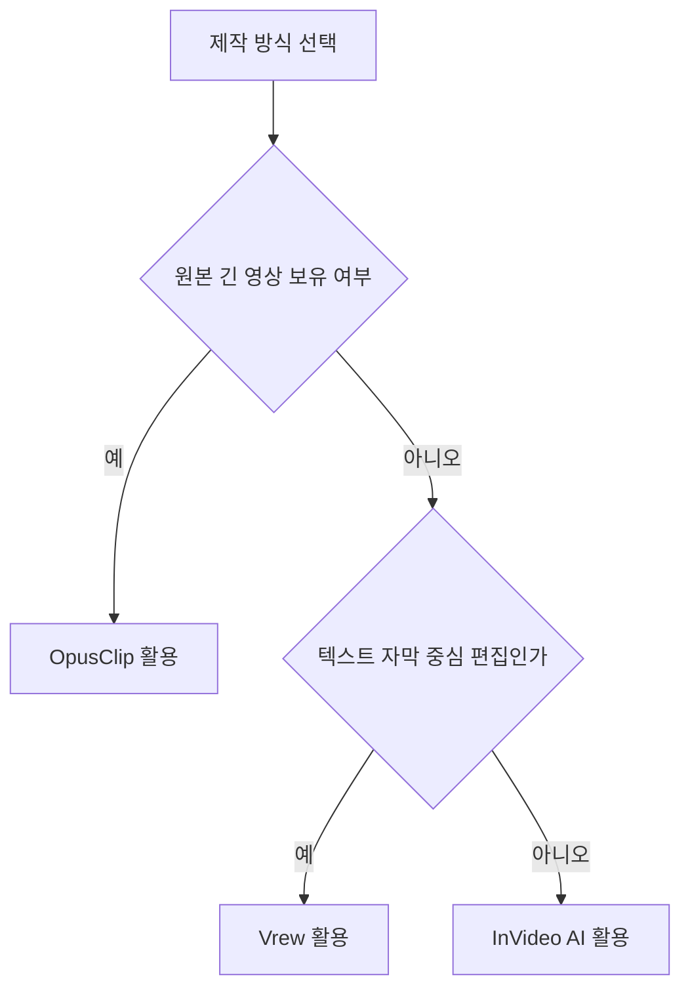
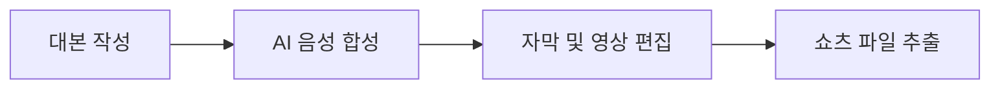

AI 쇼츠 만들기는 목적에 맞춰 적절한 프로그램이나 사이트를 고르고 유튜브 파트너 프로그램 자격 조건을 달성하는 것으로 완성됩니다.

많은 분들이 AI 쇼츠 만들어 온라인 수익을 올리려고 시도하지만 어떤 사이트나 어플을 사용해야 하는지 몰라 혼란을 겪습니다. 온라인 커뮤니티인 디시인사이드 등에서도 AI 쇼츠 만들기 무료 추천 질문이나 어플 비교글이 자주 올라옵니다. 수많은 제작 프로그램 중 어떤 소프트웨어가 상업적 이용을 지원하는지, 그리고 유튜브 수익 창출 요건은 정확히 무엇인지 한눈에 파악하기 어렵기 때문입니다. 이 가이드에서는 주요 AI 쇼츠 만들기 사이트 및 프로그램 요금제와 한도, 그리고 실제 수익 분배 기준까지 명확히 정리해 드립니다.

## AI 쇼츠 만들기 사이트 프로그램 4종 비교

AI 쇼츠 만들기 작업에서 가장 중요한 첫 단계는 본인이 제작하려는 영상 형식에 꼭 맞는 프로그램을 고르는 것입니다. 영상 편집 방식은 기존에 촬영해 둔 긴 영상을 잘라서 숏폼(1분 미만의 짧은 동영상)으로 재가공하는 방식과, 글로 쓴 대본만 입력해서 영상과 자막을 완전 자동으로 새로 만들어내는 방식 두 가지로 크게 나뉩니다. 목적에 맞지 않는 어플이나 소프트웨어를 고르면 편집 시간이 늘어나고 불필요한 유료 결제 비용이 발생할 수 있습니다.

주요 AI 쇼츠 만들기 사이트 및 프로그램을 비교하면 다음과 같습니다. Vrew(브루)는 텍스트(글자 입력)를 기반으로 인공지능 음성과 자막을 동시에 편집해 주는 비디오 편집 소프트웨어입니다. ElevenLabs(일레븐랩스)는 사람 목소리와 다름없는 자연스러운 음성을 생성해 주는 음성 합성 서비스(AI 기반 목소리 제작 도구)입니다. OpusClip(오퍼스클립)은 길다란 롱폼 영상 링크를 넣으면 주요 장면을 뽑아 자동으로 자막을 달고 숏폼으로 잘라주는 영상 재가공 사이트입니다. InVideo AI(인비디오 AI)는 프롬프트(AI에게 명령하는 지시어)를 글로 입력하면 숏폼 동영상 전체를 자동으로 완성하는 플랫폼입니다.

각 도구는 적용하려는 작업 방식에 따라 장단점이 명확하게 갈립니다. 이미 보유한 길다란 영상을 빠르게 쇼츠로 전환하고 싶다면 OpusClip을 선택하는 것이 작업 효율면에서 유리합니다. 반대로 대본 원고를 직접 작성하여 깔끔한 화면과 무료 자막 제작을 동시에 진행하려는 경우 Vrew를 사용하는 편이 수월합니다. 감정 표현이 풍부한 최고 수준의 AI 목소리가 필요한 경우에는 ElevenLabs에서 만들어낸 음성 파일을 Vrew에 불러와 조합하는 방식이 효과적입니다. 장면 구상이나 영상 원본 없이 프롬프트 한 줄로 영상을 만들고 싶다면 InVideo AI를 활용하는 것이 합리적입니다.

제작 방식과 도구를 선택하는 기준을 쉽게 파악할 수 있도록 판단 흐름도를 작성하였습니다.



아래 표는 주요 AI 쇼츠 만들기 어플 및 사이트의 특징과 무료 한도, 가격, 상업적 이용 가능 여부를 정리한 목록입니다.

| 서비스 이름 | 주요 기능 | 무료 플랜 한도 | 유료 결제 가격 | 상업적 이용 여부 |
| --- | --- | --- | --- | --- |
| Vrew | 텍스트 기반 자막 및 AI 음성 편집 | 매월 음성 분석 200분, AI 목소리 2만 자 | 라이트 월 9,900원, 스탠다드 월 17,900원 | 무료 플랜도 가능 |
| OpusClip | 긴 동영상 자동 쇼츠 분할 및 자막 | 매월 60 크레딧 (60분 원본 처리) | 유료 전환 시 워터마크 제거 | 워터마크 포함 내보내기 |
| ElevenLabs | 고품질 다국어 AI 음성 생성 | 매월 10,000 크레딧 제공 | 유료 결제 필요 | 무료 플랜 상업적 이용 불가 |
| InVideo AI | 프롬프트 기반 동영상 자동 제작 | 기본 무료 체험 기능 제공 | Plus 유료 플랜 월 $28부터 | 유료 플랜 결제 시 가능 |

유료 요금제의 정가 가격 비교 차트는 다음과 같습니다.

```chartjs
{
  "type": "bar",
  "data": {
    "labels": ["Vrew 라이트", "Vrew 스탠다드", "InVideo AI Plus"],
    "datasets": [{"label": "월 정가 결제 금액 원화 환산 기준", "data": [9900, 17900, 40000], "backgroundColor": ["#2f9e8f", "#1d6f63", "#9aa5a1"]}]
  },
  "options": {"responsive": true}
}
```

## AI 쇼츠 만들기 무료 어플 요금제 한도와 조건

AI 쇼츠 만들기 무료 도구를 선택할 때 가장 주의 깊게 확인해야 하는 사항은 브랜드 로고인 워터마크(영상 위에 겹쳐 출력되는 투명한 상표 표시)의 존재 여부와 상업적 이용 가능 조건입니다. 완전한 무상 서비스처럼 보여도 상업적 이용을 금지하거나 워터마크가 강제로 노출되는 경우가 많기 때문입니다. 수많은 제작사들이 서비스별로 고유한 이용 한도 규칙을 적용하고 있습니다.

Vrew(브루)의 무료 플랜은 매월 결제일을 기준으로 음성 분석 최대 200분, AI 목소리 최대 2만 자, AI 이미지 생성 등 기본 사용량을 매달 새롭게 지급합니다. 매월 사용량이 초기화되므로 초보자가 AI 쇼츠 만들기 무료 테스트를 진행하기에 매우 편리합니다. 특히 무료 플랜에서 생성한 콘텐츠도 상업적으로 이용할 수 있다는 점이 큰 혜택입니다. 한도를 초과하여 유료 플랜으로 전환할 경우 라이트(Light) 요금제의 정가는 월 9,900원이고, 스탠다드(Standard) 요금제의 정가는 월 17,900원입니다.

OpusClip(오퍼스클립) 무료 플랜은 매월 60 크레딧을 제공하며, 이는 약 60분 분량의 원본 동영상을 쇼츠로 재가공할 수 있는 양입니다. 1080p 고화질 영상 추출과 자동 자막 생성을 지원하지만, 화면 한쪽에 워터마크가 표시된다는 단점이 있습니다. 브랜드 상표 노출 없이 깔끔한 영상을 업로드하려면 유료 구독 플랜을 결제해야 합니다.

ElevenLabs(일레븐랩스)의 무료 플랜(Free Tier)은 매월 10,000 크레딧을 이용할 수 있습니다. 하지만 무료 플랜으로 만든 음성은 상업적 이용이 절대 불가능하며 반드시 출처를 표기해야 하는 의무가 부여됩니다. 따라서 수익 창출을 목적으로 유튜브 채널에 음성을 활용할 경우에는 반드시 유료 플랜을 결제해야 정당하게 상업적 권리를 확보할 수 있습니다.

InVideo AI는 텍스트 프롬프트 입력으로 자동 영상을 만들어내는 도구입니다. 기본 체험 기능을 제공하지만 상업적 활용과 워터마크 제거를 위해서는 Plus 유료 요금제(월 $28부터 시작)를 사용해야 합니다.

AI 쇼츠 영상을 제작하는 기본 순서는 다음과 같습니다.



무료 어플이나 사이트를 사용할 때는 조건표를 꼼꼼히 체크해야 추후 채널 저작권 문제로 불이익을 받지 않습니다.

## 그래서 내 업무에는 뭐가 달라지나

AI 쇼츠 만들어 채널을 성장시키려는 크리에이터나 마케터가 당장 오늘 실행해야 할 행동은 현재 보유한 자산과 목적에 따라 세 가지로 구분됩니다. 막연히 여러 어플을 관망하는 행동은 제작 시간에 아무런 도움이 되지 않으므로 본인 상황에 맞는 작업을 곧바로 시작해야 합니다.

첫째, 기존에 운영하던 길다란 유튜브 영상을 이미 보유하고 있다면 오늘 OpusClip 무료 플랜에 가입하여 60분 분량의 영상을 쇼츠 2~3개로 자동 변환 추출해 보시기 바랍니다. 원본 영상이 있는 상태에서 대본을 새로 쓸 필요 없이 가장 인기가 높은 구간을 추출할 수 있어 당장 오늘부터 쇼츠 업로드를 시작할 수 있습니다.

둘째, 원본 영상이 없고 정보 전달형 텍스트 대본만 가지고 있다면 Vrew 무료 플랜을 설치하여 첫 쇼츠 작성을 완료해 보시기 바랍니다. Vrew는 무료 플랜에서도 상업적 이용을 지원하며, 음성 분석 200분과 AI 목소리 2만 자 한도 내에서 자막과 음성이 완비된 완성도 높은 쇼츠를 비용 없이 곧바로 제작할 수 있습니다.

셋째, 고품질 AI 목소리로 브랜드 전문성을 높이고자 한다면 ElevenLabs 무료 플랜으로 목소리를 먼저 테스트한 뒤 상업적 이용을 위해 유료 플랜 전환 여부를 결정하시기 바랍니다. 무료 플랜 음성은 수익 창출 영상에 쓸 수 없으므로, 음성 품질을 미리 점검하는 용도로만 테스트를 마치고 수익 창출 시점부터 유료 결제를 진행하는 것이 지출을 막는 합리적인 방법입니다.

## AI 쇼츠 만들기 수익 창출 요건과 주의사항

AI 쇼츠 만들기 수익 창출을 실현하려면 유튜브 파트너 프로그램(YPP) 승인 조건을 달성해야 합니다. 다양한 사이트나 어플로 영상을 빠르게 양산하더라도 유튜브의 엄격한 요건과 정책 가이드라인을 만족하지 못하면 광고 수익을 분배받을 수 없습니다.

유튜브 파트너 프로그램(YPP)을 통한 쇼츠 수익 창출 자격 요건은 구독자 1,000명 이상을 확보해야 합니다. 이에 더해 최근 90일간 유효한 공개 쇼츠 조회수 1,000만 회 이상을 달성하거나, 최근 12개월간 공개 동영상 시청 시간 4,000시간 이상 중 하나를 달성해야 최종 자격이 부여됩니다.

이 자격 요건을 달성하여 YPP 심사를 통과하면 쇼츠 피드 광고 수익 공유 시스템에 참여하게 됩니다. 요건을 충족한 크리에이터에게는 크리에이터 풀에 할당된 쇼츠 광고 수익의 45%가 지급됩니다. 쇼츠 동영상 사이 피드에 노출되는 전체 광고 수익 중 약 절반에 해당하는 비율이 정산되는 구조입니다.

하지만 수치상의 조건을 모두 충족했다고 해서 모든 AI 쇼츠 영상이 수익 대상이 되는 것은 아닙니다. 다음과 같은 사유가 발생하면 수익 공유 대상에서 즉시 제외됩니다.

1. 다른 크리에이터의 기존 동영상을 단순 재업로드한 경우
2. 창작자의 독창적인 편집이나 독자적인 요소가 없는 원본이 아닌 쇼츠
3. 자동 클릭 봇이나 스크롤 봇을 사용하여 조작한 가짜 조회수

온라인 커뮤니티인 디시인사이드 등에서 회원들 사이에 언급되는 세부 AI 프롬프트 패턴이나 비공개 템플릿에 대해서는 정확히 확인된 바가 없으므로 검증되지 않은 템플릿에 의존하지 않는 것이 안전합니다. 또한 유튜브 알고리즘의 AI 음성 및 영상 감지 노출 제한 기준 역시 공식 발표된 바가 없으므로 모르는 부분입니다. 따라서 저작권에 위배되지 않는 정당한 대본과 본인만의 가치 있는 편집을 더하여 콘텐츠를 제작하는 것이 수익 창출 채널을 오래 유지하는 핵심 전략입니다.

<!-- internal-links:start -->
## 함께 읽으면 이해가 이어지는 글

- [OpenMontage로 AI 영상을 만들 때: 에이전트 파이프라인, 비용, 검수 기준]() — OpenMontage가 YAML 파이프라인, Markdown 스킬, Python 도구, Remotion과 FFmpeg를 연결해 영상 제작 단계를 조율하는 방식을 설명합니다. 설치 비용, 사람 승인, 재현성과 보안까지 포함한 파일럿…
- [이미지, 오디오를 모두 다음 토큰으로 만들면 더 단순할까? LongCat-Next의 비용]() — DiNA와 dNaViT가 텍스트, 이미지, 오디오를 이산 토큰으로 통합하는 방식, 단일 목적 함수의 이점과 시퀀스, KV 캐시 비용 및 검증법을 살펴봅니다.
- [유튜브 조회수가 안 나올 때 무엇부터 바꿀까: CTR, 시청 지속 시간 진단표]() — 유튜브 검색, 홈, 추천, Shorts 유입을 구분하고 클릭률과 평균 시청 지속 시간으로 제목, 썸네일, 첫 3초, 영상 구조를 한 번에 하나씩 개선하는 방법을 정리합니다.
<!-- internal-links:end -->

## 자주 묻는 질문

### AI 쇼츠 만들기 무료 프로그램으로 유튜브 수익을 바로 낼 수 있나요?

Vrew 무료 플랜은 상업적 이용이 가능하여 수익 창출에 활용할 수 있습니다. 반면 ElevenLabs 무료 플랜은 상업적 이용이 금지되며 OpusClip 무료 플랜은 워터마크가 포함되므로 각 서비스 조건을 확인해야 합니다.

### 유튜브 쇼츠 수익 창출을 위한 필수 자격 요건은 무엇인가요?

구독자 1,000명 이상과 함께 최근 90일간 유효한 공개 쇼츠 조회수 1,000만 회 이상 또는 최근 12개월간 공개 동영상 시청 시간 4,000시간 이상을 달성해야 합니다.

### 유튜브 쇼츠 광고 수익은 몇 퍼센트를 받게 되나요?

파트너 프로그램 자격을 달성하면 크리에이터 풀에 할당된 쇼츠 피드 광고 수익의 45%를 지급받습니다.

### AI 쇼츠를 제작할 때 수익 창출에서 제외되는 사유는 무엇인가요?

타인의 콘텐츠를 단순 재업로드하거나 자체 제작 요소가 없는 원본이 아닌 쇼츠, 그리고 자동 클릭 봇을 활용한 가짜 조회수는 수익 공유에서 제외됩니다.

## 직접 확인한 원문

- [YouTube 고객센터](https://support.google.com/youtube/answer/12504220) (2026-09-03 확인)
- [Vrew (보이저엑스)](https://vrew.ai/ko) (2026-09-03 확인)
- [ElevenLabs](https://elevenlabs.io/pricing) (2026-09-03 확인)
- [OpusClip](https://www.opus.pro/pricing) (2026-09-03 확인)
- [InVideo AI](https://invideo.io/pricing) (2026-09-03 확인)

위 수치는 확인 시점 기준이며 예고 없이 바뀔 수 있습니다. 결정 전에 공식 페이지를 한 번 더 확인하시기 바랍니다.
