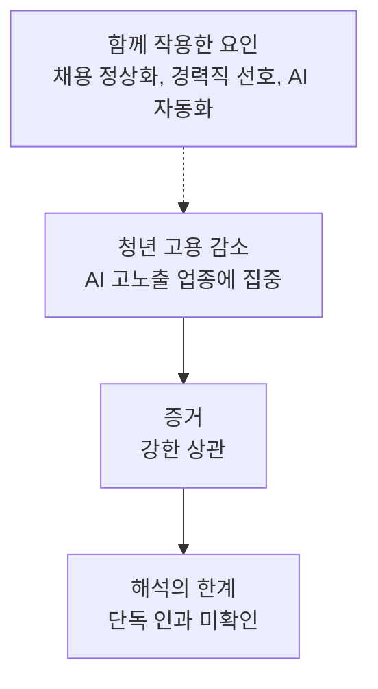
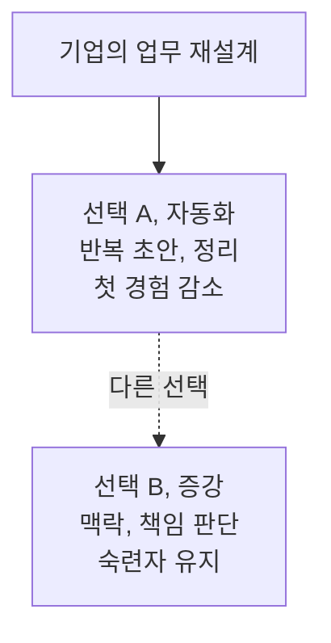
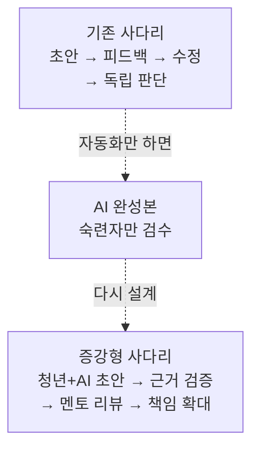

답부터 말하면, 그 일자리를 AI나 50대가 하나씩 가져갔다고 입증된 것은 아니다. 다만 [한국은행의 2026년 분석](https://www.bok.or.kr/portal/bbs/P0002353/view.do?depth=200433&menuNo=200433&nttId=11063845&programType=newsData&relate=Y)에서 2022년 6월부터 2026년 6월까지 15~29세 일자리는 28만 5천 개 줄었고, 감소분의 94%인 26만 8천 개가 AI 노출도가 높은 업종에 몰렸다. 같은 업종에서 50대 고용은 늘었다. 확인된 것은 이 세 가지 **동시 변화**다. AI 단독 범행이라는 인과관계는 아직 확인되지 않았다.

이 짧은 책은 자극적인 범인 찾기보다 더 중요한 질문을 따라간다. 기업이 숙련자는 남기고 초급 과업부터 자동화할 때, 신입이 숙련자가 되는 첫 번째 발판은 어디로 사라지는가?

## 28만 5천은 해고 통지서의 합계가 아니다

먼저 숫자의 정체부터 분명히 해야 한다. 28만 5천은 AI 때문에 해고됐다고 신고한 사람 수가 아니다. 한국은행 고용연구팀이 국민연금 가입자 자료와 지역별고용조사 등을 이용해 **2022년 6월 대비 2026년 6월의 15~29세 고용 규모**를 비교한 결과다. 채용공고 수나 특정 기업의 정리해고 건수와도 다르다.

아래 네 막대는 같은 기간의 연령별 고용 증감을 천 개 단위로 옮긴 것이다. 청년 전체 감소 28만 5천 개 중 26만 8천 개가 한국은행이 분류한 AI 고노출 업종에서 발생했다. 반대로 50대 일자리는 전체 23만 개 늘었고, 그중 17만 3천 개가 AI 고노출 업종에서 증가했다.

```chartjs
{
  "type": "bar",
  "data": {
    "labels": ["15~29세 전체", "15~29세 AI 고노출", "50대 전체", "50대 AI 고노출"],
    "datasets": [
      {
        "label": "일자리 증감 (천 개)",
        "data": [-285, -268, 230, 173],
        "backgroundColor": ["#2457ff", "#2457ff", "#20ad91", "#20ad91"],
        "borderColor": ["#2457ff", "#2457ff", "#20ad91", "#20ad91"],
        "borderWidth": 1
      }
    ]
  },
  "options": {
    "indexAxis": "y",
    "plugins": {
      "legend": { "display": false },
      "title": { "display": true, "text": "2022년 6월 대비 2026년 6월 연령별 일자리 증감" }
    },
    "scales": {
      "x": { "title": { "display": true, "text": "천 개, 0보다 작으면 감소" } }
    }
  }
}
```

출처는 [한국은행 BOK 이슈노트 제2026-19호](https://www.bok.or.kr/portal/bbs/P0002353/view.do?depth=200433&menuNo=200433&nttId=11063845&programType=newsData&relate=Y)다. AI 고노출은 Eloundou 외 연구의 과업별 AI 노출도를 한국 산업에 연결해 분류한 범주다. 여기서 **노출**은 AI가 그 일의 일부를 바꿀 가능성이 크다는 뜻이지, 실제 대체가 완료됐다는 뜻이 아니다.

## 94%는 범인 검거율이 아니다

26만 8천을 28만 5천으로 나누면 약 94%다. 이 비율은 감소가 어디에 집중됐는지는 강하게 보여주지만, 왜 감소했는지를 혼자 설명하지는 못한다. 분석 시작점인 2022년 6월은 ChatGPT 공개 시점인 2022년 11월보다 다섯 달 빠르다. 한국은행도 신규채용 중 청년 비중이 ChatGPT 등장 전부터 하락했다고 명시했다.

<figure class="manim-visual">
  <video
    src="/assets/media/manim/ratio-268-of-285.mp4"
    poster="/assets/media/manim/ratio-268-of-285-poster.png"
    width="1920"
    height="1080"
    autoplay
    muted
    loop
    playsinline
    controls
    preload="metadata"
    aria-label="285칸 중 268칸을 채워 94퍼센트를 설명하는 수학 애니메이션"
  ></video>
  <figcaption>268 ÷ 285 = 0.94035…를 285칸으로 펼쳤다. 268칸은 파랑, 남은 17칸은 민트색이다.</figcaption>
</figure>



따라서 증거는 네 층으로 읽어야 한다.

| 층위 | 말할 수 있는 것 | 말할 수 없는 것 |
| --- | --- | --- |
| 관찰 | 청년 고용이 28만 5천 개 감소했다 | 감소한 개인의 정확한 사유 |
| 집중 | 감소분 94%가 AI 고노출 업종에 있었다 | AI가 94%를 직접 해고했다는 결론 |
| 동시 변화 | 같은 업종에서 50대 고용이 늘었다 | 50대가 청년 자리를 일대일로 빼앗았다는 결론 |
| 해석 | 초급 과업 축소와 경력직 선호가 겹쳤을 가능성 | 다른 경기 요인을 제거한 순수 AI 효과 |

이 구분은 AI의 영향을 작게 보려는 것이 아니다. 원인을 과장하면 해법도 “AI를 막자”로 단순해진다. 지금 필요한 것은 어떤 사용 방식이 첫 일자리를 줄이고, 어떤 방식이 사람의 숙련을 키우는지 분리하는 일이다.

## 같은 업종에서 청년은 줄고 50대는 늘었다

“누가 가져갔나?”라는 질문에 가장 가까운 단서는 세대의 반대 방향이다. 같은 4년 동안 50대 일자리는 23만 개 증가했고, AI 고노출 업종에서만 17만 3천 개 늘었다. 한국은행은 이를 기술의 효과가 경력에 따라 다르게 나타나는 **연공편향 기술변화**의 흔적으로 해석한다.



그렇다고 50대 근로자가 청년의 의자를 그대로 가져갔다는 뜻은 아니다. 고용 **저량**의 변화만으로는 누가 누구를 대체했는지 알 수 없다. 기업이 기존 숙련자를 유지하면서 신규 채용만 줄여도 두 방향은 동시에 나타난다. 경기 회복 업종에서 중장년 고용이 늘고, 청년이 많은 다른 업종이 줄어도 비슷한 모양이 생긴다.

더 설득력 있는 해석은 “사람의 대체”보다 “진입구의 축소”다. 이미 고객, 제품, 규정의 맥락을 가진 사람은 AI로 생산성을 높이기 쉽다. 아직 그 맥락을 배워야 하는 사람에게 주어지던 조사, 초안, 정리 업무가 자동화되면 첫 경력의 공급이 먼저 줄어든다. 이 해석 역시 가능성이지 확정된 인과는 아니다.

## AI는 직업보다 첫 번째 과업을 먼저 먹는다

신입은 완성된 전문가로 입사하지 않는다. 자료를 모으고, 초안을 쓰고, 오류를 고치고, 선배의 피드백을 받으면서 판단 기준을 몸에 익힌다. 문제는 생성형 AI가 가장 먼저 잘하는 일이 바로 이 초급 과업과 겹친다는 데 있다.

[한국은행 분석](https://www.bok.or.kr/portal/bbs/P0002353/view.do?depth=200433&menuNo=200433&nttId=11063845&programType=newsData&relate=Y)은 AI 사용을 자동화와 증강으로 나눴다. AI에게 과업 자체를 맡기는 자동화 비중이 높은 업종일수록 청년 고용 감소 폭이 컸다. 반면 사람이 일을 수행하며 AI를 학습, 반복 개선, 검증에 쓰는 증강 비중이 높은 업종에서는 뚜렷한 감소 패턴이 나타나지 않았다. 이 분류는 [Handa 외 연구가 분석한 실제 Claude 사용 기록](https://arxiv.org/abs/2503.04761)을 업종 수준으로 변환한 것이다.



핵심은 AI 사용 여부가 아니라 **학습 고리가 남아 있는가**다. 완성본만 빨리 얻으면 오늘의 비용은 줄어든다. 초안을 만든 이유, 틀린 부분, 수정 기준을 청년에게 설명하지 않으면 내일의 숙련자는 자라지 않는다.

## 가장 먼저 꺾인 네 업종

청년 고용 감소는 모든 산업에 고르게 퍼지지 않았다. 한국은행이 같은 기간에 보고한 청년 고용 감소율은 정보서비스업 31.4%, 출판업 27.4%, 컴퓨터 프로그래밍과 시스템 통합 및 관리업 16.6%, 전문서비스업 11.6%였다. 문서, 코드, 정보처리처럼 디지털 과업 비중이 큰 업종들이다.

```chartjs
{
  "type": "bar",
  "data": {
    "labels": ["정보서비스업", "출판업", "컴퓨터 프로그래밍과 시스템 통합", "전문서비스업"],
    "datasets": [
      {
        "label": "15~29세 고용 감소율 (%)",
        "data": [31.4, 27.4, 16.6, 11.6],
        "backgroundColor": ["#2457ff", "#416cff", "#20ad91", "#58c5ae"],
        "borderWidth": 0
      }
    ]
  },
  "options": {
    "indexAxis": "y",
    "plugins": {
      "legend": { "display": false },
      "title": { "display": true, "text": "AI 고노출 주요 업종의 청년 고용 감소율" }
    },
    "scales": {
      "x": { "beginAtZero": true, "title": { "display": true, "text": "%" } }
    }
  }
}
```

수치는 [한국은행 보고서가 제시한 2022년 6월 대비 2026년 6월 변화](https://www.bok.or.kr/portal/bbs/P0002353/view.do?depth=200433&menuNo=200433&nttId=11063845&programType=newsData&relate=Y)다. 이 차트는 네 업종의 감소 폭을 비교할 뿐, AI 기여분을 따로 추정하지 않는다. 업황, 팬데믹 시기 채용, 외주화, 기업 규모 변화가 함께 들어 있다.

다만 공통점은 분명하다. 결과물이 디지털 파일로 남고, 과업을 작은 단위로 쪼갤 수 있으며, 숙련자가 AI 결과를 비교적 빠르게 검수할 수 있는 곳이다. 바로 이런 곳에서 “주니어가 초안을 만들고 시니어가 고치는” 분업이 “AI가 초안을 만들고 시니어가 고치는” 분업으로 바뀌기 쉽다.

## 대졸 프리미엄이 뒤집힌 신호

실업 통계에서도 비슷한 흔적이 보인다. 2022년 11월 이후 15~29세 대졸자의 평균 실업률은 7.0%, 전문대졸 이하 청년은 5.4%였다. 차이는 1.6%포인트다. 한국은행은 학력을 AI 노출 가능성의 대리변수로 사용했다. 고학력자가 인지, 분석, 문서 업무를 맡는 비중이 상대적으로 높다는 이유다.

```chartjs
{
  "type": "bar",
  "data": {
    "labels": ["대졸 청년", "전문대졸 이하 청년"],
    "datasets": [
      {
        "label": "평균 실업률 (%)",
        "data": [7.0, 5.4],
        "backgroundColor": ["#2457ff", "#20ad91"],
        "borderWidth": 0
      }
    ]
  },
  "options": {
    "plugins": {
      "legend": { "display": false },
      "title": { "display": true, "text": "2022년 11월 이후 15~29세 학력별 평균 실업률" }
    },
    "scales": {
      "y": { "beginAtZero": true, "title": { "display": true, "text": "%" } }
    }
  }
}
```

출처는 경제활동인구조사를 재계산한 [한국은행 고용연구팀 결과](https://www.bok.or.kr/portal/bbs/B0000347/view.do?depth=201106&depth2=201106&menuNo=201106&nttId=11064157&oldMenuNo=201106&pageIndex=1&pageUnit=10&programType=newsData&searchCnd=1&searchKwd=)이며, 원 보고서의 추세선은 12개월 이동평균을 사용한다. 학력은 실제 AI 사용량이 아니다. 전공, 희망 임금, 구직 기간, 업종 구성의 차이도 결과에 영향을 줄 수 있으므로 “대졸자가 AI 때문에 더 많이 실업했다”고 단정하면 안 된다.

더 넓은 청년 고용 약화도 확인된다. [고용노동부의 2026년 8월 발표](https://moel.go.kr/news/enews/report/enewsView.do?news_seq=19842)에 따르면 20~24세 고용률은 2022년 46.0%에서 2025년 43.6%로 낮아졌고, 2026년 2분기에는 41.3%였다. 25~29세는 같은 연도 기준 71.4%, 71.8%, 2026년 2분기 71.5%였다. 연간 수치와 분기 수치는 계절성이 달라 직접적인 일직선 비교보다 연령대별 방향을 보는 보조 자료로 써야 한다.

## 세계 데이터도 아직 판결문을 쓰지 못했다

한국의 패턴은 세계적인 문제의식과 닿아 있지만, 나라별 결과는 하나로 모이지 않는다. [OECD 고용전망 2026](https://www.oecd.org/en/publications/oecd-employment-outlook-2026_7e710f54-en/full-report/component-5.html)은 청년 진입자가 경기 둔화 때 먼저 채용 기회를 잃기 쉽고, 팬데믹 과잉채용 뒤 정보기술과 기업서비스 업종의 조정도 영향을 줬다고 설명한다. 2024년 초 이후 비대졸 청년 진입자의 실업률 격차는 미국에서 커졌지만 호주에서는 줄었고, 캐나다와 유로 지역에서는 대체로 평평했다.

[Anthropic의 2026년 노동시장 연구](https://www.anthropic.com/research/labor-market-impacts)도 고노출 직업에서 체계적인 실업 증가를 찾지는 못했다. 다만 노출도가 높은 직업에서 젊은 층 채용이 느려졌을 가능성을 시사하는 증거는 있었다. 모델 제공자의 자체 서비스 사용 데이터를 바탕으로 한 연구이므로 전체 경제를 대표하지 않는다는 한계도 함께 봐야 한다.

세 자료를 겹치면 결론은 좁고 선명해진다. “AI가 이미 모든 신입 일자리를 대체했다”는 판결은 이르다. 그러나 **청년에게 배정되던 디지털 초급 과업과 신규 채용이 먼저 압박받을 위험**은 무시하기 어렵다. 한 달의 실업률보다 채용, 과업 배분, 멘토링 시간이 함께 움직이는지를 계속 추적해야 한다.

## 취업 준비생은 AI 사용법보다 검증 흔적을 남겨야 한다

기업에 보여줘야 할 것은 외운 프롬프트 수보다 AI 결과에 책임질 수 있다는 증거다. 포트폴리오도 완성본 한 장보다 판단 과정을 보여줘야 한다. 아래 체크리스트는 “AI로 더 빨리 만들었다”를 “AI와 함께 숙련을 쌓았다”로 바꾸는 최소 구조다.

- **과업을 적는다.** 직무 이름 대신 조사, 초안, 검증, 예외 처리, 의사결정으로 일을 쪼갠다.
- **원본과 수정본을 함께 남긴다.** AI 초안의 오류와 사람이 바꾼 이유를 비교할 수 있게 한다.
- **근거 장부를 만든다.** 출처, 가정, 계산식, 확인 날짜를 결과물 옆에 붙인다.
- **실패 사례를 숨기지 않는다.** 잘못된 답을 발견한 테스트와 재발 방지 규칙을 기록한다.
- **사람의 리뷰를 받는다.** 현업자 피드백을 반영하고 무엇을 배웠는지 한 문장으로 남긴다.

| AI가 쉽게 만드는 결과 | 경력으로 인정받을 증거 |
| --- | --- |
| 시장조사 초안 | 표본 선택 이유, 원문 링크, 반례 |
| 코드 뼈대 | 테스트, 오류 재현, 보안 경계 |
| 보고서 요약 | 누락 점검표, 숫자 재계산, 판단 기준 |
| 고객 답변 | 예외 처리, 이관 조건, 책임자 승인 |

이 전략은 AI를 피하는 방법이 아니다. AI가 만든 산출물보다 **검증과 책임의 범위**를 넓혀 초급자에게도 숙련의 증거가 생기게 하는 방법이다. 도구 이름은 바뀌어도 이 기록은 경력으로 남는다.

## 기업은 첫 세 칸을 다시 놓아야 한다

개별 기업이 초급 업무를 자동화하는 것은 단기적으로 합리적이다. 모든 기업이 동시에 그렇게 하면 몇 년 뒤 숙련자를 구할 시장 자체가 얇아진다. 한국은행이 지적한 인재 파이프라인 문제다. 해결책은 없어진 단순 업무를 그대로 복원하는 것이 아니라, AI를 쓰면서도 학습과 책임이 커지는 새 사다리를 설계하는 데 있다.

기업과 정책 담당자는 다음 다섯 항목을 채용 인원만큼 중요하게 측정할 수 있다.

- 신입에게 AI 결과의 **근거 확인과 예외 판단** 권한을 배정했는가?
- 숙련자의 검수 시간을 단순 승인 대신 **설명과 피드백**에 쓰는가?
- 청년과 숙련자가 같은 결과물에 공동 책임을 지는 **도제형 프로젝트**가 있는가?
- 자동화 투자비와 함께 멘토링, 훈련, 첫 경력 비용도 예산에 넣었는가?
- 처리량뿐 아니라 신입이 독립적으로 판단하게 된 과업 수를 추적하는가?

[한국은행의 정책 제안](https://www.bok.or.kr/portal/bbs/P0002353/view.do?depth=200433&menuNo=200433&nttId=11063845&programType=newsData&relate=Y)도 같은 방향이다. AI 시대의 직업훈련, 기업 훈련과 멘토링 비용 지원, 기술투자와 인재 양성 사이의 유인 균형을 제안한다. 정부가 발표한 [청년일자리 회복방안](https://moel.go.kr/news/enews/report/enewsView.do?news_seq=19842) 역시 첫 취업, 일경험, 멘토링과 경력 증명을 한 흐름으로 연결하려 한다. 계획의 규모보다 실제 취업 유지, 숙련 형성, 임금 상승으로 이어지는지 사후 평가가 더 중요하다.

> **한 문장 결론:** 28만 5천 개를 가져간 단일 범인은 아직 없다. 하지만 AI 고노출 업종에서 청년의 첫 발판이 집중적으로 약해졌다는 경고는 이미 충분하다. 자동화로 빈 첫 칸을, AI와 사람의 공동 작업으로 다시 놓아야 한다.

<!-- primary-sources:start -->
## 직접 확인한 원문

- [한국은행 BOK 이슈노트 제2026-19호, 청년고용 위축, AI 탓인가?](https://www.bok.or.kr/portal/bbs/P0002353/view.do?depth=200433&menuNo=200433&nttId=11063845&programType=newsData&relate=Y) — 2026년 8월 18일 공개. 28만 5천 개, 26만 8천 개, 94%, 세대와 업종별 수치의 주 출처.
- [한국은행 블로그, 청년 일자리 감소, 정말 AI 탓일까?](https://www.bok.or.kr/portal/bbs/B0000347/view.do?depth=201106&depth2=201106&menuNo=201106&nttId=11064157&oldMenuNo=201106&pageIndex=1&pageUnit=10&programType=newsData&searchCnd=1&searchKwd=) — 2026년 8월 28일 공개. 지표 정의, 학력별 실업률, 인과 해석의 한계를 확인.
- [고용노동부, 청년일자리 회복방안](https://moel.go.kr/news/enews/report/enewsView.do?news_seq=19842) — 2026년 8월 28일 공개. 연령대별 고용률과 경력 지원 정책을 확인.
- [OECD Employment Outlook 2026, Employment and wages under pressure](https://www.oecd.org/en/publications/oecd-employment-outlook-2026_7e710f54-en/full-report/component-5.html) — 청년 진입자와 AI 노출 직업의 국제 비교 및 국가별 차이를 확인.
- [Anthropic, Labor market impacts of AI](https://www.anthropic.com/research/labor-market-impacts) — 2026년 3월 5일 공개. 관찰된 AI 노출과 젊은 층 채용 둔화에 관한 초기 증거를 확인.
- [Eloundou 외, GPTs are GPTs](https://doi.org/10.1126/science.adj0998) — Science 2024년 논문. 한국은행이 산업별 AI 노출도를 구성할 때 사용한 과업 노출 프레임의 원 연구.
- [Handa 외, Which Economic Tasks are Performed with AI?](https://arxiv.org/abs/2503.04761) — 실제 Claude 대화를 자동화와 증강으로 구분한 연구. 한국은행의 활용 방식 분류 기반.

모든 웹 원문과 수치는 2026년 9월 3일에 다시 확인했다.
<!-- primary-sources:end -->

<!-- internal-links:start -->
### 이어 읽기

- [career-ops: AI 코딩 에이전트가 내 취업을 대신해 주는 법]() — 지원 자동화가 시간을 줄이는 범위와 사람이 직접 판단해야 할 경계를 함께 볼 수 있다.
- [World Bank WDR 2026 발표: 거대 데이터센터 없이 개도국 일자리 16.2% 생산성 높인다]() — AI가 일자리를 없애는 경로와 생산성을 높이는 경로가 왜 동시에 존재하는지 비교할 수 있다.
<!-- internal-links:end -->
