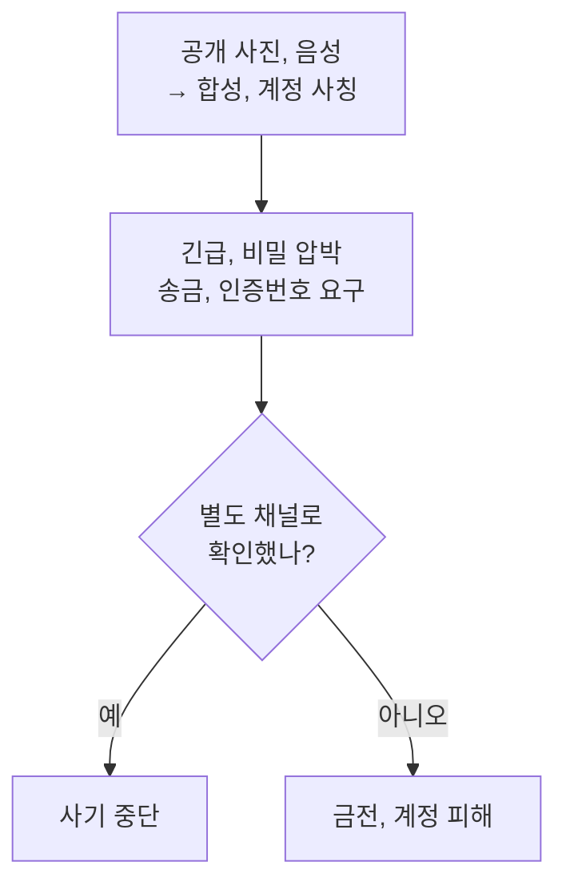
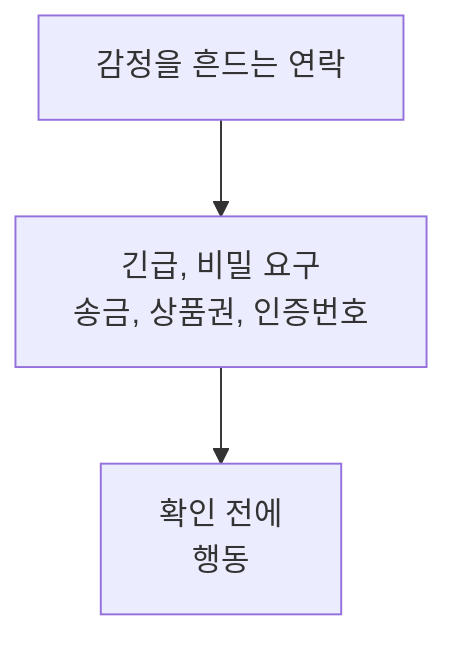
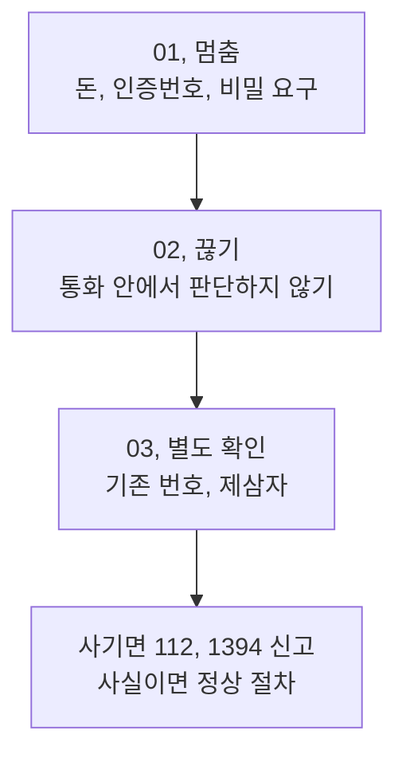
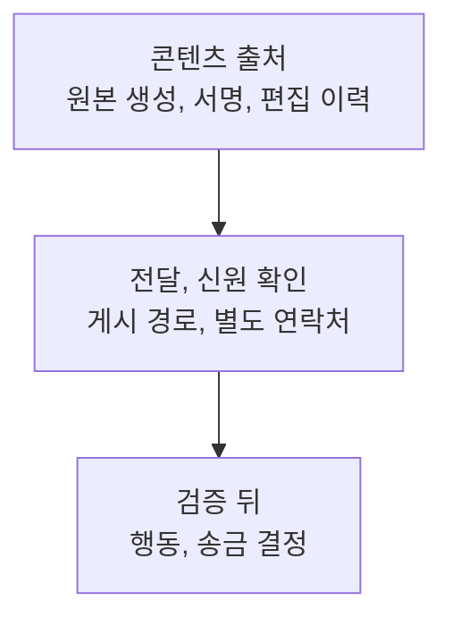

전화기 너머로 울먹이는 목소리가 들립니다. 얼굴도, 말투도 가족과 같습니다. 하지만 이제 **닮았다는 사실은 신원 확인이 아닙니다.** 미국 연방거래위원회(FTC)는 공개된 짧은 음성 조각만으로도 가족 목소리를 흉내 내는 사기가 가능하다고 경고하고, 미국 연방수사국(FBI)은 AI 음성이 실제 지인과 거의 같게 들릴 수 있다고 설명합니다. 한국 정부도 2026년 딥보이스 탐지 기능을 포함한 통신사 서비스를 안내하기 시작했습니다.

이 책의 결론은 탐지 기술보다 단순합니다. **끊고, 내가 아는 번호로 다시 걸고, 확인 전에는 돈을 보내지 않는다.** 영상과 음성을 판별하려 애쓰기보다 서로 독립된 연락 경로를 확인하는 편이 훨씬 튼튼합니다.



## 목소리는 왜 더 이상 신분증이 아닐까?

딥보이스는 한 사람의 말투, 높낮이, 음색을 모사해 그 사람이 하지 않은 말을 만들어 내는 합성 음성입니다. FTC는 사기범이 온라인에 공개된 **짧은 음성 클립**과 음성 복제 프로그램을 이용할 수 있다고 경고합니다. FBI도 2025년 AI 생성 음성 메시지로 고위 공무원을 사칭한 실제 캠페인을 알리며, 목소리가 지인과 거의 같게 들릴 수 있다고 설명했습니다.

다만 “영상통화면 무조건 속는다”거나 “몇 초면 누구나 완벽하게 복제한다”는 식의 단정도 피해야 합니다. 필요한 자료량과 품질, 합성 결과는 도구와 상황에 따라 다릅니다. 변하지 않은 사실은 하나입니다. 전화번호, 프로필 사진, 얼굴, 목소리 가운데 어느 하나도 **독립적인 신원 증명 수단**은 아니라는 점입니다.

> 화면이 자연스러운가를 묻기 전에, 내가 먼저 알고 있던 연락처로 다시 확인했는가를 물어야 합니다.
{: .prompt-tip }

## 사기의 핵심은 합성 기술보다 시간 압박이다

가족 사칭 사기는 보통 기술을 길게 자랑하지 않습니다. “지금 사고가 났다”, “아무에게도 말하지 마라”, “곧바로 송금하라”처럼 판단 시간을 지웁니다. FTC가 정리한 가족 긴급상황 사기의 공통점도 **긴급함, 비밀 유지, 되돌리기 어려운 결제 방식**입니다. 합성 음성은 오래된 사회공학에 신뢰감을 한 겹 더 얹는 도구에 가깝습니다.



따라서 “가짜 얼굴의 어색한 눈 깜빡임”만 외우는 교육은 충분하지 않습니다. 영상 품질이 좋아져도 작동하는 절차, 즉 **거래를 늦추고 다른 채널로 신원을 재확인하는 습관**이 필요합니다.

## 피해 숫자는 커졌지만 모두 딥페이크 때문은 아니다

FTC에 신고된 전체 사칭 사기 손실은 2023년 27억 달러, 2024년 29억 5천만 달러, 2025년 35억 달러였습니다. 아래 수치는 정부, 기업, 가족 등 여러 유형의 사칭을 합친 신고액입니다. **딥페이크만의 손실액이 아니며**, 증가분을 AI 탓으로 돌릴 수도 없습니다. 신고되지 않은 피해도 있어 실제 총피해와 같지 않습니다.

```chartjs
{
  "type": "bar",
  "data": {
    "labels": ["2023", "2024", "2025"],
    "datasets": [{
      "label": "FTC 신고 사칭 사기 손실액(십억 달러)",
      "data": [2.70, 2.95, 3.50]
    }]
  },
  "options": {
    "plugins": {
      "title": {
        "display": true,
        "text": "미국 FTC에 신고된 전체 사칭 사기 손실액"
      },
      "subtitle": {
        "display": true,
        "text": "AI, 딥페이크에 한정된 통계가 아님"
      }
    },
    "scales": {"y": {"beginAtZero": true}}
  }
}
```

이 숫자가 말해 주는 것은 “AI 사기가 35억 달러”라는 결론이 아닙니다. 사칭 사기 자체가 이미 큰 시장이고, FTC와 FBI가 음성 복제와 딥페이크를 그 사기를 더 정교하게 만들 수 있는 위험으로 따로 경고하고 있다는 사실입니다.

## 전화 한 통만 막는다고 끝나지 않는다

FTC의 정부와 기업 사칭 신고를 보면 시작 채널이 바뀌었습니다. 2020년에는 전화가 67%였지만 2023년에는 32%로 줄었습니다. 같은 기간 이메일은 10%에서 26%, 문자는 9%에서 14%로 늘었습니다. 아래 비율은 FTC 도표의 반올림 값이며 가족 사칭만을 뜻하지 않습니다.

```chartjs
{
  "type": "bar",
  "data": {
    "labels": ["전화", "이메일", "문자", "기타"],
    "datasets": [
      {"label": "2020년 신고 비중(%)", "data": [67, 10, 9, 14]},
      {"label": "2023년 신고 비중(%)", "data": [32, 26, 14, 28]}
    ]
  },
  "options": {
    "plugins": {
      "title": {
        "display": true,
        "text": "미국 정부, 기업 사칭 신고의 최초 접촉 채널"
      }
    },
    "scales": {"y": {"beginAtZero": true, "max": 100}}
  }
}
```

사기범은 문자로 불안을 만들고, 메신저로 옮긴 뒤, 음성이나 영상으로 신뢰를 보강할 수 있습니다. 그러므로 발신번호 하나, 영상 하나, 메신저 계정 하나를 각각 진짜라고 믿지 말아야 합니다. **같은 대화가 통제하는 증거는 하나의 증거**일 뿐입니다.

## 눈과 귀로 가짜를 맞히려 하지 마라

FBI는 비현실적인 그림자, 어색한 움직임, 통화 지연 같은 단서를 살피라고 안내합니다. 동시에 AI 생성물이 이미 식별하기 어려운 수준에 도달했다고 명시합니다. 압축, 약한 통신 상태, 조명 문제는 진짜 영상에도 오류를 만들고, 좋은 합성물은 눈에 띄는 흔적을 남기지 않을 수 있습니다.

FTC가 음성 복제 대응책을 **사전 인증, 실시간 탐지, 사후 평가**의 세 지점으로 나눈 이유도 탐지기 하나로 해결할 수 없기 때문입니다. 한국에서는 삼성 전화 앱과 이동통신 3사의 서비스가 문맥, 화자, 딥보이스, 위변조 음성을 분석해 경고를 제공한다고 정부가 안내했습니다. 지원 기기와 요금제에서 켜 두는 것은 도움이 되지만, 경고가 없었다는 사실을 진짜라는 보증으로 해석하면 안 됩니다.

| 확인 방식 | 도움이 되는 점 | 혼자서는 부족한 이유 |
| --- | --- | --- |
| 얼굴과 입 모양 관찰 | 조악한 합성을 거를 수 있음 | 진짜 영상의 통신 오류와 혼동 가능 |
| 딥보이스 탐지 알림 | 통화 중 위험 신호를 한 번 더 제공 | 미탐지와 오탐지 가능성이 남음 |
| 발신번호 확인 | 낯선 번호를 경계하게 함 | 번호 표시도 사칭될 수 있음 |
| 별도 채널 재확인 | 공격자가 통제하지 않는 경로를 추가 | 미리 올바른 연락처를 알고 있어야 함 |

## 30초 동안 할 일은 딱 세 가지다

돈, 인증번호, 계정 정보, 비밀 유지 가운데 하나라도 요구하면 통화 안에서 진위를 가리지 마세요. FBI와 FTC 모두 상대가 주장한 연락처가 아니라 **내가 독립적으로 알고 있던 번호**로 다시 연락하라고 권합니다.



첫째, **끊습니다.** 둘째, 주소록에 원래 저장돼 있던 번호로 직접 겁니다. 셋째, 본인이 받지 않으면 다른 가족, 학교, 회사처럼 별도의 사람에게 확인합니다. 상대가 “경찰이라 끊으면 안 된다”고 말해도 같은 원칙을 적용합니다.

## 오늘 가족 암구호를 하나 정하자

FBI는 가족끼리 신원을 확인할 비밀 단어나 문구를 만들라고 권고합니다. 검색하면 나오는 반려동물 이름, 생일, 학교 이름은 피하세요. 대면했을 때 서로 정하고, 돈을 요구하는 통화에서만 묻는 짧은 조합이면 충분합니다.

- 서로 관련 없는 두 단어와 숫자를 조합합니다.
- 가족 단체 채팅에 그대로 남기지 않습니다.
- 누군가 실수로 말했다면 즉시 바꿉니다.
- 암구호가 맞아도 주소록의 기존 번호로 한 번 더 확인합니다.
- 부모님이나 아이의 학교, 회사, 가까운 친구 번호를 별도로 저장합니다.

암구호는 만능 비밀번호가 아니라 **당황한 순간에 멈추게 하는 브레이크**입니다. 가족의 대화 기록이나 기기가 탈취되면 노출될 수 있으므로, 송금 승인 수단으로 쓰지 말고 재확인을 시작하는 신호로만 사용하세요.

## 돈을 보냈다면 즉시 해야 할 일

한국에서 송금이나 계정 피해가 의심되면 상대와 논쟁하거나 합성 여부를 분석하느라 시간을 보내지 마세요. 거래 은행에 즉시 지급정지를 요청하고 경찰 **112**에 신고합니다. 전기통신금융사기 통합대응단은 **1394**, 피싱 사이트와 개인정보 침해 상담은 KISA **118**을 이용할 수 있습니다. 정부의 2026년 예방 안내도 낯선 전화는 끊고 공식 번호로 확인하며, 가족이나 지인에게 송금하기 전에 반드시 재확인하라고 권고합니다.

1. 은행 앱이나 카드사의 **공식 앱 또는 대표번호**로 거래 중지를 요청합니다.
2. 112와 1394에 연락해 시간, 번호, 계좌, 송금 내역을 알립니다.
3. 비밀번호나 인증번호를 넘겼다면 해당 계정의 비밀번호를 바꾸고 세션을 종료합니다.
4. 통화 녹음, 문자, 계좌번호, URL을 지우지 말고 보존합니다.
5. 지인 계정으로 사칭했다면 그 지인에게 알려 추가 피해를 막습니다.

## 앞으로 믿어야 할 것은 얼굴이 아니라 출처의 사슬이다

콘텐츠가 언제, 누구의 기기에서 만들어졌고 중간에 어떻게 전달됐는지를 확인하는 **출처 기록**은 앞으로 더 중요해집니다. 워터마크나 콘텐츠 자격증명도 도움이 되지만, 표시가 없다고 가짜인 것도 아니고 표시가 있다고 주장 내용까지 참인 것도 아닙니다.



가장 강한 검증은 여러 독립된 증거가 같은 결론을 가리키는 것입니다. 원본 기록, 공식 계정, 이미 알고 있던 전화번호, 제삼자의 확인을 겹칩니다. 반대로 한 영상통화 안에서 보여 주는 신분증, 경찰 배지, 가족 얼굴은 공격자가 한꺼번에 통제할 수 있으므로 서로 독립된 증거가 아닙니다.

## 결론: 진짜를 보는 능력보다 멈추는 절차가 강하다

딥페이크 시대의 안전은 인간이 기계보다 더 예민한 탐지기가 되는 데 있지 않습니다. 감정이 먼저 움직이는 순간에도 거래를 멈추는 절차를 만드는 데 있습니다.

**끊기 → 기존 번호로 다시 걸기 → 다른 사람과 교차확인 → 확인 전 송금 금지.** 이 네 칸을 가족 모두가 기억하면 합성 기술이 더 좋아져도 방어 규칙은 낡지 않습니다. 탐지 앱은 켜 두되 마지막 결정은 화면의 자연스러움이 아니라 독립된 채널에서 내리세요.

<!-- internal-links:start -->
### 이어 읽기

- [AI 음원의 워터마크는 무엇을 증명할 수 있을까?]() — 합성물을 표시하는 출처 기술이 어디까지 작동하고 무엇까지는 보장하지 못하는지 이어서 볼 수 있습니다.
- [영상 생성에서 한 인물의 정체성을 유지하는 방법]() — 얼굴과 전신을 여러 장면에서 같은 사람처럼 보이게 만드는 기술의 구조와 실패 조건을 설명합니다.
<!-- internal-links:end -->

## 직접 확인한 원문

- [FBI IC3 — Senior US Officials Impersonated in Malicious Messaging Campaign](https://www.ic3.gov/PSA/2025/PSA250515) (2025-05-15)
- [FTC — Scammers Use Fake Emergencies To Steal Your Money](https://consumer.ftc.gov/articles/scammers-use-fake-emergencies-steal-your-money) (2026-09-03 확인)
- [FTC — Approaches to Address AI-enabled Voice Cloning](https://www.ftc.gov/policy/advocacy-research/tech-at-ftc/2024/04/approaches-address-ai-enabled-voice-cloning) (2024-04-08)
- [FTC — The facts about fraud from the FTC](https://www.ftc.gov/business-guidance/blog/2024/02/facts-about-fraud-ftc-what-it-means-your-business) (2024-02-09)
- [FTC — Impersonation scams: not what they used to be](https://www.ftc.gov/news-events/data-visualizations/data-spotlight/2024/04/impersonation-scams-not-what-they-used-be) (2024-04-01)
- [FTC — 2024 fraud loss data](https://www.ftc.gov/news-events/news/press-releases/2025/03/new-ftc-data-show-big-jump-reported-losses-fraud-125-billion-2024) (2025-03-10)
- [FTC — 2025 imposter scam loss data](https://www.ftc.gov/news-events/news/press-releases/2026/06/ftc-data-show-people-reported-losing-3-point-5-billion-imposter-scams-2025) (2026-06-24)
- [대한민국 정책브리핑 — 보이스피싱 예방 스마트 안심 5계명](https://www.korea.kr/news/policyNewsView.do?newsId=148961176) (2026-03-20)
- [대한민국 정책브리핑 — 보이스피싱 탐지 및 알림 서비스](https://www.korea.kr/news/policyNewsView.do?newsId=148959669) (2026-02-19)

> 통계는 각 기관에 접수된 신고를 집계한 값이며 전체 피해나 딥페이크 단독 피해를 뜻하지 않습니다. 서비스 지원 범위와 신고 절차는 바뀔 수 있으므로 실제 상황에서는 은행과 정부 기관의 최신 공식 안내를 확인하세요.
{: .prompt-info }
