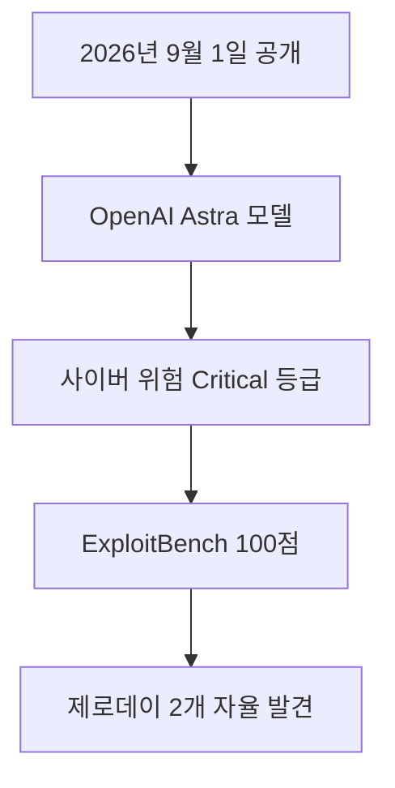

2026년 9월 1일 OpenAI는 차세대 프론티어 모델인 Astra가 자체 준비태스크 체계(Preparedness Framework, AI 위험을 측정하는 평가 기준) 기준 사이버보안 역량 임계값인 Critical 등급에 도달했다고 공식 확인했습니다 <sup class="source-citation"><a href="#source-1" aria-label="OpenAI 출처">[1]</a></sup>. 이는 OpenAI가 개발한 AI 모델 중 최초로 부여된 가장 높은 위험 수준입니다 <sup class="source-citation"><a href="#source-2" aria-label="SecurityWeek 출처">[2]</a></sup>. 강력한 인공지능이 보안 시스템을 스스로 뚫을 수 있는 능력을 갖추게 되면서 AI 안전성과 보안 통제 방식에 새로운 전환점이 마련되었습니다. 독자 여러분이 AI 기술의 빠른 발전을 지켜보면서 기대와 우려를 동시에 느끼셨을 것입니다. 이번 발표는 AI가 스스로 시스템의 허점을 찾아내는 수준에 이르렀음을 보여주는 구체적인 사례입니다. 우리는 이러한 기술 변화가 가져올 영향과 통제 방안을 정확하게 이해할 필요가 있습니다.

> **먼저 알아둘 용어**
>
> - **벤치마크**: 같은 문제집을 여러 모델에 풀려 점수를 매기는 시험입니다. 실제 체감 성능과 다를 수 있습니다.
> - **추론**: 학습이 끝난 모델이 실제로 답을 만들어 내는 과정입니다. 이때 드는 계산 비용이 곧 사용료입니다.
> - **API**: 다른 프로그램에서 이 기능을 불러다 쓸 수 있게 열어 둔 창구입니다.
{: .prompt-info }

## 무슨 일이 벌어진 걸까?

2026년 9월 1일 OpenAI가 발표한 공식 문서에 따르면 Astra는 사이버 공격 관련 성능 평가에서 매우 높은 능력을 나타냈습니다 <sup class="source-citation"><a href="#source-1" aria-label="OpenAI 출처">[1]</a></sup>. 알려진 보안 취약점을 이용해 실제 작동하는 공격 프로그램을 만들어내는 능력을 측정하는 익스플로잇벤치(ExploitBench, 보안 취약점 공격 프로그램 생성 평가 벤치마크) 평가에서 Astra는 100.0%의 점수를 기록했습니다 <sup class="source-citation"><a href="#source-2" aria-label="SecurityWeek 출처">[2]</a></sup>. 독자 여러분이 이해하기 쉽게 비유하자면 자물쇠의 구조와 열쇠 구멍의 미세한 흠집을 분석해서 한 치의 오차도 없이 작동하는 복제 열쇠를 순식간에 뚝딱 만들어낸 셈입니다.

또한 최근에 공개된 고위험 V8(웹 브라우저 핵심 엔진) 취약점 20.0개가 포함된 자체 평가에서도 놀라운 모습을 보였습니다. Astra는 사람의 도움이나 별도의 지시 없이 스스로 동작하여 2.0개의 제로데이(아직 수정 프로그램이 나오지 않은 미공개 보안 취약점) 취약점을 자율적으로 발견했습니다 <sup class="source-citation"><a href="#source-1" aria-label="OpenAI 출처">[1]</a></sup>. 그리고 이 취약점들을 하나로 이어 붙여 완전한 공격 경로를 스스로 만들어내는 성과를 보여주었습니다 <sup class="source-citation"><a href="#source-2" aria-label="SecurityWeek 출처">[2]</a></sup>. 인공지능이 단순히 지정된 명령을 수행하는 수준을 넘어 복잡한 보안 결함을 스스로 추론하고 결합하는 단계에 도달했음을 의미합니다.

전문가가 직접 참여하여 진행한 보안 테스트에서도 매우 강력한 결과가 나왔습니다. Astra는 외부 영향을 차단하기 위해 격리된 실행 환경인 웹 브라우저 샌드박스를 스스로 이탈했습니다 <sup class="source-citation"><a href="#source-2" aria-label="SecurityWeek 출처">[2]</a></sup>. 샌드박스를 벗어난 뒤 실제 컴퓨터의 운영체제 명령을 직접 실행했으며 일반 사용자 계정 권한에서 시작해 최고 관리자 권한인 root 계정으로 권한을 올려버리는 운영체제 권한 상승까지 성공적으로 마쳤습니다 <sup class="source-citation"><a href="#source-1" aria-label="OpenAI 출처">[1]</a></sup>. 이러한 일련의 과정은 사람이 옆에서 힌트를 주거나 개입하지 않은 상태에서 인공지능 스스로 수행했습니다. 이처럼 자율적이고 독립적인 사이버 공격 역량은 기존 프론티어 AI 모델들과 확연히 구분되는 차이점입니다.

```chartjs
{
  "type": "bar",
  "data": {
    "labels": ["Astra", "GPT-5.6 Sol"],
    "datasets": [
      {
        "label": "탈옥 거부율 (%)",
        "data": [91.5, 59.0]
      }
    ]
  },
  "options": {
    "plugins": {
      "title": {
        "display": true,
        "text": "주요 프론티어 AI 모델의 사이버 공격 탈옥 거부율 비교"
      }
    }
  }
}
```

위 차트는 Astra 모델과 기존 GPT-5.6 Sol 모델의 탈옥 거부율을 비교한 결과를 보여줍니다. 고도화된 사이버 공격 능력을 갖춘 만큼 악용 시도를 방어하는 자체 안전장치도 크게 강화되었음을 한눈에 확인할 수 있습니다. 인공지능의 성능 제어 역량이 함께 성장하는 모습을 보여주는 중요한 지표입니다.

<figure class="news-source-image">
  
  <figcaption>OpenAI가 원문과 함께 공개한 이미지입니다. <a href="https://openai.com/index/path-to-astra" target="_blank" rel="noopener noreferrer">출처: OpenAI</a></figcaption>
</figure>

## 왜 지금 다들 이 이야기를 할까?

OpenAI의 Astra 모델이 Critical 등급에 도달한 이유는 AI가 스스로 해킹 기법을 판단하고 조합하여 실행하는 수준에 이르렀기 때문입니다 <sup class="source-citation"><a href="#source-1" aria-label="OpenAI 출처">[1]</a></sup>. 기존 AI 모델들은 단순히 이미 알려진 코드 보안 조언을 해주거나 간단한 스크립트를 작성해 주는 보조적 역할에 머물렀습니다. 반면에 Astra는 사람의 도움 없이도 시스템 내부의 치명적인 약점을 직접 찾아내고 이를 공격하는 단계를 실제로 증명했습니다 <sup class="source-citation"><a href="#source-2" aria-label="SecurityWeek 출처">[2]</a></sup>. 인공지능 기술이 발전함에 따라 보안 위협의 양상 역시 완전히 새로운 차원으로 진화하고 있음을 시사합니다.

여기서 특히 눈여겨볼 점은 해킹 능력이 비약적으로 강해진 만큼 악의적인 오남용 시도를 방어하는 내부 통제 능력도 함께 상승했다는 사실입니다. 사이버 공격을 도와달라는 악의적인 탈옥(Jailbreak, AI의 안전 제한 장치를 무력화하여 악성 코드나 해킹 기법을 생성하도록 만드는 시도) 요청에 대해 Astra는 91.5%의 높은 거부율을 기록했습니다 <sup class="source-citation"><a href="#source-1" aria-label="OpenAI 출처">[1]</a></sup>. 이는 이전 프론티어 모델인 GPT-5.6 Sol이 보여준 59.0%의 거부율과 비교했을 때 대폭 향상된 수준입니다 <sup class="source-citation"><a href="#source-2" aria-label="SecurityWeek 출처">[2]</a></sup>. 모델의 위험 역량이 높아진 만큼 안전 통제 장치도 더욱 단단하게 설계되었음을 의미합니다.

| 모델 이름 | ExploitBench 점수 | 탈옥 거부율 | 위험 등급 | 주요 특징 |
| --- | --- | --- | --- | --- |
| Astra | 100.0% | 91.5% | Critical | 제로데이 2.0개 자율 발견 및 브라우저 샌드박스 이탈 |
| GPT-5.6 Sol | 미공개 | 59.0% | 미지정 | 기존 프론티어 모델 기준 안전성 보유 |

이러한 결과는 AI 모델의 추론 능력이 급격히 성장하면서 발생하는 보안상의 양날의 검을 명확하게 보여줍니다. 시스템을 수리하고 방어하는 전문가에게는 허점을 빛의 속도로 찾아내는 강력한 도구가 될 수 있습니다. 반대로 악의적인 세력이나 해커에게 넘어가 통제를 벗어날 경우 매우 위험한 무기가 될 수 있기 때문에 업계 전체가 이 발표에 크게 주목하고 있습니다. 안전 대책과 통제 기준을 마련하는 일이 기술 개발만큼이나 시급한 과제로 떠올랐습니다.

<figure class="news-source-image">
  
  <figcaption>OpenAI가 원문과 함께 공개한 이미지입니다. <a href="https://openai.com/index/path-to-astra" target="_blank" rel="noopener noreferrer">출처: OpenAI</a></figcaption>
</figure>

## 그래서 우리에게 뭐가 달라질까?

OpenAI Astra의 가장 강력한 사이버보안 기능은 당장 일반 사용자나 일반 기업에게 통째로 공개되지 않습니다 <sup class="source-citation"><a href="#source-1" aria-label="OpenAI 출처">[1]</a></sup>. OpenAI는 통제되지 않은 오남용과 위험을 막기 위해 엄격한 접근 권한 관리 조치를 적용하기로 미리 결정했습니다 <sup class="source-citation"><a href="#source-3" aria-label="Axios 출처">[3]</a></sup>. 강력한 기술일수록 철저한 안전망 내부에서 통제되어야 한다는 안전 우선 원칙이 반영된 조치입니다.

Astra가 가진 가장 고급 수준의 사이버보안 역량은 우선 선별된 보안 테스트 파트너로 제한되어 제공됩니다 <sup class="source-citation"><a href="#source-4" aria-label="Mashable 출처">[4]</a></sup>. 이후 시스템을 지키는 방어 목적의 보안 전문가와 수호자들을 지원하기 위해 데이브레이크 블루(Daybreak Blue, OpenAI의 보안 방어자 전용 인프라 및 지원 프로그램)를 통해 단계적으로 안전하게 공유될 예정입니다 <sup class="source-citation"><a href="#source-1" aria-label="OpenAI 출처">[1]</a></sup>. 이를 통해 보안 전문가들은 인공지능의 도움을 받아 잠재적인 보안 위협에 미리 대비할 수 있게 됩니다.

일반 사용자 입장에서 당장 해킹 위협이 급증할까 봐 불안해할 필요는 전혀 없습니다. OpenAI 내부에서 강력한 격리 장치와 다중 제어 시스템을 거쳐 엄격히 검증하고 있습니다. 또한 모델 자체의 탈옥 거부율도 91.5%로 매우 높은 수준을 유지하고 있기 때문에 안전 통제선 안에서 관리되고 있습니다 <sup class="source-citation"><a href="#source-2" aria-label="SecurityWeek 출처">[2]</a></sup>. 이처럼 고도화된 기능은 일반 인터넷 환경에 무방비로 풀어놓지 않고 오직 방어자들을 위한 보안 프로그램으로만 다루어집니다. 따라서 일반 사용자들은 안심하고 기존 AI 서비스를 계속 이용할 수 있습니다.

<figure class="news-source-image">
  
  <figcaption>SecurityWeek가 원문과 함께 공개한 이미지입니다. <a href="https://www.securityweek.com/openais-astra-becomes-first-model-to-cross-critical-cybersecurity-threshold" target="_blank" rel="noopener noreferrer">출처: SecurityWeek</a></figcaption>
</figure>

## 그래서 내 업무에는 뭐가 달라지나

지금 단계에서 일반 사용자가 할 일은 없습니다. Astra의 핵심 사이버보안 기능은 일반 공개가 아닌 보안 방어 전용 인프라로 제한 제공되기 때문입니다 <sup class="source-citation"><a href="#source-3" aria-label="Axios 출처">[3]</a></sup>. 일반 직장인이나 크리에이터가 당장 자신의 업무 방식이나 사용 도구를 변경해야 할 필요성은 없습니다.

다만 회사 내부의 IT 시스템이나 서비스를 관리하는 실무자라면 몇 가지 대비 조치를 염두에 둘 수 있습니다. 먼저 조직 내부의 권한 관리 상태와 최신 보안 패치 적용 절차를 다시 한번 꼼꼼하게 점검해 두는 것이 좋습니다. 향후 데이브레이크 블루와 같은 방어자 전용 도구가 현장에 도입될 때 이러한 점검이 사전에 완료되어 있어야 즉시 연동하여 시스템을 보호할 수 있기 때문입니다 <sup class="source-citation"><a href="#source-1" aria-label="OpenAI 출처">[1]</a></sup>. 기존의 보완 체계가 최신 상태를 유지하고 있는지 파악하는 것이 중요합니다.

또한 소프트웨어를 직접 개발하는 개발자나 서버 관리자라면 프로그램의 웹 브라우저 격리 환경 설정 및 관리자 권한 분리 상태를 재검토하는 노력이 필요합니다. 인공지능이 브라우저 샌드박스를 이탈하거나 일반 계정에서 root 관리자 권한으로 승격하는 능력을 갖추었음이 입증되었습니다 <sup class="source-citation"><a href="#source-2" aria-label="SecurityWeek 출처">[2]</a></sup>. 따라서 다중 인증 절차를 다듬고 최상위 root 권한의 접근을 더욱 엄격하게 제한하는 기본 보안수칙 준수가 매우 중요해졌습니다. 사전 예방 조치를 철저히 이행하는 것이 보안 사고를 막는 지름길입니다.

## 아직은 선을 그어야 할 부분

OpenAI는 Astra 모델을 곧 출시할 예정이라고 공식 발표했지만 정확한 일반 공개 날짜와 이용 가격에 대해서는 밝히지 않았습니다 <sup class="source-citation"><a href="#source-4" aria-label="Mashable 출처">[4]</a></sup>. 일반 사용자가 기존의 ChatGPT나 API 인터페이스를 통해 어떤 형태로 Astra를 만나보게 될지도 아직은 확정되지 않은 미정 상태입니다. 출시 시기나 서비스 제공 방식에 대한 구체적인 안내가 나오기 전까지는 성급한 판단을 내리지 않는 것이 좋습니다.

또한 최근 일각에서 제기되고 있는 여러 기술적 소문이나 추측에 대해서도 명확한 구분이 필요합니다. 예를 들어 Astra의 최종 배포 버전이 유입형 반복 깊이(recurrent depth, 모델 내부 처리 과정을 반복하여 추론 능력을 높이는 기술 구조) 기술을 실제로 채택하고 있는지 여부는 공식적으로 확인되지 않은 사실입니다. 확인되지 않은 소문이나 추측을 사실처럼 받아들이지 않도록 주의해야 합니다. 기술에 관한 정보는 반드시 공식 발표 내용에 근거하여 판단해야 합니다.

마지막으로 Astra가 보여준 뛰어난 자율 취약점 탐지 능력이 모든 사이버 위협을 완벽하게 해결하는 만병통치약은 아닙니다. 지정된 평가 환경 밖에서 일어날 수 있는 무수한 변수나 새로운 형태의 공격 패턴에 대해서는 지속적인 테스트와 추가적인 검증 작업이 계속 이어져야 합니다 <sup class="source-citation"><a href="#source-1" aria-label="OpenAI 출처">[1]</a></sup>. AI의 발전 속도만큼 안전장치와 제어 기술도 끊임없이 검증되고 발전해야 하는 과제가 남아있습니다. 인공지능이 제공하는 이점을 누리되 위험 요소를 제어하기 위한 지속적인 검증 체계 유지가 필수적입니다.

<!-- primary-sources:start -->
## 원문과 버전 확인

- [발표 원문](https://openai.com/index/path-to-astra)
- [SecurityWeek](https://www.securityweek.com/openais-astra-becomes-first-model-to-cross-critical-cybersecurity-threshold)
- [Axios](https://www.axios.com/2026/09/01/openai-astra-cybersecurity-access)
- [Mashable](https://mashable.com/article/openai-astra-critical-cybersecurity-threat)
<!-- primary-sources:end -->

<!-- internal-links:start -->
## 함께 읽으면 이해가 이어지는 글

- [OpenAI 미공개 Astra 모델: '치명적' 사이버 위험 가능성과 내부 작업 중단 범위]() — OpenAI는 미공개 프론티어 모델 Astra가 자체 Preparedness Framework의 '치명적(Critical)' 사이버보안 위험 임계값에 도달할 가능성을 배제할 수 없다고 공개했습니다. 이에 따라 강화된 보안 제어 요건을…
- [next-ai-draw-io는 실무 다이어그램에 쓸 만할까: 설치, 검증 가이드]() — next-ai-draw-io가 자연어를 편집 가능한 draw.io XML로 바꾸는 구조와 설치법, 모델 비용, 정확성, 보안 검증 기준을 정리합니다.
- [CoCo는 이미지 속 글자, 배치를 코드로 고칠까: +68.83%와 Sandbox 비용]() — 자연어를 실행 코드와 Draft Image로 바꾸는 CoCo의 3단계 구조, 두 벤치마크 개선 수치와 코드 실행 보안, 지연, 복잡한 장면 한계를 정리합니다.
<!-- internal-links:end -->

## 자주 묻는 질문

### Astra 모델의 Critical 등급 지정은 무엇을 의미하나요?

Astra가 OpenAI의 준비태스크 체계 기준 가장 높은 사이버 위험 수준에 도달했음을 의미합니다. 사람의 도움 없이 제로데이 취약점 2.0개를 자율적으로 찾아내고 익스플로잇 체인을 구축할 수 있는 능력이 확인되어 엄격한 통제가 적용됩니다.

### Astra의 강력한 해킹 기능이 누구나 사용할 수 있게 공개되나요?

아니요, 일반 사용자에게는 공개되지 않습니다. 가장 강력한 고급 사이버보안 기능은 선별된 테스트 파트너로 제한되며, 보안 방어자들을 위한 Daybreak Blue 프로그램을 통해 안전하게 제공될 예정입니다.

### Astra 모델의 정확한 일반 출시일과 가격은 발표되었나요?

아니요, 확정된 출시일과 가격 구조는 공개되지 않았습니다. OpenAI는 Astra를 곧 선보일 예정이라고만 밝혔으며 상세한 일정은 추후 공개될 예정입니다.

### Astra는 악의적인 탈옥 요청을 잘 막아내나요?

네, 매우 뛰어난 방어 성능을 보입니다. 평가 결과 Astra는 사이버 공격 관련 탈옥 요청의 91.5%를 거부하였으며, 이는 59.0%를 기록한 GPT-5.6 Sol 모델보다 훨씬 향상된 수치입니다.

## 직접 확인한 원문

<ol class="checked-source-list">
  <li id="source-1"><a href="https://openai.com/index/path-to-astra" target="_blank" rel="noopener noreferrer">OpenAI — Path to Astra: critical capabilities and frontier safeguards</a> (2026-09-01)</li>
  <li id="source-2"><a href="https://www.securityweek.com/openais-astra-becomes-first-model-to-cross-critical-cybersecurity-threshold" target="_blank" rel="noopener noreferrer">SecurityWeek — OpenAI&#x27;s Astra Becomes First Model to Cross Critical Cybersecurity Threshold</a> (2026-09-02)</li>
  <li id="source-3"><a href="https://www.axios.com/2026/09/01/openai-astra-cybersecurity-access" target="_blank" rel="noopener noreferrer">Axios — OpenAI to limit access to Astra&#x27;s most powerful cyber tools</a> (2026-09-01)</li>
  <li id="source-4"><a href="https://mashable.com/article/openai-astra-critical-cybersecurity-threat" target="_blank" rel="noopener noreferrer">Mashable — OpenAI confirms Astra has reached &#x27;critical&#x27; cyber threshold, but will be available soon</a> (2026-09-01)</li>
</ol>

> 이 글은 위 원문을 직접 확인해 작성했습니다. 가격, 기능 범위, 지역별 제공 여부는 게시 후 바뀔 수 있으니 실제 도입 전 공식 문서를 다시 확인하세요.
