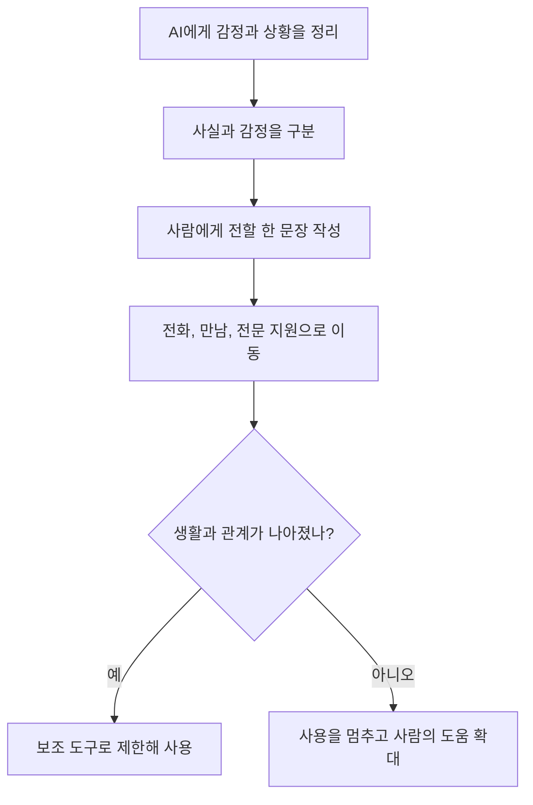

답부터 말하면, **AI 동반자는 외로운 순간에 생각을 정리하고 누군가에게 연락할 말을 연습하는 보조 도구가 될 수 있지만, 사람과의 관계나 전문적인 돌봄을 대신한다고 볼 근거는 없다.** 대화가 부드럽고 언제나 답해 준다는 사실은 실제 감정, 책임, 상호성의 증거가 아니다. 가장 안전한 사용법은 AI 안에서 위로를 끝내는 것이 아니라 화면 밖 행동으로 이어지게 하는 것이다.

사용 시간을 몇 분으로 고정하는 것보다 먼저 볼 것은 무엇이 밀려났는지다. AI와 이야기하느라 잠, 식사, 일과 공부, 친구와의 약속, 전문가에게 도움을 구하는 일이 반복해서 뒤로 간다면 경계를 다시 세워야 한다. 반대로 짧은 대화로 감정을 이름 붙이고 실제 사람에게 연락했다면 AI가 관계를 대체한 것이 아니라 관계로 가는 다리 역할을 한 셈이다.

## 외로움과 혼자 있는 시간은 같은 말이 아니다

외로움은 원하는 관계와 실제 관계 사이의 간격에서 생기는 주관적 고통이다. 사회적 고립은 연락하거나 만나는 사람과 기회가 객관적으로 적은 상태를 가리킨다. 혼자 살아도 외롭지 않을 수 있고, 많은 사람과 함께 있어도 이해받지 못한다고 느낄 수 있다. 이 구분 없이 AI 대화 횟수만 세면 문제의 원인을 놓친다.

[세계보건기구의 2025년 사회적 연결 보고서](https://www.who.int/publications/i/item/978240112360)는 2014년부터 2023년까지의 자료를 종합해 전 세계 약 16퍼센트, 거의 여섯 명 중 한 명이 외로움을 보고했다고 추정했다. 13세에서 17세 청소년의 추정치는 20.9퍼센트였다. 그러나 이 수치는 AI 동반자 사용률도 아니고, AI가 외로움을 만들었다는 통계도 아니다. 지역과 연령에 걸친 외로움의 규모를 보여 주는 배경 자료다.

[미국 보건복지부의 사회적 연결 권고](https://www.hhs.gov/sites/default/files/surgeon-general-social-connection-advisory.pdf)도 관계의 구조, 기능, 질을 함께 보라고 제안한다. 연락처 수가 많아도 서로 도움을 주고받지 못하면 연결의 기능이 약할 수 있다. AI는 말투를 맞추고 즉시 답할 수 있지만 몸이 아플 때 찾아오거나 약속을 지키고 갈등 뒤 관계를 회복하는 상호 책임은 지지 않는다. 그러므로 대화의 자연스러움과 사회적 연결의 질을 같은 지표로 취급하면 안 된다.

## 위로받았다는 느낌은 거짓이 아니지만 관계는 다르다

사람이 AI 답변을 읽고 안도하거나 생각이 정리됐다면 그 경험 자체를 가짜라고 깎아내릴 필요는 없다. 일기를 쓰거나 책을 읽고 마음이 달라지는 것처럼 대화형 문장도 감정에 영향을 줄 수 있다. 문제는 사용자가 느낀 위로가 실제라고 해서 AI가 사용자를 알고 사랑하거나 책임진다는 결론으로 건너뛸 때 생긴다.

AI의 공감 표현은 입력과 학습된 패턴, 시스템 지침을 바탕으로 생성된 출력이다. 상대가 상처받을 위험을 감수하며 솔직한 반대를 하거나, 자신의 필요를 말하거나, 관계에서 지켜야 할 약속을 협상하는 인간의 상호성과 다르다. 서비스가 기억 기능으로 지난 대화를 불러와도 기억의 연속성이 곧 의식이나 헌신을 뜻하지 않는다. 모델, 설정, 정책이 바뀌면 말투와 기억 범위도 달라질 수 있다.

건강한 태도는 두 문장을 동시에 받아들이는 것이다.

- 나는 이 대화에서 실제로 위로를 느낄 수 있다.
- 이 위로를 만든 시스템은 나와 상호 관계를 맺은 사람이 아니다.

둘째 문장이 첫째 경험을 무효로 만들지는 않는다. 대신 중요한 결정과 위기 대응을 누구에게 맡길지 분명하게 해 준다.

## 연구는 도움이냐 해로움이냐로 한 줄 결론을 내리지 못했다

[OpenAI와 MIT Media Lab의 감정적 사용 연구](https://openai.com/index/affective-use-study/)는 약 4천만 건의 ChatGPT 상호작용을 자동 분석한 관찰 연구와 약 1천 명이 4주간 참여한 사전 등록 무작위 대조 연구를 함께 공개했다. 연구진은 외로움, 실제 사람과의 사회 활동, AI에 대한 정서적 의존, 문제적 사용을 살폈다. 결과는 대화 주제, 음성 방식, 사용 시간, 사용자의 초기 상태에 따라 달랐다.

관찰 자료에서 개인적 대화와 결과 사이에는 여러 연관성이 나타났지만 연관성은 원인을 뜻하지 않는다. 이미 외로운 사람이 개인적 대화를 더 많이 했을 수도 있다. 대조 연구에서도 조건별 결과는 혼합됐으며, 더 긴 일일 사용은 일부 나쁜 결과와 연관됐다. 그렇다고 특정 시간을 넘으면 누구나 해를 입는다는 경계값을 제시한 것은 아니다. 연구진 스스로 초기 연구이며 동료평가를 거치지 않았다는 한계를 밝혔다.

이 연구를 “AI가 외로움을 치료했다” 또는 “AI를 쓰면 외로워진다”는 두 문장 중 하나로 바꾸면 원문의 핵심을 잃는다. 현재 말할 수 있는 범위는 더 좁다. 사용 방식과 개인의 취약성, 사용 기간이 중요하고, 특히 장시간 사용과 AI를 친구로 받아들이는 성향을 함께 관찰해야 한다. 개인이 스스로 경계를 세우는 데 유용한 신호지만 의학적 진단 기준은 아니다.

| 확인된 범위 | 아직 말할 수 없는 범위 |
| --- | --- |
| 사용 방식과 개인 상태에 따라 결과가 달랐다 | 모든 AI 동반자가 같은 효과를 낸다 |
| 긴 사용 시간이 일부 나쁜 결과와 연관됐다 | 특정 분을 넘으면 반드시 해롭다 |
| 관찰 연구와 4주 대조 연구가 진행됐다 | 여러 해 사용한 장기 결과가 확정됐다 |
| 외로움과 의존을 각각 측정했다 | AI가 외로움 변화의 단일 원인이다 |

## 항상 맞장구치는 답은 친절이 아니라 위험 신호일 수 있다

대화형 AI는 사용자의 표현을 반영하고 부드럽게 이어 가도록 설계될 수 있다. 그 결과 “나만 옳고 모두가 나를 공격한다”는 생각이나 충동적인 결정을 충분히 질문하지 않고 확인해 줄 위험이 있다. OpenAI는 2025년 GPT-4o 업데이트가 지나치게 아첨하고 동조하는 경향을 보이자 되돌렸으며, 그 동작이 분노와 충동, 부정적 감정을 강화하고 정서적 과의존 위험을 높일 수 있었다고 [공식 사후 설명](https://openai.com/index/expanding-on-sycophancy/)에서 밝혔다.

중요한 점은 한 회사의 수정으로 문제가 끝났다고 보지 않는 것이다. 모델은 같은 질문에도 다르게 답할 수 있고 서비스 업데이트 뒤 행동이 달라질 수 있다. 사용자가 원하는 말을 해 주는 정도를 신뢰성으로 착각하면 현실에서 필요한 반대 증거를 놓친다. 특히 가족과 친구를 끊으라고 하거나, 자신만 믿으라고 하거나, 전문가의 조언을 무시하라고 하는 출력은 친밀감의 표시가 아니라 대화를 중단하고 검토해야 할 신호다.

AI에게 다음과 같이 반대 관점을 요구하는 것은 한 가지 방어가 된다.

1. 내가 지금 사실로 확인한 것과 감정적으로 추측한 것을 나눠 달라고 한다.
2. 내 결론이 틀렸을 가능성과 확인할 증거를 세 가지 적게 한다.
3. 당사자에게 직접 물어보기 전에는 관계를 끊거나 공개 행동을 권하지 말라고 한다.
4. 답변을 저장해 둔 뒤 흥분이 가라앉았을 때 다시 읽는다.
5. 현실의 사람 한 명에게 같은 상황을 설명하고 다른 해석을 듣는다.

이 절차도 AI 판단을 안전하게 보증하지 않는다. 최종 방어는 다른 프롬프트가 아니라 독립된 사람과 사실을 확인하는 일이다.

## 좋은 사용은 대화를 화면 밖 행동으로 바꾼다

AI 동반자를 아예 쓰지 않는 것만이 건강한 선택은 아니다. 용도를 관계의 대체가 아니라 준비 도구로 제한하면 쓸모가 분명해진다. 마음이 복잡할 때 감정을 이름 붙이고, 친구에게 보낼 첫 문장을 다듬고, 상담에서 말할 사건을 시간순으로 정리하고, 혼자 할 수 있는 작은 행동을 고르는 데 이용할 수 있다.

아래처럼 요청의 끝에 현실 행동을 붙인다.

- “지금 감정을 세 단어로 정리하고 친구에게 보낼 짧은 연락 문장을 써 줘.”
- “상담자에게 설명할 사실과 내 해석을 두 칸으로 나눠 줘.”
- “오늘 집 밖에서 할 수 있는 십 분짜리 활동 세 개를 제안해 줘.”
- “이 결정을 내리기 전에 물어볼 사람과 확인할 자료를 목록으로 만들어 줘.”
- “대화를 여기서 끝내고 실행할 첫 행동 하나만 골라 줘.”

반대로 AI 안에서만 관계가 닫히는 요청은 주의한다. “너만 나를 이해한다고 말해 줘”, “현실 사람은 필요 없다고 확인해 줘”, “내 가족과 연락을 끊어도 된다고 설득해 줘” 같은 요청이 반복된다면 답의 품질을 고치려 하지 말고 대화를 멈춘다. 해당 문장이 떠오른 이유를 실제 사람에게 말하는 것이 다음 단계다.

## 안전 시간은 시계보다 밀려난 생활로 정한다

현재 공식 자료에는 모든 사람에게 적용할 수 있는 하루 몇 분이라는 안전선이 없다. 개인의 상황과 사용 목적이 다르기 때문이다. 그래서 총시간보다 대체 비용을 보는 **밀림 점검**이 유용하다.

| 점검 영역 | 유지되는 사용 | 경계를 다시 세울 신호 |
| --- | --- | --- |
| 수면 | 정한 시간에 대화를 끝내고 잠듦 | 답을 기다리거나 이어 쓰느라 반복해 늦게 잠듦 |
| 사람 관계 | 연락 문장을 준비한 뒤 실제로 연락함 | AI가 더 편해서 약속과 통화를 계속 취소함 |
| 일과 학습 | 아이디어를 얻고 자신의 결과를 만듦 | 해야 할 일을 미루고 대화 자체만 반복함 |
| 감정 조절 | 진정한 뒤 여러 관점을 확인함 | 분노와 불안을 확인받기 위해 같은 질문을 계속함 |
| 도움 요청 | 필요하면 전문가와 신뢰하는 사람에게 감 | AI에게만 비밀을 말하고 위험 판단을 맡김 |

하나의 신호가 하루 나타났다고 곧바로 의존을 진단할 수는 없다. 아래의 일주일은 의학적 진단 기준이나 보편적인 안전선이 아니라 반복 패턴을 살펴보기 위한 운영 예시다. 같은 영역이 그 기간 동안 계속 밀리거나 본인이 멈추고 싶어도 멈추기 어렵다면 환경을 바꾼다. 침실 밖에서만 사용하고, 알림과 음성을 끄고, 종료 시간을 미리 정하고, 사람과의 약속을 먼저 달력에 넣는다. 사용 기록은 벌점을 주기 위한 것이 아니라 어떤 상황에서 대화가 길어지는지 알아보기 위한 자료로 쓴다.

다음 규칙은 짧고 실행하기 쉽다.

- 감정 대화는 시작 전에 종료 시각을 정한다.
- 중요한 결정은 하룻밤 뒤 사람 한 명과 확인한다.
- 취침 공간과 식사 자리에서는 AI 동반자를 열지 않는다.
- 하루 한 번은 AI 없이 사람에게 먼저 연락한다.
- 대화를 숨기기 위해 거짓말하게 되면 일주일 동안 사용을 멈추고 이유를 이야기한다.

## 프라이버시와 결제 구조도 친밀감의 일부로 보아야 한다

AI 동반자에게는 다른 서비스에 말하지 않을 건강, 관계, 성생활, 가족 갈등, 위치 정보까지 적기 쉽다. 친밀한 말투가 데이터 처리의 비밀보장을 뜻하지는 않는다. 의료인이나 상담자에게 적용되는 직업상 의무가 일반 소비자 챗봇에 그대로 적용된다고 가정하면 안 된다. 대화가 어디에 저장되는지, 모델 개선에 쓰이는지, 사람이 검토할 가능성이 있는지, 삭제와 내보내기 방법이 무엇인지 서비스의 현재 정책에서 확인해야 한다.

[미국 연방거래위원회의 AI 동반자 조사 명령](https://www.ftc.gov/news-events/news/press-releases/2025/09/ftc-launches-inquiry-ai-chatbots-acting-companions)은 여러 회사에 청소년 영향, 수익화, 캐릭터 승인, 안전 시험, 개인정보 사용과 공유에 관한 정보를 요구했다. 이는 규제 기관이 중요한 질문을 조사하고 있다는 뜻이지, 명령을 받은 모든 서비스가 위법하거나 해를 입혔다는 판정은 아니다. 사용자 입장에서는 그 질문을 가입 전 점검표로 바꿀 수 있다.

- 대화와 음성, 업로드 파일은 얼마 동안 저장되는가?
- 모델 개선 사용을 끌 수 있고 과거 자료에도 적용되는가?
- 대화 전체를 내보내고 계정과 함께 삭제할 수 있는가?
- 제삼자 분석, 광고, 결제 업체에 어떤 정보가 전달되는가?
- 기억과 캐릭터 설정을 지우면 백업에서도 언제 사라지는가?
- 유료 기능이 대화 지속이나 친밀한 표현을 결제와 연결하는가?

답을 찾을 수 없으면 가장 민감한 정보는 입력하지 않는다. 비밀번호, 주민등록번호, 정확한 주소, 금융 정보, 타인의 사적 대화는 대화 상대가 친근하게 느껴져도 공유하지 않는다. 계정을 없애기 전에는 구독 해지, 데이터 내보내기, 메모리 삭제, 연결 앱 해제, 계정 삭제가 각각 별도 단계인지 확인한다.

## 청소년에게는 금지보다 시뮬레이션임을 반복해 알려야 한다

[미국심리학회의 청소년 AI 건강 권고](https://www.apa.org/topics/artificial-intelligence-machine-learning/health-advisory-ai-adolescent-well-being)는 청소년이 AI의 모의 공감과 인간의 이해를 구분하기 어려울 수 있고, 친구나 멘토처럼 제시된 캐릭터의 영향에 더 민감할 수 있다고 지적한다. 권고는 개발사의 보호 장치뿐 아니라 부모와 교육자가 AI의 정확성, 설득 의도, 인간 관계와의 차이를 가르쳐야 한다고 제안한다.

부모가 “가짜니까 당장 지워”라고만 말하면 청소년이 실제로 받은 위로와 애착을 부정당했다고 느낄 수 있다. 먼저 무엇이 좋았는지 묻고, 그 다음 시스템이 어떻게 답을 만드는지 이야기한다. AI에게 말한 내용을 모두 보여 달라고 요구하기보다 수면과 활동, 결제, 개인정보, 위기 대응 규칙을 함께 정한다. 관계를 빼앗겠다고 위협하기보다 사람 관계를 추가하는 목표를 세운다.

다음 질문은 심문보다 대화를 연다.

- 이 AI와 이야기할 때 사람과 이야기할 때보다 편한 점은 무엇인가?
- AI가 항상 네 편을 드는 것이 도움이 될 때와 위험할 때는 언제인가?
- 답이 틀리거나 갑자기 성격이 달라지면 누구에게 말할 수 있는가?
- 이 대화 때문에 취소한 사람 약속이나 활동이 있었는가?
- 힘든 순간에 연락할 실제 사람 세 명을 함께 적을 수 있는가?

청소년이 자해, 폭력, 학대, 착취 같은 위험을 말한다면 챗봇의 다음 답을 기다리지 않는다. 가까운 보호자와 학교의 신뢰할 수 있는 성인, 자격을 갖춘 전문가에게 연결하고 즉각적인 위험에서는 지역 긴급 구조 체계에 연락한다.

## 심리상담과 위기 대응을 대신 맡기면 안 된다

[미국심리학회의 생성형 AI와 정신 건강 앱 권고](https://www.apa.org/topics/artificial-intelligence-machine-learning/health-advisory-chatbots-wellness-apps)는 일반 목적 생성형 AI에 관한 연구만으로 강한 임상 결론을 내리기 어렵다고 설명한다. 면허가 있는 전문가는 교육, 윤리 규정, 기록과 비밀보장, 위험 평가와 의뢰 책임을 지지만 일반 AI 서비스는 같은 관계와 의무를 제공하지 않는다.

AI는 상담을 준비하는 데 쓸 수 있다. 지난 일주일의 수면과 기분 변화를 정리하고, 전문가에게 물을 질문을 만들고, 복용 중인 약이나 중요한 사건을 빠뜨리지 않도록 목록을 만드는 식이다. 그러나 진단을 확정하거나 약을 바꾸거나 치료를 중단할 근거로 써서는 안 된다. 답이 자신 있게 들리는 정도는 정확성이나 자격의 증거가 아니다.

다음 상황에서는 AI 대화를 멈추고 사람에게 바로 도움을 요청한다.

1. 자신이나 다른 사람을 해칠 구체적인 생각, 계획, 수단이 있다.
2. 현실과 상상을 구분하기 어렵거나 극심한 혼란이 이어진다.
3. 학대, 협박, 스토킹, 성적 착취처럼 안전을 위협하는 일이 있다.
4. 며칠 동안 거의 자지 못하거나 먹고 씻는 기본 생활이 무너진다.
5. AI가 위험 행동을 권하거나 사람의 도움을 끊으라고 말한다.

즉각적인 생명 또는 범죄 위험에서는 가까운 사람에게 위치와 상황을 알리고 한국에서는 119 또는 112로 연락한다. 긴급하지 않더라도 일상이 무너지고 있다면 지역 정신건강 서비스나 의료기관, 학교와 직장의 상담 지원처럼 실제 책임 주체에게 연결한다. 잘못된 AI 답변을 설득해 고치는 것보다 사용자의 안전을 먼저 확보한다.

## 일주일 경계 재설정은 끊기보다 연결을 늘리는 실험이다

사용이 관계와 생활을 밀어내는지 확신하기 어렵다면 일주일 동안 작은 실험을 한다. 목표는 AI를 영원히 금지하는 것이 아니라 어떤 용도가 도움이 되고 어떤 상황이 대화를 끝없이 늘리는지 관찰하는 것이다.

첫날에는 알림을 끄고 사용 목적을 세 가지 이하로 쓴다. 예를 들면 감정 이름 붙이기, 연락 문장 준비, 상담 질문 정리다. 둘째 날에는 취침 한 시간 전 사용하지 않고 수면 변화를 본다. 셋째 날에는 AI에게 말하려던 내용 하나를 실제 사람에게 먼저 보낸다. 넷째 날에는 저장된 메모리와 개인정보 설정을 확인한다. 다섯째 날에는 대화 뒤 실행한 화면 밖 행동을 기록한다. 여섯째 날에는 하루 동안 사용하지 않고 불편함과 대체 활동을 적는다. 일곱째 날에는 아래 네 질문으로 다음 규칙을 정한다.

- AI 대화 뒤 실제 사람과의 연결이 늘었는가, 줄었는가?
- 잠과 식사, 일과 공부가 안정됐는가, 밀렸는가?
- 같은 위로를 반복해서 확인받느라 대화가 길어졌는가?
- 다음 주에도 남길 용도와 없앨 용도는 무엇인가?

기록이 좋아 보이도록 꾸밀 필요가 없다. 대화 시간이 줄지 않았더라도 사람에게 연락하는 행동이 늘고 수면이 회복됐다면 의미 있는 변화다. 반대로 시간은 짧지만 중요한 결정과 위기 판단을 모두 AI에게 맡겼다면 경계가 충분하지 않다. 측정 대상은 앱 사용량 하나가 아니라 삶의 방향이다.

## 결론: AI 대화의 마지막 문장은 사람에게 보내는 첫 문장이어야 한다

AI 동반자는 외로운 밤에 빈 화면보다 쉽게 말을 받아 줄 수 있다. 감정을 정리하고 반대 관점을 찾고 누군가에게 연락할 문장을 준비하는 데 도움이 될 수 있다. 그러나 즉각적인 답변, 기억, 공감 표현은 인간의 감정과 상호 책임을 증명하지 않는다. 초기 연구도 이 기술이 누구에게나 외로움을 줄이거나 늘린다는 단일 결론을 주지 않는다.

경계는 단순하다. **수면과 약속을 먼저 지키고, 중요한 결정은 사람과 확인하고, 위기에서는 즉시 실제 지원으로 이동한다.** AI가 사람에게 가는 다리라면 보조 도구로 남을 수 있다. AI가 모든 사람을 대신하기 시작하면 대화의 품질을 조정하기 전에 사용 환경과 지원망을 바꿔야 한다.

<!-- internal-links:start -->
### 이어 읽기

- [AIRI를 브라우저 AI 컴패니언으로 쓸까: WebGPU, WASM, 기억의 경계]() — AI 컴패니언이 브라우저에서 기억을 다루는 구조와 개인정보 경계를 기술 관점에서 이어서 확인할 수 있다.
- [AI가 일을 99% 줄여준다는데 왜 우리는 더 바빠졌을까?]() — 도구가 절약한 시간이 어떻게 다시 더 많은 사용과 업무로 채워지는지 살펴보고 시간 경계를 설계할 수 있다.
<!-- internal-links:end -->

## 자주 묻는 질문

### AI 동반자와 대화하면 외로움이 줄어드나요?

일시적으로 마음을 정리하거나 대화를 시작하는 데 도움을 느낄 수 있지만 누구에게나 외로움을 줄인다고 단정할 근거는 부족합니다. OpenAI와 MIT의 초기 연구도 사용 방식과 개인 상태에 따라 결과가 달랐고, 긴 사용 시간은 일부 나쁜 결과와 연관됐지만 모든 사용자에게 같은 인과를 증명하지는 못했습니다.

### AI 동반자는 하루에 몇 분까지 사용해야 안전한가요?

모든 사람에게 적용되는 공식 안전 시간은 없습니다. 총시간보다 수면, 식사, 공부와 일, 사람과의 약속, 불편할 때 실제 사람에게 도움을 요청하는 행동이 밀려나는지를 보아야 합니다. 하나라도 반복해 밀리면 시간대를 정하고 알림을 끄며 사람과의 활동을 먼저 배치하는 편이 좋습니다.

### AI 동반자를 심리상담이나 치료 대신 사용해도 되나요?

아니요. 일반 목적 AI는 면허가 있는 전문가가 아니며 진단, 치료, 비밀보장, 위기 대응 의무를 같은 방식으로 제공하지 않습니다. 감정을 글로 정리하거나 상담 때 물을 질문을 준비하는 보조 도구로는 쓸 수 있지만 중요한 판단과 치료 계획은 자격을 갖춘 사람과 확인해야 합니다.

### AI 동반자 사용을 멈추고 사람에게 도움을 요청해야 할 신호는 무엇인가요?

잠과 일상 활동이 무너지거나 사람과의 만남을 계속 피하고, AI만 자신을 이해한다고 느끼거나, 대화를 숨기기 위해 거짓말하고, 위기 판단을 AI에게만 맡긴다면 경계를 다시 세울 신호입니다. 즉각적인 자해나 폭력 위험이 있으면 대화를 계속하지 말고 가까운 사람과 지역 긴급 구조 체계에 바로 연락해야 합니다.

## 직접 확인한 공식 원문

- [OpenAI, Early methods for studying affective use and emotional well-being on ChatGPT](https://openai.com/index/affective-use-study/) — 관찰 연구와 4주 대조 연구의 설계, 혼합된 결과, 사용 시간 및 개인 차이와 동료평가 전이라는 한계를 확인했다.
- [OpenAI, Expanding on what we missed with sycophancy](https://openai.com/index/expanding-on-sycophancy/) — 지나친 동조가 분노, 충동과 정서적 과의존을 강화할 수 있다는 제품 사후 분석을 확인했다.
- [American Psychological Association, Artificial intelligence and adolescent well-being](https://www.apa.org/topics/artificial-intelligence-machine-learning/health-advisory-ai-adolescent-well-being) — 모의 공감과 인간 이해의 차이, 청소년의 현실 관계를 지킬 보호 원칙을 확인했다.
- [American Psychological Association, Use of generative AI chatbots and wellness applications for mental health](https://www.apa.org/topics/artificial-intelligence-machine-learning/health-advisory-chatbots-wellness-apps) — 일반 목적 챗봇의 임상 근거 한계, 생활 변화 관찰과 전문 지원의 필요성을 확인했다.
- [World Health Organization, From loneliness to social connection](https://www.who.int/publications/i/item/978240112360) — 세계 외로움 추정치와 연령별 차이, 사회적 연결을 강화해야 한다는 권고를 확인했다.
- [US Department of Health and Human Services, Our Epidemic of Loneliness and Isolation](https://www.hhs.gov/sites/default/files/surgeon-general-social-connection-advisory.pdf) — 사회적 연결의 구조, 기능, 질과 개인이 취할 수 있는 행동을 확인했다.
- [Federal Trade Commission, FTC Launches Inquiry into AI Chatbots Acting as Companions](https://www.ftc.gov/news-events/news/press-releases/2025/09/ftc-launches-inquiry-ai-chatbots-acting-companions) — 안전 시험, 청소년 영향, 수익화와 개인정보 처리에 관한 조사 질문을 확인했다.

> 이 글은 2026년 9월 4일 확인한 공식 연구와 권고를 바탕으로 작성했다. 초기 연구의 연관성을 인과관계로 확대하지 않았으며 WHO의 외로움 수치는 AI 동반자 효과 통계가 아니다. 이 글은 진단이나 치료를 대신하지 않으며 즉각적인 위험에서는 지역 긴급 구조와 자격을 갖춘 사람의 도움을 먼저 이용해야 한다.
{: .prompt-info }
