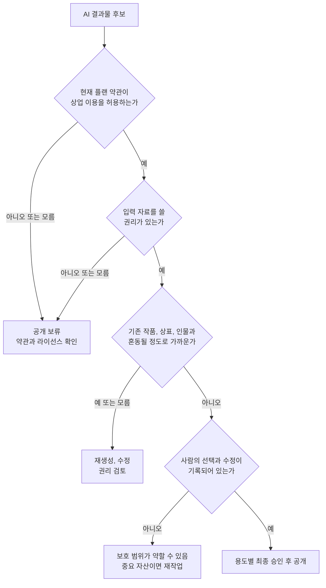

결론부터 말하면 **AI로 만들었다는 이유만으로 상업적 이용이 자동 허용되는 것도, 자동 금지되는 것도 아닙니다.** 광고, 쇼핑몰 상세 페이지, 유튜브 썸네일, 전자책에 공개하려면 서비스 약관상 이용 권한, 인간이 만든 표현의 저작권 성립 가능성, 기존 저작물과의 유사성, 상표와 초상 같은 별도 권리를 차례로 확인해야 합니다.

가장 흔한 오해는 “출력물은 사용자의 것”이라는 약관 한 줄을 면허증처럼 받아들이는 것입니다. 그 문장은 대개 서비스 제공자와 이용자 사이에서 누가 출력물에 대한 권리를 갖는지를 정합니다. 법이 보호하는 저작권이 반드시 발생한다거나 제삼자가 침해 주장을 하지 못한다는 보증은 아닙니다. **상업 공개 결정은 약관 확인에서 시작하지만 약관 확인으로 끝나지 않습니다.**

이 글은 2026년 9월 4일 확인 가능한 한국저작권위원회 안내서와 각 서비스의 공식 약관을 바탕으로 한 일반 정보입니다. 구체적인 계약, 분쟁, 등록 가능성을 확정하는 법률 자문은 아닙니다. 국가, 이용 서비스, 입력물, 편집 정도와 공개 맥락에 따라 결론이 달라질 수 있습니다.

## 상업적 이용과 저작권은 같은 질문이 아니다

“돈을 벌 수 있는가”를 묻는 상업적 이용과 “법이 창작물을 독점적으로 보호하는가”를 묻는 저작권 성립은 다른 문제입니다. 여기에 타인의 저작권 침해 여부와 상표권, 초상권, 퍼블리시티권, 개인정보 같은 권리까지 더하면 적어도 네 개의 질문이 됩니다.

| 확인 관문 | 실제 질문 | 통과했다는 뜻 | 통과해도 남는 문제 |
| --- | --- | --- | --- |
| 서비스 계약 | 현재 플랜 약관이 이 용도를 허용하는가 | 서비스가 계약 위반을 주장할 가능성을 낮춤 | 법정 권리의 성립과 제삼자 침해는 별도 |
| 내 저작권 | 사람이 결과의 표현을 창작했다고 볼 수 있는가 | 인간이 만든 범위가 보호될 가능성 | 보호 범위와 등록 심사는 사안별 판단 |
| 타인 권리 | 기존 작품을 무단으로 복제하거나 변형했는가 | 저작권 침해 위험을 낮춤 | 상표, 얼굴, 개인정보는 별도 |
| 공개 맥락 | 광고나 상품에서 소비자를 오인시키는가 | 사용 목적에 따른 위험을 낮춤 | 업종별 규정과 플랫폼 정책은 별도 |

예를 들어 약관상 판매가 가능한 AI 이미지라도 유명 캐릭터와 실질적으로 비슷하면 분쟁이 생길 수 있습니다. 반대로 권리 침해 요소가 보이지 않더라도 사람이 표현을 거의 결정하지 않은 순수 자동 생성 부분에는 내가 주장할 저작권이 약할 수 있습니다. 남이 쓰지 못하게 막을 권리가 약하다는 뜻이지, 곧바로 내가 쓸 수 없다는 뜻은 아닙니다.

## 네 관문을 순서대로 확인하라

아래 흐름은 법률 판정을 자동으로 내리는 도구가 아니라, 공개 전에 빠뜨린 질문을 찾는 운영 절차입니다. 하나라도 “모름”이면 바로 게시하지 말고 약관 원문, 원본 권리자, 사내 법무나 전문가에게 확인하는 단계로 돌려보냅니다.

순서가 중요한 이유는 뒤 단계의 노력으로 앞 단계의 결함을 고칠 수 없기 때문입니다. 사람이 정교하게 편집했더라도 무단 촬영 사진을 입력했다면 입력 단계의 권리 문제가 남습니다. 유사성 검색이 깨끗해도 무료 플랜이 영리 이용을 금지한다면 계약 문제가 남습니다.

## 한국에서 저작권이 생기는 핵심은 인간의 창작적 표현이다

[한국저작권위원회의 AI 저작권 안내서 4종](https://www.copyright.or.kr/notify/notice/view.do?brdctsno=55402)은 생성형 AI 활용 저작물, 등록, 분쟁 예방, 학습의 공정이용을 나누어 설명합니다. 위원회의 상담 사례도 AI가 만든 부분이 아니라 **인간이 창작한 표현 부분**을 중심으로 권리를 판단한다고 안내합니다.

따라서 프롬프트를 길게 썼다는 사실만 세기보다 최종 결과에서 사람이 무엇을 표현으로 결정했는지를 남겨야 합니다. 직접 촬영한 사진의 구도와 피사체가 결과에 살아 있는지, 여러 결과를 어떤 창작 기준으로 배열했는지, 색과 선과 문장을 어느 정도 다시 만들었는지, 이야기의 장면 순서와 결말을 사람이 설계했는지가 더 중요합니다.

미국 저작권청도 [AI 보고서 제2부](https://www.copyright.gov/ai/Copyright-and-Artificial-Intelligence-Part-2-Copyrightability-Report.pdf)에서 AI를 보조 도구로 쓴 것 자체는 저작권을 막지 않지만, 단순한 프롬프트 제공만으로는 부족하며 인간이 충분한 표현 요소를 결정한 범위를 살펴야 한다고 정리했습니다. 미국 기준이 한국 사건의 답은 아니지만, “AI 사용 여부”보다 “인간이 결과의 표현을 어디까지 통제했는가”를 구분하는 참고가 됩니다.

실무 기록은 다음처럼 남길 수 있습니다.

- 첫 기획서에 전달하려는 메시지, 대상, 구성과 금지 요소를 적습니다.
- 생성 후보를 전부 저장하기보다 선택 이유와 버린 이유를 짧게 남깁니다.
- 레이어가 보이는 편집 파일, 수정 전후 버전, 직접 그린 요소를 보관합니다.
- 글이라면 사실 조사표, 개요, 사람이 다시 쓴 문단과 인용 출처를 연결합니다.
- 등록이나 독점 라이선스가 중요한 자산은 공개 전에 전문가에게 보호 범위를 확인합니다.

**프롬프트 횟수는 창작성의 자동 점수가 아닙니다.** 반대로 AI가 한 부분을 정직하게 밝힌다고 해서 사람이 만든 배치, 촬영, 편집, 문장까지 보호 대상에서 모두 빠지는 것도 아닙니다. 최종물의 구성 요소별로 판단해야 합니다.

## 입력 자료의 권리부터 역으로 추적하라

결과물만 보고 시작하면 가장 큰 위험을 놓칩니다. AI에 넣은 사진, 사내 문서, 유료 스톡 이미지, 폰트, 음원, 고객 데이터에 사용 권한이 있었는지 먼저 확인해야 합니다. 인터넷에서 내려받을 수 있다는 것과 생성형 AI 입력 및 상업적 변형을 허락받았다는 것은 다릅니다.

| 입력 종류 | 공개 전 확인할 근거 | 자주 놓치는 부분 |
| --- | --- | --- |
| 직접 만든 사진과 글 | 원본 파일, 촬영 정보, 공동 창작 계약 | 사진 속 타인의 얼굴과 촬영 장소 제한 |
| 고객이 보낸 자료 | 계약상 이용 목적과 AI 처리 동의 | 다른 서비스로 전송되는 개인정보와 기밀 |
| 스톡 이미지와 음원 | 구입한 라이선스 원문과 플랜 | 생성형 AI 입력, 변형, 상품화의 별도 제한 |
| 공공 데이터 | 공공누리 유형과 출처 표시 조건 | 상업 금지 또는 변경 금지 유형 |
| 타인의 웹 콘텐츠 | 명시적 허락 또는 적용 가능한 예외 | 출처 표시는 허락을 자동 대체하지 않음 |

회사 로고나 고객 사진을 개인용 AI 계정에 올리는 행위는 저작권 외에 보안과 개인정보 문제를 만듭니다. 서비스가 입력을 모델 개선에 쓰는지, 관리자가 사용을 승인했는지, 삭제와 보존 기간을 통제할 수 있는지를 함께 확인해야 합니다. 공개할 출력물만 안전하면 된다는 생각은 입력 단계의 유출 위험을 설명하지 못합니다.

## 닮은 결과에는 저작권 밖의 위험도 있다

AI 결과가 특정 작품의 복제인지 여부는 단순한 픽셀 일치율 하나로 확정되지 않습니다. 기존 저작물에 접근했는지와 보호되는 표현이 실질적으로 유사한지 등 구체적인 사정을 보게 됩니다. 자동 이미지 검색은 후보를 찾는 보조 수단이지 법적 판정기가 아닙니다.

특히 다음은 별도 검토가 필요합니다.

1. 유명 캐릭터의 얼굴, 의상, 소품과 구도가 함께 닮았습니다.
2. 특정 작가의 이름과 작품명을 넣었고 대표작의 표현이 반복됩니다.
3. 경쟁사 상표나 포장과 혼동될 정도로 비슷한 표시가 생겼습니다.
4. 실제 인물의 얼굴과 목소리를 광고 추천처럼 사용했습니다.
5. 뉴스 사진이나 영화 장면을 입력해 원본의 핵심 표현이 남았습니다.
6. 생성된 문장에 실제 존재하지 않는 인용문이나 타인의 문장이 섞였습니다.

“스타일은 저작권으로 보호되지 않는다”는 짧은 문장만으로 상업 공개를 정당화하기도 어렵습니다. 결과에는 스타일이라는 추상적 특징 외에 캐릭터, 장면, 문구, 상표처럼 구체적인 요소가 함께 나타날 수 있습니다. 광고에서는 소비자가 실제 작가나 브랜드의 협업으로 오인하는지도 문제입니다. **프롬프트의 단어보다 최종 결과와 공개 문맥을 확인해야 합니다.**

## 서비스 약관의 소유권 문장을 정확히 읽는 법

[OpenAI 이용약관](https://openai.com/policies/terms-of-use/)은 적용 법이 허용하는 범위에서 입력 권리는 사용자가 유지하고 출력에 대한 OpenAI의 권리를 사용자에게 배정한다고 설명합니다. 동시에 사용자는 입력에 필요한 권리를 보유해야 하고, 결과에 책임을 지며, 출력이 고유하지 않아 다른 사용자에게 비슷한 결과가 나올 수 있다고 밝힙니다.

이 세 문장을 함께 읽어야 합니다. 첫 문장만 떼면 “무조건 독점 소유”로 오해하기 쉽습니다. 권리 배정은 서비스 제공자가 가진 권리를 넘기는 계약이고, 존재하지 않는 법정 권리를 새로 만들거나 타인의 권리를 없애지는 못합니다. 비슷한 출력이 다른 사용자에게 제공될 가능성도 브랜드의 독점성을 평가할 때 중요합니다.

Adobe의 2026년 [생성형 AI 제품 특별 약관](https://www.adobe.com/cc-shared/assets/pdf/legal/servicetou/adobe-generative-ai-product-specific-terms-en-us-20260423.pdf)에는 일정한 Firefly 기능, 이용 표면, 내보내기 사건과 계약 조건을 충족한 출력에 한정된 지식재산 배상 조항이 있습니다. 수정, 다른 자료와의 결합, 입력 자체의 문제, 이용 문맥 등 여러 제외 조건도 명시합니다. [Firefly 제품 설명](https://helpx.adobe.com/legal/product-descriptions/adobe-firefly.html)은 대상 기능을 따로 열거합니다.

따라서 “상업 이용 가능” 또는 “안전한 AI”라는 마케팅 문구 대신 다음 항목을 저장해야 합니다.

- 서비스 이름과 실제 사용한 모델 이름
- 무료, 개인 유료, 팀, 기업 중 사용 플랜
- 생성일에 적용된 약관의 날짜와 원문 링크
- 베타와 정식 기능 여부
- 출력 권리 조항, 금지 용도, 배상 조항과 제외 사유
- 외부 파트너 모델을 골랐는지 여부

약관은 바뀔 수 있습니다. 지금 웹페이지를 북마크하는 데 그치지 말고 생성 시점의 PDF나 화면을 계약 기록과 함께 보관하는 편이 낫습니다.

## 실제 제작에서는 권리 표를 한 장으로 관리한다

마케팅 이미지 한 장에도 배경, 인물, 로고, 폰트, 카피, 음악이 섞입니다. “AI 제작”이라는 하나의 꼬리표로 묶지 말고 자산별 권리표를 만드십시오.

| 자산 | 출처와 생성 도구 | 입력 권리 | 사람의 작업 | 유사성 및 별도 권리 | 승인자 |
| --- | --- | --- | --- | --- | --- |
| 제품 배경 | 도구명과 생성일 | 자체 촬영 사진 | 구도 합성, 색 보정 | 역이미지 검색 완료 | 디자이너 |
| 모델 얼굴 | 동의 받은 촬영본 또는 합성 | 동의서 범위 확인 | 피부와 의상 수정 | 실제 인물 오인 검토 | 법무 담당 |
| 제목 문구 | 내부 기획안 | 사내 창작 | 최종 문장 재작성 | 상표와 광고 표현 검토 | 마케팅 책임자 |
| 글꼴 | 폰트 회사 | 웹과 광고 라이선스 | 자간과 배치 | 로고 사용 가능 여부 | 디자이너 |

이 표의 목적은 모든 위험을 0으로 만든다는 선언이 아닙니다. 문제가 생겼을 때 무엇을 확인했고 누가 어떤 근거로 승인했는지 재구성하기 위한 것입니다. 저작권위원회 등록 안내가 요구하는 인간의 창작적 기여 설명에도 수정 이력이 도움이 될 수 있습니다.

## 용도에 따라 허용 기준을 다르게 잡아라

개인 블로그의 일회성 삽화와 전국에 인쇄할 상품 포장은 오류 비용이 다릅니다. 같은 결과물을 어디에 쓰는지에 따라 검토 강도를 바꿔야 합니다.

- 내부 아이디어 보드: 외부 공개를 하지 않더라도 기밀과 입력 권리를 확인합니다.
- 소셜 게시물: 상표, 인물 오인, 플랫폼의 AI 표시 정책을 점검합니다.
- 광고: 추천인의 진짜 발언처럼 보이는지, 제품 효능을 허위로 표현하는지 확인합니다.
- 판매용 디자인: 유사성 검색 범위를 넓히고 독점성이 필요한 핵심 요소는 사람이 다시 만듭니다.
- 출판물: 인용과 사실 출처를 문장별로 확인하고 AI가 만든 가짜 참고문헌을 제거합니다.
- 고객 납품물: 고객 계약이 AI 이용과 재사용, 책임 분담을 어떻게 정했는지 확인합니다.

브랜드 로고처럼 장기간 독점적으로 지켜야 하는 핵심 자산은 생성 결과를 그대로 선택하는 방식보다 사람이 스케치, 형태, 글자, 색 체계를 직접 결정하고 제작 과정을 보존하는 방식이 안전합니다. AI는 탐색과 참고에 쓰고 최종 표현은 사람의 설계 파일로 다시 만드는 선택도 가능합니다.

## 공개 전 15분 체크리스트

- [ ] 사용한 서비스, 모델, 플랜과 생성 날짜를 기록했다.
- [ ] 생성 당시 약관이 영리 목적과 해당 출력 형식을 허용하는지 읽었다.
- [ ] 입력한 모든 사진, 글, 음원, 문서의 권리 근거가 있다.
- [ ] 개인정보와 영업비밀을 개인용 서비스에 넣지 않았다.
- [ ] 특정 작가, 작품, 캐릭터, 브랜드를 모방하도록 지시하지 않았다.
- [ ] 결과를 역이미지 검색하고 핵심 문구도 따옴표 검색했다.
- [ ] 로고, 제품 모양, 실제 인물의 얼굴과 목소리를 별도로 확인했다.
- [ ] 사람이 결정한 구성, 편집, 수정이 원본 파일과 버전 기록에 남아 있다.
- [ ] AI가 만든 통계, 인용, 출처를 원문에서 다시 확인했다.
- [ ] 광고, 판매, 출판, 고객 납품 중 실제 용도에 맞는 승인을 받았다.
- [ ] 플랫폼의 AI 콘텐츠 표시 규정을 확인했다.
- [ ] 문제가 제기되면 공개를 멈추고 근거를 검토할 담당자를 정했다.

체크가 많아 보여도 핵심은 두 문장입니다. **내가 넣을 권리가 있는 것을 넣고, 내가 공개할 권리가 있는 결과만 공개합니다.** 그리고 중요한 자산이라면 사람이 만든 표현과 판단의 흔적을 남깁니다.

<!-- internal-links:start -->
## 함께 읽기

- [AI 쇼츠 만들기 무료 사이트 어플 비교 및 수익 창출 가이드]() — 영상과 음성 도구의 무료 플랜, 워터마크, 상업 이용 조건을 실제 제작 흐름에서 비교합니다.
- [딥페이크 시대, 증거가 무너지는 방식]() — 생성물의 진위 표시만으로 해결되지 않는 신원, 출처와 증거 보존 문제를 살펴봅니다.
- [Suno 오디오 워터마킹과 다운로드 제한]() — AI 음악 서비스의 기술적 표시와 이용 제한이 무엇을 보장하고 무엇을 보장하지 않는지 이어서 확인합니다.
<!-- internal-links:end -->

## 자주 묻는 질문

### 무료 AI로 만든 이미지도 상업적으로 이용할 수 있나요?

서비스 약관이 무료 플랜의 상업적 이용을 허용하고 입력물과 출력물이 제삼자의 권리를 침해하지 않아야 가능합니다. 무료라는 이유만으로 허용되거나 금지되는 것은 아닙니다.

### AI 서비스가 출력물 소유권을 준다고 하면 저작권도 생기나요?

아닙니다. 서비스와 사용자 사이의 권리 배정은 계약 문제이고, 저작권 성립은 인간의 창작적 표현이 있는지를 따지는 법률 문제라서 별도로 판단해야 합니다.

### 작가 이름을 프롬프트에 쓰지 않으면 안전한가요?

그것만으로 안전해지지는 않습니다. 특정 작가나 작품을 직접 지목하지 않아도 결과물이 기존 작품과 실질적으로 유사하거나 상표, 인물의 얼굴, 개인정보를 침해하면 문제가 될 수 있습니다.

### 상업 공개 전에 최소한 무엇을 보관해야 하나요?

사용한 서비스와 플랜, 적용 약관의 날짜, 입력 자료의 권리 근거, 프롬프트와 생성 이력, 사람이 수정한 과정, 유사성 검색 결과와 최종 승인 기록을 함께 보관하세요.

## 직접 확인한 원문

1. [한국저작권위원회, AI 저작권 안내서 4종](https://www.copyright.or.kr/notify/notice/view.do?brdctsno=55402) (2026-04-30 게시, 2026-09-04 확인)
2. [한국저작권위원회, 생성형 AI 활용 저작물의 인간 창작 기여 상담 사례](https://www.copyright.or.kr/business/counsel/auto-advice-service/practice/detail.do?execution=e3s1) (2026-09-04 확인)
3. [미국 저작권청, Copyright and Artificial Intelligence Part 2](https://www.copyright.gov/ai/Copyright-and-Artificial-Intelligence-Part-2-Copyrightability-Report.pdf) (2025-01, 2026-09-04 확인)
4. [OpenAI, Terms of Use](https://openai.com/policies/terms-of-use/) (2026-01-01 효력, 2026-09-04 확인)
5. [Adobe, Generative AI Product Specific Terms](https://www.adobe.com/cc-shared/assets/pdf/legal/servicetou/adobe-generative-ai-product-specific-terms-en-us-20260423.pdf) (2026-04-23 버전, 2026-09-04 확인)
6. [Adobe, Firefly Product Description](https://helpx.adobe.com/legal/product-descriptions/adobe-firefly.html) (2026-08-27 게시, 2026-09-04 확인)

> 약관과 정책은 게시 뒤 바뀔 수 있고, 이 글은 개별 결과물의 적법성이나 저작권 등록을 보장하지 않습니다. 실제 출시 시점의 약관 원문과 적용 국가의 법, 계약, 최종 결과를 다시 확인하십시오.
