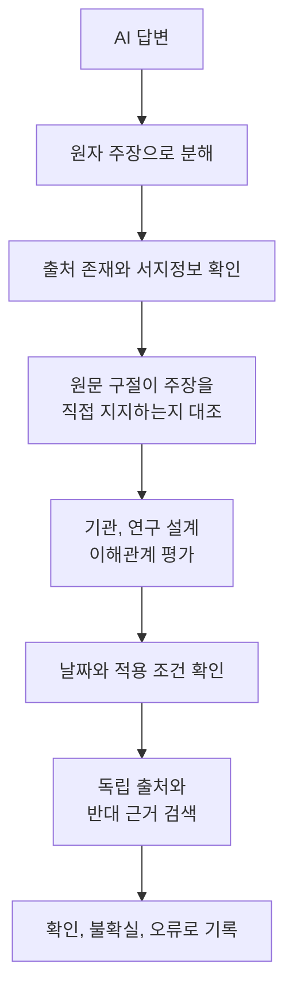

결론부터 말하면 **AI 답변은 문장 전체가 아니라 검증 가능한 주장 하나씩 확인해야 합니다.** 링크가 달려 있어도 실제 문서가 존재하는지, 저자와 날짜가 맞는지, 원문의 어느 문장이 그 주장을 지지하는지, 더 최신인 원문이나 반대 근거는 없는지를 직접 대조하십시오. 검색 기능과 긴 참고문헌 목록은 검증의 출발점이지 정확성 보증서가 아닙니다.

가장 실용적인 방법은 답변을 “누가, 무엇을, 언제, 얼마나, 어떤 조건에서”라는 작은 주장으로 쪼개고 위험도에 따라 검증 순서를 정하는 것입니다. 식당 추천의 영업시간과 약 복용량은 오류 비용이 다릅니다. 법률, 의료, 금융, 안전, 계약, 큰 구매처럼 잘못됐을 때 손실이 큰 주장은 AI 답변만으로 행동하지 말고 담당 기관의 최신 원문과 자격 있는 전문가를 확인해야 합니다.

이 글은 2026년 9월 4일 기준 공식 안내와 학술 원문을 바탕으로 한 일반 검증법입니다. 특정 AI의 현재 오류율을 단정하거나 어떤 모델이 항상 더 정확하다고 순위를 매기지 않습니다. 모델, 도구, 검색 색인, 질문, 언어와 시점이 바뀌면 결과가 달라지기 때문입니다.

## 환각은 유창한 거짓말만 뜻하지 않는다

[NIST 생성형 AI 위험관리 프로필](https://tsapps.nist.gov/publication/get_pdf.cfm?pub_id=958388)은 근거가 없거나 잘못된 내용을 자신 있게 만들어 내는 현상을 confabulation이라는 위험으로 다룹니다. 흔히 AI 환각이라고 부르지만 사람의 지각 경험과 혼동될 수 있어 기술 문서에서는 다른 용어를 쓰기도 합니다.

실제 오류는 여러 모습으로 나타납니다.

| 오류 유형 | 예시 | 확인할 곳 |
| --- | --- | --- |
| 존재하지 않는 정보 | 가짜 논문 제목, 없는 판례와 기능 | 공식 검색과 원문 데이터베이스 |
| 실제 출처의 왜곡 | 논문은 있지만 결론과 수치가 다름 | 초록이 아닌 본문 표와 문장 |
| 낡은 정보 | 종료된 가격, 개정 전 법령, 옛 메뉴 | 시행일, 갱신일과 변경 기록 |
| 범위의 확대 | 한 기업 실험을 모든 직업에 일반화 | 연구 대상, 표본, 비교 조건 |
| 인과관계의 추가 | 함께 변한 두 값을 원인과 결과로 서술 | 연구 설계와 저자의 한계 |
| 인용문 날조 | 실제 인물에게 하지 않은 말을 붙임 | 녹취, 연설문, 원문 페이지 |
| 계산 오류 | 단위, 환율, 백분율을 잘못 변환 | 원자료와 직접 재계산 |

[OpenAI 도움말](https://help.openai.com/en/articles/8313428-does-chatgpt-tell-the-truth)은 ChatGPT가 잘못된 날짜와 사실뿐 아니라 존재하지 않는 연구, 인용과 참고문헌을 만들거나 논쟁의 무게를 왜곡할 수 있다고 안내합니다. 문법이 자연스럽고 말투가 단호하다는 특징은 사실성의 증거가 아닙니다.

## 1단계는 답변을 작은 주장으로 분해하는 것이다

긴 문장 하나에는 여러 사실이 섞여 있습니다. “A기관은 2025년 조사에서 직장인 70%가 AI로 주 5시간을 절약했다고 발표했다”에는 적어도 여섯 주장이 있습니다.

1. A기관이라는 조직이 존재한다.
2. 그 기관이 2025년에 조사를 발표했다.
3. 조사 대상이 직장인이다.
4. 표본에서 70%라는 결과가 나왔다.
5. 측정한 값은 주당 절약 시간이다.
6. 그 시간이 5시간이다.

한 부분이 맞아도 나머지가 자동으로 맞지 않습니다. 실제 기관의 이름에 가짜 보고서 제목을 붙이거나, 설문에서 “AI를 사용한다”는 비율을 “5시간을 절약했다”는 효과로 바꿀 수 있습니다.

[FActScore 연구](https://aclanthology.org/2023.emnlp-main.741/)는 긴 생성문을 각각 확인할 수 있는 원자 사실로 나누고 신뢰할 만한 자료가 지지하는지를 평가하는 방식을 제안했습니다. 연구의 특정 모델 점수는 2023년 전기와 인물 소개 과제에 대한 결과이므로 현재 모든 질문에 일반화할 수 없지만, **긴 답을 통째로 참과 거짓으로 판정하지 말고 작은 주장별로 보라**는 방법은 일상 검증에도 유용합니다.

주장표는 다음처럼 만듭니다.

| 번호 | 확인할 주장 | 종류 | 오류 비용 | 필요한 원문 |
| --- | --- | --- | --- | --- |
| C1 | 제품 가격은 월 20달러다 | 현재 수치 | 중간 | 공식 가격표와 결제 통화 |
| C2 | 언제든 환불된다 | 계약 조건 | 높음 | 환불 약관과 지역 조건 |
| C3 | 연구에서 효과가 30%였다 | 연구 결과 | 높음 | 논문 표, 표본과 비교군 |
| C4 | 전문가가 특정 문장을 말했다 | 직접 인용 | 중간 | 영상 녹취나 공식 연설문 |

의견, 전망, 취향은 사실 주장과 구분합니다. “이 도구가 가장 편하다”는 평가에는 목적과 기준이 필요하고, “무료 플랜은 10회 제공한다”는 수치는 공식 페이지에서 확인할 수 있습니다.

## 2단계는 출처가 실제로 존재하는지 확인하는 것이다

AI가 적은 제목을 검색 결과에서 봤다고 끝내지 마십시오. 링크를 직접 열고 다음 서지 정보가 모두 일치하는지 확인합니다.

- 문서 제목
- 저자 또는 발행 기관
- 발행일과 최신 수정일
- 학술지, 정부 부처, 회사의 공식 도메인
- 논문의 DOI와 권, 호, 페이지
- 법령의 조문, 시행일과 개정 상태
- 제품 문서의 적용 지역, 플랜과 버전

논문은 [Crossref의 DOI 검색과 REST API 안내](https://www.crossref.org/documentation/retrieve-metadata/rest-api/)를 이용해 DOI의 제목, 저자, 발행처를 대조할 수 있습니다. DOI가 존재한다는 사실만으로 논문의 질이나 주장 지지가 증명되지는 않지만, 가짜 서지정보를 거르는 첫 단계가 됩니다. PubMed, 학술지 홈페이지, 학회 논문집처럼 분야별 원문 색인도 함께 확인합니다.

인터넷주소가 열리지 않는 경우에는 주소 오타, 삭제, 지역 제한, 로그인 필요를 구분합니다. AI에게 새 링크를 달라고 반복하기보다 제목과 저자를 공식 사이트에서 직접 검색하십시오. 보도자료가 인용한 연구라면 보도자료만 읽지 말고 첨부 보고서나 논문으로 이동합니다.

2026년 ACL에 발표된 [HalluCitation Matters 연구](https://aclanthology.org/2026.acl-long.2189/)는 2024년과 2025년 ACL 계열 학술대회 논문을 분석해 존재하지 않거나 대응 논문을 찾을 수 없는 참고문헌이 출판 문서에도 들어간 사례를 조사했습니다. 동료 심사나 그럴듯한 형식도 모든 참고문헌의 존재를 자동 보증하지 않는다는 뜻입니다.

## 3단계는 원문이 바로 그 주장을 지지하는지 본다

실제 링크를 찾았다고 가장 어려운 검증이 끝난 것은 아닙니다. AI는 관련 주제의 실제 문서를 연결하되 문서가 하지 않은 결론을 붙일 수 있습니다. 제목과 검색 결과 요약만 보지 말고 본문에서 해당 구절을 찾습니다.

세 칸 대조표를 쓰면 빠릅니다.

| AI의 주장 | 원문의 실제 문장 또는 표 | 판정 |
| --- | --- | --- |
| 조사 참여자의 70%가 시간을 절약했다 | 70%가 도구를 한 번 이상 사용했다고 응답 | 지지하지 않음 |
| 치료가 질병을 예방한다 | 관찰 연구에서 사용군의 발생률이 낮았음 | 인과 표현 과장 |
| 무료 플랜에서 상업 이용 가능 | 가격표에는 무료 한도만 있고 이용권은 약관에 있음 | 추가 원문 필요 |
| 2026년 9월부터 의무다 | 법령은 공포됐지만 시행일은 2027년 1월 | 현재 시점 오류 |

원문에서 찾아야 할 것은 같은 단어가 아니라 같은 의미와 범위입니다. 다음을 함께 대조합니다.

- 수치의 분모와 단위가 같은가
- 평균, 중앙값, 상대 변화와 절대 변화가 구분됐는가
- 대상 국가, 연령, 직업과 기간이 같은가
- 저자가 상관관계만 말했는데 인과로 바뀌지 않았는가
- 본문 결론과 부록의 한계가 함께 반영됐는가
- 인용부호 안 문장이 원문과 정확히 같은가

직접 인용은 원문의 짧은 구절과 페이지를 남기고, 번역했다면 번역임을 표시합니다. AI 번역도 의미를 바꿀 수 있으므로 법령과 계약의 중요한 표현은 원문과 공인 번역을 대조합니다.

## 4단계는 출처의 권위와 이해관계를 평가한다

모든 실제 웹페이지의 증거 가치가 같지는 않습니다. 질문을 책임지는 기관에 가까운 원문부터 찾습니다.

| 질문 | 우선할 원문 | 보조 출처 | 주의할 출처 |
| --- | --- | --- | --- |
| 법령과 행정 절차 | 국가법령정보, 담당 부처 공고 | 공공기관 해설 | 날짜 없는 블로그 요약 |
| 제품 가격과 기능 | 공식 가격표, 도움말, 약관 | 신뢰할 만한 비교 기사 | 제휴 링크 중심 후기 |
| 연구 효과 | 논문 원문, 등록된 연구계획, 데이터 | 대학 보도자료 | 초록만 재인용한 기사 |
| 기업 실적 | 규제기관 공시와 감사 보고서 | 회사 발표 | 출처 없는 투자 게시물 |
| 건강과 안전 | 보건 당국 지침, 심사된 근거 | 병원 교육 자료 | 판매자가 만든 효능 주장 |

공식 출처도 자기 제품을 설명할 때 이해관계가 있습니다. 공급사의 성능 수치는 시험 조건과 제외 대상을 확인하고 가능하면 독립 평가를 함께 봅니다. 반대로 개인 블로그가 틀렸다고 자동 판단하지는 않지만, 중요한 결정을 뒷받침하려면 원문까지 추적합니다.

“전문가가 말했다”면 이름, 소속, 해당 분야의 전문성, 발언 시점과 원문 맥락을 확인합니다. 인용 횟수가 많은 논문도 최신 반박이나 철회가 있을 수 있으므로 학술지의 수정과 철회 표시를 봅니다.

## 5단계는 날짜와 적용 조건을 확인한다

AI 답변은 서로 다른 시점의 정보를 한 문단에 섞기 쉽습니다. 가격, 모델 이름, 지원 국가, 법령, 세금, 보안 권고는 특히 빨리 바뀝니다. 답변을 요청할 때 기준일을 명시하더라도 모델이 지켰는지 따로 검증해야 합니다.

날짜에는 적어도 네 종류가 있습니다.

- 사건이 실제 일어난 날짜
- 문서가 처음 게시된 날짜
- 문서가 마지막으로 수정된 날짜
- 규칙이 효력을 갖는 시행일

예를 들어 9월에 게시된 기사가 8월 사건을 다루고, 10월부터 시행되는 규칙을 설명할 수 있습니다. “9월 현재 적용 중”이라고 요약하면 틀립니다. 제품 페이지는 날짜가 없을 수 있으므로 변경 기록, 약관 버전과 결제 화면도 확인합니다.

조건도 함께 적습니다.

- 무료와 유료 플랜 중 어디에 적용되는가
- 개인, 기업, 교육 계정이 같은가
- 한국과 다른 국가의 정책이 같은가
- 모바일과 웹의 기능이 같은가
- 베타 기능과 정식 기능이 같은가
- 신규 고객과 기존 고객의 요금이 같은가

최종 메모에는 “무엇이 사실인가”뿐 아니라 “언제, 누구에게, 어떤 조건에서 사실인가”를 적습니다.

## 6단계는 독립된 출처와 반대 근거를 찾는다

검색 결과에 같은 문장이 열 번 나온다고 독립 증거가 열 개 생긴 것은 아닙니다. 여러 기사가 같은 보도자료를 복사했다면 정보의 뿌리는 하나입니다. 링크 수보다 계보를 봅니다.



반대 검색어를 의도적으로 만듭니다.

- 주장 핵심어 + 한계
- 제품명 + known issues 또는 release notes
- 논문 제목 + correction 또는 retraction
- 정책명 + 예외 또는 적용 제외
- 통계명 + methodology
- 인물 인용 + 원문 영상 또는 transcript

두 출처가 다르면 더 유명한 쪽을 고르지 말고 기준일, 정의, 표본과 이해관계가 다른지 확인합니다. 해결되지 않으면 “불확실”로 남기고 의사결정에서 그 불확실성을 비용으로 반영합니다.

출처 개수에는 고정 정답이 없습니다. 제품의 현재 가격은 공식 가격표 하나가 가장 직접적일 수 있지만, 제품이 “업계 최고 정확도”라고 주장하면 독립 시험이 필요합니다. 생명, 큰 금액과 법적 권리가 걸린 결정은 인터넷 교차 확인을 넘어서 전문가 상담과 공식 절차를 추가합니다.

## 7단계는 검증 결과와 결정을 함께 기록한다

검증이 끝나면 답변을 지우고 새 답변을 받기보다 주장별 상태를 남깁니다.

| 상태 | 뜻 | 사용할 수 있는 방식 |
| --- | --- | --- |
| 확인 | 최신 원문이 같은 범위의 주장을 지지 | 출처와 조건을 붙여 사용 |
| 부분 확인 | 일부 수치나 범위만 지지 | 문장을 원문 범위로 축소 |
| 불확실 | 원문 부족 또는 출처 충돌 | 결론에서 제외하거나 불확실성 표시 |
| 오류 | 원문과 모순 또는 출처가 없음 | 삭제하고 정정 기록 |
| 의견 | 사실로 검증할 대상이 아님 | 판단 기준과 작성자를 명시 |

검증 로그에는 다음을 적습니다.

- AI 답변 원본과 생성 시각
- 사용한 모델과 검색 기능 여부
- 원자 주장 번호
- 확인한 원문 링크와 열람일
- 지지하는 페이지, 표, 문장 위치
- 판정과 남은 불확실성
- 그 정보를 사용한 문서와 결정

업무 보고서에서는 중요한 수치 옆에 주장 번호를 달고, 표의 각 행이 원자료의 어느 셀에서 왔는지 연결합니다. 나중에 가격이나 정책이 바뀌면 전체 글을 다시 읽지 않고 영향받는 주장만 갱신할 수 있습니다.

## AI에게 시킬 일과 사람이 끝까지 할 일을 나눈다

AI는 검증 작업도 도울 수 있지만 자기 답을 자기 판단으로 인증하게 해서는 안 됩니다.

### AI에 맡길 수 있는 보조 작업

- 답변에서 검증 가능한 주장 후보 추출
- 주장마다 필요한 출처 유형 제안
- 긴 문서에서 관련 키워드와 표 위치 후보 찾기
- 서로 다른 문서의 정의와 단위 비교표 만들기
- 확인되지 않은 표현과 단정 문장 표시

### 사람이 직접 할 작업

- 원문 링크 열기와 발행 주체 확인
- 표, 각주, 부록과 원자료 대조
- 법령과 약관의 현재 효력 판단
- 이해관계와 연구 설계 평가
- 오류 비용에 맞는 최종 의사결정

검증용 프롬프트는 AI에게 답을 다시 믿으라고 요청하는 대신 작업 범위를 분명히 합니다.

```text
아래 답변을 검증 가능한 단일 주장으로 분해하세요.
각 주장에 번호를 붙이고 사람, 날짜, 수치, 인과, 직접 인용을 표시하세요.
출처가 없거나 링크가 열리지 않는다고 가정하지 말고 [확인 필요]로 남기세요.
새로운 사실과 출처를 만들지 마세요.

[검증할 답변]
```

그다음 원문을 직접 확보한 뒤에는 다음처럼 비교를 요청할 수 있습니다.

```text
주장과 아래 원문 발췌의 일치 여부만 평가하세요.
판정은 지지, 부분 지지, 모순, 판단 불가 중 하나로 쓰세요.
수치의 분모, 대상, 기간, 인과 표현이 다르면 이유를 표시하세요.
발췌 밖의 지식으로 빈칸을 채우지 마세요.
```

이 프롬프트도 최종 판정을 자동화하지 않습니다. 특히 발췌를 잘못 골랐거나 중요한 각주를 빼면 비교 결과도 틀릴 수 있습니다.

## 고위험 분야에는 더 높은 검증 문턱을 적용한다

오류 비용에 따라 멈춤 조건을 정합니다.

| 사용 상황 | 최소 검증 | 반드시 멈출 때 |
| --- | --- | --- |
| 개인 메모와 아이디어 | 출처 후보와 날짜 확인 | 외부 배포로 용도가 바뀜 |
| 공개 블로그와 발표 | 핵심 주장별 원문 대조 | 직접 인용과 통계 원문을 못 찾음 |
| 구매와 계약 | 공식 가격, 약관, 환불 조건 | 적용 국가와 플랜이 불명확 |
| 의료, 법률, 금융 | 공식 최신 지침과 전문가 확인 | 개인 상황의 예외를 판단할 수 없음 |
| 보안 사고 대응 | 공급사와 공공기관의 최신 권고 | 증거 삭제나 시스템 변경이 필요한 단계 |

[NIST 생성형 AI 위험관리 프로필](https://tsapps.nist.gov/publication/get_pdf.cfm?pub_id=958388)은 생성형 AI의 오류가 잘못된 의사결정과 자동화 편향으로 이어질 수 있음을 위험관리 관점에서 다룹니다. 인간 검토라는 말만 붙인다고 안전해지지는 않습니다. 검토자가 시간, 원문 접근권과 전문성을 가져야 하고, 중요한 주장을 거부하거나 보류할 권한도 있어야 합니다.

## 10분 빠른 검증 체크리스트

- [ ] 답변을 사람, 날짜, 수치, 인과, 인용 단위로 쪼갰다.
- [ ] 오류 비용이 큰 주장을 먼저 표시했다.
- [ ] 모든 링크를 직접 열었다.
- [ ] 제목, 저자, 발행처, 날짜와 DOI를 대조했다.
- [ ] 검색 요약이 아니라 본문의 표와 문장을 읽었다.
- [ ] 수치의 분모, 단위, 표본과 기간을 확인했다.
- [ ] 상관관계를 인과관계로 바꾸지 않았는지 봤다.
- [ ] 공식 출처의 적용 국가, 플랜과 시행일을 확인했다.
- [ ] 같은 보도자료를 복사한 문서를 독립 출처로 세지 않았다.
- [ ] 반대 근거, 수정과 철회 기록을 검색했다.
- [ ] 확인, 부분 확인, 불확실, 오류를 구분해 기록했다.
- [ ] 고위험 결정은 자격 있는 전문가와 공식 기관에 확인했다.

검증 뒤 문장이 짧아지는 것은 실패가 아닙니다. “모두에게 30% 효과가 있다”가 “한 기업의 특정 업무에서 비교군보다 평균값이 높았다”로 바뀌었다면 근거의 범위에 맞게 정확해진 것입니다. **좋은 검증은 더 단호한 답을 만드는 일이 아니라, 확인된 범위 밖에서는 멈추는 일입니다.**

<!-- internal-links:start -->
## 함께 읽기

- [ChatGPT 프롬프트 작성 완전 가이드]() — 명확한 요청, 자료 구분과 반복 검수를 통해 답변의 범위를 통제하는 기본 프롬프트 구조를 확인합니다.
- [AI 생산성 역설]() — 서로 다른 연구의 수치를 같은 성능 순위처럼 합치지 않고 표본, 과업과 인과 한계를 읽는 사례를 보여 줍니다.
- [Open Notebook과 출처 기반 연구 흐름]() — 문서에 근거한 답변 시스템의 구조와 로컬 자료 관리, 인용 추적의 기술적 배경을 살펴봅니다.
<!-- internal-links:end -->

## 자주 묻는 질문

### AI 답변에 출처 링크가 있으면 믿어도 되나요?

아닙니다. 링크가 실제로 열리는지, 문서의 저자와 날짜가 맞는지, 본문의 해당 구절이 바로 그 주장을 지지하는지까지 확인해야 합니다. 실제 출처를 연결해 놓고 내용을 과장하는 경우도 있습니다.

### 환각을 없애는 프롬프트가 있나요?

완전히 없애는 프롬프트는 없습니다. 모르면 모른다고 답하게 하고 출처와 인용 위치를 요구하면 위험을 줄일 수 있지만, 중요한 사실은 사용자가 원문에서 다시 확인해야 합니다.

### 웹 검색이나 딥리서치를 쓰면 환각이 사라지나요?

사라지지 않습니다. 검색은 최신 근거에 접근하게 하지만 관련 없는 문서를 고르거나 본문을 잘못 읽고 여러 출처가 같은 오류를 베낀 경우가 남습니다. 링크마다 주장과의 일치 여부를 확인하세요.

### 중요한 주장은 출처를 몇 개 확인해야 하나요?

모든 주제에 적용되는 마법의 개수는 없습니다. 법령, 가격, 제품 기능은 담당 기관이나 제공자의 최신 원문을 우선하고, 큰 비용이나 안전이 걸린 판단은 이해관계가 다른 독립 출처와 전문가 확인을 추가하세요.

## 직접 확인한 원문

1. [NIST, Artificial Intelligence Risk Management Framework: Generative Artificial Intelligence Profile](https://tsapps.nist.gov/publication/get_pdf.cfm?pub_id=958388) (NIST AI 600-1, 2024-07)
2. [OpenAI, Does ChatGPT tell the truth?](https://help.openai.com/en/articles/8313428-does-chatgpt-tell-the-truth) (2026-09-04 확인)
3. [Kalai 외, Why Language Models Hallucinate](https://cdn.openai.com/pdf/d04913be-3f6f-4d2b-b283-ff432ef4aaa5/why-language-models-hallucinate.pdf) (2025-09-04)
4. [Min 외, FActScore: Fine-grained Atomic Evaluation of Factual Precision in Long Form Text Generation](https://aclanthology.org/2023.emnlp-main.741/) (EMNLP 2023)
5. [Sakai 외, HalluCitation Matters](https://aclanthology.org/2026.acl-long.2189/) (ACL 2026)
6. [Crossref, REST API documentation](https://www.crossref.org/documentation/retrieve-metadata/rest-api/) (2026-09-04 확인)

> 모델과 검색 제품은 빠르게 바뀌며, 특정 연구의 오류율은 그 연구가 사용한 모델과 과제에만 직접 적용됩니다. 최신 원문과 실제 사용 조건을 다시 확인하고 고위험 판단은 AI 답변만으로 내리지 마십시오.
