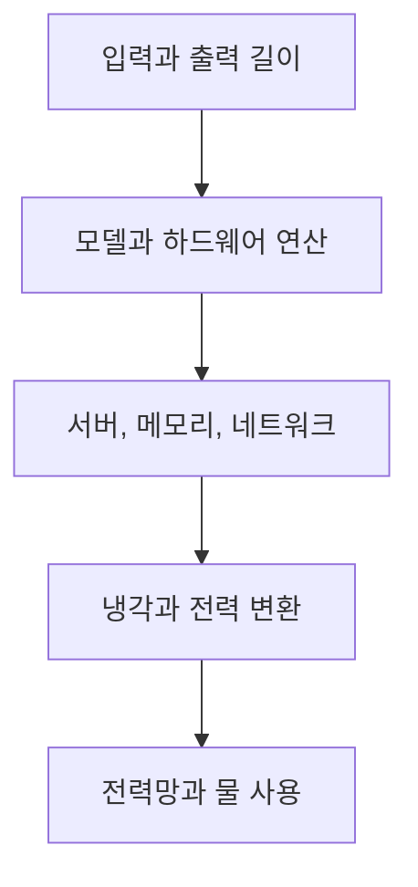

먼저 답부터 말하면, **AI 질문 한 번의 전기와 물 사용량을 모든 서비스에 통하는 하나의 숫자로 답할 수는 없습니다.** 모델 크기, 입력과 출력 길이, 텍스트인지 영상인지, 사용한 칩, 동시에 처리한 요청 수, 데이터센터 냉각 방식, 지역 전력망, 무엇을 측정에 포함했는지가 모두 다르기 때문입니다.

공개된 구체적 사례는 있습니다. Google 연구진은 2025년 공개한 생산 환경 측정에서 Gemini Apps의 중간값 텍스트 프롬프트가 전기 0.24Wh와 데이터센터 현장 냉각용 물 0.26mL를 소비한다고 보고했습니다. 하지만 이것은 **특정 시점의 Gemini 텍스트 요청 중간값**이며 ChatGPT, 다른 모델, 긴 추론, 이미지와 영상 생성의 보편값이 아닙니다. [Google의 전체 측정 보고서](https://services.google.com/fh/files/misc/measuring_the_environmental_impact_of_delivering_ai_at_google_scale.pdf)는 비교하려면 측정 경계를 먼저 맞춰야 한다고 강조합니다.

이 글은 2026년 9월 4일까지 공개된 자료를 기준으로 전기, 물, 탄소를 구분합니다. 예측과 기업 자체 측정은 불확실성과 이해관계를 포함합니다. 숫자를 죄책감 계산기로 쓰기보다 어떤 질문을 해야 비교가 가능한지 이해하는 것이 목표입니다.

## 한 번의 질문에 정답 하나가 없는 이유

같은 “AI 질문”이라도 계산량은 크게 다릅니다. 짧은 문장 분류, 긴 문서 요약, 여러 단계 추론, 고해상도 이미지 생성, 수십 초 영상 생성은 같은 단위로 묶기 어렵습니다. 답변 토큰이 길어지면 모델을 반복 실행하는 시간이 늘고, 여러 도구를 호출하는 에이전트는 검색과 코드 실행까지 추가할 수 있습니다.

측정 경계도 다릅니다. 어떤 수치는 GPU가 실제 계산할 때의 전력만 재고, 다른 수치는 CPU, 메모리, 유휴 서버, 네트워크, 냉각과 전력 변환 손실까지 포함합니다. 물은 데이터센터 안에서 냉각에 직접 소비한 양만 셀 수도 있고, 전기를 생산하는 발전소의 간접 물 사용까지 포함할 수도 있습니다. 탄소 역시 지역 전력 배출계수와 재생에너지 계약을 어떻게 반영했는지에 따라 달라집니다.



따라서 “프롬프트 한 번”이라는 분모만 같다고 수치를 바로 비교하면 안 됩니다. **모델, 과업, 응답 길이, 백분위, 시점, 포함 범위가 함께 있어야 숫자가 정보가 됩니다.**

## Google의 0.24Wh와 0.26mL가 뜻하는 범위

[Google 연구](https://services.google.com/fh/files/misc/measuring_the_environmental_impact_of_delivering_ai_at_google_scale.pdf)는 실제 대규모 서비스의 Gemini Apps 텍스트 요청을 대상으로 전체 스택 측정을 제안했습니다. 연구가 밝힌 중간값은 에너지 0.24Wh, 시장 기반 탄소 0.03gCO2e, 데이터센터 현장 냉각용 물 0.26mL입니다. 중간값은 요청 절반이 그보다 작고 절반이 그보다 크다는 뜻이지, 모든 요청이 같은 양을 쓴다는 뜻이 아닙니다.

연구는 가속기뿐 아니라 호스트 CPU와 DRAM, 유휴 용량, 데이터센터 부대 전력을 포함했다고 설명합니다. 이것이 기존의 좁은 추정보다 강점입니다. 동시에 기업이 자체 서비스와 인프라를 측정한 결과이고, 원시 운영 데이터 전체가 공개된 독립 감사는 아닙니다. 다른 사업자의 모델에 값을 옮길 수도 없습니다.

| 공개값 | 측정 대상 | 포함한 핵심 범위 | 일반화할 수 없는 대상 |
| --- | --- | --- | --- |
| 0.24Wh | Gemini Apps 중간값 텍스트 프롬프트 | 가속기, 호스트, 유휴 용량, 데이터센터 부대 전력 | 모든 ChatGPT 질문, 이미지, 영상 |
| 0.26mL | 같은 요청의 물 소비 | 데이터센터 현장 냉각용 소비수 | 발전 단계의 간접 물, 다른 지역과 냉각 방식 |
| 0.03gCO2e | 같은 요청의 시장 기반 배출 | 전력 조달과 장비 내재 배출을 연구 정의로 반영 | 위치 기반 배출이나 다른 사업자 |

이 세 수치는 서로 단위가 다르므로 더해서 하나의 환경 점수로 만들 수 없습니다. 전력 사용이 낮아져도 물이 부족한 지역의 냉각 부담이 클 수 있고, 같은 전력량도 지역의 발전원에 따라 배출이 달라집니다. 숫자를 인용할 때는 “Google이 2025년에 보고한 Gemini Apps 중간값 텍스트 프롬프트”라는 꼬리표를 붙이는 것이 정확합니다.

## 물 한 병이라는 문장이 위험한 이유

AI와 물을 다룬 글에서 “질문 몇 번에 생수 한 병” 같은 비유가 널리 쓰입니다. 비유는 기억하기 쉽지만 가정이 빠지면 오해를 만듭니다. 추정 연구는 특정 모델, 특정 데이터센터 지역, 답변 길이와 시점을 가정합니다. 생산 환경 측정은 다른 냉각 기술과 조달 조건을 씁니다. 직접 냉각수와 전력 생산의 간접 물을 합쳤는지도 확인해야 합니다.

물 관련 용어도 구분해야 합니다.

| 용어 | 의미 | 주의할 점 |
| --- | --- | --- |
| 취수 | 강, 호수, 지하수 등에서 가져온 물 | 일부가 다시 수계로 돌아갈 수 있음 |
| 소비 | 증발이나 제품 편입 등으로 즉시 같은 수계에 돌아오지 않는 물 | 취수보다 작은 값일 수 있음 |
| 현장 물 | 데이터센터 냉각에서 직접 쓰는 물 | 냉각 방식과 기후에 민감 |
| 간접 물 | 사용한 전기를 생산하는 과정의 물 | 지역 전력 구성에 민감 |

[미국 Lawrence Berkeley National Laboratory의 2024 데이터센터 보고서](https://bies.lbl.gov/publications/2024-lbnl-data-center-energy-usage-report)는 미국 데이터센터의 전력과 직접, 간접 물 사용을 별도 방법으로 추정합니다. 국가와 시설 수준의 연간 추정치를 개인의 프롬프트 한 번으로 단순 나누면 평균 트래픽, AI 비중, 요청 종류가 섞이므로 정확한 개인값이 되지 않습니다.

**물 사용량은 프롬프트 글자 수만의 함수가 아니라 어디서 언제 어떤 방식으로 계산했는지의 함수이기도 합니다.** 같은 서버라도 더운 날 냉각 조건과 전력망 구성이 달라질 수 있습니다.

## 텍스트와 영상은 같은 질문이 아니다

[IEA의 2026년 Energy and AI 후속 분석](https://www.iea.org/reports/key-questions-on-energy-and-ai/executive-summary)은 단순 텍스트 질의의 작업당 에너지 효율이 빠르게 개선됐다고 봅니다. 동시에 영상 생성, 긴 추론, 에이전트형 작업처럼 더 무거운 사용이 늘고 있으며 이런 작업은 단순 텍스트보다 수백 배 또는 수천 배 많은 에너지를 쓸 수 있다고 설명합니다. 이것은 모든 영상 요청의 고정 배율이 아니라 사용 유형 사이의 규모 차이를 보여주는 범위입니다.

텍스트에서도 차이가 큽니다. “이 문장을 세 단어로 줄여줘”와 책 한 권을 넣고 출처를 검색하며 50쪽 보고서를 만들라는 요청은 모두 채팅 한 번으로 표시될 수 있습니다. 사용자 화면의 메시지 수는 실제 모델 호출 횟수나 도구 실행량을 보여주지 않습니다.

부담을 비교할 때 다음 순서로 봅니다.

1. 출력 형식이 텍스트, 이미지, 음성, 영상 가운데 무엇인가
2. 모델이 바로 답하는가, 오래 추론하거나 여러 도구를 쓰는가
3. 입력과 출력의 길이, 해상도, 프레임 수는 얼마인가
4. 결과를 몇 번 다시 생성하는가
5. 서비스가 실제 측정 방법과 시점을 공개했는가

고해상도 결과가 꼭 필요한 작업은 사용할 수 있습니다. 다만 썸네일 아이디어를 확인하는 단계부터 매번 긴 영상을 생성하기보다 텍스트 구성, 낮은 비용의 미리보기, 최종 렌더 순으로 진행하면 불필요한 재생성을 줄일 수 있습니다.

## 질문당 효율이 좋아져도 전체 전력은 늘 수 있다

한 번의 요청이 효율적으로 바뀌어도 사용자가 늘고 요청이 무거워지면 총량은 증가합니다. IEA의 [2025 Energy and AI 보고서](https://www.iea.org/reports/energy-and-ai/executive-summary)는 전 세계 데이터센터 전력 소비를 2024년 약 415TWh, 세계 전력의 약 1.5%로 추정했습니다. 기본 시나리오에서 2030년 약 945TWh로 두 배 이상 늘어날 것으로 전망했습니다.

```chartjs
{
  "type": "bar",
  "data": {
    "labels": ["2024 추정", "2030 기본 전망"],
    "datasets": [
      {
        "label": "전 세계 데이터센터 전력 소비량 TWh",
        "data": [415, 945],
        "backgroundColor": ["#20ad91", "#2457ff"]
      }
    ]
  },
  "options": {
    "responsive": true,
    "scales": {
      "y": {
        "beginAtZero": true,
        "title": { "display": true, "text": "연간 TWh" }
      }
    },
    "plugins": {
      "title": { "display": true, "text": "전 세계 데이터센터 전력 소비 추정과 전망" },
      "subtitle": { "display": true, "text": "자료: IEA Energy and AI 2025, 기본 시나리오" }
    }
  }
}
```

이 전망은 AI만의 전력이 아니라 전통적 데이터센터 작업도 포함합니다. 2030년 수치는 관측값이 아니라 모델 기반 전망이며, AI 도입 속도, 효율 향상, 공급망과 정책에 따라 달라집니다. 차트의 두 막대를 “AI 질문이 정확히 이만큼 늘린다”로 해석하면 안 됩니다.

IEA는 지역 영향이 세계 평균보다 더 클 수 있다고 지적합니다. 데이터센터가 특정 지역에 몰리면 전력망 연결, 발전 설비, 물과 토지의 부담도 집중됩니다. 전 세계 비중이 작다는 말과 특정 지역의 부담이 작다는 말은 동시에 성립하지 않습니다.

## 숫자를 볼 때 확인할 여섯 가지

자극적인 주장 앞에서는 계산보다 먼저 출처표를 만듭니다.

- [ ] 측정값인가, 하드웨어 사양을 이용한 추정값인가
- [ ] 평균인가, 중간값인가, 가장 큰 요청의 값인가
- [ ] 모델 이름과 측정 시점이 공개됐는가
- [ ] 입력과 출력 길이, 과업 유형이 같은가
- [ ] GPU만 셌는가, 서버와 냉각, 유휴 용량까지 셌는가
- [ ] 물이 취수인지 소비인지, 직접 사용인지 간접 사용까지 포함했는가
- [ ] 탄소가 위치 기반인지 시장 기반인지 밝혔는가
- [ ] 기업 자체 보고인지 독립 연구인지 이해관계가 표시됐는가

Google 논문은 비교 가능한 전체 스택 경계를 제안했다는 점에서 중요한 진전입니다. 반면 한 기업과 한 제품의 결과라는 한계가 있습니다. LBNL 보고서는 국가 규모의 전력과 물을 넓게 다루지만 개별 AI 요청을 직접 재지 않습니다. IEA는 국제 전망을 제공하지만 미래 가정이 들어갑니다. **서로 다른 자료는 경쟁하는 정답이 아니라 서로 다른 크기의 질문에 답합니다.**

[NIST의 생성형 AI 위험 관리 프로필](https://tsapps.nist.gov/publication/get_pdf.cfm?pub_id=958388)은 훈련, 미세 조정, 배포에서 에너지와 물 같은 환경 영향을 측정하거나 추정하고 문서화하도록 제안합니다. 개인도 같은 원칙으로 숫자 옆에 범위와 가정을 적을 수 있습니다.

## 개인이 할 수 있는 현실적인 선택

개별 사용자는 데이터센터의 냉각 방식이나 전력 조달을 바꾸기 어렵습니다. 그렇다고 선택이 전혀 없는 것은 아닙니다. 정확하지 않은 “물방울 계산”보다 중복 작업과 과한 출력 형식을 줄이는 행동이 현실적입니다.

| 상황 | 먼저 시도할 선택 | 이유 |
| --- | --- | --- |
| 문장 교정과 분류 | 짧은 지시와 필요한 문장만 입력 | 불필요한 긴 문맥을 줄임 |
| 간단한 사실 확인 | 공식 검색과 작은 모델부터 검토 | 긴 추론이 항상 필요하지 않음 |
| 이미지 아이디어 | 텍스트 구성과 낮은 해상도 미리보기 | 버릴 고해상도 생성 감소 |
| 영상 제작 | 스토리보드와 장면 목록을 먼저 확정 | 반복 렌더를 줄임 |
| 에이전트 자동화 | 호출 횟수, 중단 조건, 예산 상한 설정 | 무한 반복과 불필요한 도구 호출 방지 |
| 팀 업무 | 재사용 가능한 승인 프롬프트와 결과 저장 | 같은 요청의 중복 실행 감소 |

짧은 프롬프트가 언제나 짧은 연산을 보장하지는 않습니다. 모델 라우팅과 내부 최적화가 공개되지 않기 때문입니다. 그래도 목적을 한 번 정리하고 필요한 결과 형식을 지정하면 무의미한 재요청을 줄이는 데 도움이 됩니다.

AI를 쓰지 않는 것이 항상 최저 환경 비용이라는 단순 결론도 조심해야 합니다. AI가 이동, 재촬영, 낭비되는 계산, 비효율적 설계를 줄이는 용도로 쓰일 수 있습니다. 비교 대상의 전체 과정까지 봐야 합니다. 다만 그런 편익을 주장하려면 실제로 무엇이 줄었는지 측정해야 하며, 가능성만으로 환경 비용을 상쇄했다고 말해서는 안 됩니다.

## 조직은 프롬프트 수보다 서비스 단위를 재야 한다

회사는 “직원 한 명이 질문 몇 번 했는가”만 세기보다 업무 결과 한 단위당 자원을 봐야 합니다. 고객 문의 한 건 해결, 보고서 한 건 승인, 영상 한 편 게시 같은 결과 단위를 정하고 AI 호출, 재시도, 모델, 토큰, 저장, 네트워크와 사람의 재작업을 함께 기록합니다.

측정표에는 다음 칸이 필요합니다.

1. 서비스와 모델 버전, 날짜
2. 입력과 출력의 대략적 길이와 형식
3. 성공한 결과와 버린 결과의 수
4. 공개된 공급자 에너지, 물, 탄소 측정 경계
5. 품질 실패로 생긴 재실행과 사람의 수정
6. 이전 방식에서 줄어든 서버 작업, 이동, 장비 사용

공급자가 요청당 환경 수치를 제공하지 않는다면 임의의 보편값을 곱해 정밀한 숫자처럼 표시하지 않습니다. 범위를 제시하고 빠진 항목을 적습니다. 조달 단계에서는 위치 기반과 시장 기반 탄소, 직접과 간접 물, 재생에너지 시간 일치, 장비 수명과 폐기까지 질문할 수 있습니다.

마지막 판단은 간단합니다. **작은 공개값 하나로 안심하거나 큰 추정값 하나로 공포를 만들지 말고, 어떤 작업을 어떤 경계에서 잰 숫자인지 확인하십시오.** 효율 향상과 총수요 증가가 동시에 일어날 수 있다는 두 사실을 함께 봐야 AI의 환경 비용을 정직하게 말할 수 있습니다.

<!-- internal-links:start -->
### 이어 읽기

- [NVIDIA 800VDC AI 데이터센터 전력 아키텍처]() — AI 랙의 전력 밀도가 높아질 때 배전 구조가 왜 바뀌는지 살펴봅니다.
- [World Bank WDR 2026 소형 AI와 생산성]() — 작은 모델과 지역 인프라의 관계를 개발 관점에서 이어서 봅니다.
- [AI가 일을 줄여도 더 바빠지는 이유]() — 작업당 효율 개선과 전체 사용량 증가가 함께 나타나는 구조를 업무 관점에서 비교합니다.
<!-- internal-links:end -->

## 자주 묻는 질문

### ChatGPT 질문 한 번의 전력 사용량은 정확히 얼마인가요?

모델, 답변 길이, 하드웨어, 배치 처리, 데이터센터 효율과 측정 경계가 공개되지 않으면 하나의 정확한 값으로 말할 수 없습니다. 특정 서비스의 특정 시점 측정값을 모든 AI 질문에 일반화해서는 안 됩니다.

### AI 질문 한 번이 물 한 병을 쓴다는 말은 사실인가요?

모든 질문에 적용되는 사실이 아닙니다. 연구와 기업 공개값은 모델, 지역, 냉각 방식, 전력 생산의 간접 물 사용 포함 여부가 달라 결과 범위가 크게 벌어집니다.

### 짧게 질문하면 환경 부담도 항상 줄어드나요?

대체로 불필요한 입력과 출력을 줄이면 연산량을 낮출 가능성이 있지만, 서비스의 라우팅과 캐시, 배치, 모델 선택을 사용자가 알 수 없어 절감량을 정확히 계산할 수는 없습니다.

### 개인이 가장 현실적으로 줄일 수 있는 것은 무엇인가요?

목적을 먼저 정하고 중복 요청을 줄이며, 단순 작업에는 충분히 작은 모델과 텍스트 출력을 쓰고, 긴 추론이나 이미지와 영상 생성은 결과를 실제로 사용할 때 선택하는 것이 현실적입니다.

## 직접 확인한 공식 원문

1. [Google, Measuring the environmental impact of delivering AI at Google Scale](https://services.google.com/fh/files/misc/measuring_the_environmental_impact_of_delivering_ai_at_google_scale.pdf)
2. [IEA, Key Questions on Energy and AI 2026](https://www.iea.org/reports/key-questions-on-energy-and-ai)
3. [IEA, Energy and AI 2025 Executive Summary](https://www.iea.org/reports/energy-and-ai/executive-summary)
4. [Lawrence Berkeley National Laboratory, 2024 United States Data Center Energy Usage Report](https://bies.lbl.gov/publications/2024-lbnl-data-center-energy-usage-report)
5. [NIST, Generative Artificial Intelligence Profile](https://tsapps.nist.gov/publication/get_pdf.cfm?pub_id=958388)

> 기업 공개 수치는 자체 방법론과 이해관계를 포함하고, 국가 및 국제 전망은 미래 가정에 의존합니다. 서로 다른 모델과 측정 경계의 수치를 직접 순위처럼 비교하지 않았습니다. 제품 효율과 전력 구성은 빠르게 바뀌므로 게시 뒤 최신 원문과 개정 보고서를 다시 확인해야 합니다.
