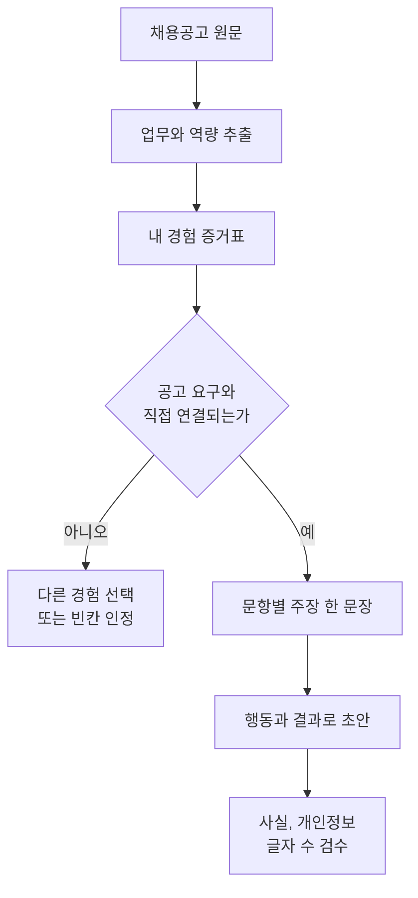

결론부터 말하면 **좋은 AI 자소서는 AI에게 나를 그럴듯하게 꾸며 달라고 부탁해서 나오지 않습니다.** 채용공고에서 평가할 업무와 역량을 뽑고, 내가 실제로 한 행동과 확인 가능한 결과를 연결한 다음, 문장 초안과 사실 검수를 분리해야 합니다. AI는 공고 정리와 표현 비교에는 유용하지만 존재하지 않는 경험, 숫자, 동기를 대신 만들어서는 안 됩니다.

가장 안전한 순서는 “채용공고 분석 → 경험 증거표 → 문항별 설계 → 초안 → 사실 감사 → 글자 수 편집”입니다. 한 번에 완성문을 요구하면 공고에 없는 인재상, 어디서나 쓸 수 있는 열정 표현, 실제로 하지 않은 성과가 섞여도 알아차리기 어렵습니다. **AI가 만든 문장을 고치는 것이 아니라 내 증거를 AI가 문장으로 정리하게 해야 합니다.**

이 글은 2026년 9월 4일 기준 고용24의 자기소개서 작성 가이드, 국가직무능력표준 자료, 개인정보보호위원회와 서비스 공식 안내를 바탕으로 구성했습니다. 특정 기업의 합격을 보장하지 않으며 채용 기준과 AI 사용 규칙은 기업과 전형마다 다릅니다.

## 먼저 채용공고를 평가표로 바꾼다

채용공고에는 회사 소개, 담당 업무, 필수 조건, 우대 조건, 사용 도구, 조직 문화 문구가 섞여 있습니다. 처음부터 자소서를 쓰지 말고 공고의 문장을 아래 여섯 열로 분해하십시오.

| 공고 원문 | 구분 | 요구 역량 | 입사 후 행동 | 내 증거 후보 | 확인할 질문 |
| --- | --- | --- | --- | --- | --- |
| 월간 캠페인 성과 분석 | 담당 업무 | 데이터 해석, 보고 | 지표를 비교하고 개선안 제안 | 동아리 광고 분석 | 어떤 지표를 얼마나 자주 봤나 |
| 유관 부서와 일정 조율 | 담당 업무 | 협업, 의사소통 | 의존 관계와 마감 관리 | 팀 프로젝트 진행 | 갈등과 지연을 어떻게 풀었나 |
| SQL 활용 가능자 | 우대 조건 | 데이터 조회 | 필요한 데이터를 직접 추출 | 수업 데이터베이스 과제 | 실제 쿼리와 데이터 규모는 무엇인가 |

[고용24의 자기소개서 작성 준비 안내](https://www.work24.go.kr/wk/r/d/1111/resumeSelfIntroGuide2.do)는 기업과 직무를 조사하고 직무와 유사한 일에서 성과를 낸 경험을 구체화하도록 권합니다. 따라서 회사의 모든 문구를 반복하기보다 실제 담당 업무에 가까운 증거를 먼저 찾아야 합니다.

다음 프롬프트는 공개된 채용공고만 넣어 구조를 분석하는 용도입니다.

```text
아래 채용공고를 근거로만 분석해 주세요.
공고에 없는 기업 문화나 평가 기준은 추측하지 마세요.

1. 반복되거나 중요한 담당 업무
2. 필수 역량과 우대 역량
3. 각 역량을 입증할 수 있는 행동 증거
4. 공고만으로 알 수 없어 확인이 필요한 항목

결과는 공고 원문, 분류, 요구 역량, 행동 증거, 불확실성의 표로 작성하세요.

[채용공고 붙여넣기]
```

AI의 표가 완성되면 원문과 한 줄씩 대조합니다. 공고에 없는 “글로벌 마인드”, “주도적 리더십”을 AI가 추가했다면 삭제하거나 회사의 공식 채용 페이지에서 따로 확인합니다. 빈칸을 추측으로 채우지 않는 것이 첫 검수입니다.

## 경험은 직함이 아니라 증거 단위로 쪼갠다

신입 지원자는 “관련 경력이 없다”고 생각하기 쉽습니다. 그러나 채용 문서에서 비교하는 것은 직함만이 아닙니다. 수업, 팀 프로젝트, 동아리, 아르바이트, 봉사, 개인 작업에도 계획, 고객 대응, 오류 수정, 일정 조율, 자료 분석이 있습니다.

경험 하나를 다음 일곱 칸으로 기록합니다.

- 상황: 언제, 어떤 맥락에서 일했는가
- 문제: 무엇이 막혀 있었는가
- 목표: 내가 맡은 결과는 무엇이었는가
- 행동: 내가 직접 한 선택과 작업은 무엇인가
- 협업: 누구와 무엇을 조율했는가
- 결과: 확인 가능한 변화는 무엇인가
- 증거: 파일, 기록, 수치, 피드백 중 무엇으로 확인할 수 있는가

결과는 반드시 매출 증가율일 필요가 없습니다. 마감 준수, 오류 건수 감소, 응답 시간 단축, 참가자 수, 처리한 문의 수, 테스트 통과, 작업 단계 삭제처럼 실제 기록이 있는 변화면 됩니다. 수치가 없다면 억지로 만들지 말고 “담당자가 채택했다”, “정해진 일정 안에 배포했다”, “반복 문의를 유형별 문서로 정리했다”처럼 확인 가능한 사실을 씁니다.

| 약한 메모 | 증거 질문 | 개선된 재료 |
| --- | --- | --- |
| 팀워크가 좋았다 | 누구와 무엇을 맞췄나 | 디자인과 개발의 마감 기준이 달라 주간 점검표를 만들었다 |
| 매출을 크게 높였다 | 기준 기간과 자료가 있나 | 매장 기록으로 확인한 묶음 상품 주문이 전월 42건에서 55건으로 늘었다 |
| SQL을 잘한다 | 어떤 문제와 쿼리였나 | 3개 테이블을 조인해 이탈 고객 조건을 추출하고 결과를 검산했다 |

숫자가 기억나지 않으면 기록을 찾기 전까지 빈칸으로 둡니다. AI에 “적당한 숫자를 넣어 달라”고 하면 문장은 좋아 보여도 면접에서 설명할 수 없는 위험한 주장으로 바뀝니다.

## 공고와 경험을 한 칸씩 연결한다

모든 경험을 넣으려 하지 말고 공고의 핵심 요구마다 가장 강한 증거 하나를 연결합니다. 하나의 경험이 여러 역량을 보여줄 수 있지만 같은 사례를 모든 문항에서 반복하면 정보량이 줄어듭니다.



연결표에는 적합도뿐 아니라 약점도 적습니다.

| 요구 역량 | 선택 경험 | 강한 증거 | 빈칸과 한계 | 사용할 문항 |
| --- | --- | --- | --- | --- |
| 고객 문제 해결 | 카페 아르바이트 | 반복 불만을 세 유형으로 분류 | 매출 자료는 없음 | 직무 역량 |
| 일정 관리 | 졸업 프로젝트 | 작업 보드와 마감 기록 | 팀 규모가 작음 | 협업 경험 |
| 데이터 분석 | 수업 과제 | 쿼리와 검산 파일 | 실제 고객 데이터 아님 | 학습 경험 |

약점을 숨기지 않으면 AI가 과장하는 것을 막을 수 있습니다. “실무 데이터가 아니므로 현업 성과처럼 표현하지 말 것”을 지시하면 학습 경험을 정직하게 쓰면서도 직무 연결을 설명할 수 있습니다.

## 문항마다 결론 한 문장을 먼저 쓴다

지원동기, 직무 역량, 협업, 실패 경험은 묻는 것이 다릅니다. 같은 성장 서사를 복사하기 전에 각 문항의 답을 한 문장으로 씁니다.

- 지원동기: 이 회사의 어떤 실제 업무를 왜 선택했고 어떤 준비가 연결되는가
- 직무 역량: 공고의 핵심 업무를 수행할 수 있다는 가장 강한 증거는 무엇인가
- 협업 경험: 목표가 달랐던 사람들과 어떤 행동으로 합의를 만들었는가
- 실패와 개선: 내 판단에서 무엇이 부족했고 이후 어떤 절차를 바꿨는가
- 입사 후 계획: 공고에서 확인한 업무를 어떤 순서로 배우고 기여할 것인가

“귀사는 업계 최고의 기업이고 저는 열정이 있습니다”는 어느 회사에도 붙일 수 있습니다. 회사의 공개 자료를 쓸 때는 출처와 날짜를 적고, 그 사실이 내 선택과 어떻게 연결되는지를 설명합니다. 확인하지 않은 시장 점유율이나 사업 계획을 AI가 만들어 넣지 못하게 합니다.

문항 설계 프롬프트는 다음처럼 범위를 좁힙니다.

```text
아래 자료만 사용해 자기소개서 문항의 설계안을 작성하세요.
새 경험, 숫자, 회사 전략, 감정은 만들지 마세요.
정보가 부족하면 [확인 필요]로 표시하세요.

문항: [실제 문항]
제한: [글자 수]
채용공고 핵심: [검증한 항목]
내 경험 증거표: [사실만 입력]

출력 순서:
1. 질문이 평가하려는 내용
2. 결론 한 문장
3. 사용할 상황, 행동, 결과
4. 빼야 할 관련 없는 내용
5. 면접에서 확인받을 수 있는 주장
```

## 초안은 사실을 잠근 뒤 여러 버전으로 만든다

설계가 끝난 후에야 문장을 만듭니다. AI에게 허용된 사실 목록과 금지된 추정을 함께 주고, 서로 다른 강조점의 짧은 초안 두세 개를 요청하십시오. 첫 결과를 정답처럼 제출하지 않습니다.

```text
검증된 사실 목록 밖의 내용을 추가하지 마세요.
수치와 고유명사를 바꾸지 마세요.
모르는 정보는 쓰지 말고 삭제하세요.

아래 설계안을 바탕으로 [글자 수] 이내 초안 3개를 작성하세요.
A는 문제 해결 행동, B는 협업 과정, C는 직무 연결을 강조하세요.
첫 문장에 결론을 쓰고 추상적인 열정 표현은 구체적인 행동으로 바꾸세요.

[검증된 설계안]
```

[OpenAI의 공식 프롬프트 안내](https://help.openai.com/en/articles/10032626-prompt-engineering-best-practices)는 요청을 명확하고 구체적으로 쓰고, 결과를 검토하며 반복해 다듬으라고 권합니다. 자소서에서도 긴 만능 프롬프트보다 분석, 설계, 초안, 검수를 나누는 편이 각 단계의 오류를 발견하기 쉽습니다.

세 초안에서 좋은 문장을 모으는 대신 주장 구조를 고릅니다. 내가 실제로 말할 법한 어휘로 다시 쓰고, 문장마다 “면접관이 근거를 물으면 어떤 자료와 행동으로 설명할 수 있는가”를 답해 봅니다. 답하지 못하는 문장은 삭제하거나 사실 수준으로 낮춥니다.

## 사실 감사표로 AI의 과장을 잡는다

AI 초안은 자연스러운 연결을 만들면서 입력에 없던 인과관계를 덧붙일 수 있습니다. 최종 문장을 네 종류로 표시하십시오.

| 표시 | 문장 종류 | 검수 방법 |
| --- | --- | --- |
| 사실 | 날짜, 역할, 행동, 숫자 | 원본 기록과 대조 |
| 해석 | 행동이 보여주는 역량 | 공고와 논리적으로 연결되는지 확인 |
| 동기 | 지원 이유와 가치 판단 | 실제 생각인지 직접 다시 씀 |
| 예측 | 입사 후 기여와 계획 | 확정 성과처럼 단정하지 않음 |

다음 질문 중 하나라도 “아니오”이면 고칩니다.

- 내가 하지 않은 행동이 주어로 들어가 있지 않은가
- 팀 성과를 내 개인 성과처럼 바꾸지 않았는가
- 기준 기간이 없는 퍼센트와 순위를 만들지 않았는가
- 도구를 한 번 사용한 일을 숙련으로 과장하지 않았는가
- 공고에 없는 회사 계획을 사실처럼 말하지 않았는가
- 실패의 책임을 다른 사람에게만 돌리지 않았는가
- 입사 후 목표를 보장된 성과처럼 단정하지 않았는가

[2025년 개편 국가직무능력표준의 직업공통능력 자료](https://www.ncs.go.kr/web/job/contents/%ED%95%9C%EA%B5%AD%EC%82%B0%EC%97%85%EC%9D%B8%EB%A0%A5%EA%B3%B5%EB%8B%A8_%EC%A7%81%EC%97%85%EA%B8%B0%EC%B4%88%EB%8A%A5%EB%A0%A5%20%ED%91%9C%EC%A4%80_%EC%B5%9C%EC%A2%85.pdf)은 AI 결과를 초안으로 보고 적합성을 검토하고 수정하는 능력, 저작권과 표절 위험, 교차 확인과 윤리 원칙을 포함합니다. 제출 책임까지 AI에 넘기는 방식은 오히려 이 역량과 어긋납니다.

## 개인정보와 회사 기밀을 먼저 지운다

자소서에는 연락처, 생년월일, 주소, 학교와 회사 내부 정보, 동료와 고객 이름이 섞이기 쉽습니다. 외부 AI에 넣기 전 복사본을 만들고 다음처럼 치환합니다.

- 실명은 [지원자], [팀원A], [고객사A]로 바꿉니다.
- 전화번호, 이메일, 주소, 계정과 서명은 삭제합니다.
- 주민등록번호와 신분증 이미지는 절대 입력하지 않습니다.
- 비공개 매출, 고객 목록, 코드, 계약 조건은 범주와 비율로도 함부로 바꾸지 않습니다.
- 성과를 설명하는 데 필요 없는 타인의 건강, 평가와 인사 정보는 제거합니다.

[개인정보보호위원회의 생성형 AI 이용자 개인정보 보호 안내](https://pipc.go.kr/np/cop/bbs/selectBoardArticle.do?bbsId=BS074&mCode=C020010000&nttId=12084)는 입력 내용이 학습에 쓰이는지, 업무 자료를 넣어도 되는지, 외부 서비스 연동이 안전한지 등을 이용자가 확인하도록 안내합니다. 이름만 가린다고 모든 정보가 익명화되는 것도 아닙니다. 프로젝트명, 직책, 날짜와 사건을 조합하면 사람이나 회사를 알아볼 수 있다면 더 일반화해야 합니다.

회사가 제공한 승인된 기업용 도구가 있다면 그 규칙을 따르고, 개인용 계정에 업무 자료를 옮기지 않습니다. 채팅 삭제, 학습 제외 설정과 보존 기간도 서로 다른 기능일 수 있으므로 서비스 설명을 확인합니다.

## 글자 수는 마지막에 줄이고 키워드는 문맥에 넣는다

채용 시스템이 특정 키워드를 본다는 이유로 공고의 단어를 반복해서 붙이면 읽기 어려운 문서가 됩니다. 공고의 핵심 용어는 실제 행동을 설명하는 문장 안에 자연스럽게 넣습니다. “데이터 분석 역량이 있습니다”보다 “반품 데이터를 원인별로 분류해 주간 보고서의 확인 순서를 바꿨습니다”가 증거를 함께 보여줍니다.

압축 순서는 다음과 같습니다.

1. 회사 소개를 그대로 되풀이한 문장을 지웁니다.
2. 같은 뜻의 형용사와 결론을 하나만 남깁니다.
3. 상황 설명은 행동을 이해하는 데 필요한 만큼만 둡니다.
4. “노력했습니다”를 실제 행동 동사로 바꿉니다.
5. 팀의 결과와 내 기여를 한 문장 안에서 구분합니다.
6. 글자 수 계산 기준이 공백 포함인지 확인합니다.

[고용24의 자기소개서 최종 점검 안내](https://www.work24.go.kr/wk/r/d/1111/resumeSelfIntroGuide5.do)는 직무 수행 경험, 지원동기와 입사 후 포부의 구성뿐 아니라 제삼자의 객관적 검토도 권합니다. AI 문법 검사만으로 끝내지 말고, 공고를 보지 않은 사람에게 읽혀 “내가 무엇을 했는지”가 한 번에 보이는지 확인하십시오.

## 제출 전 20문장 검수법

문서 전체를 다시 생성하지 말고 문장 단위로 검사합니다.

- [ ] 첫 문장이 질문에 직접 답한다.
- [ ] 핵심 경험은 공고의 실제 업무와 연결된다.
- [ ] 모든 숫자에 기준 기간과 확인 자료가 있다.
- [ ] 팀 성과와 내 행동이 구분된다.
- [ ] 회사 정보는 공식 페이지와 공고에서 확인했다.
- [ ] 동일한 경험을 여러 문항에서 반복하지 않았다.
- [ ] “최고”, “완벽”, “누구보다” 같은 검증 불가능한 비교를 지웠다.
- [ ] 실제로 쓰지 않은 도구와 기술을 추가하지 않았다.
- [ ] 개인정보와 비공개 업무 자료를 제거했다.
- [ ] 기업의 AI 사용 및 공개 규칙을 확인했다.
- [ ] AI가 만든 초안을 내 어휘와 문장으로 다시 검토했다.
- [ ] 면접에서 각 주장에 구체적으로 답할 수 있다.

AI 검수 프롬프트도 판정 범위를 제한합니다.

```text
이 글을 새로 쓰지 말고 위험 문장만 찾아주세요.
각 문장을 다음 중 하나로 분류하세요.
입력 근거 있음, 근거 부족, 과장 가능, 개인정보 가능, 공고와 무관.
근거가 부족하면 사실을 만들지 말고 확인 질문을 제시하세요.

[채용공고]
[검증된 경험표]
[자기소개서 초안]
```

최종본을 다른 모델에 넣어 “합격 가능성” 점수를 받는 일은 사실 검수를 대신하지 못합니다. 채용 담당자의 평가 기준과 지원자 집단을 모르는 모델의 점수는 결과를 보장하지 않습니다. 남겨야 할 것은 점수가 아니라 공고와 증거의 연결입니다.

<!-- internal-links:start -->
## 함께 읽기

- [청년 일자리와 AI 시대의 경력 사다리]() — 신입 업무가 자동화될 때 어떤 경험을 의도적으로 만들고 증명해야 하는지 더 넓은 노동시장 관점에서 살펴봅니다.
- [ChatGPT 프롬프트 작성 완전 가이드]() — 역할, 맥락, 출력 형식을 나누어 요청하고 결과를 반복 개선하는 기본 원칙을 확인합니다.
- [AI 구직 에이전트 구축 가이드]() — 여러 채용공고를 수집하고 비교하는 기술 흐름과 자동화 범위를 살펴봅니다.
<!-- internal-links:end -->

## 자주 묻는 질문

### 채용공고를 그대로 붙여 넣고 자소서를 써 달라고 해도 되나요?

공개된 채용공고는 분석 자료로 쓸 수 있지만 곧바로 완성문을 요구하지 마세요. 먼저 업무, 필수 역량, 평가 근거를 표로 추출하고 내 실제 경험과 연결한 뒤 초안을 작성해야 과장과 상투어를 줄일 수 있습니다.

### 경력이 없으면 AI 자소서에 어떤 경험을 넣어야 하나요?

수업 프로젝트, 동아리, 아르바이트, 봉사, 개인 제작처럼 내가 한 행동과 결과를 설명할 수 있는 경험을 사용하세요. 직함보다 문제, 역할, 행동, 확인 가능한 변화가 채용공고의 역량과 맞는지가 중요합니다.

### 회사명과 개인정보를 AI에 입력해도 되나요?

공개된 회사명과 공고는 구분하되 주민등록번호, 주소, 연락처, 서명, 타인의 정보, 비공개 회사 자료는 제거하세요. 서비스의 학습 설정과 보존 정책, 회사와 학교의 이용 규칙도 입력 전에 확인해야 합니다.

### AI로 쓴 사실을 자기소개서에 밝혀야 하나요?

지원 기업과 채용 전형의 안내가 우선입니다. AI 사용 공개를 요구하면 그 형식을 따르고, 금지된 전형에서는 사용하지 마세요. 허용되더라도 최종 문장의 사실성과 제출 책임은 지원자에게 있습니다.

## 직접 확인한 원문

1. [고용24, 자기소개서 작성 준비](https://www.work24.go.kr/wk/r/d/1111/resumeSelfIntroGuide2.do) (2026-09-04 확인)
2. [고용24, 자기소개서 최종 점검](https://www.work24.go.kr/wk/r/d/1111/resumeSelfIntroGuide5.do) (2026-09-04 확인)
3. [한국산업인력공단 NCS, 직업공통능력 표준](https://www.ncs.go.kr/web/job/contents/%ED%95%9C%EA%B5%AD%EC%82%B0%EC%97%85%EC%9D%B8%EB%A0%A5%EA%B3%B5%EB%8B%A8_%EC%A7%81%EC%97%85%EA%B8%B0%EC%B4%88%EB%8A%A5%EB%A0%A5%20%ED%91%9C%EC%A4%80_%EC%B5%9C%EC%A2%85.pdf) (2025-12 개편, 2026-09-04 확인)
4. [개인정보보호위원회, 생성형 AI 이용자 개인정보 보호 안내](https://pipc.go.kr/np/cop/bbs/selectBoardArticle.do?bbsId=BS074&mCode=C020010000&nttId=12084) (2026-05-19, 2026-09-04 확인)
5. [OpenAI, Prompt engineering best practices for ChatGPT](https://help.openai.com/en/articles/10032626-prompt-engineering-best-practices) (2026-09-04 확인)

> 기업의 공고, 글자 수, 블라인드 항목, AI 사용 허용 범위는 수시로 달라집니다. 제출 직전에 해당 기업의 원문을 다시 읽고, 확인할 수 없는 경험과 수치는 넣지 마십시오.
