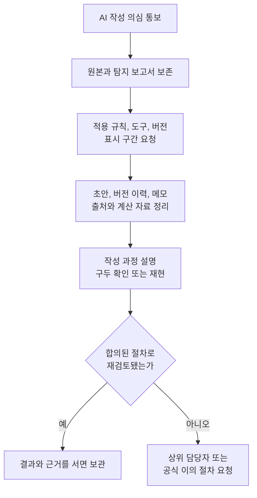

결론부터 말하면 **AI 글 탐지기의 높은 점수만으로 누가 글을 썼는지 확정할 수 없습니다.** 직접 쓴 과제, 논문, 자기소개서, 기사 원고가 AI로 잘못 표시됐다면 원문을 급히 고치지 말고 초안, 문서 버전 이력, 메모, 검색과 인용 기록을 보존하십시오. 그런 다음 담당자에게 사용한 도구와 버전, 판정 구간, 적용 규칙을 서면으로 요청하고 작성 과정을 설명할 기회를 요구하는 것이 우선입니다.

오탐은 실제 사람 글을 AI 글이라고 분류하는 **거짓 양성**입니다. 반대로 AI 글을 사람 글로 놓치는 일은 거짓 음성입니다. 두 오류는 동시에 존재하며, 탐지기가 “정확도 99%”라고 홍보하더라도 내 문서가 맞게 판정됐다는 뜻은 아닙니다. 평가 대상의 언어, 길이, 장르, 편집 정도, 탐지기 버전과 실제 AI 사용 비율이 달라지면 결과도 달라집니다.

이 글은 오탐에 대응하고 공정한 검토 절차를 설계하는 안내입니다. AI 사용을 숨기거나 탐지기를 우회하는 방법을 다루지 않습니다. 과제나 채용 규칙이 AI 사용을 금지했다면 그 규칙을 따르는 것이 먼저이며, 허용된 번역, 맞춤법 검사와 문장 보조도 공개 범위가 다를 수 있으므로 기관의 원문을 확인해야 합니다.

## 탐지 점수는 작성자 확인 기록이 아니다

AI 글 탐지기는 대개 문장의 통계적 특징을 보고 “이 분포가 기계 생성 문장과 얼마나 비슷한가”를 추정합니다. 파일을 쓰는 동안 키보드 앞에 누가 있었는지, 어떤 자료를 읽었는지, 문장마다 AI가 개입했는지를 직접 관찰하지 않습니다. 지문이나 전자서명처럼 개인의 신원을 확인하는 장치도 아닙니다.

| 화면의 표시 | 합리적으로 말할 수 있는 것 | 그것만으로 말할 수 없는 것 |
| --- | --- | --- |
| AI 가능성 80% | 도구가 입력 일부를 AI와 유사하게 분류 | 글의 80%를 AI가 작성했다는 사실 |
| 특정 문단 강조 | 그 문단의 패턴이 모델 기준을 넘음 | 어느 서비스와 계정이 작성했다는 사실 |
| 여러 도구에서 높은 점수 | 여러 분류기가 비슷한 신호를 냄 | 서로 독립된 증거가 여러 개 생겼다는 보장 |
| 0% 또는 사람 작성 | 탐지기가 AI 신호를 찾지 못함 | AI를 전혀 사용하지 않았다는 보장 |

[OpenAI의 공식 도움말](https://help.openai.com/en/articles/8318890-can-i-ask-chatgpt-if-it-wrote-something)은 ChatGPT에 “네가 이 글을 썼느냐”고 물어도 알 수 없으며, 그런 답변은 사실 근거가 없을 수 있다고 설명합니다. 생성 모델에게 저자 감정을 맡기는 것도 탐지기 점수의 대안이 아닙니다.

**탐지 점수는 조사할 질문을 만들 수 있지만 결론 자체가 될 수는 없습니다.** 결정권자는 도구가 측정한 신호와 사람이 남긴 작성 증거를 분리해서 봐야 합니다.

## 연구가 확인한 오탐과 놓침의 범위

2023년 International Journal for Educational Integrity에 실린 [Weber-Wulff 연구팀의 원문](https://link.springer.com/article/10.1007/s40979-023-00146-z)은 공개 도구 12개와 상용 시스템 2개를 54개 영어 문서에 적용했습니다. 사람 작성, 기계 번역, AI 생성, 사람 편집, 자동 바꿔쓰기 등 여섯 범주의 문서로 총 756회 검사를 구성했고, 당시 도구들이 AI와 사람 글을 신뢰성 있게 구분하지 못한다고 결론 내렸습니다.

같은 해 Patterns에 실린 [Liang 연구팀의 연구](https://doi.org/10.1016/j.patter.2023.100779)는 영어가 모국어가 아닌 사람이 작성한 TOEFL 에세이 91개를 일곱 탐지기로 검사했습니다. 평균 61.22%가 AI 생성으로 잘못 분류됐고, 91개 중 89개는 적어도 한 도구에서 표시됐습니다. 이 결과는 비원어민 영어 글에 대한 공정성 위험을 보여줍니다.

```chartjs
{
  "type": "bar",
  "data": {
    "labels": ["7개 탐지기의 평균 오탐", "한 도구 이상에서 AI로 분류"],
    "datasets": [
      {
        "label": "에세이 비율",
        "data": [61.22, 97.80],
        "backgroundColor": ["#2457ff", "#20ad91"]
      }
    ]
  },
  "options": {
    "indexAxis": "y",
    "responsive": true,
    "scales": {
      "x": {
        "beginAtZero": true,
        "max": 100,
        "title": { "display": true, "text": "비율 (%)" }
      }
    },
    "plugins": {
      "title": { "display": true, "text": "비원어민 영어 에세이 91편의 오탐 관찰" },
      "subtitle": { "display": true, "text": "Liang 외, Patterns 2023. 한국어와 최신 제품의 성능으로 일반화할 수 없음" }
    }
  }
}
```

그러나 이 숫자를 “2026년 모든 탐지기의 한국어 오탐률이 61.22%”라고 쓰면 또 다른 오류입니다. 두 연구는 2023년 당시 도구, 특정 영어 문서와 모델을 다뤘습니다. 탐지기는 계속 업데이트됐고 한국어 성능을 직접 측정한 설계가 아닙니다. 반면 실험 조건이 바뀔 때 성능과 편향도 달라진다는 사실은 고위험 결정에 단일 점수를 쓰지 말아야 할 이유가 됩니다.

| 연구 | 직접 검증한 범위 | 현재 판단에 주는 의미 | 일반화하면 안 되는 것 |
| --- | --- | --- | --- |
| Weber-Wulff 외, 2023 | 14개 도구, 54개 영어 문서, 당시 ChatGPT와 편집 조건 | 도구와 변형 조건에 따라 거짓 양성과 거짓 음성이 생김 | 최신 모든 제품의 현재 정확도 |
| Liang 외, 2023 | 7개 도구, 비원어민 영어 TOEFL 에세이 91개 | 언어 배경과 문체가 공정성에 영향을 줄 수 있음 | 한국어 문서의 수치 |
| PeerJ Computer Science, 2025 | 세 탐지기, 최신 모델 생성 및 AI 보조 학술 초록 | 정확도와 편향 사이의 절충이 계속 관찰됨 | 과제, 소설, 채용 문서 전체 |

2025년 [PeerJ Computer Science 연구](https://pmc.ncbi.nlm.nih.gov/articles/PMC12453642/)도 GPTZero, ZeroGPT, DetectGPT를 학술 초록에 적용해 정확도와 비원어민 저자 및 학문 분야 편향의 절충을 보고했습니다. 연구마다 자료와 모델이 다르므로 숫자를 한 줄 순위로 합치기보다 내 문서와 조건이 연구 범위에 들어가는지 확인해야 합니다.

## 공급사도 낮은 점수의 오해 가능성을 인정한다

탐지기 공급사의 설명은 제품 사용법을 이해하는 1차 자료지만 독립된 성능 검증과는 구분해서 읽어야 합니다. [Turnitin의 2026년 AI 글 탐지 안내](https://guides.turnitin.com/hc/en-us/articles/28294949544717-AI-writing-detection-model)는 거짓 양성이 가능하다고 밝히고, 1%에서 19% 사이 결과는 더 신뢰하기 어렵다는 이유로 정확한 수치와 강조 구간을 표시하지 않고 별표로 보여 줍니다.

공급사가 제시하는 거짓 양성률은 정해진 테스트 집합, 임계값, 지원 언어, 최소 문서 길이에서 계산된 값입니다. 개별 수업이나 회사에서 실제 AI 사용 비율이 얼마나 되는지에 따라 높은 점수가 실제 AI 글일 가능성도 달라집니다. 드문 사건을 찾는 검사에서는 낮은 거짓 양성률도 많은 사람을 검사할 때 누적될 수 있습니다.

간단한 가상 예를 보겠습니다. 1,000개 문서 중 실제 규칙 위반이 5%라고 가정하고, 탐지기가 그중 80%를 찾고 사람 글의 1%를 잘못 표시한다고 가정합니다. 그러면 실제 위반 표시 40건 외에 사람 글 약 10건도 함께 표시됩니다. 이 숫자는 어떤 실제 제품의 현재 성능이 아니라 **기본 비율과 오류율을 함께 봐야 한다는 설명용 계산**입니다.

따라서 기관은 “오탐률 1% 미만”이라는 문구만 적지 말고 다음을 공개해야 합니다.

- 사용한 제품과 탐지 모델 버전
- 지원 언어, 문서 길이와 제외되는 텍스트 유형
- 어떤 임계값부터 사람 검토를 시작하는지
- 점수를 볼 수 있는 사람과 보관 기간
- 학생이나 작성자가 설명하고 이의를 제기할 절차
- 단독 증거로 징계하지 않는다는 원칙

## 오탐을 받자마자 원본부터 보존한다

당황해서 문장을 전부 다시 쓰거나 여러 탐지기에 원고를 계속 업로드하면 두 가지 문제가 생깁니다. 첫째, 실제 작성 과정을 보여 주는 원본과 버전 차이가 흐려집니다. 둘째, 공개 무료 서비스에 미발표 논문, 개인정보와 회사 기밀을 추가로 넘길 수 있습니다.



먼저 다음 자료를 복사해 읽기 전용 폴더에 보관합니다.

- 제출한 원본 파일과 파일 생성 및 수정 시각
- 탐지 결과 화면 전체, 점수, 표시 문단과 검사 시각
- 구글 문서, 워드, 노션, 저장소의 버전 이력
- 손글씨 메모, 개요, 마인드맵과 발표 자료
- 검색 기록과 내려받은 논문, 인용 페이지 메모
- 표 계산용 스프레드시트, 코드, 조사 설문 원본
- 담당자와 주고받은 과제 지시와 이메일

파일의 날짜 정보만으로 저자를 확정할 수는 없지만, 여러 독립 기록이 시간순으로 맞물리면 작성 과정을 설명하는 데 도움이 됩니다. 새로운 증거처럼 보이도록 과거 시각을 바꾸거나 사후에 가짜 초안을 만들면 안 됩니다. 없는 자료는 없다고 말하고 기억나는 과정을 사실과 추정으로 나눠 적습니다.

## 담당자에게 다섯 가지를 서면으로 묻는다

“제가 안 썼다는 증거를 대라”는 막연한 요구에 바로 대응하기보다 판정의 기준을 구체화하십시오.

1. 어떤 규정의 어느 조항이 적용됐습니까?
2. AI 사용 전부가 금지됐습니까, 일부 편집과 번역은 허용됐습니까?
3. 어떤 탐지 제품과 모델 버전, 검사 날짜를 사용했습니까?
4. 어느 문장과 행동이 의심 근거이며 점수 외의 증거가 있습니까?
5. 설명, 재검토, 공식 이의 제기의 기한과 담당자는 누구입니까?

요청 문안은 감정적 공방보다 사실 확인에 집중합니다.

```text
제출 문서가 AI 생성으로 표시됐다는 통보를 받았습니다.
저는 해당 문서의 작성 과정을 설명하고 원본 자료를 제출하고자 합니다.
적용 규정, 사용한 탐지 도구와 버전, 검사 시각, 표시된 구간,
점수 외 판단 근거, 재검토 및 이의 제기 절차를 서면으로 알려 주십시오.
초안과 버전 이력, 참고문헌 메모를 원본 상태로 보존하고 있습니다.
```

기한이 짧으면 우선 이의 의사를 기한 안에 남기고 자료 제출 시간을 요청합니다. 전화로 합의했다면 통화 뒤 확인 이메일을 보내 날짜와 내용을 기록합니다. 학교, 회사, 출판사의 정식 절차가 있으면 그 양식과 기한을 우선합니다.

## 작성 과정은 결과가 아니라 연결을 보여 준다

버전 파일을 수십 개 내는 것만으로는 상대가 이해하기 어렵습니다. 주장과 증거를 한 장의 표로 연결하십시오.

| 의심받은 구간 | 내가 설명할 작성 과정 | 연결할 자료 | 남는 한계 |
| --- | --- | --- | --- |
| 서론의 정형적 문장 | 개요에서 문제와 결론을 먼저 정함 | 개요 2판과 수업 메모 | 문체만으로 저자 확정 불가 |
| 통계가 있는 문단 | 원자료 표에서 직접 계산 | 스프레드시트와 원문 페이지 | 계산 오류는 별도 수정 가능 |
| 용어 정의 | 교재의 정의를 요약하고 인용 | 교재 판본과 메모 | 인용 형식 검토 필요 |
| 문법이 매끄러운 문단 | 교정 도구의 맞춤법 기능 사용 | 변경 이력과 허용 정책 | 교정 기능 허용 범위 확인 필요 |

가능하면 자신의 문장을 구두로 설명하고, 인용한 자료에서 근거를 찾으며, 간단한 관련 문제를 다시 풀 수 있다는 점을 보여 줍니다. 이것도 완벽한 거짓말 탐지기는 아니지만 결과 문체만 보는 것보다 과제 목표인 이해와 수행을 직접 확인합니다.

AI를 일부 허용 범위에서 사용했다면 숨기지 말고 정확히 구분합니다. 예를 들어 “개요는 직접 작성했고 맞춤법 검사 기능을 썼으며 새 문장 생성 기능은 사용하지 않았다”처럼 기능, 범위, 최종 검토를 설명합니다. 규칙이 모호했다면 어떤 안내를 보고 판단했는지도 제시합니다.

## 여러 탐지기에 다시 넣는 행동은 신중해야 한다

오탐을 반박하려고 무료 탐지기 다섯 곳에서 낮은 점수를 받아도 작성자를 증명하지는 못합니다. 높은 점수 다섯 개가 확정 증거가 아닌 것과 같은 이유입니다. 서비스마다 결과가 다르면 불일치를 보여 주는 참고는 되지만, 원고가 외부 서버에 저장되거나 모델 개선에 쓰이는지 알기 어려울 수 있습니다.

미발표 연구, 학생 개인정보, 고객 문서, 채용 자료는 무단 업로드하지 않습니다. 기관이 재검사를 원한다면 다음 조건을 먼저 확인합니다.

- 누가 업로드 권한을 갖는가
- 제출물과 탐지 결과가 어디에 얼마나 오래 보관되는가
- 공급사가 학습이나 제품 개선에 사용하는가
- 기존 저장소와 유사도 데이터베이스에 등록되는가
- 삭제와 접근 요청을 어떻게 하는가
- 같은 파일을 같은 버전으로 검사하는가

**점수를 낮추기 위해 문체를 일부러 망가뜨리거나 바꿔쓰기 도구를 쓰지 마십시오.** 이는 오탐 대응이 아니라 작성 이력을 더 복잡하게 만들고, 허용되지 않은 AI 사용을 새로 추가할 수 있습니다.

## 교사와 편집자는 자동 처벌 대신 검토 절차를 설계한다

[UNESCO의 생성형 AI 교육 및 연구 가이드](https://www.unesco.org/en/articles/guidance-generative-ai-education-and-research)는 AI 생성물 표시와 탐지 도구의 효과를 뒷받침하는 증거가 부족하다고 지적하고, 인간의 엄밀한 검토와 평가 설계의 재고를 제안합니다. 교육기관은 탐지기를 사기 전에 무엇을 평가할지부터 다시 정의할 필요가 있습니다.

실무 원칙은 다음과 같습니다.

- 과제 전에 허용, 제한, 금지되는 AI 기능을 사례와 함께 알립니다.
- 탐지 점수는 비공개 선별 신호로만 쓰고 자동 감점하지 않습니다.
- 학생에게 표시 구간과 근거를 제공하고 설명 기회를 줍니다.
- 초안, 구두 설명, 수업 중 작업과 출처 이해를 함께 평가합니다.
- 비원어민, 장애 학생, 보조 기술 이용자가 불리해지는지 점검합니다.
- 같은 사례에 같은 절차와 입증 기준을 적용합니다.
- 판정과 이의 결과를 기록해 도구의 실제 오탐을 감사하고 필요하면 사용을 중단합니다.

과제 자체도 과정 증거가 생기도록 바꿀 수 있습니다. 주제 제안, 자료 평가표, 중간 개요, 초안 피드백, 최종 성찰을 나누어 제출하게 하고, 학생이 핵심 선택을 설명하게 합니다. 이렇게 하면 탐지기보다 학습 목표에 가까운 증거가 쌓입니다.

## 제출 전과 통보 후 체크리스트

### 평소에 남길 것

- [ ] 과제 원문과 AI 사용 규칙을 저장했다.
- [ ] 개요와 초안을 같은 문서의 버전 이력에 남겼다.
- [ ] 인용 자료의 링크, 페이지와 열람 날짜를 적었다.
- [ ] 계산과 표의 중간 파일을 보관했다.
- [ ] 허용된 교정, 번역, AI 보조 기능을 기록했다.
- [ ] 공동 작업자의 역할을 문서로 남겼다.

### 오탐 통보 뒤 할 것

- [ ] 제출 원본과 탐지 화면을 수정하지 않고 보존했다.
- [ ] 적용 규정과 이의 기한을 확인했다.
- [ ] 도구, 버전, 검사 시각과 표시 구간을 요청했다.
- [ ] 주장과 작성 증거를 표로 연결했다.
- [ ] 사실을 설명할 구두 검토를 요청했다.
- [ ] 결과와 근거를 서면으로 받았다.
- [ ] 개인정보가 든 원고를 임의의 무료 탐지기에 올리지 않았다.

오탐 대응의 목표는 “내가 더 사람 같은 문장을 쓴다”가 아닙니다. **누가 어떤 규칙 아래 어떤 과정을 거쳐 문서를 만들었는지 검토 가능한 기록으로 보여 주는 것**입니다.

<!-- internal-links:start -->
## 함께 읽기

- [AI 자소서 쓰는 법, 채용공고에서 경험까지]() — AI 초안을 쓰더라도 실제 경험, 숫자와 수정 이력을 남겨 제출 책임을 지는 방법을 안내합니다.
- [ChatGPT 프롬프트 작성 완전 가이드]() — 생성 요청을 분석과 검수 단계로 나누고 결과의 범위를 통제하는 기본법을 정리합니다.
- [딥페이크 시대, 증거가 무너지는 방식]() — 겉모습의 진짜다움이나 탐지 점수 대신 출처와 생성 과정을 증거로 남겨야 하는 이유를 설명합니다.
<!-- internal-links:end -->

## 자주 묻는 질문

### AI 탐지기 점수가 높으면 AI가 썼다는 증거인가요?

아닙니다. 점수는 특정 모델이 문장 패턴을 분류한 결과이며 작성자를 직접 관찰한 기록이 아닙니다. 처벌이나 계약 해지 같은 결정은 원본, 버전 기록, 자료 조사 과정과 당사자 설명을 함께 검토해야 합니다.

### 오탐을 받으면 글을 사람답게 다시 고쳐 제출해야 하나요?

먼저 원본을 바꾸지 말고 복사본과 버전 이력을 보존하세요. 탐지 점수를 낮추기 위한 재작성은 작성 증거를 흐릴 수 있으므로 담당자에게 재제출 조건과 공식 이의 절차를 확인한 뒤 수정해야 합니다.

### 여러 탐지기가 모두 AI라고 하면 확정할 수 있나요?

확정할 수 없습니다. 여러 서비스가 비슷한 문체 특징과 학습 자료에 의존하면 오류도 함께 반복할 수 있습니다. 도구 수보다 독립된 작성 과정 증거와 적용 정책이 중요합니다.

### 교사는 AI 탐지기를 전혀 사용하면 안 되나요?

탐지 결과를 질문을 시작하는 제한된 신호로 사용할 수는 있지만 단독 증거로 자동 처벌해서는 안 됩니다. 과제 규칙, 초안과 버전 기록, 인용, 구두 설명, 학생의 접근성과 언어 배경을 함께 검토해야 합니다.

## 직접 확인한 원문

1. [Weber-Wulff 외, Testing of detection tools for AI-generated text](https://link.springer.com/article/10.1007/s40979-023-00146-z) (International Journal for Educational Integrity, 2023)
2. [Liang 외, GPT detectors are biased against non-native English writers](https://doi.org/10.1016/j.patter.2023.100779) (Patterns, 2023)
3. [Elkhatat 외, The accuracy-bias trade-offs in AI text detection tools](https://pmc.ncbi.nlm.nih.gov/articles/PMC12453642/) (PeerJ Computer Science, 2025)
4. [Turnitin, AI writing detection model release notes](https://guides.turnitin.com/hc/en-us/articles/28294949544717-AI-writing-detection-model) (2026-02-16 갱신, 2026-09-04 확인)
5. [UNESCO, Guidance for generative AI in education and research](https://www.unesco.org/en/articles/guidance-generative-ai-education-and-research) (2023, 2026-01-16 갱신)
6. [OpenAI, Can I ask ChatGPT if it wrote something?](https://help.openai.com/en/articles/8318890-can-i-ask-chatgpt-if-it-wrote-something) (2026-09-04 확인)

> 탐지 모델은 계속 바뀝니다. 본문의 연구 수치는 각 논문이 시험한 언어, 문서, 도구와 시점에만 직접 적용되며 현재 모든 한국어 탐지기의 성능으로 일반화할 수 없습니다.
