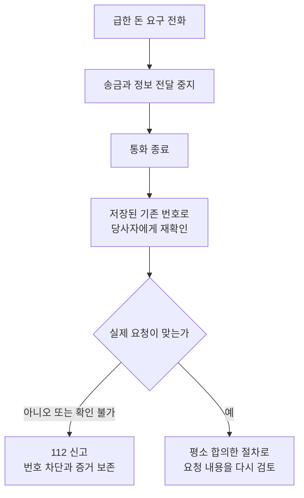

결론부터 말하면 **가족이나 상사와 똑같이 들리는 목소리도 본인 확인 수단으로 믿으면 안 됩니다.** 돈, 인증번호, 원격 제어 앱, 비밀 유지를 요구하면 통화를 끊고 내가 원래 알고 있던 번호와 별도 채널로 당사자에게 확인하십시오. 이미 송금했다면 진위를 더 따지는 동안 기다리지 말고 112와 금융회사에 즉시 피해 사실을 알리고 지급정지를 요청하는 것이 우선입니다.

AI 음성 복제는 기존 보이스피싱의 압박을 더 그럴듯하게 만드는 수단입니다. 그러나 대응의 중심은 탐지 앱으로 가짜 목소리를 맞히는 일이 아닙니다. **그 통화 안에서 신원을 확인하지 않고, 돈이 움직이기 전에 독립된 채널로 거래를 멈추는 것**이 핵심입니다. 발신번호 표시도 조작될 수 있으므로 목소리, 전화번호, 상대가 아는 가족 정보가 동시에 맞더라도 송금 근거로 삼지 않습니다.

아래 내용은 2026년 9월 4일 기준 정부와 공공기관 안내를 생활 절차로 재구성한 것입니다. 실제 사건에서는 112, 이용 금융회사, 118의 최신 안내를 따르십시오. 피해금 환급 여부와 범위는 계좌 잔액, 지급정지 시점, 조사 결과에 따라 달라지며 이 글이 회수를 보장하지는 않습니다.

## 목소리가 아니라 요청의 구조를 보라

[미국 연방거래위원회의 가족 긴급상황 사기 안내](https://consumer.ftc.gov/articles/scammers-use-fake-emergencies-steal-your-money)는 짧은 공개 음성 조각과 음성 복제 프로그램으로 가족처럼 들리는 전화를 만들 수 있다고 경고합니다. 중요한 단서는 음색보다 대화 구조에 있습니다.

| 통화에서 나온 요구 | 위험한 이유 | 즉시 할 행동 |
| --- | --- | --- |
| 지금 당장 돈을 보내라 | 생각하고 확인할 시간을 없앰 | 끊고 기존 번호로 재통화 |
| 아무에게도 말하지 마라 | 다른 사람의 교차 확인을 차단 | 가족 한 명 이상에게 알림 |
| 안전 계좌로 자금을 옮겨라 | 금융기관 사칭의 전형적 자금 이동 | 금융회사 공식 번호에 직접 문의 |
| 앱을 설치하고 화면을 보여 달라 | 기기 통제와 정보 탈취 가능 | 설치하지 말고 통화 종료 |
| 인증번호와 비밀번호를 읽어 달라 | 계정과 결제 승인에 악용 가능 | 어떤 번호도 전달하지 않음 |
| 현금, 상품권, 가상자산만 가능하다 | 취소와 추적이 어려운 수단으로 유도 | 지급하지 말고 112 신고 |

진짜 가족이 사고를 당한 경우에도 확인 절차는 해를 만들지 않습니다. “끊지 마”라는 말에 따를 이유가 없습니다. 상대가 가족의 학교, 직장, 반려동물 이름을 알아도 사회관계망 게시물이나 유출 자료에서 얻었을 수 있습니다. 아는 정보의 양과 신원은 같은 것이 아닙니다.

## 송금 전에는 통화 밖으로 나오는 것이 첫 단계다

의심 전화가 오면 다음 다섯 단계만 기억해도 됩니다.

1. 송금, 앱 설치, 인증번호 전달을 멈춥니다.
2. 상대의 허락을 구하지 말고 통화를 끊습니다.
3. 통화 목록의 재발신 버튼이 아니라 주소록에 원래 저장한 번호로 당사자에게 전화합니다.
4. 연락이 안 되면 다른 가족, 학교, 회사 대표번호처럼 독립된 채널로 상황을 확인합니다.
5. 기관을 사칭했다면 상대가 알려준 번호가 아니라 기관 공식 홈페이지의 대표번호로 직접 전화합니다.

가족끼리 비상 확인 문구를 정하는 것도 보조 장치가 될 수 있습니다. 다만 생일이나 반려동물 이름처럼 공개 정보로 추정할 수 있는 답은 피하고, 전화나 공개 메신저에서 그 문구를 새로 정하지 않습니다. 문구가 노출됐다고 의심되면 바꿉니다. 이 장치도 독립된 번호로 다시 연락하는 절차를 대신하지는 않습니다.

## 이미 송금했다면 신고와 지급정지가 먼저다

돈을 보낸 뒤에는 사기범과 말싸움을 하거나 인터넷에서 번호를 검색하는 데 시간을 쓰지 마십시오. [금융위원회의 통합신고대응센터 안내](https://www.fsc.go.kr/po010101/80830)는 보이스피싱 피해 신고를 112로 일원화해 사건 접수와 악성 앱 차단, 지급정지 같은 피해구제 연결을 한 번에 처리하도록 했다고 설명합니다.

동시에 송금한 은행이나 금융회사 공식 고객센터에 전화해 “보이스피싱 피해 송금이며 지급정지를 요청한다”고 분명히 말합니다. 상대가 보낸 링크나 검색 광고의 번호는 쓰지 말고 카드, 통장, 공식 앱이나 금융회사 홈페이지에 표시된 번호를 이용합니다.

우선순위는 다음과 같습니다.

- **즉시:** 112와 금융회사에 피해 신고 및 지급정지 요청
- **안내받은 기한 안:** 경찰 사건 접수, 사건사고사실확인원과 금융회사가 요구한 피해구제 서류 제출
- **같은 날:** 다른 계좌와 카드의 이상 거래, 간편결제와 가상자산 계정 확인
- **그다음:** 통화, 문자, 계좌와 송금 자료를 시간순으로 정리
- **후속:** 금융감독원 1332를 통한 피해구제 절차 상담과 진행 상태 확인

송금 취소 버튼만 눌렀다고 지급정지와 피해구제 신청이 모두 끝난 것으로 생각하면 안 됩니다. 금융회사가 요구하는 서면 신청과 증빙 기한을 확인하고 접수번호, 담당 부서, 제출 시각을 기록합니다. 현금으로 직접 건넸거나 가상자산으로 옮긴 경우에는 계좌 기반 환급 절차가 그대로 적용되지 않을 수 있으므로 112에 거래 방식과 수취 정보를 정확히 알립니다.

## 악성 앱을 설치했다면 같은 휴대전화를 믿지 마라

보이스피싱 과정에서 “보안 앱”, “검찰 문서”, “대출 확인”, “택배 조회”라며 앱을 설치하게 만들기도 합니다. 악성 앱은 통화와 문자를 가로채거나 연락처를 빼내고, 피해자가 은행이나 경찰에 건 전화를 다른 곳으로 연결하는 데 악용될 수 있습니다.

[KISA 보호나라의 보안 공지](https://www.boho.or.kr/kr/bbs/view.do?bbsId=B0000133&menuNo=205020&nttId=71593)는 악성 앱을 설치하고 실행한 사실을 알게 된 경우 비행기 모드로 전환하거나 전원을 끈 뒤 경찰서에 감염 사실을 신고하도록 안내합니다. 따라서 가능하면 감염이 의심되는 기기가 아닌 다른 전화로 112와 금융회사에 연락합니다.

상황별로 구분하십시오.

| 한 행동 | 의미 | 다음 조치 |
| --- | --- | --- |
| 문자만 받음 | 감염 증거가 없음 | 링크를 누르지 말고 신고 및 삭제 |
| 링크만 열었음 | 감염이 자동 확정되지는 않음 | 정보 입력과 내려받기 여부 확인, 118 상담 |
| 개인정보를 입력함 | 계정 탈취와 명의도용 위험 | 깨끗한 기기에서 비밀번호 변경, 추가 인증 설정 |
| 앱을 설치하고 실행함 | 기기 통제와 정보 유출 위험이 큼 | 비행기 모드 또는 전원 종료, 112와 118 안내에 따라 점검 |
| 원격 제어와 금융 앱을 함께 사용함 | 거래정보 노출 가능성이 큼 | 금융회사에 알리고 인증수단 폐기 및 재발급 여부 확인 |

[KISA의 스미싱 대응 안내](https://www.boho.or.kr/common/cmm/fms/FileDown.do?atchFileId=FILE_000000000084934&fileSn=1)는 모바일 백신, 수동 삭제, 서비스센터 방문을 악성 앱 제거 방법으로 제시하고, 감염 기기로 금융서비스를 썼다면 인증서와 금융거래 정보를 폐기하고 재발급하도록 안내합니다. 초기화는 증거 보존과 계정 복구에 영향을 줄 수 있으므로 무작정 먼저 하지 말고 118, 경찰, 제조사 서비스센터의 안내에 따라 진행합니다.

## 개인정보를 줬다면 돈 이외의 통로도 닫아라

주민등록증 사진, 계좌번호, 카드 정보, 인증번호, 통신사 정보를 넘겼다면 당장의 송금 피해가 없어도 후속 공격이 가능합니다. 사기범이 내 이름으로 새 휴대전화를 개통하거나 기존 계정의 비밀번호 재설정을 시도할 수 있기 때문입니다.

다음 순서로 확인합니다.

- 깨끗한 기기에서 이메일부터 비밀번호를 바꾸고 모든 세션을 로그아웃합니다.
- 같은 비밀번호를 쓴 금융, 쇼핑, 사회관계망 계정도 각각 다른 비밀번호로 바꿉니다.
- 가능한 계정에는 앱 기반 추가 인증을 설정하고 복구 이메일과 전화번호를 확인합니다.
- 금융회사에 개인정보 노출 사실을 알리고 추가 보호 조치를 문의합니다.
- 통신사 결제 내역과 간편결제, 카드 승인 알림을 확인합니다.
- 지인에게 내 번호로 돈이나 인증번호를 요구하는 연락을 믿지 말라고 알립니다.

[Msafer 명의도용방지서비스](https://www.msafer.or.kr/protection_use/guide.do)는 본인 명의의 통신서비스 개통 현황을 한 번에 조회하고 이동전화의 신규 개통, 번호이동, 기기변경과 명의변경을 사전에 제한할 수 있는 무료 서비스를 제공합니다. 의심 회선이 확인되면 해당 통신사에 즉시 이용정지를 요청하고 도용자가 임의로 풀지 못하도록 보호 절차를 확인합니다.

신분증 사본이 넘어갔다면 재발급만으로 모든 위험이 자동 종료된다고 단정할 수 없습니다. 어떤 정보가 언제 노출됐는지 목록을 만들고 금융회사, 통신사와 수사기관에 그대로 전달해야 필요한 조치를 빠뜨리지 않습니다.

## 증거는 원본과 시간 순서를 함께 남긴다

사기범을 차단하는 것과 증거를 지우는 것은 다릅니다. 추가 연락에는 응답하지 않되 다음 자료를 원본 형태로 보관합니다.

- 통화 시각, 지속 시간, 화면에 표시된 발신번호의 캡처
- 자동 또는 수동 통화 녹음 파일과 원본 파일 정보
- 문자와 메신저 전체 대화, 인터넷주소, 전송된 파일 이름
- 상대가 알려준 계좌, 가상자산 주소, 상품권 번호와 수취인 정보
- 송금 영수증, 거래 시각, 금융회사, 금액과 거래 식별 정보
- 설치한 앱 이름, 설치 파일, 권한 화면과 기기 이상 증상
- 112와 금융회사 접수번호, 담당 부서, 통화 시각

자료를 편집해 하나의 이미지로만 합치지 말고 원본도 남깁니다. 별도 메모에는 “전화 수신, 앱 설치, 인증번호 전달, 송금, 사기 인지, 신고” 순으로 시각을 적습니다. 기억이 흐려지기 전에 사실과 추정을 나눠 기록하십시오. 목소리가 누구와 비슷했다는 판단보다 상대가 어떤 문장을 말했고 어떤 행동을 요구했는지가 수사와 추가 피해 차단에 더 구체적인 정보가 됩니다.

## 탐지 앱의 퍼센트로 송금을 결정하지 마라

실시간 딥보이스 탐지 기능이 도움이 될 수는 있지만, 어떤 탐지기도 모든 통화와 모든 새 모델에서 진위를 보장하지 않습니다. 배경 소음, 짧은 발화, 통신 압축, 실제 사람의 녹음 재생도 결과에 영향을 줄 수 있습니다. “진짜 확률 92%” 같은 숫자가 떠도 고액 송금을 승인하는 신원 인증으로 쓰면 안 됩니다.

반대로 탐지기가 가짜라고 표시했다고 해서 통화 속 실제 가족의 안전 문제를 무시해서도 안 됩니다. 통화를 끊고 원래 번호, 다른 가족, 학교나 직장 대표번호를 통해 상황 자체를 확인하면 됩니다. **탐지 결과는 경고 신호이고, 독립 채널 확인이 결정 절차입니다.**

발신번호 역시 같은 원칙이 적용됩니다. 경찰청은 [가족 번호처럼 보이게 조작한 전화 사례](https://www.police.go.kr/user/bbs/BD_selectBbs.do?q_bbsCode=1007&q_bbscttSn=20220420152805616)를 안내한 바 있습니다. 화면에 저장된 이름이 떴다는 사실은 통신 상대의 신원을 증명하지 않습니다.

## 가족과 회사가 미리 정할 수 있는 승인 규칙

사건이 일어난 뒤 침착하라고 말하는 것보다 돈이 움직이는 규칙을 미리 바꾸는 편이 효과적입니다.

### 가족용 규칙

- 전화 한 통만으로 일정 금액 이상을 보내지 않습니다.
- 긴급 송금은 당사자 재통화와 다른 가족 한 명의 확인을 거칩니다.
- 비상 확인 문구는 공개 게시물에 쓰지 않고 노출 시 교체합니다.
- 가족의 목소리가 긴 영상으로 공개돼 있다면 공개 범위와 필요성을 함께 점검합니다.
- 부모와 자녀의 휴대전화에 112, 주거래 금융회사, 118을 저장합니다.

### 회사용 규칙

- 임원 음성이나 영상 통화만으로 계좌 변경을 승인하지 않습니다.
- 신규 수취 계좌와 고액 송금은 등록된 연락처로 재확인하고 두 사람이 승인합니다.
- 메신저로 온 계좌는 기존 계약서와 공급사 대표번호로 다시 대조합니다.
- 승인 예외를 요구한 사람과 사유, 재확인 결과를 기록합니다.
- 보이스피싱 의심 상황에서 직원이 거래를 멈춰도 불이익이 없다는 원칙을 알립니다.

규칙은 진짜 긴급상황에서도 적용해야 합니다. 특정 직급이나 가족만 예외로 두면 사기범은 바로 그 예외를 연기합니다.

## 오늘 준비할 대응 카드

종이에 적어 지갑이나 냉장고에 붙일 수 있는 최소 대응 카드입니다.

- [ ] 돈과 인증번호를 요구하면 먼저 끊는다.
- [ ] 통화 목록이 아니라 저장된 원래 번호로 다시 건다.
- [ ] 다른 가족이나 공식 대표번호로 두 번째 확인을 한다.
- [ ] 송금했다면 즉시 112와 금융회사에 지급정지를 요청한다.
- [ ] 앱을 설치했다면 비행기 모드 또는 전원 종료 후 다른 기기로 신고한다.
- [ ] 악성 앱과 스미싱 상담은 국번 없이 118을 이용한다.
- [ ] 통화, 문자, 계좌, 송금 자료는 삭제하지 않고 보존한다.
- [ ] 개인정보가 노출됐다면 이메일, 금융, 통신 명의도용 경로를 함께 점검한다.
- [ ] 피해자를 탓하지 않고 추가 피해 차단에 집중한다.

피해자가 이미 돈을 보냈다면 “왜 확인하지 않았느냐”고 추궁하는 동안 신고가 늦어집니다. 먼저 전화와 거래를 끊고, 신고하고, 사실을 기록한 다음 원인을 복기하십시오.

<!-- internal-links:start -->
## 함께 읽기

- [딥페이크 시대, 증거가 무너지는 방식]() — 얼굴과 목소리의 그럴듯함 대신 출처, 원본과 검증 절차를 증거로 삼아야 하는 이유를 설명합니다.
- [Microsoft VibeVoice의 장시간 음성 생성 구조]() — 긴 음성을 만드는 기술의 가능성과 음성 복제가 악용될 때 필요한 안전 기준을 기술 관점에서 살펴봅니다.
- [AI 도구 100개 디렉터리]() — 음성 생성 도구를 포함한 여러 AI 서비스의 용도와 선택 기준을 한눈에 확인합니다.
<!-- internal-links:end -->

## 자주 묻는 질문

### 가족 목소리와 똑같으면 본인이라고 믿어도 되나요?

안 됩니다. 일단 통화를 끊고 저장해 둔 기존 번호로 직접 다시 전화하거나 다른 가족에게 확인해야 합니다. 목소리와 화면에 뜬 발신번호만으로 본인을 확인하지 마세요.

### 이미 돈을 보냈다면 어디에 가장 먼저 연락해야 하나요?

즉시 112와 송금한 금융회사에 보이스피싱 피해 사실을 알리고 지급정지를 요청하세요. 시간이 지날수록 회수 가능성이 낮아질 수 있으므로 증거 정리보다 신고를 먼저 해야 합니다.

### 문자 링크를 눌렀지만 앱은 설치하지 않았습니다. 휴대전화를 초기화해야 하나요?

링크를 눌렀다는 사실만으로 악성 앱 설치가 확정되지는 않습니다. 개인정보 입력, 파일 내려받기, 앱 설치와 실행 여부를 확인하고 118 또는 제조사 서비스센터의 안내에 따라 점검한 뒤 초기화 필요성을 결정하세요.

### 사기 통화와 문자는 바로 삭제하는 것이 안전한가요?

아닙니다. 추가 접촉은 차단하되 발신번호, 통화 시각, 녹음, 문자 주소, 계좌번호, 송금 영수증은 원본 상태로 보존하세요. 신고와 피해구제 과정에서 필요한 자료가 될 수 있습니다.

## 직접 확인한 원문

1. [금융위원회, 전기통신금융사기 통합신고대응센터 출범](https://www.fsc.go.kr/po010101/80830) (2023-09-26, 2026-09-04 확인)
2. [한국인터넷진흥원, 모두의 안심콜 118 안내](https://www.kisa.or.kr/cyberhelper118) (2026-09-04 확인)
3. [KISA 보호나라, 악성 앱 설치와 스미싱 대응 안내](https://www.boho.or.kr/kr/bbs/view.do?bbsId=B0000133&menuNo=205020&nttId=71593) (2026-09-04 확인)
4. [KISA 보호나라, 스미싱 피해 대응 자료](https://www.boho.or.kr/common/cmm/fms/FileDown.do?atchFileId=FILE_000000000084934&fileSn=1) (2026-09-04 확인)
5. [Msafer, 명의도용방지서비스 소개](https://www.msafer.or.kr/protection_use/guide.do) (2026-09-04 확인)
6. [미국 연방거래위원회, Scammers Use Fake Emergencies To Steal Your Money](https://consumer.ftc.gov/articles/scammers-use-fake-emergencies-steal-your-money) (2023-09, 2026-09-04 확인)

> 신고 창구와 후속 서류는 제도 개편이나 사건 유형에 따라 달라질 수 있습니다. 긴급한 피해 상황에서는 이 글을 계속 읽기보다 112와 이용 금융회사의 공식 고객센터에 먼저 연락하십시오.
