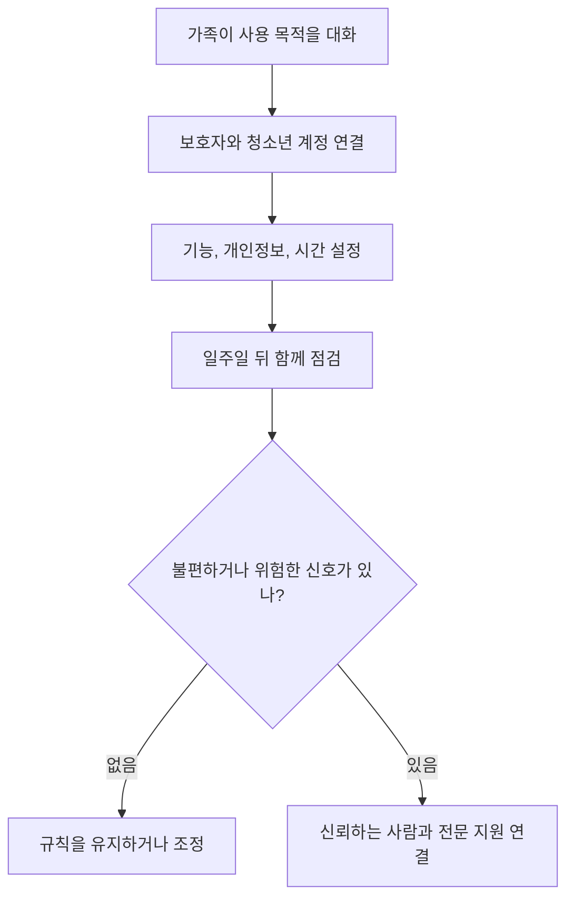

답부터 말하면, **ChatGPT 보호자 통제는 청소년의 대화를 몰래 읽는 기능이 아니다.** 보호자와 청소년이 각자 계정을 연결하면 보호자는 민감한 콘텐츠 축소, 모델 개선을 위한 대화 사용, 저장된 메모리 참조, 음성, 이미지 생성, 학습 모드, 이용 시간 같은 일부 설정을 관리할 수 있다. 그러나 대화 내용과 채팅 기록, 실시간 활동은 볼 수 없다. 제한된 중대한 안전 상황에서는 알림을 받을 수 있지만, 그것도 일상 대화를 전달하는 상시 감시가 아니다.

따라서 첫날 해야 할 일은 모든 스위치를 무조건 끄는 것이 아니다. 무엇을 켜고 왜 켜는지, AI 답변을 언제 사람에게 다시 확인할지, 불편하거나 위험한 대화가 생기면 누구에게 말할지를 보호자와 청소년이 함께 정해야 한다. 공식 설정은 안전벨트이고, 가족의 합의는 운전 규칙이다. 둘 중 하나만으로는 충분하지 않다.

## 보호자 통제가 하는 일과 하지 않는 일

[OpenAI의 보호자 통제 도움말](https://help.openai.com/en/articles/12315553-parental-controls-in-chatgpt)은 연결된 보호자가 선택한 기능과 시간 설정을 바꿀 수 있다고 설명한다. 보호자는 한 명 이상의 청소년을 연결할 수 있지만, 청소년 계정 하나는 한 시점에 보호자 한 명과 연결된다. 초대는 전화번호나 이메일로 보내고 상대가 수락해야 완성된다. 기능 이름과 기본값은 서비스 업데이트, 지역, 요금제에 따라 바뀔 수 있으므로 실제 화면을 기준으로 확인해야 한다.

가장 중요한 한계는 프라이버시다. 계정을 연결해도 보호자는 청소년의 질문과 답변, 검색한 주제, 채팅 목록을 열람할 수 없다. 청소년도 자신에게 어떤 보호자 설정이 적용됐는지는 볼 수 있다. 어느 한쪽이 연결을 해제할 수 있고, 청소년이 해제하면 보호자에게 알림이 전달된다. 즉 이 기능은 비밀 감시 장치가 아니라 서로 보이는 설정 계약에 가깝다.

또한 스위치를 껐다고 모든 위험이 사라지는 것은 아니다. 민감한 콘텐츠 축소는 특정 범주의 노출 가능성을 낮추지만 모든 문장을 정확히 분류한다는 보증이 아니다. 이미지 생성을 막아도 텍스트 답변의 오류는 남고, 음성을 막아도 과도한 사용은 다른 화면에서 이어질 수 있다. 반대로 기능을 켰다고 성인 계정과 똑같아지는 것도 아니다. 청소년 계정에는 별도의 연령 적합 보호가 계속 적용될 수 있다.

## 계정 연결은 열 분보다 합의 한 문장이 먼저다

연결 절차는 짧다. 보호자는 ChatGPT의 프로필 메뉴에서 설정을 열고 보호자 통제로 이동한 뒤 가족 구성원 추가를 선택한다. 전화번호 또는 이메일로 초대를 보내면 청소년이 링크를 열어 수락한다. 청소년이 먼저 설정에서 보호자 초대를 보낼 수도 있다. 연결 뒤 보호자는 가족 구성원 목록에서 청소년을 선택해 지원되는 설정을 확인한다.

하지만 초대 버튼을 누르기 전에 다음 문장을 먼저 합의하는 편이 좋다.

> 이 연결은 네 대화를 읽기 위한 것이 아니라, 어떤 기능과 시간을 사용할지 함께 정하고 위험할 때 서로 연락하기 위한 것이다.
{: .prompt-tip }

이 설명이 빠지면 청소년은 안전 기능을 감시로 받아들이고 다른 계정을 만들거나 중요한 고민을 숨길 수 있다. 보호자는 볼 수 없는 정보를 볼 수 있다고 암시해서도 안 된다. 공식 한계를 정확히 말해야 문제가 생겼을 때 청소년이 먼저 알릴 가능성이 커진다. 연결을 거부하거나 해제할 수 있다는 사실도 숨기지 말고, 해제 알림을 처벌 신호가 아니라 대화를 다시 시작할 신호로 정한다.

설정 뒤에는 새 대화 하나를 열어 실제 반영 여부를 확인한다. OpenAI는 일부 변경이 즉시 적용되지 않거나 기존 대화에는 이전 동작이 남을 수 있다고 안내한다. 변경 직후 기존 대화 하나만 보고 실패했다고 판단하지 말고, 앱을 최신 상태로 만든 뒤 새 대화에서 확인한다. 그래도 다르면 공식 도움말의 현재 제공 범위와 계정 지역을 확인한다.

## 처음에는 네 묶음으로 설정을 나누자

스위치가 많아 보여도 목적에 따라 네 묶음으로 나누면 쉽다. 아래 표의 권장 시작점은 모든 가정에 같은 정답이 있다는 뜻이 아니다. 학교 과제, 창작, 접근성, 나이, 가족의 생활 시간에 맞춰 조정하되 선택 이유를 한 문장으로 남기는 출발점이다.

| 설정 묶음 | 확인할 항목 | 처음 설정할 때 물어볼 질문 | 다시 볼 시점 |
| --- | --- | --- | --- |
| 콘텐츠 | 민감한 콘텐츠 축소 | 어떤 주제에서 사람의 설명이 먼저 필요한가 | 불편한 답변을 본 뒤 |
| 개인정보 | 모델 개선용 사용, 저장 메모리 | 이름, 학교, 위치, 사진을 입력해도 되는가 | 새 기능을 켤 때 |
| 생성 기능 | 음성, 이미지, 온라인 연결 기능 | 과제와 놀이 중 어디에 필요한가 | 사용 목적이 바뀔 때 |
| 시간과 학습 | 학습 모드, 학습 시간, 조용한 시간 | 잠, 숙제, 가족 시간을 방해하는가 | 일주일 사용 뒤 |

민감한 콘텐츠 축소는 연결 시 추가 보호를 제공하며 폭력적이거나 성적인 역할극, 위험한 유행 도전, 극단적인 외모 기준 같은 범주의 노출을 줄이는 데 쓰인다. 보호자가 이 옵션을 조정할 수 있더라도 끄기 전에 필요한 이유를 함께 말해야 한다. 특정 문학 작품이나 보건 수업 질문이 막혔다면 전체 보호를 없애기보다 교사나 보호자가 함께 자료를 확인하는 방법부터 시도한다.

음성과 이미지 기능은 단순한 재미 스위치가 아니다. 음성은 사람처럼 느껴지는 정도와 사용 시간이 커질 수 있고, 이미지에는 본인이나 친구의 얼굴을 올릴 가능성이 있다. 필요한 과제가 없다면 처음에는 제한하고, 필요할 때 기간과 목적을 정해 켜는 방식이 이해하기 쉽다. 온라인 서비스에 접근하는 기능이 화면에 보인다면 어떤 계정과 자료까지 닿는지 별도로 확인한다. 하나의 스위치가 검색, 연결 앱, 브라우저 기능 전체를 한꺼번에 통제한다고 가정해서는 안 된다.

## 모델 학습과 메모리는 서로 다른 개인정보 설정이다

모델 개선을 위한 대화 사용과 저장 메모리는 비슷해 보이지만 목적이 다르다. 모델 개선 설정은 청소년의 대화가 OpenAI 모델 개선에 사용될 수 있는지를 다룬다. 저장 메모리는 ChatGPT가 이름, 선호, 진행 중인 과제 같은 정보를 다음 대화에서 참고할 수 있는지를 다룬다. 하나를 껐다고 다른 하나도 자동으로 꺼졌다고 생각하면 안 된다.

보호자가 모델 개선용 사용을 끄더라도 개인정보를 아무렇게나 입력해도 된다는 뜻은 아니다. 청소년과 아래 입력 금지 목록을 함께 정한다.

- 집 주소, 실시간 위치, 전화번호와 개인 계정 비밀번호
- 학교명과 반, 시간표를 한꺼번에 식별할 수 있는 정보
- 주민등록번호, 여권, 학생증, 진료 기록과 금융 정보
- 친구나 교사의 얼굴, 연락처, 사적인 대화처럼 타인의 정보
- 공개되면 곤란한 시험 답안, 학교 내부 문서와 가족 자료

과제를 질문하려면 이름과 학교를 지우고 필요한 문장만 붙인다. 사진은 배경에 주소, 교복 이름표, 차량 번호가 없는지 본다. 답변을 받은 뒤에도 공유 링크를 만들기 전에 대화 전체에 민감정보가 남았는지 확인한다. 삭제와 학습 제외는 같은 기능이 아니므로 각각의 현재 설정과 데이터 관리 안내를 따로 확인한다.

메모리를 켤 때는 편리함과 축적 범위를 함께 본다. 반복 설명을 줄이는 장점이 있지만, 틀린 정보나 시간이 지난 정보를 계속 참고할 수 있다. 한 달에 한 번 저장된 메모리를 청소년과 함께 검토하고 필요 없는 항목을 지운다. 이때 대화 내용을 보여 달라고 요구하는 대신 설정 화면에 저장된 정보의 종류와 삭제할 범위를 함께 결정한다.

## 학습 시간과 조용한 시간은 목적이 다르다

[ChatGPT for Teens 공식 안내](https://help.openai.com/en/articles/20001421)는 학습을 돕는 기능과 균형 잡힌 사용을 위한 시간 설정을 구분한다. 학습 모드는 답만 빠르게 내놓기보다 문제를 단계적으로 이해하도록 돕는 대화 방식이다. 학습 시간은 지원되는 새 대화가 특정 시간대에 학습 모드로 시작하도록 할 수 있지만, 접속 자체를 막는 기능은 아니다. 조용한 시간은 정한 시간대에 ChatGPT 사용을 제한하는 기능이다.

시험 기간이라고 하루 종일 학습 모드만 강제하면 모든 과목에 적합하지 않을 수 있다. 수학 풀이에서는 도움이 되지만 창작 초안이나 코딩 디버깅에서는 다른 방식이 필요할 수 있다. 반대로 취침 직전까지 대화가 이어진다면 조용한 시간을 수면 시작보다 조금 앞에 두고, 긴급한 학교 과제는 사람에게 요청하는 대체 경로를 정한다.

시간 규칙은 총 사용 분량 하나보다 **밀려난 활동**을 본다. 잠드는 시간이 늦어졌는지, 식사 중 대화가 줄었는지, 친구와 하던 활동을 취소했는지, 과제를 이해하지 않고 답만 옮기는지 확인한다. 아무 변화가 없다면 짧은 사용을 문제로 만들 이유가 없다. 반대로 사용 시간이 길지 않아도 수면이나 관계를 계속 밀어낸다면 규칙을 조정할 근거가 된다.

## 안전 알림은 대화 감시도 응급 서비스도 아니다

[OpenAI의 보호자 통제 도움말](https://help.openai.com/en/articles/12315553-parental-controls-in-chatgpt)은 연결된 계정에서 심각한 자해 우려나 폭력 행위와 관련된 일부 상황을 시스템이 감지하면 훈련된 검토자가 급성 위험 신호와 계정 조치 필요성을 살핀 뒤 보호자에게 제한된 알림을 보낼 수 있다고 설명한다. 알림에는 지원에 필요한 정보만 제공하는 것이 원칙이며, 모든 위험한 대화를 찾아내거나 즉시 알려 주는 실시간 감시로 설명되지 않는다.

따라서 알림이 없다는 사실을 안전하다는 증거로 쓰면 안 된다. 반대로 알림 하나를 곧바로 잘못이나 처벌의 증거로 취급해서도 안 된다. 알림을 받으면 먼저 청소년이 지금 안전한지, 혼자 있는지, 다칠 수 있는 수단이 가까이 있는지 차분히 확인하고 신뢰하는 성인과 전문 지원을 연결한다. 즉각적인 생명 위험이나 범죄 위험이 있다면 챗봇에게 추가 판단을 맡기지 말고 한국에서는 119 또는 112 같은 긴급 신고 체계를 이용한다.

평소 가족 규칙에는 다음 순서를 적어 둔다.

1. 위험하거나 불편한 답변이 나오면 대화를 계속 설득하려 하지 않고 화면을 닫는다.
2. 가까운 보호자, 교사, 상담교사처럼 실제로 연락할 사람 한 명에게 말한다.
3. 자해, 폭력, 학대, 협박처럼 즉각적인 위험이면 혼자 해결하지 않고 긴급 도움을 요청한다.
4. 필요한 경우 문제 대화의 시간과 화면을 보존하되 친구 단체방에 퍼뜨리지 않는다.
5. 안전을 확보한 뒤 신고, 차단, 계정과 설정 점검을 진행한다.

이 절차는 AI가 위험을 완벽히 판별한다는 가정에 기대지 않는다. 사람이 이상함을 느낀 순간 바로 화면 밖의 지원망으로 이동하게 만드는 것이 목적이다.

## 숙제 대행과 학습 지원의 경계는 결과물이 아니라 과정이다

청소년이 AI를 쓰는 가장 흔한 이유 중 하나는 학습이다. 사용 금지와 무제한 허용 사이에는 넓은 선택지가 있다. 가족은 과목마다 허용 범위를 정할 수 있다. 개념을 다른 말로 설명하게 하기, 연습 문제를 만들게 하기, 쓴 글의 논리적 빈틈을 질문하게 하기는 학습을 도울 수 있다. 반면 읽지 않은 책의 감상문 제출, 시험 중 답 요청, 출처 없는 숫자 복사는 학습과 평가를 훼손할 수 있다.

과제 제출 전에는 다음 체크리스트를 청소년이 스스로 확인하게 한다.

- 학교와 교사가 해당 과제에서 AI 사용을 허용했는가?
- 답을 복사하기 전에 내가 이해한 말로 다시 설명할 수 있는가?
- 인용문, 날짜, 통계는 원문에서 다시 확인했는가?
- AI가 만든 문장과 내가 판단해 고친 부분을 구분할 수 있는가?
- 요구된 경우 사용한 도구와 도움받은 범위를 밝혔는가?

보호자의 역할은 매번 정답을 검사하는 감독관이 아니라 검증 질문을 가르치는 사람이다. “AI가 뭐라고 했어?”보다 “그 답을 무엇으로 확인했어?”, “틀렸다면 어떻게 알 수 있어?”, “네 생각이 바뀐 부분은 어디야?”라고 묻는다. 이 질문은 도구가 바뀌어도 남는 학습 습관을 만든다.

## 가족 규칙은 금지 목록보다 복구 경로를 포함해야 한다

좋은 규칙은 실수하지 말라는 문장으로 끝나지 않는다. 이미 이름을 입력했거나 이상한 대화를 오래 했거나 과제에 그대로 복사했을 때 숨기지 않고 복구할 길이 있어야 한다. 처음 알렸다는 이유로 기기를 곧바로 빼앗겠다고 약속하면 다음 문제는 더 늦게 발견될 수 있다.

가족 합의문은 한 장이면 충분하다.

| 상황 | 먼저 할 행동 | 함께 확인할 사람 | 복구 방법 |
| --- | --- | --- | --- |
| 개인정보를 입력함 | 추가 입력과 공유를 멈춤 | 보호자 | 대화와 메모리, 공유 링크 점검 |
| 무섭거나 성적인 답변을 봄 | 창을 닫고 혼자 반복해 읽지 않음 | 보호자 또는 교사 | 신고 기능과 콘텐츠 설정 확인 |
| 과제 답을 그대로 제출함 | 교사에게 사용 범위를 설명 | 보호자와 교사 | 원문 확인 뒤 자신의 말로 다시 작성 |
| 밤늦게 사용이 반복됨 | 다음 날 사용 시간 기록 | 가족 | 조용한 시간과 기기 보관 위치 조정 |
| 사람보다 AI에게만 고민을 말함 | 실제 사람 한 명에게 같은 고민을 전함 | 신뢰하는 성인 | 정기 대화와 필요 시 전문 상담 연결 |

규칙을 정할 때 청소년에게도 수정권을 준다. 예를 들어 음성 기능이 외국어 발음 연습에 필요하다면 사용할 시간과 장소를 제한해 켤 수 있다. 이미지 생성이 미술 과제에 필요하다면 본인과 친구 사진은 올리지 않는 조건을 붙인다. 이유를 말할 수 있는 예외는 몰래 우회하는 것보다 안전하다.

## 나이 기준과 제공 범위는 고정된 숫자 하나가 아니다

[OpenAI 이용 약관](https://openai.com/policies/terms-of-use/)은 서비스 이용자가 최소 13세이거나 거주 국가에서 요구하는 최소 동의 연령 이상이어야 하며, 18세 미만은 부모 또는 법정대리인의 허락을 받아야 한다고 명시한다. 국가별 법과 학교 규칙은 다를 수 있으므로 “13세면 어디서나 혼자 가입할 수 있다”로 줄여 말하면 안 된다. 학교 계정이나 기관 서비스에는 별도의 계약과 관리 설정이 적용될 수도 있다.

OpenAI는 2026년 8월부터 적격 개인 계정에 [ChatGPT for Teens](https://openai.com/index/chatgpt-for-teens/)를 단계적으로 제공한다고 발표했다. 계정 정보, 확인된 나이, 연령 예측이 18세 미만을 가리키면 청소년 환경이 자동 적용될 수 있다고 설명한다. 다만 제공 시점과 기능은 지역별로 다를 수 있다. 화면에 같은 메뉴가 없으면 나이를 바꾸어 우회하지 말고 현재 계정의 공식 도움말과 지원 범위를 확인한다.

계정이 18세 이상으로 확인되어 청소년 환경을 벗어나면 보호자 연결과 안전 알림이 끝날 수 있다. 생일 당일 모든 다른 설정이 자동 초기화된다고 가정해서도 안 된다. 전환 알림을 받으면 모델 학습, 메모리, 공유 링크와 연결 서비스 설정을 당사자가 직접 다시 검토하도록 돕는다. 성인이 된다는 것은 안전 점검이 불필요해지는 것이 아니라 설정 책임이 계정 소유자에게 옮겨간다는 뜻이다.

## 한 달에 한 번 다섯 질문만 다시 묻자

[OpenAI의 청소년 안전 청사진](https://openai.com/index/introducing-the-teen-safety-blueprint/)도 보호자 통제를 단독 해결책이 아니라 발달 단계에 맞는 보호와 투명성, 현실 세계의 지원을 잇는 한 요소로 다룬다. 제품 메뉴는 바뀔 수 있지만 가족이 반복할 질문은 단순하다.

1. 이번 달 ChatGPT가 실제로 도운 일은 무엇이었나?
2. 틀렸거나 불편하거나 지나치게 사람처럼 느껴진 답변이 있었나?
3. 입력하지 않기로 한 개인정보가 새 기능 때문에 달라졌나?
4. 잠, 숙제, 운동, 친구와 가족 대화를 밀어낸 적이 있었나?
5. 현재 설정에서 하나만 바꾼다면 무엇이며 그 이유는 무엇인가?

이 점검은 심문이 아니라 공동 디버깅이어야 한다. 청소년이 문제를 말했을 때 먼저 고맙다고 답하고, 피해를 줄인 다음 규칙을 고친다. 보호자도 AI 답변을 그대로 사실로 믿거나 청소년 몰래 감시 도구를 설치하지 않겠다는 약속을 지켜야 한다. 신뢰가 유지돼야 보호자 통제 바깥에서 생긴 문제도 가족 안으로 들어온다.

## 결론: 설정 화면보다 중요한 것은 화면 밖 연결이다

ChatGPT 보호자 통제는 유용하다. 민감한 콘텐츠, 데이터 사용, 메모리, 음성과 이미지, 학습 방식, 이용 시간을 한곳에서 논의할 수 있고 제한된 안전 알림도 제공한다. 그러나 보호자가 대화를 읽을 수 없고, 모든 위험을 탐지하지 않으며, 일부 변경은 즉시 반영되지 않을 수 있다. 이 한계를 정확히 아는 것이 기능을 약하게 만드는 것이 아니라 올바르게 쓰게 만든다.

오늘 할 일은 세 가지다. **목적을 말하고 계정을 연결한다. 개인정보와 시간 설정을 함께 정한다. 위험할 때 연락할 실제 사람을 적는다.** 일주일 뒤 새 대화에서 설정을 확인하고, 한 달 뒤 다섯 질문으로 조정한다. 안전의 마지막 단계는 언제나 더 많은 감시가 아니라 도움을 줄 수 있는 사람과의 연결이다.

<!-- internal-links:start -->
### 이어 읽기

- [챗GPT 프롬프트 만들기 완벽 가이드: 모범 사례부터 요금제 선택까지]() — 질문을 구체화하면서도 개인정보와 검증 책임을 놓치지 않는 기본 사용법을 함께 볼 수 있다.
- [영상통화 속 가족도 가짜일 수 있다: 사진과 목소리가 증거가 아닌 시대]() — 청소년과 가족이 AI 사칭 연락을 받았을 때 별도 채널로 확인하는 절차를 이어서 정할 수 있다.
<!-- internal-links:end -->

## 자주 묻는 질문

### ChatGPT 보호자 통제를 연결하면 보호자가 청소년의 대화를 읽을 수 있나요?

아니요. OpenAI 공식 안내에 따르면 보호자는 청소년의 대화 내용, 채팅 기록, 실시간 활동을 볼 수 없습니다. 제한된 중대한 안전 상황에서 알림을 받을 수 있지만, 그 알림도 지원에 필요한 정보만 제공하도록 설계되어 있습니다.

### 청소년이 보호자 연결을 스스로 해제할 수 있나요?

네. 청소년과 보호자 모두 연결을 해제할 수 있습니다. 청소년이 해제하면 보호자에게 알림이 가며, 계정이 18세 이상으로 확인되어 청소년 환경을 벗어날 때도 연결과 보호자 설정이 종료될 수 있습니다.

### 학습 시간과 조용한 시간은 무엇이 다른가요?

학습 시간은 해당 시간에 시작하는 일부 새 대화를 학습 모드로 여는 기능이며 접속을 차단하지 않습니다. 조용한 시간은 정한 시간대에 ChatGPT 사용을 제한합니다. 적용 대상과 제공 범위는 계정과 지역에 따라 달라질 수 있습니다.

### 보호자 통제를 켜면 청소년이 ChatGPT를 안전하게 사용한다고 보장할 수 있나요?

아니요. 보호자 통제는 노출과 기능을 줄이는 보조 장치이지 모든 부적절한 답변, 과의존, 개인정보 입력을 막는 보증이 아닙니다. 정기적인 가족 대화, 사람에게 재확인하는 규칙, 위기 때 즉시 도움을 요청하는 절차가 함께 필요합니다.

## 직접 확인한 공식 원문

- [OpenAI Help Center, Parental controls in ChatGPT](https://help.openai.com/en/articles/12315553-parental-controls-in-chatgpt) — 계정 연결, 관리 가능한 설정, 대화 비공개, 연결 해제와 안전 알림의 현재 범위를 확인했다.
- [OpenAI Help Center, ChatGPT for Teens](https://help.openai.com/en/articles/20001421) — 청소년 환경의 적용 방식, 지역별 제공 차이, 보호자 통제와 시간 기능을 확인했다.
- [OpenAI, Introducing ChatGPT for Teens](https://openai.com/index/chatgpt-for-teens/) — 2026년 8월 발표된 학습 중심 청소년 환경과 기본 보호 원칙을 확인했다.
- [OpenAI, Introducing parental controls](https://openai.com/index/introducing-parental-controls/) — 보호자와 청소년의 상호 초대, 추가 콘텐츠 보호, 가족 대화가 함께 필요하다는 제품 원칙을 확인했다.
- [OpenAI Terms of Use](https://openai.com/policies/terms-of-use/) — 최소 이용 연령과 18세 미만 이용자의 보호자 허락 조건을 확인했다.
- [OpenAI, Introducing the Teen Safety Blueprint](https://openai.com/index/introducing-the-teen-safety-blueprint/) — 발달 단계, 투명성, 현실 세계 지원을 포함한 청소년 보호 방향을 확인했다.

> 이 글은 2026년 9월 4일 공개된 공식 문서를 기준으로 작성했다. 메뉴 이름, 기본값, 지역별 제공 기능과 약관은 바뀔 수 있으므로 실제 연결 전 계정에 표시되는 최신 도움말을 다시 확인해야 한다. 이 글은 의료 또는 법률 자문이 아니며, 즉각적인 위험에서는 지역의 긴급 구조와 전문 지원을 먼저 이용해야 한다.
{: .prompt-info }
