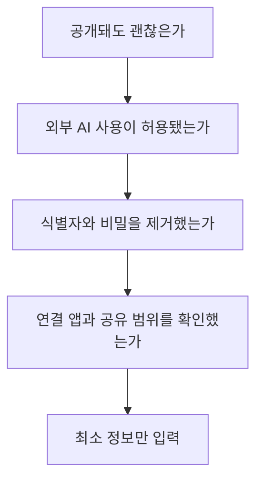
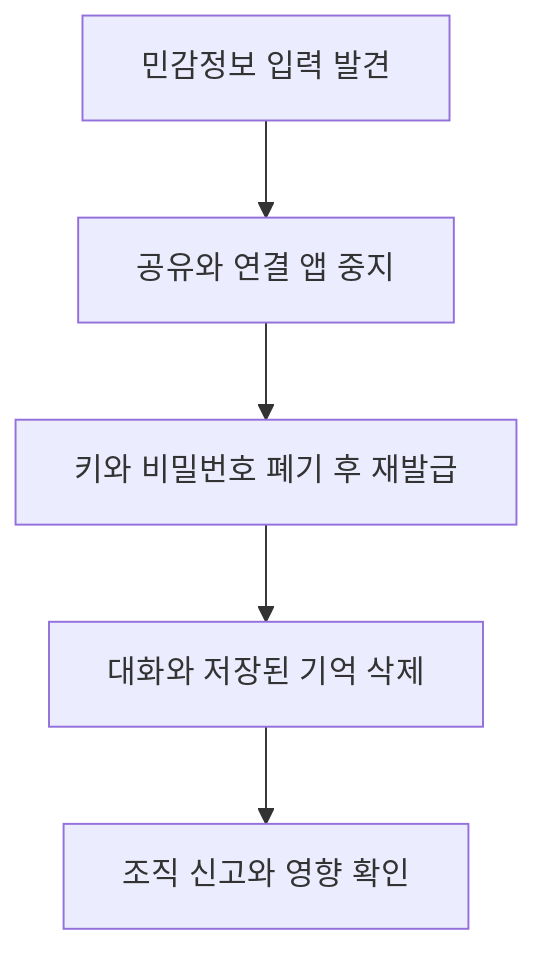

먼저 답부터 말하면, **인터넷에 공개돼도 문제가 없고 업무 규정상 외부 서비스 전송이 허용된 정보만 원문 그대로 입력하는 것이 안전합니다.** 이름을 지웠더라도 고객번호, 날짜, 소속, 희귀한 사건이 합쳐져 사람을 다시 알아볼 수 있다면 개인정보로 취급해야 합니다. 비밀번호, 인증 코드, API 키, 주민등록번호, 진료 기록, 미공개 계약서와 회사 소스 코드는 넣지 않는 편이 맞습니다.

ChatGPT의 학습 제외와 임시 채팅은 유용한 보호 장치지만, 무엇이든 입력해도 된다는 허가증은 아닙니다. [OpenAI의 데이터 제어 안내](https://help.openai.com/en/articles/7730893-chatgpt-data-controls-faq)는 모델 개선 사용 여부, 기록, 임시 채팅을 서로 다른 통제로 설명합니다. 사용자는 **입력 전 최소화, 계정 설정, 외부 전송 확인, 결과 검수**를 따로 해야 합니다.

이 글은 2026년 9월 4일 공개 문서를 기준으로 한 일반적인 안전 가이드입니다. 회사의 보안 규정, 학교의 AI 사용 규칙, 의료와 법률 분야의 의무가 더 엄격하면 그 규칙이 우선합니다. 개인정보보호위원회도 [생성형 AI 개인정보 보호 안내서](https://pipc.go.kr/np/cop/bbs/selectBoardArticle.do?bbsId=BS074&mCode=C020010000&nttId=12084)를 공개해 이용자가 입력 단계에서 개인정보와 민감한 내용을 점검할 수 있도록 안내합니다. 제품 메뉴와 보관 정책은 바뀔 수 있으므로 실제 입력 직전 공식 설정 화면도 확인해야 합니다.

## 30초 입력 판단법

입력하려는 내용을 붙여넣기 전에 다음 네 질문을 순서대로 묻습니다. 하나라도 확신할 수 없다면 원문을 보내지 말고 요약, 가상 데이터, 빈 양식으로 바꿉니다.

첫째, 검색 결과에 그대로 노출돼도 괜찮은지 생각합니다. 둘째, 내가 공개할 권한이 있는지 확인합니다. 내 이력서는 내가 결정할 수 있지만 고객 명단이나 동료의 평가서는 그렇지 않습니다. 셋째, 직접 식별자뿐 아니라 조합 식별자를 제거합니다. 넷째, ChatGPT 안에서 웹 검색, GPT 액션, 커넥터 같은 기능이 다른 사업자로 데이터를 보낼 가능성이 있는지 봅니다.

**판단이 애매하다는 사실 자체가 중단 신호입니다.** 대화형 인터페이스는 친숙해서 메신저처럼 느껴지지만, 업무 자료의 반출 허용 여부는 화면의 친숙함과 무관합니다.

## 절대로 원문을 넣지 말아야 할 정보

아래 표는 법률상 정의를 대신하지 않습니다. 실무에서 빠르게 멈춰야 할 예시를 위험과 대체 방법으로 나눈 것입니다.

| 입력 후보 | 주된 위험 | 더 안전한 대체 |
| --- | --- | --- |
| 비밀번호, 일회용 코드, API 키, 복구 코드 | 계정 탈취와 즉시 악용 | 형식만 같은 가짜 문자열 |
| 주민등록번호, 여권, 계좌, 카드 번호 | 신원 도용과 금융 피해 | 마지막 자리까지 모두 가린 토큰 |
| 진료 기록, 상담 기록, 장애 정보 | 민감한 사생활 노출 | 증상과 목적만 일반화한 가상 사례 |
| 고객 명단, 미공개 계약, 인사 평가 | 계약 위반과 영업 비밀 유출 | 열 이름만 남긴 빈 템플릿 |
| 소스 코드와 내부 로그 | 취약점, 토큰, 고객 데이터 혼입 | 최소 재현 코드와 비밀 제거 로그 |
| 타인의 얼굴, 음성, 학생 과제 | 동의 없는 처리와 재식별 | 당사자 동의 또는 합성 예시 |

문서를 통째로 올리는 습관이 특히 위험합니다. 눈에 보이는 본문을 지웠어도 파일 속 댓글, 변경 이력, 작성자 이름, 숨은 시트, 이미지 위치 정보가 남을 수 있습니다. 필요한 문단만 새 텍스트 파일로 옮기고, 사람과 조직을 일관된 가명으로 바꾸며, 문제 해결에 필요 없는 열은 삭제합니다.

예를 들어 “2026년 8월 31일 강남 지점에서 발생한 57세 임원 김모 씨의 희귀 질환”은 이름만 지워도 다시 알아볼 단서가 많습니다. “수도권 사업장의 중년 직원에게 발생한 건강 관련 사례”처럼 목적을 해치지 않는 범위에서 날짜, 장소, 직급, 나이를 넓혀야 합니다.

## 학습 제외와 임시 채팅은 무엇이 다른가

[OpenAI의 데이터 제어 FAQ](https://help.openai.com/en/articles/7730893-chatgpt-data-controls-faq)에 따르면 개인용 ChatGPT에서 “Improve the model for everyone”을 끄면 새 대화가 모델 개선에 사용되지 않도록 선택할 수 있습니다. 그러나 일반 대화는 기록에 남을 수 있습니다. 반대로 [임시 채팅 FAQ](https://help.openai.com/en/articles/8914046-temporary-chat-faq)는 임시 채팅이 기록에 나타나지 않고 기억을 만들지 않으며 모델 개선에 사용되지 않는다고 설명합니다. 동시에 안전 목적으로 사본을 최대 30일 보관할 수 있다고 밝힙니다.

| 기능 | 대화 기록 | 모델 개선 | 기억 | 오해하면 안 되는 점 |
| --- | --- | --- | --- | --- |
| 일반 채팅, 학습 허용 | 계정 설정에 따라 표시 | 개인용 서비스에서 사용될 수 있음 | 설정에 따라 활용 | 민감정보 입력 허용을 뜻하지 않음 |
| 일반 채팅, 학습 제외 | 기록에 표시될 수 있음 | 제외 | 설정에 따라 활용 | 기록과 학습 제외는 별개 |
| 임시 채팅 | 기록에 나타나지 않음 | 사용하지 않음 | 새 기억을 만들지 않음 | 즉시 무보관을 뜻하지 않음 |

기능은 계속 바뀔 수 있습니다. 특히 GPT의 액션이나 연결 앱으로 보낸 데이터는 수신자의 개인정보 처리방침을 따를 수 있습니다. **ChatGPT 안에서 임시라고 표시돼도 제3자에게 넘어간 뒤의 보관까지 자동으로 임시가 되는 것은 아닙니다.**

업무용 Business, Enterprise, Edu와 API는 개인용 계정과 기본 처리 조건이 다를 수 있습니다. 조직 계정이라면 관리자 보존 정책, 감사 로그, 연결 앱 허용 목록을 확인해야 합니다. 개인 계정의 토글 하나를 회사 전체의 데이터 처리 계약으로 오해해서는 안 됩니다.

## 메모리와 대화 기록을 따로 점검하라

ChatGPT의 메모리는 대화 기록과 같은 개념이 아닙니다. 사용자가 채팅을 삭제해도 별도로 저장된 기억이 남을 수 있고, 기억을 지웠다고 원래 채팅이 함께 사라지는 것도 아닐 수 있습니다. [OpenAI 메모리 FAQ](https://help.openai.com/en/articles/8590148-memory-faq)는 저장된 기억과 채팅 기록을 각각 관리하는 방법을 안내합니다.

점검할 때는 다음 순서를 따릅니다.

- [ ] 설정의 개인화 영역에서 저장된 기억 목록을 열어 불필요한 항목을 지운다.
- [ ] 민감한 대화가 일반 기록에 남아 있는지 검색한다.
- [ ] 만들어 둔 공유 링크와 공개 GPT에 민감한 예시가 없는지 확인한다.
- [ ] 연결 앱, 커넥터, 브라우저 확장 프로그램의 권한을 검토한다.
- [ ] 학습 제외 설정이 원하는 계정에 적용됐는지 웹과 모바일에서 확인한다.
- [ ] 조직 계정이라면 개인 계정으로 복사된 대화나 파일이 없는지 본다.

이 점검은 “무엇을 기억하느냐”와 “어디에 기록이 남느냐”, “모델 개선에 쓰이느냐”, “외부 앱으로 전송됐느냐”를 분리하는 작업입니다. 한 설정으로 네 문제를 모두 해결하려 하면 빈틈이 생깁니다.

## 익명화가 실패하는 흔한 이유

이름과 전화번호만 지우면 익명화가 끝났다고 생각하기 쉽습니다. 실제로는 문맥이 사람을 가리킵니다. 작은 조직의 유일한 직책, 정확한 사고 시각, 특정 고객사, 희귀한 진단, 긴 자유 서술은 강한 단서입니다. 여러 대화에 같은 가명을 쓰면 서로 연결돼 재식별 가능성이 커질 수도 있습니다.

안전한 편집은 세 단계로 합니다.

1. **삭제**: 과제와 무관한 열, 첨부, 댓글, 메타데이터를 없앱니다.
2. **대체**: 이름을 사람 A, 고객사를 회사 B, 계좌를 가짜 형식으로 바꿉니다.
3. **범주화**: 정확한 나이는 연령대, 날짜는 분기, 주소는 광역 지역으로 넓힙니다.

편집 뒤에는 “이 자료와 공개된 조직도, 보도자료, 소셜 미디어를 합치면 누구인지 추정할 수 있는가”를 다시 묻습니다. 가능하다면 더 줄여야 합니다. 작업 목적이 맞춤법 교정이라면 실제 이름과 금액이 필요하지 않습니다. 계약 조항 분류라면 서명과 회사 도장, 계좌 페이지를 보낼 이유가 없습니다.

**최소화는 출력 품질을 꼭 낮추지 않습니다.** 오히려 질문과 관련 없는 맥락을 제거하면 모델이 핵심 조건을 놓칠 가능성을 줄일 수 있습니다. 원문 전체가 정말 필요한 작업이라면, 먼저 조직이 승인한 환경과 처리 계약이 있는지 확인해야 합니다.

## 파일과 화면 캡처에는 보이지 않는 정보가 있다

화면 캡처는 간단해 보여도 브라우저 탭, 북마크, 알림, 이메일 주소, 사내 시스템 주소가 함께 잡힙니다. 사진에는 위치 메타데이터가 포함될 수 있고, 스프레드시트에는 숨은 열과 시트가 있을 수 있습니다. PDF의 검은 사각형은 아래 텍스트를 삭제하지 않고 가리기만 했을 가능성이 있습니다.

업로드 전에는 다음을 확인합니다.

- 문서 복사본을 만들고 원본과 분리했는가
- 필요한 페이지만 남겼는가
- 댓글, 변경 추적, 발표자 노트, 숨은 행과 열을 제거했는가
- 검은색 도형이 아니라 실제 삭제 또는 전용 가림 처리를 했는가
- 이미지의 위치와 기기 메타데이터를 지웠는가
- 화면 가장자리와 알림 영역을 잘랐는가
- OCR로 읽힌 텍스트를 다시 검색해 민감한 단어가 남지 않았는가

업로드 뒤 모델에게 “개인정보가 있는지 찾아줘”라고 묻는 것만으로 검사가 끝나지는 않습니다. 모델은 작은 글씨나 숨은 개체를 놓칠 수 있고, 발견을 위해 이미 파일을 전송한 뒤이기 때문입니다. **검사는 로컬에서 먼저, 전송은 마지막에** 해야 합니다.

## 이미 입력했다면 삭제보다 먼저 확산을 막아라

민감정보를 보냈다는 사실을 알았다면 당황해서 기록만 지우고 끝내기 쉽습니다. 삭제는 필요하지만, 이미 노출된 비밀의 효력을 없애는 조치가 더 급할 수 있습니다.

API 키, 비밀번호, 세션 토큰이라면 즉시 폐기하고 새로 발급합니다. 같은 비밀번호를 다른 서비스에서도 썼다면 함께 바꿉니다. 공유 링크를 해제하고, GPT 액션이나 커넥터가 있었다면 수신 서비스의 로그와 삭제 절차를 확인합니다. 회사 자료라면 혼자 판단해 흔적을 없애기보다 보안 담당자에게 시간, 계정, 입력 범위, 연결 기능을 사실대로 전달합니다.

대화 삭제 후 데이터 사본이 필요하면 [ChatGPT 데이터 내보내기 안내](https://help.openai.com/en/articles/7260999-how-do-i-export-my-data)를 참고할 수 있습니다. 안내상 내보내기 파일은 삭제한 대화를 복원하는 수단이 아닙니다. 사고 조사를 위해 무엇을 보존할지는 조직 담당자와 먼저 합의해야 하며, 법적 의무가 있는 기록을 임의로 지워서는 안 됩니다.

## 개인용과 업무용의 경계를 만든다

가장 지속 가능한 방법은 매번 완벽한 판단을 기대하는 대신 경계를 미리 만드는 것입니다. 개인 계정과 업무 계정을 분리하고, 회사가 허용한 도구 목록을 북마크하며, 자주 쓰는 자료에는 가상 데이터 템플릿을 준비합니다. 팀 문서 첫 페이지에 “외부 AI 입력 가능”, “승인 후 가능”, “입력 금지”를 표시하면 망설임을 줄일 수 있습니다.

| 등급 | 예시 | 기본 행동 |
| --- | --- | --- |
| 공개 | 이미 게시된 보도자료, 공개 매뉴얼 | 출처와 최신성 확인 후 사용 |
| 내부 | 일반 회의 일정, 내부 절차 | 조직이 승인한 계정에서 최소화 |
| 기밀 | 고객 계약, 소스 코드, 재무 전망 | 별도 승인과 보호 환경 없이는 금지 |
| 인증 정보 | 비밀번호, 키, 복구 코드 | 어떤 대화형 AI에도 입력 금지 |

분류표는 법률 용어를 흉내 내는 장식이 아니라 행동을 정하는 도구입니다. 각 등급에 사용할 수 있는 계정, 저장 기간, 승인자, 삭제 방법을 붙여야 합니다. 새 기능이 출시될 때는 연결되는 제3자와 기본 설정이 무엇인지 다시 확인합니다.

마지막 원칙은 짧습니다. **AI가 답을 만드는 데 꼭 필요하지 않은 정보라면 보내지 마십시오.** 편리한 설정은 위험을 줄이지만, 입력하지 않은 정보만큼 확실하게 노출을 막지는 못합니다.

<!-- internal-links:start -->
### 이어 읽기

- [ChatGPT 요금제 추천 및 비교 가이드]() — 개인용과 조직용 요금제의 기능 차이를 고를 때 함께 확인할 수 있습니다.
- [OpenAI 프론티어 API 제로 데이터 보존 발표]() — 소비자 설정과 기업용 데이터 보존 계약이 왜 다른지 이어서 살펴봅니다.
- [ChatGPT macOS Computer History 기능]() — 화면과 작업 기록을 다루는 기능의 선택 범위를 확인합니다.
<!-- internal-links:end -->

## 자주 묻는 질문

### 학습 제외를 켜면 개인정보를 자유롭게 입력해도 되나요?

아닙니다. 학습 제외는 대화가 모델 개선에 쓰이는지에 관한 설정이며, 서비스 처리와 보안 보관, 연결된 외부 앱의 정책까지 없애는 기능은 아닙니다. 필요한 정보만 최소화해서 입력해야 합니다.

### 임시 채팅은 대화를 즉시 완전히 삭제하나요?

아닙니다. 임시 채팅은 기록에 나타나지 않고 모델 개선에 쓰이지 않지만, OpenAI 안내상 안전 목적으로 사본이 최대 30일 보관될 수 있습니다.

### 주민등록번호를 일부 가리면 안전한가요?

그 정보만으로 개인을 다시 알아볼 수 있는지 확인해야 합니다. 이름, 회사, 날짜, 사건 설명을 조합해 식별할 수 있다면 번호 일부를 가린 것만으로는 충분하지 않습니다.

### 이미 민감정보를 입력했다면 무엇부터 해야 하나요?

해당 대화를 삭제하고 공유 링크와 연결 앱을 점검한 뒤, 비밀번호나 인증 정보는 즉시 폐기하고 재발급해야 합니다. 회사나 학교 자료라면 담당 보안 창구에도 알립니다.

## 직접 확인한 공식 원문

1. [OpenAI Help Center, Data Controls FAQ](https://help.openai.com/en/articles/7730893-chatgpt-data-controls-faq)
2. [OpenAI Help Center, Temporary Chat FAQ](https://help.openai.com/en/articles/8914046-temporary-chat-faq)
3. [OpenAI Help Center, Memory FAQ](https://help.openai.com/en/articles/8590148-memory-faq)
4. [OpenAI Help Center, ChatGPT 데이터 내보내기](https://help.openai.com/en/articles/7260999-how-do-i-export-my-data)
5. [OpenAI, Consumer Privacy](https://openai.com/consumer-privacy/)
6. [개인정보보호위원회, 생성형 AI 개인정보 보호 안내서](https://pipc.go.kr/np/cop/bbs/selectBoardArticle.do?bbsId=BS074&mCode=C020010000&nttId=12084)

> 이 글은 공개된 제품 문서를 바탕으로 작성한 일반 정보이며 법률 자문이나 조직의 보안 승인을 대신하지 않습니다. 메뉴 위치, 기능 제공 범위, 보관 기간과 법적 예외는 게시 뒤 바뀔 수 있으므로 중요한 자료를 처리하기 전 최신 공식 문서를 다시 확인해야 합니다.
