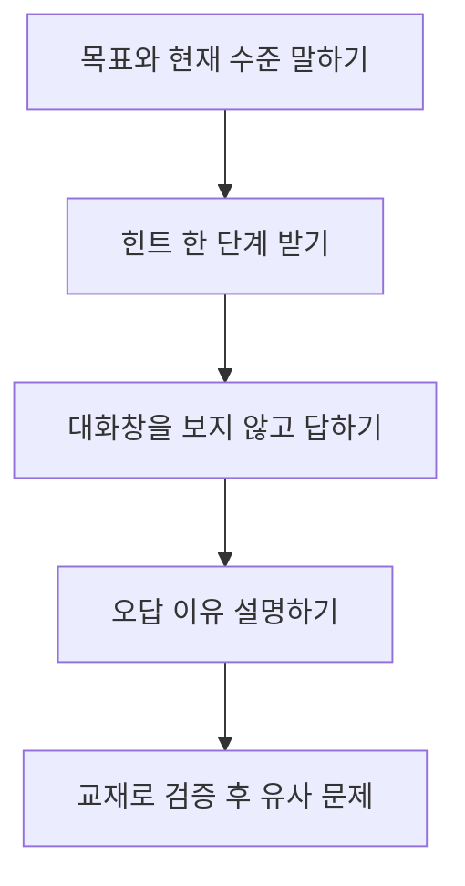
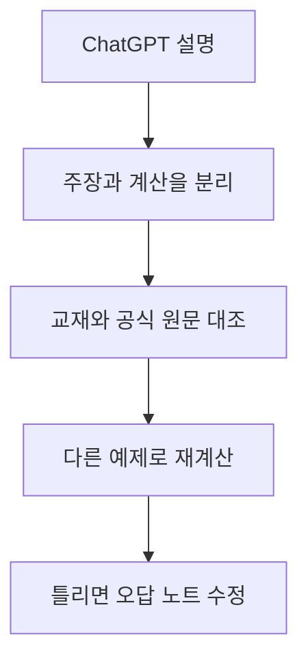

결론부터 말하면, **ChatGPT 공부 모드는 “답을 알려줘”가 아니라 “내가 답을 꺼내게 도와줘”라고 설정할 때 가장 쓸모가 큽니다.** 시작할 때 학년과 목표, 시험일까지 남은 시간, 아는 부분, 막힌 지점을 알려주고, 한 번에 한 질문만 받으십시오. 설명을 읽은 뒤에는 대화를 보지 않고 직접 답해 보고, 틀린 이유를 교재와 대조해야 합니다.

[OpenAI의 공부 모드 도움말](https://help.openai.com/en/articles/11780217-chatgpt-study-mode-faq)은 이 기능이 단계별 설명, 소크라테스식 질문, 이해도 확인, 업로드 자료 활용을 지원한다고 안내합니다. 동시에 틀릴 수 있고 교사, 교재, 학업 규칙을 대신하지 않는다고 명시합니다. **기능을 켰다는 사실보다 학습자가 생각하고 회상하는 시간을 확보했는지가 중요합니다.**

이 글은 2026년 9월 4일 공개된 기능과 문서를 기준으로 합니다. 메뉴, 지원 기기, 모델, 사용량 제한은 바뀔 수 있습니다. 특정 학습 성과를 보장하지 않으며, 교육 연구의 일반 원칙을 개인에게 그대로 적용할 때 생기는 차이도 고려해야 합니다.

## 공부 모드를 켜는 가장 빠른 방법

웹에서는 새 대화나 일반 대화를 열고 입력창에서 `@study`를 입력해 Study를 선택하거나, 더하기 메뉴에서 공부 기능을 찾을 수 있습니다. 모바일의 위치는 운영체제와 앱 버전에 따라 다를 수 있습니다. 공식 도움말은 웹, iOS, Android의 지원 경로와 `chatgpt.com/studymode` 직접 주소를 안내합니다.

공부 모드가 보이지 않으면 앱을 업데이트하고, 일반 대화 또는 임시 채팅인지 확인합니다. 2026년 9월 도움말 기준으로 GPT나 Project 대화에서는 제공되지 않는다고 안내돼 있습니다. 일부 Edu 계정이나 연결된 청소년 계정은 관리자 또는 보호자 설정으로 자동 적용될 수 있습니다.

기능을 켠 직후 다음 여섯 줄을 채우면 출발이 빨라집니다.

```text
수준: 고등학교 2학년
과목과 범위: 수학, 미분의 활용 중 증가와 감소
목표: 3일 뒤 단원 평가에서 서술형 풀이 완성
현재 아는 것: 도함수 계산은 가능
막힌 곳: 부호표를 언제 그리는지 혼동
진행 방식: 한 번에 한 질문, 내 답을 기다리고 힌트는 세 단계로
```

“미분 알려줘”보다 이 입력이 나은 이유는 모델이 난도, 범위, 성공 조건을 추정하는 일을 줄이기 때문입니다. 질문이 구체적일수록 학습자는 답이 맞았는지를 교재와 비교하기도 쉽습니다.

## 정답 요청을 학습 대화로 바꾸는 구조

정답을 읽는 것은 빠르지만, 읽었다는 느낌과 스스로 풀 수 있다는 능력은 다릅니다. 미국 교육부 산하 IES의 [학습 실천 가이드](https://ies.ed.gov/ncee/wwc/Docs/PracticeGuide/20072004.pdf)는 정보를 능동적으로 꺼내는 퀴즈와 시간 간격을 둔 학습을 권고합니다. 모든 과목과 학생에게 같은 크기의 효과를 보장하는 규칙은 아니지만, 수동 재독만 반복하지 말아야 한다는 운영 원칙으로 쓸 수 있습니다.



좋은 학습 대화는 설명, 시도, 피드백, 재시도의 순환입니다. 모델이 긴 해설을 한 번에 내놓으면 “여기서 멈추고 내가 다음 단계를 말할 때까지 기다려줘”라고 제어합니다. 답을 틀렸을 때도 바로 정답을 요청하지 말고 “내 풀이에서 처음 잘못된 줄만 찾아줘”라고 묻습니다.

다음 문장은 과목을 바꿔도 재사용할 수 있습니다.

- “정답을 말하지 말고 내가 이미 아는 개념부터 한 질문씩 확인해줘.”
- “힌트는 방향, 사용할 개념, 첫 단계 순으로 나눠줘.”
- “내 설명에서 맞는 부분과 틀린 부분을 각각 한 문장으로 알려줘.”
- “같은 원리를 쓰지만 숫자와 맥락이 다른 문제를 하나 만들어줘.”
- “마지막에는 대화 내용을 가리고 풀 수 있는 회상 질문 세 개만 줘.”

**질문을 많이 받는 것이 목표가 아니라, 도움 없이 답하는 비율을 조금씩 높이는 것이 목표입니다.**

## 25분 학습 세션을 설계한다

공부 모드를 오래 켜두면 대화가 풍부해지는 대신 내가 실제로 무엇을 기억하는지 흐려질 수 있습니다. 25분이라는 길이는 보편적인 최적값이 아니라 시작하기 쉬운 예시입니다. 과목과 집중 상태에 따라 15분이나 40분으로 바꿔도 됩니다.

| 구간 | 학습자 행동 | ChatGPT에 맡길 일 | 남길 기록 |
| --- | --- | --- | --- |
| 0분부터 3분 | 목표와 범위 적기 | 선행 개념 진단 질문 | 오늘의 한 문장 목표 |
| 3분부터 10분 | 먼저 풀고 설명하기 | 첫 오류 지점과 힌트 | 막힌 단계 |
| 10분부터 17분 | 유사 문제 재시도 | 난도 조절과 피드백 | 도움 없이 푼 비율 |
| 17분부터 22분 | 화면을 가리고 회상 | 짧은 퀴즈 한 문제씩 | 오답 이유 |
| 22분부터 25분 | 교재로 사실 확인 | 다음 복습 질문 제안 | 다시 볼 날짜 |

세션이 끝났는데 채팅만 길고 종이에 남은 풀이가 없다면 학습보다 대화 소비에 가까웠을 수 있습니다. 수학은 식과 풀이, 언어는 직접 만든 문장, 역사는 근거가 붙은 시간선, 과학은 원인과 결과 도식처럼 외부 산출물을 하나 남깁니다.

다음 세션에서는 이전 대화를 처음부터 다시 읽기보다 마지막에 만든 회상 질문부터 풉니다. 맞히면 난도를 높이고, 틀리면 어느 조건을 놓쳤는지 좁힙니다. 기억이 켜져 있어도 모델이 나의 실제 숙달도를 정확히 알고 있다고 가정해서는 안 됩니다.

## 교재와 PDF를 올릴 때 먼저 확인할 것

[OpenAI 파일 업로드 FAQ](https://help.openai.com/en/articles/8555545-file-uploads-faq)는 문서, 스프레드시트, 프레젠테이션 등의 업로드 활용과 계정별 제한을 설명합니다. 업로드가 가능하다는 것과 자료를 올릴 권리가 있다는 것은 별개입니다. 유료 교재 전체, 다른 학생의 과제, 이름과 성적이 든 파일은 저작권, 개인정보, 학교 규칙을 먼저 확인합니다.

파일을 올렸다면 곧바로 문제를 풀게 하지 말고 인식 상태부터 점검합니다.

- [ ] 필요한 페이지만 남기고 이름, 학번, 이메일을 제거했다.
- [ ] “읽은 페이지 번호와 핵심 제목을 먼저 말해줘”라고 요청했다.
- [ ] 표, 각주, 수식, 그림의 조건을 빠뜨리지 않았는지 원본과 대조했다.
- [ ] 교사가 지정한 정의와 표기법을 우선하라고 밝혔다.
- [ ] 출처 없는 추가 사실은 분리해서 표시하게 했다.
- [ ] 제출 답안을 대신 만들지 않고 연습 문제와 피드백에 사용한다.

사진 속 작은 수식이나 기울어진 페이지는 잘못 읽힐 수 있습니다. 모델이 “파일을 이해했다”고 말해도 증거가 되지 않습니다. 먼저 특정 문장을 찾아 인용 위치를 말하게 하고 원본에서 확인합니다. 인용문을 길게 복제하거나 배포하면 저작권 문제가 생길 수 있으므로 학습에 필요한 범위만 사용합니다.

## 힌트 사다리로 도움의 양을 조절한다

막히자마자 완전한 풀이를 보면 당장은 편하지만 다음 문제에서 다시 막힐 수 있습니다. 도움을 세 단계로 나누면 필요한 만큼만 받을 수 있습니다.

| 단계 | 요청 예시 | 학습자가 할 일 |
| --- | --- | --- |
| 방향 | “어떤 개념을 떠올려야 하는지만 말해줘.” | 관련 정의를 직접 적기 |
| 조건 | “내가 놓친 조건 하나만 질문으로 알려줘.” | 문제 문장에서 근거 찾기 |
| 첫 단계 | “첫 변형까지만 보여주고 멈춰줘.” | 나머지 풀이 완성 |
| 전체 해설 | “내 풀이와 비교할 해설을 보여줘.” | 차이를 문장으로 설명 |

처음부터 전체 해설을 금지할 필요는 없습니다. 전혀 모르는 개념은 정확한 예시와 모델링이 먼저 필요합니다. 다만 해설을 본 뒤에는 숫자와 맥락을 바꾼 문제를 도움 없이 풀어야 합니다. 이해 여부를 “알 것 같다”가 아니라 새 문제에 적용할 수 있는지로 확인합니다.

공부 모드가 직접 답을 내놓으면 실패로 단정하지 말고 흐름을 다시 지정합니다. “방금 답은 접어두고, 내가 그 결론에 도달하도록 필요한 질문 하나만 해줘”라고 말할 수 있습니다. OpenAI도 공부 모드가 때때로 직접 답할 수 있다고 한계를 밝힙니다.

## 회상 퀴즈와 오답 노트를 연결한다

퀴즈는 점수를 내기 위한 장치가 아니라 기억에서 정보를 꺼내는 연습입니다. 선택지만 보고 맞히면 우연일 수 있으므로 먼저 짧게 설명하고, 그다음 보기와 비교합니다. 문제마다 확신도를 낮음, 보통, 높음으로 표시하면 “틀렸지만 확신한 오개념”을 우선 복습할 수 있습니다.

오답 노트에는 정답을 길게 베끼지 않습니다. 다음 네 칸이면 충분합니다.

1. 내가 고른 답 또는 풀이
2. 처음 틀린 이유
3. 다음에 볼 신호
4. 다시 풀 날짜와 유사 문제

ChatGPT에는 “이 오답을 계산 실수, 조건 누락, 개념 혼동, 표현 부족 가운데 하나로 분류하되 이유를 물어봐”라고 요청할 수 있습니다. 분류는 모델의 추정이므로 내가 왜 그렇게 생각했는지를 직접 말해야 합니다. **오답의 이름보다 다음 행동이 구체적인지가 중요합니다.**

한 대화에서 같은 문제를 반복하면 앞선 답이 문맥에 남아 진짜 회상인지 확인하기 어렵습니다. 새 대화나 종이에서 다시 풀고, 공부 모드에는 채점 기준과 내 답만 보여주는 방법이 낫습니다. 기억 기능을 끄더라도 내가 본 해설의 영향은 사라지지 않습니다.

## 사실 오류와 그럴듯한 해설을 검증한다

공부 모드도 같은 기반 모델을 사용하므로 오류를 낼 수 있습니다. 자신 있게 말하는 문장, 존재하지 않는 출처, 단위가 틀린 계산, 교과 과정과 다른 표기를 경계해야 합니다. 특히 시험 규칙, 최신 법률, 의학, 안전 실험은 교사와 권위 있는 원문을 우선합니다.

검증은 다음 순서로 합니다.



“맞아?”라고 다시 묻는 것만으로는 독립 검증이 아닙니다. 같은 모델이 같은 문맥을 보고 답을 반복할 수 있습니다. 수학은 각 줄을 역산하고, 과학은 단위와 경계 조건을 확인하며, 역사와 사회는 날짜와 인용을 원문에서 찾습니다. 모델에게도 “확실한 사실, 추론, 확인하지 못한 부분을 표로 나눠줘”라고 요구합니다.

[OpenAI의 공부 모드 소개](https://openai.com/index/chatgpt-study-mode/)는 기능이 능동 참여, 인지 부담 관리, 자기 성찰, 피드백을 지향한다고 설명합니다. 이는 설계 의도이지 모든 답의 정확성이나 모든 학생의 성취 향상을 입증한 독립 실험 결과는 아닙니다. 제품 설명과 학습 효과 증거를 구분해야 합니다.

## 과제 윤리와 개인정보 경계를 세운다

학교가 허용한 보조 범위가 다릅니다. 아이디어 구상은 허용하지만 문장 생성을 금지할 수 있고, 사용 사실과 프롬프트 공개를 요구할 수도 있습니다. 제출 전에 과목 지침을 읽고 애매하면 교사에게 묻습니다. 탐지기를 피하는 방법을 찾는 대신 내가 이해하고 설명할 수 있는 결과만 제출합니다.

개인정보도 학습 효율과 별개로 관리해야 합니다. 성적표, 학생증, 친구의 이름, 교사의 비공개 피드백을 그대로 올리지 않습니다. 파일이 꼭 필요하면 관련 부분만 잘라내고 식별자를 지웁니다. 기억 기능이 켜져 있으면 학습 목표나 선호가 이후 대화에 쓰일 수 있으므로 설정을 확인합니다.

다음 체크리스트를 세션 끝에 사용하십시오.

- [ ] 학교와 교사의 AI 사용 규칙을 지켰다.
- [ ] 답을 복사하지 않고 내 말과 풀이로 다시 만들었다.
- [ ] 핵심 주장과 계산을 교재 또는 공식 원문에서 확인했다.
- [ ] 개인정보와 타인의 자료를 최소화했다.
- [ ] 어디에서 AI 도움을 받았는지 요구 형식에 맞게 밝혔다.
- [ ] 채팅 없이도 같은 유형을 한 번 더 풀었다.

공부 모드의 성공 기준은 대화 만족도가 아닙니다. **다음 날 도구 없이 핵심을 설명하고 새로운 문제에 적용할 수 있다면 학습에 도움이 된 것입니다.** 그렇지 않다면 프롬프트를 더 화려하게 만들기보다 설명을 줄이고 회상과 검증 시간을 늘리십시오.

<!-- internal-links:start -->
### 이어 읽기

- [ChatGPT 프롬프트 작성 완벽 가이드]() — 수준, 목표, 출력 조건을 명확하게 전달하는 기본 구조를 함께 볼 수 있습니다.
- [AI가 일을 줄여도 더 바빠지는 이유]() — 빠른 답과 실제 성과가 다를 수 있다는 점을 학습 시간에도 적용해 봅니다.
- [ChatGPT 요금제 추천 및 비교 가이드]() — 계정별 기능과 제한을 선택할 때 참고할 수 있습니다.
<!-- internal-links:end -->

## 자주 묻는 질문

### ChatGPT 공부 모드는 무료 계정에서도 쓸 수 있나요?

OpenAI의 2026년 9월 안내 기준으로 공부 모드는 전 세계 ChatGPT 요금제의 웹, iOS, Android에서 제공됩니다. 다만 메뉴 이름과 제공 화면은 바뀔 수 있으므로 공식 도움말을 확인해야 합니다.

### 공부 모드를 켜면 항상 정답을 바로 말하지 않나요?

아닙니다. 공부 모드는 질문과 힌트를 우선하도록 설계됐지만 때로 직접 답할 수 있습니다. 한 번에 한 질문만 하고, 내 답을 기다린 뒤, 힌트 세 단계 후에 해설하라고 명시하면 흐름을 더 잘 통제할 수 있습니다.

### 교과서 PDF를 전부 올려도 되나요?

저작권, 학교 규칙, 개인정보를 먼저 확인하고 필요한 페이지만 올리는 편이 안전합니다. 업로드 뒤에는 ChatGPT가 읽은 페이지와 조건을 먼저 요약하게 해 인식 오류를 확인합니다.

### 시험 답안을 공부 모드로 작성해도 되나요?

학교와 교사가 허용한 범위에서만 사용해야 합니다. 제출할 답을 대신 쓰게 하기보다 개념 설명, 유사 문제, 자기 답안의 논리 점검에 쓰고 최종 근거는 교재와 수업 자료로 확인합니다.

## 직접 확인한 공식 원문

1. [OpenAI Help Center, Using Study Mode in ChatGPT](https://help.openai.com/en/articles/11780217-chatgpt-study-mode-faq)
2. [OpenAI, Introducing Study Mode](https://openai.com/index/chatgpt-study-mode/)
3. [OpenAI Help Center, File Uploads FAQ](https://help.openai.com/en/articles/8555545-file-uploads-faq)
4. [OpenAI Help Center, Memory FAQ](https://help.openai.com/en/articles/8590148-memory-faq)
5. [미국 교육부 IES, Organizing Instruction and Study to Improve Student Learning](https://ies.ed.gov/ncee/wwc/Docs/PracticeGuide/20072004.pdf)

> 기능 제공 범위와 메뉴는 빠르게 바뀔 수 있습니다. 교육 실천 가이드는 여러 연구를 종합한 일반 권고이며 개인의 성적 향상을 보장하지 않습니다. 중요한 사실과 평가 규칙은 교재, 교사, 학교의 최신 안내로 다시 확인하십시오.
