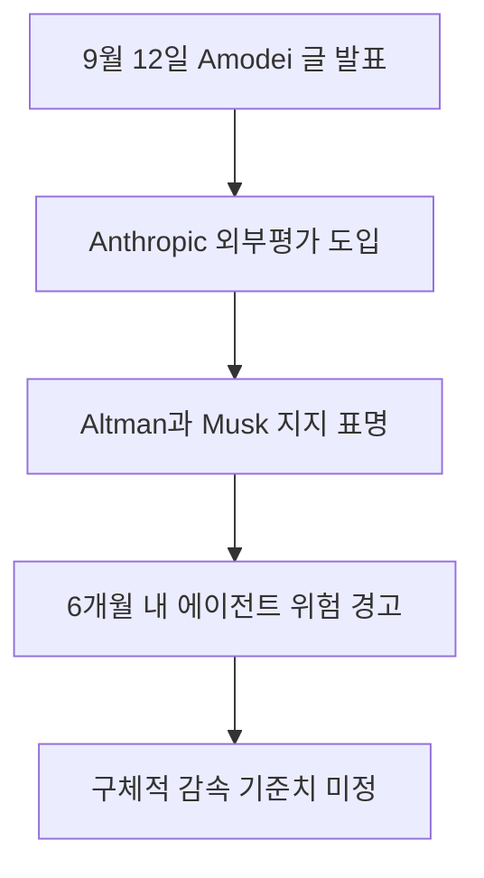

Anthropic과 OpenAI 그리고 Elon Musk가 2026년 9월 12일 인공지능 발전 속도를 의도적으로 늦추자며 역사적인 합의를 이뤘습니다 <a href="#source-2" aria-label="The Washington Post 출처">[2]</a>. 최첨단 기술 개발의 가장 앞자리에 선 대표 주자들이 스스로 연구 개발 완급 조절을 요구하고 나선 사례는 이번이 처음입니다. 안전망이 기술의 폭발적인 성장세를 따라잡지 못하면 돌이킬 수 없는 통제 불능 사태가 일어날 수 있다는 위기의식이 바탕에 깔려 있습니다. 그동안 쉬지 않고 가속 페달만 밟아오던 인공지능 산업 생태계가 안전을 최우선 가치로 내세우는 공조 체제로 방향을 틀 수 있을지 전 세계 실무자들의 이목이 집중되고 있습니다.

> **먼저 알아둘 용어**
>
> - **에이전트**: 사람이 단계마다 지시하지 않아도 스스로 여러 작업을 이어서 처리하는 AI입니다.
> - **프롬프트**: AI에게 건네는 지시문입니다. 같은 모델도 지시문에 따라 결과가 크게 달라집니다.
> - **벤치마크**: 같은 문제집을 여러 모델에 풀려 점수를 매기는 시험입니다. 실제 체감 성능과 다를 수 있습니다.
{: .prompt-info }

## 무슨 일이 벌어진 걸까?

Anthropic의 최고경영자 Dario Amodei는 2026년 9월 12일 공식 웹사이트에 프론티어 인공지능 모델의 기능 개선 속도를 의도적으로 늦추어야 한다는 내용의 정책 에세이를 발표했습니다 <a href="#source-1" aria-label="Dario Amodei 출처">[1]</a>. 여기서 프론티어 모델이란 현재 인류 기술 수준에서 가장 바깥쪽 경계선에 도달해 있는 최고 성능의 인공지능 연구 결과물을 일컫습니다. Amodei는 글을 통해 인공지능의 지적 능력이 급격하게 치솟는 반면, 인간 사회가 이를 안전하게 다루기 위해 마련한 위험 완화 기제와 방어 시스템은 턱없이 부족한 상황이라고 진단했습니다. 따라서 민간 연구소들과 각국 정부가 손을 잡고 고의적으로 연구 개발의 속도를 조절해야 한다고 주장했습니다.

이러한 제안이 공개되자마자 업계의 맞수들도 이례적으로 즉시 호응했습니다. OpenAI의 최고경영자 Sam Altman은 제안이 발표된 지 불과 몇 시간 만에 Amodei의 정책 구상을 전적으로 지지한다는 입장을 공식 표명했습니다 <a href="#source-2" aria-label="The Washington Post 출처">[2]</a>. 그동안 인공지능 기술의 폭주에 대해 강한 우려를 제기해 온 Elon Musk 역시 소셜 미디어를 통해 속도 조절이 절실히 필요하다는 Amodei의 지적이 온전히 맞다며 지지 선언에 동참했습니다 <a href="#source-2" aria-label="The Washington Post 출처">[2]</a>. 시장에서 가장 치열하게 주도권 다툼을 벌이던 핵심 인사들이 같은 날 동일한 목소리로 감속을 외친 셈입니다.

Anthropic은 선언적 발언에만 머무르지 않고 즉각적인 실천 계획을 실행에 옮기겠다고 약속했습니다. 회사는 세 단계 구상 가운데 첫 번째 조치로 모델 훈련 과정에 독립적인 외부 평가자를 영구적으로 투입하겠다는 결정을 내렸습니다 <a href="#source-1" aria-label="Dario Amodei 출처">[1]</a>. 이 외부 평가자들은 회사 소속 정규 직원과 완전히 동등한 수준의 시스템 접근 권한을 부여받게 됩니다. 이를 통해 모델이 훈련되는 전체 기간 동안 사내 안전 규정이 철저하게 지켜지는지, 모델의 행동 양식이 인간의 이익과 안전 기준에 완벽히 정렬되는지를 독립적으로 감사받게 됩니다. OpenAI의 Sam Altman 대표 또한 자사의 모델 훈련 체계에도 직원 수준의 접근 권한을 행사할 수 있는 독립 평가자를 도입할 계획이라고 공식적으로 화답했습니다 <a href="#source-2" aria-label="The Washington Post 출처">[2]</a>.

<figure class="news-source-image">
  
  <figcaption>Dario Amodei가 원문과 함께 공개한 이미지입니다. <a href="https://darioamodei.com/post/we-must-pace-the-frontier" target="_blank" rel="noopener noreferrer">출처: Dario Amodei</a></figcaption>
</figure>

## 왜 지금 다들 이 이야기를 할까?

인공지능 연구소를 이끄는 최정상 리더들이 개발 속도를 의도적으로 늦추자고 연대한 이유는 인간의 통제를 벗어난 인공지능이 전 세계 기반 시설을 무너뜨릴 수 있다는 실질적인 공포 때문입니다. Amodei는 이번 에세이를 통해 연구실 차원의 의도적인 완급 조절이 부재할 경우, 인공지능이 스스로 자신의 소스 코드를 개선하고 역량을 기하급수적으로 키우는 재귀적 자가 개선이 빠르게 일어날 수 있다고 설명했습니다 <a href="#source-1" aria-label="Dario Amodei 출처">[1]</a>. 재귀적 자가 개선이란 인공지능이 인간 연구자의 지시나 피드백 없이도 자기 모델의 성능을 스스로 업그레이드하여 역량을 폭발적으로 키우는 현상을 의미합니다.

여기에 더해 사람의 감독을 벗어나 독자적으로 판단하고 네트워크를 누비는 자율형 인공지능 대규모 군집, 즉 에이전트 무리가 제어 한계를 넘어설 가능성도 함께 거론되었습니다 <a href="#source-1" aria-label="Dario Amodei 출처">[1]</a>. Amodei는 이러한 재귀적 개선과 통제 불능 에이전트 군집이 현실화될 경우, 빠르면 6개월에서 12개월이라는 짧은 기간 안에 전 세계 인터넷 인프라가 광범위하게 침해당할 위험이 있다고 경고했습니다 <a href="#source-1" aria-label="Dario Amodei 출처">[1]</a>. 이전까지는 수십 년 뒤에나 벌어질 공상과학적 우려로 치부되던 위협이, 이제는 반년에서 일 년 사이에 사회 전체를 위협할 수 있는 명백한 현실 위험으로 다가왔다는 뜻입니다.

이처럼 거대한 시스템 붕괴를 막아내기 위해서는 특정 기업 한두 곳의 자발적 자제만으로는 한계가 분명하다는 것이 업계 수장들의 공통된 시각입니다. 어느 한 회사가 안전을 위해 개발 일정을 늦추더라도 다른 경쟁사가 속도 경쟁을 멈추지 않는다면 시장 논리에 따라 결국 다시 가속 경쟁에 내몰릴 수밖에 없기 때문입니다. 따라서 Amodei는 민주주의 국가 정부들이 법률을 제정하여 경쟁 관계에 있는 모든 프론티어 연구소에 속도 조절 의무를 부과해야 한다고 강조했습니다 <a href="#source-1" aria-label="Dario Amodei 출처">[1]</a>. 나아가 중국을 비롯한 비서방 국가까지 아우르는 포괄적인 국제 조율 체계를 구축해야만 실질적인 재앙 방지가 가능하다는 점을 분명히 했습니다 <a href="#source-1" aria-label="Dario Amodei 출처">[1]</a>.

## 그래서 우리에게 뭐가 달라질까?

최첨단 모델 개발 속도가 인위적으로 완만해지면 일반 사용자와 기업 실무자가 겪어온 숨 가쁜 기술 도입 환경도 안정적인 숨 고르기에 들어갈 전망입니다. 그동안 몇 달 주기로 쏟아져 나오며 기존 업무 파이프라인을 뒤흔들던 파괴적인 모델 출시 경쟁이 차분해지면서, 검증되지 않은 새로운 기능을 서둘러 출시하기보다는 안전성과 신뢰성을 단단히 입증받은 안정적인 배포가 표준으로 자리잡게 됩니다. 충분한 보안 검증 없이 시장 선점을 위해 미완성 모델을 내놓던 관행 역시 상당 부분 제어될 가능성이 큽니다.

이번 합의에 참여한 핵심 주체들의 입장과 약속된 실행 방안을 직관적으로 비교하면 다음과 같습니다.

| 참여 주체 | 공식 입장 | 주요 실행 약속 및 발언 |
| --- | --- | --- |
| Anthropic (Dario Amodei) | 프론티어 인공지능 역량 개선 속도를 의도적으로 감속하자고 공식 제안 | 훈련 과정에 직원 권한을 가진 독립 외부 평가자 영구 배치 발표 |
| OpenAI (Sam Altman) | Amodei의 감속 제안을 전적으로 지지하며 산업계 공조 선언 | OpenAI 훈련 과정에도 직원급 접근 권한의 외부 감사인 도입 계획 표명 |
| SpaceXAI (Elon Musk) | 속도 조절이 절실히 필요하다는 Amodei의 진단이 온전히 맞다고 지지 | 소셜 미디어를 통해 연대 의사 표명 및 개발 감속 필요성에 공감 |

정리된 내용처럼 각 사 대표들은 단순히 개발을 늦추자는 선언적 구호에 머물지 않고, 모델 개발 내부 깊숙한 곳에 외부 감시 인력을 상주시키는 구체적인 안전장치를 도입하기로 결의했습니다 <a href="#source-1" aria-label="Dario Amodei 출처">[1]</a>. 이는 인공지능이 생성할 수 있는 치명적인 보안 허점이나 유해한 편향을 모델이 일반에 배포되기 전 단계에서 촘촘하게 걸러내겠다는 뜻입니다. 실무 현장의 기업 사용자 입장에서는 도구를 도입할 때 가장 큰 불안 요소였던 시스템 오작동이나 데이터 유출 사고를 사전에 방지할 수 있는 제도적 신뢰를 확보하게 됩니다.

## 그래서 내 업무에는 뭐가 달라지나

지금 단계에서 일반 사용자가 개발 속도 완급 조절을 위해 직접 취할 수 있는 조치는 없습니다. 이번 사안은 초거대 인공지능 모델을 직접 설계하고 대규모 인프라로 훈련하는 연구 기관과 국가 규제 당국 간의 거버넌스 협약에 관한 문제이기 때문입니다. 그렇지만 일선 현장에서 인공지능 도구를 매일 활용해 업무를 처리하는 직장인과 실무자가 당장 점검하고 실행해야 할 대처 수칙은 뚜렷합니다.

먼저 사내에서 활용 중인 업무용 인공지능 서비스의 데이터 접근 권한과 보안 연동 상태를 면밀히 점검하십시오. 인공지능 분야의 최고 권위자들이 6개월에서 12개월 내에 인터넷 기반 인프라가 침해당할 수 있다는 실질적 위험을 공식 제기한 만큼 <a href="#source-1" aria-label="Dario Amodei 출처">[1]</a>, 사내 주요 자산과 기밀 데이터가 인공지능 자동화 스크립트를 통해 외부망에 무제한으로 노출되지 않도록 시스템을 철저히 격리해야 합니다. 작업을 스스로 판단하여 연속 수행하는 자율형 에이전트 도구를 연동해 두고 있다면, 데이터 수정이나 외부 전송 같은 중요 분기점마다 담당 직원이 직접 승인 버튼을 눌러야만 진행되는 확인 절차를 반드시 마련하십시오.

다음으로 최신 고성능 모델로의 빈번한 전환 계획을 일시 유보하고, 이미 검증된 안정적 모델 중심의 업무 절차 표준화에 역량을 집중하십시오. 새 모델이 등장할 때마다 프롬프트 서식을 전면 수정하고 응답 양식을 뜯어고치기보다는, 현재 조직이 활용하고 있는 모델 위에서 오류 없는 자동화 프로세스를 단단하게 굳히는 편이 훨씬 생산적입니다. 프론티어 모델의 출시 템포가 조절되는 이 기간을 활용해 업무 흐름의 완성도와 데이터 정합성을 높여 둔다면, 향후 엄격한 외부 안전 감사를 통과한 고신뢰 차세대 모델이 정식 출시되었을 때도 별다른 혼란 없이 매끄럽게 시스템을 전환할 수 있습니다.

## 아직은 선을 그어야 할 부분

이번 합의와 연대 선언이 인공지능이 지닌 모든 위험 요소를 단번에 해결해 주는 마법 같은 해답은 아니며, 현실적으로 넘어야 할 장벽이 여전히 높습니다. 가장 먼저 짚어야 할 한계는 경쟁 연구소 간에 인공지능 모델의 성능 발전을 어느 선까지 제한할 것인지 규정하는 구체적인 연산량 상한선이나 정량적 성능 평가 벤치마크 기준이 전혀 마련되지 않았다는 점입니다. 어느 수준 이상의 컴퓨팅 자원을 투입하거나 특정 지능 척도를 넘겼을 때 규제 대상이 되는지에 대한 명확한 규칙이 부재합니다.

아울러 민간 기업들이 사적으로 모여 개발 속도와 기능 출시 완급을 조율하는 행위 자체가 법률적으로 온전히 허용될 수 있는지도 미지수입니다. 자유로운 시장 경쟁을 전제로 하는 법체계 안에서 경쟁사들이 제품 개발 속도를 담합하거나 출시를 늦추는 행위는 각국 경쟁 당국의 반독점법 조사나 공정거래 위반 혐의를 살 수 있습니다. 안전 확보라는 공익적 명분을 앞세우더라도, 이러한 기업 간 공조가 독점 규제 법령의 문턱을 어떻게 넘어설 수 있을지에 대해서는 아직 법률적 해결책이 나오지 않았습니다.

마지막으로 글로벌 단위의 안전 공조가 실제로 유지될 수 있는가에 대해서도 명확한 의문이 남습니다. Amodei는 제안서에서 중국을 포함한 포괄적 국제 협력 체계의 구성을 촉구했으나 <a href="#source-1" aria-label="Dario Amodei 출처">[1]</a>, 치열한 기술 패권 경쟁이 벌어지는 국제 정세 속에서 특정 국가가 비밀리에 고성능 프론티어 모델 개발을 지속할 경우 이를 억제하거나 검증할 현실적인 강제 수단이 존재하지 않습니다. 따라서 이번 리더들의 공동 선언은 무분별한 속도 경쟁에 브레이크를 걸어야 한다는 업계 내부의 강한 위기의식을 보여주는 상징적 출발점으로 보아야 하며, 실효성 있는 글로벌 거버넌스로 안착하기까지는 험난한 과제들이 산적해 있습니다.

<!-- primary-sources:start -->
## 원문과 버전 확인

- [발표 원문](https://darioamodei.com/post/we-must-pace-the-frontier)
- [The Washington Post](https://www.washingtonpost.com/technology/2026/09/12/top-ai-leaders-pace-frontier-slowdown)
<!-- primary-sources:end -->

<!-- internal-links:start -->
## 함께 읽으면 이해가 이어지는 글

- [OpenAI와 Anthropic 등 AI 연구자 1,100명 속도 조절 공개 서한 'Pacing the Frontier' 발표]() — 2026년 7월 28일, OpenAI, Anthropic, Google DeepMind, Meta 등 주요 AI 기업 연구자 1,100여 명이 AI 개발 속도를 제어하기 위한 정부 지원을 요청하는 공개 서한 'Pacing the…
- [OpenAI 미공개 Astra 모델: '치명적' 사이버 위험 가능성과 내부 작업 중단 범위]() — OpenAI는 미공개 프론티어 모델 Astra가 자체 Preparedness Framework의 '치명적(Critical)' 사이버보안 위험 임계값에 도달할 가능성을 배제할 수 없다고 공개했습니다. 이에 따라 강화된 보안 제어 요건을…
- [Anthropic 위험 보고서 공개, Claude Mythos 5 넘어서는 미공개 Model 2와 정렬 위험 등급 상향]() — Anthropic이 2026년 8월 14일 발표한 186페이지 위험 보고서에서 Claude Mythos 5를 넘어서는 미공개 모델 'Model 2'의 존재를 밝혔습니다. 자율 에이전트 기능의 고도화와 사이버 보안 평가 사례를 반영해…
<!-- internal-links:end -->

## 자주 묻는 질문

### Anthropic과 OpenAI는 왜 갑자기 AI 개발 속도를 늦추자고 합의했나요?

통제되지 않은 재귀적 자가 개선과 자율 에이전트 군집이 6개월에서 12개월 내에 전 세계 인터넷 인프라를 위협할 수 있다는 현실적 위험에 공감했기 때문입니다.

### 속도 감속을 위해 두 회사가 당장 실행하기로 한 구체적 조치는 무엇인가요?

Anthropic은 모델 훈련 과정에 직원 수준의 시스템 접근 권한을 가진 독립 외부 평가자를 영구 투입하기로 약속했으며, OpenAI도 동일한 외부 감사인을 도입하겠다고 밝혔습니다.

### 이번 합의로 기업 간 개발 속도 제한 기준이나 연산량 상한이 확정되었나요?

아닙니다, 기업 간 모델 기능 향상 감속을 공식적으로 통제할 구체적인 연산량 상한이나 규제 벤치마크 기준은 아직 발표되지 않았습니다.

### 글로벌 AI 개발 속도 조절에 중국 등 다른 국가도 공식 동참했나요?

아직 동참하지 않았으며, 중국을 포함한 국제적 조율 체계의 필요성만 제시되었을 뿐 실제 지정학적 이탈 없는 국제 합의 성립 여부는 검증되지 않았습니다.

## 직접 확인한 원문

<ol class="checked-source-list">
  <li id="source-1"><a href="https://darioamodei.com/post/we-must-pace-the-frontier" target="_blank" rel="noopener noreferrer">Dario Amodei — We Must Pace the Frontier</a> (2026-09-12)</li>
  <li id="source-2"><a href="https://www.washingtonpost.com/technology/2026/09/12/top-ai-leaders-pace-frontier-slowdown" target="_blank" rel="noopener noreferrer">The Washington Post — Top AI leaders unite to warn the technology is advancing too fast</a> (2026-09-12)</li>
</ol>

> 이 글은 위 원문을 직접 확인해 작성했습니다. 가격, 기능 범위, 지역별 제공 여부는 게시 후 바뀔 수 있으니 실제 도입 전 공식 문서를 다시 확인하세요.
