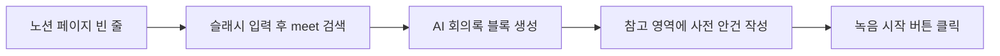
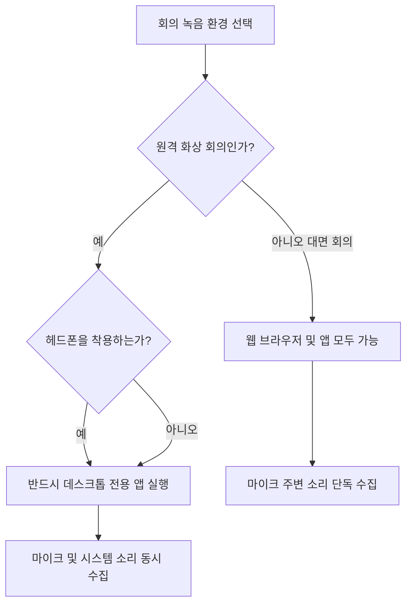

노션 AI 회의록은 페이지 빈 곳에서 슬래시(/)를 누르고 meet을 입력하면 즉시 사용할 수 있습니다.

화상 회의를 하면서 받아적기만 하느라 대화의 흐름을 놓치는 분들이 많습니다. 노션 AI 사용법을 검색하는 분들이 가장 알고 싶어 하는 지점은 두 가지입니다. 무료로 어디까지 쓸 수 있는지와 실제로 회의록을 얼마나 편하게 뽑아낼 수 있는지입니다. 많은 글들이 단순히 좋다는 말만 늘어놓아 막상 결제해야 하는지 판단하기 어렵습니다. 이 글에서는 노션 ai 무료 사용법 범위와 노션 ai 회의록 가격 구조를 명확히 밝힙니다. 아울러 컴퓨터에서 바로 써먹는 노션 ai 회의록 사용법 절차까지 한 번에 정리합니다.

## 노션 AI 무료 사용법 범위와 요금제별 회의록 가격 비교

노션 AI는 완전 무료 서비스가 아니며 무료 사용자는 몇 번의 맛보기 체험만 이용할 수 있습니다.

검색창에 노션 ai 무료 사용법이나 노션 ai 회의록 무료 여부를 찾는 분들이 가장 먼저 확인해야 할 사실이 있습니다. 현재 노션의 Free 요금제와 Plus 요금제에서는 노션 AI 정식 기능을 계속해서 쓸 수 없습니다. 가입 초기나 워크스페이스 생성 시 주어지는 아주 제한된 횟수의 무료 체험(limited AI trial)만 제공됩니다. 이 체험 횟수를 다 쓰고 나면 AI 기능이 완전히 멈춥니다. 워크스페이스 인원수나 정책에 따라 기본 주어지는 무료 응답 횟수는 유동적이며 공식 문서에서도 고정된 단일 숫자를 공개하지 않고 있습니다. 따라서 무료로 무제한 회의록을 만들 수 있다는 정보는 사실이 아닙니다.

업무에서 끊김 없이 노션 ai 노트를 쓰려면 상위 요금제를 선택해야 합니다. 현재 노션은 AI 미팅 노트, Notion Agent(사용자 대신 복잡한 작업을 처리하는 도구), Enterprise Search(사내 도구 통합 검색) 같은 전체 AI 기능을 비즈니스 요금제 이상에 기본 탑재했습니다. 이전처럼 별도 부가 옵션으로 복잡하게 계산하지 않고 요금제에 묶어서 제공하는 방식입니다. 노션 ai 회의록 가격 기준은 Business 요금제 결제 방식에 따라 갈립니다. 연간 청구로 결제하면 팀 멤버 한 사람당 한 달에 20달러가 듭니다. 월간 단위로 결제하면 멤버 한 사람당 한 달에 24달러를 내야 합니다. 대기업용인 Enterprise 요금제에도 이 AI 기능들이 기본으로 포함되어 있습니다.

개인 프로젝트나 일기 수준의 가벼운 기록이라면 무료 체험 횟수 안에서 단순한 질의응답을 시험해 볼 수 있습니다. 그러나 매주 팀 단위로 화상 회의를 열고 회의록을 체계적으로 남겨야 하는 팀이라면 처음부터 Business 요금제를 예산에 반영해야 합니다. 무료 체험만 믿고 중요한 미팅 도중에 녹음을 시작했다가 중간에 할당량이 끝나서 기능이 멈추는 불상사가 생길 수 있습니다.

```chartjs
{
  "type": "bar",
  "data": {
    "labels": ["Business 연간 결제", "Business 월간 결제"],
    "datasets": [{"label": "멤버당 월 청구 금액 (USD)", "data": [20, 24], "backgroundColor": ["#2f9e8f", "#1d6f63"]}]
  },
  "options": {"responsive": true}
}
```

| 요금제 명칭 | 포함된 노션 AI 범위 | 멤버당 청구 비용 | 비고 |
| :--- | :--- | :--- | :--- |
| Free 요금제 | 제한된 횟수의 무료 체험만 제공 | 0달러 | 체험 소진 시 사용 불가 |
| Plus 요금제 | 제한된 횟수의 무료 체험만 제공 | 멤버당 월 10달러 안팎 (기본 요금) | AI 상시 이용 불가 |
| Business 요금제 | AI 미팅 노트, Agent, 통합 검색 등 전 기능 번들 | 연간 청구 시 멤버당 월 20달러 / 월간 청구 시 24달러 | 정식 업무에 적합 |
| Enterprise 요금제 | 노션 AI 전체 기능 포함 | 별도 협의 | 대규모 조직 맞춤 |

## 노션 AI 노트 사용법: 페이지 생성부터 실시간 음성 녹음 절차

노션 AI 회의록은 페이지 안에서 슬래시 명령어 /meet을 입력하여 즉시 생성합니다.

노션 ai 노트 사용법 절차는 생각보다 매우 직관적입니다. 두 가지 경로로 녹음 블록을 띄울 수 있습니다. 첫 번째는 일반 노션 페이지 빈 줄에 슬래시(/)를 입력한 뒤 영문으로 meet을 타이핑하는 방법입니다. 화면 목록에 AI 회의록 블록이 나타나며 이를 누르면 그 자리에 녹음 준비 화면이 생깁니다. 두 번째 경로는 노션 좌측 메뉴의 홈(Home) 화면을 이용하는 방법입니다. 노션 캘린더나 연동된 일정 타일에 예정된 미팅이 표시되어 있다면 해당 일정 타일을 클릭해 곧바로 녹음 세션을 열 수 있습니다.



회의가 시작되기 전에 반드시 챙겨야 하는 중요한 설정이 있습니다. 생성된 AI 회의록 블록 아래쪽을 보면 '참고(Notes)'라는 이름의 입력 영역이 있습니다. 여기에 오늘 나눌 회의 안건, 프로젝트 배경, 특이 용어, 주요 참석자 이름을 미리 짤막하게 적어둡니다. AI는 녹음된 음성뿐만 아니라 이 참고 영역에 적힌 내용을 사전 맥락으로 함께 파악합니다. 아무런 배경지식 없이 음성만 듣게 하면 업계 고유 명사나 팀 내 약어를 엉뚱한 단어로 받아적기 쉽습니다. 미리 적어둔 서너 줄의 안건이 전사의 정확도를 크게 끌어올립니다.

준비가 끝났다면 시작 버튼을 누릅니다. 대화가 오가는 동안 화면에는 AI가 실시간으로 말을 받아적는 과정이 이어집니다. 다만 한 번의 미팅에서 기술적으로 최대 몇 시간까지 연속 녹음이 유지되는지에 대한 구체적 상한 시간은 공식 도움말에 명시되어 있지 않습니다. 따라서 반나절 이상 이어지는 마라톤 회의를 진행한다면 세션 단위로 끊어서 녹음을 새로 시작하는 방식을 권장합니다. 발언이 겹치지 않게 조리 있게 말할수록 텍스트 변환 품질은 한층 더 깔끔해집니다.

## 데스크톱 앱과 웹 브라우저의 오디오 수집 차이와 주의점

화상 회의 시 상대방 음성까지 함께 녹음하려면 웹 브라우저가 아니라 반드시 노션 데스크톱 앱을 써야 합니다.

노션 ai 회의록 사용법 중에서 초보자가 가장 많이 실수하는 영역이 바로 실행 환경의 차이입니다. 노션은 크롬 같은 웹 브라우저에서도 열리고 PC 전용 설치 프로그램으로도 열립니다. 그러나 오디오를 수집하는 방식은 완전히 다릅니다. 웹 브라우저에서 노션을 띄우고 회의록 녹음을 켜면 오직 사용자의 컴퓨터 마이크로 들어오는 내 목소리만 수집됩니다. 스피커를 끄고 헤드폰을 낀 상태라면 이어폰을 통해 들려오는 상대방의 목소리는 녹음되지 않습니다. 회의가 끝난 뒤 절반짜리 대화만 남아 당황하는 이유가 여기에 있습니다.

반면 노션 데스크톱 앱(PC 설치형 프로그램)은 마이크 오디오와 시스템 내부 오디오를 동시에 수집합니다. 시스템 오디오란 컴퓨터 스피커나 헤드폰으로 재생되는 모든 소리를 뜻합니다. 덕분에 Zoom, Google Meet, Microsoft Teams 같은 원격 화상회의 도구를 사용할 때 매우 편리합니다. 기존 도구들처럼 회의방에 별도의 녹음 봇 계정을 초대하지 않아도 됩니다. 헤드폰을 착용하고 있어도 상대방이 말하는 소리가 시스템 오디오 경로를 통해 노션으로 직접 들어옵니다. 내 마이크 음성과 원격 참석자의 음성이 하나로 모여 깔끔하게 전사됩니다.



조용한 단독 사무실에서 마이크 하나만 켜두고 대면 회의를 기록할 때는 웹 브라우저를 써도 크게 상관없습니다. 하지만 재택근무나 원격지 협업처럼 온라인 환경에서 만날 때는 데스크톱 앱을 선택하는 것이 필수 조건입니다. 마이크 권한이나 오디오 캡처 권한 창이 운영체제에서 뜰 때는 반드시 허용을 눌러주어야 시스템 소리 누락 없이 온전한 대화록을 얻을 수 있습니다.

## 회의 결과 자동 정리 구조와 팀 협업 연동 방식

녹음이 끝나면 AI가 대화 내용을 분석하여 핵심 요점과 실행 과제를 워크스페이스 페이지에 구조화된 표와 목록으로 정리합니다.

회의가 종료된 후 중지 버튼을 누르면 인공지능이 즉시 전사된 텍스트 뭉치를 분석합니다. 단순히 말을 그대로 받아적은 스크립트만 던져주는 방식이 아닙니다. 회의에서 논의된 주요 결정 사항, 핵심 요점(Key Points), 그리고 담당자가 앞으로 처리해야 할 실행 과제(Action Items)를 일목요연한 문단과 체크리스트로 나누어 작성합니다. 이 모든 요약본은 녹음을 진행했던 워크스페이스 페이지에 자동 저장됩니다. 일일이 녹음 파일을 다운로드하여 다른 도구로 옮기는 번거로움이 전혀 없습니다.

자동 생성된 실행 과제는 노션의 데이터베이스 기능과 즉시 연결할 수 있습니다. 할 일 목록으로 도출된 텍스트 블록 옆에 담당자 태그를 걸고 마감일을 지정하면 회의가 끝나자마자 팀의 프로젝트 관리 보드에 반영됩니다. 회의 중에 나온 결정 사항에 의문이 생기면 회의록 하단에 원문으로 보존된 전체 대화 스크립트를 펼쳐서 전후 맥락을 다시 확인할 수 있습니다. AI가 요약하는 과정에서 빠뜨린 뉘앙스가 있다면 스크립트 검색을 통해 발언 시점을 찾아내면 됩니다.

팀 협업 측면에서도 접근 권한 관리가 간편합니다. 회의가 저장된 노션 페이지 권한을 프로젝트 팀원들에게만 열어두면 회의에 참석하지 못한 동료도 1분 안에 핵심 결정 사항을 파악할 수 있습니다. 회의가 끝난 직후 공유 링크를 슬랙이나 이메일로 보내면 사후 보고서 작성 시간을 획기적으로 줄일 수 있습니다.

## 그래서 내 업무에는 뭐가 달라지나

이 글을 읽은 뒤 내일부터 즉시 적용할 수 있는 구체적인 업무 행동은 세 가지입니다.

첫째, 오늘 당장 노션 데스크톱 앱이 컴퓨터에 설치되어 있는지 확인하고 화상 회의용 실행 환경을 단일화하십시오. 웹 브라우저 탭에서 노션을 열어 회의를 기록하면 헤드폰을 썼을 때 상대방 목소리가 완전히 날아갑니다. 온라인 미팅 전용 장소는 무조건 공식 데스크톱 프로그램으로 고정해야 합니다. 앱 설치 후 설정에서 오디오 접근 권한이 정상 허용되어 있는지 미리 점검을 끝내 두시기 바랍니다.

둘째, 회의를 시작하기 1분 전에 생성된 AI 회의록 블록 하단의 참고(Notes) 영역에 핵심 단어를 입력하는 습관을 들이십시오. 오늘 다룰 세 가지 안건 제목과 프로젝트 코드명, 특이한 인명만 굵게 적어두어도 요약의 품질이 완전히 달라집니다. 배경지식 없이 모델이 임의로 추측해 단어를 왜곡하는 실수를 사전에 차단할 수 있습니다.

셋째, 팀의 회의 빈도를 계산하여 요금제 유지 여부를 이번 주 안에 결정하십시오. 팀원이 매주 2회 이상 정기적으로 화상 회의를 진행한다면 무료 체험을 전전하지 말고 Business 요금제(연간 청구 시 멤버당 월 20달러, 월간 청구 시 24달러)로 전환하는 것이 업무 생산성 면에서 이득입니다. 반면 한 달에 한두 번 단순 메모 보조용으로만 쓴다면 굳이 비싼 요금제로 바꿀 필요 없이 기본 텍스트 작성 기능만 유지하는 쪽을 권장합니다.

<!-- internal-links:start -->
## 함께 읽으면 이해가 이어지는 글

- [GPT-5.6 Sol Ultrafast 프리뷰: 초당 750토큰과 실제 지연 시간 판단법]() — OpenAI와 Cerebras가 Cerebras 웨이퍼 스케일 엔진 기반으로 표준 대비 최대 14배 빠른 GPT-5.6 Sol Ultrafast mode API를 공개했습니다. 초당 최대 750토큰을 생성하여 실시간 음성 에이전트…
- [영상과 소리를 따로 만들면 왜 어긋날까: MOVA의 동시 생성 구조]() — MOVA가 32B MoE 중 18B를 활성화해 영상, 음성을 함께 생성하는 방식, 보고된 동기화 개선과 배포 판단 기준을 설명합니다.
- [AI 사이트 100개 총정리 — 글쓰기, 검색, 디자인, 영상, 음악, 코딩, 업무 자동화]() — 유행순 목록이 아니라 지금 하려는 일에서 바로 고를 수 있도록 100개 AI 사이트의 용도, 추천 대상, 공식 링크를 짧은 카드로 정리한 북마크용 디렉터리입니다.
<!-- internal-links:end -->

## 자주 묻는 질문

### 노션 AI 회의록은 무료 요금제에서 무제한으로 쓸 수 있나요?

아닙니다. Free 및 Plus 요금제에서는 제한된 횟수의 무료 체험만 제공되며 상시 무제한 이용은 불가능합니다. 지속적으로 쓰려면 Business 이상의 요금제를 구독해야 합니다.

### Zoom이나 구글 밋 회의할 때 상대방 목소리가 녹음되지 않는 이유는 무엇인가요?

웹 브라우저에서 노션을 실행했기 때문입니다. 웹 브라우저는 내 마이크 소리만 수집하므로 시스템 내부 소리까지 함께 녹음하려면 노션 데스크톱 전용 앱을 설치하여 사용해야 합니다.

### 회의록 기능에서 한 번에 녹음할 수 있는 최대 연속 시간은 얼마인가요?

공식 도움말에는 1회 세션당 허용되는 최대 연속 녹음 시간 상한이 명시되어 있지 않습니다. 장시간 진행되는 미팅이라면 세션별로 끊어서 기록하는 편이 안전합니다.

### AI가 고유 명사나 팀 내 약어를 엉뚱하게 인식할 때는 어떻게 방지하나요?

녹음 시작 전 AI 회의록 블록 아래쪽의 '참고(Notes)' 영역에 회의 안건, 프로젝트 명칭, 주요 참여자 이름을 미리 적어두면 AI가 이를 맥락으로 파악하여 오인식을 줄입니다.

## 직접 확인한 원문

- [Notion Help Center](https://www.notion.com/help/ai-meeting-notes) (2026-09-13 확인)
- [Notion Pricing](https://www.notion.com/pricing) (2026-09-13 확인)

위 수치는 확인 시점 기준이며 예고 없이 바뀔 수 있습니다. 결정 전에 공식 페이지를 한 번 더 확인하시기 바랍니다.
