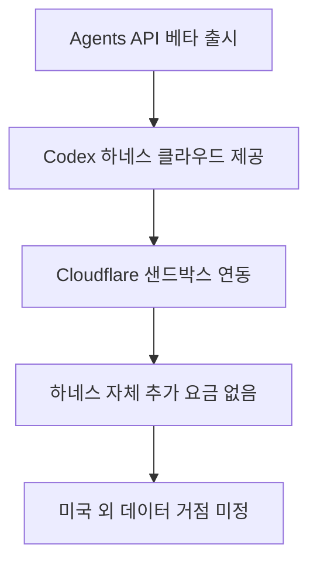

AI에게 “이 자료를 읽고 보고서 파일까지 만들어줘”라고 맡기는 앱을 생각해 보세요. 답변을 받는 것만으로 끝나지 않습니다. 파일을 보관하고, 작업이 끊기면 이어 가고, AI가 실행할 코드의 작업 공간도 마련해야 합니다.

**OpenAI Agents API는 이런 작업의 진행 관리를 대신 맡아주는 개발자용 기능입니다.** 개발자가 도구와 실행 환경을 연결하면 OpenAI가 대화 세션, 작업 조율, 컨텍스트 압축과 복구를 관리합니다. [공식 문서](https://developers.openai.com/api/docs/guides/agents-api/overview)

쉽게 말해 AI에게 일을 시키는 앱의 뒷정리를 덜어주는 셈입니다. 다만 앱의 기능을 정하고 결과가 맞는지 확인하는 일까지 사라지는 것은 아닙니다.

> **먼저 알아둘 용어**
>
> - **에이전트**: 사람이 단계마다 지시하지 않아도 스스로 여러 작업을 이어서 처리하는 AI입니다.
> - **API**: 다른 프로그램에서 이 기능을 불러다 쓸 수 있게 열어 둔 창구입니다.
> - **토큰**: AI가 글을 잘게 쪼개 세는 단위입니다. 글자와 토큰의 비율은 언어와 내용에 따라 달라집니다.
> - **컨텍스트 윈도우**: AI가 한 번에 참고할 수 있는 입력의 범위입니다. 범위 안의 내용을 항상 정확히 활용한다는 뜻은 아닙니다.
{: .prompt-info }

## 무슨 일이 벌어진 걸까?

OpenAI가 2026년 9월 10일 공개한 Agents API 퍼블릭 베타는 자사의 유명 코딩 도구인 Codex를 움직이던 핵심 관리 틀을 외부 개발자에게 그대로 열어준 서비스입니다 <a href="#source-1" aria-label="OpenAI 공식 문서 출처">[1]</a>.

여기서 하네스는 복잡한 엔진 장치가 흔들리지 않고 안전하게 돌아가도록 겉에서 든든하게 지탱해 주는 받침대이자 제어 장치를 뜻합니다. 인공지능이 긴 작업을 진행하다 보면 이전 대화 내용을 잊어버리거나 엉뚱한 길로 새기 쉬운데, 바로 이 하네스가 대화 기억을 차곡차곡 정리하고 전체 작업의 순서를 차분하게 제어해 줍니다 <a href="#source-2" aria-label="MarkTechPost 보도 출처">[2]</a>.

발표에 따르면 Agents API는 전체 구조를 네 가지 핵심 개념으로 설계했습니다.

첫 번째는 명령을 수행하는 실질적인 주체인 Agent입니다. 두 번째는 코드가 안전하게 돌아가는 작업 공간인 Environment입니다. 세 번째는 사용자와 주고받는 대화 전체 흐름을 보관하는 Session입니다. 마지막 네 번째는 그 안에서 차례대로 일어나는 활동과 데이터의 기록인 Events and items입니다 <a href="#source-1" aria-label="OpenAI 공식 문서 출처">[1]</a>.

개발자는 이 네 가지 뼈대 위에서 **OpenAI가 관리하는 실행 공간을 선택할 수 있습니다.** 샌드박스는 외부 시스템에 해를 끼치지 않고 격리된 채로 코드를 시험할 수 있는 안전한 모래놀이터 같은 실행 공간입니다.

자체 전산망을 운영하는 기업이라면 WebSocket이라는 실시간 통신 방식을 통해 자체 호스팅 환경을 이어 붙여도 됩니다. Cloudflare, Modal, DigitalOcean 같은 파트너 기업의 샌드박스 인프라도 자유롭게 골라잡을 수 있습니다 <a href="#source-2" aria-label="MarkTechPost 보도 출처">[2]</a>.

인공지능이 도중에 멈추거나 꼬였을 때 알아서 복구하는 장치와 긴 기억을 줄여주는 컨텍스트 압축 기능까지 OpenAI 서버에서 직접 맡아 줍니다.

컨텍스트 압축은 대화가 길어져서 모델의 기억 용량이 꽉 찰 때 불필요한 군더더기를 걷어내고 알맹이 정보만 간추려주는 기술입니다. 덕분에 개발팀은 복잡한 복구 논리나 세션 저장소를 만드느라 시간을 허비하지 않고 온전히 비즈니스 가치를 만드는 데 집중할 수 있게 되었습니다.

<figure class="news-source-image">
  
  <figcaption>OpenAI가 원문과 함께 공개한 이미지입니다. <a href="https://developers.openai.com/api/docs/guides/agents" target="_blank" rel="noopener noreferrer">출처: OpenAI</a></figcaption>
</figure>

## 왜 지금 다들 이 이야기를 할까?

이번 변화에서 볼 점은 **개발팀이 직접 관리할 일과 서비스에 맡길 일이 달라진다는 것**입니다. 공식 문서는 대화 세션 유지, 작업 조율, 컨텍스트 압축과 복구를 관리 대상으로 제시합니다. [공식 문서](https://developers.openai.com/api/docs/guides/agents-api/overview)

식당에 비유하면 주방 설비 일부를 빌리는 것과 비슷합니다. 설비를 처음부터 만들 부담은 줄일 수 있지만, 메뉴와 조리 순서까지 저절로 정해지지는 않죠. 앱 개발에서도 어떤 도구를 연결하고 어떤 결과를 통과시킬지는 개발팀이 정해야 합니다.

특히 다양한 외부 도구를 손쉽게 꽂아 쓰는 개방성이 이번 발표에서 크게 돋보입니다.

인공지능과 다양한 외부 도구를 이어주는 표준 규약인 Model Context Protocol, 즉 MCP 서버를 바로 붙일 수 있습니다 <a href="#source-1" aria-label="OpenAI 공식 문서 출처">[1]</a>. MCP는 서로 다른 프로그램들이 일정한 규칙을 바탕으로 서로의 데이터를 안전하게 주고받도록 돕는 규약입니다. 이를 통해 회사 내부 데이터베이스나 독자적인 애플리케이션 함수도 손쉽게 엮어 넣을 수 있고, 기본 기능으로 웹 검색 도구까지 함께 쓸 수 있습니다 <a href="#source-2" aria-label="MarkTechPost 보도 출처">[2]</a>.

| 구분 | 기존 자체 에이전트 구축 방식 | OpenAI Agents API 활용 방식 |
| :--- | :--- | :--- |
| 실행 환경 구축 | 개발팀이 격리 서버 인프라를 직접 설계 | OpenAI 호스팅 또는 Cloudflare, Modal 연동 |
| 대화 세션 관리 | 자체 데이터베이스와 기억 압축 알고리즘 개발 | OpenAI 인프라가 세션 복구와 압축 자동 처리 |
| 다중 작업 위임 | 하위 에이전트 호출 로직을 직접 구현 | 독립된 컨텍스트 창을 가진 동시 하위 에이전트 조율 |
| 기본 과금 체계 | 인프라 유지 고정 비용과 토큰 비용 병행 | 하네스 수수료 없이 토큰과 컨테이너 런타임만 청구 |

요금도 구분해서 봐야 합니다. **플랫폼 기능을 쓸 수 있다는 것과 작업 비용이 없다는 것은 다릅니다.** 공식 문서는 선택한 모델의 API 사용료, 도구 사용료, OpenAI 호스팅 컨테이너 요금을 안내합니다. [요금 안내](https://developers.openai.com/api/docs/guides/agents-api/overview#pricing)

도입을 검토한다면 요청 한 번의 비용만 볼 것이 아니라, 작업을 끝내기까지 모델과 도구를 얼마나 쓰는지도 확인해야 합니다.

## 그래서 우리에게 뭐가 달라질까?

OpenAI Agents API의 등장은 혼자서 모든 일을 끙끙 앓으며 처리하던 인공지능이 팀 단위로 협업하는 전문가 그룹으로 진화한다는 뜻입니다.

이 API는 **메인 에이전트가 하위 에이전트에게 작업을 나누어 맡기는 방식**을 지원합니다 <a href="#source-1" aria-label="OpenAI 공식 문서 출처">[1]</a>. 각 하위 에이전트는 서로 간섭받지 않는 독립적인 컨텍스트 창을 따로 유지합니다. 컨텍스트 창은 언어 모델이 한 번에 머릿속에 올려두고 참고할 수 있는 텍스트의 총량을 의미합니다.

예를 들어 복잡한 웹 서비스를 새로 만드는 상황을 떠올려 볼 수 있습니다.

메인 에이전트가 전체 설계를 잡으면, 한쪽 하위 에이전트는 화면 디자인 코드를 짜고, 다른 하위 에이전트는 데이터베이스 서버를 설정하며, 또 다른 하위 에이전트는 오류를 잡아내는 테스트 코드를 동시에 돌리는 구조입니다. 작업별로 참고할 내용을 나누는 구조지만, 이것만으로 긴 작업의 오류가 줄어든다고 단정할 수는 없습니다 <a href="#source-2" aria-label="MarkTechPost 보도 출처">[2]</a>.

여기서 **격리된 실행 공간이 있다고 모든 작업이 안전해지는 것은 아닙니다.** 파일을 수정하거나 외부 도구를 부르는 앱이라면 접근 권한과 승인 기준을 함께 정해야 합니다. 중요한 원본 자료 대신 복사본으로 시험하고, 결과를 사람이 확인하는 절차를 두는 편이 좋겠습니다.

사용자 입장에서 기대해 볼 변화는 “대답을 듣는 앱”에서 “파일이나 작업 결과를 받는 앱”으로의 확장입니다. 다만 답의 정확도나 오류 감소 폭은 이 기능의 존재만으로 확인되지 않습니다. 실제 업무 자료와 실패 사례를 넣어 평가해야 합니다.

## 그래서 내 업무에는 뭐가 달라지나

일반 직장인 실무자나 크리에이터는 OpenAI의 개발자 문서를 직접 들여다보며 코딩을 시작할 필요가 전혀 없습니다. 대신 이번 변화가 가져올 소프트웨어 환경의 흐름에 발맞추어 일하는 방식을 새롭게 다듬을 수 있습니다.

먼저, 사내 소프트웨어 개발팀이나 외주 개발 파트너를 만날 때 Agents API 기반의 업무 자동화 도입 가능성을 적극적으로 질문해 보세요.

과거에는 에이전트 인프라를 만드는 데 오랜 기간이 걸린다며 거절당했던 복잡한 사내 보고서 취합이나 데이터 검증 자동화가 이번 기능으로 일부 구현 부담을 줄일 수 있는지 다시 검토할 만합니다. 복잡한 다중 에이전트 시스템을 만드는 데 필요한 기술적 턱이 낮아졌기 때문에 기존에 포기했던 번거로운 수작업들을 다시 자동화 과제로 올려둘 수 있습니다.

다음으로, 자동화할 업무 하나의 입력과 기대 결과를 적어보세요. 예를 들어 보고서 취합이라면 입력 파일 형식, 반드시 들어갈 항목, 빠진 자료를 처리할 기준이 필요합니다. 이것은 실제 도입 성과가 아니라 시험을 준비하는 방법입니다. 기대 결과가 분명해야 AI가 일을 제대로 끝냈는지도 판단할 수 있습니다.

마지막으로, **AI가 해도 되는 일과 사람이 승인할 일을 나누세요.** 자료를 읽고 초안을 만드는 단계와 파일을 삭제하거나 외부로 발송하는 단계는 다르게 취급할 수 있습니다. 이런 경계를 먼저 적어두면 새 도구를 시험할 때 확인할 항목도 선명해집니다.

## 아직은 선을 그어야 할 부분

아무리 뛰어난 기술이라도 장밋빛 기대만 품고 무턱대고 달려드는 것은 매우 위험합니다.

Agents API는 이제 막 문을 연 퍼블릭 베타 단계이며, 실제 실무에 바로 녹여내기에는 몇 가지 중요한 제약 사항들이 분명하게 남아 있습니다 <a href="#source-1" aria-label="OpenAI 공식 문서 출처">[1]</a>.

무엇보다 금융권이나 공공기관처럼 정보 보안이 까다로운 곳에서는 즉각 도입하기 어렵습니다.

공식 문서에 따르면 **현재 데이터 상주는 미국만 지원하며, Zero Data Retention은 지원하지 않습니다**. Zero Data Retention은 데이터 무보관 옵션을 뜻합니다. 자체 호스팅 실행 공간을 사용해도 이 API가 해당 옵션의 적용 대상이 되는 것은 아닙니다 <a href="#source-2" aria-label="MarkTechPost 보도 출처">[2]</a>. 엄격한 개인정보 규제를 받는 기업이라면 데이터 처리 위치 문제로 인해 현업 적용을 신중하게 미뤄야 할 수 있습니다.

또한 초기 기업 파트너들이 주장하는 작업 성공률 상승이나 개발 비용 절감 수치들은 외부 독립 기관의 교차 검증을 거친 결과가 아닙니다.

샌드박스 컨테이너가 오래 켜져 있거나 하위 에이전트들이 꼬리를 물고 지나치게 많은 토큰을 소모하면 예상치 못한 클라우드 비용 청구서를 받아들 수도 있습니다. 성능과 비용 사이의 균형이 입증될 때까지는 전면적인 개편보다는 부분적인 시험 적용이 안전합니다. 따라서 실무에 적용하기 전에는 작은 단위의 업무부터 천천히 시험해 보며 안정성과 실제 지출 비용을 차분하게 따져보는 태도가 반드시 필요합니다.

<!-- primary-sources:start -->
## 원문과 버전 확인

- [발표 원문](https://developers.openai.com/api/docs/guides/agents)
- [MarkTechPost](https://www.marktechpost.com/2026/09/10/openai-launches-the-agents-api-in-public-beta-putting-the-codex-harness-behind-one-api-call)
<!-- primary-sources:end -->

<!-- internal-links:start -->
## 함께 읽으면 이해가 이어지는 글

- [DeepSeek Harness: 모든 기능이 플러그인인 AI 에이전트 실행 환경의 설계와 동작 원리]() — DeepSeek Harness는 모델, 도구, 세션, 샌드박스 등 AI 에이전트의 모든 구성 요소를 독립된 플러그인으로 조립하는 오픈소스 실행 런타임입니다. Cordis 메타 프레임워크 기반의 마이크로커널 구조와 이벤트 궤적 기록을…
- [LangBot으로 여러 메신저를 함께 운영해도 될까: 이벤트, 세션, Rate Limit 설계]() — LangBot의 멀티 파이프라인과 메신저 어댑터 구조를 살펴보고, 여러 채널에서 세션, 권한, 스트리밍, Rate Limit을 일관되게 운영하는 기준을 정리합니다.
- [n8n-mcp가 접착제 코드를 없앨까: 도구 노출, 권한, 승인 설계]() — n8n-mcp가 n8n 노드 정보를 에이전트 도구로 연결하는 구조를 살펴보고, 스키마 과다, 자격 증명, 파괴적 작업을 통제하는 방법을 정리합니다.
<!-- internal-links:end -->

## 자주 묻는 질문

### OpenAI Agents API를 쓰려면 별도의 플랫폼 가입비나 월정액을 내야 하나요?

아닙니다. OpenAI는 Agents API 하네스 사용 자체에는 별도 플랫폼 수수료를 부과하지 않으며 모델 토큰과 유료 도구 비용, 호스팅 샌드박스 컨테이너 실행 시간에 대해서만 비용을 청구합니다.

### 에이전트가 코드를 실행할 때 사내 격리 서버나 다른 클라우드를 연결할 수 있나요?

네, 가능합니다. OpenAI 호스팅 샌드박스뿐만 아니라 WebSocket 기반 자체 호스팅 환경이나 Cloudflare, Modal, DigitalOcean 같은 파트너 샌드박스를 자유롭게 연결해 쓸 수 있습니다.

### 여러 작업을 동시에 처리할 때 이전 대화 기억이 엉키지 않나요?

하위 에이전트별로 컨텍스트를 나눌 수 있지만 오류가 없다는 보장은 아닙니다. 작업 위임과 결과를 합치는 과정이 맞는지는 별도로 확인해야 합니다.

### 한국이나 유럽처럼 미국 외 지역에 데이터를 저장해야 하는 기업도 바로 쓸 수 있나요?

지금 당장은 주의가 필요합니다. OpenAI가 데이터 상주 지원을 미국 외 지역으로 확장하거나 Zero Data Retention을 언제 도입할지에 대한 일정은 아직 발표되지 않았습니다.

## 직접 확인한 원문

<ol class="checked-source-list">
  <li id="source-1"><a href="https://developers.openai.com/api/docs/guides/agents" target="_blank" rel="noopener noreferrer">OpenAI — Agents API - OpenAI Developers</a> (2026-09-10)</li>
  <li id="source-2"><a href="https://www.marktechpost.com/2026/09/10/openai-launches-the-agents-api-in-public-beta-putting-the-codex-harness-behind-one-api-call" target="_blank" rel="noopener noreferrer">MarkTechPost — OpenAI Launches the Agents API in Public Beta, Putting the Codex Harness Behind One API Call</a> (2026-09-10)</li>
</ol>

> 이 글은 위 원문을 직접 확인해 작성했습니다. 가격, 기능 범위, 지역별 제공 여부는 게시 후 바뀔 수 있으니 실제 도입 전 공식 문서를 다시 확인하세요.
