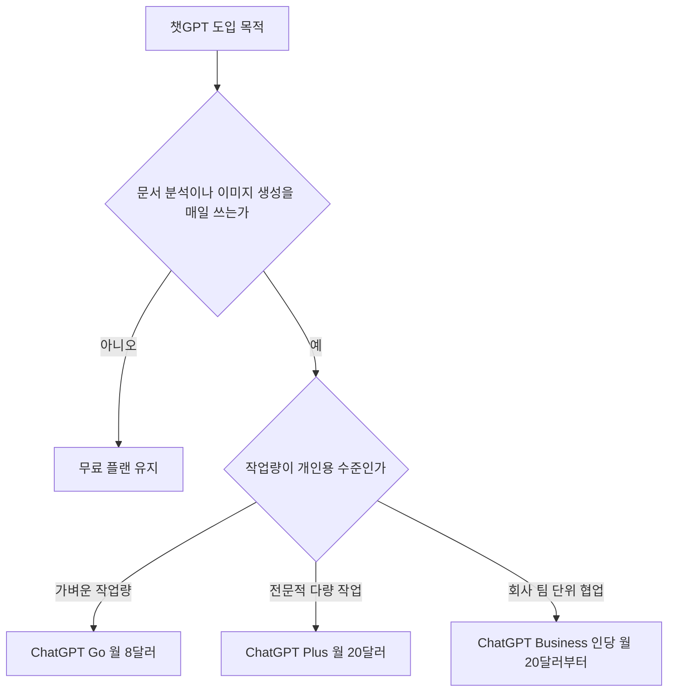

챗gpt 유료 무료 차이는 파일 분석과 이미지 생성 같은 도구 사용량과 피크 시간대 접속 우선권에서 갈립니다.

인터넷 커뮤니티나 검색창에서는 유료 결제를 해야 하는지 고민하는 질문이 매일 올라옵니다. 무료 계정에서도 기본적인 대화가 지원되다 보니 굳이 매월 달러를 지불할 이유가 있는지 헷갈리기 쉽습니다. 하지만 업무에서 문서 파일을 자주 올리거나 그래픽 이미지를 생성할 때는 무료 환경에서 곧바로 작업 중단 안내를 마주치게 됩니다. 이 글은 무료 플랜의 실질적인 제약부터 각 유료 요금제의 가격과 사양 차이를 가감 없이 비교하여 독자가 결정을 끝내도록 돕습니다.



## 챗gpt 유료 무료 차이와 계정별 핵심 한도

무료 플랜은 단순 텍스트 대화만 쓸 때 충분하지만 업무 도구를 쓰는 순간 명확한 벽에 부딪힙니다. OpenAI가 제공하는 기본 계정인 무료(Free) 플랜은 일상적인 텍스트 질문과 답변 대화를 무제한으로 지원합니다. 반면에 엑셀이나 PDF 문서를 직접 업로드하여 내용을 요약하는 파일 업로드 기능, 그림을 그려 주는 이미지 생성 기능, 대화형 음성 모드, 복잡한 통계를 내는 데이터 분석 기능 같은 부가 도구에는 별도의 엄격한 사용 한도가 적용됩니다. 트래픽 상황에 따라 무료 사용자의 세부 호출 횟수는 유동적으로 줄어들며, 특정 한도를 넘기면 일정 시간 동안 도구 사용이 즉시 중단됩니다.

파일을 보관하는 용량에서도 큰 제약이 존재합니다. 사용자가 올린 문서나 생성된 결과물을 서버에 보관하고 나중에 다시 꺼내어 쓸 수 있는 라이브러리(Library) 저장공간이 무료 계정에는 총 500MB(메가바이트, 컴퓨터 파일 용량을 재는 기본 단위)까지만 주어집니다. 고용량 보고서나 이미지 파일을 몇 번만 다루어도 금방 차오르는 크기입니다. 또한 특정 국가에서는 무료 화면에 상업 광고가 표시될 수 있습니다. 만약 무료 계정 환경에서 광고가 뜨지 않는 모드로 설정을 바꾸면 메시지 호출 한도와 도구 사용 횟수가 대폭 축소되는 페널티를 받게 됩니다.

나만의 전용 비서를 만드는 커스텀 GPT(Custom GPTs, 특정 업무 목적에 맞춰 미리 지침과 데이터를 주입해 둔 맞춤형 챗봇)의 경우도 차이가 있습니다. 무료 계정이나 개인 유료 계정은 다른 사람이 이미 만들어 둔 외부 챗봇을 찾아 검색하고 대화하는 것만 가능합니다. 내가 직접 문서를 넣어서 우리 회사만의 고유한 챗봇을 새로 제작하거나 동료에게 배포하는 권한은 Free, Go, Plus, Pro 같은 모든 개인용 계층에서 제공되지 않으며 오직 Business나 Enterprise 같은 조직 전용 워크스페이스에서만 만들 수 있습니다. 따라서 개인 차원에서 무료와 유료를 고민할 때는 고급 도구의 사용 빈도와 응답 연속성을 중심에 두고 판단해야 합니다.

## 챗gpt 유료 가격 차이와 플랜별 기능 비교

개인과 기업이 선택할 수 있는 유료 플랜은 가격과 메시지 처리 용량에 따라 명확히 쪼개져 있습니다. 2026년 9월 14일 기준 OpenAI의 유료 서비스 계층은 개인을 위한 보급형과 고급형, 그리고 조직을 위한 팀 플랜으로 나뉩니다. 가장 저렴한 보급형 유료 계층인 ChatGPT Go는 월 8달러(USD $8)입니다. 이 요금제는 무료 티어와 비교했을 때 메시지 호출 한도, 파일 업로드 개수, 이미지 생성 허용량을 10배(10x) 더 많이 제공합니다. 또한 이전 대화를 더 오래 기억하는 확장된 메모리와 컨텍스트 창(Context Window, AI가 한 번에 머릿속에 담고 기억할 수 있는 글의 길이)을 지원하여 가성비를 노리는 사용자에게 적합합니다.

표준 유료 플랜인 ChatGPT Plus 요금제의 가격은 월 20달러(USD $20, 월별 청구)입니다. 많은 이용자가 연간 결제 시 할인이 되는지 궁금해하지만 현재 플러스 플랜에는 연간 결제 할인이나 여러 달 요금을 한꺼번에 미리 내는 선납 옵션이 전혀 제공되지 않습니다. 무조건 한 달 단위로 20달러씩 정기 결제됩니다. 플러스 플랜의 가장 큰 장점은 전 세계 이용자가 몰리는 피크 시간대(Peak time, 접속자가 폭증하는 혼잡 시간)에도 서버 지연이나 튕김 없이 우선적으로 시스템에 접속할 수 있는 권한과 함께 무료 티어 대비 월등히 빠른 답변 처리 속도를 보장받는다는 점입니다.

```chartjs
{
  "type": "bar",
  "data": {
    "labels": ["Free", "Go", "Plus", "Business 연간", "Business 월간", "Pro"],
    "datasets": [{
      "label": "월 요금 (USD 달러)",
      "data": [0, 8, 20, 20, 25, 200],
      "backgroundColor": ["#9aa5a1", "#4fa89b", "#2f9e8f", "#238677", "#1d6f63", "#124840"]
    }]
  },
  "options": {
    "responsive": true
  }
}
```

초고성능 연산이 필요한 전문가를 위한 ChatGPT Pro 요금제는 월 200달러(USD $200)에 달합니다. 반면 2인 이상 협업하는 직장인을 위한 ChatGPT Business 플랜은 1년 치를 한 번에 결제하는 연간 청구 시 1인당 월 20달러($20), 한 달씩 결제하는 월간 청구 시 1인당 월 25달러($25)입니다. 비즈니스 플랜은 최소 2석(2 seats, 구매해야 하는 계정 수) 이상부터 가입할 수 있습니다. 여기서 개발자나 기술 연구자가 자주 혼동하는 치명적인 주의점이 있습니다. ChatGPT Plus나 Business에 가입하여 매달 요금을 내더라도 외부 프로그램 연동에 쓰이는 OpenAI API(Application Programming Interface, 다른 소프트웨어와 AI를 이어 주는 통로) 사용료는 일절 포함되어 있지 않습니다. API 사용량은 개발자 콘솔에서 카드 등록 후 사용한 글자 수에 비례하여 완전히 별도로 독립 청구됩니다.

| 구분 | ChatGPT Free | ChatGPT Go | ChatGPT Plus | ChatGPT Business |
| :--- | :--- | :--- | :--- | :--- | :--- | 
| 월 이용료 | 0달러 | 월 8달러 | 월 20달러 (할인 없음) | 인당 월 20달러 (연청구) / 월 25달러 (월청구) |
| 최소 가입 단위 | 1인 | 1인 | 1인 | 최소 2석 이상 |
| 텍스트 대화 | 일상 대화 무제한 | 일상 대화 무제한 | 우선 접속 및 초고속 응답 | 우선 접속 및 비즈니스 데이터 보호 |
| 부가 도구 한도 | 엄격한 제한 적용 | 무료 대비 10배 확대 | 최우선 작업 허용량 | 팀 공용 확장 허용량 |
| 라이브러리 저장공간 | 500 MB 제한 | 확대 제공 | 확대 제공 | 기업용 워크스페이스 저장공간 |
| 광고 정책 | 일부 국가 노출 가능 (제거 시 한도 축소) | 광고 없음 | 광고 없음 | 광고 없음 |
| 커스텀 GPT 신규 제작 | 제작 불가 (탐색만 가능) | 제작 불가 (탐색만 가능) | 제작 불가 (탐색만 가능) | 워크스페이스 내 자체 제작 및 배포 가능 |

## 챗gpt 유료 버전 차이 선택 가이드와 커뮤니티 반응

포털 사이트와 온라인 커뮤니티에서 챗gpt 유료 차이 디시 혹은 챗gpt 유료 무료 차이 디시를 검색해 보면 실제 사용자들의 솔직한 사용 후기가 집중적으로 공유됩니다. 커뮤니티 게시판에서 이용자들이 입을 모아 말하는 가장 현실적인 차이는 텍스트 답변의 어조가 아니라 데이터 분석 도중 끊김이 발생하는가 여부입니다. 무료 플랜으로 긴 엑셀 표나 수십 장짜리 논문을 번역 및 요약하려고 시도하면 질문 서너 번 만에 도구 이용 제한에 도달했다는 메시지가 뜨면서 서너 시간 동안 파일 기능이 완전히 묶여 버리는 일이 잦기 때문입니다.

이 때문에 커뮤니티 실사용자들 사이에서는 챗gpt 유료 버전 차이를 두고 극단적인 양극화 평가가 나타납니다. 코딩 코드를 길게 붙여넣고 실시간으로 디버깅(Debugging, 프로그램 코드의 오류를 찾아 고치는 작업)을 하거나 영문 문서를 하루에도 대여섯 번씩 업로드해야 하는 사무직 및 개발자 계층에서는 월 20달러의 Plus 플랜이 작업 흐름을 끊지 않는 강력한 안전장치 역할을 한다는 평가를 받습니다. 특히 접속자가 몰리는 저녁이나 오후 업무 피크 시간대에 무료 사용자가 서버 대기열에 걸려 응답이 늘어질 때, 플러스 계정은 즉각적이고 안정적인 속도를 유지하는 점에서 값어치를 충분히 한다는 반응이 지배적입니다.

반대로 단순히 문장 윤문이나 간단한 영어 이메일 작성, 단답형 상식 검색만 이용하는 일반 사용자 사이에서는 플러스의 월 20달러가 다소 과하다는 의견이 많습니다. 이때 챗gpt 유료 가격 차이를 고려하여 새롭게 부각되는 대안이 바로 월 8달러 수준의 ChatGPT Go 요금제입니다. 무료 계정의 부가 도구 사용량 대비 10배를 제공하므로, 하루에 서너 장의 이미지 생성과 가벼운 PDF 파일 읽기 정도만 처리하는 일반 직장인이나 대학생은 굳이 20달러를 다 내지 않고도 답답함 없이 작업할 수 있습니다. 단, 스마트폰 애플리케이션의 인앱 결제를 이용할 때는 구글이나 애플의 수수료 정책 및 부가세 체계에 따라 원화 최종 결제 금액이 웹 브라우저 달러 결제와 다를 수 있으므로 결제 화면의 최종 액수를 확인해야 합니다.

## 그래서 내 업무에는 뭐가 달라지나

오늘 당장 내 업무 환경과 지출 비용을 통제하기 위해 실천할 수 있는 세 가지 결정 경로가 있습니다. 첫째, 현재 내 주된 작업이 글자 대화 위주이고 하루에 파일 분석을 한 번 이하로만 한다면 무료 플랜을 유지하십시오. 무료 티어라도 기본적인 일상 질의응답은 횟수 제한 없이 작동합니다. 이때 주의할 점은 무료 계정에서 광고를 끄는 옵션을 누르면 대화 및 도구 한도가 크게 깎이므로 광고가 뜨더라도 기본 설정을 건드리지 않고 그대로 작업하는 것이 유리합니다. 또한 파일 저장공간이 500MB로 빡빡하므로 주기적으로 불필요한 예전 분석 파일들을 정리해야 합니다.

둘째, 매일 업무 보고서를 첨부해 요약하거나 프로그래밍 코드를 검토하고 마케팅 이미지를 생성하는 실무자라면 ChatGPT Go나 Plus 중 하나를 즉시 선택하십시오. 파일 업로드가 하루 대여섯 건 미만이라면 월 8달러인 ChatGPT Go 플랜을 결제하여 10배 넓어진 도구 한도와 메모리를 활용하는 것이 비용 면에서 가장 합리적입니다. 그러나 접속자가 붐비는 업무 시간대에 단 1초의 지체도 없이 빠른 속도를 누려야 하고 대규모 파일 데이터를 연속해서 밀어 넣어야 하는 상급 실무자라면 월 20달러의 ChatGPT Plus를 결제하여 작업 중단을 방지하십시오. 플러스 플랜은 연납 할인이 없으므로 필요한 달에만 결제하고 바쁘지 않은 달에는 해지하는 방식으로 운용하는 것이 경제적입니다.

셋째, 회사나 팀 차원에서 사내 고유 데이터를 학습시킨 맞춤형 챗봇을 만들거나 구성원 간에 작업 환경을 공유해야 한다면 개인용 플랜 결제를 멈추고 ChatGPT Business 요금제를 도입하십시오. 개인용 플랜인 Free, Go, Plus, Pro는 커스텀 GPT를 제작할 수 있는 권한이 차단되어 있습니다. 팀원 2명 이상이 함께 연간 계약으로 인당 월 20달러(월간 청구 시 월 25달러)의 비즈니스 플랜을 구성해야만 자체 워크스페이스 안에서 안전하게 전용 GPT를 만들고 배포할 수 있습니다. 반면 개발자가 파이썬이나 자바스크립트로 직접 AI 시스템을 구축하려는 상황이라면 챗GPT 웹 구독 대신 별도의 OpenAI API 콘솔에 카드를 등록해 사용량 기반 결제를 진행하십시오.

<!-- internal-links:start -->
## 함께 읽으면 이해가 이어지는 글

- [피그마 AI PPT 만들기부터 상세페이지 기획까지 완벽 가이드]() — Figma Slides의 AI 기능을 활용해 개요 작성, 이미지 편집, 발표자 노트 생성부터 PPTX 내보내기까지 프레젠테이션 제작 과정을 단축할 수 있습니다. 무료 Starter 플랜과 유료 Professional 플랜의 AI 지원…
- [이미지 생성 모델이 너무 많다면? Diffusion-GPT 라우터의 선택 기준]() — Diffusion-GPT가 프롬프트를 분석해 여러 전문 디퓨전 모델 중 하나를 고르는 네 단계와 라우팅 지연, 오선택, 모델 로딩 비용을 짚습니다.
- [PhotoDoodle은 30~50쌍으로 스타일을 배울까: 배경 보존 구조와 실행 코드 함정]() — PhotoDoodle의 OmniEditor 사전학습과 EditLoRA 미세조정, positional encoding cloning이 배경을 보존하는 방식, 비교, ablation 결과와 예제 코드의 해상도 주의점을 정리합니다.
<!-- internal-links:end -->

## 자주 묻는 질문

### ChatGPT Plus를 1년 치 한 번에 결제하면 할인을 받을 수 있나요?

아닙니다. ChatGPT Plus 요금제는 월 20달러(USD $20)로 매월 자동 청구되는 방식만 지원되며, 연간 결제 할인이나 다개월 일괄 선납 혜택은 제공되지 않습니다.

### ChatGPT Plus를 구독하면 개발자용 OpenAI API도 무료로 쓸 수 있나요?

아닙니다. ChatGPT Plus 월 구독료에는 API 사용 요금이 포함되어 있지 않습니다. 개발자가 프로그램 연동에 사용하는 API 비용은 별도의 개발자 플랫폼에서 실제 사용한 글자 수에 비례하여 독립 청구됩니다.

### 개인용 Plus 요금제에서 우리 회사 전용 맞춤형 챗봇(Custom GPTs)을 만들 수 있나요?

제작할 수 없습니다. 새로운 커스텀 GPT를 제작하고 배포하는 권한은 Free, Go, Plus, Pro 같은 개인 요금제에서는 제공되지 않으며, 최소 2석 이상으로 운영되는 ChatGPT Business나 Enterprise 같은 조직 워크스페이스에서만 가능합니다.

## 직접 확인한 원문

- [OpenAI Help Center (What is ChatGPT Plus?)](https://help.openai.com/en/articles/6950777-what-is-chatgpt-plus) (2026-09-14 확인)
- [OpenAI Help Center (ChatGPT Free Tier FAQ)](https://help.openai.com/en/articles/9275245-chatgpt-free-tier-faq) (2026-09-14 확인)
- [OpenAI Announcement (Introducing ChatGPT Go, now available worldwide)](https://openai.com/index/introducing-chatgpt-go) (2026-09-14 확인)
- [OpenAI Help Center (ChatGPT Business - Overview)](https://help.openai.com/en/articles/8792828-chatgpt-business-overview) (2026-09-14 확인)
- [OpenAI Help Center (Ads in ChatGPT)](https://help.openai.com/en/articles/20001047-ads-in-chatgpt) (2026-09-14 확인)

위 수치는 확인 시점 기준이며 예고 없이 바뀔 수 있습니다. 결정 전에 공식 페이지를 한 번 더 확인하시기 바랍니다.
