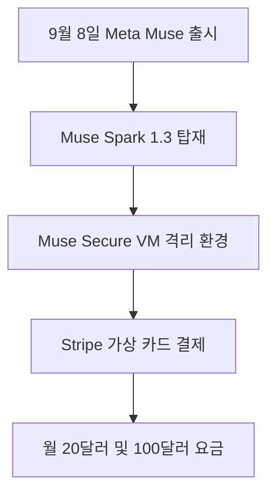

Meta가 2026년 9월 8일 사용자를 대신해 실제 인터넷 작업을 수행하는 개인 비서 Muse를 선보였습니다 <sup class="source-citation"><a href="#source-1" aria-label="Meta 출처">[1]</a></sup>. 채팅창 안에서 말로만 설명하던 대화형 도구를 넘어 사용자의 허락을 받아 실제 앱을 조작하고 결제까지 매끄럽게 마치는 인공지능입니다. 그동안 많은 인공지능이 질문에 글을 써주는 수준에 머물렀다면, 이번 도구는 **직접 외부 서비스에 접속해 복잡한 절차를 대신 마치는 실행형 비서**로 완전히 성격을 바꿨습니다. 식당 예약이나 티켓 구매처럼 번거로운 웹 작업을 비서에게 맡겨두고 내 일에만 집중할 수 있는 환경이 열린 셈입니다. 복잡한 절차를 대신 맡기고 결과를 확인하는 방식으로 일상의 피로를 크게 줄일 수 있습니다.

> **먼저 알아둘 용어**
>
> - **에이전트**: 사람이 단계마다 지시하지 않아도 스스로 여러 작업을 이어서 처리하는 AI입니다.
> - **토큰**: AI가 글을 잘게 쪼개 세는 단위입니다. 한국어는 보통 한두 글자가 토큰 하나입니다.
{: .prompt-info }

## 무슨 일이 벌어진 걸까?

Meta는 2026년 9월 8일 Meta Superintelligence Labs에서 개발한 Muse Spark 1.3 모델 기반의 개인용 인공지능 에이전트 Muse를 공식 출시했습니다 <sup class="source-citation"><a href="#source-1" aria-label="Meta 출처">[1]</a></sup>. 여기서 에이전트란 단순히 문장을 짓는 것에 그치지 않고 목표를 전달받으면 여러 단계를 스스로 판단해 프로그램을 직접 조작하는 소프트웨어를 말합니다. 사용자가 일일이 버튼을 누르지 않아도 지시받은 일감을 끝까지 완료하도록 설계되었습니다.

이번 서비스는 미국 내 18세 이상 사용자를 대상으로 시작되었습니다 <sup class="source-citation"><a href="#source-1" aria-label="Meta 출처">[1]</a></sup>. 지원 환경은 스마트폰 운영체제인 iOS와 Android를 비롯해 인터넷 브라우저로 접속하는 전용 웹페이지 muse.ai, 그리고 메신저 프로그램인 WhatsApp을 포함합니다. 일상에서 자주 쓰는 모바일 화면과 데스크톱 브라우저를 모두 아우르며, 사용자는 별도의 복잡한 코딩 없이 친숙한 메신저 창에서 곧바로 지시를 내릴 수 있습니다. 또한 Meta는 앞으로 착용형 스마트 기기인 Meta AI 안경까지 지원 범위를 넓히겠다고 밝혔습니다 <sup class="source-citation"><a href="#source-1" aria-label="Meta 출처">[1]</a></sup>.

요금 체계는 부담 없이 써볼 수 있는 무료 요금제와 함께 높은 사용량을 필요로 하는 사용자를 위한 유료 구독으로 나뉩니다 <sup class="source-citation"><a href="#source-1" aria-label="Meta 출처">[1]</a></sup>. 기본 작업을 지원하는 무료 방식 외에 월 20달러 요금제와 대규모 연산 처리를 보장하는 월 100달러 요금제가 함께 마련되었습니다 <sup class="source-citation"><a href="#source-1" aria-label="Meta 출처">[1]</a></sup>. 사용자는 본인의 작업 빈도와 업무 볼륨에 맞춰 알맞은 구독 형태를 유연하게 고를 수 있습니다.

가장 돋보이는 부분은 **인공지능이 실제 소프트웨어를 혼자 움직이면서도 다른 사람의 침입을 원천 차단하는 격리 방식**을 택했다는 점입니다 <sup class="source-citation"><a href="#source-1" aria-label="Meta 출처">[1]</a></sup>. 각 사용자가 Muse를 켤 때마다 클라우드 안에서 Muse Secure VM이라는 독립된 전용 가상 컴퓨터가 만들어집니다 <sup class="source-citation"><a href="#source-1" aria-label="Meta 출처">[1]</a></sup>. 가상 머신은 실제 물리 장치 위에 소프트웨어 기술로 구현한 독립된 컴퓨터 공간을 말하며, 내 작업 기록이나 개인 계정 자료가 다른 사용자의 공간과 완벽하게 분리되어 섞이지 않습니다.

이러한 분리 구조 덕분에 인공지능이 웹 서핑을 하거나 외부 사이트 양식을 채우는 과정에서 생길 수 있는 악성 코드 침투나 민감 정보 노출 우려를 클라우드 격리벽 안에서 묶어둘 수 있습니다. 기존의 챗봇들이 서버 하나에서 여러 사용자의 요청을 섞어서 처리하던 방식과 비교하면, 개인용 가상 머신 배정은 훨씬 안전하고 독립적인 작업 환경을 제공합니다.

<figure class="news-source-image">
  
  <figcaption>Meta가 원문과 함께 공개한 이미지입니다. <a href="https://about.fb.com/news/2026/09/introducing-muse-personal-ai-agent" target="_blank" rel="noopener noreferrer">출처: Meta</a></figcaption>
</figure>

## 왜 지금 다들 이 이야기를 할까?

이번 발표가 기술 업계와 대중의 시선을 사로잡은 까닭은 인공지능에게 금융 결제와 개인 계정을 맡겼을 때 발생하는 치명적인 보안 불안을 구조적으로 해결했기 때문입니다 <sup class="source-citation"><a href="#source-1" aria-label="Meta 출처">[1]</a></sup>. 인공지능 비서에게 카드를 건네주었다가 승인되지 않은 물건을 마음대로 결제하거나 해킹 공격을 당할까 봐 두려워하던 사용자들의 불안을 정면으로 해소했습니다.

핵심 안전장치는 Sentinel이라는 별도의 독립 감시 시스템입니다 <sup class="source-citation"><a href="#source-1" aria-label="Meta 출처">[1]</a></sup>. 이 시스템은 Muse Secure VM 안에서 함께 상주하면서 비서가 바깥 인터넷으로 나갈 수 있는 권한을 엄격하게 감시하고 제어합니다. 특히 이메일을 발송하거나 실제 카드 결제를 진행하는 것처럼 되돌릴 수 없는 중요 작업을 실행하기 전에는 **Sentinel 감시 시스템이 반드시 주인의 화면에 최종 승인 요청 창을 띄워 허락을 구하도록 설계**되었습니다 <sup class="source-citation"><a href="#source-1" aria-label="Meta 출처">[1]</a></sup>. 비서가 아무리 자율적으로 움직이더라도 최종 결정권은 언제나 사람에게 남아 있는 구조입니다.

돈을 다루는 방식도 독특하고 안전합니다. Muse는 결제 처리를 위해 글로벌 금융 인프라 기업인 Stripe의 Link 서비스와 손을 잡았습니다 <sup class="source-citation"><a href="#source-1" aria-label="Meta 출처">[1]</a></sup>. 비서가 사용자의 실제 신용카드 번호나 비밀번호를 절대 보거나 기기에 저장하지 못하게 차단하고, 대신 오직 그 결제 한 건에만 유효한 일회용 가상 카드 번호를 만들어 대금을 지불합니다 <sup class="source-citation"><a href="#source-1" aria-label="Meta 출처">[1]</a></sup>. 이렇게 하면 결제 대상 웹사이트가 해킹을 당하더라도 실제 카드가 노출되지 않아 사고를 원천 방지할 수 있습니다.

광고와 개인정보 보호 정책 역시 이전과 완전히 다릅니다. Meta는 Muse 서비스 내부에 상업 광고를 일절 넣지 않겠다고 선언했습니다 <sup class="source-citation"><a href="#source-1" aria-label="Meta 출처">[1]</a></sup>. 또한 사용자가 비서와 나눈 대화 기록을 Meta의 기존 광고 타깃팅 시스템과 전혀 공유하지 않으며, 사용자가 원치 않을 경우 대화 내용이 새로운 인공지능 모델 학습에 쓰이지 않도록 직접 거부할 수 있는 권한까지 제공합니다 <sup class="source-citation"><a href="#source-1" aria-label="Meta 출처">[1]</a></sup>. 프라이버시를 지키면서 강력한 도구를 쓰는 타협 없는 모델을 제시한 것입니다.

## 그래서 우리에게 뭐가 달라질까?

소비자 입장에서 체감하는 가장 큰 변화는 검색 따로, 예약 따로, 결제 따로 하던 번거로운 여정이 하나의 메신저 창 안으로 통합된다는 사실입니다. 예를 들어 휴가 일정을 계획할 때 비행기 예매 사이트를 열고, 숙소 목록을 비교하고, 카드 번호를 입력하며 화면을 오가던 피로가 사라집니다. 메신저 창에서 여행 날짜와 희망 예산만 전달하면, 비서가 격리된 가상 환경 안에서 직접 해당 웹사이트들을 차례로 방문해 빈칸을 채우고 예약을 마무리합니다.

이러한 실행형 서비스와 기존의 단순 대화형 서비스가 어떻게 다른지 비교하면 그 발전 방향이 선명하게 드러납니다.

| 구분 | 기존 대화형 도구 | Meta Muse |
| --- | --- | --- |
| 구동 기반 | 공용 대화 처리 공간 | 독립된 클라우드 전용 가상 머신(Muse Secure VM) |
| 작업 방식 | 질문에 텍스트 답변 작성 | 웹페이지 및 제휴 외부 앱 직접 조작 |
| 결제 처리 | 사용자가 직접 결제창 이동 | Stripe 연동 일회용 가상 카드로 대리 결제 |
| 안전 관리 | 대화 필터링 중심 | 독립 감시 도구 Sentinel의 실행 승인 절차 |
| 월 구독료 | 월 20달러 단일제 중심 | 무료 요금제, 월 20달러, 월 100달러 요금제 |

요금제 구성도 사용자의 일상 작업량에 맞춰 선택할 수 있도록 설계되었습니다. 무료 요금제로 기본적인 일상 지원을 경험할 수 있으며, 더 많은 업무와 연속적인 작업을 맡기려는 실무자는 월 20달러 요금제나 월 100달러 요금제를 활용할 수 있습니다 <sup class="source-citation"><a href="#source-1" aria-label="Meta 출처">[1]</a></sup>.

```chartjs
{
  "type": "bar",
  "data": {
    "labels": ["기본 유료 요금제", "대용량 유료 요금제"],
    "datasets": [
      {
        "label": "월 구독 비용 (달러)",
        "data": [20.0, 100.0]
      }
    ]
  },
  "options": {
    "plugins": {
      "title": {
        "display": true,
        "text": "Meta Muse 유료 구독 요금 비교"
      }
    }
  }
}
```

위 차트에서 보듯 유료 구독은 월 20달러와 월 100달러의 두 단계로 구분됩니다. 가벼운 일상 비서 기능은 무료 요금제나 월 20달러 선에서 해결하고, 앱 연동과 복합 연산이 수시로 일어나는 헤비 유저는 월 100달러 방식을 고려해 볼 수 있습니다. 사용량이 적은 일상적인 요청은 무료 요금제로도 충분히 시도해 볼 수 있어 진입 장벽이 낮습니다.

## 그래서 내 업무에는 뭐가 달라지나

이 변화는 반복되는 디지털 잡무를 처리하느라 시간을 빼앗기던 실무자들에게 곧바로 실질적인 도움을 줍니다. 개발 지식이 없는 직장인 실무자나 마케터라도 오늘 당장 취할 수 있는 현실적인 조치가 있습니다.

먼저, **비서에게 위임할 수 있는 일상 업무의 계정 연동 상태를 미리 점검**하십시오. Muse는 외부 메일 서비스와 외부 예약 플랫폼을 연결해 동작하도록 지원합니다 <sup class="source-citation"><a href="#source-1" aria-label="Meta 출처">[1]</a></sup>. 비서가 독립 가상 환경에서 안전하게 이메일을 정리하고 초안을 준비할 수 있도록, 업무용 메일 계정의 보안 설정과 앱 접근 권한 체계를 미리 정리해 두는 것이 좋습니다. 평소 자주 쓰는 웹 서비스들의 로그인 방식과 추가 인증 수단을 확인해 두면 작업 연결이 한결 매끄러워집니다.

다음으로, Stripe의 간편 결제 시스템인 Link에 등록된 결제 수단이 정상 작동하는지 확인하십시오 <sup class="source-citation"><a href="#source-1" aria-label="Meta 출처">[1]</a></sup>. Muse는 사용자의 진짜 카드 번호를 모르는 상태에서 Link를 통해 일회용 가상 결제 카드를 발급받아 구매를 진행합니다 <sup class="source-citation"><a href="#source-1" aria-label="Meta 출처">[1]</a></sup>. 소프트웨어 구독이나 비품 구매에 활용할 계획이라면 결제 수단이 정상인지 미리 살펴두어야 비서가 결제 단계에서 오류를 겪지 않습니다.

마지막으로, 작업 승인 알림을 신속하게 받아볼 수 있도록 스마트폰 알림 권한을 정돈하십시오. Sentinel 감시 시스템은 비서가 중요한 메일을 발송하거나 비용을 치르기 직전에 반드시 사용자에게 승인을 요구합니다 <sup class="source-citation"><a href="#source-1" aria-label="Meta 출처">[1]</a></sup>. 모바일 기기에서 승인 알림을 제때 확인하지 못하면 비서의 자동 작업이 그대로 멈춰 대기 상태에 머물게 되므로, 알림 설정을 열어두는 사전 준비가 필수적입니다.

## 아직은 선을 그어야 할 부분

아무리 뛰어난 기술이라도 지금 당장 이용할 수 있는 범위와 명확한 한계를 제대로 파악해야 실망하지 않습니다. 현재 Muse는 **미국 내 18세 이상 사용자에게만 우선 서비스가 제공**되고 있습니다 <sup class="source-citation"><a href="#source-1" aria-label="Meta 출처">[1]</a></sup>. 미국 이외의 글로벌 지역이나 한국 시장에 언제 정식으로 출시될지는 아직 공식 일정이 전혀 공개되지 않았습니다.

더불어 무료 요금제에 제공되는 구체적인 주간 토큰 한도나 세부적인 연산 사용량 수치도 아직 공식적으로 밝혀지지 않은 상태입니다. 토큰은 인공지능이 글자를 읽고 처리할 때 세는 기본 단위를 말하며, 무료 사용자가 일주일에 몇 건의 복잡한 작업을 지시할 수 있는지는 공식 세부 수치 발표를 더 기다려봐야 합니다.

또한 Meta는 운영 주체인 Meta조차 내부 작업 내용을 들여다볼 수 없는 기밀 가상 머신 체계를 2026년 말 이전에 선보이겠다고 발표했습니다 <sup class="source-citation"><a href="#source-1" aria-label="Meta 출처">[1]</a></sup>. 하지만 이 고도화된 기밀 환경이 정확히 어느 시점에 전체 사용자에게 일괄 적용될지는 확정되지 않았습니다. 현재 단계에서는 격리된 전용 가상 머신과 승인 시스템의 보호 아래 사용하되, 지역 제한과 일정 한계가 걸려 있다는 사실을 차분하게 염두에 둘 필요가 있습니다.

<!-- primary-sources:start -->
## 원문과 버전 확인

- [발표 원문](https://about.fb.com/news/2026/09/introducing-muse-personal-ai-agent)
- [Axios](https://www.axios.com/2026/09/08/meta-debuts-muse-personal-ai-agent)
<!-- primary-sources:end -->

<!-- internal-links:start -->
## 함께 읽으면 이해가 이어지는 글

- [Meta, Muse Spark 1.1 탑재한 Meta AI 에이전트 출시… Gmail와 Google Calendar 연동 및 자율 작업 실행]() — Meta는 2026년 7월 24일 웹과 모바일 환경의 Meta AI에 Muse Spark 1.1 기반의 에이전트 기능을 탑재하여 정식 출시했습니다. 이번 업데이트를 통해 Meta AI는 Google Calendar와 Gmail…
- [Meta Muse Glimmer 30B 로컬 에이전트: 4비트 메모리 조건과 도입 판단]() — Meta가 2026년 8월 10일 소비자용 GPU 환경에 최적화된 300억 파라미터 오픈소스 모델 Muse Glimmer를 Apache 2.0 라이선스로 출시했습니다. 4비트 양자화를 적용해 메모리 점유율을 20GB RAM 이하로…
- [OpenAI ChatGPT Health 출시: 건강 기록과 Apple Health 연동의 모든 것]() — OpenAI가 2026년 7월 23일 개인 건강 데이터를 ChatGPT와 안전하게 연동하는 'Health in ChatGPT'를 공식 출시했습니다. 미국 내 만 18세 이상 사용자는 Apple Health 및 주요 병원 의료 기록을…
<!-- internal-links:end -->

## 자주 묻는 질문

### Meta Muse는 한국에서도 지금 바로 가입해서 사용할 수 있나요?

현재 한국에서는 이용할 수 없으며 미국 내 18세 이상 성인 사용자에게만 우선 서비스가 제공됩니다. 미국 이외의 글로벌 시장 출시 일정은 공식적으로 발표되지 않았습니다.

### Muse가 혼자서 결제할 때 실제 카드 정보가 유출될 위험은 없나요?

사용자의 실제 카드 번호는 에이전트에게 전혀 공개되지 않으므로 유출 위험이 차단됩니다. Stripe의 Link 서비스와 연동해 단 한 번만 쓸 수 있는 일회용 가상 카드 번호를 생성해 결제하며, 승인 전 사용자의 확인을 거칩니다.

### Muse의 이용 요금제는 어떻게 구성되어 있나요?

기본적인 사용을 지원하는 무료 요금제와 함께 두 종류의 유료 요금제가 운영됩니다. 높은 작업 처리량을 원하는 이용자를 위해 월 20달러 및 월 100달러의 유료 구독 요금제가 마련되어 있습니다.

### Muse와 나눈 대화 기록이 Meta의 맞춤형 광고에 활용되나요?

Muse 대화 기록은 Meta의 광고 시스템과 일절 공유되지 않으며 서비스 내에도 광고가 없습니다. 사용자는 본인의 대화 내용이 인공지능 모델 학습에 쓰이지 않도록 직접 거부할 수도 있습니다.

## 직접 확인한 원문

<ol class="checked-source-list">
  <li id="source-1"><a href="https://about.fb.com/news/2026/09/introducing-muse-personal-ai-agent" target="_blank" rel="noopener noreferrer">Meta — Introducing Muse: The World&#x27;s First Personal AI Agent Built for Everyone</a> (2026-09-08)</li>
  <li id="source-2"><a href="https://www.axios.com/2026/09/08/meta-debuts-muse-personal-ai-agent" target="_blank" rel="noopener noreferrer">Axios — Meta debuts Muse, its long-planned personal AI agent</a> (2026-09-08)</li>
</ol>

> 이 글은 위 원문을 직접 확인해 작성했습니다. 가격, 기능 범위, 지역별 제공 여부는 게시 후 바뀔 수 있으니 실제 도입 전 공식 문서를 다시 확인하세요.
