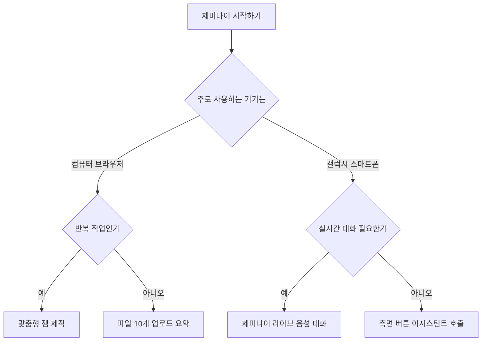

구글 제미나이 사용법의 핵심은 문서 분석과 기기 연동을 활용해 반복 작업을 줄이는 것입니다. 복잡한 명령어를 외울 필요 없이 웹 브라우저나 스마트폰에서 바로 쓰면 됩니다.

시중에는 제미나이 사용법 책이나 온라인 커뮤니티인 디시인사이드 게시글 등 다양한 정보가 흩어져 있습니다. 하지만 비공식 편법이나 지나치게 이론적인 내용이 섞여 있어 처음 접하는 분들은 무엇부터 시작해야 할지 헷갈리기 쉽습니다. 이 글은 검증된 공식 기능을 바탕으로 PDF 문서 요약, 갤럭시 스마트폰 연동, 나만의 비서 만들기, 유무료 요금제 선택 기준까지 한 번에 정리해 드립니다. 오늘 처음 AI 도구를 쓰는 분이라도 읽는 즉시 자신의 기기에서 활용할 수 있습니다.

## 문서 분석과 PDF 요약 기능 완벽하게 다루기

제미나이는 웹 환경에서 최대 10개의 파일을 한 번에 올려서 요약하고 질문할 수 있습니다.

컴퓨터나 노트북에서 웹 브라우저로 제미나이(gemini.google.com)에 접속하면 프롬프트(AI에게 작업을 지시하는 대화 입력창)가 나타납니다. 입력창 옆에 있는 파일 추가 단추를 누르면 내 컴퓨터에 저장된 일반 문서와 PDF 문서, 스프레드시트(표 계산 문서), 이미지를 곧바로 올릴 수 있습니다. 이뿐만 아니라 클라우드 저장소인 구글 드라이브에 있는 파일이나 개발용 저장소인 깃허브(GitHub) 저장소도 직접 불러올 수 있습니다. 한 번에 올릴 수 있는 파일 개수는 최대 10개입니다.

제미나이 사용법 pdf 분석을 가장 쉽게 시작하는 방법은 긴 보고서를 올린 뒤 원하는 항목만 짚어 물어보는 방식입니다. 예컨대 50쪽이 넘는 분기 실적 보고서를 올리고 주요 매출 변동 원인 세 가지만 뽑아 달라고 쓰면 필요한 내용만 정리해 줍니다. 분량이 방대한 참고 서적이나 매뉴얼을 다룰 때도 유용합니다. 제미나이 사용법 책 형태의 전자책이나 두꺼운 지침서 파일을 넣고 특정 챕터의 규격 기준을 묻는 질문을 입력하면 해당 문단을 직접 찾지 않아도 즉각 답을 얻을 수 있습니다.

구글 드라이브(Google Drive) 안에서도 제미나이를 바로 쓸 수 있습니다. 드라이브 파일 뷰어(미리보기 창)에서 PDF 문서를 열면 상단 도구 표시줄에 제미나이 아이콘이 보입니다. 이 아이콘을 누르면 화면 오른쪽에 별도의 사이드 패널(보조 안내창)이 나타납니다. 종이 문서를 사진으로 찍어 만든 스캔 문서, 활자 위주의 텍스트 문서, 복잡한 표가 포함된 PDF 파일 모두 이 패널에서 핵심 요약을 요청하거나 세부 질문을 던질 수 있습니다.

제미나이 앱 설정에서 구글 워크스페이스(Google Workspace, 구글의 사무용 소프트웨어 제품군) 확장 프로그램을 켜 두면 업무 흐름이 훨씬 빨라집니다. 지메일(Gmail)에 도착한 특정 프로젝트 이메일을 검색해 내용을 확인하고, 구글 독스(Google Docs) 문서를 불러와 요약문을 작성하는 일까지 하나의 대화창 안에서 처리할 수 있습니다.

## 삼성 갤럭시 스마트폰에서 제미나이 호출하고 대화하기

삼성 갤럭시 스마트폰에서는 측면 버튼을 누르거나 음성으로 제미나이를 즉시 불러낼 수 있습니다.

제미나이 사용법 갤럭시 적용은 기본 디지털 어시스턴트(스마트폰의 음성 명령을 도맡아 처리하는 비서 앱) 설정을 바꾸는 일부터 시작합니다. 스마트폰의 설정 메뉴로 들어간 뒤 기본 앱 항목을 누릅니다. 여기서 기본 디지털 어시스턴트 앱을 구글(Google) 또는 제미나이로 선택해 지정합니다. 이렇게 설정해 두면 전원 측면 버튼을 길게 누르는 동작만으로 화면 아래에서 제미나이가 실행됩니다. 스마트폰을 손에 쥐지 않은 상태에서도 '헤이 구글(Hey Google)'이라는 음성 명령어를 소리 내어 부르면 곧바로 제미나이가 켜집니다.

음성 대화 기능인 제미나이 라이브(Gemini Live)는 한국어를 공식 지원합니다. 스마트폰 기기 하나에서 최대 두 가지 언어를 함께 사용할 수 있도록 언어 환경을 맞출 수 있습니다. 지원하는 한국어 음성 종류는 모두 10가지로, 사용자가 듣기 편안한 목소리 톤을 골라 대화할 수 있습니다. 텍스트를 일일이 손으로 타이핑하지 않고 사람과 마주 앉아 이야기하듯 음성으로 끊김 없이 대화를 주고받는 방식입니다.

갤럭시 스마트폰에서는 화면 공유와 카메라 기능이 제미나이와 직접 맞물려 돌아갑니다. 제미나이 라이브를 켠 상태에서 측면 인공지능 버튼이나 화면 제어 기능을 사용하면 현재 스마트폰 카메라가 비추고 있는 현실 풍경이나 갤러리에 저장된 사진을 제미나이에게 보여줄 수 있습니다. 기계 장치의 부품 조립 상태를 카메라로 비추면서 어느 나사를 먼저 조여야 하는지 실시간 음성으로 묻거나, 외국어로 적힌 현장 안내판을 찍어 보여주며 핵심 주의사항을 음성으로 설명해 달라고 요청할 수 있습니다.

인터넷 커뮤니티나 제미나이 사용법 디시 게시판을 보면 스마트폰 비서 기능을 인위적으로 해제하거나 비공식 명령어로 개조하려는 글들이 보입니다. 그러나 이런 비공식 방식은 운영체제 안정성을 해치고 정상적인 보안 업데이트를 막을 수 있으므로 주의해야 합니다. 공식 설정 메뉴에서 제공하는 어시스턴트 지정 기능만으로도 화면 검색과 음성 호출을 포함한 모든 업무 기능을 안정적으로 사용할 수 있습니다.

## 나만의 맞춤형 비서 젬 만들기와 실무 자동화

젬(Gem) 기능을 활용하면 반복되는 지시문을 매번 입력하지 않고도 전용 업무 도구를 만들 수 있습니다.

제미나이 웹 환경 메뉴를 보면 'Gems 탐색하기' 항목이 있습니다. 젬은 사용자가 특정한 업무 목적에 맞추어 미리 역할과 규칙을 입력해 둔 맞춤형 인공지능 비서를 뜻합니다. 젬을 제작할 때는 네 가지 요소를 입력해야 합니다. 첫 번째는 페르소나(AI가 맡을 구체적인 역할)입니다. 예컨대 '경영 기획팀의 10년 차 문서 검토자'처럼 AI의 역할을 지정합니다. 두 번째는 작업(AI가 수행해야 할 과업)으로, 들어온 문장의 문맥을 다듬고 오탈자를 점검하는 행동 지침을 적습니다. 세 번째는 관련 정보(참고해야 할 문맥과 원칙)이며, 네 번째는 출력 형식으로 글머리 기호 사용 여부나 줄바꿈 방식을 정합니다.

이렇게 제작해 둔 젬은 제미나이 대화창 목록에 저장됩니다. 새로운 대화를 시작할 때마다 긴 프롬프트를 복사해 붙여넣을 필요가 없습니다. 저장된 젬을 클릭하고 분석할 자료나 초안만 던져 넣으면 미리 설정해 둔 규칙과 양식에 맞추어 결과물을 즉시 정리해 줍니다. 번역 업무를 자주 한다면 번역 톤을 고정해 둔 젬을 만들고, 보고서 작성이 잦다면 회사 서식에 맞춰 주는 젬을 만들어 활용하면 됩니다.

비공식 커뮤니티 게시판인 제미나이 사용법 디시 모음글에서는 필터를 풀거나 우회하는 복잡한 문장을 권하기도 합니다. 그러나 실제 업무 환경에서는 이런 자극적인 방식보다 명확한 페르소나와 작업 규칙을 갖춘 젬을 구성하는 것이 훨씬 높은 정확도를 보입니다. 기본 시스템이 정한 안전장치 안에서 출력 형식과 문맥 규칙을 정교하게 다듬는 것만으로도 원하는 보고서 품질을 충분히 얻을 수 있습니다.

다양한 작업 방식 중에서 사용자의 환경에 맞는 경로를 쉽게 선택할 수 있도록 아래 판단 흐름도를 준비했습니다. 어떤 작업 환경에서 어떤 방식을 골라야 하는지 스스로 점검해 보시기 바랍니다.

## 그래서 내 업무에는 뭐가 달라지나

무료 버전으로 시작하되 고급 모델과 대용량 저장 공간이 필요한 시점에 유료 요금제를 선택하면 됩니다.

제미나이 웹 서비스와 모바일 앱의 기본 기능은 비용을 내지 않고도 누구나 무료로 쓸 수 있습니다. 10개의 문서 파일 업로드, 구글 드라이브 파일 검색, 스마트폰 측면 버튼 음성 호출과 제미나이 라이브 대화는 무료 상태에서도 원활하게 동작합니다. 대부분의 직장인과 학생은 무료 버전만으로도 일상적인 문서 요약과 번역, 정보 검색 작업을 처리하는 데 무리가 없습니다.

유료 요금제인 '구글 원 인공지능 프리미엄(Google One AI Premium)'은 최상위 AI 모델인 제미나이 어드밴스드(Gemini Advanced)를 제공합니다. 또한 구글 드라이브와 지메일, 구글 포토에서 함께 쓸 수 있는 2TB(테라바이트)의 클라우드 저장 공간을 지원합니다. 이 요금제의 국내 이용 가격은 월 29,000원입니다. 신규 가입자에게는 1개월 무료 체험 혜택이 주어집니다. 고난도 코딩 작업이나 방대한 데이터를 심층적으로 다뤄야 하고, 대용량 클라우드 저장 공간이 동시에 필요한 사용자에게 적합합니다.

| 구분 | 무료 버전 | Google One AI Premium |
| :--- | :--- | :--- |
| 월 이용 요금 | 0원 | 29,000원 |
| 무료 체험 | 해당 없음 | 신규 가입 시 1개월 무료 체험 |
| 파일 첨부 한도 | 프롬프트당 최대 10개 | 프롬프트당 최대 10개 |
| 제공 AI 모델 | 기본 Gemini 모델 | 최상위 Gemini Advanced 모델 |
| 추가 클라우드 용량 | 기본 구글 계정 용량 | 2TB 클라우드 스토리지 포함 |
| 지원 기능 범위 | 제미나이 라이브, Gems 생성, 드라이브 연동 | 상위 모델 연산, 2TB 용량, 최신 고급 기능 |

오늘 당장 업무 효율을 높이려면 다음 세 가지 행동을 실천하시기 바랍니다.

첫째, 지금 스마트폰이 갤럭시라면 설정의 기본 앱 메뉴에서 제미나이를 기본 어시스턴트로 바꾸십시오. 측면 버튼을 누르거나 음성으로 부르는 즉시 업무 메모나 길 안내, 실시간 통역 대화를 시작할 수 있습니다.

둘째, 읽어야 할 보고서나 논문 PDF 파일이 쌓여 있다면 gemini.google.com에 접속해 파일 10개를 한꺼번에 올리십시오. 전체를 다 읽지 말고 결론과 수치만 먼저 요약해 달라고 요청해 독서 시간을 줄이십시오.

셋째, 매번 반복해서 쓰는 보고서 양식이 있다면 'Gems 탐색하기' 메뉴로 들어가 나만의 비서를 1개 만드십시오. 역할과 서식을 한 번만 적어 두면 앞으로의 작성 시간을 절반 이하로 줄일 수 있습니다. 월 29,000원 결제는 무료 체험을 먼저 써본 뒤 판단해도 늦지 않습니다.

<!-- internal-links:start -->
## 함께 읽으면 이해가 이어지는 글

- [젠스 파크 AI PPT 만들기 사용법과 회의록 변환 가이드]() — Genspark의 AI Slides 및 Text to PPT 기능은 대화형 입력이나 문서 업로드로 발표 자료를 자동 생성합니다. 내장 환경에서 코드를 실행해 정확한 차트를 그리며, PPTX와 Google Slides로 내보낼 수…
- [AI 사이트 100개 총정리 — 글쓰기, 검색, 디자인, 영상, 음악, 코딩, 업무 자동화]() — 유행순 목록이 아니라 지금 하려는 일에서 바로 고를 수 있도록 100개 AI 사이트의 용도, 추천 대상, 공식 링크를 짧은 카드로 정리한 북마크용 디렉터리입니다.
- [민감한 문서를 NotebookLM에 올리기 어렵다면? Open Notebook 점검표]() — Open Notebook의 문서 Q&A, 요약, 다중 화자 오디오 기능을 살펴보고 로컬 LLM을 써도 외부 전송이 남을 수 있는 지점과 설치 전 확인 사항을 정리합니다.
<!-- internal-links:end -->

## 자주 묻는 질문

### 제미나이에 PDF 문서를 한 번에 몇 개까지 올릴 수 있나요?

제미나이 웹 앱(gemini.google.com)에서는 한 번의 대화 입력에 로컬 컴퓨터 파일이나 구글 드라이브 문서를 최대 10개까지 첨부하여 요약과 분석을 요청할 수 있습니다.

### 갤럭시 스마트폰에서 제미나이를 측면 버튼으로 실행하려면 어떻게 하나요?

스마트폰 설정의 '기본 앱' 메뉴로 이동하여 기본 디지털 어시스턴트 앱을 Google 또는 Gemini로 지정하면 전원 측면 버튼을 길게 누르거나 'Hey Google' 음성 호출로 즉시 실행할 수 있습니다.

### 구글 원 AI 프리미엄 요금제의 가격과 혜택은 무엇인가요?

국내 기준 월 29,000원이며 상위 모델인 Gemini Advanced 이용 권한과 2TB의 구글 클라우드 저장 공간이 함께 제공됩니다. 신규 가입 시 1개월 무료 체험을 이용할 수 있습니다.

### 제미나이 라이브는 한국어 음성 대화를 지원하나요?

네, 제미나이 라이브는 한국어를 공식 지원합니다. 하나의 기기에서 최대 두 가지 언어를 함께 설정할 수 있으며 10가지의 한국어 음성 옵션을 제공합니다.

## 직접 확인한 원문

- [Gemini 앱 고객센터](https://support.google.com/gemini/answer/14903178?hl=ko&co=GENIE.Platform%3DDesktop) (2026-09-15 확인)
- [Samsung Support](https://www.samsung.com/us/support/answer/ANS10013120) (2026-09-15 확인)
- [삼성전자서비스](https://www.samsungsvc.co.kr/solution/3979187) (2026-09-15 확인)
- [Google Blog Korea](https://blog.google/intl/ko-kr/company-news/technology/gemini-live-speaks-kr) (2026-09-15 확인)
- [Gemini 앱 고객센터](https://support.google.com/gemini/answer/15235603?hl=ko) (2026-09-15 확인)
- [메가존소프트 Google Workspace 업데이트 소식](https://sbctech.net/workspace-update/google-%EB%93%9C%EB%9D%BC%EC%9D%B4%EB%B8%8C-%EC%97%85%EB%8D%B0%EC%9D%B4%ED%8A%B8-pdf-%EB%B3%B4%EA%B8%B0-%ED%99%98%EA%B2%BD%EC%97%90-gemini-%EC%A0%81%EC%9A%A9) (2026-09-15 확인)
- [All Things How](https://allthings.how/how-to-enable-and-use-gemini-extensions) (2026-09-15 확인)
- [구글 도구 활용 정보 가이드](https://google.mblue.co.kr/entry/%EC%A0%9C%EB%AF%B8%EB%82%98%EC%9D%B4Gemini-%EB%AC%B4%EB%A3%8C-%EC%B2%B4%ED%97%98-%EA%B0%80%EC%9E%85-Google-One-AI-Premium-Plan) (2026-09-15 확인)

위 수치는 확인 시점 기준이며 예고 없이 바뀔 수 있습니다. 결정 전에 공식 페이지를 한 번 더 확인하시기 바랍니다.
