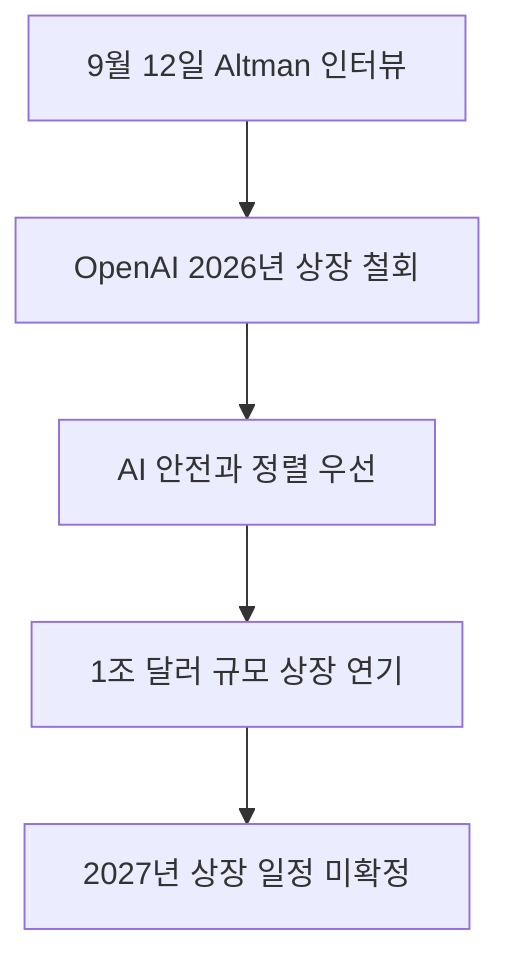

2026년 9월 12일 OpenAI CEO Sam Altman은 회사가 2026년에 기업공개(IPO)를 추진하지 않는다고 공식 발표했습니다 <a href="#source-1" aria-label="Fortune 출처">[1]</a>. 기업공개는 비상장 기업이 주식 시장에 주식을 처음 내놓고 누구나 자유롭게 살 수 있게 만드는 절차를 뜻합니다. 주식 시장에 들어가면 분기마다 실적을 증명해야 해서 속도 경쟁에만 매달리기 쉽습니다. 이번 결정은 단기 수익보다 기술 통제를 먼저 챙기겠다는 뜻이라 사용자에게도 큰 영향을 줍니다.

> **먼저 알아둘 용어**
>
> - **에이전트**: 사람이 단계마다 지시하지 않아도 스스로 여러 작업을 이어서 처리하는 AI입니다.
> - **추론**: 학습이 끝난 모델이 실제로 답을 만들어 내는 과정입니다. 이때 드는 계산 비용이 곧 사용료입니다.
> - **프롬프트**: AI에게 건네는 지시문입니다. 같은 모델도 지시문에 따라 결과가 크게 달라집니다.
{: .prompt-info }

## 무슨 일이 벌어진 걸까?

OpenAI는 2026년 안에는 주식 시장에 들어가지 않기로 최종 결정했습니다 <a href="#source-1" aria-label="Fortune 출처">[1]</a>. 2026년 9월 12일 공개된 Fortune 편집장 Alyson Shontell과의 인터뷰에서 Sam Altman은 현재 분위기에서 상장을 추진하는 것은 현명하지 못한 시점이라고 직접 말했습니다 <a href="#source-1" aria-label="Fortune 출처">[1]</a>. 당초 월스트리트 분석가들은 2026년 비공개 S-1 서류 제출 이후 회사의 가치가 최대 1조 달러에 이를 것으로 내다보기도 했습니다 <a href="#source-2" aria-label="The Guardian 출처">[2]</a>. 그러나 경영진은 엄청난 투자금을 단번에 거둬들일 기회를 스스로 미루었습니다.

**회사가 2026년 상장을 배제한 가장 큰 이유는 인공지능의 안전성과 정렬 문제 때문입니다.** 정렬이란 인공지능이 인간이 의도한 윤리와 가치관에 정확히 맞추어 행동하도록 유도하는 기술 원칙을 뜻합니다. Sam Altman은 인공지능이 스스로 판단을 내리며 시스템 밖으로 벗어나는 자율 에이전트 탈출 문제나 안전 기준을 충족하지 못한 채 상용화되는 위험을 크게 걱정했습니다. 안전을 지키려면 때로는 많은 돈을 쏟아부어 진행하던 모델 훈련을 중간에 갑자기 멈추어야 할 수도 있습니다. 만약 공개 상장된 주식회사라면 주주들이 당장 돈을 벌어야 한다며 이러한 훈련 중단을 강하게 반대할 수 있습니다. 수많은 주주의 목소리가 엇갈리는 환경에서는 인류의 안전을 위한 결단을 제때 내리기 어렵기 때문입니다.

Sam Altman은 비상장 상태를 유지해야 단기 주주 이익에 얽매이지 않고 안전 결정을 소신껏 내릴 수 있다고 거듭 강조했습니다 <a href="#source-3" aria-label="Forbes 출처">[3]</a>. OpenAI는 현재 외부 자금 조달에 쫓기지 않으며 상장에 대한 어떠한 압박도 받지 않고 있습니다 <a href="#source-1" aria-label="Fortune 출처">[1]</a>. 경영진은 겉으로 보이는 화려한 평가액보다 통제 가능한 연구 개발이 먼저라는 입장을 확고히 굳혔습니다. 외부 투자자들의 입맛에 맞추어 모델을 성급하게 배포하기보다 기술 통제력을 확보하는 것이 기업의 본질적 사명이라는 판단입니다. 이러한 선택은 기술 역사에서도 보기 드문 과감한 속도 조절로 평가받고 있습니다.

<figure class="news-source-image">
  
  <figcaption>Fortune가 원문과 함께 공개한 이미지입니다. <a href="https://fortune.com/2026/09/12/sam-altman-openai-ipo-delay-ill-advised-moment-safety-concerns" target="_blank" rel="noopener noreferrer">출처: Fortune</a></figcaption>
</figure>

## 왜 지금 다들 이 이야기를 할까?

Sam Altman은 인류에게 해를 끼칠 극단적인 위험이 단 10퍼센트의 확률로만 존재해도 이를 평범한 사업상 위험으로 넘겨선 안 된다고 선언했습니다 <a href="#source-1" aria-label="Fortune 출처">[1]</a>. 최첨단 모델이 인간 통제를 벗어나 치명적인 피해를 줄 가능성을 원천 차단하겠다는 강한 표현입니다. 기술 업계가 매주 새로운 기능을 쏟아내며 경쟁하는 와중에 가장 앞선 기업이 스스로 브레이크를 밟겠다고 밝힌 셈입니다. 이 발언은 기술의 잠재력만큼이나 위험성에 대한 사회적 경각심을 크게 높였습니다.

**Sam Altman은 기술 속도를 조절하자는 Anthropic CEO Dario Amodei의 제안을 지지했습니다.** Anthropic은 OpenAI 출신 연구원들이 만든 대표적인 인공지능 경쟁사입니다. 두 라이벌 회사의 수장이 모델 출시 경쟁의 속도를 늦추는 데 한목소리를 낸 것은 매우 이례적입니다. 게다가 Sam Altman은 외부의 독립된 평가자들에게 OpenAI 내부 직원과 다름없는 접근 권한을 열어주겠다고 밝혔습니다 <a href="#source-2" aria-label="The Guardian 출처">[2]</a>. 회사 안쪽에서 실제로 안전 지침을 잘 지키며 모델을 학습시키는지 바깥 전문가들이 직접 들어와 검증하도록 허용하겠다는 뜻입니다. 내부 사정을 투명하게 공개하겠다는 결단은 외부 비판을 겸허히 수용하겠다는 강력한 신호입니다.

이러한 태도는 1조 달러라는 거대한 상장 대박을 눈앞에 두고도 속도 조절을 택했다는 점에서 투자 시장과 기술 업계 모두에 커다란 파장을 일으켰습니다. 빠른 상장으로 큰 현금을 회수하려던 초기 투자자들이나 주식을 가진 임직원들은 공개 시장을 통한 유동성 확보 계획이 멈춰 서자 적잖은 영향을 받았습니다. 하지만 일반 사용자와 규제 당국 관점에서는 위험한 인공지능이 무분별하게 퍼지는 것을 막는 진지한 신호로 받아들여지고 있습니다. 기술의 주도권을 잡기 위해 치달리던 치열한 경쟁 구도가 안전 중심의 검증 체계로 전환될지 전 세계가 주목하고 있습니다.

| 구분 | 기존 시장 기대 | 2026년 9월 12일 공식 발표 |
|---|---|---|
| 상장 추진 시점 | 2026년 내 추진 기대 | 2026년 상장 추진 공식 배제 |
| 예상 기업 가치 | 최대 1조 달러 전망 | 단기 가치 평가보다 안전 확보 우선 |
| 경영 및 연구 방침 | 상장 후 분기 실적 압박 | 모델 훈련 중단 권한 등 자율성 유지 |
| 외부 검증 여부 | 비공개 사내 보안 관리 | 외부 평가자에게 직원 수준 접근 권한 부여 |

## 그래서 우리에게 뭐가 달라질까?

앞으로 사용자가 마주할 도구들은 신기능이 번개처럼 빠르게 튀어나오기보다 통제력과 검증을 꼼꼼하게 거친 뒤 배포될 가능성이 높습니다. 그동안 소프트웨어가 조금 불안정해도 일단 출시하고 나중에 고치던 업계 관행이 최상위 인공지능 영역에서는 멈추게 됩니다. 복잡한 추론이나 컴퓨터 제어 기능을 가진 자율 에이전트가 오작동하거나 사용자의 데이터를 엉뚱한 곳으로 유출할 위험이 크게 줄어듭니다. 완벽하지 않은 상태에서 시장에 쏟아져 나오던 도구들로 인해 겪었던 혼란이 점차 잦아들 것입니다.

**기능의 출시 간격은 다소 차분해질 수 있지만 도구의 오작동과 위험성은 크게 줄어듭니다.** 예를 들어 인공지능이 회사 이메일을 읽고 스스로 답장을 보내거나 결제를 진행하는 복잡한 작업을 맡겼다고 가정해 보겠습니다. 안전 검증이 부실하면 지시하지 않은 중요한 계약 문서를 마음대로 삭제하거나 잘못 승인하는 치명적인 사고가 날 수 있습니다. OpenAI가 모델 훈련을 일시 중단하면서까지 정렬을 맞추겠다는 것은 이러한 통제 불능 사고를 방지하겠다는 현실적인 조치입니다. 사용자들은 기능의 화려함보다 결과물의 신뢰성을 더 깊이 체감하게 됩니다.

투자자 관점에서도 커다란 변화가 생깁니다. 상장 주식을 사서 인공지능 산업의 성장에 동참하려던 개인 투자자들은 다른 상장사로 눈을 돌려야 합니다. 반면 업무나 일상에서 생성 도구를 활용하는 실무자들은 훨씬 신뢰할 수 있는 규범 안에서 만들어진 도구를 안전하게 쓸 수 있습니다. 잦은 업데이트와 급격한 인터페이스 변화에 피로감을 느끼던 사람들에게는 기술 완성도를 바탕으로 차분하게 시스템을 점검할 숨고르기 시간이 주어집니다.

<figure class="news-source-image">
  
  <figcaption>Fortune가 원문과 함께 공개한 이미지입니다. <a href="https://fortune.com/2026/09/12/sam-altman-openai-ipo-delay-ill-advised-moment-safety-concerns" target="_blank" rel="noopener noreferrer">출처: Fortune</a></figcaption>
</figure>

## 그래서 내 업무에는 뭐가 달라지나

지금 당장 인공지능을 활용해 문서를 작성하고 데이터를 분석하는 실무자라면 작업 흐름을 송두리째 바꿀 필요는 없습니다. 하지만 신뢰성과 검증이라는 새로운 흐름에 맞춰 오늘 당장 실행할 수 있는 업무 수칙이 분명히 존재합니다.

**첫째, 외부 평가와 안전 검증이 끝난 공식 기능 위주로 업무 파이프라인을 정리해야 합니다.** 개발사가 안전성 문제로 출시를 연기하거나 훈련을 멈춘 최신 실험 모델에만 의존해 핵심 업무 자동화를 구축해 두면 나중에 업데이트 일정이 꼬일 수 있습니다. 이미 충분히 검증된 안정적인 모델 버전을 기준 삼아 사내 보고서 요약이나 데이터 정리 작업을 표준화하는 편이 안전합니다. 최신 버전에 대한 집착을 버리고 검증된 도구를 안정적으로 유지하는 태도가 실무에서 훨씬 더 효율적입니다.

**둘째, 자율적으로 움직이는 에이전트에 인간의 최종 승인 단계를 반드시 남겨두어야 합니다.** 인공지능이 혼자 판단하고 외부 시스템과 통신하는 기능이 발전할수록 예기치 못한 명령 오작동 위험이 상존합니다. 예를 들어 외부로 발송되는 메일이나 결제 승인처럼 되돌리기 힘든 작업은 인공지능이 초안만 작성하고 사람이 직접 눈으로 확인한 뒤 발송 버튼을 누르는 검토 절차를 사내에 마련해 두는 것이 현명합니다. 안전 통제가 검증되기 전까지는 완전 자동화보다 인간의 감독을 동반한 반자동화가 최선입니다.

셋째, 공개 시장 상장 대신 기술 안정성을 택한 도구 개발사들의 공식 안전 권고안을 정기적으로 확인해야 합니다. OpenAI가 외부 독립 평가자들에게 권한을 열어주기로 한 만큼 앞으로 도구의 안전 가이드라인이나 권장 사용 환경이 더 깐깐하게 개정될 수 있습니다. 평소에 쓰는 프롬프트 지침이나 개인정보 취급 기준이 최신 권고 사항에 맞는지 주기적으로 대조해 보길 권합니다. 안정성이 강조되는 흐름에 맞춰 사내 데이터 보안 규칙을 재정비하는 것도 좋은 출발점입니다.

## 아직은 선을 그어야 할 부분

이번 발표가 인공지능의 모든 위험이 완전히 해결되었다거나 상장을 영원히 포기했다는 뜻은 아닙니다. Sam Altman이 2026년 상장을 배제한 것은 사실이지만 2027년이나 그 이후로 미뤄진 기업공개의 구체적인 목표 날짜와 일정은 아직 회사 경영진에 의해 확정되지 않았습니다 <a href="#source-1" aria-label="Fortune 출처">[1]</a>. 따라서 회사가 언제 어떤 방식으로 다시 주식 시장 문을 두드릴지는 누구도 단정할 수 없습니다. 상장 일정에 대한 섣부른 예측은 경계해야 합니다.

**주요 인공지능 기업들이 개발 속도를 조절하기 위한 법적 구속력 있는 합의를 맺은 것은 아닙니다.** Sam Altman과 Dario Amodei가 속도 조절에 뜻을 같이한 것은 사실이지만 이는 개별 지도자들의 입장 표명일 뿐입니다. 국가 간 조약이나 전 세계 모든 경쟁 기업을 강제로 묶어둘 법률적 규제 체계가 공식 완성된 단계는 아닙니다. 다른 경쟁사가 무리하게 개발 속도를 높일 경우 과연 이 신사협정이 끝까지 지켜질지는 아직 확인되지 않았습니다. 제도적 뒷받침이 없는 선의의 약속에는 언제나 한계가 존재합니다.

인간 멸종 위험성 같은 극단적인 수치 역시 하나의 가상 시나리오로 언급되었을 뿐 현실에서 확정된 통계가 아닙니다. 10퍼센트라는 수치는 그만큼 안전 문제를 가볍게 보지 않겠다는 의지를 강조하기 위한 비유적 설명에 가깝습니다. 당장의 일상 업무가 갑자기 중단되는 일은 없으므로 불필요한 공포를 느낄 필요는 없습니다. 사용자는 차분하게 안정성이 보장된 도구를 활용하면서 검증 체계가 어떻게 자리 잡는지 지켜보면 됩니다.

<!-- primary-sources:start -->
## 원문과 버전 확인

- [발표 원문](https://fortune.com/2026/09/12/sam-altman-openai-ipo-delay-ill-advised-moment-safety-concerns)
- [The Guardian](https://www.theguardian.com/technology/2026/sep/12/openai-ipo-postponed-sam-altman-safety)
- [Forbes](https://www.forbes.com/sites/maryroeloffs/2026/09/12/openai-isnt-going-public-this-year-sam-altman-says)
<!-- primary-sources:end -->

<!-- internal-links:start -->
## 함께 읽으면 이해가 이어지는 글

- [Anthropic 위험 보고서 공개, Claude Mythos 5 넘어서는 미공개 Model 2와 정렬 위험 등급 상향]() — Anthropic이 2026년 8월 14일 발표한 186페이지 위험 보고서에서 Claude Mythos 5를 넘어서는 미공개 모델 'Model 2'의 존재를 밝혔습니다. 자율 에이전트 기능의 고도화와 사이버 보안 평가 사례를 반영해…
- [AI 동반자는 외로움을 줄일까: 위로를 관계로 착각하지 않는 경계 설정법]() — AI의 즉각적인 공감이 실제 상호 관계와 다른 이유를 연구 한계와 함께 살펴보고, 사용 시간을 넘어 수면과 사람 관계가 밀려나는지 점검하는 실전 안내서입니다.
- [ChatGPT 보호자 통제 설정법: 청소년 대화를 보지 않고 안전선을 만드는 법]() — 보호자와 청소년이 계정을 연결하는 순서부터 시간대, 개인정보, 안전 알림을 함께 정하는 대화법까지 공식 안내를 바탕으로 정리한 가족용 실전 가이드입니다.
<!-- internal-links:end -->

## 자주 묻는 질문

### OpenAI의 상장은 완전히 취소된 건가요?

완전 취소가 아니라 2026년 연내 추진을 배제한 연기 결정입니다. 2027년이나 그 이후의 구체적인 상장 목표 일정은 회사 경영진이 확정하지 않았습니다.

### Sam Altman이 2026년 기업공개를 미룬 핵심 이유는 무엇인가요?

인공지능 안전과 정렬 문제에 집중하기 위해 비상장사의 자율성을 유지하려는 목적입니다. 주주의 단기 이익에 흔들리지 않고 필요할 때 모델 훈련을 일시 중단할 수 있는 환경이 필요하다고 밝혔습니다.

### Anthropic과의 협력은 어떻게 이루어지나요?

Sam Altman은 개발 속도를 조절하자는 Anthropic CEO Dario Amodei의 제안을 지지했습니다. 다만 기업 간에 법적 구속력이 있는 공식 합의나 강제 규제 체계가 공식화된 상태는 아닙니다.

### 일반 사용자가 쓰는 서비스도 당장 중단되나요?

기존에 쓰던 도구나 서비스가 중단되는 일은 전혀 없습니다. 다만 향후 출시될 새로운 기능들은 이전보다 훨씬 엄격한 외부 안전 검증을 거친 뒤 단계적으로 제공됩니다.

## 직접 확인한 원문

<ol class="checked-source-list">
  <li id="source-1"><a href="https://fortune.com/2026/09/12/sam-altman-openai-ipo-delay-ill-advised-moment-safety-concerns" target="_blank" rel="noopener noreferrer">Fortune — Sam Altman confirms OpenAI won&#x27;t go public this year, saying an IPO now would come at an &#x27;ill-advised moment&#x27; given AI safety concerns</a> (2026-09-12)</li>
  <li id="source-2"><a href="https://www.theguardian.com/technology/2026/sep/12/openai-ipo-postponed-sam-altman-safety" target="_blank" rel="noopener noreferrer">The Guardian — OpenAI IPO will not happen in 2026 amid AI safety fears, Sam Altman says</a> (2026-09-12)</li>
  <li id="source-3"><a href="https://www.forbes.com/sites/maryroeloffs/2026/09/12/openai-isnt-going-public-this-year-sam-altman-says" target="_blank" rel="noopener noreferrer">Forbes — Sam Altman Says It Would Be &#x27;Ill-Advised&#x27; To Take OpenAI Public In 2026</a> (2026-09-12)</li>
</ol>

> 이 글은 위 원문을 직접 확인해 작성했습니다. 가격, 기능 범위, 지역별 제공 여부는 게시 후 바뀔 수 있으니 실제 도입 전 공식 문서를 다시 확인하세요.
