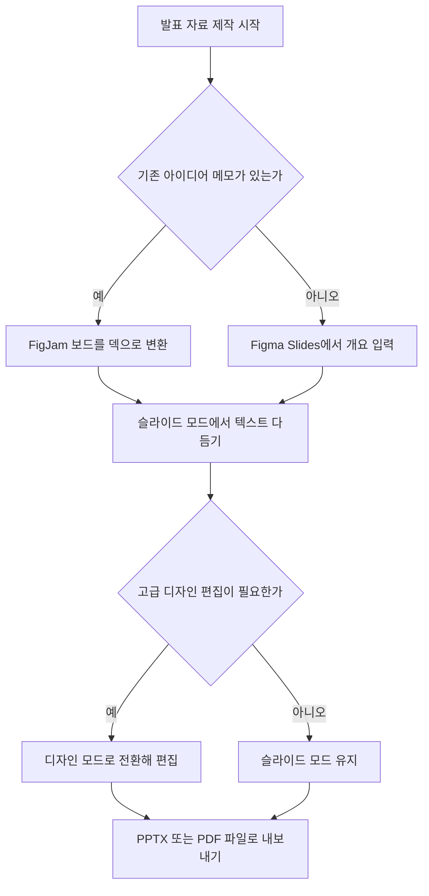

피그마 AI로 PPT를 만들려면 Figma Slides에서 개요를 입력하거나 FigJam 메모를 불러와 초안을 생성한 뒤 PPTX 파일로 내보내면 됩니다.

발표 자료를 만들 때마다 빈 화면 앞에서 구성을 고민하거나 디자인 툴이 낯설어 시작을 주저하는 분들이 많습니다. 이 글은 피그 마 ai ppt 만들기 기능의 구체적인 작동 방식부터 파워포인트 내보내기, 피그 마 ai 무료 사용 범위와 요금제 차이, 피그 마 ai 상세페이지 만들기 활용법까지 한 번에 정리해 드립니다.



> **먼저 알아둘 용어**
>
> - **에이전트**: 사람이 단계마다 지시하지 않아도 스스로 여러 작업을 이어서 처리하는 AI입니다.
> - **프롬프트**: AI에게 건네는 지시문입니다. 같은 모델도 지시문에 따라 결과가 크게 달라집니다.
{: .prompt-info }

## 피그마 슬라이드로 AI PPT를 만들고 내보내는 전체 과정

Figma Slides는 비디자이너도 손쉽게 템플릿과 콘텐츠를 다룰 수 있는 간소화된 슬라이드 모드(Slides mode)와 전문 디자이너를 위한 디자인 모드(Design mode)를 동시에 지원합니다. 두 가지 작업 환경을 제공하므로 프레젠테이션 제작 경험이 없는 사용자도 복잡한 디자인 규칙을 배우지 않고 바로 문서를 작성할 수 있습니다. 본격적인 제작을 시작하려면 홈 화면에서 새 슬라이드 파일을 생성하거나 기존에 회의 내용을 정리해 둔 픽잼(FigJam, 피그마의 화이트보드 협업 도구) 보드를 활용합니다.

아이디어가 이미 메모 형태로 픽잼에 모여 있다면 Turn FigJam board into deck 기능을 실행합니다. 피그마 AI가 보드 안의 스티커 메모와 브레인스토밍 내용을 스스로 읽고 분류하여 슬라이드 덱 초안을 자동으로 구성해 줍니다. 백지 상태에서 새로 시작하는 경우에는 피그마 슬라이스 안에서 Make Slides with an outline 메뉴를 선택하고 주제나 다루고 싶은 항목을 텍스트로 적으면 됩니다. 그러면 목차와 본문 배치가 포함된 프레젠테이션 뼈대가 몇 초 만에 화면에 나타납니다.

초안이 만들어진 뒤에는 슬라이드 모드에서 AI 도구를 활용해 세부 문장을 다듬습니다. 글의 어조를 정중하게 바꾸거나 핵심만 남기고 요약할 수 있으며, 다국어 번역도 클릭 한 번으로 처리할 수 있습니다. 발표 준비 시간을 줄여주는 발표자 노트 초안 작성(Draft presenter notes) 기능을 쓰면 각 장표에 맞는 발표 대본도 생성됩니다. 슬라이드에 들어갈 시각 자료 역시 내장된 생성 기능을 쓰거나 기존 사진의 배경 제거(Remove background), 저해상도 이미지 화질 개선(Boost resolution) 기능을 통해 외부 편집 프로그램 없이 바로 보정할 수 있습니다.

발표 자료의 완성도를 더 높이고 싶다면 상단 메뉴에서 디자인 모드로 전환합니다. 디자인 모드는 피그마의 풀 시트(Full seat, 유료 전문 편집 권한) 사용자에게 제공되며, 요소 간격을 일정하게 유지해 주는 오토 레이아웃(Auto layout)과 세밀한 레이어 조작 기능을 쓸 수 있습니다. 또한 Figma Design에서 미리 만들어 둔 인터랙티브 프로토타입(클릭하면 화면이 넘어가는 시제품 모델)을 슬라이드 안에 그대로 삽입할 수 있습니다. 청중과 실시간으로 소통할 수 있는 라이브 투표(Polls)와 정렬 척도(Alignment scales) 기능도 프레젠테이션 안에 바로 넣을 수 있습니다.

작업이 끝난 자료를 다른 사람에게 공유하거나 발표 현장용 파일로 보관하려면 공식 변환 기능을 씁니다. 화면 좌측 상단 Main menu에서 File 항목으로 들어간 뒤 Export slides to 메뉴를 선택하면 Microsoft PowerPoint 규격인 PPTX 파일이나 PDF 문서로 즉시 저장할 수 있습니다. 피그마 화면 안에서 발표할 수도 있고 익숙한 파워포인트 파일로 바꿔 보낼 수도 있어 사내 보고나 외부 미팅 모두 유연하게 대응할 수 있습니다. 다만 피그마 전용 인터랙티브 위젯인 실시간 투표나 프로토타입 동작이 파워포인트 안에서도 그대로 작동하는지는 공식 문서에 명시되어 있지 않으므로, 일반 정적 슬라이드 형태로 변환된다고 전제하고 검토하는 것이 안전합니다.

| 기능 분류 | 주요 제공 도구 | 실무 활용 목적 |
| :--- | :--- | :--- |
| 초안 생성 | Turn FigJam board into deck, Make Slides with an outline | 메모 및 개요를 구조화된 장표로 자동 변환 |
| 텍스트 편집 | 어조 변경, 번역, 텍스트 요약, 발표자 노트 작성 | 문체 통일과 발표 대본 작성 시간 단축 |
| 이미지 보정 | AI 이미지 생성, 배경 제거, 해상도 개선 | 외부 디자인 도구 없는 빠른 시각 자료 편집 |
| 최종 파일 출력 | PPTX 내보내기, PDF 내보내기 | 파워포인트 전달 및 범용 문서 저장 |

## 피그 마 ai 무료 범위와 요금제별 크레딧 한도

무료 플랜인 Starter 플랜에서는 피그 마 ai 무료 사용 범위에 일부 제한이 따르므로 작업 전에 확인해야 합니다. Starter 플랜은 단일 팀 폴더 안에서 Figma Design 파일 3개, FigJam 파일 3개, Figma Slides 파일 3개까지 생성할 수 있으며 개인 작업 공간인 드래프트(Drafts)는 개수 제한 없이 만들 수 있습니다. 그러나 조직 전체가 공유하는 팀 라이브러리 연동이나 AI 이미지 도구, 커스텀 템플릿 게시와 같은 고급 기능은 무료 플랜에서 비활성화되어 제공되지 않습니다.

```chartjs
{
  "type": "bar",
  "data": {
    "labels": ["Starter 플랜", "Professional 플랜 연간 결제", "Professional 플랜 월별 결제"],
    "datasets": [{"label": "월 요금 (USD)", "data": [0, 16, 20], "backgroundColor": ["#9aa5a1", "#2f9e8f", "#1d6f63"]}]
  },
  "options": {
    "responsive": true,
    "plugins": {
      "legend": {"display": true}
    },
    "scales": {
      "y": {"beginAtZero": true}
    }
  }
}
```

Figma Design에서 새롭게 선보인 AI 에이전트(Figma agent)는 현재 베타 기간으로 운영되고 있습니다. 이 에이전트 도구는 베타 기간 동안 무료로 이용할 수 있어서 명령어를 입력하거나 레이아웃을 편집할 때 AI 크레딧이 차감되지 않습니다. 다만 이 무료 혜택은 정식 출시(GA, General Availability) 전까지만 유지되며, 정식 서비스로 전환된 이후에는 작업량에 따라 표준 크레딧이 차감되도록 정책이 변경될 예정입니다.

AI를 일상적인 업무에 지속해서 사용하려면 유료 요금제 구조를 알아두어야 합니다. Figma는 2026년 3월에 유료 AI 크레딧 구매 제도를 처음 도입했습니다. 이후 사용자들의 사용량을 지원하기 위해 2026년 8월 25일부터 기존 구독료를 인상하지 않은 상태에서 AI 크레딧 기본 제공량을 크게 늘렸습니다. Professional 요금제는 기존 대비 2배의 AI 크레딧을 받게 되었고, 상위 요금제인 Organization 및 Enterprise 요금제는 1.6배 더 많은 크레딧을 매달 기본으로 공급받습니다.

개인 실무자나 소규모 팀이 선택하는 유료 플랜은 Figma Professional 요금제입니다. 이 요금제는 풀 시트(Full seat) 1개 기준으로 연간 일시불 청구 시 월 16달러이며, 매월 정기 결제 방식을 선택하면 월 20달러 선이 청구됩니다. Professional 플랜의 풀 시트 계정 하나를 결제하면 슬라이드 도구뿐만 아니라 디자인 전문 도구인 Figma Design, 코딩을 돕는 개발자 모드(Dev Mode), 브레인스토밍 화이트보드인 FigJam까지 피그마 전체 작업 환경을 추가 요금 없이 이용할 수 있습니다.

따라서 단순 텍스트 요약이나 기본 3개 이내의 슬라이드 문서를 시험 삼아 제작하려는 목적이라면 Starter 무료 플랜으로도 충분히 기능을 맛볼 수 있습니다. 반면 AI를 이용한 이미지 고해상도 변환이나 배경 제거, 복잡한 디자인 모드 결합, 월간 다량의 슬라이드 제작이 필요한 환경이라면 Professional 요금제로 전환하여 매달 2배로 확장된 크레딧을 활용하는 것이 중단 없는 작업 흐름을 유지하는 현실적인 선택입니다.

## 그래서 내 업무에는 뭐가 달라지나

문서 작성 도구와 프레젠테이션 디자인 환경이 하나로 합쳐지면서 기획안을 만든 뒤 파워포인트로 다시 옮겨 그리던 비효율이 사라집니다. 피그마 AI를 도입하면 기획자가 아이디어를 정리하는 즉시 슬라이드 장표가 생성되므로 보고서 작성 단계가 절반 가까이 줄어듭니다. 내 업무 환경에 맞춰 오늘부터 적용할 수 있는 구체적인 실행 지침 세 가지를 제시합니다.


첫째, 사내 주간 보고나 회의 결과 정리를 자주 맡는다면 픽잼 보드에서 메모를 먼저 작성한 뒤 Figma Slides 변환 버튼을 누르십시오. 흩어진 메모를 일일이 복사해서 파워포인트 텍스트 상자에 붙여넣던 단순 반복 작업을 완전히 건너뛸 수 있습니다. 생성된 초안에서 어조 변경 기능을 사용해 '격식 있는 보고서 어조'로 문장을 한 번에 정돈하고, 발표자 노트 생성 기능을 통해 보고 시 설명할 멘트까지 함께 확보하십시오.

둘째, 거래처나 상사에게 반드시 파워포인트 형식으로 파일을 전달해야 하는 상황이라면 피그마 화면 안에서 디자인을 모두 마친 뒤 마지막 단계에서 Export slides to PPTX를 실행하십시오. 처음부터 파워포인트의 좁은 서식 안에서 씨름할 필요 없이, 피그마 슬라이드의 정돈된 템플릿과 배경 제거 도구로 깔끔한 시각 장표를 빠르게 만든 다음 규격 파일로 내려받아 제출하면 마감 시간을 크게 아낄 수 있습니다.

셋째, 비용 지출 없이 기능을 먼저 테스트해 보려면 무료 Starter 플랜에서 슬라이드 파일을 열고 텍스트 기반 AI 초안 작성부터 체험하십시오. 무료 계정에서도 3개 파일까지 슬라이드 제작이 가능하며 베타 기간 중인 피그마 에이전트는 크레딧 차감 없이 쓸 수 있습니다. 작업을 진행해 본 뒤 고화질 이미지 보정이나 팀 공유 라이브러리가 업무에 필수적이라고 판단되는 시점에 연간 결제 기준 월 16달러의 Professional 플랜 전환을 검토하십시오.

## 피그 마 ai 상세페이지 만들기와 레이아웃 기획 한계

Figma AI의 First Draft 기능을 사용하면 텍스트 명령어 입력만으로 웹사이트나 모바일 화면의 기본 UI 레이아웃과 편집 가능한 와이어프레임(화면의 뼈대와 배치 계획)을 몇 분 만에 생성할 수 있습니다. 신규 제품 소개 페이지나 홍보용 웹페이지를 빠르게 설계해야 하는 마케터와 기획자에게 초기 구상 시간을 크게 줄여주는 유용한 도구입니다. 프롬프트 창에 제작하려는 화면의 목적과 들어갈 핵심 정보, 타깃 고객을 문장으로 입력하면 AI가 적절한 영역을 나누고 버튼과 텍스트 상자를 채워 화면 전체 구조를 제안합니다.

First Draft가 완성도 높은 초안을 만들어내는 이유는 피그마가 사전에 정교하게 구축해 둔 컴포넌트 스택(미리 만들어진 디자인 부품 묶음) 라이브러리를 바탕으로 화면을 조립하기 때문입니다. 이러한 작동 원리 덕분에 체크아웃 결제 화면, 회원가입 양식, 마케팅 웹사이트의 히어로 섹션(페이지 최상단의 핵심 소개 영역)처럼 보편적인 웹과 모바일 UI 디자인 패턴이 적용되는 페이지에서 가장 깔끔하고 일관성 있는 결과물을 만들어냅니다.

그러나 상세페이지 제작 실무에 First Draft를 바로 적용할 때는 명확한 한계와 제약 사항을 인지해야 합니다. 사용자가 직접 구축한 커스텀 디자인 시스템(기업 고유의 색상, 폰트 규격, 전용 부품 세트) 라이브러리를 First Draft나 Figma agent에 직접 연동하여 상세페이지를 생성하는 기능은 아직 정식으로 지원되지 않으며 공식 출시일 역시 확정되지 않았습니다. 즉, 우리 회사 브랜드 고유의 부품이나 특정 서식을 AI가 알아서 불러와 조립해 주지는 못한다는 뜻입니다.

또한 국내 이커머스 상세페이지처럼 세로로 길게 이어지는 이미지 중심의 그래픽이나 화려한 타이포그래피 합성은 UI 와이어프레임 중심의 First Draft 도구로 한 번에 찍어내기 어렵습니다. 한국어 프롬프트를 입력했을 때 생성되는 세부 레이아웃의 정밀도나 텍스트 렌더링 품질이 영문 기준과 비교해 얼마나 수치적 차이가 나는지는 피그마 본사의 정량 데이터로 공개되지 않았습니다. 따라서 실무에서는 한국어 상세페이지의 최종 완성본을 기대하기보다, 텍스트 배치와 정보 전달 순서를 정리하는 와이어프레임 기획 단계의 보조 수단으로 First Draft를 쓰는 것이 가장 효과적입니다.

이러한 특성을 감안하면 피그마 AI로 상세페이지를 기획할 때는 전체 화면을 한 번에 끝내려 하지 말고 단계별로 접근해야 합니다. 먼저 First Draft를 통해 상품 소개, 특장점 나열, 고객 리뷰 영역과 같은 기본 정보 블록의 위계를 잡습니다. 그런 다음 생성된 레이아웃을 디자인 모드로 가져와 실제 상품 사진과 한국어 카피를 넣고, 오토 레이아웃을 적용해 모바일과 데스크톱 규격에 맞게 너비를 맞추는 방식으로 작업하는 것이 현실적인 정공법입니다.

<!-- internal-links:start -->
## 함께 읽으면 이해가 이어지는 글

- [챗GPT 유료 무료 차이와 플랜별 가격 비교 가이드]() — 챗GPT 무료 플랜은 단순 대화가 무제한이지만 파일 분석과 이미지 생성 등 부가 도구에 엄격한 제한이 있습니다. 본 가이드는 Go(8달러), Plus(20달러), Pro(200달러), Business 플랜의 핵심 사양과 가격 차이를…
- [GPT-4o 이미지 생성, 실무에 바로 써도 될까? 한글, 작은 글자, 부분 편집 한계]() — GPT-4o 네이티브 이미지 생성의 텍스트 표현, 다중 객체, 대화형 수정 장점과 잘림, 비라틴 문자, 작은 글자, 의도하지 않은 변경 문제를 실무 검수 순서로 정리합니다.
- [Alterbute는 색, 재질을 바꿔도 같은 객체를 유지할까: VNE와 마스크 의존성]() — Alterbute가 Visual Named Entity, 참조 이미지, text attribute, 배경, mask를 분리해 identity와 편집 자유도의 충돌을 다루는 방식과 VNE, mask 오류의 한계를 정리합니다.
<!-- internal-links:end -->

## 자주 묻는 질문

### 피그마 슬라이드에서 만든 프레젠테이션을 파워포인트 PPTX 파일로 바로 저장할 수 있나요?

가능합니다. Figma Slides 화면 좌측 상단의 Main menu에서 File 항목을 누르고 Export slides to 메뉴를 선택하면 Microsoft PowerPoint 규격인 PPTX 파일이나 PDF 문서로 즉시 내보낼 수 있습니다.

### 무료 플랜인 Starter 플랜에서도 피그마 AI 슬라이드 기능을 모두 사용할 수 있나요?

일부 기능만 지원됩니다. Starter 플랜은 팀 폴더 내 Figma Slides 파일 3개까지 생성할 수 있고 드래프트는 무제한이지만, AI 이미지 생성 및 편집 도구, 팀 라이브러리 연동, 커스텀 템플릿 게시 기능은 제한됩니다.

### 피그마 AI의 First Draft 기능으로 회사 전용 디자인 시스템을 적용한 상세페이지를 만들 수 있나요?

현재는 지원되지 않습니다. 사용자가 직접 구축한 커스텀 디자인 시스템을 First Draft나 Figma agent에 직접 연동하여 화면을 자동 생성하는 기능의 정식 출시일은 아직 확정되지 않았습니다.

### Figma AI 에이전트(agent)를 사용하면 AI 크레딧이 바로 차감되나요?

현재 베타 기간 동안에는 무료로 제공되어 크레딧이 차감되지 않습니다. 다만 향후 정식 서비스(GA)로 출시된 이후에는 작업량에 따라 표준 크레딧 차감이 적용될 예정입니다.

## 직접 확인한 원문

- [Figma Help Center (Use AI Tools in Figma Slides)](https://help.figma.com/hc/en-us/articles/31433930664215-Use-AI-Tools-in-Figma-Slides) (2026-09-16 확인)
- [Figma Help Center (Generate a slide deck from a FigJam board using Figma AI)](https://help.figma.com/hc/en-us/articles/25968453273495-Generate-a-slide-deck-from-a-FigJam-board-using-Figma-AI) (2026-09-16 확인)
- [Figma Help Center (Explore Figma Slides)](https://help.figma.com/hc/en-us/articles/24170630629911-Explore-Figma-Slides) (2026-09-16 확인)
- [Figma Help Center (Export from Figma Slides)](https://help.figma.com/hc/en-us/articles/24848334599447-Export-from-Figma-Slides) (2026-09-16 확인)
- [Figma Help Center (Starter plan overview)](https://help.figma.com/hc/en-us/articles/13838684089751-Starter-plan-overview) (2026-09-16 확인)
- [Figma Help Center (How do I access the AI agent beta in Figma Design?)](https://help.figma.com/hc/en-us/articles/34932042346775-How-do-I-access-the-AI-agent-beta-in-Figma-Design) (2026-09-16 확인)
- [Figma Help Center (AI credit updates FAQ)](https://help.figma.com/hc/en-us/articles/42614902212887-AI-credit-updates-FAQ) (2026-09-16 확인)
- [Figma Help Center (Use First Draft with Figma AI)](https://help.figma.com/hc/en-us/articles/23955143044247-Use-First-Draft-with-Figma-AI) (2026-09-16 확인)
- [UserJot](https://userjot.com/blog/figma-pricing-2025-plans-seats-costs-explained) (2026-09-16 확인)

위 수치는 확인 시점 기준이며 예고 없이 바뀔 수 있습니다. 결정 전에 공식 페이지를 한 번 더 확인하시기 바랍니다.
