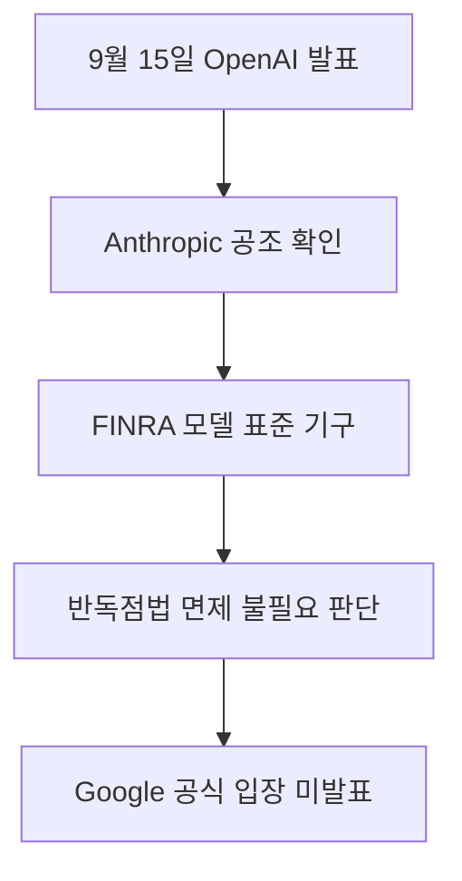

인공지능 시장을 이끄는 세 경쟁사가 안전 검증 기준을 맞추기 위해 한자리에 모였습니다. 가장 앞선 기술을 만드는 기업들이 위험을 사전에 걸러내는 공통 틀을 함께 짜기로 합의하면서, 향후 공개될 생성 도구들의 신뢰도와 출시 흐름에도 직접적인 영향이 생깁니다. **OpenAI, Anthropic, Google DeepMind가 금융산업규제국을 본뜬 민간 자율 안전 표준 기구 설립 논의를 진행 중**이라고 공식 석상에서 확인했습니다. 각자 폐쇄적으로 진행하던 내부 테스트를 넘어, 출시 전에 통과해야 할 공통의 시험대를 만들겠다는 구상입니다. 이로써 기술 사용자들은 불투명한 위험 부담을 줄이고 검증된 도구를 안정적으로 마주할 수 있는 발판을 얻게 됩니다.

> **먼저 알아둘 용어**
>
> - **할루시네이션**: AI가 사실이 아닌 내용을 사실인 것처럼 지어내 말하는 현상입니다.
> - **프롬프트**: AI에게 건네는 지시문입니다. 같은 모델도 지시문에 따라 결과가 크게 달라집니다.
> - **벤치마크**: 같은 문제집을 여러 모델에 풀려 점수를 매기는 시험입니다. 실제 체감 성능과 다를 수 있습니다.
{: .prompt-info }

## 무슨 일이 벌어진 걸까?

OpenAI의 최고 글로벌 업무 책임자 Chris Lehane은 2026년 9월 15일 워싱턴 브리핑에서 Anthropic PBC 및 Google DeepMind와 수주일 동안 협력 논의를 이어왔다고 직접 확인했습니다 <a href="#source-2" aria-label="Claims Journal 출처">[2]</a>. 이번 논의의 목표는 미국 월스트리트 증권사들을 감독하는 금융산업규제국(FINRA)을 모델로 삼아, 인공지능 업계 스스로 운영하는 자율 규제 표준 기구를 만드는 것입니다 <a href="#source-3" aria-label="Bloomberg 출처">[3]</a>. 금융산업규제국이란 복잡한 증권 시장에서 금융 사고를 막고 투자자를 보호하기 위해 업계 참여자들이 직접 규정을 세우고 감시하는 민간 기구를 뜻합니다. 복잡한 수학과 알고리즘으로 만들어진 인공지능 모델은 정부 감독관이 외부에서 세부 구조를 온전히 들여다보기 어렵기 때문에, 기술을 가장 잘 아는 프론티어 연구소들이 직접 엄격한 기준을 만들어 감시하겠다는 계획입니다. 프론티어 모델이란 현재 기술의 최전선에서 가장 뛰어난 연산 능력과 복합적인 문제 해결 능력을 지닌 차세대 최첨단 인공지능을 의미합니다.

이러한 금융 규제 모델 형태의 기구 설립 아이디어는 Google DeepMind의 최고경영자 Demis Hassabis가 첨단 프론티어 인공지능 모델을 광범위하게 배포하기 전에 독립적인 사전 평가를 진행하자며 지난 칠월에 처음 제안했습니다 <a href="#source-2" aria-label="Claims Journal 출처">[2]</a>. 새로운 모델이 등장할 때마다 각 회사가 자체적인 기준선만 적용하여 서둘러 시장에 풀던 관행을 바꾸고, 업계가 합의한 독립된 시험 절차를 필수적으로 거치게 하자는 취지였습니다. 시장에서 가장 강력하게 격돌하던 라이벌들이 위험 통제라는 중대한 과제 앞에서 뜻을 모으기 시작했다는 점에서 커다란 전환점입니다. **경쟁사들이 자발적으로 모여 출시 전 독립 평가 체계를 논의**한다는 사실 자체가 지금까지의 무한 속도전과는 확연히 다른 장면을 보여줍니다. 앞으로 인공지능 개발 연구소들은 상용화 직전에 위험 요소를 검증하는 공통 평가 관문을 통과해야 할 가능성이 매우 높아졌습니다.

<figure class="news-source-image">
  
  <figcaption>OpenAI가 원문과 함께 공개한 이미지입니다. <a href="https://openai.com/index/ai-policy-window" target="_blank" rel="noopener noreferrer">출처: OpenAI</a></figcaption>
</figure>

## 왜 지금 다들 이 이야기를 할까?

이번 기업 간 공조는 인공지능 기술의 폭주를 막아야 한다는 문제의식 속에서 최고경영자들의 공개적인 지지가 잇따르며 급물살을 탔습니다 <a href="#source-3" aria-label="Bloomberg 출처">[3]</a>. Anthropic 최고경영자 Dario Amodei는 첨단 모델 개발 속도를 늦추고 업계 전반의 자제력이 필요하다는 취지의 글을 발표했습니다. 놀랍게도 경쟁 관계의 정점에 서 있던 OpenAI 최고경영자 Sam Altman이 이 주장을 공개적으로 지지하고 나서면서 협력의 계기가 마련되었습니다 <a href="#source-2" aria-label="Claims Journal 출처">[2]</a>. 시장 주도권을 뺏길까 두려워 무작정 가속 페달만 밟던 경쟁 분위기에서 벗어나, 안전 기준을 마련하지 않으면 산업 전체가 흔들릴 수 있다는 위기감이 공유된 결과입니다.

동시에 규제 정책의 주도권을 민간이 선제적으로 쥐겠다는 전략적 판단도 강력하게 작용했습니다. OpenAI는 2026년 9월 9일, 모델의 역량 수준에 맞춘 의무적 국가 규제와 민간 주도의 자율 표준 구축을 함께 촉구하는 정책 프레임워크를 발표했습니다 <a href="#source-1" aria-label="OpenAI 출처">[1]</a>. 외부 정치권이나 규제 당국이 현실과 동떨어진 강력한 규제를 일방적으로 부과하기 전에, 산업을 이끄는 주체들이 먼저 실효성 있는 기술 안전 가이드라인을 세우겠다는 뜻입니다. 한편에서는 거대 독과점 기업들이 모여 규격을 정하는 행위가 시장 경쟁을 저해하는 담합이 아니냐는 우려의 시선도 존재합니다. 이에 대해 Chris Lehane은 항공기 제조사들과 항공사들이 승객의 안전을 보장하기 위해 사고 데이터와 정비 지침을 긴밀히 공유하는 선례를 들었습니다. 항공 업계가 승객 안전을 위해 협력하듯, 인공지능 안전 협의 역시 경쟁법상 별도의 반독점 면제를 승인받을 필요가 없다고 설명했습니다 <a href="#source-2" aria-label="Claims Journal 출처">[2]</a>. 이로써 안전 관리는 단순한 윤리 선언을 넘어 **산업 생존과 규제 리스크 방어를 위한 실질적 사전 의무**로 자리 잡아가고 있습니다.

<figure class="news-source-image">
  
  <figcaption>OpenAI가 원문과 함께 공개한 이미지입니다. <a href="https://openai.com/index/ai-policy-window" target="_blank" rel="noopener noreferrer">출처: OpenAI</a></figcaption>
</figure>

## 그래서 우리에게 뭐가 달라질까?

일반 소비자와 기업 고객이 마주하는 인공지능 제품들의 출시 방식과 신뢰 수준에서 직접적인 변화가 일어납니다. 지금까지는 특정 인공지능 모델이 배포된 이후에 심각한 보안 결함이나 환각 오류, 위험 정보 생성 문제를 일으켜도 기업이 사후 패치를 내놓을 때까지 속수무책으로 기다려야 했습니다. 환각 오류는 인공지능이 사실이 아닌 거짓 정보를 마치 진짜인 것처럼 그럴듯하게 꾸며내어 전달하는 현상을 뜻합니다. 그러나 금융산업규제국을 닮은 기구가 공식 작동하면, 일정 역량을 넘어서는 모델은 배포 전에 철저한 공통 시험을 반드시 거쳐야 합니다. 이 과정에서 잠재적 위험이 포착된 모델은 출시 일정이 미뤄지거나 위험 기능이 걸러진 상태로 시장에 나오게 됩니다. 결과적으로 사용자들은 훨씬 정제되고 예측 가능한 안전한 결과물을 얻을 수 있습니다. 협력에 참여하는 주요 기업들의 입장과 역할을 정리하면 아래와 같습니다.

| 참여 기업명 | 핵심 인물 | 이번 협력에서의 공식 역할 및 제안 내용 |
| :--- | :--- | :--- |
| OpenAI | Chris Lehane, Sam Altman | 2026년 9월 정책 프레임워크 발표 및 수주일간 삼자 협력 논의 공식 확인 |
| Google DeepMind | Demis Hassabis | 첨단 모델의 광범위한 배포 전 독립 평가를 위한 금융 모델 표준 기구 최초 제안 |
| Anthropic | Dario Amodei | 첨단 모델 개발 속도 조절 및 자제 촉구 에세이 발표 후 논의 참여 |

이 표에서 보듯 주요 주체들이 동일한 안전 프레임워크 안으로 들어오면, 기업 고객들은 업무에 인공지능을 도입할 때 보안 위험에 대한 불안감을 크게 덜 수 있습니다. 무조건 남들보다 먼저 신기술을 공개하는 속도 경쟁에서, **충분한 사전 검증을 거친 견고한 모델을 안정적으로 공급하는 신뢰 경쟁**으로 패러다임이 이동합니다.

<figure class="news-source-image">
  
  <figcaption>OpenAI가 원문과 함께 공개한 이미지입니다. <a href="https://openai.com/index/ai-policy-window" target="_blank" rel="noopener noreferrer">출처: OpenAI</a></figcaption>
</figure>

## 그래서 내 업무에는 뭐가 달라지나

지금 단계에서 일반 사용자가 당장 사내 시스템 설정을 바꾸거나 사용 중인 프로그램을 교체할 일은 없습니다. 이번 발표는 세 회사가 협력 논의를 진행 중이라는 확인 단계이며, 최종적으로 합의된 표준 지침이나 제품 평가 기준이 확정되어 시장에 적용된 것은 아니기 때문입니다. 하지만 현업에서 인공지능 도구를 실무에 적극 도입하고 있는 기획자, 마케터, 단독 사업자라면 향후 도입될 표준화 흐름에 발맞추어 지금 당장 다음과 같은 대비를 시작할 수 있습니다.

먼저 업무용 생성 도구에 입력하는 사내 데이터 취급 방침을 명확히 정리하십시오. 표준 기구가 정착되면 정보 유출과 오남용 방지 기준이 훨씬 엄격해지므로, 고객의 개인정보나 대외비 문서를 프롬프트 창에 무분별하게 입력하지 않도록 자체 점검 수칙을 만들어야 합니다. 프롬프트 창은 사용자가 인공지능에게 지시문이나 질문을 적어 넣는 입력 공간을 뜻합니다. 다음으로 단일 기업의 특정 모델에만 모든 업무 흐름을 묶어두는 방식을 피하십시오. 앞으로 공통 안전 평가 절차가 본격 가동되면 특정 연구소의 차세대 모델 출시가 감사 통과 지연으로 늦춰질 가능성이 있습니다. 따라서 필요에 따라 다른 모델로 손쉽게 작업을 이어갈 수 있도록 유연한 대체 작업 경로를 마련해 두는 태도가 안전합니다. 마지막으로 외부에서 인공지능 설루션을 구매하거나 외주 서비스를 도입할 때, 해당 기술이 업계의 검증된 안전 가이드라인을 고려하고 있는지 묻는 평가 항목을 도입하십시오. **공인된 표준과 안전 절차를 이해하고 도구를 선별하는 역량**이 앞으로 모든 실무자에게 요구되는 핵심 실력이 됩니다.

## 아직은 선을 그어야 할 부분

중요한 대화가 시작되었다고 해서 곧바로 완성된 민간 감독 기구가 출범한 것은 결코 아닙니다. 여전히 해결되지 않았거나 불투명하게 남아 있는 조건들이 분명히 존재합니다. 가장 먼저 Anthropic과 Google DeepMind는 이번 표준 기구의 구체적인 참여 조건이나 최종 확정 구조에 대해 즉각적인 공식 확인 입장을 내놓지 않았습니다 <a href="#source-2" aria-label="Claims Journal 출처">[2]</a>. OpenAI의 글로벌 업무 책임자가 브리핑을 통해 논의 사실을 공개했을 뿐, 세 회사가 공식 합의문에 서명했거나 공동 기자회견을 연 상태는 아닙니다. 또한 구체적인 기술 평가 벤치마크, 역량 기준선, 외부 감사 절차가 무엇인지도 아직 전혀 결정되지 않았습니다. 벤치마크란 인공지능의 성능, 지능, 보안 취약점을 측정하기 위해 마련된 표준화된 평가 지표를 뜻합니다. 어느 수준의 컴퓨팅 능력이나 지능을 가진 모델부터 사전 감사를 의무화할지 명확한 선이 그어지지 않았습니다.

아울러 이 민간 기구가 연방 정부의 공식 감독을 받는 법적 지위를 갖게 될지, 아니면 단순한 민간 기업 간 자율 신사협정에 머물 것인지도 미정입니다. 미 행정부의 정책적 지지 여부 역시 커다란 변수입니다. 도널드 트럼프 대통령은 연방 정부 차원의 인공지능 안전 규제나 인위적인 개발 속도 조절에 대해 공개적으로 강력한 반대 입장을 유지해 왔습니다. 따라서 백악관이나 연방 정부가 이러한 민간 기구의 영향력을 공식적으로 인정하고 뒷받침해 줄지는 극히 불확실합니다. **세부적인 기술 감사 기준과 미 행정부의 공식적 수용 여부는 여전히 결정되지 않은 과제**라는 점을 기억하며 차분하게 후속 발표를 지켜보아야 합니다.

<!-- primary-sources:start -->
## 원문과 버전 확인

- [발표 원문](https://openai.com/index/ai-policy-window)
- [Claims Journal](https://www.claimsjournal.com/news/national/2026/09/15/326868.htm)
- [Bloomberg](https://www.bloomberg.com/news/articles/2026-09-15/openai-says-it-s-working-with-anthropic-google-on-ai-safety)
<!-- primary-sources:end -->

<!-- internal-links:start -->
## 함께 읽으면 이해가 이어지는 글

- [Nvidia, Poolside와 70억 달러 계약 체결하여 Nemotron AI 경쟁력 강화]() — Nvidia가 AI 스타트업 Poolside의 Model Factory 소프트웨어 라이선스 대금으로 60억 달러를 지급하고 10억 달러의 지분 투자를 단행했습니다. 이번 거래를 통해 Poolside의 핵심 엔지니어 109명이…
- [Anthropic과 OpenAI 및 Musk 연대, 프론티어 AI 개발 속도 의도적 감속 제안]() — Anthropic 대표 Dario Amodei가 2026년 9월 12일 최고 성능 AI 개발 속도를 의도적으로 늦추자고 제안했습니다. OpenAI의 Sam Altman과 Elon Musk도 즉각 지지 의사를 밝혔습니다. 이들은 안전…
- [OpenAI의 2026년 상장 공식 철회와 Sam Altman이 밝힌 AI 안전 문제]() — 2026년 9월 12일 OpenAI CEO Sam Altman은 회사가 2026년에 상장하지 않는다고 밝혔습니다. 인공지능 안전과 인간 의도 일치 문제를 해결하기 위해 주주의 단기 이익 대신 비상장사의 개발 자율성을 지키겠다는…
<!-- internal-links:end -->

## 자주 묻는 질문

### OpenAI, Anthropic, Google DeepMind가 추진 중인 안전 기구는 무엇인가요?

미국 증권업계를 감독하는 금융산업규제국을 모델로 삼아, 최첨단 인공지능 모델을 상용 배포하기 전에 안전성과 위험도를 사전에 독립적으로 평가하는 민간 자율 규제 표준 기구입니다.

### 경쟁사들이 함께 모여 안전 기준을 세우는 것이 반독점법 위반은 아닌가요?

OpenAI의 Chris Lehane은 항공 업계가 승객 안전을 위해 기술과 점검 데이터를 공유하듯, 인공지능 안전 기준 마련 역시 반독점법 면제 없이 추진 가능하다고 설명했습니다.

### 이번 발표로 인해 현재 사용 중인 ChatGPT나 Claude 사용이 제한되나요?

당장 기존 모델 이용에는 아무런 변화가 없으며, 향후 기구가 설립되면 차세대 고성능 모델의 출시 전 안전 검증 기간이 추가될 수 있습니다.

### 안전 표준 기구의 구체적인 평가 기준과 정식 출범 시점은 확정되었나요?

아직 확정되지 않았으며, 구체적인 성능 벤치마크 기준선과 정부 감독 여부, 파트너사들의 최종 서명 절차가 남아 있습니다.

## 직접 확인한 원문

<ol class="checked-source-list">
  <li id="source-1"><a href="https://openai.com/index/ai-policy-window" target="_blank" rel="noopener noreferrer">OpenAI — The AI policy window is open. We need to act.</a> (2026-09-09)</li>
  <li id="source-2"><a href="https://www.claimsjournal.com/news/national/2026/09/15/326868.htm" target="_blank" rel="noopener noreferrer">Claims Journal — OpenAI Says It&#x27;s Working With Anthropic, Google on AI Safety</a> (2026-09-15)</li>
  <li id="source-3"><a href="https://www.bloomberg.com/news/articles/2026-09-15/openai-says-it-s-working-with-anthropic-google-on-ai-safety" target="_blank" rel="noopener noreferrer">Bloomberg — OpenAI Says It&#x27;s Working With Anthropic, Google on AI Safety</a> (2026-09-15)</li>
</ol>

> 이 글은 위 원문을 직접 확인해 작성했습니다. 가격, 기능 범위, 지역별 제공 여부는 게시 후 바뀔 수 있으니 실제 도입 전 공식 문서를 다시 확인하세요.
