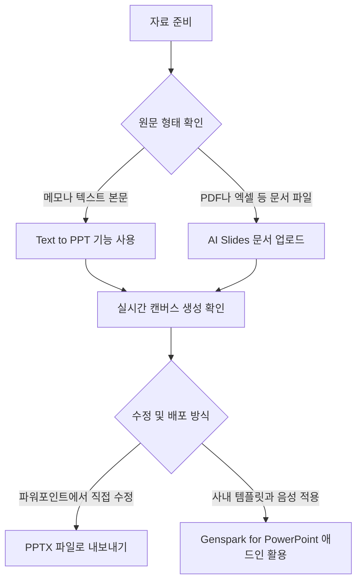
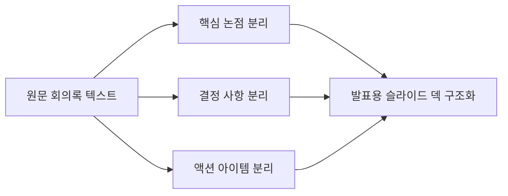

젠스 파크 ai ppt 만들기는 긴 텍스트나 문서를 업로드해 편집 가능한 발표 슬라이드로 즉시 변환하는 기능입니다. 2026년 09월 17일 기준 Genspark는 대화형 인터페이스와 문서 분석 도구를 통해 슬라이드 덱을 실시간 캔버스에서 설계합니다.

발표 자료를 만들 때 가장 많은 시간이 드는 작업은 내용을 요약하고 구조를 짜는 일입니다. Genspark의 AI Slides 기능과 Text to PPT 도구는 이 초안 작성 과정을 자동화합니다. 젠스 파크 ai 무료 사용을 알아보는 분들이나 회의 메모 정리에 지친 실무자라면, 이 도구가 내 업무를 어디까지 줄여줄 수 있는지 파악해야 합니다. 어떤 입력 방식을 써야 원하는 결과가 나오는지 단계별로 명확하게 정리해 드립니다.

> **먼저 알아둘 용어**
>
> - **프롬프트**: AI에게 건네는 지시문입니다. 같은 모델도 지시문에 따라 결과가 크게 달라집니다.
{: .prompt-info }

## 젠스 파크 AI Slides 기본 원리와 대화형 슬라이드 생성

Genspark AI Slides는 채팅창 대화와 파일 분석을 거쳐 실시간 캔버스 화면에서 슬라이드 덱을 자동 생성합니다. 사용자가 만들고자 하는 발표의 목적과 요구사항을 채팅창에 입력하면, 인공지능이 대화형으로 이를 파악하여 세부 내용을 구체화합니다. 주제어만 던져도 전체 구조를 잡을 수 있고, 이미 작성한 기획안이나 메모를 바탕으로 장표를 나눌 수도 있습니다. 대화형 인터페이스를 통해 발표 대상 청중이 누구인지, 발표 시간이 얼마나 되는지, 강조하고 싶은 핵심 메시지가 무엇인지 질문을 주고받으며 슬라이드 골격을 잡습니다.

지원하는 파일 형식은 폭넓습니다. PDF 문서, Word 파일, Excel 스프레드시트, 기존 PPT 파일을 업로드할 수 있습니다. 시스템은 첨부된 파일 안의 텍스트와 수치 표를 읽어 들여 발표에 적합한 핵심 메시지를 추출합니다. 실시간 캔버스 기능 덕분에 사용자는 슬라이드가 한 장씩 채워지는 과정을 화면에서 직접 지켜볼 수 있습니다. 슬라이드 순서가 어색하거나 특정 장표의 설명이 부족하면 대화창에서 추가 지시를 내려 즉각 수정할 수 있습니다. 예를 들어 특정 페이지의 논리 전개를 보강하거나 제목을 직관적으로 바꿔 달라고 요청하면 실시간으로 반영됩니다.

이 기능의 핵심 강점은 수치 데이터를 다루는 능력입니다. 일반적인 생성형 인공지능은 숫자를 대략적인 텍스트로만 흉내 내어 틀린 값을 적거나 그래프 형태를 왜곡하는 경우가 많습니다. 반면 Genspark의 AI Slides는 단순 텍스트 생성을 넘어 시스템 내장 컴퓨터 환경에서 코드를 직접 실행합니다. 업로드된 자료의 수치를 계산하고 데이터 분석을 수행하여 오차 없는 데이터 차트를 슬라이드 위에 바로 그립니다. 매출 통계나 설문 조사 결과가 담긴 엑셀 파일을 넣었을 때 정확한 그래프가 구현되는 이유가 여기에 있습니다.

완성된 슬라이드는 폐쇄적인 플랫폼에 갇히지 않습니다. 작업이 끝난 발표 자료는 편집 가능한 PowerPoint 파일인 PPTX 포맷으로 내려받을 수 있습니다. 또한 PDF 파일이나 Google Slides 형식으로 내보내는 것도 완벽히 지원합니다. 직장 동료가 Genspark를 쓰지 않더라도, 완성본을 익숙한 오피스 파일 형태로 공유해 함께 수정할 수 있습니다. 다만 AI Slides에서 슬라이드 1벌을 생성할 때 차감되는 정확한 기본 크레딧 수치나 장수별 추가 차감 기준은 구체적으로 공개되어 있지 않으므로, 작업 전 본인 계정의 잔여 사용량을 실시간 화면에서 확인해야 합니다.

## 젠스 파크 AI 회의록 사용법과 Text to PPT 변환

젠스 파크 ai 회의록 사용법의 핵심은 Text to PPT 기능에 정제되지 않은 회의 기록을 그대로 붙여넣는 데 있습니다. 회의가 끝난 뒤 어지럽게 적힌 줄글 형태의 회의록이나 리서치 리포트를 복사해 입력창에 넣기만 하면 됩니다. 인공지능이 문맥을 분석하여 논리적인 발표 슬라이드 목차와 내용으로 알아서 재구성해 줍니다. 타이핑된 텍스트 원본이 가진 복잡한 문맥을 읽어내어 발표자가 프레젠테이션하기 편한 구조로 바꾸는 방식입니다.

회의록을 발표 자료로 바꿀 때 인공지능은 세 가지 요소를 중점적으로 분류합니다. 첫째는 회의에서 다룬 핵심 논점입니다. 논의의 배경과 주제별 안건을 장표의 서두로 구성합니다. 둘째는 참가자들이 합의한 결정 사항입니다. 회의 중 결론이 난 내용을 명확한 메시지로 정리합니다. 셋째는 앞으로 실행해야 할 액션 아이템, 즉 구체적인 실행 과제와 담당자 목록입니다. 긴 회의록 속에서 이 세 가지를 골라내어 슬라이드 장표별로 나누어 배치하므로 사용자가 직접 가위질하듯 내용을 잘라낼 필요가 없습니다.

회의 메모뿐만 아니라 블로그에 쓴 글이나 긴 업무 보고서도 동일하게 변환할 수 있습니다. 방대한 줄글 문서를 슬라이드 제목, 소제목, 핵심 요약 불릿 포인트로 전환해 줍니다. 텍스트 원본이 가진 논리 흐름을 해치지 않으면서 발표자가 청중에게 전달하기 쉬운 구조로 탈바꿈합니다. 읽기 전용 텍스트가 시각적인 발표 자료의 뼈대로 바뀌는 셈입니다.

| 입력 자료 유형 | 변환 전 특징 | Text to PPT 변환 후 슬라이드 구성 |
| :--- | :--- | :--- |
| 줄글 회의록 메모 | 시간순 대화와 흩어진 안건 | 핵심 논점, 결정 사항, 액션 아이템 장표 분할 |
| 리서치 리포트 | 복잡한 배경 설명과 긴 문장 | 문제 정의, 조사 결과 요약, 결론 제언 슬라이드 |
| 블로그 글 및 기사 | 서술형 문단과 개인적 소회 | 도입부 배경, 주요 시사점, 요약 불릿 포인트 |

텍스트를 변환할 때는 회의록 안에 결정된 사항과 미결된 안건을 명확히 구분해 두는 것이 좋습니다. 인공지능이 문맥을 판별하지만, 메모에 확정이나 담당자라는 단어가 적혀 있으면 훨씬 더 정교한 결과물이 나옵니다. 변환이 완료된 후에는 캔버스에서 각 장표의 요약이 원래 회의 취지에 부합하는지 가볍게 훑어보고 수정 지시를 내리면 됩니다. 필요하다면 특정 결정 사항을 별도 슬라이드로 분리해 달라고 요구할 수도 있습니다.

## Genspark for PowerPoint 애드인 연동과 전문 편집

Genspark for PowerPoint 애드인은 웹 브라우저를 벗어나 파워포인트 프로그램 내부에서 인공지능 기능을 직접 쓰도록 지원하는 전용 도구입니다. 마이크로소프트 파워포인트에 이 애드인을 설치하면, 웹에서 작업한 결과물을 가져오거나 오피스 창 안에서 바로 AI의 도움을 받아 슬라이드를 다듬을 수 있습니다. 별도의 사이트를 오가며 복사해 붙여넣는 번거로움이 사라지며, 슬라이드 수정 작업의 연속성이 유지됩니다.

가장 유용한 기능은 기업 전용 마스터 템플릿의 직접 적용입니다. 인공지능이 만든 슬라이드가 제아무리 깔끔해도 회사 고유의 폰트나 색상 규격과 다르면 실무에서 쓰기 어렵습니다. Genspark for PowerPoint를 활용하면 파워포인트 안에 등록된 사내 공식 서식과 레이아웃 기준을 인공지능 슬라이드에 즉시 덧입힐 수 있습니다. 기업 로고 위치, 표준 색상환, 타이틀 폰트 크기 규격을 유지할 수 있으므로, 브랜드 가이드라인을 지켜야 하는 직장인에게 필수적인 기능입니다.

개별 슬라이드 요소에 대한 세부 편집도 간편해집니다. 특정 문단의 어조를 바꾸거나 다이어그램의 배치를 변경하고 싶을 때 인공지능 명령을 통해 슬라이드 요소를 수정할 수 있습니다. 텍스트 길이를 줄이거나 다른 비즈니스 표현으로 대체하는 작업도 클릭 몇 번으로 끝납니다. 도표의 레이아웃을 다시 배열하거나 강조하고 싶은 문장을 볼드 처리하는 등 세부 디자인 조정을 파워포인트 창에서 마칠 수 있습니다.

발표 준비를 돕는 부가 기능도 강력합니다. 각 슬라이드의 내용을 기반으로 발표자가 읽을 스피커 노트를 자동으로 생성해 줍니다. 슬라이드 하단 메모장에 발표 대본이 채워지므로 별도의 원고를 작성할 시간을 아낄 수 있습니다. 더 나아가 슬라이드 내용을 읽어주는 음성 해설 기능인 voiceover를 생성하는 것도 지원합니다. 교육용 자료나 온라인 공유용 프레젠테이션을 제작할 때 별도 녹음 장비나 더빙 작업 없이 설명 오디오를 슬라이드에 얹을 수 있습니다.

| 지원 기능 | 주요 역할 | 실무 활용 효과 |
| :--- | :--- | :--- |
| 마스터 템플릿 적용 | 사내 공식 디자인 서식 결합 | 브랜드 규격 준수 및 디자인 통일성 확보 |
| 슬라이드 요소 AI 수정 | 텍스트 압축 및 레이아웃 조정 | 파워포인트 내에서 빠른 세부 편집 완료 |
| 스피커 노트 생성 | 발표자 전용 대본 자동 작성 | 발표 준비 시간 단축 및 전달력 향상 |
| 음성 해설 voiceover | 슬라이드 설명 음성 오디오 추가 | 온라인 강의 및 비대면 보고 자료 완성 |

## 그래서 내 업무에는 뭐가 달라지나

발표 자료 제작에 들이던 시간 구조가 완전히 바뀝니다. 빈 화면을 쳐다보며 목차를 고민하고 서식을 맞추던 초반 서너 시간이 10분 안팎으로 줄어듭니다. 자료의 초안을 잡는 고된 노동은 인공지능에 맡기고, 실무자는 내용의 정확성을 검토하고 발표 전략을 다듬는 데 집중할 수 있습니다. 비효율적인 수작업 문서 편집 시간이 줄어들면서 실제 본업에 쏟을 수 있는 시간이 늘어납니다.

오늘 당장 업무 효율을 높이려면 다음 세 가지 행동을 취하십시오.

첫째, 오늘 진행된 회의 메모를 Text to PPT 기능에 바로 붙여넣으십시오. 줄글로 어지럽게 적힌 메모를 넣고 슬라이드 생성을 누르면 결정 사항과 실행 과제가 정리된 덱이 나옵니다. 이를 PPTX 파일로 내려받아 팀원들에게 공유하면 회의록 정리와 보고 자료 작성을 한 번에 끝낼 수 있습니다. 미결된 안건이 있다면 프롬프트 창에 추가하여 보완 장표를 실시간으로 덧붙이십시오.

둘째, 복잡한 통계나 숫자가 담긴 엑셀 문서를 AI Slides에 업로드해 보십시오. 내장 컴퓨터 환경에서 코드를 직접 실행해 그리는 차트 기능을 확인해 볼 필요가 있습니다. 인공지능이 계산한 수치와 생성된 데이터 그래프가 원본 표와 정확히 일치하는지 대조해 보십시오. 오차가 없는지 확인한 뒤 필요한 단위나 축 레이블을 검토하면 신뢰도 높은 보고용 장표가 완성됩니다.

셋째, 회사 표준 서식을 유지해야 한다면 파워포인트 애드인을 설치하십시오. 마이크로소프트 파워포인트 환경에 Genspark for PowerPoint를 연동해 두면 웹에서 내려받은 슬라이드에 회사 마스터 템플릿을 곧바로 입힐 수 있습니다. 스피커 노트까지 함께 생성해 내일 있을 사내 발표 리허설에 활용하십시오. 사내 서식과의 일관성을 챙기면서 발표 준비 대본까지 동시에 확보할 수 있습니다.

현재 한국 사용자 전용 원화 결제 수단인 카카오페이나 네이버페이, 국내 전용 신용카드 지원 여부는 명확하게 확인되지 않았습니다. 해외 결제 가능 카드 등록 여부 등 결제 관련 사항은 유료 플랜 고려 시 서비스 결제 화면에서 직접 확인하시기 바랍니다.

<!-- internal-links:start -->
## 함께 읽으면 이해가 이어지는 글

- [PPT Master: AI가 슬라이드 통이미지 대신 진짜 수정 가능한 파워포인트를 만드는 방법]() — PPT Master는 PDF, 마이그레이션 문서, 텍스트 등을 수정 가능한 고품질 파워포인트(.pptx) 파일로 변환해 주는 오픈소스 AI 프레젠테이션 자동화 도구입니다. 기존 AI 도구들이 슬라이드를 수정 불가능한 통이미지로 만들던…
- [제미나이 사용법 완벽 정리: PDF 요약부터 갤럭시 연동과 요금제 선택까지]() — 구글 제미나이(Gemini)는 웹에서 최대 10개의 PDF 및 데이터 파일을 한 번에 분석하고, 삼성 갤럭시 스마트폰에서 기본 어시스턴트로 설정해 음성 및 화면 공유로 즉시 활용할 수 있습니다. 무료 버전으로도 일상 업무 처리가…
- [Saliency Map은 무엇을 설명하나: 입력 gradient 시각화와 해석의 한계]() — 분류 점수를 입력 픽셀로 미분해 중요한 영역을 찾는 Saliency Map과 class model visualization의 차이를 수식과 코드로 설명합니다.
<!-- internal-links:end -->

## 자주 묻는 질문

### Genspark AI Slides에서 생성된 슬라이드는 파워포인트 파일로 수정할 수 있나요?

수정할 수 있습니다. Genspark AI Slides에서 완성된 결과물은 편집 가능한 파워포인트 파일인 PPTX 포맷뿐만 아니라 PDF, Google Slides 형식으로 내보내어 자유롭게 편집할 수 있습니다.

### 회의록 텍스트를 넣었을 때 어떤 형태로 슬라이드가 만들어지나요?

Text to PPT 기능을 사용하면 긴 줄글 회의록에서 핵심 논점, 결정 사항, 액션 아이템을 자동으로 분할하여 발표 슬라이드 목차와 구조로 재구성해 줍니다.

### 엑셀 파일이나 수치 데이터를 넣어도 차트가 정확하게 그려지나요?

정확하게 생성됩니다. Genspark AI Slides는 시스템 내장 컴퓨터 환경에서 코드를 직접 실행하여 데이터 연산과 수치 계산을 처리하므로 정확한 데이터 차트를 생성합니다.

### 회사에서 지정한 파워포인트 디자인 서식을 그대로 적용할 수 있나요?

적용할 수 있습니다. Microsoft PowerPoint 전용 애드인인 Genspark for PowerPoint를 설치하면 파워포인트 내에서 사내 마스터 템플릿을 바로 적용하고 슬라이드 요소를 수정할 수 있습니다.

## 직접 확인한 원문

- [Genspark Help Center (AI Slides)](https://www.genspark.ai/helpcenter/ai-slides) (2026-09-17 확인)
- [Genspark AI Slides 공식 페이지](https://www.genspark.ai/ai-slides-landing) (2026-09-17 확인)
- [Genspark AI Text to PPT 공식 페이지](https://www.genspark.ai/tools/text-to-ppt) (2026-09-17 확인)
- [Genspark for PowerPoint 공식 페이지](https://www.genspark.ai/genspark-for-powerpoint) (2026-09-17 확인)

위 수치는 확인 시점 기준이며 예고 없이 바뀔 수 있습니다. 결정 전에 공식 페이지를 한 번 더 확인하시기 바랍니다.
