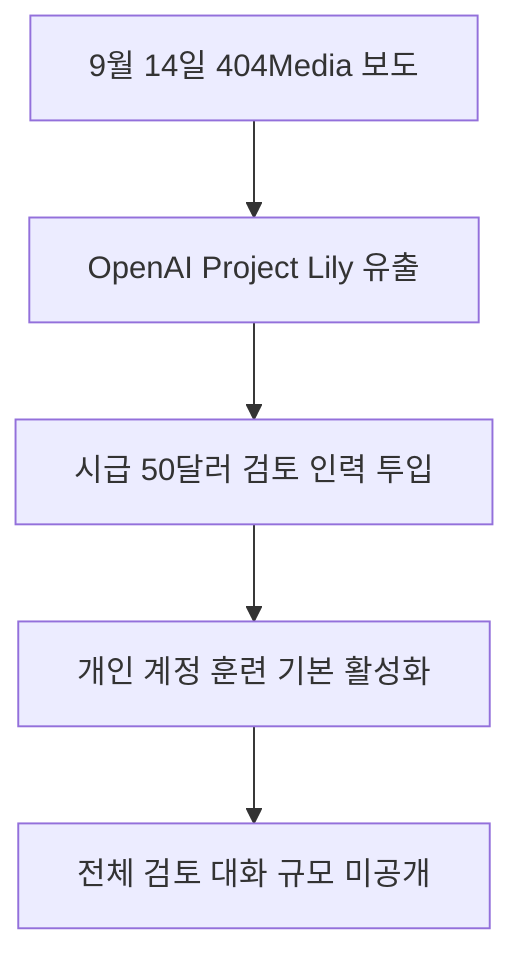

내가 ChatGPT에 털어놓은 일상 대화와 내밀한 고민을 실제 사람이 직접 화면으로 읽고 평가해왔다는 사실이 확인되었습니다.

OpenAI는 Project Lily라는 내부 프로젝트를 운영하면서 외부 계약직 인력을 대규모로 투입해 실제 이용자들의 대화 원문을 검토해왔습니다 <a href="#source-1" aria-label="404 Media 출처">[1]</a>. 자동 가림막 장치가 작동하고 있었지만, 특이한 고유명사나 모호한 표현은 사람의 눈에 그대로 노출될 위험을 안고 있었습니다. **개인 무료 및 유료 계정의 데이터 학습 설정이 기본적으로 켜져 있었다는 점**이 이번 사건의 가장 핵심적인 문제로 떠올랐습니다.

> **먼저 알아둘 용어**
>
> - **프롬프트**: AI에게 건네는 지시문입니다. 같은 모델도 지시문에 따라 결과가 크게 달라집니다.
{: .prompt-info }

## 무슨 일이 벌어진 걸까?

OpenAI가 Project Lily라는 내부 프로젝트 아래 외부 인력을 고용하여 실제 ChatGPT 대화 기록을 검토하고 평가하게 했다는 사실이 2026년 9월 14일 404 Media의 단독 보도로 드러났습니다 <a href="#source-1" aria-label="404 Media 출처">[1]</a>. 기술 전문 매체 Tom's Hardware 등 주요 언론들도 이 사실을 확인하며 사태의 파장이 커졌습니다 <a href="#source-3" aria-label="Tom&#x27;s Hardware 출처">[3]</a>. 보도 내용에 따르면 수백 명 규모의 계약직 인력이 이용자와 AI가 나눈 실제 대화 원문을 화면으로 직접 확인하며 평가 작업을 진행해왔습니다 <a href="#source-1" aria-label="404 Media 출처">[1]</a>.

이 작업자들은 Crossing Hurdles와 Mercor 같은 타사 인력 중개 업체를 통해 선발되어 현장에 투입되었습니다 <a href="#source-1" aria-label="404 Media 출처">[1]</a>. 이들은 시간당 50달러 이상의 보수를 받으면서 이용자가 어떤 의도로 질문했는지 요약하고, 인공지능이 내놓은 답변의 완성도를 매겼습니다 <a href="#source-3" aria-label="Tom&#x27;s Hardware 출처">[3]</a>. 검토자들에게 주어진 평가 척도는 1점에서 7점까지였습니다 <a href="#source-1" aria-label="404 Media 출처">[1]</a>.

여기서 주목할 부분은 검토자들이 수행한 작업의 성격입니다. 이들은 챗봇이 말한 사실관계의 정확성을 일일이 검증한 것이 아니었습니다. 주요 지침은 대화 스타일과 말투를 다듬는 데 집중되어 있었습니다 <a href="#source-1" aria-label="404 Media 출처">[1]</a>. 예를 들어 챗봇이 이용자의 비위를 맞추려고 과도하게 아첨하는 태도를 줄이도록 지시받았습니다 <a href="#source-3" aria-label="Tom&#x27;s Hardware 출처">[3]</a>. 또한 답변에 불필요하게 많은 이모티콘을 남발하지 못하게 걸러내는 작업도 포함되었습니다 <a href="#source-1" aria-label="404 Media 출처">[1]</a>. 무엇보다 인공지능이 마치 살아있는 사람처럼 스스로 감정이나 개인적인 경험이 있는 척 대답하는 의인화 표현을 엄격하게 차단하도록 유도했습니다 <a href="#source-3" aria-label="Tom&#x27;s Hardware 출처">[3]</a>.

개인정보 보호 조치가 완벽하지 않았다는 점도 큰 논란을 부르고 있습니다. OpenAI는 대화 기록을 검토자에게 전달하기 전에 사용자 이름을 지우고 자동화된 Privacy Filter 모델을 거쳤다고 설명합니다 <a href="#source-1" aria-label="404 Media 출처">[1]</a>. 그러나 OpenAI 자체 모델 문서에서도 이 자동 필터가 드물게 쓰이는 고유 식별자나 문맥에 숨어 있는 모호한 표현을 미처 인식하지 못할 수 있음을 인정하고 있었습니다 <a href="#source-3" aria-label="Tom&#x27;s Hardware 출처">[3]</a>. 결국 이용자가 무심코 남긴 민감한 사생활이나 업무상의 비밀이 **외부 계약직 인력의 작업 화면에 여과 없이 노출되었을 가능성**이 확인된 것입니다.

작업자들이 사용한 대시보드 환경은 이용자들의 프라이버시 우려를 더욱 키우고 있습니다. 검토자들에게는 단순히 방금 나눈 단편적인 질문과 답변만 보인 것이 아니었습니다. 이전 대화 기록을 바탕으로 축적된 사용자 기억 요약이 화면 한쪽에 함께 표시되었습니다 <a href="#source-1" aria-label="404 Media 출처">[1]</a>. 이 요약 정보에는 이용자가 과거에 나눈 주된 관심사, 직업이나 가족 관계를 짐작하게 하는 구체적인 정황, 심지어 대략적인 지리적 위치까지 포함되어 있었습니다 <a href="#source-3" aria-label="Tom&#x27;s Hardware 출처">[3]</a>. 비록 성명이 지워졌더라도 여러 정보가 결합되면서 특정 개인을 특정할 수 있는 정황이 고스란히 노출된 셈입니다.

<figure class="news-source-image">
  
  <figcaption>404 Media가 원문과 함께 공개한 이미지입니다. <a href="https://www.404media.co/inside-project-lily-the-humans-reading-your-chatgpt-chats" target="_blank" rel="noopener noreferrer">출처: 404 Media</a></figcaption>
</figure>

## 왜 지금 다들 이 이야기를 할까?

이 사건이 전 세계적인 관심과 논란을 불러일으킨 근본적인 이유는 일반 사용자들이 이용하는 계정의 데이터 설정이 애초부터 외부에 열려 있었기 때문입니다 <a href="#source-2" aria-label="OpenAI Help Center 출처">[2]</a>. 많은 사람들은 인공지능과의 대화가 서버 안에서 기계적으로만 처리된다고 여겼지만, 실제로는 타인의 모니터 위에서 읽히고 있었습니다.

계정 종류에 따른 명확한 차별적 기본값 정책도 큰 비판을 받고 있습니다. 비용을 내지 않는 Free 계정은 물론이고, 매달 구독료를 지불하는 Plus 계정과 고성능 Pro 계정조차 '모두를 위한 모델 개선'이라는 데이터 활용 기능이 기본값으로 켜져 있었습니다 <a href="#source-1" aria-label="404 Media 출처">[1]</a>. 반면 막대한 비용을 지불하는 기업과 교육 기관용 플랜인 Enterprise, Business, Edu 계정은 대화를 통한 모델 훈련이 처음부터 꺼진 상태로 제공되었습니다 <a href="#source-2" aria-label="OpenAI Help Center 출처">[2]</a>.

| 계정 유형 | 모델 훈련 및 개선 기본 설정 | 실제 대화 외부 검토 노출 여부 |
| --- | --- | --- |
| Free 계정 | 활성화 | 훈련 설정을 직접 끄지 않으면 검토 대상에 포함 |
| Plus 계정 | 활성화 | 유료 결제 계정이라도 설정을 직접 꺼야 제외 |
| Pro 계정 | 활성화 | 최고 등급 개인 계정이라도 기본 활성화 상태 |
| Enterprise 계정 | 비활성화 | 기관 및 기업 보호를 위해 기본 차단 |
| Business 계정 | 비활성화 | 기업용 데이터 보호 정책에 따라 기본 차단 |
| Edu 계정 | 비활성화 | 교육 기관 보호 기준에 따라 기본 차단 |

이용자에게 실제 사람이 대화를 읽고 검토한다는 점을 사전에 명확하게 알렸는지에 대해 404 Media가 공식 질의를 보냈습니다 <a href="#source-1" aria-label="404 Media 출처">[1]</a>. 이에 대해 OpenAI는 별도의 적극적 해명 대신 데이터 제어 권한과 모델 개선 방식을 설명하는 고객 지원 센터 안내 문서를 제시했습니다 <a href="#source-2" aria-label="OpenAI Help Center 출처">[2]</a>. 2026년 9월 16일 업데이트된 해당 지원 센터 페이지에서는 이용자가 언제든 설정에서 데이터 사용 여부를 제어할 수 있다고 설명하고 있습니다 <a href="#source-2" aria-label="OpenAI Help Center 출처">[2]</a>. 하지만 일상적인 서비스 가입 과정이나 대화 화면에서 내 글을 계약직 작업자가 직접 볼 수 있다는 사실을 알기 어렵게 만들어 두었다는 점에서 비판의 목소리는 수그러들지 않고 있습니다 <a href="#source-3" aria-label="Tom&#x27;s Hardware 출처">[3]</a>.

결국 인공지능 서비스의 학습 과정에 수많은 인간 노동이 투입된다는 사실뿐만 아니라, 그 과정에서 일반 대중의 일상 데이터가 사전 인지 없이 활용되고 있었다는 점이 신뢰의 위기를 불러왔습니다. 편의성을 누리는 대가로 사용자가 인지하지 못한 채 사생활 노출 위험을 떠안고 있었다는 사실이 이번 사태의 본질입니다.

<figure class="news-source-image">
  
  <figcaption>Image: Spumoni Cooperative for 404 Media. <a href="https://www.404media.co/inside-project-lily-the-humans-reading-your-chatgpt-chats" target="_blank" rel="noopener noreferrer">출처: 404 Media</a></figcaption>
</figure>

## 그래서 우리에게 뭐가 달라질까?

가장 중요한 변화는 이제부터 ChatGPT 대화창에 문장을 적을 때마다 다른 사람이 이 글을 읽을 수 있다는 전제를 품어야 한다는 점입니다 <a href="#source-1" aria-label="404 Media 출처">[1]</a>. 프롬프트에 입력하는 질문은 단순한 전자기적 신호로 소멸하는 것이 아니라, 인간 검토자의 모니터에 떠오르는 텍스트 기록으로 남을 수 있습니다.

예를 들어 건강 문제로 신체 증상을 털어놓거나, 내밀한 사생활 문제를 상담하며 위로를 구했던 이용자라면 큰 충격을 받을 수밖에 없습니다. 인공지능 시스템이 사용자 계정 이름을 가려준다고 해도, 거주하는 지역과 직장 환경, 과거 질문 이력이 담긴 기억 요약이 결합되면 개인의 신원을 파악하기란 어렵지 않기 때문입니다 <a href="#source-3" aria-label="Tom&#x27;s Hardware 출처">[3]</a>. 계약직 검토자들에게는 실제로 이러한 사용자 기억 요약과 대략적인 지리적 위치 정보가 한꺼번에 전달되었습니다 <a href="#source-1" aria-label="404 Media 출처">[1]</a>.

더욱 주의 깊게 살펴야 할 부분은 데이터 설정 변경의 한계입니다. OpenAI의 공식 지원 문서에 따르면, 이용자가 데이터 학습 설정을 비활성화하더라도 **이미 수집되었거나 모델 훈련에 활용된 과거 대화 기록은 소급하여 제외되지 않는다**고 명시되어 있습니다 <a href="#source-2" aria-label="OpenAI Help Center 출처">[2]</a>. 오늘 설정을 부랴부랴 끈다고 해도, 어제까지 무심코 털어놓았던 내밀한 대화들은 이미 외부 인력의 대시보드나 인공지능 훈련 체계로 넘어갔을 수 있다는 뜻입니다 <a href="#source-3" aria-label="Tom&#x27;s Hardware 출처">[3]</a>.

결국 인공지능과 대화하는 심리적인 태도 자체가 근본적으로 달라질 수밖에 없습니다. 대화형 비서에게만 은밀하게 털어놓는 비밀이란 존재하기 어렵습니다. 화면에 단어 하나를 입력하기 전에, 제삼자인 낯선 사람이 이 문장을 들여다보아도 안전한지 스스로 검토해야 하는 불편한 현실을 마주하게 되었습니다.

<figure class="news-source-image">
  
  <figcaption>Tom&#x27;s Hardware가 원문과 함께 공개한 이미지입니다. <a href="https://www.tomshardware.com/tech-industry/artificial-intelligence/chatgpt-transcripts-are-reportedly-read-by-humans-to-improve-responses-including-those-with-personal-information-project-lilly-has-seen-openai-hire-hundreds-of-contractors-to-manually-review-logs" target="_blank" rel="noopener noreferrer">출처: Tom&#x27;s Hardware</a></figcaption>
</figure>

## 그래서 내 업무에는 뭐가 달라지나

이 소식을 확인한 직장인 실무자와 일인 사업자, 창작자가 오늘 당장 계정에서 취해야 할 구체적인 조치는 분명합니다. 단순히 소식을 지켜보는 것만으로는 내 정보를 보호할 수 없습니다.

먼저 개인용 계정을 사용하고 있다면 ChatGPT 설정 창을 열고 데이터 제어 메뉴로 이동해야 합니다. 그곳에 위치한 '모두를 위한 모델 개선' 토글 스위치를 즉시 비활성화해야 합니다 <a href="#source-2" aria-label="OpenAI Help Center 출처">[2]</a>. 이 설정을 꺼두어야만 앞으로 나눌 새로운 대화들이 외부 계약직 인력의 평가 화면이나 모델 훈련 데이터로 전송되는 일을 막을 수 있습니다 <a href="#source-1" aria-label="404 Media 출처">[1]</a>.

다음으로 사내 보고서 초안, 미공개 계약 조항, 고객의 개인정보와 같은 대외비 자료를 프롬프트에 그대로 붙여넣는 작업을 중단해야 합니다. OpenAI가 도입한 Privacy Filter 모델은 희귀한 고유 식별자나 모호한 문맥 표현을 걸러내지 못할 수 있다고 공식 문서에서 인정하고 있습니다 <a href="#source-3" aria-label="Tom&#x27;s Hardware 출처">[3]</a>. 고유명사를 가상의 단어로 대체하거나 익명화 처리를 완전히 마친 뒤에만 질문을 입력하는 업무 습관을 들여야 합니다.

마지막으로 회사 차원에서 업무 목적으로 개인용 유료 플랜을 사용해왔다면 기업 전용 계정으로 전환하는 방안을 검토해야 합니다. Enterprise나 Business 계정은 기본적으로 모델 훈련 기능이 꺼져 있어 데이터가 외부에 공유되지 않도록 보호 조치가 적용됩니다 <a href="#source-2" aria-label="OpenAI Help Center 출처">[2]</a>. 임직원 각자에게 개인용 계정 비용을 지원해주는 방식은 의도치 않은 사내 정보 유출 사고로 이어질 수 있으므로 조직 차원의 데이터 관리 정책을 재정비해야 합니다.

<figure class="news-source-image">
  
  <figcaption>(Image credit: Getty Images) <a href="https://www.tomshardware.com/tech-industry/artificial-intelligence/chatgpt-transcripts-are-reportedly-read-by-humans-to-improve-responses-including-those-with-personal-information-project-lilly-has-seen-openai-hire-hundreds-of-contractors-to-manually-review-logs" target="_blank" rel="noopener noreferrer">출처: Tom&#x27;s Hardware</a></figcaption>
</figure>

## 아직은 선을 그어야 할 부분

이번 사태를 객관적으로 바라보기 위해서는 확인된 사실과 확인되지 않은 사실 사이의 경계를 명확하게 그어야 합니다.

OpenAI는 Project Lily를 통해 실제로 얼마나 많은 이용자의 대화 기록이 외부 계약직 검토자들에게 전달되었는지 전체 수치를 공개하지 않았습니다. 검토를 거친 대화가 수만 건 수준인지, 아니면 수백만 건에 달하는지는 외부에서 전혀 알 수 없습니다. 따라서 내가 입력한 대화가 반드시 검토자의 모니터에 노출되었다고 단정할 수는 없지만, 대상에 포함되었을 가능성 자체는 배제할 수 없습니다.

또한 유럽 연합을 비롯한 주요 국가의 개인정보 보호 규제 당국이 이번 Project Lily 사안을 두고 OpenAI를 상대로 공식적인 법적 조사나 제재 절차에 착수할 것인지도 아직 확정되지 않았습니다. 사용자의 명시적 사전 동의가 법적으로 유효했는지를 둘러싼 규제 기관의 판단은 앞으로의 발표를 지켜보아야 합니다.

인공지능의 지능적인 답변 뒤에는 수많은 계약직 검토자의 수작업 평가가 자리 잡고 있었습니다. 기술의 편리함 뒤에 가려져 있던 데이터 관리 방식을 직시하고, 내 소중한 개인정보를 지키기 위한 계정 설정을 지금 즉시 점검하시기 바랍니다.

<!-- primary-sources:start -->
## 원문과 버전 확인

- [발표 원문](https://help.openai.com/en/articles/5722486-how-your-data-is-used-to-improve-model-performance)
- [404 Media](https://www.404media.co/inside-project-lily-the-humans-reading-your-chatgpt-chats)
- [Tom's Hardware](https://www.tomshardware.com/tech-industry/artificial-intelligence/chatgpt-transcripts-are-reportedly-read-by-humans-to-improve-responses-including-those-with-personal-information-project-lilly-has-seen-openai-hire-hundreds-of-contractors-to-manually-review-logs)
<!-- primary-sources:end -->

<!-- internal-links:start -->
## 함께 읽으면 이해가 이어지는 글

- [ChatGPT 보호자 통제 설정법: 청소년 대화를 보지 않고 안전선을 만드는 법]() — 보호자와 청소년이 계정을 연결하는 순서부터 시간대, 개인정보, 안전 알림을 함께 정하는 대화법까지 공식 안내를 바탕으로 정리한 가족용 실전 가이드입니다.
- [유출 코드 기반 AI 에이전트를 써도 될까? Claw Code의 출처, 법적 리스크]() — Claude Code 유출, 클린룸 재작성 주장이 얽힌 Claw Code에서 검증된 사실과 서사를 구분하고, 유용한 설계 패턴만 안전하게 읽는 기준을 제시합니다.
- [3D 라벨 없이 장면의 앞뒤를 읽을 수 있을까: VEGA-3D의 대가]() — VEGA-3D가 동결 비디오 생성 모델의 중간 피처를 MLLM에 게이트 방식으로 결합하는 구조와 정밀 좌표, 메모리, 지연 한계를 짚습니다.
<!-- internal-links:end -->

## 자주 묻는 질문

### ChatGPT 유료 구독자인 Plus나 Pro 이용자 대화도 사람이 읽을 수 있나요?

네, Plus와 Pro 같은 개인용 유료 계정이라도 모두를 위한 모델 개선 설정이 기본으로 켜져 있어 검토 대상에 포함됩니다.

### 대화 설정에서 모델 훈련을 끄면 예전에 입력한 대화도 검토 대상에서 빠지나요?

아닙니다, OpenAI 공식 정책에 따르면 설정을 끈 시점 이후의 새로운 대화에만 적용되며 기존 대화는 소급하여 제외되지 않습니다.

### 기업용 Enterprise나 Business 계정의 대화도 외부 계약직에게 전달되나요?

아닙니다, Enterprise, Business, Edu 계정은 모델 훈련 및 개선 설정이 기본적으로 꺼져 있어 외부 검토 대상에서 제외됩니다.

### OpenAI의 Privacy Filter가 내 이름과 개인 정보를 완벽하게 지워주나요?

완벽하지 않습니다, OpenAI 자체 문서에서도 자동 필터가 특이한 식별자나 모호한 표현을 놓칠 수 있다고 인정하고 있습니다.

## 직접 확인한 원문

<ol class="checked-source-list">
  <li id="source-1"><a href="https://www.404media.co/inside-project-lily-the-humans-reading-your-chatgpt-chats" target="_blank" rel="noopener noreferrer">404 Media — Inside &#x27;Project Lily&#x27;: The Humans Reading Your ChatGPT Chats</a> (2026-09-14)</li>
  <li id="source-2"><a href="https://help.openai.com/en/articles/5722486-how-your-data-is-used-to-improve-model-performance" target="_blank" rel="noopener noreferrer">OpenAI Help Center — How your data is used to improve model performance</a> (2026-09-16)</li>
  <li id="source-3"><a href="https://www.tomshardware.com/tech-industry/artificial-intelligence/chatgpt-transcripts-are-reportedly-read-by-humans-to-improve-responses-including-those-with-personal-information-project-lilly-has-seen-openai-hire-hundreds-of-contractors-to-manually-review-logs" target="_blank" rel="noopener noreferrer">Tom&#x27;s Hardware — ChatGPT transcripts are reportedly read by humans to improve responses, including those with personal information — &#x27;Project Lilly&#x27; has seen OpenAI hire hundreds of contractors to manually review logs</a> (2026-09-15)</li>
</ol>

> 이 글은 위 원문을 직접 확인해 작성했습니다. 가격, 기능 범위, 지역별 제공 여부는 게시 후 바뀔 수 있으니 실제 도입 전 공식 문서를 다시 확인하세요.
