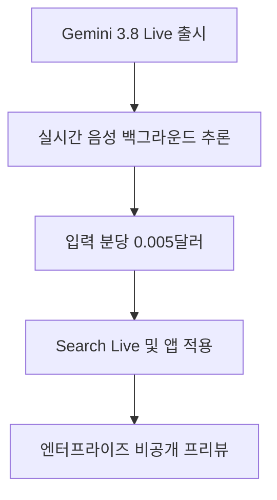

Google이 말하면서 동시에 생각하는 혁신적인 음성 인공지능 모델을 공개했습니다. 복잡한 질문을 받아도 어색한 침묵 없이 연속적인 목소리로 답하며 뒤편에서 연산을 이어갑니다. 스마트폰이나 컴퓨터로 인공지능과 음성 대화를 나눌 때 답답함을 느꼈던 분들에게 직접적인 변화가 찾아옵니다.

기존 음성 도우미는 어려운 연산이나 외부 도구를 부를 때마다 대화를 멈추고 기다려야 했습니다. 이번 변화로 사용자는 사람과 이야기하듯 막힘없는 음성 안내를 직접 경험하게 됩니다. 개발자와 일반 사용자 모두의 일상적인 상호작용 방식이 음성 중심으로 크게 전환될 준비를 마쳤습니다.

> **먼저 알아둘 용어**
>
> - **지연 시간**: 요청을 보내고 첫 답이 돌아오기까지 걸리는 시간입니다.
> - **추론**: 학습이 끝난 모델이 실제로 답을 만들어 내는 과정입니다. 이때 드는 계산 비용이 곧 사용료입니다.
> - **멀티모달**: 글뿐 아니라 이미지와 소리, 영상까지 함께 알아듣는 방식입니다.
> - **API**: 다른 프로그램에서 이 기능을 불러다 쓸 수 있게 열어 둔 창구입니다.
> - **프롬프트**: AI에게 건네는 지시문입니다. 같은 모델도 지시문에 따라 결과가 크게 달라집니다.
{: .prompt-info }

## 무슨 일이 벌어진 걸까?

Google과 Google DeepMind는 2026년 9월 15일 **Gemini 3.8 Live 및 Gemini 3.8 Live Extended Thinking**을 공식 출시했습니다 <sup class="source-citation"><a href="#source-1" aria-label="Google 출처">[1]</a></sup>. 이번 발표는 음성 기반 인공지능 기술이 단순히 소리를 문자로 바꾸고 텍스트를 다시 음성으로 읽어주는 초보적인 단계를 완전히 넘어섰음을 보여줍니다.

출시된 모델은 목적에 맞춰 두 가지 성격으로 뚜렷하게 나뉩니다. 기본형 모델인 Gemini 3.8 Live는 지연 시간을 대폭 줄인 음성 대화와 화면 시각 정보 맥락 파악에 최적화되어 있습니다 <sup class="source-citation"><a href="#source-2" aria-label="Google AI for Developers 출처">[2]</a></sup>. 반면 Gemini 3.8 Live Extended Thinking은 여러 단계를 거쳐야 하는 백그라운드 추론 작업을 매끄럽게 처리하도록 설계되었습니다 <sup class="source-citation"><a href="#source-1" aria-label="Google 출처">[1]</a></sup>. 여기서 백그라운드 추론이란 사용자가 화면을 보며 기다리지 않더라도 인공지능이 내부적으로 복잡한 논리 전개나 데이터 조회를 이어가는 연산 방식을 의미합니다.

기술적으로 가장 핵심적인 변화는 비동기 도구 호출 방식의 도입입니다. 비동기 도구 호출이란 음성 응답 스트리밍을 조금도 끊지 않은 채 외부 프로그램이나 검색 도구를 동시에 실행하는 기술을 뜻합니다. 과거 음성 도우미들은 외부 정보를 찾거나 연산을 시작하면 즉시 대답을 멈추고 수초 동안 어색한 정적을 만들었습니다. 이제는 Gemini 3.8 Live Extended Thinking이 부드러운 목소리를 계속 내보내며 동시에 뒤편에서 복잡한 도구 호출과 연산 과정을 완수합니다 <sup class="source-citation"><a href="#source-3" aria-label="TechRepublic 출처">[3]</a></sup>.

두 모델은 현재 개발자들을 대상으로 Gemini Live API와 Google AI Studio 콘솔에서 정식 버전으로 제공되고 있습니다 <sup class="source-citation"><a href="#source-2" aria-label="Google AI for Developers 출처">[2]</a></sup>. 일반 사용자가 마주하는 서비스 환경에서도 단계적인 변화가 진행 중입니다. Google은 Search Live 기능을 지원하기 위해 Gemini 3.8 Live를 순차 적용하고 있으며, Extended Thinking 모델은 Gemini 앱 전반으로 배포를 넓히고 있습니다 <sup class="source-citation"><a href="#source-1" aria-label="Google 출처">[1]</a></sup>.

실시간 멀티모달 환경에서 음성과 시각 정보를 동시에 주고받는 시스템 구축이 이제 누구나 접근 가능한 상용 개발 영역으로 들어왔습니다. 긴 침묵과 로딩 바 뒤에 숨어 있던 복잡한 추론 과정이 실시간 대화 속으로 녹아들기 시작한 셈입니다. 이로써 인공지능과의 상호작용은 글자를 타이핑하고 읽는 시대를 지나 사람과 전화를 주고받는 듯한 감각으로 발전했습니다.

<figure class="news-source-image">
  
  <figcaption>Google가 원문과 함께 공개한 이미지입니다. <a href="https://blog.google/innovation-and-ai/models-and-research/gemini-models/gemini-3-8-live-gemini-3-8-live-extended-thinking" target="_blank" rel="noopener noreferrer">출처: Google</a></figcaption>
</figure>

## 왜 지금 다들 이 이야기를 할까?

인공지능 음성 대화 분야에서 가장 까다로운 장벽이었던 지연 시간과 사고 정지 문제를 동시에 해결했기 때문입니다. 그동안 시중에 나온 많은 실시간 음성 서비스는 빠른 말대꾸에 집중하느라 깊은 논리적 사고를 하지 못했습니다. 반대로 똑똑하게 생각하는 고성능 추론 모델은 답변을 내놓기까지 한참 동안 조용해 대화 리듬이 완전히 깨졌습니다.

이번 출시는 말하는 행위와 생각하는 행위를 완전히 분리해 병렬로 엮어냈다는 점에서 주목받습니다. 이를 일상에 빗대어 설명하자면 전화 통화를 하면서 컴퓨터로 서류를 열어 필요한 정보를 막힘없이 찾아내는 능숙한 고객 상담원과 매우 비슷합니다. 통화를 끊거나 가만히 침묵하지 않고 자연스러운 목소리로 대화를 이어나가며 필요한 백그라운드 조회를 끝마칩니다.

개발자 접근성이 당일 곧바로 열렸다는 점도 큰 화제가 되고 있습니다. 단순히 연구소 안에서 이루어진 개념 증명이나 시연 동영상 공개에 머물지 않고 출시 당일부터 누구나 가져다 쓸 수 있도록 정식 API 형태로 배포되었습니다 <sup class="source-citation"><a href="#source-2" aria-label="Google AI for Developers 출처">[2]</a></sup>. 요금 체계 역시 모호한 견적 방식이 아니라 명확한 분당 단가로 투명하게 공개되었습니다.

| 모델 구분 | 핵심 특징 | 주요 배포 채널 |
| --- | --- | --- |
| Gemini 3.8 Live | 저지연 음성 대화 및 시각적 맥락 파악 최적화 | Search Live, Gemini Live API, Google AI Studio |
| Gemini 3.8 Live Extended Thinking | 음성 끊김 없는 다단계 백그라운드 추론과 비동기 도구 호출 | Gemini 앱, Gemini Live API, Google AI Studio |

사용 비용 체계도 매우 명확합니다. Gemini Live API의 사용료는 오디오 입력이 분당 0.005달러, 오디오 출력이 분당 0.018달러로 책정되었습니다 <sup class="source-citation"><a href="#source-1" aria-label="Google 출처">[1]</a></sup>. 소리를 듣고 이해하는 입력 과정과 소리를 합성해 내보내는 출력 단가가 구체적으로 나뉘어 있어 서비스 규모를 설계하기 수월합니다.

```chartjs
{
  "type": "bar",
  "data": {
    "labels": ["오디오 입력", "오디오 출력"],
    "datasets": [
      {
        "label": "분당 요금 (USD)",
        "data": [0.005, 0.018]
      }
    ]
  },
  "options": {
    "plugins": {
      "title": {
        "display": true,
        "text": "Gemini Live API 분당 이용 요금 비교"
      }
    }
  }
}
```

위 차트에서 확인할 수 있듯 듣는 입력 과정보다 말하는 출력 과정의 요금이 상대적으로 더 높게 책정되어 있습니다. 고품질 음성을 끊김 없이 합성해 실시간으로 스트리밍하는 연산에 더 많은 컴퓨팅 자원이 투입되기 때문입니다. 개발자들은 이러한 비용 구조를 사전에 파악하여 경제적인 음성 서비스를 기획할 수 있습니다.

## 그래서 우리에게 뭐가 달라질까?

일반 소비자가 매일 마주하는 음성 도우미의 답답함이 눈에 띄게 줄어듭니다. 스마트폰이나 스마트 디스플레이 속 도우미와 이야기할 때 흔히 겪던 차가운 무응답과 어색한 공백이 대폭 사라지기 때문입니다. 사용자는 딱딱한 기계에 음성 명령어를 입력하는 기분에서 벗어나 실제 동료나 비서와 함께 일하는 듯한 감각을 받게 됩니다.

예를 들어 여러 복잡한 일정을 한꺼번에 조율해야 하는 일상 상황을 가정해 볼 수 있습니다. 여러 약속 시간과 이동 경로, 외부 날씨 상황을 복합적으로 물어보았을 때 도우미는 대답을 멈추지 않습니다. 자연스러운 목소리로 첫마디를 건네며 뒷단에서 일정 데이터와 지도 도구를 비동기로 확인하고, 매끄러운 문장 흐름 속에서 최종 경로를 일목요연하게 전달합니다.

시각 정보를 실시간으로 함께 파악하는 능력도 생활 속 편의를 크게 끌어올립니다. 스마트폰 카메라로 고장 난 보일러 부품이나 가전제품 배선을 비추며 질문할 때, 기기 명칭과 수리 매뉴얼을 조회하는 동안에도 대화가 매끄럽게 지속됩니다. 저지연 음성 처리와 시각적 맥락 파악 기술이 동시에 맞물려 작동하기 때문입니다 <sup class="source-citation"><a href="#source-1" aria-label="Google 출처">[1]</a></sup>.

Gemini 앱을 사용하는 일반 독자라면 복잡한 기술 설정 없이 순차적으로 업그레이드되는 음성 환경을 직접 마주하게 됩니다 <sup class="source-citation"><a href="#source-1" aria-label="Google 출처">[1]</a></sup>. Search Live를 통해 필요한 정보를 검색할 때도 화면에 적힌 긴 문장을 일일이 읽어 내려갈 필요 없이 실시간 음성 대화를 통해 핵심 내용만 짚어낼 수 있습니다. 두 손이 자유롭지 않은 운전 중이나 요리 중에도 깊이 있는 정보 조회가 쉬워집니다.

<figure class="news-source-image">
  
  <figcaption>Google AI for Developers가 원문과 함께 공개한 이미지입니다. <a href="https://ai.google.dev/gemini-api/docs/models/gemini-3.8-live-extended-thinking" target="_blank" rel="noopener noreferrer">출처: Google AI for Developers</a></figcaption>
</figure>

## 그래서 내 업무에는 뭐가 달라지나

실무 현장에서 인공지능을 활용하는 기본 방식이 키보드 중심에서 음성 중심으로 전환될 수 있습니다. 텍스트 프롬프트 창에 장문의 업무 지시문을 타이핑하지 않아도 복잡한 업무 흐름을 말로 요청하고 즉각 확인할 수 있습니다. 개발 지식이 없는 일반 직장인이나 실무자라도 오늘 당장 실행해 볼 수 있는 행동은 다음과 같습니다.

첫째, 설치된 Gemini 앱의 최신 업데이트 상태를 확인하고 **음성 대화로 다단계 질문 던져보기**를 직접 실행합니다. 단순한 영어 번역이나 날씨 문의 같은 단답형 질문 대신, 여러 이해관계와 조건이 얽힌 기획서 아이디어 구체화를 말로 요청해 봅니다. 인공지능이 어색한 멈춤 없이 말을 이어나가며 뒤에서 논리를 정교하게 구성하는지 확인해 볼 수 있습니다.

둘째, 웹 브라우저에서 Google AI Studio 계정에 접속해 테스트 콘솔 환경을 둘러봅니다. 복잡한 코딩을 거치지 않아도 웹 기반 그래픽 화면에서 Gemini 3.8 Live 모델을 직접 선택해 마이크 입출력을 테스트할 수 있습니다. 고객 응대나 안내 데스크 운영 등 음성 업무가 많은 실무자라면 자사 서비스 프로세스에 도입할 만한 반응 속도인지 손쉽게 가늠할 수 있습니다.

셋째, 오디오 입력 분당 0.005달러와 출력 분당 0.018달러 기준을 바탕으로 **음성 자동화 비용 예산안**을 직접 계산해 봅니다 <sup class="source-citation"><a href="#source-1" aria-label="Google 출처">[1]</a></sup>. 콜센터 상담 보조나 오디오 안내 콘텐츠 제작에 실시간 음성 모델을 도입할 경우 한 달에 어느 정도의 운영비가 발생할지 명확한 숫자로 산출해 둘 수 있습니다. 막연한 추측 대신 구체적인 단가표를 손에 쥐고 의사결정을 내릴 수 있습니다.

## 아직은 선을 그어야 할 부분

기대만큼 뛰어난 기능과 유연성을 보여주지만 명확한 한계와 주의해야 할 조건도 분명히 존재합니다. 지금 당장 모든 조직과 엔터프라이즈 환경에서 곧바로 도입할 수 있는 완성형 도구는 아닙니다.

가장 먼저 주의 깊게 살펴볼 점은 **기업용 지원이 비공개 프리뷰 단계**에 머물러 있다는 사실입니다. Google은 대규모 조직을 위한 Gemini Enterprise 환경에서 Gemini 3.8 Live 및 Extended Thinking의 정식 출시 일정을 아직 확정해 발표하지 않았습니다. 강력한 데이터 보안과 사내 시스템 통합이 필수적인 대기업이나 금융 기관이라면 일반 제공 일정이 공개될 때까지 공식 채택 결정을 미루는 편이 현명합니다.

트래픽 처리 한도에 대한 정보도 사전에 점검해야 합니다. Google은 기본 등급별 기준 외에 이들 모델에 특화된 전용 API 전송량 제한 수치를 별도로 공개하지 않았습니다. 특정 시간대에 대규모 사용자가 일시에 몰리는 대고객 서비스나 이벤트용 앱을 구축하려는 개발사라면 API 호출 차단 위험을 감안해야 합니다.

마지막으로 음성이 매끄럽게 흘러나온다고 해서 백그라운드 추론의 논리적 결과가 항상 무결한 것은 아닙니다. 비동기 도구 호출 과정에서 오류가 발생하거나 중간 데이터가 잘못 해석될 경우 그럴듯한 거짓 정보가 자연스러운 목소리로 전달될 위험이 상존합니다. 법률 검토나 회계 정산처럼 오차가 치명적인 정밀 작업에서는 인공지능의 음성 답변을 무조건 맹신하지 말고 사람이 직접 교차 검증하는 절차를 반드시 유지해야 합니다.

<!-- primary-sources:start -->
## 원문과 버전 확인

- [발표 원문](https://blog.google/innovation-and-ai/models-and-research/gemini-models/gemini-3-8-live-gemini-3-8-live-extended-thinking)
- [Google AI for Developers](https://ai.google.dev/gemini-api/docs/models/gemini-3.8-live-extended-thinking)
- [TechRepublic](https://www.techrepublic.com/article/google-gemini-3-8-live-models)
<!-- primary-sources:end -->

<!-- internal-links:start -->
## 함께 읽으면 이해가 이어지는 글

- [GPT-5.6 Sol Ultrafast 프리뷰: 초당 750토큰과 실제 지연 시간 판단법]() — OpenAI와 Cerebras가 Cerebras 웨이퍼 스케일 엔진 기반으로 표준 대비 최대 14배 빠른 GPT-5.6 Sol Ultrafast mode API를 공개했습니다. 초당 최대 750토큰을 생성하여 실시간 음성 에이전트…
- [pocket-tts: 무거운 GPU 없이 CPU만으로 작동하는 실시간 AI 음성 합성의 원리]() — Kyutai Labs가 공개한 Pocket TTS는 단 1억 개의 매개변수와 신경망 오디오 코덱을 활용해 최신 CPU 환경에서 실시간 음성 합성과 목소리 복제를 수행하는 초경량 모델입니다. 이 글에서는 기술적 배경부터 세부 아키텍처…
- [노션 AI 사용법과 회의록 가격 총정리: 무료 체험 한계부터 실전 작성법까지]() — 노션 AI는 슬래시 명령어로 회의록을 자동 작성하고 요약본을 생성하는 강력한 도구입니다. 무료 요금제는 제한된 횟수의 체험만 제공하므로, 정식 업무에 쓰려면 멤버당 월 20달러 수준의 비즈니스 요금제가 필요합니다. 데스크톱 앱을 써야…
<!-- internal-links:end -->

## 자주 묻는 질문

### Gemini 3.8 Live Extended Thinking은 기존 음성 AI와 어떻게 다른가요?

말을 끊지 않고 대답하면서 동시에 백그라운드에서 복잡한 추론과 도구 호출을 비동기로 처리합니다. 어색한 침묵 없이 연속적인 대화 흐름을 유지하는 점이 가장 큰 차이입니다.

### 개발자가 Gemini 3.8 Live 모델을 쓰려면 얼마를 내야 하나요?

Gemini Live API 기준 오디오 입력은 분당 0.005달러이며 오디오 출력은 분당 0.018달러입니다. 개발자는 Google AI Studio와 Gemini Live API를 통해 정식으로 이용할 수 있습니다.

### 일반 스마트폰 사용자도 이 모델을 바로 써볼 수 있나요?

Google은 Search Live에 Gemini 3.8 Live를 순차 적용하고 있으며 Gemini 앱 전반에 Extended Thinking을 배포하고 있습니다. 앱 사용자라면 순차 배포 일정에 따라 기능을 접할 수 있습니다.

### 기업 고객을 위한 Gemini Enterprise 지원은 완료되었나요?

아닙니다. Gemini Enterprise 지원은 현재 비공개 프리뷰 단계이며 Google은 아직 정식 출시 일정을 확정해 공개하지 않았습니다.

## 직접 확인한 원문

<ol class="checked-source-list">
  <li id="source-1"><a href="https://blog.google/innovation-and-ai/models-and-research/gemini-models/gemini-3-8-live-gemini-3-8-live-extended-thinking" target="_blank" rel="noopener noreferrer">Google — Introducing Gemini 3.8 Live and 3.8 Live Extended Thinking</a> (2026-09-15)</li>
  <li id="source-2"><a href="https://ai.google.dev/gemini-api/docs/models/gemini-3.8-live-extended-thinking" target="_blank" rel="noopener noreferrer">Google AI for Developers — Gemini 3.8 Live Extended Thinking - Google AI for Developers</a> (2026-09-15)</li>
  <li id="source-3"><a href="https://www.techrepublic.com/article/google-gemini-3-8-live-models" target="_blank" rel="noopener noreferrer">TechRepublic — Google Launches Gemini 3.8 Live Models That Can Reason While They Talk</a> (2026-09-17)</li>
</ol>

> 이 글은 위 원문을 직접 확인해 작성했습니다. 가격, 기능 범위, 지역별 제공 여부는 게시 후 바뀔 수 있으니 실제 도입 전 공식 문서를 다시 확인하세요.
